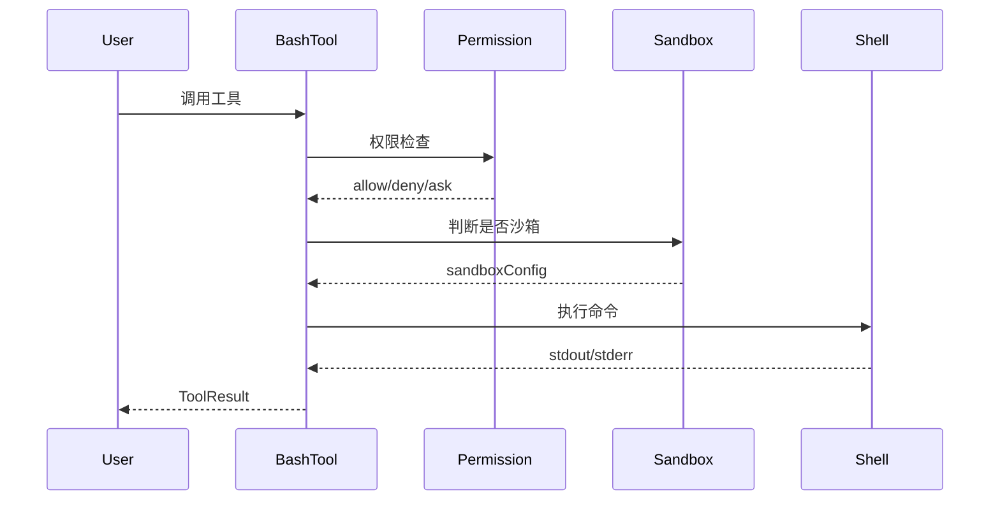

# Claude Code 源代码学习

[](https://claude.ai/code)
[](https://www.typescriptlang.org/)
[](https://bun.sh/)
[](https://react.dev/)
[]()

> 一本深入剖析 Claude Code CLI 工具源代码的技术书籍

---

## 📚 书籍简介

Claude Code 是 Anthropic 官方推出的 AI 编程助手 CLI 工具，代表了当前 AI 工具在软件开发领域的最佳实践。本书系统性地分析了 Claude Code 的完整源代码，帮助读者理解：

- **架构设计**：单体应用如何平衡启动速度与代码组织
- **工具系统**：45+ 工具如何构成可扩展能力矩阵
- **安全机制**：权限系统、沙箱隔离如何保护用户数据
- **终端 UI**：Ink 框架如何实现高性能终端渲染
- **AI 交互**：消息流转、上下文压缩、流式响应如何协作

---

## 🎯 适合读者

| 读者类型 | 预期收获 |
|----------|----------|
| CLI 工具开发者 | 学习终端工具的最佳实践 |
| TypeScript 工程师 | 理解大型 TS 项目的组织方式 |
| React 开发者 | 掌握 Ink 终端 UI 框架 |
| AI 工具研究者 | 了解 AI-CLI 的架构模式 |
| Claude Code 用户 | 深入理解工具工作原理 |

---

## 📖 目录概览

### 第一部分：基础架构篇（第1-4章）
项目概述、入口点分析、Feature Flag机制、配置系统

### 第二部分：核心抽象篇（第5-7章）
类型系统、AppState状态管理、React Context体系

### 第三部分：工具系统篇（第8-17章）
10章详解45个工具：Bash、文件、搜索、Agent、Web、任务、计划、Worktree等

### 第四部分：命令与技能篇（第18-21章）
命令系统架构、内置命令、技能系统设计与实战

### 第五部分：插件与扩展篇（第22-23章）
插件架构、Hook系统25种事件类型

### 第六部分：服务层篇（第24-28章）
API客户端、MCP协议、上下文压缩、LSP、分析服务

### 第七部分：Bridge与远程篇（第29-31章）
Bridge架构、REPL集成、远程会话管理

### 第八部分：多Agent协调篇（第32章）
Coordinator模式、Worker协作、Scratchpad

### 第九部分：权限与安全篇（第33-34章）
权限系统6种模式、沙箱安全边界

### 第十部分：终端UI篇（第35-37章）
Ink框架、焦点交互、组件架构

### 第十一部分：消息与对话篇（第38-40章）
Query Engine、消息处理、对话流程

### 第十二部分：高级主题篇（第41-45章）
语音模式、提示建议、远程设置、历史回放、调试诊断

### 第十三部分：总结展望篇（第46-50章）
架构原则、性能优化、可扩展设计、学习资源、附录

---

## 🚀 快速开始

### 在线阅读

```bash
# 克隆仓库
git clone https://github.com/your-repo/claude-wiki.git

# 进入目录
cd claude-wiki

# 使用任意 Markdown 阅读器打开
# 如 VS Code、Typora、Obsidian 等
```

### 推荐阅读顺序

| 阶段 | 章节 | 目标 |
|------|------|------|
| 入门 | 1-7 | 理解基础架构和核心抽象 |
| 进阶 | 8-23 | 掌握工具、命令、技能系统 |
| 深入 | 24-34 | 学习服务层和安全机制 |
| 实践 | 35-40 | 了解终端UI和消息处理 |
| 总结 | 46-50 | 回顾设计原则和扩展方法 |

---

## 📊 统计信息

| 项目 | 数量 |
|------|------|
| 总章节 | **50 章** |
| 总字数 | **~10 万字** |
| Mermaid 图表 | **50+ 个** |
| 代码引用 | **数百处** |
| 源文件分析 | **100+ 个** |

---

## 🗂️ 文件结构

```
claude-wiki/
├── README.md                   # 本文件
├── 目录索引.md                  # 详细目录与图表索引
├── 大纲.md                      # 原始大纲规划
└── chapters/
    ├── chapter-01-项目概述与开发环境.md
    ├── chapter-02-入口点与启动流程.md
    ├── ...
    ├── chapter-50-附录.md
    └── (共 50 个章节文件)
```

---

## 🔍 特色亮点

### Mermaid 架构图表

每章包含专业级架构图表：
- `flowchart` - 流程架构
- `sequenceDiagram` - 时序交互
- `classDiagram` - 类型关系
- `stateDiagram` - 状态流转

### 代码引用规范

所有代码分析标注文件路径和功能区域：
```
src/Tool.ts - Tool 接口定义（buildTool 工厂函数部分）
src/QueryEngine.ts - submitMessage 方法（消息提交核心逻辑）
```

> 注：具体行号可能随版本变化，请以最新源代码为准。

### 中文技术写作

适合中文技术读者：
- 专业术语准确翻译
- 代码注释中英对照
- 流畅的技术叙述

---

## 📝 内容示例

### 第9章：BashTool深度解析



### 核心类型定义

```typescript
// src/Tool.ts - Tool 接口核心定义
type Tool<Input = unknown, Output = unknown, P = unknown> = {
  name: string
  description: string
  inputSchema: ToolInputJSONSchema | ZodSchema
  call: (params: Input, context: ToolUseContext<P>) => Promise<ToolResult<Output>>
  renderToolUse?: (params: Input) => ReactNode
  isEnabled?: () => boolean
}
```

---

## 🔗 相关资源

| 资源 | 链接 |
|------|------|
| Claude Code 官方 | https://claude.ai/code |
| Anthropic API 文档 | https://docs.anthropic.com |
| MCP 协议规范 | https://modelcontextprotocol.io |
| Ink 框架 | https://github.com/vadimdemedes/ink |
| Bun Runtime | https://bun.sh |

---

## 📜 许可声明

本书内容仅供**学习研究**使用。Claude Code 源代码为 Anthropic 公司所有，本书旨在帮助开发者理解其架构设计，不涉及任何商业用途。

---

## 🤝 贡献指南

欢迎参与改进：

1. **内容修正**：发现错误请提交 Issue 或 PR
2. **章节补充**：可扩展更多源代码分析
3. **图表优化**：改进 Mermaid 图表的可读性
4. **翻译协助**：帮助改进技术术语表达

---

## 📮 联系方式

- GitHub Issues: [提交问题](https://github.com/your-repo/claude-wiki/issues)
- 讨论区: [参与讨论](https://github.com/your-repo/claude-wiki/discussions)

---

## ⚠️ 版权声明

本仓库基于 2026-03-31 从 Anthropic npm registry 泄露的 Claude Code 源码。所有原始源码版权归 Anthropic 所有。仅供学习和研究用途。

---

*更新日期：2026-04-15*
