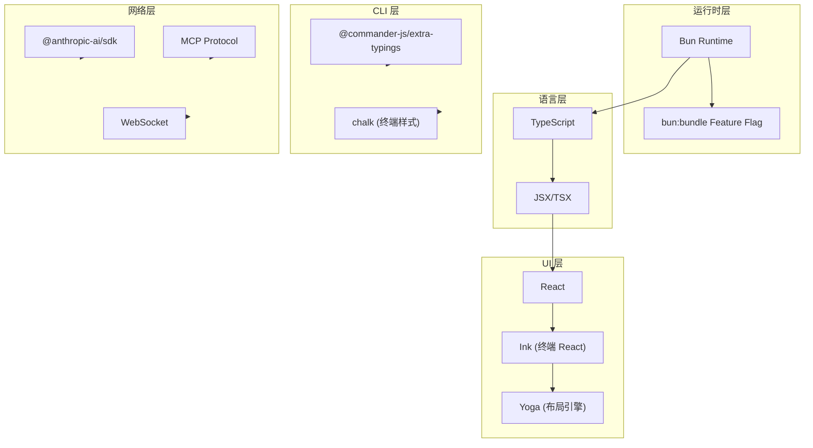
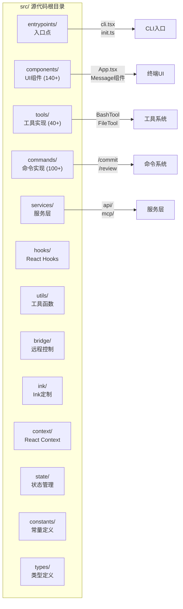
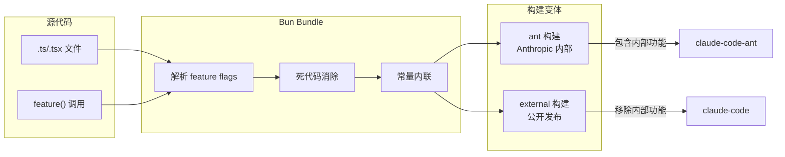
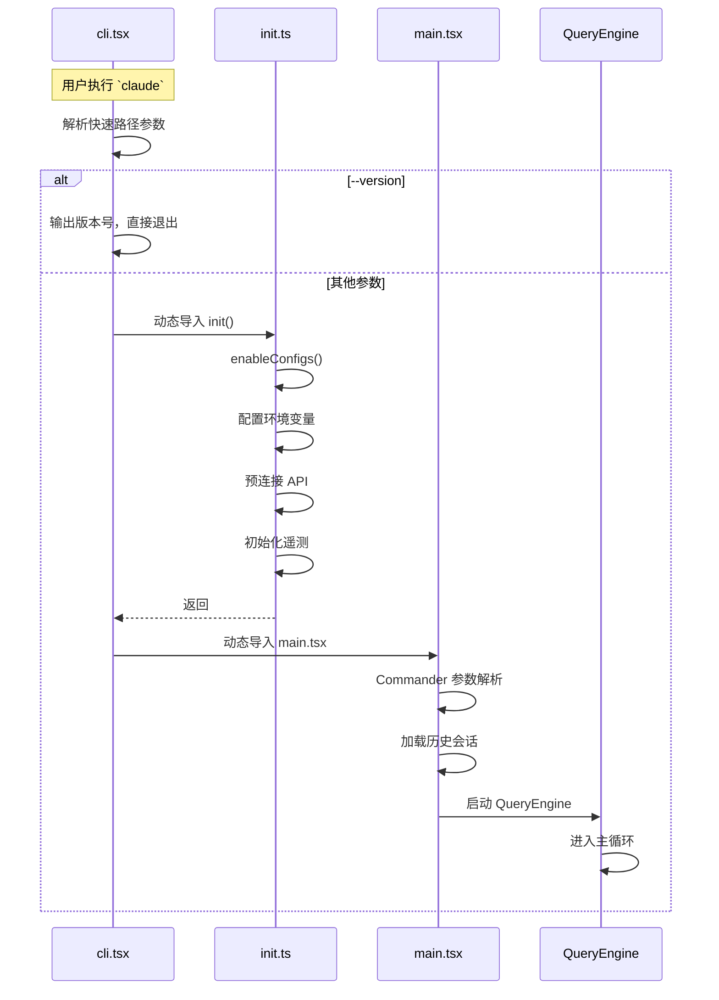

# 第一章：项目概述与开发环境

> 本章将介绍 Claude Code 的定位、技术栈、项目结构以及构建开发流程，为后续深入源码分析奠定基础。

---

## 1.1 Claude Code 是什么

Claude Code 是 Anthropic 官方推出的命令行界面（CLI）工具，是 Claude 大语言模型在终端环境中的直接交互入口。与 Web 版 Claude 或 API 集成方式不同，Claude Code 专为开发者设计，提供了以下核心能力：

### 1.1.1 核心定位

**代码助手的终端原生体验**。Claude Code 将 AI 能力直接嵌入开发者的日常工作环境——终端，让开发者无需离开命令行即可获得 AI 辅助。这种设计理念体现在：

- **文件系统深度集成**：直接读取、编辑、创建项目文件
- **Shell 命令执行**：在用户授权下执行构建、测试、Git 操作等
- **上下文感知**：自动识别项目类型、Git 状态、代码结构

### 1.1.2 与其他工具的差异

| 对比维度 | Claude Code | Web Claude | API 集成 |
|---------|------------|-----------|---------|
| 交互环境 | 终端原生 | 浏览器 | 应用嵌入 |
| 文件操作 | 直接读写 | 手动粘贴 | 需自行实现 |
| 命令执行 | 沙箱内执行 | 无 | 无 |
| 上下文获取 | 自动探测 | 手动提供 | 需自行实现 |
| 适用场景 | 开发工作流 | 通用对话 | 应用集成 |

### 1.1.3 为什么 Claude Code 重要

1. **效率提升**：开发者无需切换窗口，直接在终端完成代码审查、重构、调试等任务
2. **深度理解**：工具能读取完整项目结构，理解代码上下文，提供更精准的建议
3. **自动化执行**：从建议到执行的一站式体验，AI 可以直接修改代码、运行测试
4. **安全可控**：权限系统确保每一步操作都在用户知情和授权范围内

---

## 1.2 技术栈总览

Claude Code 采用现代 JavaScript/TypeScript 技术栈，结合终端 UI 的特殊需求进行了深度定制。

### 1.2.1 技术栈全景图



### 1.2.2 核心技术详解

#### Bun Runtime

Bun 是 Claude Code 的运行时和打包工具。选择 Bun 的核心原因：

- **极速启动**：Bun 的启动速度远超 Node.js，这对 CLI 工具至关重要
- **内置打包器**：`bun:bundle` 提供构建时 feature flag，实现死代码消除（DCE）
- **原生 TypeScript**：无需额外编译配置，直接运行 `.ts`/`.tsx` 文件

关键代码示例（`src/entrypoints/cli.tsx:1`）：

```typescript
import { feature } from 'bun:bundle';

// feature() 函数在构建时被替换为常量
// 未启用的 feature 分支会被 DCE 完全移除
if (feature('DUMP_SYSTEM_PROMPT') && args[0] === '--dump-system-prompt') {
  // 此代码块在 external 构建中不存在
  const { getSystemPrompt } = await import('../constants/prompts.js');
  console.log(await getSystemPrompt([], model));
}
```

#### React + Ink

Ink 是 React 在终端的渲染引擎，让 Claude Code 能用组件化思维构建终端 UI：

- **React 组件模型**：状态管理、生命周期、组件复用
- **Flexbox 布局**：通过 Yoga 布局引擎实现类似 CSS Flexbox 的终端布局
- **声明式 UI**：用 JSX 描述终端界面，而非手动控制 ANSI 转义序列

典型组件结构（`src/components/App.tsx`）：

```typescript
// 主应用组件，协调所有子组件
export function App({ ...props }) {
  return (
    <Box flexDirection="column">
      <Header />
      <MessageList />
      <TextInput />
      <StatusBar />
    </Box>
  );
}
```

#### TypeScript

TypeScript 提供类型安全和开发体验保障：

- **严格类型检查**：所有核心模块都有完整类型定义
- **接口契约**：Tool、Command、Service 等核心抽象都有明确类型
- **IDE 支持**：类型信息支持代码补全、错误检测

#### Commander.js

处理 CLI 参数解析和命令路由：

```typescript
// src/main.tsx 中的 Commander 配置
import { Command as CommanderCommand, Option } from '@commander-js/extra-typings';

const program = new CommanderCommand()
  .option('--model <model>', '指定模型')
  .option('--print', '打印模式')
  .option('--dangerously-skip-permissions', '跳过权限检查');
```

---

## 1.3 项目结构概览

Claude Code 的源代码位于 `src/` 目录，采用分层模块化设计。

### 1.3.1 目录结构树形图



### 1.3.2 核心目录详解

| 目录 | 文件数 | 职责说明 |
|------|--------|----------|
| `entrypoints/` | 8 | CLI 入口点，处理启动参数和快速路径 |
| `components/` | 140+ | React 组件，构建终端 UI 界面 |
| `tools/` | 40+ | Tool 实现，定义 AI 可执行的操作 |
| `commands/` | 100+ | 斜杠命令（如 `/commit`、`/review`） |
| `services/` | 35+ | 服务层：API 客户端、MCP、分析等 |
| `hooks/` | 85+ | React Hooks，状态订阅和副作用处理 |
| `utils/` | 300+ | 工具函数，通用逻辑封装 |
| `bridge/` | 30+ | 远程控制模式，WebSocket 通信 |
| `ink/` | 50+ | Ink 定制，React 终端渲染优化 |
| `context/` | 20+ | React Context，跨组件状态传递 |
| `state/` | 10+ | AppState 状态管理核心 |
| `constants/` | 30+ | 常量定义：提示词、配置、产品信息 |

### 1.3.3 关键文件说明

#### 入口文件

| 文件路径 | 职责 |
|----------|------|
| `src/entrypoints/cli.tsx` | CLI 最外层入口，处理 `--version` 等快速路径 |
| `src/entrypoints/init.ts` | 初始化序列，配置系统、遥测、OAuth 等 |
| `src/main.tsx` | 主应用入口，Commander 参数解析和主循环启动 |

#### 核心抽象文件

| 文件路径 | 职责 |
|----------|------|
| `src/Tool.ts` | Tool 类型定义和工具构建工厂 |
| `src/tools.ts` | 工具注册和聚合 |
| `src/commands.ts` | 命令类型定义和注册 |
| `src/context.ts` | React Context 聚合 |
| `src/QueryEngine.ts` | 消息处理和工具执行引擎 |
| `src/state/` | AppState 状态管理 |

---

## 1.4 构建系统与开发流程

### 1.4.1 构建系统架构

Claude Code 利用 Bun 的内置打包能力，通过 `bun:bundle` feature flag 机制实现构建变体管理。



#### Feature Flag 机制

`bun:bundle` 的 `feature()` 函数在构建时被替换为布尔常量，未启用的分支会被完全移除：

```typescript
// 构建前
if (feature('DUMP_SYSTEM_PROMPT')) {
  // 内部调试功能
}

// ant 构建后（feature='DUMP_SYSTEM_PROMPT' 为 true）
if (true) {
  // 内部调试功能 - 保留
}

// external 构建后（feature='DUMP_SYSTEM_PROMPT' 为 false）
// 整个 if 块被 DCE 移除
```

### 1.4.2 构建变体差异

| Feature | ant 构建 | external 构建 |
|---------|---------|---------------|
| `DUMP_SYSTEM_PROMPT` | 保留 | 移除 |
| `DAEMON` | 保留 | 移除 |
| `BRIDGE_MODE` | 保留 | 移除 |
| `CHICAGO_MCP` | 保留 | 移除 |
| `ABLATION_BASELINE` | 保留 | 移除 |

### 1.4.3 开发流程

#### 本地开发

```bash
# 开发模式运行（假设项目已配置）
bun run dev

# 或直接运行入口
bun run src/entrypoints/cli.tsx
```

#### 构建发布

```bash
# 构建 external 变体
bun build ./src/entrypoints/cli.tsx --outfile=dist/cli.js

# 构建 ant 变体（内部）
bun build ./src/entrypoints/cli.tsx --outfile=dist/cli-ant.js --target=bun
```

### 1.4.4 启动流程概览

Claude Code 的启动遵循分层初始化策略：



### 1.4.5 快速路径设计

CLI 工具的启动速度至关重要。Claude Code 通过快速路径（Fast Path）设计，将部分操作延迟加载：

```typescript
// src/entrypoints/cli.tsx:36-42
// --version 快速路径：零模块加载
if (args.length === 1 && args[0] === '--version') {
  // MACRO.VERSION 在构建时内联
  console.log(`${MACRO.VERSION} (Claude Code)`);
  return;  // 直接退出，不加载任何其他模块
}
```

这种设计确保 `claude --version` 的响应时间在毫秒级别，而非秒级别。

---

## 总结

本章介绍了 Claude Code 的核心定位、技术栈选型、项目结构以及构建流程：

1. **定位**：终端原生的 AI 代码助手，深度集成文件系统和 Shell
2. **技术栈**：Bun Runtime + TypeScript + React/Ink，专为 CLI 场景优化
3. **结构**：分层模块化，入口、组件、工具、命令、服务各司其职
4. **构建**：`bun:bundle` feature flag 实现构建变体，DCE 移除未使用代码

后续章节将深入各个核心模块，从入口流程到工具系统，逐步揭示 Claude Code 的完整架构。

---

**代码引用索引**：

| 引用位置 | 说明 |
|----------|------|
| `src/entrypoints/cli.tsx:1` | `bun:bundle` feature 导入 |
| `src/entrypoints/cli.tsx:36-42` | --version 快速路径 |
| `src/entrypoints/cli.tsx:53` | --dump-system-prompt 快速路径 |
| `src/entrypoints/init.ts:57` | init() 函数入口 |
| `src/main.tsx:1` | 主应用模块入口 |
| `src/components/App.tsx` | 主应用组件 |
| `src/Tool.ts` | Tool 核心定义 |
| `src/QueryEngine.ts` | 消息处理引擎 |