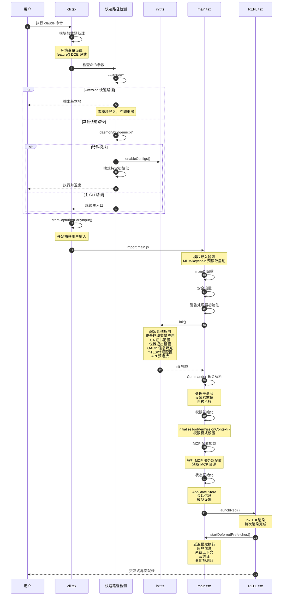

# 第二章：入口点与启动流程

## 2.1 引言：为什么理解入口点很重要

在分析任何复杂的软件系统时，入口点是最关键的起点。Claude Code 作为一款命令行工具，其启动流程涉及多个阶段：从命令行参数解析、快速路径检测、到完整的初始化序列。理解这些入口点有助于我们：

1. **把握整体架构脉络**：入口点是代码执行的起点，从这里可以追踪到核心模块的加载顺序
2. **理解性能优化策略**：Claude Code 大量使用"快速路径"（fast-path）来避免不必要的模块加载
3. **掌握特殊模式处理**：daemon 模式、bridge 模式、MCP 服务器等特殊入口的处理逻辑
4. **追踪调试问题**：启动阶段的错误往往需要在入口点处定位

本章将深入分析 Claude Code 的三个核心入口文件：`cli.tsx`、`init.ts` 和 `main.tsx`，并通过时序图展示完整的启动流程。

---

## 2.2 CLI 入口：cli.tsx

`cli.tsx` 是 Claude Code 的最外层入口点，负责命令路由和快速路径检测。其核心设计理念是**最小化启动延迟**——通过动态导入和条件判断，避免在不需要时加载重型模块。

### 2.2.1 环境预处理

文件开头的预处理代码在模块加载时立即执行：

```typescript
// cli.tsx 文件开头：环境预处理
import { feature } from 'bun:bundle';

// 修复 corepack 自动 pinning 问题
process.env.COREPACK_ENABLE_AUTO_PIN = '0';

// CCR 环境下设置子进程最大堆内存
if (process.env.CLAUDE_CODE_REMOTE === 'true') {
  const existing = process.env.NODE_OPTIONS || '';
  process.env.NODE_OPTIONS = existing ? `${existing} --max-old-space-size=8192` : '--max-old-space-size=8192';
}

// Ablation baseline 实验环境配置
if (feature('ABLATION_BASELINE') && process.env.CLAUDE_CODE_ABLATION_BASELINE) {
  for (const k of ['CLAUDE_CODE_SIMPLE', 'CLAUDE_CODE_DISABLE_THINKING', ...]) {
    process.env[k] ??= '1';
  }
}
```

这段代码展示了几个重要特性：
- `feature()` 函数来自 Bun 的 bundle 系统，用于构建时的死代码消除（DCE）
- 环境变量的设置必须在模块导入前完成，因为某些工具会在导入时捕获环境变量值

### 2.2.2 快速路径架构

`main()` 函数的核心是**快速路径检测**——一系列条件分支，每个分支处理特定的命令模式并提前退出，避免加载完整的 CLI 模块：

```typescript
// cli.tsx 中的 main() 函数：快速路径检测核心
async function main(): Promise<void> {
  const args = process.argv.slice(2);

  // 快速路径：--version/-v，零模块加载
  if (args.length === 1 && (args[0] === '--version' || args[0] === '-v' || args[0] === '-V')) {
    console.log(`${MACRO.VERSION} (Claude Code)`);  // MACRO.VERSION 在构建时内联
    return;
  }
  // ... 其他快速路径
}
```

`--version` 是最极致的快速路径：**零模块导入**，直接输出构建时内联的版本号并退出。这种设计将版本查询的启动延迟降到毫秒级。

### 2.2.3 快速路径详解

下表列出了所有快速路径及其用途：

| 快速路径 | 触发条件 | 用途 |
|---------|---------|------|
| `--version` | 单参数 `-v/--version/-V` | 版本查询，零导入 |
| `--dump-system-prompt` | `--dump-system-prompt` 参数 | 输出渲染后的系统提示词，用于评估 |
| `--claude-in-chrome-mcp` | Chrome MCP 服务器模式 | 浏览器扩展集成 |
| `--chrome-native-host` | Chrome Native Messaging Host | 浏览器原生通信 |
| `--computer-use-mcp` | Computer Use MCP 服务器 | 自动化操作服务 |
| `--daemon-worker` | Daemon 工作进程 | 长驻后台工作进程 |
| `remote-control/bridge` | Bridge 远程控制模式 | 本地机器作为远程环境 |
| `daemon` | Daemon 主进程 | 长驻后台监管进程 |
| `ps/logs/attach/kill` | 后台会话管理 | 管理已注册的后台会话 |
| `--bg/--background` | 后台运行标志 | 将会话置于后台运行 |
| `new/list/reply` | Template job 命令 | 模板任务管理 |
| `environment-runner` | BYOC 环境运行器 | 自定义环境运行 |
| `self-hosted-runner` | 自托管运行器 | 自托管 Runner API 集成 |
| `--worktree --tmux` | Worktree + Tmux 组合 | 在 Tmux 中启动 Worktree |

### 2.2.4 Bridge 模式分析

Bridge 模式是一个重要的远程控制功能，允许将本地机器作为远程开发环境：

```typescript
// cli.tsx 中的 Bridge 模式入口
if (feature('BRIDGE_MODE') && (args[0] === 'remote-control' || args[0] === 'rc' || ...)) {
  profileCheckpoint('cli_bridge_path');

  // 1. 启用配置系统
  enableConfigs();

  // 2. OAuth 认证检查（必须在 GrowthBook 检查之前）
  if (!getClaudeAIOAuthTokens()?.accessToken) {
    exitWithError(BRIDGE_LOGIN_ERROR);
  }

  // 3. GrowthBook 功能门控检查
  const disabledReason = await getBridgeDisabledReason();
  if (disabledReason) {
    exitWithError(`Error: ${disabledReason}`);
  }

  // 4. 版本检查
  const versionError = checkBridgeMinVersion();
  if (versionError) {
    exitWithError(versionError);
  }

  // 5. 组织策略检查
  await waitForPolicyLimitsToLoad();
  if (!isPolicyAllowed('allow_remote_control')) {
    exitWithError("Error: Remote Control is disabled by your organization's policy.");
  }

  await bridgeMain(args.slice(1));
  return;
}
```

Bridge 模式的检查顺序体现了安全设计原则：
1. **认证优先**：OAuth 检查必须在功能门控之前，否则 GrowthBook 缺少用户上下文
2. **功能门控**：检查运行时功能开关
3. **版本兼容**：确保客户端版本满足最低要求
4. **组织策略**：最终的安全护栏

### 2.2.5 Daemon 模式分析

Daemon 是 Claude Code 的长驻后台监管进程：

```typescript
// cli.tsx 中的 Daemon 模式入口
if (feature('DAEMON') && args[0] === 'daemon') {
  profileCheckpoint('cli_daemon_path');
  enableConfigs();
  initSinks();  // 初始化分析 sink
  await daemonMain(args.slice(1));
  return;
}
```

Daemon 模式与 Bridge 模式的区别：
- **初始化更轻量**：只调用 `initSinks()` 而不是完整的 `init()`
- **工作进程分离**：`--daemon-worker` 路径用于子进程，不启用配置和分析

### 2.2.6 主 CLI 入口

当所有快速路径都不匹配时，进入完整的 CLI 加载：

```typescript
// cli.tsx 中的主 CLI 入口路径
const { startCapturingEarlyInput } = await import('../utils/earlyInput.js');
startCapturingEarlyInput();  // 开始捕获早期输入

profileCheckpoint('cli_before_main_import');
const { main: cliMain } = await import('../main.js');
profileCheckpoint('cli_after_main_import');
await cliMain();
profileCheckpoint('cli_after_main_complete');
```

`startCapturingEarlyInput()` 是一个重要的优化：在加载重型模块的同时，预先捕获用户可能的输入，减少首次交互的延迟感知。

---

## 2.3 初始化序列：init.ts

`init.ts` 负责 Claude Code 的核心初始化工作，包括配置加载、网络设置、安全配置和后台服务的启动。

### 2.3.1 init 函数架构

`init` 函数使用 `memoize` 包装，确保只执行一次：

```typescript
// init.ts 中的 init 函数：核心初始化序列
export const init = memoize(async (): Promise<void> => {
  const initStartTime = Date.now();
  profileCheckpoint('init_function_start');

  try {
    // 1. 启用配置系统
    enableConfigs();
    profileCheckpoint('init_configs_enabled');

    // 2. 应用安全环境变量
    applySafeConfigEnvironmentVariables();
    applyExtraCACertsFromConfig();

    // 3. 设置优雅退出
    setupGracefulShutdown();

    // 4. 初始化 1P 事件日志
    void Promise.all([
      import('../services/analytics/firstPartyEventLogger.js'),
      import('../services/analytics/growthbook.js'),
    ]).then(([fp, gb]) => {
      fp.initialize1PEventLogging();
      gb.onGrowthBookRefresh(() => void fp.reinitialize1PEventLoggingIfConfigChanged());
    });

    // 5. OAuth 信息填充
    void populateOAuthAccountInfoIfNeeded();

    // 6. JetBrains IDE 检测
    void initJetBrainsDetection();

    // 7. GitHub 仓库检测
    void detectCurrentRepository();

    // 8. 远程设置加载初始化
    if (isEligibleForRemoteManagedSettings()) {
      initializeRemoteManagedSettingsLoadingPromise();
    }

    // 9. mTLS 配置
    configureGlobalMTLS();

    // 10. 代理配置
    configureGlobalAgents();

    // 11. API 预连接
    preconnectAnthropicApi();

    // 12. 上游代理初始化（CCR 环境）
    if (isEnvTruthy(process.env.CLAUDE_CODE_REMOTE)) {
      const { initUpstreamProxy } = await import('../upstreamproxy/upstreamproxy.js');
      await initUpstreamProxy();
    }

    // 13. Windows Git Bash 设置
    setShellIfWindows();

    // 14. LSP 管理器清理注册
    registerCleanup(shutdownLspServerManager);

    // 15. Swarm 团队清理注册
    registerCleanup(async () => {
      const { cleanupSessionTeams } = await import('../utils/swarm/teamHelpers.js');
      await cleanupSessionTeams();
    });

    // 16. Scratchpad 目录初始化
    if (isScratchpadEnabled()) {
      await ensureScratchpadDir();
    }
  } catch (error) {
    if (error instanceof ConfigParseError) {
      // 非交互模式：直接输出错误
      if (getIsNonInteractiveSession()) {
        process.stderr.write(`Configuration error in ${error.filePath}: ${error.message}\n`);
        gracefulShutdownSync(1);
        return;
      }
      // 交互模式：显示配置错误对话框
      return import('../components/InvalidConfigDialog.js').then(m =>
        m.showInvalidConfigDialog({ error })
      );
    }
    throw error;
  }
});
```

### 2.3.2 配置系统启用

`enableConfigs()` 是配置系统的核心入口：

```typescript
// init.ts 中的配置系统启用
enableConfigs();
logForDiagnosticsNoPII('info', 'init_configs_enabled', {
  duration_ms: Date.now() - configsStart,
});
profileCheckpoint('init_configs_enabled');
```

配置加载后，应用环境变量：

```typescript
// init.ts 中的环境变量应用
applySafeConfigEnvironmentVariables();  // 安全环境变量（信任对话框之前）
applyExtraCACertsFromConfig();  // CA 证书（必须在 TLS 连接之前）
```

关键点：`applyExtraCACertsFromConfig()` 必须在任何 TLS 连接之前执行，因为 Bun 使用 BoringSSL 缓存 TLS 证书存储。

### 2.3.3 网络配置

网络配置包括 mTLS 和代理两部分：

```typescript
// init.ts 中的网络配置序列
configureGlobalMTLS();  // 全局 mTLS 设置
configureGlobalAgents();  // 全局 HTTP agents（代理和 mTLS）
preconnectAnthropicApi();  // 预连接 Anthropic API
```

`preconnectAnthropicApi()` 是一个性能优化：在 TCP+TLS 握手（~100-200ms）期间，并行执行其他初始化工作，减少首次 API 请求的延迟。

### 2.3.4 遥测初始化

遥测初始化延迟到信任对话框之后：

```typescript
// init.ts 中的遥测初始化函数
export function initializeTelemetryAfterTrust(): void {
  if (isEligibleForRemoteManagedSettings()) {
    // SDK/headless 模式：立即初始化
    if (getIsNonInteractiveSession() && isBetaTracingEnabled()) {
      void doInitializeTelemetry();
    }
    // 交互模式：等待远程设置加载
    void waitForRemoteManagedSettingsToLoad()
      .then(async () => {
        applyConfigEnvironmentVariables();  // 重新应用以包含远程设置
        await doInitializeTelemetry();
      });
  } else {
    void doInitializeTelemetry();
  }
}
```

遥测模块使用延迟加载策略，避免在启动时加载 ~400KB 的 OpenTelemetry + protobuf 模块：

```typescript
// init.ts 中的遥测状态设置
async function setMeterState(): Promise<void> {
  const { initializeTelemetry } = await import('../utils/telemetry/instrumentation.js');
  const meter = await initializeTelemetry();
  if (meter) {
    const createAttributedCounter = (name: string, options: MetricOptions): AttributedCounter => {
      const counter = meter?.createCounter(name, options);
      return {
        add(value: number, additionalAttributes: Attributes = {}) {
          const currentAttributes = getTelemetryAttributes();
          counter?.add(value, { ...currentAttributes, ...additionalAttributes });
        },
      };
    };
    setMeter(meter, createAttributedCounter);
    getSessionCounter()?.add(1);  // 会话计数
  }
}
```

---

## 2.4 主应用架构：main.tsx

`main.tsx` 是 Claude Code 的主应用入口，负责命令解析、状态初始化和 REPL 启动。

### 2.4.1 模块导入优化

文件开头展示了精心设计的导入策略：

```typescript
// main.tsx 文件开头：预读取启动
import { profileCheckpoint, profileReport } from './utils/startupProfiler.js';
profileCheckpoint('main_tsx_entry');

import { startMdmRawRead } from './utils/settings/mdm/rawRead.js';
startMdmRawRead();  // 启动 MDM 子进程读取

import { startKeychainPrefetch } from './utils/secureStorage/keychainPrefetch.js';
startKeychainPrefetch();  // 启动 macOS keychain 预读取
```

这两个函数在模块导入阶段执行，目的是：
- **并行化 I/O**：MDM 子进程和 keychain 读取是慢操作，提前启动可以与后续 ~135ms 的模块导入并行
- **缓存预热**：确保首次使用时数据已就绪

### 2.4.2 动态导入与死代码消除

条件导入使用 `require()` 配合 `feature()` 门控：

```typescript
// main.tsx 中的条件导入
const getTeammateUtils = () => require('./utils/teammate.js');
const coordinatorModeModule = feature('COORDINATOR_MODE')
  ? require('./coordinator/coordinatorMode.js')
  : null;
const assistantModule = feature('KAIROS')
  ? require('./assistant/index.js')
  : null;
```

这种模式有两个目的：
1. **避免循环依赖**：使用 `require()` 延迟加载
2. **构建时 DCE**：`feature()` 返回常量时，不可达代码被消除

### 2.4.3 main 函数结构

```typescript
// main.tsx 中的 main() 函数入口
export async function main() {
  profileCheckpoint('main_function_start');

  // 安全设置：防止 Windows PATH 劫持
  process.env.NoDefaultCurrentDirectoryInExePath = '1';

  // 初始化警告处理器
  initializeWarningHandler();

  // 退出时重置光标
  process.on('exit', () => resetCursor());

  // SIGINT 处理（print 模式有特殊处理）
  process.on('SIGINT', () => {
    if (process.argv.includes('-p') || process.argv.includes('--print')) {
      return;  // print.ts 会处理
    }
    process.exit(0);
  });
}
```

### 2.4.4 深度链接处理

深度链接（cc:// 协议）的处理在 main 函数早期执行：

```typescript
// main.tsx 中的深度链接处理
if (feature('DIRECT_CONNECT')) {
  const rawCliArgs = process.argv.slice(2);
  const ccIdx = rawCliArgs.findIndex(a => a.startsWith('cc://') || a.startsWith('cc+unix://'));
  if (ccIdx !== -1 && _pendingConnect) {
    const ccUrl = rawCliArgs[ccIdx]!;
    const parsed = parseConnectUrl(ccUrl);
    _pendingConnect.dangerouslySkipPermissions = rawCliArgs.includes('--dangerously-skip-permissions');

    if (rawCliArgs.includes('-p') || rawCliArgs.includes('--print')) {
      // Headless：重写为内部 open 子命令
      process.argv = [process.argv[0]!, process.argv[1]!, 'open', ccUrl, ...stripped];
    } else {
      // Interactive：设置 pending connect 并继续
      _pendingConnect.url = parsed.serverUrl;
      _pendingConnect.authToken = parsed.authToken;
    }
  }
}
```

### 2.4.5 延迟预取

`startDeferredPrefetches()` 在 REPL 渲染后执行，避免阻塞首次渲染：

```typescript
// main.tsx 中的延迟预取函数
export function startDeferredPrefetches(): void {
  // --bare 或性能测试模式：跳过所有预取
  if (isEnvTruthy(process.env.CLAUDE_CODE_EXIT_AFTER_FIRST_RENDER) || isBareMode()) {
    return;
  }

  // 用户信息预取
  void initUser();
  void getUserContext();
  prefetchSystemContextIfSafe();

  // 云提供商凭证预取
  if (isEnvTruthy(process.env.CLAUDE_CODE_USE_BEDROCK)) {
    void prefetchAwsCredentialsAndBedRockInfoIfSafe();
  }
  if (isEnvTruthy(process.env.CLAUDE_CODE_USE_VERTEX)) {
    void prefetchGcpCredentialsIfSafe();
  }

  // 文件计数预取
  void countFilesRoundedRg(getCwd(), AbortSignal.timeout(3000), []);

  // 分析和功能门控
  void initializeAnalyticsGates();
  void prefetchOfficialMcpUrls();
  void refreshModelCapabilities();

  // 变化检测器
  void settingsChangeDetector.initialize();
  void skillChangeDetector.initialize();
}
```

---

## 2.5 启动流程时序图

下图展示了 Claude Code 从命令行调用到 REPL 渲染的完整启动流程：



**图 2-1：Claude Code 启动流程时序图**

### 2.5.1 关键时序节点分析

| 节点 | checkpoint | 说明 |
|-----|-----------|------|
| CLI 入口 | `cli_entry` | 命令行解析开始 |
| 快速路径检测 | `cli_*_path` | 各快速路径的检测点 |
| 主导入前 | `cli_before_main_import` | 主模块导入前 |
| 主导入后 | `cli_after_main_import` | 主模块导入完成 |
| main 函数开始 | `main_function_start` | main() 函数执行开始 |
| 配置启用 | `init_configs_enabled` | enableConfigs() 完成 |
| 安全环境变量 | `init_safe_env_vars_applied` | 环境变量应用完成 |
| 优雅退出 | `init_after_graceful_shutdown` | 退出处理设置完成 |
| 网络配置 | `init_network_configured` | mTLS/代理配置完成 |
| init 完成 | `init_function_end` | init() 完成 |

### 2.5.2 性能优化策略总结

Claude Code 的启动性能优化采用多层策略：

1. **快速路径提前退出**：避免不必要的模块加载
2. **并行 I/O 启动**：MDM/keychain 预读取在模块导入阶段并行执行
3. **延迟加载**：遥测、gRPC exporter 等重型模块延迟到需要时加载
4. **动态导入**：所有快速路径使用 `await import()` 而非静态导入
5. **预连接**：API 预连接与初始化并行，减少首次请求延迟
6. **延迟预取**：用户信息、系统上下文等在 REPL 渲染后执行
7. **早期输入捕获**：在模块加载时预先捕获用户输入

---

## 2.6 小结

本章深入分析了 Claude Code 的入口点架构：

- **cli.tsx**：快速路径检测和命令路由，通过动态导入和条件判断最小化启动延迟
- **init.ts**：核心初始化序列，包括配置、网络、安全和后台服务
- **main.tsx**：主应用入口，命令解析、状态初始化和 REPL 启动

三个文件通过明确的职责划分和精心的性能优化，构建了一个响应迅速的命令行工具。快速路径机制确保常见操作（如版本查询）几乎零延迟，而延迟加载策略确保重型模块只在需要时加载。

下一章将分析 Claude Code 的配置系统，深入了解 `enableConfigs()` 的内部实现和配置层次结构。