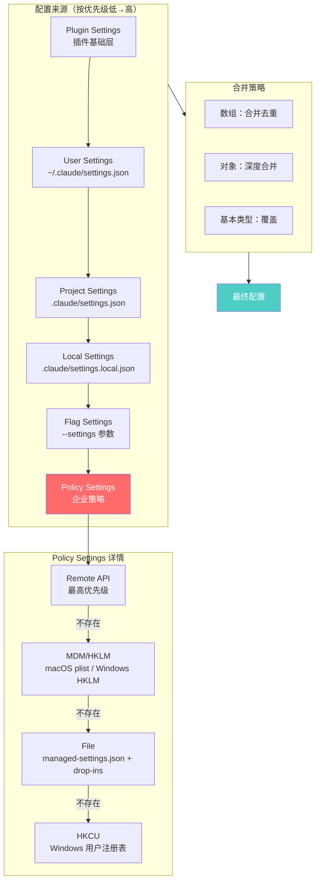

# 第四章：配置系统

> 配置系统是 Claude Code 运行时行为的核心控制层。它通过多层次的配置文件和环境变量，为用户、项目和企业提供灵活的定制能力。

---

## 4.1 配置系统的重要性

Claude Code 的配置系统承担着以下关键职责：

1. **行为定制**：控制模型选择、权限规则、Hook 钩子等核心行为
2. **环境适配**：适配不同操作系统、企业环境和开发场景
3. **安全边界**：通过权限系统和沙箱配置保障执行安全
4. **企业管控**：支持 IT 管理员通过策略设置统一管控团队配置

配置系统的设计遵循以下原则：

- **分层覆盖**：低优先级配置被高优先级配置覆盖
- **安全优先**：项目级配置中的敏感字段需要信任确认
- **向后兼容**：新增配置字段不影响旧版本用户
- **性能优化**：配置缓存避免重复文件 I/O

---

## 4.2 配置文件层次结构

Claude Code 的配置来源按优先级从低到高排列：

```text
优先级（低 → 高）：
  Plugin Settings（插件基础层）
  → User Settings（用户全局配置）
  → Project Settings（项目共享配置）
  → Local Settings（项目本地配置，gitignored）
  → Flag Settings（CLI 参数配置）
  → Policy Settings（企业策略配置）
```

### 4.2.1 配置来源详解

| 来源 | 文件路径 | 说明 | 可编辑 |
|------|---------|------|--------|
| userSettings | `~/.claude/settings.json` | 用户全局配置，跨所有项目生效 | 是 |
| projectSettings | `$PROJECT/.claude/settings.json` | 项目共享配置，可提交到 Git | 是 |
| localSettings | `$PROJECT/.claude/settings.local.json` | 项目本地配置，自动 gitignored | 是 |
| flagSettings | `--settings` 参数指定路径 | CLI 参数传入的配置文件 | 否 |
| policySettings | 见下表企业配置路径 | 企业 IT 管理的策略配置 | 否 |

企业策略配置（policySettings）的来源路径：

| 平台 | 路径 | 说明 |
|------|------|------|
| macOS | `/Library/Application Support/ClaudeCode/managed-settings.json` | 需要 root 权限写入 |
| Windows | `C:\Program Files\ClaudeCode\managed-settings.json` | 需要 admin 权限写入 |
| Linux | `/etc/claude-code/managed-settings.json` | 需要 root 权限写入 |

企业配置还支持 **drop-in 目录**，允许多个团队独立管理配置片段：

```text
/Library/Application Support/ClaudeCode/
├── managed-settings.json      # 基础配置
└── managed-settings.d/        # drop-in 目录
    ├── 10-security.json       # 安全策略
    ├── 20-otel.json           # 遥测配置
    └── 30-mcp.json            # MCP 允许列表
```

Drop-in 文件按字母顺序合并，后加载的文件覆盖先加载的。

### 4.2.2 配置层次合并流程图



*图 4-1：配置层次结构与合并策略*

---

## 4.3 settings.json 与 settings.local.json 结构

### 4.3.1 文件位置与用途对比

两种项目配置文件的区别：

| 属性 | `settings.json` | `settings.local.json` |
|------|-----------------|----------------------|
| 路径 | `.claude/settings.json` | `.claude/settings.local.json` |
| Git | 通常提交到仓库 | 自动添加到 `.gitignore` |
| 用途 | 团队共享配置 | 个人本地偏好 |
| 示例 | 权限规则、MCP 服务器 | 个人 API 密钥、模型偏好 |

### 4.3.2 Settings Schema 核心字段

配置文件使用 JSON Schema 验证，核心字段定义如下：

```typescript
// src/utils/settings/types.ts 中的 SettingsSchema 定义
export const SettingsSchema = lazySchema(() =>
  z.object({
    // JSON Schema 引用
    $schema: z.literal(CLAUDE_CODE_SETTINGS_SCHEMA_URL).optional(),

    // 模型配置
    model: z.string().optional().describe('覆盖默认模型'),
    availableModels: z.array(z.string()).optional()
      .describe('企业允许的模型列表'),

    // 权限配置
    permissions: PermissionsSchema().optional()
      .describe('工具使用权限配置'),

    // 环境变量
    env: EnvironmentVariablesSchema().optional()
      .describe('Claude Code 会话的环境变量'),

    // Hook 配置
    hooks: HooksSchema().optional()
      .describe('工具执行前/后的自定义命令'),

    // 沙箱配置
    sandbox: SandboxSettingsSchema().optional(),

    // MCP 配置
    allowedMcpServers: z.array(AllowedMcpServerEntrySchema()).optional(),
    deniedMcpServers: z.array(DeniedMcpServerEntrySchema()).optional(),

    // 插件配置
    enabledPlugins: z.record(z.string(), z.union([...])).optional(),
    strictKnownMarketplaces: z.array(MarketplaceSourceSchema()).optional(),

    // 其他行为配置
    cleanupPeriodDays: z.number().nonnegative().int().optional(),
    outputStyle: z.string().optional(),
    language: z.string().optional(),
    // ... 更多字段
  })
)
```

### 4.3.3 典型配置示例

**用户全局配置示例 (`~/.claude/settings.json`)：**

```json
{
  "$schema": "https://json.schemastore.org/claude-code-settings.json",
  "model": "claude-sonnet-4-6",
  "permissions": {
    "allow": ["Read(*)", "Bash(safe:*)"],
    "deny": ["Bash(rm -rf:*)"],
    "defaultMode": "plan"
  },
  "env": {
    "ANTHROPIC_CUSTOM_HEADERS": "X-Custom-Header: value"
  },
  "cleanupPeriodDays": 14
}
```

**项目共享配置示例 (`.claude/settings.json`)：**

```json
{
  "permissions": {
    "allow": [
      "Bash(npm run:*)",
      "Bash(bun run:*)",
      "Bash(git:*)"
    ],
    "additionalDirectories": ["./src", "./tests"]
  },
  "hooks": {
    "PreToolUse": [
      {
        "matcher": { "toolName": "Bash" },
        "hooks": [{ "type": "command", "command": "echo 'Executing: $COMMAND'" }]
      }
    ]
  },
  "extraKnownMarketplaces": {
    "company-plugins": {
      "source": { "source": "github", "repo": "company/plugin-marketplace" }
    }
  }
}
```

**项目本地配置示例 (`.claude/settings.local.json`)：**

```json
{
  "model": "claude-opus-4-6",
  "env": {
    "ANTHROPIC_API_KEY": "sk-ant-..."
  },
  "permissions": {
    "defaultMode": "auto"
  }
}
```

---

## 4.4 配置加载与合并策略

### 4.4.1 加载流程

配置加载发生在启动初始化阶段，核心函数位于 `src/utils/settings/settings.ts`：

```typescript
// src/utils/settings/settings.ts 中的配置加载函数
function loadSettingsFromDisk(): SettingsWithErrors {
  // 防止递归调用
  if (isLoadingSettings) {
    return { settings: {}, errors: [] }
  }

  isLoadingSettings = true
  try {
    // 1. 以插件设置作为最低优先级基础层
    const pluginSettings = getPluginSettingsBase()
    let mergedSettings: SettingsJson = {}
    if (pluginSettings) {
      mergedSettings = mergeWith(mergedSettings, pluginSettings, settingsMergeCustomizer)
    }

    // 2. 按优先级顺序加载各来源
    for (const source of getEnabledSettingSources()) {
      // Policy Settings 使用"首个来源优先"策略
      if (source === 'policySettings') {
        // 检查远程 API > MDM/HKLM > 文件 > HKCU
        const policySettings = loadPolicySettingsWithFirstSourceWins()
        if (policySettings) {
          mergedSettings = mergeWith(mergedSettings, policySettings, settingsMergeCustomizer)
        }
        continue
      }

      // 其他来源：文件加载 + 合并
      const filePath = getSettingsFilePathForSource(source)
      if (filePath) {
        const { settings, errors } = parseSettingsFile(filePath)
        if (settings) {
          mergedSettings = mergeWith(mergedSettings, settings, settingsMergeCustomizer)
        }
      }
    }

    return { settings: mergedSettings, errors: allErrors }
  } finally {
    isLoadingSettings = false
  }
}
```

### 4.4.2 合并策略详解

配置合并使用 lodash 的 `mergeWith` 函数，配合自定义合并器：

```typescript
// src/utils/settings/settings.ts 中的合并自定义器
export function settingsMergeCustomizer(
  objValue: unknown,
  srcValue: unknown,
): unknown {
  // 数组：合并并去重
  if (Array.isArray(objValue) && Array.isArray(srcValue)) {
    return mergeArrays(objValue, srcValue)
  }
  // 其他类型：使用 lodash 默认深度合并
  return undefined
}

function mergeArrays<T>(targetArray: T[], sourceArray: T[]): T[] {
  return uniq([...targetArray, ...sourceArray])
}
```

**合并规则总结：**

| 字段类型 | 合并行为 | 示例 |
|---------|---------|------|
| 数组 | 合并 + 去重 | `allow: ["A", "B"]` + `allow: ["B", "C"]` → `["A", "B", "C"]` |
| 对象 | 深度合并 | `permissions: {allow: [...]}` 深度合并 |
| 基本类型 | 覆盖 | `model: "opus"` 覆盖 `model: "sonnet"` |
| undefined | 删除字段 | 设置 `key: undefined` 会删除该字段 |

### 4.4.3 Policy Settings 的特殊处理

Policy Settings（企业策略配置）采用 **"首个来源优先"（First Source Wins）** 策略：

```typescript
// src/utils/settings/settings.ts 中的策略来源获取函数
export function getPolicySettingsOrigin(): 'remote' | 'plist' | 'hklm' | 'file' | 'hkcu' | null {
  // 1. Remote API（最高优先级）
  const remoteSettings = getRemoteManagedSettingsSyncFromCache()
  if (remoteSettings && Object.keys(remoteSettings).length > 0) {
    return 'remote'
  }

  // 2. Admin-only MDM（macOS plist / Windows HKLM）
  const mdmResult = getMdmSettings()
  if (Object.keys(mdmResult.settings).length > 0) {
    return getPlatform() === 'macos' ? 'plist' : 'hklm'
  }

  // 3. managed-settings.json + drop-ins
  const { settings: fileSettings } = loadManagedFileSettings()
  if (fileSettings) {
    return 'file'
  }

  // 4. HKCU（最低优先级，用户可写）
  const hkcu = getHkcuSettings()
  if (Object.keys(hkcu.settings).length > 0) {
    return 'hkcu'
  }

  return null
}
```

这种设计确保企业策略的权威性：一旦高优先级来源存在配置，就不会被低优先级来源覆盖。

### 4.4.4 配置缓存机制

为避免重复文件 I/O，配置系统使用多级缓存：

```typescript
// src/utils/settings/settingsCache.ts 中的缓存结构
// 会话级缓存：合并后的最终配置
let sessionSettingsCache: SettingsWithErrors | null = null

// 来源级缓存：每个来源的配置
const perSourceCache = new Map<SettingSource, SettingsJson | null>()

// 文件级缓存：解析后的文件内容
const parseFileCache = new Map<string, ParsedSettings>()

export function resetSettingsCache(): void {
  sessionSettingsCache = null
  perSourceCache.clear()
  parseFileCache.clear()
}
```

缓存失效时机：
- 调用 `updateSettingsForSource()` 写入配置
- `--add-dir` 切换项目目录
- 插件初始化完成
- Hook 刷新触发

---

## 4.5 环境变量处理

### 4.5.1 环境变量来源

环境变量可从以下来源设置：

1. **系统环境变量**：`process.env` 直接读取
2. **配置文件 env 字段**：`settings.json` 中的 `env` 对象
3. **全局配置文件**：`~/.claude.json` 中的 `env` 对象

### 4.5.2 安全分级处理

环境变量按安全等级分为两类处理：

```typescript
// src/utils/managedEnvConstants.ts 中的安全环境变量定义
export const SAFE_ENV_VARS = new Set([
  'ANTHROPIC_CUSTOM_HEADERS',
  'ANTHROPIC_MODEL',
  'AWS_REGION',
  'CLAUDE_CODE_ENABLE_TELEMETRY',
  'OTEL_EXPORTER_OTLP_PROTOCOL',
  // ... 更多安全变量
])
```

**安全变量**：可在信任对话框确认前应用，包括：
- Claude Code 特定设置
- 遥测配置
- AWS/Vertex 区域配置

**危险变量**：需要信任确认后才能应用，包括：
- `ANTHROPIC_BASE_URL`：可能重定向到恶意服务器
- `HTTP_PROXY/HTTPS_PROXY`：可能拦截流量
- `NODE_EXTRA_CA_CERTS`：可能信任恶意证书
- `PATH/LD_PRELOAD`：可能执行恶意代码

### 4.5.3 环境变量应用流程

```typescript
// src/utils/managedEnv.ts 中的环境变量应用函数
export function applySafeConfigEnvironmentVariables(): void {
  // 1. 应用全局配置的环境变量
  Object.assign(process.env, filterSettingsEnv(getGlobalConfig().env))

  // 2. 应用可信来源（userSettings、flagSettings）的所有环境变量
  for (const source of TRUSTED_SETTING_SOURCES) {
    if (source === 'policySettings') continue
    if (!isSettingSourceEnabled(source)) continue
    Object.assign(process.env, filterSettingsEnv(getSettingsForSource(source)?.env))
  }

  // 3. 应用 Policy Settings 的环境变量
  Object.assign(process.env, filterSettingsEnv(getSettingsForSource('policySettings')?.env))

  // 4. 仅应用项目级来源的安全环境变量
  const settingsEnv = filterSettingsEnv(getSettings_DEPRECATED()?.env)
  for (const [key, value] of Object.entries(settingsEnv)) {
    if (SAFE_ENV_VARS.has(key.toUpperCase())) {
      process.env[key] = value
    }
  }
}

export function applyConfigEnvironmentVariables(): void {
  // 信任确认后：应用所有环境变量
  Object.assign(process.env, filterSettingsEnv(getSettings_DEPRECATED()?.env))

  // 清理缓存，重建代理配置
  clearCACertsCache()
  clearMTLSCache()
  clearProxyCache()
  configureGlobalAgents()
}
```

### 4.5.4 Host-Managed Provider 保护

当宿主进程设置 `CLAUDE_CODE_PROVIDER_MANAGED_BY_HOST` 时，配置系统会剥离提供商路由相关的环境变量：

```typescript
// src/utils/managedEnv.ts 中的 Host-Managed Provider 处理
function withoutHostManagedProviderVars(env: Record<string, string> | undefined): Record<string, string> {
  if (!isEnvTruthy(process.env.CLAUDE_CODE_PROVIDER_MANAGED_BY_HOST)) {
    return env
  }
  const out: Record<string, string> = {}
  for (const [key, value] of Object.entries(env)) {
    if (!isProviderManagedEnvVar(key)) {
      out[key] = value
    }
  }
  return out
}
```

这确保了宿主配置的提供商路由不被用户配置覆盖。

---

## 4.6 配置验证与错误处理

### 4.6.1 Schema 验证流程

配置文件解析时进行 Zod Schema 验证：

```typescript
// src/utils/settings/settings.ts 中的配置文件解析函数
function parseSettingsFileUncached(path: string): {
  settings: SettingsJson | null
  errors: ValidationError[]
} {
  try {
    const content = readFileSync(path)

    // 1. JSON 解析
    const data = safeParseJSON(content, false)

    // 2. 过滤无效权限规则（防止一个错误规则污染整个文件）
    const ruleWarnings = filterInvalidPermissionRules(data, path)

    // 3. Schema 验证
    const result = SettingsSchema().safeParse(data)

    if (!result.success) {
      const errors = formatZodError(result.error, path)
      return { settings: null, errors: [...ruleWarnings, ...errors] }
    }

    return { settings: result.data, errors: ruleWarnings }
  } catch (error) {
    handleFileSystemError(error, path)
    return { settings: null, errors: [] }
  }
}
```

### 4.6.2 向后兼容设计

Settings Schema 设计遵循向后兼容原则：

```typescript
// src/utils/settings/types.ts 中的向后兼容注释
/**
 * ⚠️ BACKWARD COMPATIBILITY NOTICE ⚠️
 *
 * ✅ ALLOWED CHANGES:
 * - Adding new optional fields (always use .optional())
 * - Adding new enum values (keeping existing ones)
 * - Adding new properties to objects
 * - Making validation more permissive
 * - Using union types for gradual migration
 *
 * ❌ BREAKING CHANGES TO AVOID:
 * - Removing fields (mark as deprecated instead)
 * - Removing enum values
 * - Making optional fields required
 * - Making types more restrictive
 * - Renaming fields without keeping the old name
 */
```

验证失败时，无效字段保留在文件中，用户可手动修复：

```typescript
// src/utils/settings/settings.ts 中的验证失败处理
// 如果验证失败但文件存在 JSON 语法错误
// 返回验证错误而不是覆盖文件
if (content !== null) {
  const rawData = safeParseJSON(content)
  if (rawData === null) {
    return {
      error: new Error(`Invalid JSON syntax in settings file at ${filePath}`)
    }
  }
  // 使用原始数据（绕过验证）进行合并
  existingSettings = rawData as SettingsJson
}
```

---

## 4.7 配置更新机制

### 4.7.1 updateSettingsForSource 函数

配置写入通过统一函数处理：

```typescript
// src/utils/settings/settings.ts 中的配置更新函数
export function updateSettingsForSource(
  source: EditableSettingSource,
  settings: SettingsJson,
): { error: Error | null } {
  // Policy 和 Flag 来源不可编辑
  if (source === 'policySettings' || source === 'flagSettings') {
    return { error: null }
  }

  const filePath = getSettingsFilePathForSource(source)
  if (!filePath) return { error: null }

  try {
    // 1. 创建目录（如不存在）
    getFsImplementation().mkdirSync(dirname(filePath))

    // 2. 读取现有配置
    let existingSettings = getSettingsForSourceUncached(source)

    // 3. 合并新配置
    const updatedSettings = mergeWith(
      existingSettings || {},
      settings,
      (objValue, srcValue, key, object) => {
        // undefined 表示删除字段
        if (srcValue === undefined && typeof key === 'string') {
          delete object[key]
          return undefined
        }
        // 数组：替换而非合并
        if (Array.isArray(srcValue)) {
          return srcValue
        }
        return undefined
      }
    )

    // 4. 标记内部写入（防止 Hook 触发循环）
    markInternalWrite(filePath)

    // 5. 写入文件
    writeFileSyncAndFlush_DEPRECATED(filePath, jsonStringify(updatedSettings, null, 2) + '\n')

    // 6. 重置缓存
    resetSettingsCache()

    // 7. Local Settings：添加到 gitignore
    if (source === 'localSettings') {
      void addFileGlobRuleToGitignore(
        getRelativeSettingsFilePathForSource('localSettings'),
        getOriginalCwd()
      )
    }
  } catch (e) {
    return { error: new Error(`Failed to write settings: ${e}`) }
  }

  return { error: null }
}
```

### 4.7.2 字段删除语义

要删除配置字段，需设置 `undefined` 值：

```typescript
// 删除示例
updateSettingsForSource('userSettings', {
  model: undefined,  // 删除 model 字段
  permissions: {
    allow: undefined  // 删除 permissions.allow
  }
})
```

这种设计确保 `mergeWith` 能检测到字段删除意图。

---

## 4.8 配置系统与其他模块的交互

### 4.8.1 初始化时序

配置加载在 `init.ts` 中按特定顺序执行：

```typescript
// src/entrypoints/init.ts 中的初始化序列
export const init = memoize(async (): Promise<void> => {
  // 1. 启用配置系统
  enableConfigs()

  // 2. 应用安全环境变量（信任对话框前）
  applySafeConfigEnvironmentVariables()

  // 3. 应用 CA 证书配置
  applyExtraCACertsFromConfig()

  // 4. 配置 mTLS
  configureGlobalMTLS()

  // 5. 配置代理
  configureGlobalAgents()

  // ... 后续初始化
})
```

### 4.8.2 配置变更检测

企业策略配置支持定期变更检测：

```typescript
// src/services/remoteManagedSettings/index.ts
const POLLING_INTERVAL_MS = 60 * 60 * 1000 // 1小时轮询

// 变更检测通过 checksum 验证
const checksum = createHash('sha256').update(jsonStringify(settings)).digest('hex')
```

当检测到变更时，触发：
- 环境变量重新应用
- 缓存重置
- Hook 重新加载

---

## 4.9 总结

Claude Code 的配置系统是一个精心设计的多层次体系：

1. **分层覆盖**：六层配置来源按优先级合并，企业策略具有最高权威
2. **安全边界**：环境变量按安全等级分级处理，项目级敏感配置需信任确认
3. **性能优化**：三级缓存避免重复 I/O，启动时序精心编排
4. **向后兼容**：Schema 设计遵循兼容原则，验证失败保留原始数据
5. **企业友好**：支持 MDM、远程 API、drop-in 目录等多种企业管控方式

核心文件索引：
- `src/utils/settings/settings.ts`：配置加载与合并核心逻辑
- `src/utils/settings/types.ts`：Settings Schema 定义
- `src/utils/settings/constants.ts`：配置来源常量
- `src/utils/settings/settingsCache.ts`：配置缓存机制
- `src/utils/settings/mdm/settings.ts`：MDM 策略读取
- `src/utils/settings/managedPath.ts`：企业配置路径
- `src/utils/managedEnv.ts`：环境变量应用逻辑
- `src/utils/managedEnvConstants.ts`：安全变量定义
- `src/utils/settings/validation.ts`：配置验证与错误格式化
- `src/entrypoints/init.ts`：初始化时序编排

---

*下一章将深入探讨类型系统基础，了解 Claude Code 的核心类型定义与接口设计。*