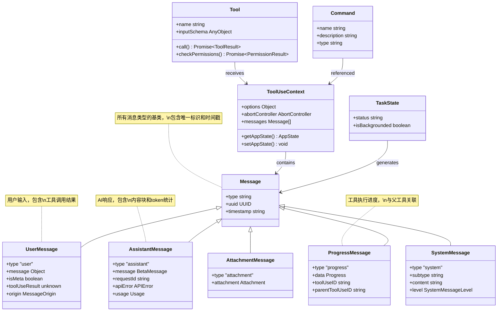

# 第五章：类型系统基础

> 本章将介绍 Claude Code 类型系统的核心设计，包括 Tool 类型、Command 类型、TaskState 类型以及 Message 类型体系，揭示类型系统如何为整个架构提供坚实的契约基础。

---

## 5.1 类型系统的角色

TypeScript 类型系统在 Claude Code 中扮演着多重角色：

### 5.1.1 类型系统的核心价值

**1. 契约定义**

类型定义了模块之间的接口契约，确保代码在编译时就能发现潜在的不兼容问题。例如，`Tool` 类型定义了所有工具必须实现的方法签名，任何不符合签名的实现都会在编译时报错。

**2. 文档化作用**

类型本身就是最好的文档。通过查看 `ToolUseContext` 的类型定义，开发者可以立即了解工具执行时需要哪些上下文信息，无需阅读额外的文档。

**3. 安全保障**

严格的类型检查防止了常见的运行时错误：
- 空值引用错误（通过可选类型 `?` 明确标记）
- 类型混淆错误（通过泛型约束确保类型一致）
- API 签名错误（通过函数类型定义确保参数正确）

### 5.1.2 类型设计原则

Claude Code 的类型系统遵循以下设计原则：

| 原则 | 说明 | 示例 |
|------|------|------|
| **泛型约束** | 使用泛型提高类型复用性 | `Tool<Input, Output, P>` |
| **联合类型** | 用联合类型表示多种可能性 | `TaskState = ShellTask \| AgentTask \| ...` |
| **不可变性** | 用 `readonly` 标记不可变集合 | `Tools = readonly Tool[]` |
| **可选标记** | 用 `?` 明确可选字段 | `aliases?: string[]` |
| **类型守卫** | 用函数实现运行时类型判断 | `isBackgroundTask()` |

---

## 5.2 Tool 类型与接口

`Tool.ts` 文件定义了 Claude Code 工具系统的核心类型接口。

### 5.2.1 Tool 泛型接口

`Tool` 类型是一个高度泛化的接口，支持三种泛型参数：

```typescript
// src/Tool.ts 中的 Tool 泛型接口定义
export type Tool<
  Input extends AnyObject = AnyObject,   // 输入验证 schema 类型
  Output = unknown,                       // 输出数据类型
  P extends ToolProgressData = ToolProgressData,  // 进度数据类型
> = {
  // ... 接口定义
}
```

**泛型参数解析**：

- **Input**：继承自 `AnyObject`，即 `z.ZodType<{ [key: string]: unknown }>`。这确保所有工具输入必须是 Zod schema 验证的对象。
- **Output**：默认为 `unknown`，允许工具返回任意类型的数据。
- **P**：继承自 `ToolProgressData`，用于定义工具执行过程中的进度数据类型。

### 5.2.2 Tool 核心字段

`Tool` 接口的字段定义涵盖了工具的标识、能力声明和配置信息：

```typescript
// src/Tool.ts 中的 Tool 核心字段定义
{
  // 别名支持（向后兼容）
  aliases?: string[]

  // ToolSearch 关键字提示
  searchHint?: string

  // 核心执行方法
  call(
    args: z.infer<Input>,
    context: ToolUseContext,
    canUseTool: CanUseToolFn,
    parentMessage: AssistantMessage,
    onProgress?: ToolCallProgress<P>,
  ): Promise<ToolResult<Output>>

  // 描述生成方法
  description(
    input: z.infer<Input>,
    options: {
      isNonInteractiveSession: boolean
      toolPermissionContext: ToolPermissionContext
      tools: Tools
    },
  ): Promise<string>

  // 输入验证 schema
  readonly inputSchema: Input

  // JSON Schema 格式（MCP 工具专用）
  readonly inputJSONSchema?: ToolInputJSONSchema

  // 输出验证 schema
  outputSchema?: z.ZodType<unknown>

  // 是否启用
  isEnabled(): boolean

  // 并发安全检查
  isConcurrencySafe(input: z.infer<Input>): boolean

  // 只读操作检查
  isReadOnly(input: z.infer<Input>): boolean

  // 破坏性操作检查
  isDestructive?(input: z.infer<Input>): boolean

  // 工具唯一标识名
  readonly name: string

  // 结果最大字符数限制
  maxResultSizeChars: number

  // 延迟加载标记
  readonly shouldDefer?: boolean

  // 始终加载标记
  readonly alwaysLoad?: boolean

  // MCP 服务器信息
  mcpInfo?: { serverName: string; toolName: string }
}
```

### 5.2.3 ToolUseContext 上下文类型

`ToolUseContext` 是工具执行时的上下文类型，包含了工具需要的所有环境和状态信息：

```typescript
// src/Tool.ts 中的 ToolUseContext 类型定义
export type ToolUseContext = {
  options: {
    commands: Command[]                     // 可用命令列表
    debug: boolean                          // 调试模式
    mainLoopModel: string                   // 主循环模型
    tools: Tools                            // 可用工具集合
    verbose: boolean                        // 详细输出模式
    thinkingConfig: ThinkingConfig          // 思考配置
    mcpClients: MCPServerConnection[]       // MCP 客户端连接
    mcpResources: Record<string, ServerResource[]>  // MCP 资源
    isNonInteractiveSession: boolean        // 是否非交互会话
    agentDefinitions: AgentDefinitionsResult  // Agent 定义
    maxBudgetUsd?: number                   // 最大预算
    customSystemPrompt?: string             // 自定义系统提示
    appendSystemPrompt?: string             //追加系统提示
    querySource?: QuerySource               // 查询来源
    refreshTools?: () => Tools              // 工具刷新函数
  }
  abortController: AbortController          // 中断控制器
  readFileState: FileStateCache             // 文件状态缓存
  getAppState(): AppState                   // 获取应用状态
  setAppState(f: (prev: AppState) => AppState): void  // 设置应用状态
  setAppStateForTasks?: (f: (prev: AppState) => AppState) => void  // 任务状态设置
  handleElicitation?: (...) => Promise<ElicitResult>  // URL 引导处理
  setToolJSX?: SetToolJSXFn                 // 设置工具 JSX 渲染
  addNotification?: (notif: Notification) => void  //添加通知
  appendSystemMessage?: (...) => void       // 添加系统消息
  sendOSNotification?: (...) => void        // 发送系统通知
  messages: Message[]                       //消息列表
  // ... 更多字段
}
```

**字段分类**：

| 类别 | 字段示例 | 说明 |
|------|----------|------|
| **配置选项** | `debug`, `verbose`, `mainLoopModel` | 运行时配置参数 |
| **资源引用** | `tools`, `commands`, `mcpClients` | 可用的外部资源 |
| **状态访问** | `getAppState`, `messages` | 当前状态信息 |
| **状态更新** | `setAppState`, `setToolJSX` | 状态修改入口 |
| **中断控制** | `abortController` | 执行中断机制 |
| **通知系统** | `addNotification`, `sendOSNotification` | 用户通知渠道 |

### 5.2.4 ToolResult 结果类型

`ToolResult` 定义了工具执行的返回结构：

```typescript
// src/Tool.ts 中的 ToolResult 类型定义
export type ToolResult<T> = {
  data: T                                   // 主要结果数据
  newMessages?: (                           // 可选的新消息
    | UserMessage
    | AssistantMessage
    | AttachmentMessage
    | SystemMessage
  )[]
  // 上下文修改器（仅非并发安全工具可用）
  contextModifier?: (context: ToolUseContext) => ToolUseContext
  // MCP协议元数据透传
  mcpMeta?: {
    _meta?: Record<string, unknown>
    structuredContent?: Record<string, unknown>
  }
}
```

### 5.2.5 Tools 集合类型

`Tools` 类型是不可变的工具集合：

```typescript
// src/Tool.ts 中的 Tools 集合类型定义
export type Tools = readonly Tool[]
```

使用 `readonly` 确保工具集合不可变，防止意外修改。这个类型在整个代码库中用于表示工具集合，便于追踪工具集合的流转。

### 5.2.6 buildTool 工厂函数

`buildTool()` 函数简化工具定义，提供安全默认值：

```typescript
// src/Tool.ts 中的 buildTool 工厂函数和默认值
const TOOL_DEFAULTS = {
  isEnabled: () => true,                    // 默认启用
  isConcurrencySafe: (_input?: unknown) => false,  // 默认不安全（失败关闭）
  isReadOnly: (_input?: unknown) => false,  // 默认写操作（失败关闭）
  isDestructive: (_input?: unknown) => false,  // 默认非破坏性
  checkPermissions: (input, _ctx?) =>       // 默认委托通用权限系统
    Promise.resolve({ behavior: 'allow', updatedInput: input }),
  toAutoClassifierInput: (_input?) => '',   // 默认跳过分类器
  userFacingName: (_input?) => '',          // 默认用户名（稍后覆盖）
}

export function buildTool<D extends AnyToolDef>(def: D): BuiltTool<D> {
  return {
    ...TOOL_DEFAULTS,
    userFacingName: () => def.name,         // 使用工具名作为默认用户名
    ...def,
  } as BuiltTool<D>
}
```

**默认值策略**：

默认值采用"失败关闭"（fail-closed）策略：
- `isConcurrencySafe` 默认 `false` —— 确保不安全的工具不会被错误地并发执行
- `isReadOnly` 默认 `false` —— 确保写操作工具不会被错误地当作只读处理

---

## 5.3 Command 类型

`command.ts` 文件定义了斜杠命令的类型系统。

### 5.3.1 Command 联合类型

`Command` 是一个联合类型，由基础类型和具体命令类型组成：

```typescript
// src/types/command.ts 中的 Command 联合类型定义
export type Command = CommandBase &
  (PromptCommand | LocalCommand | LocalJSXCommand)
```

**三种命令类型**：

| 类型 | 说明 | 执行方式 |
|------|------|----------|
| `PromptCommand` | 提示命令 | 生成提示内容注入对话 |
| `LocalCommand` | 本地命令 | 懒加载模块，执行本地逻辑 |
| `LocalJSXCommand` | JSX 命令 | 懒加载模块，返回 React 组件 |

### 5.3.2 CommandBase 基础类型

所有命令共享的基础字段：

```typescript
// src/types/command.ts 中的 CommandBase 类型定义
export type CommandBase = {
  availability?: CommandAvailability[]       // 可用性限制
  description: string                        // 命令描述
  hasUserSpecifiedDescription?: boolean      // 用户是否指定描述
  isEnabled?: () => boolean                  // 是否启用（默认 true）
  isHidden?: boolean                         // 是否隐藏
  name: string                               // 命令名称
  aliases?: string[]                         // 命令别名
  isMcp?: boolean                            // 是否 MCP 命令
  argumentHint?: string                      // 参数提示文本
  whenToUse?: string                         // 使用场景说明
  version?: string                           // 命令版本
  disableModelInvocation?: boolean           // 是否禁止模型调用
  userInvocable?: boolean                    // 是否用户可调用
  loadedFrom?: 'commands_DEPRECATED' | 'skills' | 'plugin' | 'managed' | 'bundled' | 'mcp'  // 加载来源
  kind?: 'workflow'                          // 类型标记
  immediate?: boolean                        // 是否立即执行
  isSensitive?: boolean                      // 是否敏感（参数脱敏）
  userFacingName?: () => string              // 用户可见名称
}
```

### 5.3.3 PromptCommand 提示命令

`PromptCommand` 定义了生成提示内容的命令类型：

```typescript
// src/types/command.ts 中的 PromptCommand 类型定义
export type PromptCommand = {
  type: 'prompt'
  progressMessage: string                    // 进度消息
  contentLength: number                      // 内容长度（用于 token 估算）
  argNames?: string[]                        // 参数名列表
  allowedTools?: string[]                    // 允许的工具
  model?: string                             // 模型指定
  source: SettingSource | 'builtin' | 'mcp' | 'plugin' | 'bundled'  // 来源
  pluginInfo?: {
    pluginManifest: PluginManifest
    repository: string
  }
  disableNonInteractive?: boolean            // 是否禁用非交互模式
  hooks?: HooksSettings                      // Hook 配置
  skillRoot?: string                         // 技能根目录
  context?: 'inline' | 'fork'                // 执行上下文模式
  agent?: string                             // Fork 时的 Agent 类型
  effort?: EffortValue                       // Effort 值
  paths?: string[]                           // 路径匹配模式
  getPromptForCommand(                       // 提示生成函数
    args: string,
    context: ToolUseContext,
  ): Promise<ContentBlockParam[]>
}
```

**关键字段解析**：

- **context**：执行模式，`'inline'` 在当前对话展开，`'fork'` 作为子 Agent 运行
- **paths**：路径模式，技能只在模型触及匹配文件后才可见
- **getPromptForCommand**：核心方法，生成注入对话的提示内容

### 5.3.4 LocalCommand 本地命令

`LocalCommand` 定义懒加载的本地命令：

```typescript
// src/types/command.ts 中的 LocalCommand 类型定义
type LocalCommand = {
  type: 'local'
  supportsNonInteractive: boolean            // 是否支持非交互模式
  load: () => Promise<LocalCommandModule>    // 懒加载函数
}

// 模块类型定义
export type LocalCommandModule = {
  call: LocalCommandCall                     // 调用签名
}

export type LocalCommandCall = (
  args: string,
  context: LocalJSXCommandContext,
) => Promise<LocalCommandResult>
```

### 5.3.5 LocalJSXCommand JSX 命令

`LocalJSXCommand` 定义返回 React 组件的命令：

```typescript
// src/types/command.ts 中的 LocalJSXCommand 类型定义
type LocalJSXCommand = {
  type: 'local-jsx'
  load: () => Promise<LocalJSXCommandModule> // 懒加载函数
}

export type LocalJSXCommandModule = {
  call: LocalJSXCommandCall
}

export type LocalJSXCommandCall = (
  onDone: LocalJSXCommandOnDone,
  context: ToolUseContext & LocalJSXCommandContext,
  args: string,
) => Promise<React.ReactNode>
```

### 5.3.6 LocalCommandResult 结果类型

```typescript
// src/types/command.ts 中的 LocalCommandResult 类型定义
export type LocalCommandResult =
  | { type: 'text'; value: string }          // 文本结果
  | { type: 'compact'; compactionResult: CompactionResult; displayText?: string }  // 压缩结果
  | { type: 'skip' }                         // 跳过消息
```

### 5.3.7 CommandAvailability 可用性类型

```typescript
// src/types/command.ts 中的 CommandAvailability 类型定义
export type CommandAvailability =
  | 'claude-ai'    // claude.ai OAuth 用户（Pro/Max/Team/Enterprise）
  | 'console'      // Console API key 用户（api.anthropic.com 直连）
```

---

## 5.4 TaskState 类型

`tasks/types.ts` 文件定义了任务状态的类型系统。

### 5.4.1 TaskState 联合类型

`TaskState` 是所有具体任务状态类型的联合：

```typescript
// src/tasks/types.ts 中的 TaskState 联合类型定义
export type TaskState =
  | LocalShellTaskState
  | LocalAgentTaskState
  | RemoteAgentTaskState
  | InProcessTeammateTaskState
  | LocalWorkflowTaskState
  | MonitorMcpTaskState
  | DreamTaskState
```

**任务类型解析**：

| 任务类型 | 说明 | 来源 |
|----------|------|------|
| `LocalShellTaskState` | 本地 Shell 任务 | Shell 命令执行 |
| `LocalAgentTaskState` | 本地 Agent 任务 | 子 Agent 执行 |
| `RemoteAgentTaskState` | 远程 Agent 任务 | 远程 Agent |
| `InProcessTeammateTaskState` | 进程内队友任务 | 团队协作 |
| `LocalWorkflowTaskState` | 本地工作流任务 | 工作流脚本 |
| `MonitorMcpTaskState` | MCP 监控任务 | MCP 监控 |
| `DreamTaskState` | Dream 任务 | 自动 Dream |

### 5.4.2 BackgroundTaskState 后台任务类型

`BackgroundTaskState` 定义可在后台指示器显示的任务：

```typescript
// src/tasks/types.ts 中的 BackgroundTaskState 类型定义
export type BackgroundTaskState =
  | LocalShellTaskState
  | LocalAgentTaskState
  | RemoteAgentTaskState
  | InProcessTeammateTaskState
  | LocalWorkflowTaskState
  | MonitorMcpTaskState
  | DreamTaskState
```

### 5.4.3 isBackgroundTask 类型守卫

`isBackgroundTask()` 是类型守卫函数，用于判断任务是否应显示在后台任务指示器：

```typescript
// src/tasks/types.ts 中的 isBackgroundTask 类型守卫函数
export function isBackgroundTask(task: TaskState): task is BackgroundTaskState {
  // 状态检查：必须是 running 或 pending
  if (task.status !== 'running' && task.status !== 'pending') {
    return false
  }
  // Foreground 任务检查：isBackgrounded === false 的任务不算"后台任务"
  if ('isBackgrounded' in task && task.isBackgrounded === false) {
    return false
  }
  return true
}
```

**类型守卫机制**：

该函数返回 `task is BackgroundTaskState`，这是一个类型守卫签名：
- 返回 `true` 时，TypeScript 将 `task` 的类型缩小为 `BackgroundTaskState`
- 返回 `false` 时，类型保持为 `TaskState`

---

## 5.5 Message 类型体系

消息类型体系定义了对话中各种消息的结构。

### 5.5.1 消息类型概览

Claude Code 定义了多种消息类型，每种类型承载特定的信息：



<div style="text-align: center;">
<strong>图 5-1：核心类型系统类图</strong>
</div>

### 5.5.2 UserMessage 用户消息

用户消息表示来自用户输入的内容：

```typescript
// 基于 src/utils/messages.ts 中的创建逻辑
type UserMessage = {
  type: 'user'
  message: {
    role: 'user'
    content: string | ContentBlockParam[]
  }
  isMeta?: boolean                              // 是否为系统生成的元消息
  isVisibleInTranscriptOnly?: boolean           // 是否仅在 transcript 可见
  isVirtual?: boolean                           // 是否虚拟消息
  isCompactSummary?: boolean                    // 是否压缩摘要
  summarizeMetadata?: object                    // 摘要元数据
  uuid: UUID                                    // 唯一标识
  timestamp: string                             // 时间戳
  toolUseResult?: unknown                       // 工具调用结果
  mcpMeta?: object                              // MCP元数据
  imagePasteIds?: string[]                      // 图片粘贴ID
  sourceToolAssistantUUID?: UUID                // 来源工具 Assistant UUID
  permissionMode?: PermissionMode               // 权限模式
  origin?: MessageOrigin                        // 消息来源
}
```

### 5.5.3 AssistantMessage 助手消息

助手消息表示 AI 的响应：

```typescript
type AssistantMessage = {
  type: 'assistant'
  uuid: UUID
  timestamp: string
  message: BetaMessage                          // SDK 消息对象
  requestId?: string                            // API请求ID
  apiError?: APIError                           // API错误
  error?: string                                // 错误消息
  errorDetails?: object                         // 错误详情
  isApiErrorMessage?: boolean                   // 是否API错误消息
  isVirtual?: boolean                           // 是否虚拟消息
}
```

**BetaMessage 结构**（来自 SDK）：

```typescript
type BetaMessage = {
  id: UUID
  model: string
  role: 'assistant'
  stop_reason: string                           // 停止原因
  stop_sequence: string                         // 停止序列
  type: 'message'
  usage: Usage                                  // Token使用统计
  content: BetaContentBlock[]                   // 内容块数组
}
```

### 5.5.4 ProgressMessage 进度消息

进度消息表示工具执行过程中的状态更新：

```typescript
type ProgressMessage<P extends ToolProgressData = ToolProgressData> = {
  type: 'progress'
  data: P                                       // 进度数据
  toolUseID: string                             // 工具使用ID
  parentToolUseID?: string                      // 父工具使用ID（嵌套工具）
}
```

### 5.5.5 SystemMessage 系统消息

系统消息用于传达系统级信息：

```typescript
type SystemMessage = {
  type: 'system'
  subtype: string                               // 子类型
  content: string                               // 内容
  level: SystemMessageLevel                     // 级别
  uuid: UUID
  timestamp: string
}

type SystemMessageLevel = 'info' | 'warning' | 'error'
```

**系统消息子类型**：

| 子类型 | 说明 |
|--------|------|
| `permission_retry` | 权限重试通知 |
| `api_error` | API错误通知 |
| `api_metrics` | API指标通知 |
| `turn_duration` | 轮次时长通知 |
| `compact_boundary` | 压缩边界标记 |
| `bridge_status` | 桥接状态通知 |
| `informational` | 一般信息通知 |
| `away_summary` | 离开摘要 |

---

## 5.6 类型系统架构总览

```mermaid
flowchart TB
    subgraph CoreTypes["核心类型"]
        Tool["Tool<Input, Output, P>"]
        Command["Command"]
        TaskState["TaskState"]
        Message["Message"]
    end

    subgraph ContextTypes["上下文类型"]
        ToolUseContext["ToolUseContext"]
        ToolPermissionContext["ToolPermissionContext"]
    end

    subgraph ResultTypes["结果类型"]
        ToolResult["ToolResult<T>"]
        LocalCommandResult["LocalCommandResult"]
    end

    subgraph CollectionTypes["集合类型"]
        Tools["Tools = readonly Tool[]"]
        Commands["Command[]"]
    end

    subgraph FactoryFunctions["工厂函数"]
        buildTool["buildTool()"]
        isBackgroundTask["isBackgroundTask()"]
    end

    Tool --> ToolUseContext : uses
    Tool --> ToolResult : returns
    Tool --> Tools : aggregated in

    Command --> ToolUseContext : referenced by
    Command --> Commands : aggregated in

    TaskState --> Message : generates
    isBackgroundTask --> TaskState : guards

    buildTool --> Tool : creates
```

---

## 5.7 总结

本章介绍了 Claude Code 类型系统的核心设计：

1. **Tool 类型**：泛型接口 `Tool<Input, Output, P>` 定义了工具的完整生命周期方法，包括执行、权限、渲染等
2. **ToolUseContext**：包含工具执行所需的全部上下文，从配置到状态访问再到通知系统
3. **Command 类型**：联合类型 `Command = CommandBase & (PromptCommand | LocalCommand | LocalJSXCommand)` 支持三种命令形态
4. **TaskState 类型**：联合类型涵盖七种任务状态，配合类型守卫实现安全的类型缩小
5. **Message 类型体系**：UserMessage、AssistantMessage、ProgressMessage、SystemMessage 构成完整的消息类型树

类型系统的设计体现了 Claude Code 的核心理念：

- **泛型约束**：提高类型复用性，同时保持类型安全
- **联合类型**：用类型系统表达多种可能性，而非运行时判断
- **不可变性**：`readonly` 标记确保关键集合不被意外修改
- **类型守卫**：结合运行时检查和类型缩小，实现安全的类型转换
- **失败关闭**：默认值采用保守策略，确保安全优先

下一章将深入分析 AppState 状态管理系统，揭示类型系统如何与状态管理协同工作。

---

**代码引用索引**：

| 引用位置 | 说明 |
|----------|------|
| `src/Tool.ts` | Tool 泛型接口定义 |
| `src/Tool.ts` | ToolUseContext 类型定义 |
| `src/Tool.ts` | ToolResult 类型定义 |
| `src/Tool.ts` | Tools 集合类型定义 |
| `src/Tool.ts` | buildTool 工厂函数和默认值 |
| `src/types/command.ts` | Command 联合类型定义 |
| `src/types/command.ts` | CommandBase 基础类型定义 |
| `src/types/command.ts` | PromptCommand 类型定义 |
| `src/types/command.ts` | LocalCommand 类型定义 |
| `src/types/command.ts` | LocalJSXCommand 类型定义 |
| `src/types/command.ts` | LocalCommandResult 类型定义 |
| `src/tasks/types.ts` | TaskState 联合类型定义 |
| `src/tasks/types.ts` | BackgroundTaskState 类型定义 |
| `src/tasks/types.ts` | isBackgroundTask 类型守卫函数 |