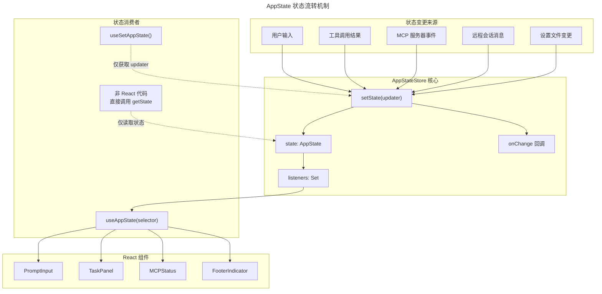
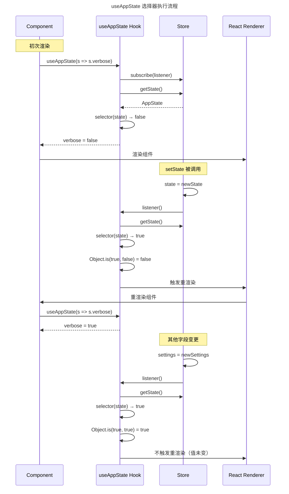

# 第六章：状态管理 AppState

## 6.1 引言：AppState 的核心地位

在 Claude Code 的架构中，AppState 是整个应用的**神经中枢**。它不仅承载了用户界面状态、模型配置、任务进度、权限管理等核心数据，还协调着数十个子系统和工具之间的交互。可以说，理解 AppState 是理解 Claude Code 运行机制的钥匙。

为什么需要这样一个集中式的状态管理？Claude Code 是一个高度复杂的 CLI 应用：

1. **多模块协作**：Agent 系统、MCP 协议、插件系统、远程会话等模块需要共享数据
2. **异步交互频繁**：用户输入、工具调用、模型响应、远程事件等异步操作需要状态同步
3. **UI 响应性要求**：终端界面需要实时反映状态变化，且不能阻塞主循环
4. **跨进程通信**：支持 tmux 多进程协作、远程 daemon 模式等场景

AppState 采用了一种**极简但高效**的 Store 模式，避免了 Redux 的繁琐和复杂中间件，同时保持了 React 的响应式特性。

## 6.2 Store 模式设计哲学

### 6.2.1 极简 Store 实现

Claude Code 的状态管理核心仅由一个 `store.ts` 文件构成，约 35 行代码：

```typescript
// src/state/store.ts 中的 Store 实现
type Listener = () => void
type OnChange<T> = (args: { newState: T; oldState: T }) => void

export type Store<T> = {
  getState: () => T
  setState: (updater: (prev: T) => T) => void
  subscribe: (listener: Listener) => () => void
}

export function createStore<T>(
  initialState: T,
  onChange?: OnChange<T>,
): Store<T> {
  let state = initialState
  const listeners = new Set<Listener>()

  return {
    getState: () => state,

    setState: (updater: (prev: T) => T) => {
      const prev = state
      const next = updater(prev)
      if (Object.is(next, prev)) return  // 相同引用则跳过
      state = next
      onChange?.({ newState: next, oldState: prev })
      for (const listener of listeners) listener()
    },

    subscribe: (listener: Listener) => {
      listeners.add(listener)
      return () => listeners.delete(listener)  // 返回取消订阅函数
    },
  }
}
```

这个设计有几个关键特点：

| 特性 | 说明 |
|------|------|
| **不可变更新** | `setState` 接收 updater 函数，返回新状态对象 |
| **引用比较** | 使用 `Object.is` 判断是否需要触发更新，避免无效通知 |
| **Set 存储 Listener** | 自动去重，且支持快速删除 |
| **onChange 回调** | 状态变化时的额外处理钩子（用于日志、持久化等） |

### 6.2.2 与其他方案的对比

| 方案 | 代码量 | 学习曲线 | 适用场景 |
|------|--------|----------|----------|
| Redux | 中等 | 高（Actions、Reducers、Middleware） | 大型 Web 应用，需要严格的状态流转追踪 |
| Zustand | 低 | 中 | React 应用，支持 selector 优化 |
| Claude Code Store | 极低 | 极低 | CLI/TUI 应用，与 React 的 `useSyncExternalStore` 配合 |

Claude Code 的 Store 设计灵感来自 Zustand，但更加精简。它不需要 actions、dispatch 等概念，直接通过 `setState` 函数式更新即可。

### 6.2.3 状态流转图



## 6.3 AppState 字段详解

AppState 包含超过 100 个状态字段，覆盖 Claude Code 的所有功能模块。下面按类别进行详细分析。

### 6.3.1 核心设置与模型配置

| 字段 | 类型 | 说明 |
|------|------|------|
| `settings` | `SettingsJson` | 用户设置（从配置文件加载） |
| `verbose` | `boolean` | 是否启用详细日志模式 |
| `mainLoopModel` | `ModelSetting` | 主循环使用的模型（别名或全名） |
| `mainLoopModelForSession` | `ModelSetting` | 当前会话的模型设置 |
| `thinkingEnabled` | `boolean | undefined` | 是否启用思考模式 |
| `promptSuggestionEnabled` | `boolean` | 是否启用提示建议 |
| `fastMode` | `boolean` | 快速模式开关 |
| `advisorModel` | `string` | Advisor 模型配置 |
| `effortValue` | `EffortValue` | Effort 级别设置 |

### 6.3.2 UI 与视图状态

| 字段 | 类型 | 说明 |
|------|------|------|
| `statusLineText` | `string | undefined` | 状态栏文本 |
| `expandedView` | `'none' | 'tasks' | 'teammates'` | 展开的视图面板 |
| `isBriefOnly` | `boolean` | 是否为简洁模式 |
| `showTeammateMessagePreview` | `boolean` | 显示队友消息预览 |
| `selectedIPAgentIndex` | `number` | 选中的 Agent 索引 |
| `coordinatorTaskIndex` | `number` | Coordinator 任务面板选择（-1=pill，0=main，1..N=agent） |
| `viewSelectionMode` | `'none' | 'selecting-agent' | 'viewing-agent'` | 视图选择模式 |
| `footerSelection` | `FooterItem | null` | 底部导航栏选中项 |
| `spinnerTip` | `string` | 加载提示文本 |
| `activeOverlays` | `ReadonlySet<string>` | 活动覆盖层集合（用于 Escape 键协调） |

### 6.3.3 权限与安全

| 字段 | 类型 | 说明 |
|------|------|------|
| `toolPermissionContext` | `ToolPermissionContext` | 工具权限上下文，包含模式、规则等 |
| `denialTracking` | `DenialTrackingState` | 拒绝追踪（用于 YOLO/headless 模式限制） |
| `replBridgePermissionCallbacks` | `BridgePermissionCallbacks` | Bridge 权限回调 |
| `channelPermissionCallbacks` | `ChannelPermissionCallbacks` | 频道权限回调（Telegram/iMessage 等） |

### 6.3.4 任务管理

| 字段 | 类型 | 说明 |
|------|------|------|
| `tasks` | `{ [taskId: string]: TaskState }` | 任务状态字典 |
| `foregroundedTaskId` | `string` | 前台任务 ID（消息显示在主视图） |
| `viewingAgentTaskId` | `string` | 正在查看的队友任务 ID |
| `agentNameRegistry` | `Map<string, AgentId>` | Agent 名称 → ID 注册表 |
| `remoteAgentTaskSuggestions` | `{ summary: string; task: string }[]` | 远程 Agent 任务建议 |

### 6.3.5 Agent 系统

| 字段 | 类型 | 说明 |
|------|------|------|
| `agent` | `string | undefined` | Agent 名称（来自 CLI 参数或设置） |
| `kairosEnabled` | `boolean` | Assistant 模式是否完全启用 |
| `agentDefinitions` | `AgentDefinitionsResult` | Agent 定义（activeAgents、allAgents） |
| `teamContext` | `TeamContext` | Swarm 团队上下文 |
| `standaloneAgentContext` | `StandaloneAgentContext` | 独立 Agent 上下文（非 Swarm 会话） |
| `inbox` | `Inbox` | Agent 收件箱消息 |

### 6.3.6 MCP（Model Context Protocol）

MCP 是 Claude Code 与外部工具通信的核心协议：

```typescript
// src/state/AppStateStore.ts 中的 MCP 状态结构
mcp: {
  clients: MCPServerConnection[]   // MCP 服务器连接列表
  tools: Tool[]                    // 可用工具列表
  commands: Command[]              // 可用命令列表
  resources: Record<string, ServerResource[]>  // 资源字典
  pluginReconnectKey: number       // 重连计数器（触发 MCP effects 重跑）
}
```

`pluginReconnectKey` 是一个巧妙的设计：当插件状态变化时，通过递增此计数器，触发依赖它的 React effects 重新执行，从而刷新 MCP 连接。

### 6.3.7 插件系统

```typescript
// src/state/AppStateStore.ts 中的插件状态结构
plugins: {
  enabled: LoadedPlugin[]      // 已启用插件
  disabled: LoadedPlugin[]     // 已禁用插件
  commands: Command[]          // 插件提供的命令
  errors: PluginError[]        // 加载/初始化错误
  installationStatus: {        // 安装状态追踪
    marketplaces: Array<{name, status, error}>
    plugins: Array<{id, name, status, error}>
  }
  needsRefresh: boolean        // 磁盘状态已变更，需要刷新
}
```

`needsRefresh` 标志用于处理外部配置变更：当用户手动编辑 settings.json 或后台安装完成插件后，此标志置为 true，用户执行 `/reload-plugins` 时消费。

### 6.3.8 远程会话与 Bridge

Claude Code 支持远程控制模式（`--remote`），让用户通过 Web 界面操作 CLI。Bridge 相关字段：

| 字段 | 说明 |
|------|------|
| `remoteSessionUrl` | 远程会话 URL |
| `remoteConnectionStatus` | 连接状态（connecting/connected/reconnecting/disconnected） |
| `remoteBackgroundTaskCount` | 远程后台任务数量 |
| `replBridgeEnabled` | Bridge 是否启用 |
| `replBridgeConnected` | Bridge 是否就绪（env 注册 + session 创建） |
| `replBridgeSessionActive` | WebSocket 是否活跃 |
| `replBridgeReconnecting` | 是否正在重连 |
| `replBridgeConnectUrl` | Bridge 连接 URL |
| `replBridgeSessionUrl` | claude.ai 上的会话 URL |
| `replBridgeError` | 连接错误信息 |

### 6.3.9 推测系统（Speculation）

推测系统是 Claude Code 的性能优化核心，通过预测用户意图提前执行操作：

```typescript
// src/state/AppStateStore.ts 中的 SpeculationState 类型定义
type SpeculationState =
  | { status: 'idle' }
  | {
      status: 'active'
      id: string
      abort: () => void            // 取消函数
      startTime: number
      messagesRef: { current: Message[] }  // 可变引用（避免数组复制）
      writtenPathsRef: { current: Set<string> }  // 已写入路径
      boundary: CompletionBoundary | null  // 完成边界
      suggestionLength: number
      toolUseCount: number
      isPipelined: boolean
      contextRef: { current: REPLHookContext }
      pipelinedSuggestion?: {...}  // 管道化建议
    }
```

`messagesRef` 和 `writtenPathsRef` 使用可变引用而非直接存储数组，避免每次消息添加时的状态更新开销。

### 6.3.10 其他功能模块

**通知系统**：
```typescript
notifications: {
  current: Notification | null
  queue: Notification[]
}
```

**文件历史**：
```typescript
fileHistory: {
  snapshots: []
  trackedFiles: Set<string>
  snapshotSequence: number
}
```

**Todo 系统**：
```typescript
todos: { [agentId: string]: TodoList }
```

**Ultraplan 系统**（高级规划模式）：
```typescript
ultraplanLaunching: boolean
ultraplanSessionUrl: string
ultraplanPendingChoice: { plan, sessionId, taskId }
ultraplanLaunchPending: { blurb }
isUltraplanMode: boolean
```

## 6.4 useAppState() 选择器订阅机制

### 6.4.1 基本用法

`useAppState` 是 React 组件订阅状态的主要方式：

```typescript
// src/state/AppState.tsx 中的 useAppState hook 实现
export function useAppState<T>(selector: (state: AppState) => T): T {
  const store = useAppStore()

  const get = () => {
    const state = store.getState()
    const selected = selector(state)
    return selected
  }

  return useSyncExternalStore(store.subscribe, get, get)
}
```

核心是 React 18 引入的 `useSyncExternalStore`，它让外部 Store 与 React 的渲染周期同步：

1. `store.subscribe` - 注册监听器，返回取消订阅函数
2. `get` - 获取当前选中值（服务端和客户端各调用一次）
3. React 在每次渲染前调用 `get`，比较新旧值（通过 `Object.is`）
4. 若值变化，触发组件重渲染

### 6.4.2 选择器最佳实践

**正确用法**：
```typescript
// 选择单个字段 - 推荐
const verbose = useAppState(s => s.verbose)

// 选择现有子对象 - 推荐（引用稳定）
const { text, promptId } = useAppState(s => s.promptSuggestion)

// 多次调用选择多个字段 - 推荐
const verbose = useAppState(s => s.verbose)
const model = useAppState(s => s.mainLoopModel)
```

**错误用法**：
```typescript
// 返回新对象 - 每次 selector 调用都创建新引用
// Object.is 比较永远为 false，导致不必要重渲染
const { text, promptId } = useAppState(s => ({
  text: s.promptSuggestion.text,
  promptId: s.promptSuggestion.promptId
}))
```

### 6.4.3 性能优化原理



关键点：**即使 Store 状态变化，如果 selector 返回值未变，组件不会重渲染**。

## 6.5 useSetAppState() 更新器

当组件需要更新状态但不需要订阅时，使用 `useSetAppState`：

```typescript
// src/state/AppState.tsx:170-172
export function useSetAppState() {
  return useAppStore().setState
}
```

这个设计有几个优势：

1. **稳定引用**：`setState` 函数永不变化，可作为稳定的依赖
2. **无订阅开销**：组件不会因状态变化而重渲染
3. **适合事件处理**：按钮点击、表单提交等场景

典型用法：
```typescript
function SubmitButton() {
  const setAppState = useSetAppState()

  const handleSubmit = () => {
    setAppState(prev => ({
      ...prev,
      statusLineText: 'Processing...'
    }))
  }

  return <button onClick={handleSubmit}>Submit</button>
}
```

`SubmitButton` 组件永远不会因 `statusLineText` 变化而重渲染——它只负责触发更新。

## 6.6 状态更新与传播机制

### 6.6.1 setState 工作流程

```typescript
// src/state/store.ts 中的 setState 实现
setState: (updater: (prev: T) => T) => {
  const prev = state
  const next = updater(prev)
  if (Object.is(next, prev)) return  // 跳过相同引用
  state = next
  onChange?.({ newState: next, oldState: prev })
  for (const listener of listeners) listener()
}
```

步骤分解：

1. **保存旧状态**：`const prev = state`
2. **计算新状态**：`updater(prev)` 返回新对象
3. **引用比较**：`Object.is(next, prev)` 检查是否真正变化
4. **更新状态**：`state = next`
5. **触发 onChange**：可选的回调（用于日志、持久化）
6. **通知所有 listener**：遍历执行

### 6.6.2 onChange 回调的作用

`AppStateProvider` 创建 Store 时传入 `onChangeAppState`：

```typescript
// src/state/AppState.tsx 中的 Store 创建
const [store] = useState(() =>
  createStore<AppState>(
    initialState ?? getDefaultAppState(),
    onChangeAppState,  // 状态变化回调
  )
)
```

`onChangeAppState` 用于：
- 同步状态到远程 daemon（通过 WebSocket）
- 触发持久化操作
- 记录状态变更日志

### 6.6.3 与 React 组件的同步

`useSyncExternalStore` 确保 React 渲染与 Store 同步：

```typescript
// src/state/AppState.tsx 中的 useSyncExternalStore 调用
return useSyncExternalStore(store.subscribe, get, get)
```

React 18 的这个 hook 解决了传统外部 Store 的并发渲染问题：
- 在渲染阶段安全读取 Store
- 在 Store 变化后批量触发更新
- 支持服务端渲染（SSR）场景

## 6.7 AppStateProvider 与 React 集成

### 6.7.1 Provider 结构

```typescript
// src/state/AppState.tsx 中的 AppStateProvider Props 类型
type Props = {
  children: React.ReactNode
  initialState?: AppState
  onChangeAppState?: (args: { newState: AppState; oldState: AppState }) => void
}
```

Provider 负责：
1. 创建唯一的 Store 实例（通过 `useState` 保持稳定）
2. 通过 Context 向子组件提供 Store
3. 监听外部设置变更并同步到 AppState
4. 处理初始化时的权限模式检查

### 6.7.2 嵌套保护机制

```typescript
// src/state/AppState.tsx 中的嵌套检测
const hasAppStateContext = useContext(HasAppStateContext)
if (hasAppStateContext) {
  throw new Error("AppStateProvider can not be nested within another AppStateProvider")
}
```

`HasAppStateContext` 是一个布尔 Context，用于检测嵌套。这确保全局只有一个 AppState，避免状态碎片化。

### 6.7.3 设置文件同步

```typescript
// src/state/AppState.tsx 中的设置变更同步
const onSettingsChange = useEffectEvent(source =>
  applySettingsChange(source, store.setState)
)
useSettingsChange(onSettingsChange)
```

当用户编辑 `settings.json` 时，文件监听器触发 `onSettingsChange`，将变更应用到 AppState。这实现了配置与状态的实时同步。

## 6.8 小结

AppState 是 Claude Code 的状态管理核心，其设计体现了几个重要原则：

1. **极简主义**：Store 实现仅 35 行，无中间件、无 action 抽象
2. **不可变性**：所有更新通过 updater 函数，返回新对象
3. **选择性订阅**：通过 selector 实现精准重渲染控制
4. **跨平台支持**：既服务于 React 组件，也支持非 React 代码直接访问

这种设计使 Claude Code 能够在复杂的多模块协作场景下，保持状态管理的高效和可预测性。

---

**关键文件**：
- `/Users/hw/workspaces/projects/claude-wiki/src/state/store.ts` - Store 基础实现
- `/Users/hw/workspaces/projects/claude-wiki/src/state/AppStateStore.ts` - AppState 类型定义与默认状态工厂
- `/Users/hw/workspaces/projects/claude-wiki/src/state/AppState.tsx` - React hooks 与 Provider