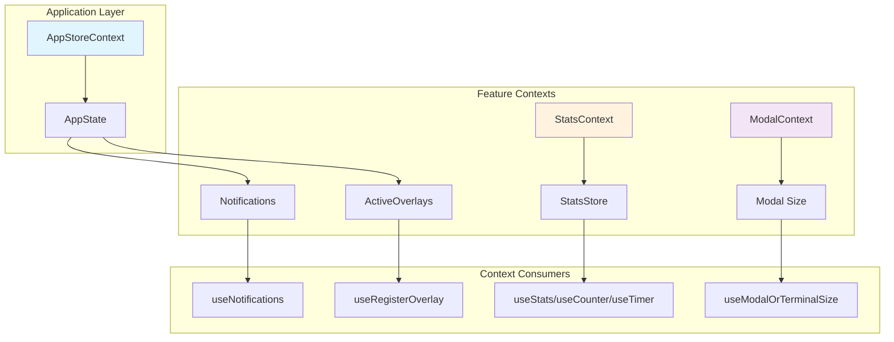

# 第七章：React Context 体系

Claude Code 使用 React Context 作为全局状态管理的核心机制。本章将深入分析各个 Context 模块的设计模式与实现细节。

## 7.1 Context 层级架构

Claude Code 的 Context 体系采用分层设计，每个 Context 负责特定领域的状态管理。图 7-1 展示了主要的 Context 层级关系。



**图 7-1：Claude Code Context 层级架构图**

从架构图中可以看到，AppStoreContext 作为顶层状态容器，管理 Notifications 和 ActiveOverlays 等核心状态。StatsContext 和 ModalContext 则作为独立的功能 Context，分别处理性能统计和模态对话框布局。

## 7.2 Context 设计模式

Claude Code 采用了多种 React Context 设计模式：

### 7.2.1 Store-Provider-Hook 模式

这是最常见的模式，以 StatsContext 为代表（`stats.tsx`）：

```typescript
// 定义 Store 类型接口（第 5-10 行）
export type StatsStore = {
  increment(name: string, value?: number): void;
  set(name: string, value: number): void;
  observe(name: string, value: number): void;
  add(name: string, value: string): void;
  getAll(): Record<string, number>;
};

// 创建 Context（第 99 行）
export const StatsContext = createContext<StatsStore | null>(null);

// 提供 Provider 组件（第 104-156 行）
export function StatsProvider({ store: externalStore, children }: Props) {
  const internalStore = useMemo(() => createStatsStore(), []);
  const store = externalStore ?? internalStore;
  // ... flush logic
  return <StatsContext.Provider value={store}>{children}</StatsContext.Provider>;
}

// 提供消费 Hook（第 157-163 行）
export function useStats(): StatsStore {
  const store = useContext(StatsContext);
  if (!store) {
    throw new Error("useStats must be used within a StatsProvider");
  }
  return store;
}
```

这种模式的优点：
- **类型安全**：通过 TypeScript 接口定义 Store 方法
- **灵活性**：支持外部注入 Store 或使用内部创建
- **错误提示**：Hook 在 Context 外使用时抛出明确错误

### 7.2.2 派生 Hook 模式

StatsContext 提供了多个派生 Hook，简化特定场景的使用：

```typescript
// 第 164-177 行：计数器 Hook
export function useCounter(name: string): (value?: number) => void {
  const store = useStats();
  return useCallback(value => store.increment(name, value), [store, name]);
}

// 第 178-191 行：仪表 Hook
export function useGauge(name: string): (value: number) => void {
  const store = useStats();
  return useCallback(value => store.set(name, value), [store, name]);
}

// 第 192-205 行：计时器 Hook
export function useTimer(name: string): (value: number) => void {
  const store = useStats();
  return useCallback(value => store.observe(name, value), [store, name]);
}
```

派生 Hook 将通用操作封装为特定语义，降低了使用复杂度。

### 7.2.3 条件检测 Hook 模式

OverlayContext 和 ModalContext 使用此模式检测运行环境：

```typescript
// overlayContext.tsx 第 122-124 行
export function useIsOverlayActive(): boolean {
  return useAppState(s => s.activeOverlays.size > 0);
}

// modalContext.tsx 第 28-30 行
export function useIsInsideModal(): boolean {
  return useContext(ModalContext) !== null;
}
```

这种模式允许组件根据上下文环境调整行为，无需暴露完整状态。

## 7.3 Notification Context 分析

`notifications.tsx` 实现了一个功能完善的通知队列系统，包含优先级管理、折叠合并和失效机制。

### 7.3.1 数据结构设计

通知的基础类型定义（第 5-33 行）：

```typescript
type Priority = 'low' | 'medium' | 'high' | 'immediate';

type BaseNotification = {
  key: string;
  invalidates?: string[];      // 失效列表
  priority: Priority;
  timeoutMs?: number;
  fold?: (accumulator: Notification, incoming: Notification) => Notification;
};

type TextNotification = BaseNotification & {
  text: string;
  color?: keyof Theme;
};

type JSXNotification = BaseNotification & {
  jsx: React.ReactNode;
};

export type Notification = TextNotification | JSXNotification;
```

关键设计点：
- **key**：唯一标识，用于折叠和去重
- **invalidates**：声明此通知会使哪些其他通知失效
- **fold**：合并函数，类似 Array.reduce 的语义
- **priority**：四个优先级级别，决定显示顺序

### 7.3.2 优先级队列实现

优先级映射（第 230-235 行）：

```typescript
const PRIORITIES: Record<Priority, number> = {
  immediate: 0,  // 最高优先级，立即显示
  high: 1,
  medium: 2,
  low: 3
};
```

获取下一个显示通知的逻辑（第 236-239 行）：

```typescript
export function getNext(queue: Notification[]): Notification | undefined {
  if (queue.length === 0) return undefined;
  return queue.reduce((min, n) =>
    PRIORITIES[n.priority] < PRIORITIES[min.priority] ? n : min
  );
}
```

这是一个简化的优先级队列：队列本身无序，每次取出时遍历找最小优先级值的通知。对于小型队列（通常不超过 5-10 条通知），这种 O(n) 查询是合理的。

### 7.3.3 折叠机制

折叠机制允许相同 key 的通知合并（第 122-170 行）：

```typescript
// 折叠到当前显示的通知
if (prev.notifications.current?.key === notif.key) {
  const folded = notif.fold(prev.notifications.current, notif);
  // 重置 timeout
  if (currentTimeoutId) {
    clearTimeout(currentTimeoutId);
    currentTimeoutId = null;
  }
  // 设置新的 timeout
  currentTimeoutId = setTimeout(/* ... */, folded.timeoutMs ?? DEFAULT_TIMEOUT_MS);
  return { ...prev, notifications: { current: folded, queue: prev.notifications.queue } };
}

// 折叠到队列中的通知
const queueIdx = prev.notifications.queue.findIndex(_ => _.key === notif.key);
if (queueIdx !== -1) {
  const folded = notif.fold(prev.notifications.queue[queueIdx], notif);
  const newQueue = [...prev.notifications.queue];
  newQueue[queueIdx] = folded;
  return { ...prev, notifications: { current: prev.notifications.current, queue: newQueue } };
}
```

折叠的应用场景：
- **进度更新**：将多个进度通知合并为一条带百分比的通知
- **计数累积**：多条相同类型的通知合并显示总数
- **时间延长**：重复通知延长显示时间而非重复排队

### 7.3.4 失效机制

失效机制允许通知声明使其他通知无效（第 98-101 行，第 176-180 行）：

```typescript
// 清理队列中被失效的通知
queue: prev.notifications.queue.filter(_ => !notif.invalidates?.includes(_.key))

// 如果当前显示的通知被失效，清除 timeout
if (invalidatesCurrent && currentTimeoutId) {
  clearTimeout(currentTimeoutId);
  currentTimeoutId = null;
}
```

失效的应用场景：
- **状态变更**：任务完成通知使"任务进行中"通知失效
- **错误覆盖**：错误通知使之前的成功通知失效
- **清理关联**：某个操作的通知使一系列相关提示失效

### 7.3.5 immediate 优先级的特殊处理

immediate 优先级的通知会立即显示，打断当前流程（第 80-117 行）：

```typescript
if (notif.priority === 'immediate') {
  // 清除现有 timeout
  if (currentTimeoutId) {
    clearTimeout(currentTimeoutId);
    currentTimeoutId = null;
  }

  // 设置新的 timeout
  currentTimeoutId = setTimeout(/* ... */);

  // 立即显示，并将当前非 immediate 通知重新入队
  setAppState(prev => ({
    ...prev,
    notifications: {
      current: notif,
      queue: [
        ...(prev.notifications.current ? [prev.notifications.current] : []),
        ...prev.notifications.queue
      ].filter(_ => _.priority !== 'immediate' && !notif.invalidates?.includes(_.key))
    }
  }));
  return; // 提前返回，不进入正常队列流程
}
```

这种设计确保紧急通知（如错误、警告）能立即抢占显示。

### 7.3.6 状态管理架构

通知系统使用全局 AppState Store 而非独立 Context：

```typescript
// 第 42-43 行
const store = useAppStateStore();
const setAppState = useSetAppState();
```

状态结构：

```typescript
notifications: {
  queue: Notification[],    // 待显示队列
  current: Notification | null  // 当前显示的通知
}
```

这种设计将通知状态纳入全局状态树，便于与其他状态（如 activeOverlays）协调。

## 7.4 Modal Dialog 管理

`modalContext.tsx` 提供了模态对话框区域的尺寸和滚动管理。

### 7.4.1 设计背景

模态对话框在全屏布局中占据底部锚定的区域，其内部可用空间小于终端整体尺寸。组件需要获取准确的可用尺寸以避免溢出。

Context 定义（第 22-27 行）：

```typescript
type ModalCtx = {
  rows: number;      // 可用行数
  columns: number;   // 可用列数
  scrollRef: RefObject<ScrollBoxHandle | null> | null;  // 滚动控制引用
};
```

### 7.4.2 核心功能

**环境检测**（第 28-30 行）：

```typescript
export function useIsInsideModal(): boolean {
  return useContext(ModalContext) !== null;
}
```

组件可据此决定是否渲染全宽分隔符或调整布局。

**尺寸获取**（第 38-54 行）：

```typescript
export function useModalOrTerminalSize(fallback: { rows: number; columns: number }) {
  const ctx = useContext(ModalContext);
  return ctx ? { rows: ctx.rows, columns: ctx.columns } : fallback;
}
```

此 Hook 提供优雅降级：在 Modal 内返回 Modal 尺寸，否则返回终端尺寸。

**滚动控制**（第 55-57 行）：

```typescript
export function useModalScrollRef() {
  return useContext(ModalContext)?.scrollRef ?? null;
}
```

允许外部控制 Modal 内的滚动位置，如 Tab 切换时重置滚动。

### 7.4.3 使用场景

根据注释（第 5-20 行），Modal Context 解决三个问题：

1. **分隔符抑制**：Pane 组件跳过全终端宽度的 Divider，因为 FullscreenLayout 已绘制
2. **Select 分页尺寸**：组件根据 Modal 实际可用行数计算可见选项数
3. **Tab 切换滚动重置**：通过 key 重置 ScrollBox 实现滚动归零

## 7.5 Overlay UI 状态管理

`overlayContext.tsx` 解决 ESC 键在多层 Overlay 环境下的协调问题。

### 7.5.1 问题背景

当 Overlay（如 Select 下拉框）打开时，ESC 键应关闭 Overlay 而非取消正在进行的请求。OverlayContext 提供 Overlay 活动状态的跟踪机制。

### 7.5.2 Overlay 注册

核心注册 Hook（第 38-104 行）：

```typescript
export function useRegisterOverlay(id: string, enabled = true): void {
  const store = useContext(AppStoreContext);
  const setAppState = store?.setState;

  useEffect(() => {
    if (!enabled || !setAppState) return;

    // 注册 Overlay
    setAppState(prev => {
      if (prev.activeOverlays.has(id)) return prev;
      const next = new Set(prev.activeOverlays);
      next.add(id);
      return { ...prev, activeOverlays: next };
    });

    // 清理函数：注销 Overlay
    return () => {
      setAppState(prev => {
        if (!prev.activeOverlays.has(id)) return prev;
        const next_0 = new Set(prev.activeOverlays);
        next_0.delete(id);
        return { ...prev, activeOverlays: next_0 };
      });
    };
  }, [id, enabled, setAppState]);

  // 强制下一帧完全重绘（处理 Overlay 关闭后的布局变化）
  useLayoutEffect(() => {
    if (!enabled) return;
    return () => instances.get(process.stdout)?.invalidatePrevFrame();
  }, [enabled]);
}
```

关键设计：
- **自动生命周期管理**：mount 注册，unmount 注销
- **条件注册**：enabled 参数支持按条件注册（如只有当 onCancel 存在时注册）
- **布局强制重绘**：useLayoutEffect 确保 Overlay 关闭后立即重绘，避免残留像素

### 7.5.3 模态与非模态 Overlay

系统区分两种 Overlay 类型（第 21 行，第 137-150 行）：

```typescript
const NON_MODAL_OVERLAYS = new Set(['autocomplete']);

export function useIsModalOverlayActive(): boolean {
  return useAppState(s => {
    for (const id of s.activeOverlays) {
      if (!NON_MODAL_OVERLAYS.has(id)) return true;
    }
    return false;
  });
}
```

- **模态 Overlay**（如 Select）：阻止所有输入，ESC 应关闭它
- **非模态 Overlay**（如 autocomplete）：不阻止 TextInput 聚焦，允许继续输入

### 7.5.4 ESC 键处理流程

CancelRequestHandler 使用 Overlay 状态决定 ESC 行为：

```typescript
function CancelRequestHandler() {
  const isOverlayActive = useIsOverlayActive();
  const isActive = !isOverlayActive && canCancelRunningTask;
  useKeybinding('chat:cancel', handleCancel, { isActive });
}
```

当 Overlay 活动时，isActive 为 false，ESC 键绑定不触发取消请求。

## 7.6 Stats 统计追踪系统

`stats.tsx` 提供了性能指标收集和持久化机制。

### 7.6.1 Store 实现

核心 Store 创建函数（第 28-97 行）：

```typescript
export function createStatsStore(): StatsStore {
  const metrics = new Map<string, number>();      // 简单计数/数值
  const histograms = new Map<string, Histogram>(); // 分布统计
  const sets = new Map<string, Set<string>>();     // 字符串集合

  return {
    increment(name: string, value = 1) {
      metrics.set(name, (metrics.get(name) ?? 0) + value);
    },
    set(name: string, value: number) {
      metrics.set(name, value);
    },
    observe(name: string, value: number) {
      // 直方图统计实现
    },
    add(name: string, value: string) {
      // Set 收集实现
    },
    getAll() {
      // 导出所有指标
    }
  };
}
```

### 7.6.2 Histogram（直方图）统计

直方图数据结构（第 20-27 行）：

```typescript
type Histogram = {
  reservoir: number[];  // 蓄水池采样数组
  count: number;        // 总观察次数
  sum: number;          // 总和
  min: number;          // 最小值
  max: number;          // 最大值
};
```

蓄水池采样（Reservoir Sampling）实现（第 59-67 行）：

```typescript
const RESERVOIR_SIZE = 1024;

// 当蓄水池未满时直接添加
if (h.reservoir.length < RESERVOIR_SIZE) {
  h.reservoir.push(value);
} else {
  // 蓄水池已满，使用 Algorithm R 随机替换
  const j = Math.floor(Math.random() * h.count);
  if (j < RESERVOIR_SIZE) {
    h.reservoir[j] = value;
  }
}
```

蓄水池采样算法保证在有限内存（1024 个样本）下，能够无偏估计大数据集的分布特征。

### 7.6.3 百分位数计算

百分位数函数（第 11-19 行）：

```typescript
function percentile(sorted: number[], p: number): number {
  const index = (p / 100) * (sorted.length - 1);
  const lower = Math.floor(index);
  const upper = Math.ceil(index);
  if (lower === upper) {
    return sorted[lower];
  }
  return sorted[lower] + (sorted[upper] - sorted[lower]) * (index - lower);
}
```

使用线性插值计算任意百分位数，导出结果时计算 p50、p95、p99（第 88-90 行）。

### 7.6.4 getAll 输出结构

导出格式（第 77-96 行）：

```typescript
getAll() {
  const result: Record<string, number> = Object.fromEntries(metrics);

  for (const [name, h] of histograms) {
    if (h.count === 0) continue;
    result[`${name}_count`] = h.count;
    result[`${name}_min`] = h.min;
    result[`${name}_max`] = h.max;
    result[`${name}_avg`] = h.sum / h.count;
    const sorted = [...h.reservoir].sort((a, b) => a - b);
    result[`${name}_p50`] = percentile(sorted, 50);
    result[`${name}_p95`] = percentile(sorted, 95);
    result[`${name}_p99`] = percentile(sorted, 99);
  }

  for (const [name, s] of sets) {
    result[name] = s.size;  // Set 统计输出元素数量
  }

  return result;
}
```

每个观察型指标导出 7 个统计值：count、min、max、avg、p50、p95、p99。

### 7.6.5 持久化机制

StatsProvider 在进程退出时保存指标（第 122-135 行）：

```typescript
useEffect(() => {
  const flush = () => {
    const metrics = store.getAll();
    if (Object.keys(metrics).length > 0) {
      saveCurrentProjectConfig(current => ({
        ...current,
        lastSessionMetrics: metrics
      }));
    }
  };
  process.on('exit', flush);
  return () => {
    process.off('exit', flush);
  };
}, [store]);
```

指标保存到项目配置文件，可用于后续会话的分析或优化决策。

### 7.6.6 典型使用场景

Stats 系统追踪的指标类型：

| Hook | 方法 | 使用场景 |
|------|------|----------|
| useCounter | increment | 工具调用次数、消息数、错误数 |
| useGauge | set | 当前并发任务数、队列长度 |
| useTimer | observe | API 响应时间、工具执行耗时 |
| useSet | add | 使用过的工具集合、访问过的文件 |

## 7.7 系统上下文（context.ts）

`context.ts` 提供对话级别的上下文信息，而非 React Context。它是纯数据层面的上下文管理。

### 7.7.1 Git 状态获取

getGitStatus 使用 memoize 缓存（第 36-111 行）：

```typescript
export const getGitStatus = memoize(async (): Promise<string | null> => {
  if (process.env.NODE_ENV === 'test') return null;

  const isGit = await getIsGit();
  if (!isGit) return null;

  const [branch, mainBranch, status, log, userName] = await Promise.all([
    getBranch(),
    getDefaultBranch(),
    execFileNoThrow(gitExe(), ['--no-optional-locks', 'status', '--short']),
    execFileNoThrow(gitExe(), ['--no-optional-locks', 'log', '--oneline', '-n', '5']),
    execFileNoThrow(gitExe(), ['config', 'user.name']),
  ]);

  // 截断过长的状态输出
  const truncatedStatus = status.length > MAX_STATUS_CHARS
    ? status.substring(0, MAX_STATUS_CHARS) + '\n... (truncated)'
    : status;

  return [
    `Current branch: ${branch}`,
    `Main branch: ${mainBranch}`,
    `Status:\n${truncatedStatus || '(clean)'}`,
    `Recent commits:\n${log}`,
  ].join('\n\n');
});
```

关键点：
- **并发获取**：Promise.all 并行执行多个 git 命令
- **截断保护**：超过 2000 字符的状态输出截断
- **memoize 缓存**：对话期间只获取一次

### 7.7.2 系统上下文构建

getSystemContext（第 116-149 行）：

```typescript
export const getSystemContext = memoize(async () => {
  const gitStatus = /* 条件获取 git 状态 */;
  const injection = feature('BREAK_CACHE_COMMAND') ? getSystemPromptInjection() : null;

  return {
    ...(gitStatus && { gitStatus }),
    ...(feature('BREAK_CACHE_COMMAND') && injection && {
      cacheBreaker: `[CACHE_BREAKER: ${injection}]`
    }),
  };
});
```

系统上下文包含 Git 状态和可选的缓存破坏标记。

### 7.7.3 用户上下文构建

getUserContext（第 155-189 行）：

```typescript
export const getUserContext = memoize(async () => {
  const shouldDisableClaudeMd =
    isEnvTruthy(process.env.CLAUDE_CODE_DISABLE_CLAUDE_MDS) ||
    (isBareMode() && getAdditionalDirectoriesForClaudeMd().length === 0);

  const claudeMd = shouldDisableClaudeMd
    ? null
    : getClaudeMds(filterInjectedMemoryFiles(await getMemoryFiles()));

  setCachedClaudeMdContent(claudeMd || null);

  return {
    ...(claudeMd && { claudeMd }),
    currentDate: `Today's date is ${getLocalISODate()}.`,
  };
});
```

用户上下文包含 CLAUDE.md 文件内容和当前日期。

### 7.7.4 缓存破坏机制

systemPromptInjection 用于调试时的缓存破坏（第 23-34 行）：

```typescript
let systemPromptInjection: string | null = null;

export function setSystemPromptInjection(value: string | null): void {
  systemPromptInjection = value;
  // 清除缓存
  getUserContext.cache.clear?.();
  getSystemContext.cache.clear?.();
}
```

设置 injection 后立即清除相关缓存，强制重新获取上下文。这是内部调试功能（BREAK_CACHE_COMMAND feature flag）。

## 7.8 总结

Claude Code 的 React Context 体系体现了以下设计原则：

1. **分层职责**：每个 Context 负责特定领域，避免状态混杂
2. **类型安全**：完整的 TypeScript 类型定义和接口约束
3. **生命周期自动化**：useEffect 自动管理注册/注销
4. **优雅降级**：Context 外使用时有明确的 fallback 或错误提示
5. **性能优化**：memoize 缓存、蓄水池采样、派生 Hook 封装

通知系统的优先级队列、折叠和失效机制展现了复杂状态管理的成熟实践。OverlayContext 解决了多层 UI 的键盘协调问题，展示了 Context 在交互层面的应用价值。StatsContext 的直方图统计和持久化机制则体现了性能监控的专业设计。

---

**本章源文件**：
- `/src/context/notifications.tsx`
- `/src/context/modalContext.tsx`
- `/src/context/overlayContext.tsx`
- `/src/context/stats.tsx`
- `/src/context.ts`