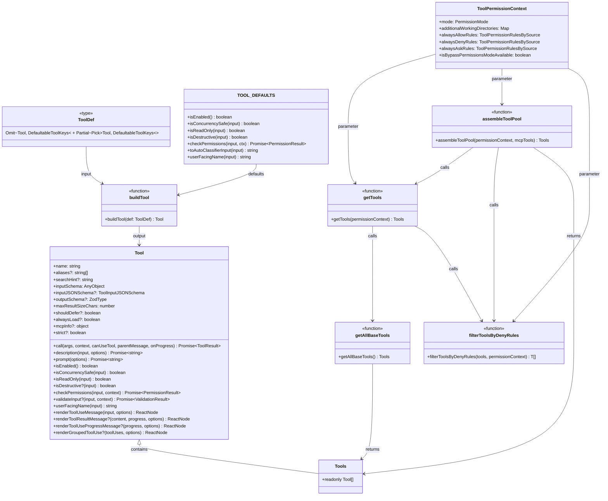

# 第八章：工具架构总览

## 8.1 引言

工具系统是 Claude Code 的可扩展性基石。通过定义统一的 `Tool` 接口，Claude Code 实现了：

1. **统一的工具抽象**：所有工具（内置工具、MCP 工具、技能工具）共享相同的接口
2. **灵活的权限控制**：每个工具可自定义权限检查逻辑
3. **丰富的 UI 渲染**：工具执行过程和结果都有专门的渲染机制
4. **安全的并发执行**：工具可声明是否安全并发执行

本章深入分析 `Tool.ts` 和 `tools.ts` 两个核心文件，揭示 Claude Code 工具系统的设计哲学。

---

## 8.2 Tool.ts 核心定义

### 8.2.1 Tool 类型接口

`Tool` 类型是工具系统的核心接口，定义在 `src/Tool.ts:362-695`。它是一个泛型接口，支持输入验证、输出类型和进度类型：

```typescript
export type Tool<
  Input extends AnyObject = AnyObject,
  Output = unknown,
  P extends ToolProgressData = ToolProgressData,
> = {
  // ... 接口定义
}
```

**核心字段分析**：

| 字段名 | 类型 | 说明 | 行号 |
|--------|------|------|------|
| `name` | `string` | 工具唯一标识名 | 456 |
| `aliases` | `string[]?` | 工具别名（向后兼容） | 369-371 |
| `searchHint` | `string?` | ToolSearch 关键字提示 | 374-378 |
| `inputSchema` | `Input` | Zod 输入验证 schema | 394 |
| `inputJSONSchema` | `ToolInputJSONSchema?` | JSON Schema 格式（MCP 工具） | 395-397 |
| `outputSchema` | `z.ZodType?` | 输出验证 schema | 400 |
| `maxResultSizeChars` | `number` | 结果最大字符数 | 466 |
| `shouldDefer` | `boolean?` | 是否延迟加载 | 442 |
| `alwaysLoad` | `boolean?` | 是否始终加载 | 449 |
| `mcpInfo` | `object?` | MCP 服务器信息 | 455 |
| `strict` | `boolean?` | 严格模式开关 | 472 |

**核心方法分析**：

| 方法名 | 返回类型 | 说明 | 行号 |
|--------|----------|------|------|
| `call()` | `Promise<ToolResult<Output>>` | 执行工具 | 379-385 |
| `description()` | `Promise<string>` | 生成工具描述 | 386-393 |
| `prompt()` | `Promise<string>` | 生成系统提示 | 518-523 |
| `isEnabled()` | `boolean` | 是否启用 | 403 |
| `isConcurrencySafe()` | `boolean` | 是否可并发执行 | 402 |
| `isReadOnly()` | `boolean` | 是否只读操作 | 404 |
| `isDestructive()` | `boolean?` | 是否破坏性操作 | 406 |
| `checkPermissions()` | `Promise<PermissionResult>` | 权限检查 | 500-503 |
| `validateInput()` | `Promise<ValidationResult>` | 输入验证 | 489-492 |
| `userFacingName()` | `string` | 用户可见名称 | 524 |

**UI 渲染方法**：

工具接口包含丰富的 UI 渲染方法，用于在终端中展示工具执行状态：

- `renderToolUseMessage()` (605-608)：渲染工具使用消息
- `renderToolResultMessage()` (566-580)：渲染工具结果
- `renderToolUseProgressMessage()` (625-634)：渲染进度
- `renderToolUseRejectedMessage()` (641-652)：渲染拒绝消息
- `renderToolUseErrorMessage()` (659-667)：渲染错误消息
- `renderGroupedToolUse()` (678-694)：渲染并行工具组

### 8.2.2 Tools 类型

`Tools` 类型是一个不可变数组，定义在 `src/Tool.ts:700-701`：

```typescript
export type Tools = readonly Tool[]
```

使用 `readonly` 确保工具集合不可变，防止意外修改。这个类型在整个代码库中用于表示工具集合，使得追踪工具集合的组装、传递和过滤更加容易。

### 8.2.3 工具辅助函数

**toolMatchesName()** - 名称匹配（含别名）

定义在 `src/Tool.ts:347-353`：

```typescript
export function toolMatchesName(
  tool: { name: string; aliases?: string[] },
  name: string,
): boolean {
  return tool.name === name || (tool.aliases?.includes(name) ?? false)
}
```

此函数支持通过工具主名称或别名进行匹配，实现向后兼容。

**findToolByName()** - 查找工具

定义在 `src/Tool.ts:358-360`：

```typescript
export function findToolByName(tools: Tools, name: string): Tool | undefined {
  return tools.find(t => toolMatchesName(t, name))
}
```

---

## 8.3 Tools 类型与聚合

### 8.3.1 getAllBaseTools() - 获取所有内置工具

`getAllBaseTools()` 函数是内置工具的权威来源，定义在 `src/tools.ts:193-251`：

```typescript
export function getAllBaseTools(): Tools {
  return [
    AgentTool,
    TaskOutputTool,
    BashTool,
    ...(hasEmbeddedSearchTools() ? [] : [GlobTool, GrepTool]),
    ExitPlanModeV2Tool,
    FileReadTool,
    FileEditTool,
    FileWriteTool,
    NotebookEditTool,
    WebFetchTool,
    // ... 更多工具
  ]
}
```

**条件加载机制**：

该函数使用条件展开语法 `...(condition ? [Tool] : [])` 实现动态工具加载：

| 条件 | 工具 | 行号 |
|------|------|------|
| `hasEmbeddedSearchTools()` | GlobTool, GrepTool | 201 |
| `process.env.USER_TYPE === 'ant'` | ConfigTool, TungstenTool | 214-215 |
| `isTodoV2Enabled()` | TaskCreateTool 等 | 218-220 |
| `isEnvTruthy(process.env.ENABLE_LSP_TOOL)` | LSPTool | 224 |
| `isWorktreeModeEnabled()` | EnterWorktreeTool, ExitWorktreeTool | 225 |
| `isAgentSwarmsEnabled()` | TeamCreateTool, TeamDeleteTool | 228-230 |
| `isToolSearchEnabledOptimistic()` | ToolSearchTool | 249 |

### 8.3.2 getTools() - 获取可用工具

`getTools()` 函数根据权限上下文返回可用工具，定义在 `src/tools.ts:271-327`：

```typescript
export const getTools = (permissionContext: ToolPermissionContext): Tools => {
  // Simple mode: only Bash, Read, and Edit tools
  if (isEnvTruthy(process.env.CLAUDE_CODE_SIMPLE)) {
    // ... 简化模式处理
    return filterToolsByDenyRules(simpleTools, permissionContext)
  }

  const tools = getAllBaseTools().filter(tool => !specialTools.has(tool.name))
  let allowedTools = filterToolsByDenyRules(tools, permissionContext)

  // REPL mode 过滤
  if (isReplModeEnabled()) {
    // ... REPL 模式处理
  }

  const isEnabled = allowedTools.map(_ => _.isEnabled())
  return allowedTools.filter((_, i) => isEnabled[i])
}
```

**三重过滤机制**：

1. **模式过滤**：Simple mode 只返回 Bash/Read/Edit
2. **权限过滤**：`filterToolsByDenyRules()` 移除被拒绝的工具
3. **启用过滤**：`isEnabled()` 检查工具是否激活

### 8.3.3 assembleToolPool() - 组合工具池

`assembleToolPool()` 函数合并内置工具和 MCP 工具，定义在 `src/tools.ts:345-367`：

```typescript
export function assembleToolPool(
  permissionContext: ToolPermissionContext,
  mcpTools: Tools,
): Tools {
  const builtInTools = getTools(permissionContext)
  const allowedMcpTools = filterToolsByDenyRules(mcpTools, permissionContext)

  // 按名称排序并去重
  const byName = (a: Tool, b: Tool) => a.name.localeCompare(b.name)
  return uniqBy(
    [...builtInTools].sort(byName).concat(allowedMcpTools.sort(byName)),
    'name',
  )
}
```

**设计要点**：

- 内置工具优先（`uniqBy` 保留插入顺序）
- 按名称排序确保提示缓存稳定
- 过滤 MCP 工具的拒绝规则

### 8.3.4 filterToolsByDenyRules() - 权限过滤

定义在 `src/tools.ts:262-269`：

```typescript
export function filterToolsByDenyRules<
  T extends {
    name: string
    mcpInfo?: { serverName: string; toolName: string }
  },
>(tools: readonly T[], permissionContext: ToolPermissionContext): T[] {
  return tools.filter(tool => !getDenyRuleForTool(permissionContext, tool))
}
```

此函数支持 MCP 服务器前缀规则，如 `mcp__server` 会移除该服务器所有工具。

---

## 8.4 buildTool() 工厂函数

### 8.4.1 设计理念

`buildTool()` 函数简化工具定义，为常用方法提供安全默认值。定义在 `src/Tool.ts:783-792`：

```typescript
export function buildTool<D extends AnyToolDef>(def: D): BuiltTool<D> {
  return {
    ...TOOL_DEFAULTS,
    userFacingName: () => def.name,
    ...def,
  } as BuiltTool<D>
}
```

### 8.4.2 默认值配置

`TOOL_DEFAULTS` 对象定义在 `src/Tool.ts:757-769`：

```typescript
const TOOL_DEFAULTS = {
  isEnabled: () => true,
  isConcurrencySafe: (_input?: unknown) => false,  // 假设不安全
  isReadOnly: (_input?: unknown) => false,          // 假设写操作
  isDestructive: (_input?: unknown) => false,
  checkPermissions: (
    input: { [key: string]: unknown },
    _ctx?: ToolUseContext,
  ): Promise<PermissionResult> =>
    Promise.resolve({ behavior: 'allow', updatedInput: input }),
  toAutoClassifierInput: (_input?: unknown) => '',
  userFacingName: (_input?: unknown) => '',
}
```

**默认值策略**：

- `isEnabled`: 默认启用
- `isConcurrencySafe`: **失败关闭**（默认不安全）
- `isReadOnly`: **失败关闭**（默认假设写操作）
- `checkPermissions`: 委托通用权限系统

### 8.4.3 ToolDef 类型

`ToolDef` 类型允许省略可默认化的方法，定义在 `src/Tool.ts:721-726`：

```typescript
export type ToolDef<
  Input extends AnyObject = AnyObject,
  Output = unknown,
  P extends ToolProgressData = ToolProgressData,
> = Omit<Tool<Input, Output, P>, DefaultableToolKeys> &
  Partial<Pick<Tool<Input, Output, P>, DefaultableToolKeys>>
```

可默认化的字段定义在 `src/Tool.ts:707-714`：

```typescript
type DefaultableToolKeys =
  | 'isEnabled'
  | 'isConcurrencySafe'
  | 'isReadOnly'
  | 'isDestructive'
  | 'checkPermissions'
  | 'toAutoClassifierInput'
  | 'userFacingName'
```

---

## 8.5 工具注册机制

### 8.5.1 静态导入 vs 条件导入

`tools.ts` 使用两种导入策略：

**静态导入**（始终加载）：

```typescript
import { AgentTool } from './tools/AgentTool/AgentTool.js'
import { SkillTool } from './tools/SkillTool/SkillTool.js'
import { BashTool } from './tools/BashTool/BashTool.js'
// ... 第 3-13 行
```

**条件导入**（动态加载）：

```typescript
const REPLTool =
  process.env.USER_TYPE === 'ant'
    ? require('./tools/REPLTool/REPLTool.js').REPLTool
    : null  // 第 16-19 行

const SleepTool =
  feature('PROACTIVE') || feature('KAIROS')
    ? require('./tools/SleepTool/SleepTool.js').SleepTool
    : null  // 第 25-28 行
```

### 8.5.2 Feature Flag 控制

多个工具通过 `feature()` 函数控制加载：

| Feature | 工具 | 行号 |
|---------|------|------|
| `AGENT_TRIGGERS` | cronTools (CronCreate/Delete/List) | 29-35 |
| `AGENT_TRIGGERS_REMOTE` | RemoteTriggerTool | 36-38 |
| `MONITOR_TOOL` | MonitorTool | 39-41 |
| `KAIROS` | SendUserFileTool, PushNotificationTool | 42-48 |
| `OVERFLOW_TEST_TOOL` | OverflowTestTool | 107-109 |
| `CONTEXT_COLLAPSE` | CtxInspectTool | 110-112 |
| `TERMINAL_PANEL` | TerminalCaptureTool | 113-115 |
| `WEB_BROWSER_TOOL` | WebBrowserTool | 117-119 |
| `COORDINATOR_MODE` | coordinatorModeModule | 120-122 |
| `HISTORY_SNIP` | SnipTool | 123-125 |
| `UDS_INBOX` | ListPeersTool | 126-128 |
| `WORKFLOW_SCRIPTS` | WorkflowTool | 129-134 |

### 8.5.3 惰性加载（避免循环依赖）

某些工具使用惰性 require 破除循环依赖，定义在 `src/tools.ts:63-72`：

```typescript
const getTeamCreateTool = () =>
  require('./tools/TeamCreateTool/TeamCreateTool.js')
    .TeamCreateTool as typeof import('./tools/TeamCreateTool/TeamCreateTool.js').TeamCreateTool

const getTeamDeleteTool = () =>
  require('./tools/TeamDeleteTool/TeamDeleteTool.js')
    .TeamDeleteTool

const getSendMessageTool = () =>
  require('./tools/SendMessageTool/SendMessageTool.js')
    .SendMessageTool
```

---

## 8.6 架构图



<div style="text-align: center;">
<strong>图 8-1：Tool 架构类图</strong>
</div>

---

## 8.7 总结

本章分析了 Claude Code 工具系统的核心架构：

1. **Tool 接口**：定义了工具的完整生命周期方法，包括执行、权限、渲染等
2. **Tools 类型**：不可变数组类型，便于追踪工具集合流转
3. **buildTool() 工厂**：简化工具定义，提供安全默认值
4. **工具聚合函数**：`getAllBaseTools()`、`getTools()`、`assembleToolPool()` 三层架构
5. **条件加载机制**：Feature Flag、环境变量、用户类型控制工具可用性

工具系统的设计体现了 Claude Code 的核心理念：

- **安全优先**：默认值采用"失败关闭"策略
- **可扩展性**：统一的接口支持内置工具、MCP 工具、技能工具
- **灵活控制**：多层过滤机制适应不同运行模式
- **性能优化**：条件导入和惰性加载减少启动开销

下一章将深入分析 `BashTool` 的实现，揭示命令执行、沙箱安全、权限检查等关键机制。