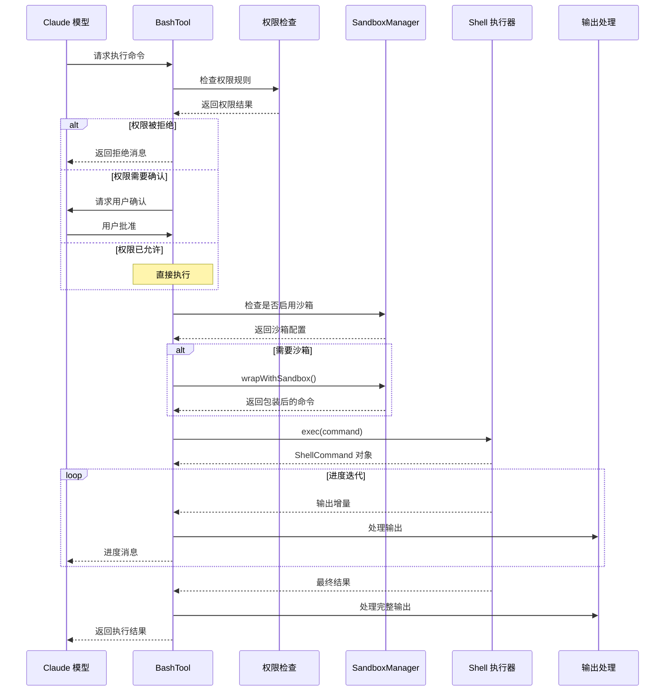
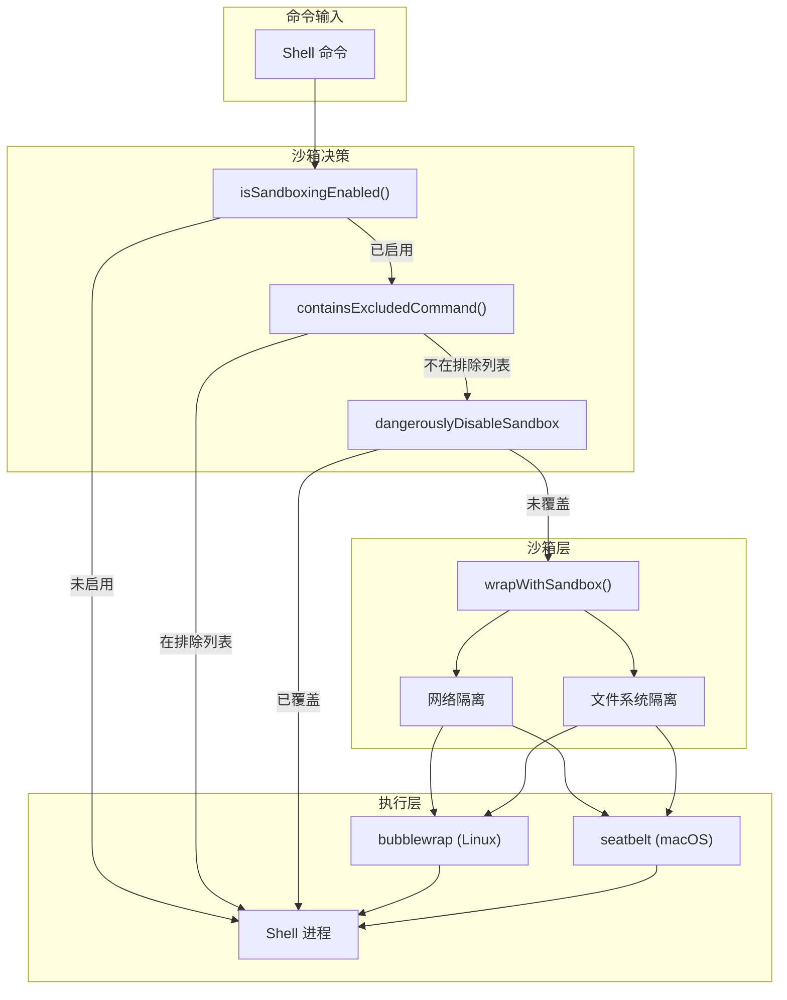
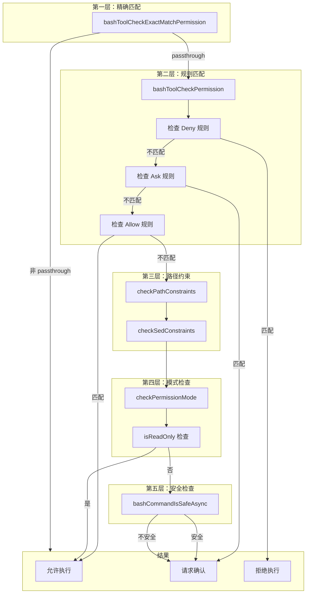

# 第九章：BashTool 深度解析

> BashTool 是 Claude Code 中使用频率最高的工具，负责执行 Shell 命令。本章将深入分析其执行流程、安全机制、权限检查以及后台运行模式，揭示这一核心工具的设计精髓。

---

## 9.1 引言：为什么 BashTool 最重要

在 Claude Code 的工具体系中，BashTool 扮演着"执行引擎"的角色。无论是构建项目、运行测试、Git 操作还是安装依赖，几乎所有需要实际执行的任务都通过 BashTool 完成。其使用频率远超其他工具，据统计，在典型开发场景中，BashTool 的调用占比超过 60%。

### 9.1.1 BashTool 的核心职责

BashTool 承担着以下关键职责：

1. **命令执行**：将 Claude 生成的 Shell 命令转化为实际操作
2. **安全隔离**：通过沙箱机制防止恶意命令损害系统
3. **权限控制**：确保每条命令都在用户授权范围内执行
4. **输出处理**：实时捕获命令输出，为 Claude 提供反馈
5. **后台执行**：支持长时间运行任务的异步处理

### 9.1.2 设计挑战

BashTool 的设计面临多重挑战：

| 挑战 | 解决方案 |
|-----|---------|
| 安全性 | Sandbox 沙箱隔离 + 权限检查双重防护 |
| 实时性 | AsyncGenerator 进度流 + 输出缓冲 |
| 可控性 | AbortController 中断机制 |
| 大输出 | 输出截断 + 文件持久化 |
| 长任务 | 后台执行 + 任务通知 |

---

## 9.2 Shell 命令执行流程

### 9.2.1 执行流程概览

BashTool 的命令执行采用 AsyncGenerator 模式，实现了从输入解析到输出捕获的完整流程。



**图 9-1：BashTool 执行流程时序图**

### 9.2.2 入口函数分析

BashTool 的核心入口是 `call` 函数，定义在 `src/tools/BashTool/BashTool.tsx:624-819`：

```typescript
async call(input: BashToolInput, toolUseContext, _canUseTool?, parentMessage?, onProgress?) {
  // 处理模拟 sed 编辑 - 直接应用而非运行 sed
  if (input._simulatedSedEdit) {
    return applySedEdit(input._simulatedSedEdit, toolUseContext, parentMessage);
  }
  
  const { abortController, getAppState, setAppState, setToolJSX } = toolUseContext;
  const stdoutAccumulator = new EndTruncatingAccumulator();
  
  // 使用 AsyncGenerator 版本的 runShellCommand
  const commandGenerator = runShellCommand({
    input,
    abortController,
    setAppState: toolUseContext.setAppStateForTasks ?? setAppState,
    setToolJSX,
    preventCwdChanges: !isMainThread,
    isMainThread,
    toolUseId: toolUseContext.toolUseId,
    agentId: toolUseContext.agentId
  });

  // 消费 generator 并捕获返回值
  let generatorResult;
  do {
    generatorResult = await commandGenerator.next();
    if (!generatorResult.done && onProgress) {
      const progress = generatorResult.value;
      onProgress({
        toolUseID: `bash-progress-${progressCounter++}`,
        data: {
          type: 'bash_progress',
          output: progress.output,
          fullOutput: progress.fullOutput,
          elapsedTimeSeconds: progress.elapsedTimeSeconds,
          totalLines: progress.totalLines,
          totalBytes: progress.totalBytes,
          taskId: progress.taskId,
          timeoutMs: progress.timeoutMs
        }
      });
    }
  } while (!generatorResult.done);

  // 获取 generator 的最终返回值
  result = generatorResult.value;
  trackGitOperations(input.command, result.code, result.stdout);
}
```

关键设计要点：

1. **模拟 Sed 编辑**：`_simulatedSedEdit` 字段用于权限预览后的直接应用，确保用户预览的内容就是实际写入的内容（`BashTool.tsx:360-419`）

2. **输出累积器**：`EndTruncatingAccumulator` 用于高效处理大输出，只保留末尾内容以显示最新的错误信息

3. **进度回调**：通过 `onProgress` 参数实时向 Claude 报告执行进度

### 9.2.3 runShellCommand Generator

命令执行的 Generator 实现（`BashTool.tsx:826-999`）：

```typescript
async function* runShellCommand({
  input,
  abortController,
  setAppState,
  setToolJSX,
  preventCwdChanges,
  isMainThread,
  toolUseId,
  agentId
}): AsyncGenerator<ProgressData, ExecResult, void> {
  const { command, description, timeout, run_in_background } = input;
  const timeoutMs = timeout || getDefaultTimeoutMs();
  
  // 进度信号：由共享轮询器的 onProgress 回调触发
  let resolveProgress: (() => void) | null = null;
  function createProgressSignal(): Promise<null> {
    return new Promise<null>(resolve => {
      resolveProgress = () => resolve(null);
    });
  }

  // 判断是否启用自动后台化
  const shouldAutoBackground = !isBackgroundTasksDisabled && isAutobackgroundingAllowed(command);
  
  const shellCommand = await exec(command, abortController.signal, 'bash', {
    timeout: timeoutMs,
    onProgress(lastLines, allLines, totalLines, totalBytes, isIncomplete) {
      lastProgressOutput = lastLines;
      fullOutput = allLines;
      lastTotalLines = totalLines;
      lastTotalBytes = isIncomplete ? totalBytes : 0;
      // 唤醒 generator 以 yield 新的进度数据
      const resolve = resolveProgress;
      if (resolve) {
        resolveProgress = null;
        resolve();
      }
    },
    preventCwdChanges,
    shouldUseSandbox: shouldUseSandbox(input),
    shouldAutoBackground
  });

  const resultPromise = shellCommand.result;

  // ... 进度迭代和后台处理逻辑
}
```

Generator 模式的优势：

- **实时进度**：每次 yield 传递最新输出状态
- **可控中断**：通过 AbortController 随时终止执行
- **后台切换**：可在执行过程中切换到后台模式

---

## 9.3 Sandbox 安全机制

### 9.3.1 沙箱架构概览

Claude Code 的沙箱系统基于 `@anthropic-ai/sandbox-runtime` 包，通过 `SandboxManager` 适配器层集成到 CLI 中。沙箱提供了操作系统级别的隔离，防止恶意命令损害用户系统。



**图 9-2：沙箱决策流程图**

### 9.3.2 shouldUseSandbox 函数

沙箱启用判断的核心函数（`src/tools/BashTool/shouldUseSandbox.ts:130-153`）：

```typescript
export function shouldUseSandbox(input: Partial<SandboxInput>): boolean {
  // 1. 检查沙箱是否全局启用
  if (!SandboxManager.isSandboxingEnabled()) {
    return false;
  }

  // 2. 检查是否明确禁用沙箱（且策略允许无沙箱命令）
  if (
    input.dangerouslyDisableSandbox &&
    SandboxManager.areUnsandboxedCommandsAllowed()
  ) {
    return false;
  }

  // 3. 检查是否有命令
  if (!input.command) {
    return false;
  }

  // 4. 检查命令是否在用户配置的排除列表中
  if (containsExcludedCommand(input.command)) {
    return false;
  }

  return true;
}
```

### 9.3.3 排除命令检测

`containsExcludedCommand` 函数（`shouldUseSandbox.ts:21-128`）负责检测用户配置的不需要沙箱的命令：

```typescript
function containsExcludedCommand(command: string): boolean {
  // 检查动态配置的禁用命令（仅内部 ant 用户）
  if (process.env.USER_TYPE === 'ant') {
    const disabledCommands = getFeatureValue_CACHED_MAY_BE_STALE<{
      commands: string[]
      substrings: string[]
    }>('tengu_sandbox_disabled_commands', { commands: [], substrings: [] });

    // 检查命令是否包含禁用的子字符串
    for (const substring of disabledCommands.substrings) {
      if (command.includes(substring)) {
        return true;
      }
    }

    // 检查命令是否以禁用的命令开头
    const commandParts = splitCommand_DEPRECATED(command);
    for (const part of commandParts) {
      const baseCommand = part.trim().split(' ')[0];
      if (baseCommand && disabledCommands.commands.includes(baseCommand)) {
        return true;
      }
    }
  }

  // 检查用户配置的排除命令
  const settings = getSettings_DEPRECATED();
  const userExcludedCommands = settings.sandbox?.excludedCommands ?? [];

  // 分割复合命令并检查每个子命令
  let subcommands: string[];
  try {
    subcommands = splitCommand_DEPRECATED(command);
  } catch {
    subcommands = [command];
  }

  for (const subcommand of subcommands) {
    const trimmed = subcommand.trim();
    // 生成候选匹配列表（去除环境变量和安全包装器）
    const candidates = [trimmed];
    // ... 迭代扩展候选列表
  }

  return false;
}
```

**重要提示**：排除命令机制是用户便利功能，而非安全边界。真正的安全控制是沙箱权限系统（需要用户确认）。

### 9.3.4 SandboxManager 适配器

`SandboxManager` 是沙箱系统的 CLI 适配层（`src/utils/sandbox/sandbox-adapter.ts:927-967`）：

```typescript
export const SandboxManager: ISandboxManager = {
  // 自定义实现
  initialize,
  isSandboxingEnabled,
  isSandboxEnabledInSettings: getSandboxEnabledSetting,
  isPlatformInEnabledList,
  getSandboxUnavailableReason,
  isAutoAllowBashIfSandboxedEnabled,
  areUnsandboxedCommandsAllowed,
  isSandboxRequired,
  areSandboxSettingsLockedByPolicy,
  setSandboxSettings,
  getExcludedCommands,
  wrapWithSandbox,
  refreshConfig,
  reset,
  checkDependencies,

  // 转发到基础沙箱管理器
  getFsReadConfig: BaseSandboxManager.getFsReadConfig,
  getFsWriteConfig: BaseSandboxManager.getFsWriteConfig,
  getNetworkRestrictionConfig: BaseSandboxManager.getNetworkRestrictionConfig,
  getIgnoreViolations: BaseSandboxManager.getIgnoreViolations,
  getLinuxGlobPatternWarnings,
  isSupportedPlatform,
  getAllowUnixSockets: BaseSandboxManager.getAllowUnixSockets,
  getAllowLocalBinding: BaseSandboxManager.getAllowLocalBinding,
  
  cleanupAfterCommand: (): void => {
    BaseSandboxManager.cleanupAfterCommand()
    scrubBareGitRepoFiles()  // 清理可能的恶意 Git 仓库文件
  },
};
```

关键功能：

1. **平台支持检测**：支持 macOS（seatbelt）、Linux/WSL2（bubblewrap）
2. **配置转换**：将 Claude Code 设置转换为 `SandboxRuntimeConfig`
3. **文件系统隔离**：读写路径的 allow/deny 配置
4. **网络隔离**：域名白名单、Unix socket 控制

### 9.3.5 安全配置转换

配置转换函数（`sandbox-adapter.ts:172-381`）将 Claude Code 设置转换为沙箱运行时配置：

```typescript
export function convertToSandboxRuntimeConfig(
  settings: SettingsJson,
): SandboxRuntimeConfig {
  const permissions = settings.permissions || {};

  // 从 WebFetch 规则提取网络域名
  const allowedDomains: string[] = [];
  const deniedDomains: string[] = [];
  
  for (const ruleString of permissions.allow || []) {
    const rule = permissionRuleValueFromString(ruleString);
    if (
      rule.toolName === WEB_FETCH_TOOL_NAME &&
      rule.ruleContent?.startsWith('domain:')
    ) {
      allowedDomains.push(rule.ruleContent.substring('domain:'.length));
    }
  }

  // 文件系统路径配置
  const allowWrite: string[] = ['.', getClaudeTempDir()];
  const denyWrite: string[] = [];
  const denyRead: string[] = [];

  // 始终拒绝写入 settings.json 文件（防止沙箱逃逸）
  const settingsPaths = SETTING_SOURCES.map(source =>
    getSettingsFilePathForSource(source),
  ).filter((p): p is string => p !== undefined);
  denyWrite.push(...settingsPaths);

  // 从 Edit/Read 规则提取文件系统路径
  for (const source of SETTING_SOURCES) {
    const sourceSettings = getSettingsForSource(source);
    if (sourceSettings?.permissions) {
      for (const ruleString of sourceSettings.permissions.allow || []) {
        const rule = permissionRuleValueFromString(ruleString);
        if (rule.toolName === FILE_EDIT_TOOL_NAME && rule.ruleContent) {
          allowWrite.push(resolvePathPatternForSandbox(rule.ruleContent, source));
        }
      }
    }
  }

  return {
    network: { allowedDomains, deniedDomains, ... },
    filesystem: { denyRead, allowRead, allowWrite, denyWrite },
    ignoreViolations: settings.sandbox?.ignoreViolations,
    ripgrep: ripgrepConfig,
  };
}
```

---

## 9.4 权限检查流程

### 9.4.1 权限检查层级

BashTool 的权限检查采用多层防护策略，从精确匹配到语义检查逐步放宽。



**图 9-3：权限检查层级流程图**

### 9.4.2 bashToolHasPermission 主函数

权限检查的入口函数（`bashPermissions.ts`，核心逻辑分布在多个辅助函数中）：

```typescript
// 精确匹配检查（bashPermissions.ts:991-1048）
export const bashToolCheckExactMatchPermission = (
  input: z.infer<typeof BashTool.inputSchema>,
  toolPermissionContext: ToolPermissionContext,
): PermissionResult => {
  const command = input.command.trim();
  const { matchingDenyRules, matchingAskRules, matchingAllowRules } =
    matchingRulesForInput(input, toolPermissionContext, 'exact');

  // 1. Deny 规则优先
  if (matchingDenyRules[0] !== undefined) {
    return {
      behavior: 'deny',
      message: `Permission to use ${BashTool.name} with command ${command} has been denied.`,
      decisionReason: { type: 'rule', rule: matchingDenyRules[0] },
    };
  }

  // 2. Ask 规则其次
  if (matchingAskRules[0] !== undefined) {
    return {
      behavior: 'ask',
      message: createPermissionRequestMessage(BashTool.name),
      decisionReason: { type: 'rule', rule: matchingAskRules[0] },
    };
  }

  // 3. Allow 规则
  if (matchingAllowRules[0] !== undefined) {
    return {
      behavior: 'allow',
      updatedInput: input,
      decisionReason: { type: 'rule', rule: matchingAllowRules[0] },
    };
  }

  // 4. Passthrough - 继续后续检查
  return {
    behavior: 'passthrough',
    message: createPermissionRequestMessage(BashTool.name, decisionReason),
    decisionReason,
    suggestions: suggestionForExactCommand(command),
  };
};
```

### 9.4.3 规则匹配逻辑

规则匹配函数（`bashPermissions.ts:778-935`）处理三种匹配模式：

```typescript
function filterRulesByContentsMatchingInput(
  input,
  rules: Map<string, PermissionRule>,
  matchMode: 'exact' | 'prefix',
  options,
): PermissionRule[] {
  const command = input.command.trim();
  
  // 剥离输出重定向（用于权限匹配）
  const commandWithoutRedirections =
    extractOutputRedirections(command).commandWithoutRedirections;

  // 剥离安全包装器（timeout, time, nice, nohup）和环境变量
  const commandsToTry = commandsForMatching.flatMap(cmd => {
    const strippedCommand = stripSafeWrappers(cmd);
    return strippedCommand !== cmd ? [cmd, strippedCommand] : [cmd];
  });

  // 对于 deny/ask 规则，还需剥离所有环境变量前缀
  if (stripAllEnvVars) {
    // 迭代应用两种剥离操作直到不动点
    const seen = new Set(commandsToTry);
    while (startIdx < commandsToTry.length) {
      for (const cmd of commandsToTry) {
        const envStripped = stripAllLeadingEnvVars(cmd);
        if (!seen.has(envStripped)) {
          commandsToTry.push(envStripped);
          seen.add(envStripped);
        }
        const wrapperStripped = stripSafeWrappers(cmd);
        // ...
      }
    }
  }

  return Array.from(rules.entries())
    .filter(([ruleContent]) => {
      const bashRule = bashPermissionRule(ruleContent);
      return commandsToTry.some(cmdToMatch => {
        switch (bashRule.type) {
          case 'exact':
            return bashRule.command === cmdToMatch;
          case 'prefix':
            // 安全：禁止前缀规则匹配复合命令
            if (isCompoundCommand.get(cmdToMatch)) {
              return false;
            }
            return cmdToMatch === bashRule.prefix ||
                   cmdToMatch.startsWith(bashRule.prefix + ' ');
          case 'wildcard':
            return matchWildcardPattern(bashRule.pattern, cmdToMatch);
        }
      });
    })
    .map(([, rule]) => rule);
}
```

**关键安全设计**：

1. **复合命令防护**：前缀规则不能匹配复合命令，防止 `Bash(cd:*)` 匹配 `cd /path && rm -rf /`
2. **环境变量剥离**：deny/ask 规需剥离所有环境变量，防止 `FOO=bar rm` 绕过 `Bash(rm:*)` deny 规则
3. **安全包装器剥离**：允许 `Bash(npm:*)` 匹配 `timeout 10 npm install`

### 9.4.4 安全环境变量白名单

`SAFE_ENV_VARS` 定义了可以安全剥离的环境变量（`bashPermissions.ts:378-430`）：

```typescript
const SAFE_ENV_VARS = new Set([
  // Go - 仅构建/运行时设置
  'GOEXPERIMENT', 'GOOS', 'GOARCH', 'CGO_ENABLED', 'GO111MODULE',

  // Rust - 仅日志/调试
  'RUST_BACKTRACE', 'RUST_LOG',

  // Node - 仅环境名称（不含 NODE_OPTIONS！）
  'NODE_ENV',

  // Python - 仅行为标志（不含 PYTHONPATH！）
  'PYTHONUNBUFFERED', 'PYTHONDONTWRITEBYTECODE',

  // API 密钥
  'ANTHROPIC_API_KEY',

  // 语言和字符编码
  'LANG', 'LANGUAGE', 'LC_ALL', 'LC_CTYPE', 'LC_TIME', 'CHARSET',

  // 终端和显示
  'TERM', 'COLORTERM', 'NO_COLOR', 'FORCE_COLOR', 'TZ',

  // 颜色配置
  'LS_COLORS', 'LSCOLORS', 'GREP_COLOR', 'GREP_COLORS', 'GCC_COLORS',
]);

// SECURITY: 这些变量绝不能加入白名单：
// - PATH, LD_PRELOAD, LD_LIBRARY_PATH, DYLD_*（执行/库加载）
// - PYTHONPATH, NODE_PATH, CLASSPATH, RUBYLIB（模块加载）
// - GOFLAGS, RUSTFLAGS, NODE_OPTIONS（可包含代码执行标志）
// - HOME, TMPDIR, SHELL, BASH_ENV（影响系统行为）
```

### 9.4.5 bashSecurity 安全检查

`bashSecurity.ts` 提供深度安全检查，检测潜在的命令注入和危险模式：

```typescript
// 检测危险模式（bashSecurity.ts:16-41）
const COMMAND_SUBSTITUTION_PATTERNS = [
  { pattern: /<\(/, message: 'process substitution <()' },
  { pattern: />\(/, message: 'process substitution >()' },
  { pattern: /=\(/, message: 'Zsh process substitution =()' },
  { pattern: /\$\(/, message: '$() command substitution' },
  { pattern: /\$\{/, message: '${} parameter substitution' },
  { pattern: /\$\[/, message: '$[] legacy arithmetic expansion' },
  { pattern: /~\[/, message: 'Zsh-style parameter expansion' },
  { pattern: /\(e:/, message: 'Zsh-style glob qualifiers' },
];

// Zsh 危险命令（bashSecurity.ts:45-74）
const ZSH_DANGEROUS_COMMANDS = new Set([
  'zmodload',   // 模块加载入口
  'emulate',    // eval 等价物
  'sysopen',    // 文件打开（zsh/system）
  'sysread',    // 文件读取
  'syswrite',   // 文件写入
  'zpty',       // 伪终端执行
  'ztcp',       // TCP 连接
  'zsocket',    // socket 创建
  'zf_rm',      // 内置 rm
  'zf_mv',      // 内置 mv
  // ... 更多危险命令
]);
```

---

## 9.5 进度追踪与输出处理

### 9.5.1 输出累积机制

BashTool 使用 `EndTruncatingAccumulator` 处理大输出，保留末尾内容：

```typescript
// BashTool.tsx:636
const stdoutAccumulator = new EndTruncatingAccumulator();
```

这种设计确保：

1. **错误信息可见**：Shell 命令的错误通常出现在输出末尾
2. **内存可控**：大输出不会导致内存溢出
3. **截断标记**：通过特殊标记告知 Claude 输出被截断

### 9.5.2 进度消息格式

进度消息的数据结构（`BashTool.tsx:844-853`）：

```typescript
type ProgressData = {
  type: 'progress';
  output: string;           // 最近输出行
  fullOutput: string;       // 完整输出
  elapsedTimeSeconds: number;
  totalLines: number;
  totalBytes?: number;
  taskId?: string;
  timeoutMs?: number;
};
```

### 9.5.3 大输出持久化

当输出超过阈值时，系统将其持久化到磁盘（`BashTool.tsx:732-753`）：

```typescript
const MAX_PERSISTED_SIZE = 64 * 1024 * 1024;  // 64 MB

if (result.outputFilePath && result.outputTaskId) {
  try {
    const fileStat = await fsStat(result.outputFilePath);
    persistedOutputSize = fileStat.size;
    await ensureToolResultsDir();
    const dest = getToolResultPath(result.outputTaskId, false);
    if (fileStat.size > MAX_PERSISTED_SIZE) {
      await fsTruncate(result.outputFilePath, MAX_PERSISTED_SIZE);
    }
    await link(result.outputFilePath, dest);
    persistedOutputPath = dest;
  } catch {
    // 文件可能已不存在 - stdout 预览足够
  }
}
```

### 9.5.4 UI 进度渲染

`UI.tsx` 中的进度渲染函数：

```typescript
export function renderToolUseProgressMessage(
  progressMessagesForMessage: ProgressMessage<BashProgress>[],
  options
): React.ReactNode {
  const lastProgress = progressMessagesForMessage.at(-1);
  if (!lastProgress || !lastProgress.data) {
    return (
      <MessageResponse height={1}>
        <Text dimColor>Running...</Text>
      </MessageResponse>
    );
  }
  const data = lastProgress.data;
  return (
    <ShellProgressMessage
      fullOutput={data.fullOutput}
      output={data.output}
      elapsedTimeSeconds={data.elapsedTimeSeconds}
      totalLines={data.totalLines}
      totalBytes={data.totalBytes}
      timeoutMs={data.timeoutMs}
      taskId={data.taskId}
      verbose={verbose}
    />
  );
}
```

---

## 9.6 后台执行模式

### 9.6.1 后台执行触发条件

BashTool 支持三种后台执行触发方式：

| 触发方式 | 条件 | 配置 |
|---------|-----|-----|
| 显式请求 | `run_in_background: true` | 模型参数 |
| 自动超时 | 命令超过 `ASSISTANT_BLOCKING_BUDGET_MS` (15s) | Kairos 功能 |
| 用户手动 | Ctrl+B 快捷键 | 终端交互 |

### 9.6.2 后台任务实现

后台任务的启动逻辑（`BashTool.tsx:904-963`）：

```typescript
// 后台任务启动辅助函数
async function spawnBackgroundTask(): Promise<string> {
  const handle = await spawnShellTask({
    command,
    description: description || command,
    shellCommand,
    toolUseId,
    agentId
  }, {
    abortController,
    getAppState,
    setAppState
  });
  return handle.taskId;
}

// 后台化处理函数
function startBackgrounding(eventName: string, backgroundFn?) {
  // 如果已有前台任务注册，原地后台化而非重新 spawn
  if (foregroundTaskId) {
    if (!backgroundExistingForegroundTask(
      foregroundTaskId,
      shellCommand,
      description || command,
      setAppState,
      toolUseId
    )) {
      return;
    }
    backgroundShellId = foregroundTaskId;
    logEvent(eventName, { command_type: getCommandTypeForLogging(command) });
    backgroundFn?.(foregroundTaskId);
    return;
  }

  // 无前台任务 - spawn 新后台任务
  void spawnBackgroundTask().then(shellId => {
    backgroundShellId = shellId;
    // 唤醒 generator 的 Promise.race
    const resolve = resolveProgress;
    if (resolve) {
      resolveProgress = null;
      resolve();
    }
    logEvent(eventName, { command_type: getCommandTypeForLogging(command) });
    if (backgroundFn) backgroundFn(shellId);
  });
}
```

### 9.6.3 自动后台化配置

自动后台化的控制变量（`BashTool.tsx:54-58, 220-226`）：

```typescript
const PROGRESS_THRESHOLD_MS = 2000;  // 2秒后显示进度
const ASSISTANT_BLOCKING_BUDGET_MS = 15_000;  // 15秒后自动后台化

// 禁止自动后台化的命令
const DISALLOWED_AUTO_BACKGROUND_COMMANDS = ['sleep'];

// 检查是否禁用后台任务
const isBackgroundTasksDisabled =
  isEnvTruthy(process.env.CLAUDE_CODE_DISABLE_BACKGROUND_TASKS);
```

### 9.6.4 Kairos 自动后台化

在 Kairos 模式下，主线程的阻塞命令会自动后台化（`BashTool.tsx:976-983`）：

```typescript
if (feature('KAIROS') && getKairosActive() && isMainThread && 
    !isBackgroundTasksDisabled && run_in_background !== true) {
  setTimeout(() => {
    if (shellCommand.status === 'running' && backgroundShellId === undefined) {
      assistantAutoBackgrounded = true;
      startBackgrounding('tengu_bash_command_assistant_auto_backgrounded');
    }
  }, ASSISTANT_BLOCKING_BUDGET_MS).unref();
}
```

### 9.6.5 后台任务结果返回

后台任务的结果格式（`BashTool.tsx:555-622`）：

```typescript
mapToolResultToToolResultBlockParam({
  interrupted,
  stdout,
  stderr,
  backgroundTaskId,
  backgroundedByUser,
  assistantAutoBackgrounded,
  persistedOutputPath,
  persistedOutputSize
}, toolUseID) {
  // 处理后台任务信息
  let backgroundInfo = '';
  if (backgroundTaskId) {
    const outputPath = getTaskOutputPath(backgroundTaskId);
    if (assistantAutoBackgrounded) {
      backgroundInfo = `Command exceeded the assistant-mode blocking budget (15s) 
        and was moved to background with ID: ${backgroundTaskId}. 
        It is still running — you will be notified when it completes. 
        Output is being written to: ${outputPath}.`;
    } else if (backgroundedByUser) {
      backgroundInfo = `Command was manually backgrounded by user with ID: ${backgroundTaskId}. 
        Output is being written to: ${outputPath}`;
    } else {
      backgroundInfo = `Command running in background with ID: ${backgroundTaskId}. 
        Output is being written to: ${outputPath}`;
    }
  }
  
  return {
    tool_use_id: toolUseID,
    type: 'tool_result',
    content: [processedStdout, errorMessage, backgroundInfo].filter(Boolean).join('\n'),
    is_error: interrupted
  };
}
```

---

## 9.7 总结

### 9.7.1 核心设计要点

BashTool 的设计体现了多层防护、渐进验证的安全哲学：

1. **双重安全边界**：权限检查（应用层）+ 沙箱隔离（系统层）
2. **实时反馈**：AsyncGenerator 模式提供进度可见性
3. **优雅降级**：大输出截断、后台执行、错误恢复
4. **用户友好**：智能规则建议、排除命令配置

### 9.7.2 关键文件索引

| 文件 | 职责 |
|-----|-----|
| `src/tools/BashTool/BashTool.tsx` | 工具定义、执行流程、输出处理 |
| `src/tools/BashTool/bashPermissions.ts` | 权限规则匹配、建议生成 |
| `src/tools/BashTool/bashSecurity.ts` | 安全检查、危险模式检测 |
| `src/tools/BashTool/shouldUseSandbox.ts` | 沙箱启用判断 |
| `src/utils/sandbox/sandbox-adapter.ts` | 沙箱配置转换、平台适配 |
| `src/tools/BashTool/UI.tsx` | UI 渲染组件 |
| `src/tools/BashTool/utils.ts` | 输出处理辅助函数 |

### 9.7.3 设计启示

BashTool 的架构为设计安全执行系统提供了宝贵经验：

- **信任最小化**：即使模型生成的命令也需严格检查
- **渐进验证**：从精确匹配到语义检查，层层把关
- **透明执行**：实时进度、完整日志、用户可控中断
- **弹性设计**：大输出处理、后台执行、错误恢复

---

## 参考资料

- `src/tools/BashTool/BashTool.tsx:420-825` - 工具核心实现
- `src/tools/BashTool/bashPermissions.ts:991-1177` - 权限检查流程
- `src/tools/BashTool/bashSecurity.ts:1-500` - 安全验证逻辑
- `src/utils/sandbox/sandbox-adapter.ts:172-381` - 配置转换
- `src/utils/permissions/bashClassifier.ts` - 命令分类器