# 第十章：文件操作工具集

> 本章深入解析 Claude Code 的文件操作核心工具：FileReadTool、FileEditTool 和 FileWriteTool，揭示其设计理念、实现细节与安全保障机制。

---

## 10.1 引言：文件操作作为核心能力

在 Claude Code 的工具体系中，文件操作是最基础也是最核心的能力之一。模型通过读取文件理解代码库，通过编辑和写入文件实现代码修改。三大文件工具构成了一个完整的文件操作闭环：

- **Read（FileReadTool）**：读取文件内容，支持文本、图像、PDF、Jupyter Notebook 等多种格式
- **Edit（FileEditTool）**：精确字符串替换，支持单次替换和批量替换
- **Write（FileWriteTool）**：完整文件覆盖或创建新文件

这三个工具的设计遵循一个核心原则：**先读后写**。模型必须先读取文件，才能进行编辑或写入操作。这一机制通过 `readFileState` 缓存实现，既保证了操作安全性，又支持并发修改检测。

---

## 10.2 FileReadTool 实现：多格式文件读取

### 10.2.1 工具定义与输入参数

FileReadTool 位于 `src/tools/FileReadTool/FileReadTool.ts`，是功能最丰富的文件工具。其输入参数包括：

```typescript
// src/tools/FileReadTool/FileReadTool.ts:227-243
const inputSchema = lazySchema(() =>
  z.strictObject({
    file_path: z.string().describe('The absolute path to the file to read'),
    offset: semanticNumber(z.number().int().nonnegative().optional()).describe(
      'The line number to start reading from. Only provide if the file is too large to read at once',
    ),
    limit: semanticNumber(z.number().int().positive().optional()).describe(
      'The number of lines to read. Only provide if the file is too large to read at once.',
    ),
    pages: z
      .string()
      .optional()
      .describe(
        `Page range for PDF files (e.g., "1-5", "3", "10-20"). Only applicable to PDF files. Maximum ${PDF_MAX_PAGES_PER_READ} pages per request.`,
      ),
  }),
)
```

参数说明：
- `file_path`：必须是绝对路径，支持路径扩展（如 `~` 展开）
- `offset`：起始行号（从 1 开始），用于分段读取大文件
- `limit`：读取行数限制，默认读取完整文件
- `pages`：PDF 文件专用，指定页面范围

### 10.2.2 多格式支持机制

FileReadTool 支持多种文件格式，通过 `callInner` 函数的分发逻辑实现：

```typescript
// src/tools/FileReadTool/FileReadTool.ts:804-863
async function callInner(...) {
  // --- Notebook ---
  if (ext === 'ipynb') {
    const cells = await readNotebook(resolvedFilePath)
    // ...
    return { data: { type: 'notebook', file: { filePath, cells } } }
  }

  // --- Image ---
  if (IMAGE_EXTENSIONS.has(ext)) {
    const data = await readImageWithTokenBudget(resolvedFilePath, maxTokens)
    // ...
    return { data }
  }

  // --- PDF ---
  if (isPDFExtension(ext)) {
    // 支持页面提取或完整读取
    // ...
  }

  // --- Text file ---
  // 默认文本文件处理
}
```

输出类型通过 discriminated union 定义：

```typescript
// src/tools/FileReadTool/FileReadTool.ts:257-331
return z.discriminatedUnion('type', [
  z.object({ type: z.literal('text'), file: ... }),
  z.object({ type: z.literal('image'), file: ... }),
  z.object({ type: z.literal('notebook'), file: ... }),
  z.object({ type: z.literal('pdf'), file: ... }),
  z.object({ type: z.literal('parts'), file: ... }),  // PDF 页面提取
  z.object({ type: z.literal('file_unchanged'), file: ... }),
])
```

### 10.2.3 文本文件的行号格式化

读取文本文件时，返回内容使用 `cat -n` 格式添加行号：

```typescript
// src/tools/FileReadTool/prompt.ts:14-15
export const LINE_FORMAT_INSTRUCTION =
  '- Results are returned using cat -n format, with line numbers starting at 1'
```

行号添加通过 `addLineNumbers` 函数实现，格式为：`行号 + tab + 内容` 或 `spaces + 行号 + arrow + 内容`（根据配置）。

### 10.2.4 Token 限制与安全机制

FileReadTool 实现了多层安全机制：

**1. 文件大小限制**
```typescript
// src/tools/FileReadTool/FileReadTool.ts:755-772
async function validateContentTokens(content: string, ext: string, maxTokens?: number) {
  const effectiveMaxTokens = maxTokens ?? getDefaultFileReadingLimits().maxTokens
  const tokenEstimate = roughTokenCountEstimationForFileType(content, ext)
  if (!tokenEstimate || tokenEstimate <= effectiveMaxTokens / 4) return
  
  const tokenCount = await countTokensWithAPI(content)
  if (effectiveCount > effectiveMaxTokens) {
    throw new MaxFileReadTokenExceededError(effectiveCount, effectiveMaxTokens)
  }
}
```

**2. 二进制文件检测**
```typescript
// src/tools/FileReadTool/FileReadTool.ts:469-482
if (
  hasBinaryExtension(fullFilePath) &&
  !isPDFExtension(ext) &&
  !IMAGE_EXTENSIONS.has(ext.slice(1))
) {
  return {
    result: false,
    message: `This tool cannot read binary files...`,
    errorCode: 4,
  }
}
```

**3. 设备文件阻塞检测**
防止读取会无限输出或阻塞的设备文件：
```typescript
// src/tools/FileReadTool/FileReadTool.ts:97-128
const BLOCKED_DEVICE_PATHS = new Set([
  '/dev/zero', '/dev/random', '/dev/urandom', '/dev/full',
  '/dev/stdin', '/dev/tty', '/dev/console',
  '/dev/stdout', '/dev/stderr',
  '/dev/fd/0', '/dev/fd/1', '/dev/fd/2',
])
```

### 10.2.5 PDF 支持与图像处理

PDF 文件通过 `pdf.ts` 模块处理，支持两种模式：

1. **完整读取**：小 PDF（≤10页）可直接发送给模型
2. **页面提取**：大 PDF 需指定页面范围，转换为图像发送

```typescript
// src/tools/FileReadTool/FileReadTool.ts:894-1017
if (isPDFExtension(ext)) {
  if (pages) {
    // 提取指定页面为图像
    const extractResult = await extractPDFPages(resolvedFilePath, parsedRange)
    // ...
  }
  
  const pageCount = await getPDFPageCount(resolvedFilePath)
  if (pageCount > PDF_AT_MENTION_INLINE_THRESHOLD) {
    throw new Error('PDF too large, use pages parameter...')
  }
  
  // 读取完整 PDF
  const readResult = await readPDF(resolvedFilePath)
}
```

图像处理通过 `readImageWithTokenBudget` 函数实现智能压缩：
```typescript
// src/tools/FileReadTool/FileReadTool.ts:1097-1183
export async function readImageWithTokenBudget(filePath: string, maxTokens: number) {
  // 读取一次
  const imageBuffer = await getFsImplementation().readFileBytes(filePath, maxBytes)
  
  // 标准调整大小
  const resized = await maybeResizeAndDownsampleImageBuffer(...)
  
  // Token 预算检查
  const estimatedTokens = Math.ceil(result.file.base64.length * 0.125)
  if (estimatedTokens > maxTokens) {
    // 激进压缩
    const compressed = await compressImageBufferWithTokenLimit(...)
  }
}
```

---

## 10.3 FileEditTool 编辑机制：精确字符串替换

### 10.3.1 工具定义与核心参数

FileEditTool 实现精确字符串替换编辑，位于 `src/tools/FileEditTool/FileEditTool.ts`：

```typescript
// src/tools/FileEditTool/types.ts:6-19
const inputSchema = lazySchema(() =>
  z.strictObject({
    file_path: z.string().describe('The absolute path to the file to modify'),
    old_string: z.string().describe('The text to replace'),
    new_string: z
      .string()
      .describe('The text to replace it with (must be different from old_string)'),
    replace_all: semanticBoolean(z.boolean().default(false).optional())
      .describe('Replace all occurrences of old_string (default false)'),
  }),
)
```

参数说明：
- `old_string`：要替换的文本，必须在文件中唯一（除非使用 `replace_all`）
- `new_string`：替换后的文本
- `replace_all`：全局替换标志，用于变量重命名等场景

### 10.3.2 验证流程

FileEditTool 的验证流程非常严格，包含多重检查：

```typescript
// src/tools/FileEditTool/FileReadTool.ts:137-361
async validateInput(input: FileEditInput, toolUseContext: ToolUseContext) {
  // 1. 检查新旧字符串是否相同
  if (old_string === new_string) {
    return { result: false, message: 'No changes to make...' }
  }

  // 2. 检查权限拒绝规则
  const denyRule = matchingRuleForInput(fullFilePath, ..., 'edit', 'deny')
  if (denyRule !== null) {
    return { result: false, message: 'File is denied by permission settings.' }
  }

  // 3. 文件大小限制（防止 OOM）
  const { size } = await fs.stat(fullFilePath)
  if (size > MAX_EDIT_FILE_SIZE) {
    return { result: false, message: 'File is too large...' }
  }

  // 4. 文件存在性检查
  if (fileContent === null) {
    if (old_string === '') {
      return { result: true }  // 创建新文件
    }
    return { result: false, message: 'File does not exist...' }
  }

  // 5. 读取状态检查（核心安全机制）
  const readTimestamp = toolUseContext.readFileState.get(fullFilePath)
  if (!readTimestamp || readTimestamp.isPartialView) {
    return { result: false, message: 'File has not been read yet...' }
  }

  // 6. 文件修改时间检查（并发冲突检测）
  if (readTimestamp) {
    const lastWriteTime = getFileModificationTime(fullFilePath)
    if (lastWriteTime > readTimestamp.timestamp) {
      // 内容比对作为 Windows 平台的 fallback
      if (isFullRead && fileContent === readTimestamp.content) {
        // 内容未变，可继续
      } else {
        return { result: false, message: 'File has been modified since read...' }
      }
    }
  }

  // 7. 字符串匹配检查
  const actualOldString = findActualString(file, old_string)
  if (!actualOldString) {
    return { result: false, message: 'String to replace not found...' }
  }

  // 8. 多次匹配检查
  const matches = file.split(actualOldString).length - 1
  if (matches > 1 && !replace_all) {
    return { result: false, message: `Found ${matches} matches, use replace_all...` }
  }
}
```

### 10.3.3 字符串匹配与引号规范化

FileEditTool 实现了智能的字符串匹配机制，处理弯引号和直引号的差异：

```typescript
// src/tools/FileEditTool/utils.ts:73-93
export function findActualString(fileContent: string, searchString: string): string | null {
  // 首先尝试精确匹配
  if (fileContent.includes(searchString)) {
    return searchString
  }

  // 尝试引号规范化匹配
  const normalizedSearch = normalizeQuotes(searchString)
  const normalizedFile = normalizeQuotes(fileContent)

  const searchIndex = normalizedFile.indexOf(normalizedSearch)
  if (searchIndex !== -1) {
    // 返回文件中的实际字符串（保留原始引号风格）
    return fileContent.substring(searchIndex, searchIndex + searchString.length)
  }

  return null
}

// src/tools/FileEditTool/utils.ts:31-37
export function normalizeQuotes(str: string): string {
  return str
    .replaceAll(LEFT_SINGLE_CURLY_QUOTE, "'")
    .replaceAll(RIGHT_SINGLE_CURLY_QUOTE, "'")
    .replaceAll(LEFT_DOUBLE_CURLY_QUOTE, '"')
    .replaceAll(RIGHT_DOUBLE_CURLY_QUOTE, '"')
}
```

当文件使用弯引号而模型输出直引号时，编辑后会自动保持文件的引号风格：

```typescript
// src/tools/FileEditTool/utils.ts:104-136
export function preserveQuoteStyle(oldString: string, actualOldString: string, newString: string): string {
  if (oldString === actualOldString) {
    return newString  // 无需规范化
  }

  // 检测文件中的引号类型
  const hasDoubleQuotes = actualOldString.includes(LEFT_DOUBLE_CURLY_QUOTE) || ...
  const hasSingleQuotes = actualOldString.includes(LEFT_SINGLE_CURLY_QUOTE) || ...

  // 应用相同风格到新字符串
  if (hasDoubleQuotes) result = applyCurlyDoubleQuotes(result)
  if (hasSingleQuotes) result = applyCurlySingleQuotes(result)

  return result
}
```

### 10.3.4 编辑执行流程

编辑执行的原子性是设计核心，通过同步操作保证：

```typescript
// src/tools/FileEditTool/FileEditTool.ts:387-574
async call(input: FileEditInput, ...) {
  // 1. 发现技能目录（非阻塞）
  const newSkillDirs = await discoverSkillDirsForPaths([absoluteFilePath], cwd)

  // 2. 创建父目录
  await fs.mkdir(dirname(absoluteFilePath))

  // 3. 文件历史备份（如果启用）
  if (fileHistoryEnabled()) {
    await fileHistoryTrackEdit(...)
  }

  // === 原子操作区域开始 ===
  // 避免 async 操作以保持原子性
  
  // 4. 加载当前状态并检查修改时间
  const { content: originalFileContents, encoding, lineEndings } = readFileForEdit(absoluteFilePath)
  
  if (fileExists) {
    const lastWriteTime = getFileModificationTime(absoluteFilePath)
    const lastRead = readFileState.get(absoluteFilePath)
    if (lastWriteTime > lastRead.timestamp) {
      // 内容比对 fallback
      if (!contentUnchanged) {
        throw new Error(FILE_UNEXPECTEDLY_MODIFIED_ERROR)
      }
    }
  }

  // 5. 找到实际字符串并保持引号风格
  const actualOldString = findActualString(originalFileContents, old_string) || old_string
  const actualNewString = preserveQuoteStyle(old_string, actualOldString, new_string)

  // 6. 生成 patch
  const { patch, updatedFile } = getPatchForEdit({
    filePath, fileContents: originalFileContents,
    oldString: actualOldString, newString: actualNewString, replaceAll
  })

  // 7. 写入磁盘（同步）
  writeTextContent(absoluteFilePath, updatedFile, encoding, endings)

  // === 原子操作区域结束 ===

  // 8. LSP 通知
  lspManager.changeFile(absoluteFilePath, updatedFile)
  lspManager.saveFile(absoluteFilePath)

  // 9. 更新读取状态缓存
  readFileState.set(absoluteFilePath, {
    content: updatedFile,
    timestamp: getFileModificationTime(absoluteFilePath),
    offset: undefined,
    limit: undefined,
  })
}
```

关键设计点：
- **原子区域**：从加载文件到写入磁盘之间避免任何 async 操作，防止并发编辑交错
- **编码保持**：自动检测并保持文件编码（UTF-8、UTF-16LE）
- **行尾保持**：保持原有行尾风格（CRLF 或 LF）

---

## 10.4 FileWriteTool 写入流程：完整文件覆盖

### 10.4.1 工具定义与使用场景

FileWriteTool 用于创建新文件或完整覆盖现有文件：

```typescript
// src/tools/FileWriteTool/FileWriteTool.ts:56-65
const inputSchema = lazySchema(() =>
  z.strictObject({
    file_path: z
      .string()
      .describe('The absolute path to the file to write (must be absolute, not relative)'),
    content: z.string().describe('The content to write to the file'),
  }),
)
```

使用场景区分：
- **创建**：文件不存在时创建新文件
- **更新**：文件存在时完整覆盖

输出类型通过 `type` 字段区分：
```typescript
// src/tools/FileWriteTool/FileWriteTool.ts:68-89
const outputSchema = lazySchema(() =>
  z.object({
    type: z.enum(['create', 'update']),
    filePath: z.string(),
    content: z.string(),
    structuredPatch: z.array(hunkSchema()),
    originalFile: z.string().nullable(),
  }),
)
```

### 10.4.2 验证流程

FileWriteTool 的验证同样强调"先读后写"：

```typescript
// src/tools/FileWriteTool/FileWriteTool.ts:153-221
async validateInput({ file_path, content }, toolUseContext: ToolUseContext) {
  // 1. 检查 secrets
  const secretError = checkTeamMemSecrets(fullFilePath, content)
  if (secretError) return { result: false, message: secretError }

  // 2. 检查权限拒绝规则
  const denyRule = matchingRuleForInput(fullFilePath, ..., 'edit', 'deny')
  if (denyRule !== null) return { result: false, ... }

  // 3. 检查文件存在性
  try {
    const fileStat = await fs.stat(fullFilePath)
    fileMtimeMs = fileStat.mtimeMs
  } catch (e) {
    if (isENOENT(e)) return { result: true }  // 文件不存在，允许创建
  }

  // 4. 读取状态检查（核心）
  const readTimestamp = toolUseContext.readFileState.get(fullFilePath)
  if (!readTimestamp || readTimestamp.isPartialView) {
    return { result: false, message: 'File has not been read yet...' }
  }

  // 5. 修改时间检查
  if (lastWriteTime > readTimestamp.timestamp) {
    return { result: false, message: 'File has been modified since read...' }
  }

  return { result: true }
}
```

### 10.4.3 执行流程与原子性保证

```typescript
// src/tools/FileWriteTool/FileWriteTool.ts:223-417
async call({ file_path, content }, ...) {
  // 1. 发现技能目录
  const newSkillDirs = await discoverSkillDirsForPaths([fullFilePath], cwd)

  // 2. 创建父目录（原子区域外）
  await getFsImplementation().mkdir(dir)

  // 3. 文件历史备份
  if (fileHistoryEnabled()) {
    await fileHistoryTrackEdit(...)
  }

  // === 原子操作区域开始 ===
  
  // 4. 加载当前状态
  let meta = readFileSyncWithMetadata(fullFilePath)
  if (isENOENT(e)) meta = null

  // 5. 修改时间检查
  if (meta !== null) {
    const lastWriteTime = getFileModificationTime(fullFilePath)
    const lastRead = readFileState.get(fullFilePath)
    if (!lastRead || lastWriteTime > lastRead.timestamp) {
      if (!isFullRead || meta.content !== lastRead.content) {
        throw new Error(FILE_UNEXPECTEDLY_MODIFIED_ERROR)
      }
    }
  }

  // 6. 写入文件
  // 注意：Write 不保留原有行尾，而是使用 LF
  // 因为模型发送的 content 包含明确的行尾意图
  writeTextContent(fullFilePath, content, enc, 'LF')

  // === 原子操作区域结束 ===

  // 7. LSP 通知与状态更新
  lspManager.changeFile(fullFilePath, content)
  readFileState.set(fullFilePath, { content, timestamp: ... })

  // 8. 返回结果
  if (oldContent) {
    return { data: { type: 'update', filePath, content, structuredPatch: patch, originalFile: oldContent } }
  }
  return { data: { type: 'create', filePath, content, structuredPatch: [], originalFile: null } }
}
```

关键差异点（与 FileEditTool 相比）：
- **行尾处理**：Write 使用 LF（模型意图），Edit 保持原行尾风格
- **Patch 生成**：Write 生成完整 diff，Edit 生成精确替换的 diff

---

## 10.5 文件状态缓存：readFileState 机制

### 10.5.1 缓存结构设计

`readFileState` 是文件操作安全的核心机制，通过 `FileStateCache` 类实现：

```typescript
// src/utils/fileStateCache.ts:4-15
export type FileState = {
  content: string
  timestamp: number      // 文件修改时间（毫秒）
  offset: number | undefined   // 读取起始行
  limit: number | undefined    // 读取行数限制
  isPartialView?: boolean      // 是否为部分视图（如 CLAUDE.md 注入）
}
```

缓存状态说明：
- `content`：文件内容（用于 Windows 平台的内容比对 fallback）
- `timestamp`：读取时的文件 mtime
- `offset/limit`：记录读取范围，用于去重判断
- `isPartialView`：标记部分内容注入，此类文件必须显式读取才能编辑

### 10.5.2 LRU 缓存实现

```typescript
// src/utils/fileStateCache.ts:30-93
export class FileStateCache {
  private cache: LRUCache<string, FileState>

  constructor(maxEntries: number, maxSizeBytes: number) {
    this.cache = new LRUCache<string, FileState>({
      max: maxEntries,
      maxSize: maxSizeBytes,
      sizeCalculation: value => Math.max(1, Buffer.byteLength(value.content)),
    })
  }

  get(key: string): FileState | undefined {
    return this.cache.get(normalize(key))  // 路径规范化
  }

  set(key: string, value: FileState): this {
    this.cache.set(normalize(key), value)
    return this
  }

  // ... has, delete, clear, entries 等
}
```

关键设计：
- **路径规范化**：所有路径通过 `normalize()` 处理，确保不同格式路径（如 `/foo/../bar`）产生相同的缓存键
- **双重限制**：同时限制条目数（默认 100）和总大小（默认 25MB）
- **大小计算**：使用 `Buffer.byteLength` 计算内容大小

### 10.5.3 缓存生命周期

缓存状态在三个阶段更新：

**1. FileReadTool 读取时**
```typescript
// src/tools/FileReadTool/FileReadTool.ts:1032-1037
readFileState.set(fullFilePath, {
  content,
  timestamp: Math.floor(mtimeMs),
  offset,
  limit,
})
```

**2. FileEditTool 编辑后**
```typescript
// src/tools/FileEditTool/FileEditTool.ts:520-525
readFileState.set(absoluteFilePath, {
  content: updatedFile,
  timestamp: getFileModificationTime(absoluteFilePath),
  offset: undefined,
  limit: undefined,
})
```

**3. FileWriteTool 写入后**
```typescript
// src/tools/FileWriteTool/FileWriteTool.ts:332-337
readFileState.set(fullFilePath, {
  content,
  timestamp: getFileModificationTime(fullFilePath),
  offset: undefined,
  limit: undefined,
})
```

注意：编辑和写入后，`offset/limit` 设为 `undefined`，表示完整文件视图。

### 10.5.4 去重机制

FileReadTool 实现了智能去重，避免重复发送相同内容：

```typescript
// src/tools/FileReadTool/FileReadTool.ts:536-573
const existingState = readFileState.get(fullFilePath)
if (existingState && !existingState.isPartialView && existingState.offset !== undefined) {
  const rangeMatch = existingState.offset === offset && existingState.limit === limit
  if (rangeMatch) {
    const mtimeMs = await getFileModificationTimeAsync(fullFilePath)
    if (mtimeMs === existingState.timestamp) {
      logEvent('tengu_file_read_dedup', { ext })
      return {
        data: {
          type: 'file_unchanged' as const,
          file: { filePath: file_path },
        },
      }
    }
  }
}
```

去重条件：
- 已存在缓存条目
- 非部分视图
- 读取范围完全匹配
- 文件修改时间未变

返回 `file_unchanged` 类型，提示模型引用之前的读取结果：

```typescript
// src/tools/FileReadTool/prompt.ts:7-8
export const FILE_UNCHANGED_STUB =
  'File unchanged since last read. The content from the earlier Read tool_result in this conversation is still current — refer to that instead of re-reading.'
```

---

## 10.6 文件操作流程图

```mermaid
flowchart TB
    subgraph Read["FileReadTool 流程"]
        R1[接收 file_path + offset + limit + pages]
        R2[路径规范化与权限检查]
        R3{文件类型判断}
        R4[文本文件读取]
        R5[图像处理与压缩]
        R6[PDF 页面提取或读取]
        R7[Jupyter Notebook 解析]
        R8[更新 readFileState 缓存]
        R9[添加行号并返回]
        
        R1 --> R2 --> R3
        R3 -->|文本| R4 --> R8 --> R9
        R3 -->|图像| R5 --> R9
        R3 -->|PDF| R6 --> R9
        R3 -->|.ipynb| R7 --> R8 --> R9
    end

    subgraph Edit["FileEditTool 流程"]
        E1[接收 file_path + old_string + new_string + replace_all]
        E2[验证：old != new]
        E3[权限检查]
        E4[文件大小检查]
        E5[读取状态检查]
        E6{readFileState 存在?}
        E7[错误：需先读取]
        E8[修改时间检查]
        E9{文件被修改?}
        E10[错误：文件已变更]
        E11[字符串匹配与引号规范化]
        E12{字符串找到?}
        E13[错误：字符串不存在]
        E14{多次匹配且无 replace_all?}
        E15[错误：需更多上下文或 replace_all]
        E16[原子读取-编辑-写入]
        E17[生成 Patch]
        E18[更新 readFileState]
        E19[LSP 通知]
        E20[返回成功结果]
        
        E1 --> E2 --> E3 --> E4 --> E5 --> E6
        E6 -->|否| E7
        E6 -->|是| E8 --> E9
        E9 -->|是| E10
        E9 -->|否| E11 --> E12
        E12 -->|否| E13
        E12 -->|是| E14 --> E15
        E14 -->|否| E16 --> E17 --> E18 --> E19 --> E20
    end

    subgraph Write["FileWriteTool 流程"]
        W1[接收 file_path + content]
        W2[权限检查]
        W3{文件存在?}
        W4[创建模式验证]
        W5[读取状态检查]
        W6{readFileState 存在?}
        W7[错误：需先读取]
        W8[修改时间检查]
        W9{文件被修改?}
        W10[错误：文件已变更]
        W11[原子读取-写入]
        W12[更新 readFileState]
        W13[LSP 通知]
        W14{文件类型}
        W15[返回 create 结果]
        W16[返回 update 结果 + Patch]
        
        W1 --> W2 --> W3
        W3 -->|不存在| W4 --> W11 --> W12 --> W13 --> W14 --> W15
        W3 -->|存在| W5 --> W6
        W6 -->|否| W7
        W6 -->|是| W8 --> W9
        W9 -->|是| W10
        W9 -->|否| W11 --> W12 --> W13 --> W14 --> W16
    end

    subgraph Cache["readFileState 缓存"]
        C1[LRU 缓存结构]
        C2[路径规范化键]
        C3[双重限制：条目数 + 大小]
        C4[读取时设置：content + timestamp + offset + limit]
        C5[编辑/写入后更新：完整内容]
        C6[去重检查：范围匹配 + mtime 未变]
        C7[返回 file_unchanged]
        
        C1 --> C2 --> C3 --> C4 --> C5 --> C6 --> C7
    end

    Read --> Cache
    Edit --> Cache
    Write --> Cache

    figure-10-1[文件操作工具集完整流程图]
```



---

## 10.7 总结

本章深入解析了 Claude Code 的三大文件操作工具：

**FileReadTool** 作为信息获取入口，实现了：
- 多格式支持（文本、图像、PDF、Jupyter Notebook）
- 智能去重机制，避免重复发送相同内容
- Token 限制与大小限制，防止内存溢出
- 安全设备文件检测，防止阻塞

**FileEditTool** 实现精确编辑，核心设计包括：
- 严格的验证流程，确保编辑安全
- 引号规范化机制，处理模型输出与文件内容的差异
- 原子读取-编辑-写入流程，防止并发冲突
- `replace_all` 支持批量替换

**FileWriteTool** 完成文件创建与覆盖：
- 明确区分 create 和 update 两种模式
- 模型意图优先，使用 LF 行尾
- 同样遵循原子写入原则

**readFileState 缓存** 作为三大工具的纽带：
- 实现"先读后写"安全约束
- LRU 双重限制防止内存膨胀
- 支持去重和并发冲突检测
- 路径规范化确保缓存一致性

这套文件操作体系的设计体现了 Claude Code 对安全性和可靠性的高度重视，每个操作都经过多重验证，确保不会意外破坏用户文件。

---

## 参考文件索引

| 文件路径 | 主要内容 |
|---------|---------|
| `src/tools/FileReadTool/FileReadTool.ts` | 文件读取工具主实现 |
| `src/tools/FileReadTool/prompt.ts` | Read 工具提示模板 |
| `src/tools/FileEditTool/FileEditTool.ts` | 文件编辑工具主实现 |
| `src/tools/FileEditTool/types.ts` | Edit 工具类型定义 |
| `src/tools/FileEditTool/utils.ts` | Edit 工具辅助函数 |
| `src/tools/FileEditTool/constants.ts` | Edit 工具常量定义 |
| `src/tools/FileWriteTool/FileWriteTool.ts` | 文件写入工具主实现 |
| `src/tools/FileWriteTool/prompt.ts` | Write 工具提示模板 |
| `src/utils/fileStateCache.ts` | 文件状态缓存实现 |
| `src/utils/fileRead.ts` | 同步文件读取辅助 |