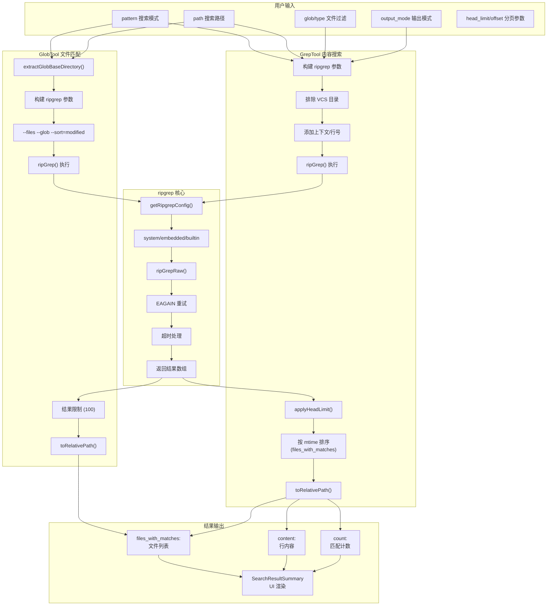

# 第十一章：搜索工具集

## 11.1 引言

搜索工具是 Claude Code 进行代码库探索的核心能力。通过 GlobTool 和 GrepTool，Claude 能够：

1. **快速文件发现**：基于 glob 模式匹配文件名，适合定位特定类型的文件
2. **高效内容搜索**：基于 ripgrep 的正则表达式搜索，支持多种输出模式
3. **智能结果处理**：自动路径简化、结果排序、分页支持
4. **性能优化**：内置缓存、并行化、超时控制等机制

两个工具共享相似的设计理念：都基于 ripgrep 实现，都使用 `buildTool()` 工厂函数构建，都返回相对路径以节省 token。本章深入分析这两个工具的实现细节。

---

## 11.2 GlobTool 文件匹配

### 11.2.1 工具定义

GlobTool 定义在 `src/tools/GlobTool/GlobTool.ts:57-198`，使用 `buildTool()` 工厂函数构建：

```typescript
export const GlobTool = buildTool({
  name: GLOB_TOOL_NAME,
  searchHint: 'find files by name pattern or wildcard',
  maxResultSizeChars: 100_000,
  // ...
})
```

**核心参数**（定义在第 26-36 行）：

| 参数 | 类型 | 说明 |
|------|------|------|
| `pattern` | `string` | Glob 匹配模式（如 `**/*.ts`） |
| `path` | `string?` | 搜索目录，默认当前工作目录 |

**输出结构**（定义在第 39-52 行）：

```typescript
{
  durationMs: number,    // 执行耗时（毫秒）
  numFiles: number,      // 找到的文件总数
  filenames: string[],   // 匹配的文件路径数组
  truncated: boolean,    // 结果是否被截断（限制 100 个文件）
}
```

### 11.2.2 执行流程

`call()` 方法是 GlobTool 的核心，定义在第 154-176 行：

```typescript
async call(input, { abortController, getAppState, globLimits }) {
  const start = Date.now()
  const appState = getAppState()
  const limit = globLimits?.maxResults ?? 100
  const { files, truncated } = await glob(
    input.pattern,
    GlobTool.getPath(input),
    { limit, offset: 0 },
    abortController.signal,
    appState.toolPermissionContext,
  )
  // Relativize paths under cwd to save tokens
  const filenames = files.map(toRelativePath)
  return {
    data: {
      filenames,
      durationMs: Date.now() - start,
      numFiles: filenames.length,
      truncated,
    },
  }
}
```

**关键设计点**：

1. **结果限制**：默认最多返回 100 个文件，防止大型代码库返回过多结果
2. **相对路径转换**：使用 `toRelativePath()` 将绝对路径转为相对路径，节省 token
3. **执行耗时记录**：返回 `durationMs` 用于性能监控

### 11.2.3 glob() 函数实现

`glob()` 函数定义在 `src/utils/glob.ts:66-130`，底层使用 ripgrep 的 `--files` 模式：

```typescript
export async function glob(
  filePattern: string,
  cwd: string,
  { limit, offset }: { limit: number; offset: number },
  abortSignal: AbortSignal,
  toolPermissionContext: ToolPermissionContext,
): Promise<{ files: string[]; truncated: boolean }> {
  // 处理绝对路径
  if (isAbsolute(filePattern)) {
    const { baseDir, relativePattern } = extractGlobBaseDirectory(filePattern)
    if (baseDir) {
      searchDir = baseDir
      searchPattern = relativePattern
    }
  }

  const args = [
    '--files',           // 列出文件而非搜索内容
    '--glob', searchPattern,
    '--sort=modified',   // 按修改时间排序
    ...(noIgnore ? ['--no-ignore'] : []),
    ...(hidden ? ['--hidden'] : []),
  ]

  // 添加忽略模式
  for (const pattern of ignorePatterns) {
    args.push('--glob', `!${pattern}`)
  }

  const allPaths = await ripGrep(args, searchDir, abortSignal)
  // ...
}
```

**ripgrep 参数详解**：

| 参数 | 说明 |
|------|------|
| `--files` | 列出文件路径，而非搜索内容 |
| `--glob` | 应用 glob 模式过滤 |
| `--sort=modified` | 按修改时间排序（最新的在前） |
| `--no-ignore` | 忽略 .gitignore（默认启用） |
| `--hidden` | 包含隐藏文件（默认启用） |

### 11.2.4 extractGlobBaseDirectory() - 路径解析

此函数从 glob 模式中提取静态基础目录，定义在 `src/utils/glob.ts:17-64`：

```typescript
export function extractGlobBaseDirectory(pattern: string): {
  baseDir: string
  relativePattern: string
} {
  // 查找第一个 glob 特殊字符: *, ?, [, {
  const globChars = /[*?[{]/
  const match = pattern.match(globChars)

  if (!match || match.index === undefined) {
    // 无 glob 字符 - 这是字面路径
    const dir = dirname(pattern)
    const file = basename(pattern)
    return { baseDir: dir, relativePattern: file }
  }

  // 获取第一个 glob 字符之前的静态部分
  const staticPrefix = pattern.slice(0, match.index)
  const lastSepIndex = Math.max(
    staticPrefix.lastIndexOf('/'),
    staticPrefix.lastIndexOf(sep),
  )
  // ...
}
```

**示例**：

| 输入模式 | baseDir | relativePattern |
|----------|---------|-----------------|
| `/home/user/src/**/*.ts` | `/home/user/src` | `**/*.ts` |
| `src/*.js` | `src` | `*.js` |
| `*.json` | `''`（当前目录） | `*.json` |

### 11.2.5 环境变量控制

GlobTool 支持通过环境变量调整行为（定义在第 98-99 行）：

```typescript
const noIgnore = isEnvTruthy(process.env.CLAUDE_CODE_GLOB_NO_IGNORE || 'true')
const hidden = isEnvTruthy(process.env.CLAUDE_CODE_GLOB_HIDDEN || 'true')
```

| 环境变量 | 默认值 | 说明 |
|----------|--------|------|
| `CLAUDE_CODE_GLOB_NO_IGNORE` | `true` | 是否忽略 .gitignore |
| `CLAUDE_CODE_GLOB_HIDDEN` | `true` | 是否包含隐藏文件 |
| `CLAUDE_CODE_GLOB_TIMEOUT_SECONDS` | - | 超时时间（秒） |

---

## 11.3 GrepTool 内容搜索

### 11.3.1 工具定义

GrepTool 定义在 `src/tools/GrepTool/GrepTool.ts:160-577`，功能更复杂：

```typescript
export const GrepTool = buildTool({
  name: GREP_TOOL_NAME,
  searchHint: 'search file contents with regex (ripgrep)',
  maxResultSizeChars: 20_000,
  strict: true,
  // ...
})
```

**核心参数**（定义在第 33-89 行）：

| 参数 | 类型 | 说明 |
|------|------|------|
| `pattern` | `string` | 正则表达式搜索模式 |
| `path` | `string?` | 搜索路径，默认当前目录 |
| `glob` | `string?` | 文件类型过滤（如 `*.js`） |
| `type` | `string?` | 文件类型（如 `js`, `py`, `rust`） |
| `output_mode` | `enum?` | 输出模式：`content` / `files_with_matches` / `count` |
| `-i` | `boolean?` | 大小写不敏感 |
| `-n` | `boolean?` | 显示行号（默认 true） |
| `-A` / `-B` / `-C` | `number?` | 上下文行数 |
| `head_limit` | `number?` | 结果限制（默认 250） |
| `offset` | `number?` | 偏移量（用于分页） |
| `multiline` | `boolean?` | 多行模式 |

### 11.3.2 输出模式详解

GrepTool 支持三种输出模式：

**files_with_matches（默认）**

返回匹配的文件列表，按修改时间排序：

```typescript
{
  mode: 'files_with_matches',
  filenames: string[],
  numFiles: number,
}
```

**content**

返回匹配的行内容，包含行号：

```typescript
{
  mode: 'content',
  content: string,
  numLines: number,
}
```

示例输出：
```
src/tools/GrepTool/GrepTool.ts:160:export const GrepTool = buildTool({
src/tools/GrepTool/GrepTool.ts:161:  name: GREP_TOOL_NAME,
```

**count**

返回每个文件的匹配次数：

```typescript
{
  mode: 'count',
  content: string,
  numMatches: number,
  numFiles: number,
}
```

示例输出：
```
src/tools/GrepTool/GrepTool.ts:45
src/utils/ripgrep.ts:12
```

### 11.3.3 call() 方法实现

`call()` 方法是 GrepTool 的核心，定义在第 310-576 行：

```typescript
async call({ pattern, path, glob, type, output_mode, ... }, context) {
  const absolutePath = path ? expandPath(path) : getCwd()
  const args = ['--hidden']

  // 排除版本控制目录
  for (const dir of VCS_DIRECTORIES_TO_EXCLUDE) {
    args.push('--glob', `!${dir}`)
  }

  // 行长度限制
  args.push('--max-columns', '500')

  // 多行模式
  if (multiline) {
    args.push('-U', '--multiline-dotall')
  }

  // 输出模式
  if (output_mode === 'files_with_matches') {
    args.push('-l')
  } else if (output_mode === 'count') {
    args.push('-c')
  }

  // 添加行号
  if (show_line_numbers && output_mode === 'content') {
    args.push('-n')
  }

  // 上下文
  if (output_mode === 'content') {
    if (context !== undefined) {
      args.push('-C', context.toString())
    }
    // ...
  }

  // 执行搜索
  const results = await ripGrep(args, absolutePath, abortController.signal)

  // 处理结果...
}
```

### 11.3.4 VCS 目录排除

GrepTool 自动排除版本控制目录，定义在第 95-102 行：

```typescript
const VCS_DIRECTORIES_TO_EXCLUDE = [
  '.git',
  '.svn',
  '.hg',
  '.bzr',
  '.jj',
  '.sl',
] as const
```

这些目录在搜索时被自动排除，避免版本控制元数据污染搜索结果。

### 11.3.5 head_limit 与分页机制

`applyHeadLimit()` 函数实现结果分页，定义在第 110-128 行：

```typescript
function applyHeadLimit<T>(
  items: T[],
  limit: number | undefined,
  offset: number = 0,
): { items: T[]; appliedLimit: number | undefined } {
  // 显式传入 0 表示无限制
  if (limit === 0) {
    return { items: items.slice(offset), appliedLimit: undefined }
  }
  const effectiveLimit = limit ?? DEFAULT_HEAD_LIMIT  // 默认 250
  const sliced = items.slice(offset, offset + effectiveLimit)
  const wasTruncated = items.length - offset > effectiveLimit
  return {
    items: sliced,
    appliedLimit: wasTruncated ? effectiveLimit : undefined,
  }
}
```

**分页示例**：

用户可以使用 `offset` 和 `head_limit` 进行分页：

```
第一次搜索: { pattern: "function", head_limit: 100 }
第二次搜索: { pattern: "function", head_limit: 100, offset: 100 }
```

### 11.3.6 文件排序（files_with_matches 模式）

在 `files_with_matches` 模式下，结果按修改时间排序（定义在第 529-553 行）：

```typescript
const stats = await Promise.allSettled(
  results.map(_ => getFsImplementation().stat(_)),
)
const sortedMatches = results
  .map((_, i) => {
    const r = stats[i]!
    return [_, r.status === 'fulfilled' ? (r.value.mtimeMs ?? 0) : 0] as const
  })
  .sort((a, b) => {
    if (process.env.NODE_ENV === 'test') {
      // 测试环境：按文件名排序（确定性）
      return a[0].localeCompare(b[0])
    }
    const timeComparison = b[1] - a[1]  // 最新的在前
    if (timeComparison === 0) {
      return a[0].localeCompare(b[0])  // 文件名作为 tiebreaker
    }
    return timeComparison
  })
  .map(_ => _[0])
```

**排序策略**：

- 生产环境：按修改时间排序（最新的在前），便于找到最近修改的文件
- 测试环境：按文件名排序，确保结果确定性

---

## 11.4 ripgrep 集成

### 11.4.1 ripgrep 配置发现

`getRipgrepConfig()` 函数确定 ripgrep 的运行模式，定义在 `src/utils/ripgrep.ts:31-65`：

```typescript
const getRipgrepConfig = memoize((): RipgrepConfig => {
  const userWantsSystemRipgrep = isEnvDefinedFalsy(
    process.env.USE_BUILTIN_RIPGREP,
  )

  // 尝试使用系统 ripgrep
  if (userWantsSystemRipgrep) {
    const { cmd: systemPath } = findExecutable('rg', [])
    if (systemPath !== 'rg') {
      return { mode: 'system', command: 'rg', args: [] }
    }
  }

  // 捆绑模式：ripgrep 内嵌于 bun-internal
  if (isInBundledMode()) {
    return {
      mode: 'embedded',
      command: process.execPath,
      args: ['--no-config'],
      argv0: 'rg',
    }
  }

  // 内置模式：使用捆绑的 ripgrep 二进制
  const rgRoot = path.resolve(__dirname, 'vendor', 'ripgrep')
  const command = process.platform === 'win32'
    ? path.resolve(rgRoot, `${process.arch}-win32`, 'rg.exe')
    : path.resolve(rgRoot, `${process.arch}-${process.platform}`, 'rg')

  return { mode: 'builtin', command, args: [] }
})
```

**三种运行模式**：

| 模式 | 命令来源 | 适用场景 |
|------|----------|----------|
| `system` | 系统安装的 `rg` | 用户偏好系统版本 |
| `embedded` | bun-internal 内嵌 | 捆绑分发模式 |
| `builtin` | vendor 目录二进制 | npm 包分发 |

### 11.4.2 ripGrep() 函数

`ripGrep()` 是搜索的核心函数，定义在 `src/utils/ripgrep.ts:345-463`：

```typescript
export async function ripGrep(
  args: string[],
  target: string,
  abortSignal: AbortSignal,
): Promise<string[]> {
  await codesignRipgrepIfNecessary()

  return new Promise((resolve, reject) => {
    const handleResult = (error, stdout, stderr, isRetry) => {
      // 成功
      if (!error) {
        resolve(stdout.trim().split('\n').filter(Boolean))
        return
      }

      // exit code 1 = 无匹配（正常）
      if (error.code === 1) {
        resolve([])
        return
      }

      // EAGAIN 错误：重试单线程模式
      if (!isRetry && isEagainError(stderr)) {
        ripGrepRaw(args, target, abortSignal, (retryError, ...) => {
          handleResult(retryError, ..., true)
        }, true)  // 强制单线程
        return
      }

      // 超时处理
      if (isTimeout && lines.length === 0) {
        reject(new RipgrepTimeoutError(
          `Ripgrep search timed out...`,
          lines,
        ))
        return
      }

      resolve(lines)
    }

    ripGrepRaw(args, target, abortSignal, (error, stdout, stderr) => {
      handleResult(error, stdout, stderr, false)
    })
  })
}
```

### 11.4.3 EAGAIN 错误处理

在资源受限环境（Docker、CI）中，ripgrep 可能因线程过多触发 EAGAIN 错误。定义在第 87-92 行：

```typescript
function isEagainError(stderr: string): boolean {
  return (
    stderr.includes('os error 11') ||
    stderr.includes('Resource temporarily unavailable')
  )
}
```

处理策略：自动重试单线程模式（`-j 1`），确保搜索完成。

### 11.4.4 超时机制

ripgrep 有内置超时机制，定义在 `src/utils/ripgrep.ts:128-133`：

```typescript
const defaultTimeout = getPlatform() === 'wsl' ? 60_000 : 20_000
const parsedSeconds =
  parseInt(process.env.CLAUDE_CODE_GLOB_TIMEOUT_SECONDS || '', 10) || 0
const timeout = parsedSeconds > 0 ? parsedSeconds * 1000 : defaultTimeout
```

**超时策略**：

| 平台 | 默认超时 | 说明 |
|------|----------|------|
| WSL | 60 秒 | WSL 文件系统性能较差 |
| 其他 | 20 秒 | 标准超时 |

超时时抛出 `RipgrepTimeoutError`（定义在第 98-106 行），允许调用者区分"无匹配"和"超时未完成"。

### 11.4.5 macOS 代码签名

在 macOS 上，捆绑的 ripgrep 二进制可能需要代码签名，定义在 `src/utils/ripgrep.ts:619-679`：

```typescript
async function codesignRipgrepIfNecessary() {
  if (process.platform !== 'darwin' || alreadyDoneSignCheck) {
    return
  }

  const config = getRipgrepConfig()
  if (config.mode !== 'builtin') {
    return
  }

  // 检查是否已签名
  const lines = await execFileNoThrow('codesign', ['-vv', '-d', builtinPath])
  const needsSigned = lines.find(line => line.includes('linker-signed'))

  if (needsSigned) {
    // 签名并移除 quarantine 属性
    await execFileNoThrow('codesign', ['--sign', '-', '--force', ...])
    await execFileNoThrow('xattr', ['-d', 'com.apple.quarantine', builtinPath])
  }
}
```

---

## 11.5 搜索结果处理

### 11.5.1 路径简化

两个工具都使用 `toRelativePath()` 简化路径，定义在 `src/utils/path.ts`：

```typescript
// GrepTool 第 462-464 行
const finalLines = limitedResults.map(line => {
  const colonIndex = line.indexOf(':')
  if (colonIndex > 0) {
    const filePath = line.substring(0, colonIndex)
    const rest = line.substring(colonIndex)
    return toRelativePath(filePath) + rest
  }
  return line
})
```

**路径简化示例**：

| 原始路径 | 相对路径 |
|----------|----------|
| `/home/user/project/src/file.ts` | `src/file.ts` |
| `/home/user/project/file.ts` | `file.ts` |

这种简化显著减少返回给 Claude 的 token 数量。

### 11.5.2 UI 渲染

两个工具共享相同的 UI 渲染组件。`SearchResultSummary` 组件定义在 `src/tools/GrepTool/UI.tsx:16-118`：

```typescript
function SearchResultSummary({
  count,
  countLabel,
  secondaryCount,
  secondaryLabel,
  content,
  verbose,
}) {
  const primaryText = (
    <Text>
      Found <Text bold>{count} </Text>
      {count === 0 || count > 1 ? countLabel : countLabel.slice(0, -1)}
    </Text>
  )

  if (verbose) {
    return (
      <Box flexDirection="column">
        <Box flexDirection="row">
          <Text dimColor>  ⎿  </Text>
          {primaryText}{secondaryText}
        </Box>
        <Box marginLeft={5}>
          <Text>{content}</Text>
        </Box>
      </Box>
    )
  }

  return (
    <MessageResponse height={1}>
      <Text>{primaryText}{secondaryText} {count > 0 && <CtrlOToExpand />}</Text>
    </MessageResponse>
  )
}
```

**三种模式的渲染**：

| 模式 | count | countLabel | secondaryCount | secondaryLabel |
|------|-------|------------|----------------|----------------|
| `content` | `numLines` | `lines` | - | - |
| `count` | `numMatches` | `matches` | `numFiles` | `files` |
| `files_with_matches` | `numFiles` | `files` | - | - |

### 11.5.3 错误处理

两个工具都有专门的错误处理渲染（定义在 UI.tsx 第 147-164 行）：

```typescript
export function renderToolUseErrorMessage(result, { verbose }) {
  if (!verbose && typeof result === 'string' && extractTag(result, 'tool_use_error')) {
    const errorMessage = extractTag(result, 'tool_use_error')
    if (errorMessage?.includes(FILE_NOT_FOUND_CWD_NOTE)) {
      return <MessageResponse>
        <Text color="error">File not found</Text>
      </MessageResponse>
    }
    return <MessageResponse>
      <Text color="error">Error searching files</Text>
    </MessageResponse>
  }
  return <FallbackToolUseErrorMessage result={result} verbose={verbose} />
}
```

---

## 11.6 性能优化策略

### 11.6.1 结果限制

两个工具都有结果限制，防止大型代码库返回过多数据：

| 工具 | 默认限制 | 最大结果大小 |
|------|----------|--------------|
| GlobTool | 100 文件 | 100,000 字符 |
| GrepTool | 250 条 | 20,000 字符 |

### 11.6.2 流式处理

`ripGrepStream()` 函数支持流式输出，定义在 `src/utils/ripgrep.ts:295-343`：

```typescript
export async function ripGrepStream(
  args: string[],
  target: string,
  abortSignal: AbortSignal,
  onLines: (lines: string[]) => void,
): Promise<void> {
  // ...
  child.stdout?.on('data', (chunk: Buffer) => {
    const data = remainder + chunk.toString()
    const lines = data.split('\n')
    remainder = lines.pop() ?? ''
    if (lines.length) onLines(lines.map(stripCR))
  })
  // ...
}
```

**流式处理优势**：

- 结果即时可用，无需等待搜索完成
- 支持用户提前中止（如 fzf 集成）
- 内存占用更低（逐块处理而非缓冲全部）

### 11.6.3 文件计数优化

`countFilesRoundedRg()` 函数使用 ripgrep 快速统计文件数量，定义在 `src/utils/ripgrep.ts:476-522`：

```typescript
export const countFilesRoundedRg = memoize(
  async (dirPath, abortSignal, ignorePatterns = []) => {
    // 跳过 home 目录（避免 macOS TCC 权限对话框）
    if (path.resolve(dirPath) === path.resolve(homedir())) {
      return undefined
    }

    const args = ['--files', '--hidden']
    ignorePatterns.forEach(pattern => {
      args.push('--glob', `!${pattern}`)
    })

    const count = await ripGrepFileCount(args, dirPath, abortSignal)

    // 四舍五入到最近的 10 的幂次（隐私保护）
    const magnitude = Math.floor(Math.log10(count))
    const power = Math.pow(10, magnitude)
    return Math.round(count / power) * power
  },
)
```

**隐私保护设计**：

文件计数被四舍五入到最近的 10 的幂次：

| 实际数量 | 报告数量 |
|----------|----------|
| 8 | 10 |
| 42 | 100 |
| 350 | 100 |
| 750 | 1000 |

### 11.6.4 缓存策略

ripgrep 配置使用 `memoize` 缓存（第 31 行），避免重复检测：

```typescript
const getRipgrepConfig = memoize((): RipgrepConfig => { ... })
```

文件计数也使用 `memoize`（第 476 行），缓存键包含目录和忽略模式：

```typescript
(dirPath, _abortSignal, ignorePatterns = []) =>
  `${dirPath}|${ignorePatterns.join(',')}`
```

---

## 11.7 搜索流程图



<div style="text-align: center;">
<strong>图 11-1：搜索工具流程图</strong>
</div>

---

## 11.8 总结

本章分析了 Claude Code 搜索工具集的核心实现：

**GlobTool 设计要点**：

1. 基于 ripgrep `--files` 模式实现快速文件发现
2. 支持绝对路径和相对路径的 glob 模式
3. 结果按修改时间排序，默认限制 100 个文件
4. 可通过环境变量控制隐藏文件和 .gitignore 行为

**GrepTool 设计要点**：

1. 三种输出模式满足不同搜索需求
2. 自动排除版本控制目录
3. 支持分页机制（offset + head_limit）
4. `files_with_matches` 模式按修改时间排序
5. 默认限制 250 条结果

**ripgrep 集成亮点**：

1. 三种运行模式适配不同分发场景
2. EAGAIN 错误自动重试单线程模式
3. WSL 平台延长超时时间
4. macOS 自动代码签名
5. 流式处理支持实时结果

**性能优化策略**：

1. 结果限制防止 token 爆炸
2. 相对路径转换节省 token
3. 配置和文件计数使用 memoize 缓存
4. 文件计数四舍五入保护隐私

两个搜索工具的设计体现了 Claude Code 的工程哲学：利用成熟的底层工具（ripgrep），在之上构建智能的抽象层，同时保持对性能和资源消耗的严格控制。下一章将分析文件读写工具的实现。