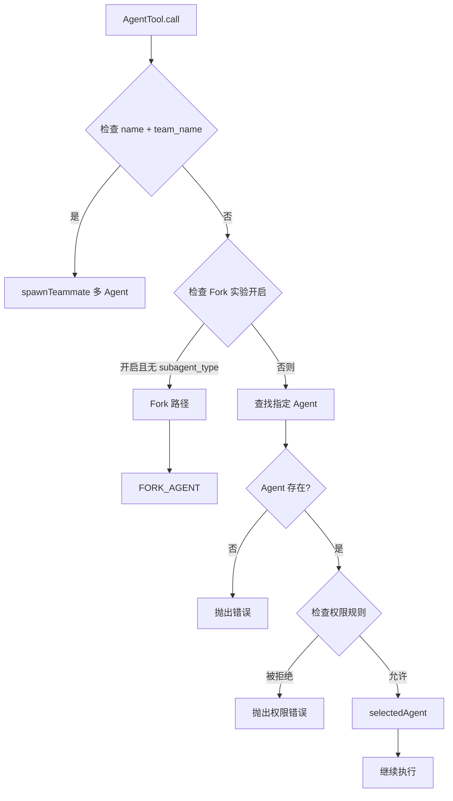
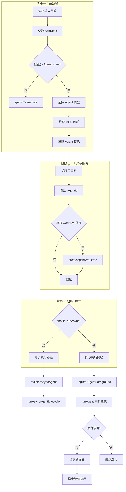
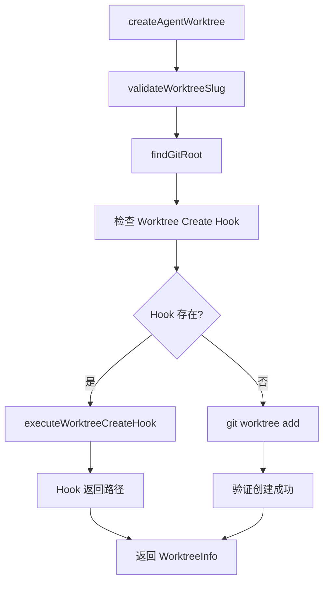
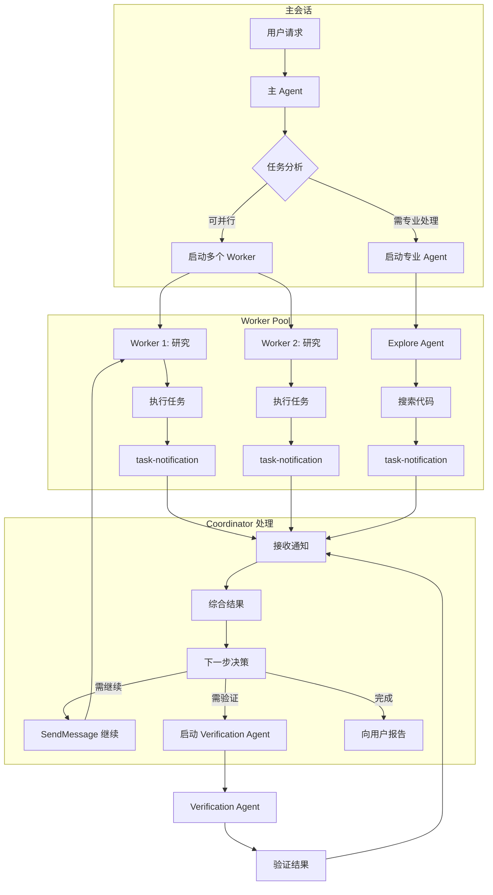

# 第十二章：AgentTool 多 Agent 机制

## 12.1 引言

AgentTool 是 Claude Code 实现多 Agent 协作的核心机制。它允许主 Agent 启动子 Agent 来执行特定任务，实现任务分解、并行执行和专业分工。通过 AgentTool，Claude Code 能够：

1. **任务委托**：将复杂任务分解给专业子 Agent 处理
2. **并行执行**：同时启动多个子 Agent，提高效率
3. **上下文隔离**：子 Agent 拥有独立的工作目录和工具权限
4. **后台运行**：支持异步执行，主 Agent 可继续其他工作

本章深入分析 AgentTool 的实现机制，揭示 Claude Code 多 Agent 系统的设计哲学。

---

## 12.2 Agent 类型与选择

### 12.2.1 Agent 定义类型

Agent 定义分为三类：

```typescript
// Built-in agents - 内置 Agent
export type BuiltInAgentDefinition = BaseAgentDefinition & {
  source: 'built-in'
  baseDir: 'built-in'
  callback?: () => void
  getSystemPrompt: (params: {
    toolUseContext: Pick<ToolUseContext, 'options'>
  }) => string
}

// Custom agents - 用户/项目/策略设置定义的 Agent
export type CustomAgentDefinition = BaseAgentDefinition & {
  getSystemPrompt: () => string
  source: SettingSource
  filename?: string
  baseDir?: string
}

// Plugin agents - 插件提供的 Agent
export type PluginAgentDefinition = BaseAgentDefinition & {
  getSystemPrompt: () => string
  source: 'plugin'
  filename?: string
  plugin: string
}
```

### 12.2.2 内置 Agent 类型

内置 Agent 定义在 `src/tools/AgentTool/builtInAgents.ts`：

| Agent 类型 | 说明 | 模型 | 特点 |
|------------|------|------|------|
| `general-purpose` | 通用研究 Agent | inherit | 全工具访问，用于复杂搜索 |
| `Explore` | 快速搜索 Agent | haiku/inherit | 只读，omitClaudeMd，快速探索 |
| `Plan` | 规划 Agent | inherit | 只读，omitClaudeMd，生成实施计划 |
| `Claude Code Guide` | 指导 Agent | inherit | 解答使用问题 |
| `Statusline Setup` | 状态栏设置 | inherit | 设置状态栏 |
| `Verification` | 验证 Agent | inherit | 验证代码变更 |
| `fork` | Fork 子 Agent | inherit | 继承父上下文，bubble 权限 |

**Explore Agent 示例**：

```typescript
export const EXPLORE_AGENT: BuiltInAgentDefinition = {
  agentType: 'Explore',
  whenToUse: EXPLORE_WHEN_TO_USE,
  disallowedTools: [
    AGENT_TOOL_NAME,
    EXIT_PLAN_MODE_TOOL_NAME,
    FILE_EDIT_TOOL_NAME,
    FILE_WRITE_TOOL_NAME,
    NOTEBOOK_EDIT_TOOL_NAME,
  ],
  source: 'built-in',
  baseDir: 'built-in',
  model: process.env.USER_TYPE === 'ant' ? 'inherit' : 'haiku',
  omitClaudeMd: true,  // 不加载 CLAUDE.md，节省 token
  getSystemPrompt: () => getExploreSystemPrompt(),
}
```

Explore Agent 的关键特点：
- **只读模式**：禁用 Edit、Write、NotebookEdit 等修改工具
- **轻量上下文**：`omitClaudeMd: true` 不加载项目指导文件
- **快速模型**：外部用户使用 haiku，内部使用 inherit

### 12.2.3 Agent 选择流程

Agent 选择逻辑：



**Fork 子 Agent 特殊处理**：

```typescript
export const FORK_AGENT = {
  agentType: FORK_SUBAGENT_TYPE,
  whenToUse: 'Implicit fork — inherits full conversation context...',
  tools: ['*'],
  maxTurns: 200,
  model: 'inherit',
  permissionMode: 'bubble',  // 权限提示冒泡到父终端
  source: 'built-in',
  baseDir: 'built-in',
  getSystemPrompt: () => '',  // 实际使用父的 system prompt
}
```

Fork Agent 的独特之处：
- **隐式触发**：不指定 `subagent_type` 时自动使用
- **上下文继承**：继承父 Agent 的完整对话历史和系统提示
- **权限冒泡**：权限请求显示在父终端，用户可直接响应
- **Prompt 缓存共享**：使用父的精确工具定义，最大化缓存命中率

---

## 12.3 子 Agent 启动流程

### 12.3.1 启动流程概览

子 Agent 启动的完整流程：



### 12.3.2 runAgent 核心函数

`runAgent` 是子 Agent 执行的核心入口：

**核心参数**：

```typescript
export async function* runAgent({
  agentDefinition,   // Agent 定义
  promptMessages,    // 初始消息
  toolUseContext,    // 工具使用上下文
  canUseTool,        // 工具使用检查函数
  isAsync,           // 是否异步执行
  canShowPermissionPrompts,  // 是否可显示权限提示
  forkContextMessages,       // Fork 时继承的父消息
  querySource,       // 查询来源
  override,          // 覆盖配置（systemPrompt、agentId 等）
  model,             // 模型覆盖
  maxTurns,          // 最大轮数
  availableTools,    // 可用工具池
  allowedTools,      // 允许的工具规则
  worktreePath,      // Worktree 路径
  description,       // 任务描述
  onCacheSafeParams, // 缓存安全参数回调
  contentReplacementState,  // 内容替换状态
  useExactTools,     // 是否使用精确工具（Fork 路径）
}: {...}): AsyncGenerator<Message, void>
```

**关键步骤分析**：

1. **Agent ID 创建**（行 347）：
   ```typescript
   const agentId = override?.agentId ? override.agentId : createAgentId()
   ```

2. **上下文优化**（行 389-410）：
   ```typescript
   // Explore/Plan 不加载 CLAUDE.md
   const shouldOmitClaudeMd =
     agentDefinition.omitClaudeMd &&
     !override?.userContext &&
     getFeatureValue_CACHED_MAY_BE_STALE('tengu_slim_subagent_claudemd', true)
   
   // Explore/Plan 不加载 gitStatus
   const { gitStatus: _omittedGitStatus, ...systemContextNoGit } =
     baseSystemContext
   ```

3. **权限模式设置**（行 415-498）：
   ```typescript
   const agentGetAppState = () => {
     const state = toolUseContext.getAppState()
     let toolPermissionContext = state.toolPermissionContext
     
     // 覆盖权限模式
     if (agentPermissionMode && ...) {
       toolPermissionContext = {
         ...toolPermissionContext,
         mode: agentPermissionMode,
       }
     }
     
     // 设置权限提示避免标志
     if (shouldAvoidPrompts) {
       toolPermissionContext = {
         ...toolPermissionContext,
         shouldAvoidPermissionPrompts: true,
       }
     }
     
     return { ...state, toolPermissionContext, effortValue }
   }
   ```

4. **MCP 服务器初始化**（行 95-218）：
   ```typescript
   async function initializeAgentMcpServers(
     agentDefinition: AgentDefinition,
     parentClients: MCPServerConnection[],
   ): Promise<{
     clients: MCPServerConnection[]
     tools: Tools
     cleanup: () => Promise<void>
   }>
   ```

   Agent 可定义自己的 MCP 服务器，这些服务器在 Agent 启动时连接，结束时清理。

5. **工具上下文创建**（行 700-714）：
   ```typescript
   const agentToolUseContext = createSubagentContext(toolUseContext, {
     options: agentOptions,
     agentId,
     agentType: agentDefinition.agentType,
     messages: initialMessages,
     readFileState: agentReadFileState,
     abortController: agentAbortController,
     getAppState: agentGetAppState,
     shareSetAppState: !isAsync,  // 同步 Agent 共享状态
     shareSetResponseLength: true,
     criticalSystemReminder_EXPERIMENTAL: ...,
     contentReplacementState,
   })
   ```

6. **Query 循环**（行 748-806）：
   ```typescript
   for await (const message of query({
     messages: initialMessages,
     systemPrompt: agentSystemPrompt,
     userContext: resolvedUserContext,
     systemContext: resolvedSystemContext,
     canUseTool,
     toolUseContext: agentToolUseContext,
     querySource,
     maxTurns: maxTurns ?? agentDefinition.maxTurns,
   })) {
     // 处理消息...
     if (isRecordableMessage(message)) {
       await recordSidechainTranscript([message], agentId, lastRecordedUuid)
       yield message
     }
   }
   ```

### 12.3.3 工具池组装

子 Agent 使用独立的工具池：

```typescript
const workerPermissionContext = {
  ...appState.toolPermissionContext,
  mode: selectedAgent.permissionMode ?? 'acceptEdits'
}
const workerTools = assembleToolPool(workerPermissionContext, appState.mcp.tools)
```

**工具过滤规则**：

```typescript
export function filterToolsForAgent({
  tools,
  isBuiltIn,
  isAsync = false,
  permissionMode,
}: {...}): Tools {
  return tools.filter(tool => {
    // MCP 工具始终可用
    if (tool.name.startsWith('mcp__')) return true
    
    // Plan 模式 Agent 可用 ExitPlanMode
    if (toolMatchesName(tool, EXIT_PLAN_MODE_V2_TOOL_NAME) &&
        permissionMode === 'plan') return true
    
    // 全 Agent 禁用列表
    if (ALL_AGENT_DISALLOWED_TOOLS.has(tool.name)) return false
    
    // 自定义 Agent 禁用列表
    if (!isBuiltIn && CUSTOM_AGENT_DISALLOWED_TOOLS.has(tool.name)) return false
    
    // 异步 Agent 工具限制
    if (isAsync && !ASYNC_AGENT_ALLOWED_TOOLS.has(tool.name)) {
      // In-process teammate 特殊处理
      if (isAgentSwarmsEnabled() && isInProcessTeammate()) {
        if (toolMatchesName(tool, AGENT_TOOL_NAME)) return true
        if (IN_PROCESS_TEAMMATE_ALLOWED_TOOLS.has(tool.name)) return true
      }
      return false
    }
    
    return true
  })
}
```

**禁用工具常量**（`src/constants/tools.ts`）：

- `ALL_AGENT_DISALLOWED_TOOLS`：所有子 Agent 禁用的工具
- `CUSTOM_AGENT_DISALLOWED_TOOLS`：仅自定义 Agent 禁用的工具
- `ASYNC_AGENT_ALLOWED_TOOLS`：异步 Agent 可用的工具白名单

---

## 12.4 Worktree 隔离模式

### 12.4.1 隔离模式概述

Worktree 隔离模式让子 Agent 在独立的 Git 工作树中运行，避免与主工作目录冲突。定义在 `src/utils/worktree.ts`。

**启用方式**：

```typescript
// Agent 定义中指定
isolation: 'worktree'

// 或调用时指定
AgentTool({ isolation: 'worktree', ... })
```

### 12.4.2 Worktree 创建流程

Worktree 创建逻辑：

```typescript
let worktreeInfo: {...} | null = null
if (effectiveIsolation === 'worktree') {
  const slug = `agent-${earlyAgentId.slice(0, 8)}`
  worktreeInfo = await createAgentWorktree(slug)
}
```

**createAgentWorktree 核心流程**（`src/utils/worktree.ts`）：



**Worktree 路径规范**：

```typescript
// 标准路径: .claude/worktrees/<slug>
const worktreePath = join(gitRoot, '.claude', 'worktrees', slug)

// Slug 验证规则
const VALID_WORKTREE_SLUG_SEGMENT = /^[a-zA-Z0-9._-]+$/
const MAX_WORKTREE_SLUG_LENGTH = 64
```

### 12.4.3 Worktree 清理

Worktree 清理在 Agent 完成后执行：

```typescript
const cleanupWorktreeIfNeeded = async (): Promise<{
  worktreePath?: string
  worktreeBranch?: string
}> => {
  if (!worktreeInfo) return {}
  
  const { worktreePath, worktreeBranch, headCommit, gitRoot, hookBased } = worktreeInfo
  
  // Hook-based worktree 始终保留
  if (hookBased) {
    logForDebugging(`Hook-based agent worktree kept at: ${worktreePath}`)
    return { worktreePath }
  }
  
  // 检查是否有变更
  if (headCommit) {
    const changed = await hasWorktreeChanges(worktreePath, headCommit)
    if (!changed) {
      await removeAgentWorktree(worktreePath, worktreeBranch, gitRoot)
      return {}  // 已清理
    }
  }
  
  // 有变更则保留
  logForDebugging(`Agent worktree has changes, keeping: ${worktreePath}`)
  return { worktreePath, worktreeBranch }
}
```

**变更检测**（`src/utils/worktree.ts`）：

```typescript
export async function hasWorktreeChanges(
  worktreePath: string,
  headCommit: string,
): Promise<boolean> {
  // 比较 HEAD 与初始 commit
  const result = await execFileNoThrow(gitExe(), [
    'diff', '--quiet', headCommit, 'HEAD'
  ], { cwd: worktreePath })
  
  return result.code !== 0  // 有差异则返回 true
}
```

### 12.4.4 Fork + Worktree 路径通知

当 Fork Agent 在 Worktree 中运行时，会注入路径转换通知：

```typescript
export function buildWorktreeNotice(
  parentCwd: string,
  worktreeCwd: string,
): string {
  return `You've inherited the conversation context above from a parent agent 
working in ${parentCwd}. You are operating in an isolated git worktree at 
${worktreeCwd} — same repository, same relative file structure, separate 
working copy. Paths in the inherited context refer to the parent's working 
directory; translate them to your worktree root. Re-read files before editing 
if the parent may have modified them since they appear in the context. Your 
changes stay in this worktree and will not affect the parent's files.`
}
```

---

## 12.5 后台执行与通知

### 12.5.1 异步执行触发条件

后台执行触发逻辑：

```typescript
const shouldRunAsync = (
  run_in_background === true ||
  selectedAgent.background === true ||
  isCoordinator ||           // Coordinator 模式强制异步
  forceAsync ||              // Fork 实验强制异步
  assistantForceAsync ||     // Assistant 模式强制异步
  (proactiveModule?.isProactiveActive() ?? false)
) && !isBackgroundTasksDisabled
```

### 12.5.2 异步 Agent 注册

异步 Agent 注册流程：

```typescript
const agentBackgroundTask = registerAsyncAgent({
  agentId: asyncAgentId,
  description,
  prompt,
  selectedAgent,
  setAppState: rootSetAppState,
  toolUseId: toolUseContext.toolUseId
})
```

**registerAsyncAgent 实现**（`src/tasks/LocalAgentTask/LocalAgentTask.tsx`）：

```typescript
export function registerAsyncAgent({
  agentId,
  description,
  prompt,
  selectedAgent,
  setAppState,
  toolUseId,
}: {...}): LocalAgentTaskState {
  const taskId = generateTaskId('local_agent')
  const abortController = createAbortController()
  
  const taskState: LocalAgentTaskState = {
    ...createTaskStateBase(taskId, 'local_agent', description, toolUseId),
    type: 'local_agent',
    agentId,
    prompt,
    abortController,
    agentType: selectedAgent.agentType,
    model: selectedAgent.model,
    isBackgrounded: true,
    retrieved: false,
    retain: false,
    diskLoaded: false,
    lastReportedToolCount: 0,
    lastReportedTokenCount: 0,
    pendingMessages: [],
  }
  
  registerTask(taskState, setAppState)
  return taskState
}
```

### 12.5.3 异步 Agent 生命周期

`runAsyncAgentLifecycle` 驱动后台 Agent 从启动到完成：

```typescript
export async function runAsyncAgentLifecycle({
  taskId,
  abortController,
  makeStream,
  metadata,
  description,
  toolUseContext,
  rootSetAppState,
  agentIdForCleanup,
  enableSummarization,
  getWorktreeResult,
}: {...}): Promise<void> {
  const agentMessages: MessageType[] = []
  
  try {
    const tracker = createProgressTracker()
    
    for await (const message of makeStream(onCacheSafeParams)) {
      agentMessages.push(message)
      
      // 实时更新 UI（当 retain 时）
      rootSetAppState(prev => {
        const t = prev.tasks[taskId]
        if (!isLocalAgentTask(t) || !t.retain) return prev
        return {
          ...prev,
          tasks: {
            ...prev.tasks,
            [taskId]: { ...t, messages: [...(t.messages ?? []), message] },
          },
        }
      })
      
      // 更新进度
      updateProgressFromMessage(tracker, message, ...)
      updateAsyncAgentProgress(taskId, getProgressUpdate(tracker), ...)
    }
    
    // 完成处理
    const agentResult = finalizeAgentTool(agentMessages, taskId, metadata)
    completeAsyncAgent(agentResult, rootSetAppState)
    
    // 发送通知
    enqueueAgentNotification({
      taskId,
      description,
      status: 'completed',
      setAppState: rootSetAppState,
      finalMessage: extractTextContent(agentResult.content, '\n'),
      usage: {...},
    })
  } catch (error) {
    if (error instanceof AbortError) {
      killAsyncAgent(taskId, rootSetAppState)
      enqueueAgentNotification({ status: 'killed', ... })
    } else {
      failAsyncAgent(taskId, errorMessage(error), rootSetAppState)
      enqueueAgentNotification({ status: 'failed', error: msg, ... })
    }
  } finally {
    clearInvokedSkillsForAgent(agentIdForCleanup)
    clearDumpState(agentIdForCleanup)
  }
}
```

### 12.5.4 任务通知格式

Agent 完成通知以 `<task-notification>` XML 格式发送（定义在 `src/constants/xml.ts`）：

```xml
<task-notification>
<task-id>{agentId}</task-id>
<status>completed|failed|killed</status>
<summary>{human-readable status summary}</summary>
<result>{agent's final text response}</result>
<usage>
  <total_tokens>N</total_tokens>
  <tool_uses>N</tool_uses>
  <duration_ms>N</duration_ms>
</usage>
</task-notification>
```

**Coordinator 模式下的通知处理**：

Coordinator 接收 Worker 的结果通知并综合处理：

```typescript
// Coordinator 系统提示中的通知格式说明
<task-notification>
<task-id>agent-a1b</task-id>
<status>completed</status>
<summary>Agent "Investigate auth bug" completed</summary>
<result>Found null pointer in src/auth/validate.ts:42...</result>
</task-notification>
```

---

## 12.6 多 Agent 协作机制

### 12.6.1 Teammate 创建

Teammate 是多 Agent 协作的核心概念，通过 `spawnTeammate` 创建：

```typescript
export async function spawnTeammate(
  config: SpawnTeammateConfig,
  context: ToolUseContext,
): Promise<{ data: SpawnOutput }> {
  return handleSpawn(config, context)
}
```

**执行模式选择**：

```typescript
async function handleSpawn(
  input: SpawnInput,
  context: ToolUseContext,
): Promise<{ data: SpawnOutput }> {
  // In-process 模式优先
  if (isInProcessEnabled()) {
    return handleSpawnInProcess(input, context)
  }
  
  // 检测 Pane backend（tmux/iTerm2）
  try {
    await detectAndGetBackend()
  } catch (error) {
    if (getTeammateModeFromSnapshot() !== 'auto') throw error
    // Auto 模式 fallback 到 in-process
    markInProcessFallback()
    return handleSpawnInProcess(input, context)
  }
  
  // 使用 split-pane 或 separate-window
  const useSplitPane = input.use_splitpane !== false
  if (useSplitPane) {
    return handleSpawnSplitPane(input, context)
  }
  return handleSpawnSeparateWindow(input, context)
}
```

### 12.6.2 In-Process Teammate

In-Process Teammate 在同一 Node.js 进程中运行，使用 AsyncLocalStorage 实现上下文隔离。

**核心流程**：

```typescript
async function handleSpawnInProcess(
  input: SpawnInput,
  context: ToolUseContext,
): Promise<{ data: SpawnOutput }> {
  const { name, prompt, agent_type, plan_mode_required } = input
  const model = resolveTeammateModel(input.model, getAppState().mainLoopModel)
  
  // 生成唯一 ID
  const teammateId = formatAgentId(sanitizedName, teamName)
  const teammateColor = assignTeammateColor(teammateId)
  
  // 查找 Agent 定义（如果指定 agent_type）
  let agentDefinition: CustomAgentDefinition | undefined
  if (agent_type) {
    const allAgents = context.options.agentDefinitions.activeAgents
    const foundAgent = allAgents.find(a => a.agentType === agent_type)
    if (foundAgent && isCustomAgent(foundAgent)) {
      agentDefinition = foundAgent
    }
  }
  
  // Spawn in-process teammate
  const config: InProcessSpawnConfig = {
    name: sanitizedName,
    teamName,
    prompt,
    color: teammateColor,
    planModeRequired: plan_mode_required ?? false,
    model,
  }
  
  const result = await spawnInProcessTeammate(config, context)
  
  // 启动 Agent 执行循环
  if (result.taskId && result.teammateContext && result.abortController) {
    startInProcessTeammate({
      identity: { agentId, agentName, teamName, color, ... },
      taskId: result.taskId,
      prompt,
      model,
      agentDefinition,
      teammateContext: result.teammateContext,
      toolUseContext: { ...context, messages: [] },
      abortController: result.abortController,
    })
  }
  
  // 注册到 Team 文件和 AppState
  setAppState(prev => ({
    ...prev,
    teamContext: {
      ...prev.teamContext,
      teammates: {
        ...prev.teamContext?.teammates,
        [teammateId]: {
          name: sanitizedName,
          agentType: agent_type,
          color: teammateColor,
          tmuxSessionName: 'in-process',
          ...
        },
      },
    },
  }))
}
```

### 12.6.3 多 Agent 协作流程图



### 12.6.4 Teammate 通信机制

Teammate 通过 Mailbox 通信（`src/utils/teammateMailbox.ts`）：

```typescript
// 发送消息到 Teammate
await writeToMailbox(
  sanitizedName,
  {
    from: TEAM_LEAD_NAME,
    text: prompt,
    timestamp: new Date().toISOString(),
  },
  teamName,
)

// Teammate 从 Mailbox 读取初始指令
// In-process teammates 通过 startInProcessTeammate() 直接接收
```

**SendMessage 工具**用于继续正在运行的 Teammate（`src/tools/SendMessageTool/SendMessageTool.ts`）：

```typescript
// 继续特定 Agent
SendMessageTool({
  to: "agent-a1b",
  message: "Fix the null pointer in src/auth/validate.ts:42..."
})
```

---

## 12.7 Coordinator 模式

### 12.7.1 Coordinator 概述

Coordinator 模式是一种特殊的多 Agent 协作模式，主 Agent 作为协调者，Worker 执行具体任务。定义在 `src/coordinator/coordinatorMode.ts`。

**启用条件**（行 36-41）：

```typescript
export function isCoordinatorMode(): boolean {
  if (feature('COORDINATOR_MODE')) {
    return isEnvTruthy(process.env.CLAUDE_CODE_COORDINATOR_MODE)
  }
  return false
}
```

### 12.7.2 Coordinator 系统提示

Coordinator 的系统提示定义了其角色和工作流程：

**核心角色**：

```typescript
You are Claude Code, an AI assistant that orchestrates software engineering 
tasks across multiple workers.

## 1. Your Role

You are a **coordinator**. Your job is to:
- Help the user achieve their goal
- Direct workers to research, implement and verify code changes
- Synthesize results and communicate with the user
- Answer questions directly when possible
```

**任务阶段表**：

```typescript
| Phase | Who | Purpose |
|-------|-----|---------|
| Research | Workers (parallel) | Investigate codebase, find files |
| Synthesis | Coordinator | Read findings, craft specs |
| Implementation | Workers | Make targeted changes |
| Verification | Workers | Test changes work |
```

**并发原则**：

```typescript
**Parallelism is your superpower. Workers are async. Launch independent 
workers concurrently whenever possible — don't serialize work that can run 
simultaneously.**
```

### 12.7.3 Worker 工具配置

Coordinator 模式下 Worker 的工具配置：

```typescript
export function getCoordinatorUserContext(
  mcpClients: ReadonlyArray<{ name: string }>,
  scratchpadDir?: string,
): { [k: string]: string } {
  if (!isCoordinatorMode()) return {}
  
  const workerTools = isEnvTruthy(process.env.CLAUDE_CODE_SIMPLE)
    ? [BASH_TOOL_NAME, FILE_READ_TOOL_NAME, FILE_EDIT_TOOL_NAME].sort().join(', ')
    : Array.from(ASYNC_AGENT_ALLOWED_TOOLS)
        .filter(name => !INTERNAL_WORKER_TOOLS.has(name))
        .sort().join(', ')
  
  let content = `Workers spawned via the ${AGENT_TOOL_NAME} tool have access 
to these tools: ${workerTools}`
  
  // MCP 工具继承
  if (mcpClients.length > 0) {
    content += `\n\nWorkers also have access to MCP tools from connected 
MCP servers: ${serverNames}`
  }
  
  // Scratchpad 共享目录
  if (scratchpadDir && isScratchpadGateEnabled()) {
    content += `\n\nScratchpad directory: ${scratchpadDir}\nWorkers can 
read and write here without permission prompts. Use this for durable 
cross-worker knowledge.`
  }
  
  return { workerToolsContext: content }
}
```

---

## 12.8 总结

AgentTool 多 Agent 机制是 Claude Code 实现复杂任务分解和并行执行的核心：

| 特性 | 说明 | 关键文件 |
|------|------|----------|
| Agent 类型 | Built-in、Custom、Plugin 三类定义 | `loadAgentsDir.ts` |
| Fork 路径 | 隐式继承父上下文的子 Agent | `forkSubagent.ts` |
| Worktree 隔离 | 独立 Git 工作树执行 | `worktree.ts` |
| 后台执行 | 异步执行 + 通知机制 | `agentToolUtils.ts` |
| Coordinator | 协调者-Worker 模式 | `coordinatorMode.ts` |
| Teammate | In-process 多 Agent | `spawnMultiAgent.ts` |

设计亮点：

1. **上下文优化**：Explore/Plan Agent 自动省略 CLAUDE.md 和 gitStatus，节省 token
2. **Prompt 缓存**：Fork Agent 使用父的精确工具定义，最大化缓存命中率
3. **权限冒泡**：Fork Agent 的权限请求显示在父终端，用户可直接响应
4. **Worktree 智能清理**：有变更保留，无变更自动清理
5. **并发优势**：Coordinator 模式强调并行启动 Worker，提高效率

---

## 附录：关键源文件索引

| 文件路径 | 主要职责 |
|----------|----------|
| `src/tools/AgentTool/AgentTool.tsx` | AgentTool 主入口，选择和启动子 Agent |
| `src/tools/AgentTool/runAgent.ts` | 子 Agent 执行核心逻辑 |
| `src/tools/AgentTool/loadAgentsDir.ts` | Agent 定义解析和加载 |
| `src/tools/AgentTool/builtInAgents.ts` | 内置 Agent 列表 |
| `src/tools/AgentTool/agentToolUtils.ts` | 工具过滤、生命周期管理 |
| `src/tools/AgentTool/forkSubagent.ts` | Fork 子 Agent 特殊处理 |
| `src/tools/shared/spawnMultiAgent.ts` | Teammate 多 Agent spawn |
| `src/utils/worktree.ts` | Git worktree 创建和管理 |
| `src/coordinator/coordinatorMode.ts` | Coordinator 模式定义 |
| `src/tasks/LocalAgentTask/LocalAgentTask.tsx` | 后台任务状态管理 |