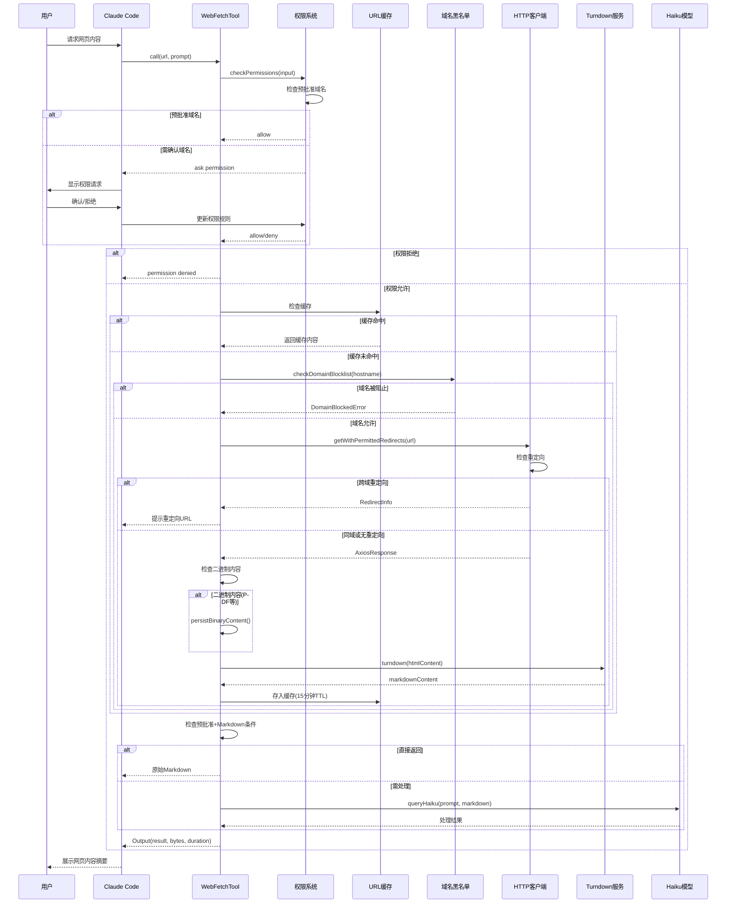

# 第十三章：Web 工具集

## 13.1 引言

Web 工具集是 Claude Code 与外部世界交互的关键组件。通过 WebFetchTool 和 WebSearchTool，Claude Code 能够：

1. **获取网页内容**：从指定 URL 抓取内容，转换为 Markdown 格式
2. **执行网络搜索**：使用 Anthropic API 内置的搜索能力获取最新信息
3. **安全权限控制**：通过预批准域名列表和域名黑名单检查确保安全访问
4. **内容智能处理**：使用 Haiku 模型提取和总结网页内容

本章深入分析 `WebFetchTool` 和 `WebSearchTool` 的实现，揭示 Web 工具的设计哲学和安全机制。

---

## 13.2 WebFetchTool 网页抓取工具

### 13.2.1 工具定义

WebFetchTool 定义在 `src/tools/WebFetchTool/WebFetchTool.ts`，使用 `buildTool()` 工厂函数创建：

```typescript
export const WebFetchTool = buildTool({
  name: WEB_FETCH_TOOL_NAME,
  searchHint: 'fetch and extract content from a URL',
  maxResultSizeChars: 100_000,
  shouldDefer: true,
  // ... 其他配置
})
```

**核心配置分析**：

| 配置项 | 值 | 说明 | 行号 |
|--------|-----|------|------|
| `name` | `'WebFetch'` | 工具名称 | 67 |
| `searchHint` | `'fetch and extract content from a URL'` | 搜索提示 | 68 |
| `maxResultSizeChars` | `100_000` | 结果最大字符数 | 70 |
| `shouldDefer` | `true` | 延迟加载 | 71 |
| `isConcurrencySafe()` | `true` | 可并发执行 | 95-97 |
| `isReadOnly()` | `true` | 只读操作 | 98-100 |

### 13.2.2 输入输出 Schema

**输入 Schema**（第 24-29 行）：

```typescript
const inputSchema = lazySchema(() =>
  z.strictObject({
    url: z.string().url().describe('The URL to fetch content from'),
    prompt: z.string().describe('The prompt to run on the fetched content'),
  }),
)
```

输入参数包含：
- `url`：必须是有效的 URL 格式
- `prompt`：用于指导内容提取的提示词

**输出 Schema**（第 32-46 行）：

```typescript
const outputSchema = lazySchema(() =>
  z.object({
    bytes: z.number().describe('Size of the fetched content in bytes'),
    code: z.number().describe('HTTP response code'),
    codeText: z.string().describe('HTTP response code text'),
    result: z.string().describe('Processed result from applying the prompt'),
    durationMs: z.number().describe('Time taken to fetch and process'),
    url: z.string().describe('The URL that was fetched'),
  }),
)
```

### 13.2.3 权限检查机制

WebFetchTool 实现了多层权限检查：

**权限检查流程**：

1. **预批准域名检查**（第 108-121 行）：
   ```typescript
   if (isPreapprovedHost(parsedUrl.hostname, parsedUrl.pathname)) {
     return {
       behavior: 'allow',
       updatedInput: input,
       decisionReason: { type: 'other', reason: 'Preapproved host' },
     }
   }
   ```

2. **拒绝规则检查**（第 126-140 行）：
   ```typescript
   const denyRule = getRuleByContentsForTool(permissionContext, WebFetchTool, 'deny')
     .get(ruleContent)
   if (denyRule) {
     return { behavior: 'deny', ... }
   }
   ```

3. **询问规则检查**（第 142-157 行）

4. **允许规则检查**（第 159-174 行）

5. **默认询问**（第 175-179 行）

**规则内容转换**（第 50-64 行）：

```typescript
function webFetchToolInputToPermissionRuleContent(input: { [k: string]: unknown }): string {
  const parsedInput = WebFetchTool.inputSchema.safeParse(input)
  if (!parsedInput.success) {
    return `input:${input.toString()}`
  }
  const { url } = parsedInput.data
  const hostname = new URL(url).hostname
  return `domain:${hostname}`
}
```

权限规则基于域名生成，格式为 `domain:hostname`。

### 13.2.4 预批准域名列表

预批准域名列表定义在 `src/tools/WebFetchTool/preapproved.ts`，包含编程相关的官方文档站点：

**分类示例**：

| 分类 | 域名示例 | 行号 |
|------|----------|------|
| Anthropic | `platform.claude.com`, `modelcontextprotocol.io` | 15-20 |
| 编程语言 | `docs.python.org`, `go.dev`, `doc.rust-lang.org` | 23-35 |
| Web 框架 | `react.dev`, `vuejs.org`, `nextjs.org` | 37-53 |
| Python 库 | `docs.djangoproject.com`, `fastapi.tiangolo.com` | 56-67 |
| 数据库 | `redis.io`, `www.postgresql.org` | 99-106 |
| 云服务 | `docs.aws.amazon.com`, `cloud.google.com` | 108-118 |

**预批准检查函数**（第 154-166 行）：

```typescript
export function isPreapprovedHost(hostname: string, pathname: string): boolean {
  if (HOSTNAME_ONLY.has(hostname)) return true
  const prefixes = PATH_PREFIXES.get(hostname)
  if (prefixes) {
    for (const p of prefixes) {
      if (pathname === p || pathname.startsWith(p + '/')) return true
    }
  }
  return false
}
```

支持两种匹配模式：
- 完整主机名匹配（如 `docs.python.org`）
- 路径前缀匹配（如 `github.com/anthropics`）

---

## 13.3 WebFetchTool 内容获取流程

### 13.3.1 call() 方法实现

`call()` 方法是工具执行的核心：

```typescript
async call({ url, prompt }, { abortController, options }) {
  const start = Date.now()
  const response = await getURLMarkdownContent(url, abortController)

  // 处理跨域重定向
  if ('type' in response && response.type === 'redirect') {
    // 返回重定向信息，提示用户重新请求
    return { data: { ... } }
  }

  // 处理正常响应
  const { content, bytes, code, codeText, contentType, persistedPath } = response

  // 对预批准域名的纯 Markdown 内容直接返回
  if (isPreapproved && contentType.includes('text/markdown') && content.length < MAX_MARKDOWN_LENGTH) {
    result = content
  } else {
    // 使用 Haiku 模型处理内容
    result = await applyPromptToMarkdown(prompt, content, ...)
  }

  // 添加二进制内容提示
  if (persistedPath) {
    result += `\n\n[Binary content saved to ${persistedPath}]`
  }

  return { data: output }
}
```

### 13.3.2 网页抓取流程图



<div style="text-align: center;">
<strong>图 13-1：WebFetchTool 网页抓取流程</strong>
</div>

---

## 13.4 内容获取与处理

### 13.4.1 getURLMarkdownContent() 实现

核心内容获取函数定义在 `src/tools/WebFetchTool/utils.ts`：

**主要处理流程**：

1. **URL 验证**（第 351-353 行）：
   ```typescript
   if (!validateURL(url)) {
     throw new Error('Invalid URL')
   }
   ```

2. **缓存检查**（第 356-367 行）：
   ```typescript
   const cachedEntry = URL_CACHE.get(url)
   if (cachedEntry) {
     return { bytes, code, content, contentType, ... }
   }
   ```

3. **HTTP 协议升级**（第 376-379 行）：
   ```typescript
   if (parsedUrl.protocol === 'http:') {
     parsedUrl.protocol = 'https:'
     upgradedUrl = parsedUrl.toString()
   }
   ```

4. **域名黑名单检查**（第 387-398 行）

5. **HTTP 请求**（第 417-421 行）

6. **内容类型处理**（第 456-466 行）：
   ```typescript
   if (contentType.includes('text/html')) {
     markdownContent = (await getTurndownService()).turndown(htmlContent)
   } else {
     markdownContent = htmlContent
   }
   ```

### 13.4.2 缓存机制

缓存配置定义在 `src/tools/WebFetchTool/utils.ts`：

```typescript
const CACHE_TTL_MS = 15 * 60 * 1000 // 15 分钟
const MAX_CACHE_SIZE_BYTES = 50 * 1024 * 1024 // 50MB

const URL_CACHE = new LRUCache<string, CacheEntry>({
  maxSize: MAX_CACHE_SIZE_BYTES,
  ttl: CACHE_TTL_MS,
})
```

**缓存策略**：

| 参数 | 值 | 说明 |
|------|-----|------|
| TTL | 15 分钟 | 自动过期时间 |
| 最大大小 | 50MB | 内存限制 |
| 类型 | LRU | 最近最少使用淘汰 |

**缓存结构**（第 51-59 行）：

```typescript
type CacheEntry = {
  bytes: number
  code: number
  codeText: string
  content: string
  contentType: string
  persistedPath?: string
  persistedSize?: number
}
```

### 13.4.3 HTML 转 Markdown

Turndown 服务惰性加载：

```typescript
let turndownServicePromise: Promise<InstanceType<TurndownCtor>> | undefined
function getTurndownService(): Promise<InstanceType<TurndownCtor>> {
  return (turndownServicePromise ??= import('turndown').then(m => {
    const Turndown = (m as unknown as { default: TurndownCtor }).default
    return new Turndown()
  }))
}
```

**惰性加载原因**（注释说明）：
- Turndown + Domino 模块约 1.4MB 内存
- 仅在首次 HTML 抓取时加载
- 构建实例创建 15 个规则对象，复用更高效

### 13.4.4 二进制内容处理

二进制内容检测和保存（第 442-449 行）：

```typescript
if (isBinaryContentType(contentType)) {
  const persistId = `webfetch-${Date.now()}-${Math.random().toString(36).slice(2, 8)}`
  const result = await persistBinaryContent(rawBuffer, contentType, persistId)
  if (!('error' in result)) {
    persistedPath = result.filepath
    persistedSize = result.size
  }
}
```

支持的二进制类型包括 PDF、图片等，保存后可供 Claude 用 Read 工具查看。

### 13.4.5 applyPromptToMarkdown() 实现

内容处理函数定义在 `src/tools/WebFetchTool/utils.ts`：

```typescript
export async function applyPromptToMarkdown(
  prompt: string,
  markdownContent: string,
  signal: AbortSignal,
  isNonInteractiveSession: boolean,
  isPreapprovedDomain: boolean,
): Promise<string> {
  // 截断超长内容
  const truncatedContent =
    markdownContent.length > MAX_MARKDOWN_LENGTH
      ? markdownContent.slice(0, MAX_MARKDOWN_LENGTH) + '\n\n[Content truncated...]'
      : markdownContent

  const modelPrompt = makeSecondaryModelPrompt(truncatedContent, prompt, isPreapprovedDomain)
  const assistantMessage = await queryHaiku({ systemPrompt, userPrompt: modelPrompt, ... })

  return assistantMessage.message.content[0].text
}
```

**内容截断限制**（第 128 行）：

```typescript
export const MAX_MARKDOWN_LENGTH = 100_000
```

---

## 13.5 重定向安全处理

### 13.5.1 重定向检查策略

按照 PSR（产品安全审查）要求，WebFetchTool 不会自动跟随跨域重定向：

```typescript
export function isPermittedRedirect(originalUrl: string, redirectUrl: string): boolean {
  const parsedOriginal = new URL(originalUrl)
  const parsedRedirect = new URL(redirectUrl)

  // 协议必须相同
  if (parsedRedirect.protocol !== parsedOriginal.protocol) return false

  // 端口必须相同
  if (parsedRedirect.port !== parsedOriginal.port) return false

  // 不能有用户名/密码
  if (parsedRedirect.username || parsedRedirect.password) return false

  // 主机名允许添加/移除 www.
  const stripWww = (hostname: string) => hostname.replace(/^www\./, '')
  return stripWww(parsedOriginal.hostname) === stripWww(parsedRedirect.hostname)
}
```

**允许的重定向**：
- `example.com` → `www.example.com`
- `www.example.com` → `example.com`
- 同域路径变化

**禁止的重定向**：
- 跨域重定向（如 `trusted.com` → `malicious.com`）
- 协议变化（如 `https://` → `http://`）
- 端口变化
- 包含认证信息的 URL

### 13.5.2 重定向限制

定义在 `src/tools/WebFetchTool/utils.ts`：

```typescript
const MAX_REDIRECTS = 10
```

防止无限重定向循环导致请求挂起。

### 13.5.3 getWithPermittedRedirects() 实现

递归重定向处理（第 262-329 行）：

```typescript
export async function getWithPermittedRedirects(
  url: string,
  signal: AbortSignal,
  redirectChecker: (originalUrl: string, redirectUrl: string) => boolean,
  depth = 0,
): Promise<AxiosResponse<ArrayBuffer> | RedirectInfo> {
  if (depth > MAX_REDIRECTS) {
    throw new Error(`Too many redirects (exceeded ${MAX_REDIRECTS})`)
  }

  try {
    return await axios.get(url, { maxRedirects: 0, ... })
  } catch (error) {
    if (axios.isAxiosError(error) && [301, 302, 307, 308].includes(error.response.status)) {
      const redirectUrl = new URL(redirectLocation, url).toString()

      if (redirectChecker(url, redirectUrl)) {
        // 允许的重定向：递归跟随
        return getWithPermittedRedirects(redirectUrl, signal, redirectChecker, depth + 1)
      } else {
        // 禁止的重定向：返回信息让用户决定
        return { type: 'redirect', originalUrl: url, redirectUrl, statusCode }
      }
    }
    throw error
  }
}
```

---

## 13.6 域名安全机制

### 13.6.1 域名黑名单检查

域名黑名单检查定义在 `src/tools/WebFetchTool/utils.ts`：

```typescript
export async function checkDomainBlocklist(domain: string): Promise<DomainCheckResult> {
  // 检查缓存
  if (DOMAIN_CHECK_CACHE.has(domain)) {
    return { status: 'allowed' }
  }

  // 调用 Anthropic API 检查
  const response = await axios.get(
    `https://api.anthropic.com/api/web/domain_info?domain=${encodeURIComponent(domain)}`,
    { timeout: DOMAIN_CHECK_TIMEOUT_MS }
  )

  if (response.data.can_fetch === true) {
    DOMAIN_CHECK_CACHE.set(domain, true)
    return { status: 'allowed' }
  }
  return { status: 'blocked' }
}
```

**检查结果类型**（第 171-174 行）：

```typescript
type DomainCheckResult =
  | { status: 'allowed' }
  | { status: 'blocked' }
  | { status: 'check_failed'; error: Error }
```

### 13.6.2 域名检查缓存

域名检查缓存配置：

```typescript
const DOMAIN_CHECK_CACHE = new LRUCache<string, true>({
  max: 128,
  ttl: 5 * 60 * 1000, // 5 分钟
})
```

只缓存 `allowed` 状态，`blocked` 和 `failed` 每次重新检查。

### 13.6.3 自定义错误类型

自定义错误类型定义：

```typescript
class DomainBlockedError extends Error {
  constructor(domain: string) {
    super(`Claude Code is unable to fetch from ${domain}`)
    this.name = 'DomainBlockedError'
  }
}

class DomainCheckFailedError extends Error {
  constructor(domain: string) {
    super(`Unable to verify if domain ${domain} is safe to fetch. ...`)
    this.name = 'DomainCheckFailedError'
  }
}

class EgressBlockedError extends Error {
  constructor(public readonly domain: string) {
    super(JSON.stringify({ error_type: 'EGRESS_BLOCKED', domain, ... }))
    this.name = 'EgressBlockedError'
  }
}
```

### 13.6.4 资源限制

根据 PSR 要求实现的资源控制：

| 限制项 | 值 | 行号 |
|--------|-----|------|
| URL 最大长度 | 2000 字符 | 106 |
| HTTP 内容最大长度 | 10MB | 112 |
| 请求超时 | 60 秒 | 116 |
| 域名检查超时 | 10 秒 | 119 |
| 最大重定向次数 | 10 | 125 |

---

## 13.7 WebSearchTool 网络搜索工具

### 13.7.1 工具定义

WebSearchTool 定义在 `src/tools/WebSearchTool/WebSearchTool.ts`：

```typescript
export const WebSearchTool = buildTool({
  name: WEB_SEARCH_TOOL_NAME,
  searchHint: 'search the web for current information',
  maxResultSizeChars: 100_000,
  shouldDefer: true,
  // ... 其他配置
})
```

**核心配置分析**：

| 配置项 | 说明 | 行号 |
|--------|------|------|
| `isEnabled()` | 仅对 firstParty、Vertex AI、Foundry 启用 | 168-192 |
| `isConcurrencySafe()` | `true` | 200-202 |
| `isReadOnly()` | `true` | 203-205 |

### 13.7.2 输入输出 Schema

**输入 Schema**（第 25-37 行）：

```typescript
const inputSchema = lazySchema(() =>
  z.strictObject({
    query: z.string().min(2).describe('The search query to use'),
    allowed_domains: z.array(z.string()).optional()
      .describe('Only include search results from these domains'),
    blocked_domains: z.array(z.string()).optional()
      .describe('Never include search results from these domains'),
  }),
)
```

**输出 Schema**（第 56-67 行）：

```typescript
const outputSchema = lazySchema(() =>
  z.object({
    query: z.string().describe('The search query that was executed'),
    results: z.array(z.union([searchResultSchema(), z.string()]))
      .describe('Search results and/or text commentary'),
    durationSeconds: z.number().describe('Time taken to complete'),
  }),
)
```

### 13.7.3 搜索执行流程

`call()` 方法是搜索执行的入口：

```typescript
async call(input, context, _canUseTool, _parentMessage, onProgress) {
  const startTime = performance.now()
  const { query } = input

  // 创建用户消息
  const userMessage = createUserMessage({
    content: 'Perform a web search for the query: ' + query,
  })

  // 构建工具 schema
  const toolSchema = makeToolSchema(input)

  // 流式查询模型
  const queryStream = queryModelWithStreaming({
    messages: [userMessage],
    tools: [],
    extraToolSchemas: [toolSchema],
    // ...
  })

  // 处理流式事件
  for await (const event of queryStream) {
    // 跟踪 server_tool_use 开始
    // 累积 JSON 数据
    // 报告进度
  }

  // 处理最终结果
  return { data: makeOutputFromSearchResponse(allContentBlocks, query, durationSeconds) }
}
```

### 13.7.4 Anthropic API 搜索工具 Schema

Anthropic API 搜索工具 Schema 定义：

```typescript
function makeToolSchema(input: Input): BetaWebSearchTool20250305 {
  return {
    type: 'web_search_20250305',
    name: 'web_search',
    allowed_domains: input.allowed_domains,
    blocked_domains: input.blocked_domains,
    max_uses: 8, // 最大搜索次数
  }
}
```

使用 Anthropic Beta API 的内置搜索能力。

### 13.7.5 结果解析

`makeOutputFromSearchResponse()` 结果解析函数：

```typescript
function makeOutputFromSearchResponse(
  result: BetaContentBlock[],
  query: string,
  durationSeconds: number,
): Output {
  const results: (SearchResult | string)[] = []

  for (const block of result) {
    if (block.type === 'server_tool_use') continue

    if (block.type === 'web_search_tool_result') {
      if (!Array.isArray(block.content)) {
        // 错误处理
        results.push(`Web search error: ${block.content.error_code}`)
        continue
      }
      // 提取搜索结果
      const hits = block.content.map(r => ({ title: r.title, url: r.url }))
      results.push({ tool_use_id: block.tool_use_id, content: hits })
    }

    if (block.type === 'text') {
      // 文本摘要
      results.push(block.text)
    }
  }

  return { query, results, durationSeconds }
}
```

---

## 13.8 UI 渲染组件

### 13.8.1 WebFetchTool UI

WebFetchTool UI 渲染组件定义在 `src/tools/WebFetchTool/UI.tsx`：

**渲染函数分析**：

| 函数名 | 说明 | 行号 |
|--------|------|------|
| `renderToolUseMessage()` | 显示 URL 和 prompt | 9-28 |
| `renderToolUseProgressMessage()` | 显示 "Fetching..." | 29-33 |
| `renderToolResultMessage()` | 显示响应大小和状态码 | 34-62 |
| `getToolUseSummary()` | 生成摘要 | 63-71 |

**结果渲染示例**（第 34-62 行）：

```typescript
export function renderToolResultMessage({ bytes, code, codeText, result }: Output, ...) {
  const formattedSize = formatFileSize(bytes)
  if (verbose) {
    return (
      <Box flexDirection="column">
        <MessageResponse>
          <Text>Received <Text bold>{formattedSize}</Text> ({code} {codeText})</Text>
        </MessageResponse>
        <Text>{result}</Text>
      </Box>
    )
  }
  return (
    <MessageResponse>
      <Text>Received <Text bold>{formattedSize}</Text> ({code} {codeText})</Text>
    </MessageResponse>
  )
}
```

### 13.8.2 WebSearchTool UI

WebSearchTool UI 渲染组件定义在 `src/tools/WebSearchTool/UI.tsx`：

**进度渲染**（第 55-78 行）：

```typescript
export function renderToolUseProgressMessage(progressMessages: ProgressMessage<WebSearchProgress>[]) {
  const lastProgress = progressMessages[progressMessages.length - 1]
  const data = lastProgress.data

  switch (data.type) {
    case 'query_update':
      return <MessageResponse><Text dimColor>Searching: {data.query}</Text></MessageResponse>
    case 'search_results_received':
      return (
        <MessageResponse>
          <Text dimColor>Found {data.resultCount} results for "{data.query}"</Text>
        </MessageResponse>
      )
  }
}
```

**结果渲染**（第 79-92 行）：

```typescript
export function renderToolResultMessage(output: Output) {
  const { searchCount } = getSearchSummary(output.results ?? [])
  const timeDisplay = output.durationSeconds >= 1
    ? `${Math.round(output.durationSeconds)}s`
    : `${Math.round(output.durationSeconds * 1000)}ms`

  return (
    <Box justifyContent="space-between">
      <MessageResponse>
        <Text>Did {searchCount} search{searchCount !== 1 ? 'es' : ''} in {timeDisplay}</Text>
      </MessageResponse>
    </Box>
  )
}
```

---

## 13.9 系统提示

### 13.9.1 WebFetchTool 提示

WebFetchTool 提示定义在 `src/tools/WebFetchTool/prompt.ts`：

```typescript
export const DESCRIPTION = `
- Fetches content from a specified URL and processes it using an AI model
- Takes a URL and a prompt as input
- Fetches the URL content, converts HTML to markdown
- Processes the content with the prompt using a small, fast model
- Returns the model's response about the content
- Use this tool when you need to retrieve and analyze web content

Usage notes:
  - IMPORTANT: If an MCP-provided web fetch tool is available, prefer using that tool
  - The URL must be a fully-formed valid URL
  - HTTP URLs will be automatically upgraded to HTTPS
  - Results may be summarized if the content is very large
  - Includes a self-cleaning 15-minute cache
  - When a URL redirects to a different host, the tool will inform you
  - For GitHub URLs, prefer using the gh CLI via Bash
`
```

**认证警告**（第 188 行）：

```typescript
return `IMPORTANT: WebFetch WILL FAIL for authenticated or private URLs. Before using this tool, check if the URL points to an authenticated service (e.g. Google Docs, Confluence, Jira, GitHub). If so, look for a specialized MCP tool that provides authenticated access.`
```

### 13.9.2 WebSearchTool 提示

WebSearchTool 提示定义在 `src/tools/WebSearchTool/prompt.ts`：

```typescript
export function getWebSearchPrompt(): string {
  const currentMonthYear = getLocalMonthYear()
  return `
- Allows Claude to search the web and use the results to inform responses
- Provides up-to-date information for current events and recent data
- Returns search result information formatted as search result blocks
- Use this tool for accessing information beyond Claude's knowledge cutoff

CRITICAL REQUIREMENT - You MUST follow this:
  - After answering the user's question, you MUST include a "Sources:" section
  - In the Sources section, list all relevant URLs as markdown hyperlinks

IMPORTANT - Use the correct year in search queries:
  - The current month is ${currentMonthYear}
  - Example: If the user asks for "latest React docs", search for "React documentation" with the current year
`
}
```

**关键要求**：必须在回答后包含 Sources 部分。

---

## 13.10 总结

本章分析了 Claude Code Web 工具集的实现：

1. **WebFetchTool**：
   - 多层权限检查（预批准域名、用户规则）
   - 域名黑名单机制
   - 安全重定向处理（禁止跨域自动跟随）
   - LRU 缓存（15 分钟 TTL，50MB 限制）
   - HTML 转 Markdown（Turndown 惰性加载）
   - Haiku 模型内容处理

2. **WebSearchTool**：
   - 使用 Anthropic API 内置搜索能力
   - 支持域名过滤（allowed_domains、blocked_domains）
   - 流式进度反馈
   - 仅对特定 API 提供商启用

3. **安全机制**：
   - PSR 合规的资源限制
   - 自定义错误类型
   - 域名检查缓存
   - URL 验证

Web 工具集的设计体现了 Claude Code 对安全性和用户体验的重视：
- 预批准列表减少常见文档站点的权限请求
- 重定向安全检查防止开放重定向攻击
- 资源限制防止系统过载
- 缓存机制提升响应速度