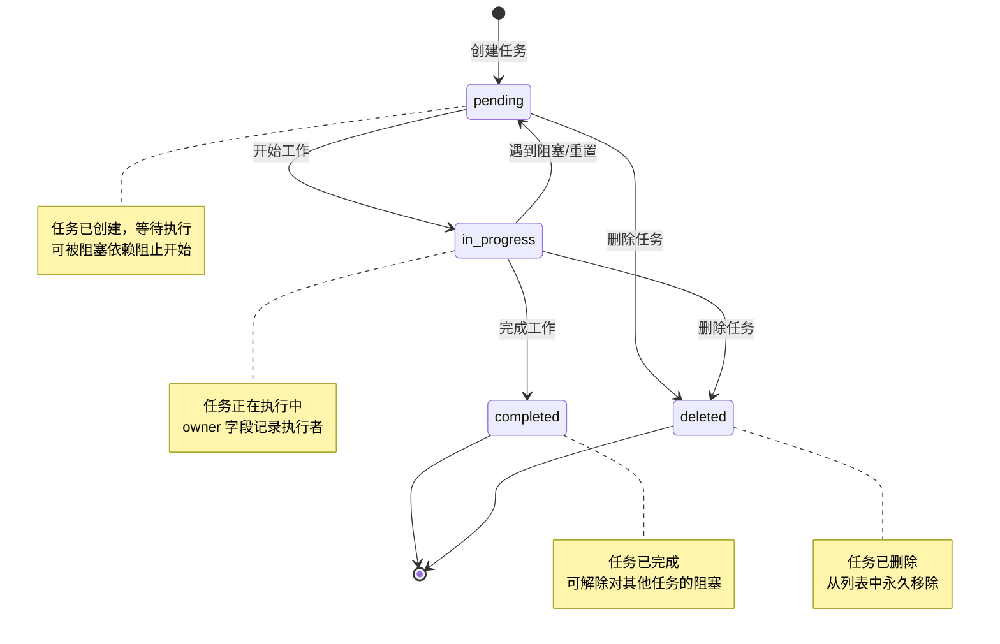

# 第十四章：任务管理工具集

## 14.1 概述

Claude Code 的任务管理工具集提供了一套完整的工具，用于创建、查询、更新和停止任务。这些工具支持复杂的多步骤工作流，使 Agent 能够跟踪进度、组织复杂任务，并向用户展示整体工作进展。任务系统还支持依赖关系管理（blocks/blockedBy），允许任务之间建立阻塞关系，确保工作按正确顺序执行。

本章将深入分析五个核心任务工具：
- **TaskCreateTool** - 创建新任务
- **TaskGetTool** - 获取单个任务详情
- **TaskListTool** - 列出所有任务
- **TaskUpdateTool** - 更新任务状态和属性
- **TaskStopTool** - 停止后台运行的任务

## 14.2 任务状态模型

任务系统定义了三种核心状态，形成从创建到完成的生命周期：



**Figure 14-1**: 任务状态转换图

状态定义位于 `/src/utils/tasks.ts` (第 69-74 行)：

```typescript
export const TASK_STATUSES = ['pending', 'in_progress', 'completed'] as const

export const TaskStatusSchema = lazySchema(() =>
  z.enum(['pending', 'in_progress', 'completed']),
)
export type TaskStatus = z.infer<ReturnType<typeof TaskStatusSchema>>
```

值得注意的是，后台任务系统（如 Shell 执行、Agent 任务）使用不同的状态模型，定义在 `/src/Task.ts` (第 15-21 行)：

```typescript
export type TaskStatus =
  | 'pending'
  | 'running'
  | 'completed'
  | 'failed'
  | 'killed'
```

两种状态模型服务于不同场景：任务列表工具（TaskCreate/Get/List/Update）管理结构化的工作计划，而后台任务系统管理实际执行的进程。

## 14.3 TaskCreateTool - 任务创建

### 14.3.1 工具定义

TaskCreateTool 用于在任务列表中创建新任务，是复杂工作流的起点。源码位于 `/src/tools/TaskCreateTool/TaskCreateTool.ts`。

**输入 Schema** (第 18-33 行)：

```typescript
const inputSchema = lazySchema(() =>
  z.strictObject({
    subject: z.string().describe('A brief title for the task'),
    description: z.string().describe('What needs to be done'),
    activeForm: z
      .string()
      .optional()
      .describe(
        'Present continuous form shown in spinner when in_progress (e.g., "Running tests")',
      ),
    metadata: z
      .record(z.string(), z.unknown())
      .optional()
      .describe('Arbitrary metadata to attach to the task'),
  }),
)
```

核心字段：
- **subject**: 任务标题，使用祈使语气（如 "Fix authentication bug"）
- **description**: 详细说明需要完成的工作
- **activeForm**: 可选字段，用于 Spinner 显示进行中的状态
- **metadata**: 可选的任意元数据字典

### 14.3.2 创建流程

`call` 方法实现核心创建逻辑 (第 80-129 行)：

```typescript
async call({ subject, description, activeForm, metadata }, context) {
  const taskId = await createTask(getTaskListId(), {
    subject,
    description,
    activeForm,
    status: 'pending',
    owner: undefined,
    blocks: [],
    blockedBy: [],
    metadata,
  })

  const blockingErrors: string[] = []
  const generator = executeTaskCreatedHooks(
    taskId,
    subject,
    description,
    getAgentName(),
    getTeamName(),
    undefined,
    context?.abortController?.signal,
    undefined,
    context,
  )
  for await (const result of generator) {
    if (result.blockingError) {
      blockingErrors.push(getTaskCreatedHookMessage(result.blockingError))
    }
  }

  if (blockingErrors.length > 0) {
    await deleteTask(getTaskListId(), taskId)
    throw new Error(blockingErrors.join('\n'))
  }

  // Auto-expand task list when creating tasks
  context.setAppState(prev => {
    if (prev.expandedView === 'tasks') return prev
    return { ...prev, expandedView: 'tasks' as const }
  })

  return {
    data: {
      task: {
        id: taskId,
        subject,
      },
    },
  }
}
```

创建流程的关键步骤：
1. 调用 `createTask` 创建任务，初始状态为 `pending`
2. 执行 TaskCreated Hooks，允许外部验证任务创建
3. 如果 Hook 返回阻塞错误，删除任务并抛出异常
4. 自动展开任务列表视图

### 14.3.3 使用场景

Prompt 文件 (`/src/tools/TaskCreateTool/prompt.ts`) 定义了使用场景：

```typescript
## When to Use This Tool

Use this tool proactively in these scenarios:

- Complex multi-step tasks - When a task requires 3 or more distinct steps or actions
- Non-trivial and complex tasks - Tasks that require careful planning or multiple operations
- Plan mode - When using plan mode, create a task list to track the work
- User explicitly requests todo list - When the user directly asks you to use the todo list
- User provides multiple tasks - When users provide a list of things to be done
- After receiving new instructions - Immediately capture user requirements as tasks
- When you start working on a task - Mark it as in_progress BEFORE beginning work
- After completing a task - Mark it as completed and add any new follow-up tasks
```

在 Teammate（多 Agent 协作）模式下，Prompt 还包含额外提示：

```typescript
const teammateTips = isAgentSwarmsEnabled()
  ? `- Include enough detail in the description for another agent to understand and complete the task
- New tasks are created with status 'pending' and no owner - use TaskUpdate with the \`owner\` parameter to assign them
`
  : ''
```

## 14.4 TaskGetTool/TaskListTool - 任务检索

### 14.4.1 TaskGetTool - 单任务查询

TaskGetTool 用于获取单个任务的完整详情，包括依赖关系。源码位于 `/src/tools/TaskGetTool/TaskGetTool.ts`。

**输入 Schema** (第 13-17 行)：

```typescript
const inputSchema = lazySchema(() =>
  z.strictObject({
    taskId: z.string().describe('The ID of the task to retrieve'),
  }),
)
```

**输出 Schema** (第 20-33 行)：

```typescript
const outputSchema = lazySchema(() =>
  z.object({
    task: z
      .object({
        id: z.string(),
        subject: z.string(),
        description: z.string(),
        status: TaskStatusSchema(),
        blocks: z.array(z.string()),
        blockedBy: z.array(z.string()),
      })
      .nullable(),
  }),
)
```

`call` 方法实现 (第 73-97 行)：

```typescript
async call({ taskId }) {
  const taskListId = getTaskListId()

  const task = await getTask(taskListId, taskId)

  if (!task) {
    return {
      data: {
        task: null,
      },
    }
  }

  return {
    data: {
      task: {
        id: task.id,
        subject: task.subject,
        description: task.description,
        status: task.status,
        blocks: task.blocks,
        blockedBy: task.blockedBy,
      },
    },
  }
}
```

### 14.4.2 TaskListTool - 任务列表查询

TaskListTool 用于获取所有任务的摘要列表。源码位于 `/src/tools/TaskListTool/TaskListTool.ts`。

**输出 Schema** (第 16-29 行)：

```typescript
const outputSchema = lazySchema(() =>
  z.object({
    tasks: z.array(
      z.object({
        id: z.string(),
        subject: z.string(),
        status: TaskStatusSchema(),
        owner: z.string().optional(),
        blockedBy: z.array(z.string()),
      }),
    ),
  }),
)
```

`call` 方法实现 (第 65-90 行)：

```typescript
async call() {
  const taskListId = getTaskListId()

  const allTasks = (await listTasks(taskListId)).filter(
    t => !t.metadata?._internal,
  )

  // Build a set of resolved task IDs for filtering
  const resolvedTaskIds = new Set(
    allTasks.filter(t => t.status === 'completed').map(t => t.id),
  )

  const tasks = allTasks.map(task => ({
    id: task.id,
    subject: task.subject,
    status: task.status,
    owner: task.owner,
    blockedBy: task.blockedBy.filter(id => !resolvedTaskIds.has(id)),
  }))

  return {
    data: {
      tasks,
    },
  }
}
```

关键逻辑：
- 过滤掉 `_internal` 元数据的任务（内部任务不展示给用户）
- 已完成任务不再出现在 blockedBy 列表中（依赖已解除）

### 14.4.3 结果格式化

两个工具都提供 `mapToolResultToToolResultBlockParam` 方法格式化输出：

**TaskGetTool** (第 109-126 行)：

```typescript
const lines = [
  `Task #${task.id}: ${task.subject}`,
  `Status: ${task.status}`,
  `Description: ${task.description}`,
]

if (task.blockedBy.length > 0) {
  lines.push(`Blocked by: ${task.blockedBy.map(id => `#${id}`).join(', ')}`)
}
if (task.blocks.length > 0) {
  lines.push(`Blocks: ${task.blocks.map(id => `#${id}`).join(', ')}`)
}
```

**TaskListTool** (第 101-114 行)：

```typescript
const lines = tasks.map(task => {
  const owner = task.owner ? ` (${task.owner})` : ''
  const blocked =
    task.blockedBy.length > 0
      ? ` [blocked by ${task.blockedBy.map(id => `#${id}`).join(', ')}]`
      : ''
  return `#${task.id} [${task.status}] ${task.subject}${owner}${blocked}`
})
```

## 14.5 TaskUpdateTool - 状态更新

### 14.5.1 工具定义

TaskUpdateTool 是任务管理中最复杂的工具，支持状态转换、所有者分配、依赖关系建立等多种操作。源码位于 `/src/tools/TaskUpdateTool/TaskUpdateTool.ts`。

**输入 Schema** (第 33-66 行)：

```typescript
const inputSchema = lazySchema(() => {
  // Extended status schema that includes 'deleted' as a special action
  const TaskUpdateStatusSchema = TaskStatusSchema().or(z.literal('deleted'))

  return z.strictObject({
    taskId: z.string().describe('The ID of the task to update'),
    subject: z.string().optional().describe('New subject for the task'),
    description: z.string().optional().describe('New description for the task'),
    activeForm: z
      .string()
      .optional()
      .describe(
        'Present continuous form shown in spinner when in_progress (e.g., "Running tests")',
      ),
    status: TaskUpdateStatusSchema.optional().describe(
      'New status for the task',
    ),
    addBlocks: z
      .array(z.string())
      .optional()
      .describe('Task IDs that this task blocks'),
    addBlockedBy: z
      .array(z.string())
      .optional()
      .describe('Task IDs that block this task'),
    owner: z.string().optional().describe('New owner for the task'),
    metadata: z
      .record(z.string(), z.unknown())
      .optional()
      .describe(
        'Metadata keys to merge into the task. Set a key to null to delete it.',
      ),
  })
})
```

可更新字段：
- **status**: 状态（含特殊值 `deleted` 用于删除）
- **subject/description/activeForm**: 基本属性
- **owner**: 所有者（Agent 名称）
- **addBlocks/addBlockedBy**: 依赖关系
- **metadata**: 元数据合并（设为 null 删除键）

### 14.5.2 状态转换逻辑

`call` 方法实现复杂的更新逻辑 (第 123-270 行)：

```typescript
async call(
  {
    taskId,
    subject,
    description,
    activeForm,
    status,
    owner,
    addBlocks,
    addBlockedBy,
    metadata,
  },
  context,
) {
  const taskListId = getTaskListId()

  // Auto-expand task list when updating tasks
  context.setAppState(prev => {
    if (prev.expandedView === 'tasks') return prev
    return { ...prev, expandedView: 'tasks' as const }
  })

  // Check if task exists
  const existingTask = await getTask(taskListId, taskId)
  if (!existingTask) {
    return {
      data: {
        success: false,
        taskId,
        updatedFields: [],
        error: 'Task not found',
      },
    }
  }

  const updatedFields: string[] = []

  // Update basic fields if provided and different from current value
  const updates: {
    subject?: string
    description?: string
    activeForm?: string
    status?: TaskStatus
    owner?: string
    metadata?: Record<string, unknown>
  } = {}
  // ... 字段更新逻辑 ...

  // Handle deletion - delete the task file and return early
  if (status === 'deleted') {
    const deleted = await deleteTask(taskListId, taskId)
    return {
      data: {
        success: deleted,
        taskId,
        updatedFields: deleted ? ['deleted'] : [],
        error: deleted ? undefined : 'Failed to delete task',
        statusChange: deleted
          ? { from: existingTask.status, to: 'deleted' }
          : undefined,
      },
    }
  }

  // Run TaskCompleted hooks when marking a task as completed
  if (status === 'completed') {
    const blockingErrors: string[] = []

    const generator = executeTaskCompletedHooks(
      taskId,
      existingTask.subject,
      existingTask.description,
      getAgentName(),
      getTeamName(),
      undefined,
      context?.abortController?.signal,
      undefined,
      context,
    )

    for await (const result of generator) {
      if (result.blockingError) {
        blockingErrors.push(
          getTaskCompletedHookMessage(result.blockingError),
        )
      }
    }

    if (blockingErrors.length > 0) {
      return {
        data: {
          success: false,
          taskId,
          updatedFields: [],
          error: blockingErrors.join('\n'),
        },
      }
    }
  }
  // ...
}
```

关键逻辑：
1. 自动展开任务列表视图
2. 验证任务存在性
3. 处理 `deleted` 状态的特殊删除逻辑
4. 执行 TaskCompleted Hooks 验证完成操作

### 14.5.3 所有者自动分配

在 Teammate 模式下，系统支持自动分配所有者 (第 186-199 行)：

```typescript
// Auto-set owner when a teammate marks a task as in_progress without
// explicitly providing an owner. This ensures the task list can match
// todo items to teammates for showing activity status.
if (
  isAgentSwarmsEnabled() &&
  status === 'in_progress' &&
  owner === undefined &&
  !existingTask.owner
) {
  const agentName = getAgentName()
  if (agentName) {
    updates.owner = agentName
    updatedFields.push('owner')
  }
}
```

### 14.5.4 邮箱通知

当所有者变更时，系统通过邮箱通知新所有者 (第 277-298 行)：

```typescript
// Notify new owner via mailbox when ownership changes
if (updates.owner && isAgentSwarmsEnabled()) {
  const senderName = getAgentName() || 'team-lead'
  const senderColor = getTeammateColor()
  const assignmentMessage = JSON.stringify({
    type: 'task_assignment',
    taskId,
    subject: existingTask.subject,
    description: existingTask.description,
    assignedBy: senderName,
    timestamp: new Date().toISOString(),
  })
  await writeToMailbox(
    updates.owner,
    {
      from: senderName,
      text: assignmentMessage,
      timestamp: new Date().toISOString(),
      color: senderColor,
    },
    taskListId,
  )
}
```

## 14.6 TaskStopTool - 停止后台任务

### 14.6.1 工具定义

TaskStopTool 用于停止正在运行的后台任务（如 Shell 命令、Agent 任务）。源码位于 `/src/tools/TaskStopTool/TaskStopTool.ts`。

**输入 Schema** (第 10-19 行)：

```typescript
const inputSchema = lazySchema(() =>
  z.strictObject({
    task_id: z
      .string()
      .optional()
      .describe('The ID of the background task to stop'),
    // shell_id is accepted for backward compatibility with the deprecated KillShell tool
    shell_id: z.string().optional().describe('Deprecated: use task_id instead'),
  }),
)
```

注意：`shell_id` 参数保留向后兼容性，原名为 `KillShell` 工具。

**输入验证** (第 60-91 行)：

```typescript
async validateInput({ task_id, shell_id }, { getAppState }) {
  // Support both task_id and shell_id (deprecated KillShell compat)
  const id = task_id ?? shell_id
  if (!id) {
    return {
      result: false,
      message: 'Missing required parameter: task_id',
      errorCode: 1,
    }
  }

  const appState = getAppState()
  const task = appState.tasks?.[id] as TaskStateBase | undefined

  if (!task) {
    return {
      result: false,
      message: `No task found with ID: ${id}`,
      errorCode: 1,
    }
  }

  if (task.status !== 'running') {
    return {
      result: false,
      message: `Task ${id} is not running (status: ${task.status})`,
      errorCode: 3,
    }
  }

  return { result: true }
}
```

验证逻辑：
- 必须提供 task_id 或 shell_id
- 任务必须存在
- 任务状态必须为 `running`

### 14.6.2 停止逻辑

`call` 方法调用 `stopTask` 函数 (第 107-130 行)：

```typescript
async call(
  { task_id, shell_id },
  { getAppState, setAppState, abortController },
) {
  // Support both task_id and shell_id (deprecated KillShell compat)
  const id = task_id ?? shell_id
  if (!id) {
    throw new Error('Missing required parameter: task_id')
  }

  const result = await stopTask(id, {
    getAppState,
    setAppState,
  })

  return {
    data: {
      message: `Successfully stopped task: ${result.taskId} (${result.command})`,
      task_id: result.taskId,
      task_type: result.taskType,
      command: result.command,
    },
  }
}
```

### 14.6.3 stopTask 核心实现

`stopTask` 函数位于 `/src/tasks/stopTask.ts` (第 38-100 行)：

```typescript
export async function stopTask(
  taskId: string,
  context: StopTaskContext,
): Promise<StopTaskResult> {
  const { getAppState, setAppState } = context
  const appState = getAppState()
  const task = appState.tasks?.[taskId] as TaskStateBase | undefined

  if (!task) {
    throw new StopTaskError(`No task found with ID: ${taskId}`, 'not_found')
  }

  if (task.status !== 'running') {
    throw new StopTaskError(
      `Task ${taskId} is not running (status: ${task.status})`,
      'not_running',
    )
  }

  const taskImpl = getTaskByType(task.type)
  if (!taskImpl) {
    throw new StopTaskError(
      `Unsupported task type: ${task.type}`,
      'unsupported_type',
    )
  }

  await taskImpl.kill(taskId, setAppState)

  // Bash: suppress the "exit code 137" notification (noise). Agent tasks: don't
  // suppress — the AbortError catch sends a notification carrying
  // extractPartialResult(agentMessages), which is the payload not noise.
  if (isLocalShellTask(task)) {
    let suppressed = false
    setAppState(prev => {
      const prevTask = prev.tasks[taskId]
      if (!prevTask || prevTask.notified) {
        return prev
      }
      suppressed = true
      return {
        ...prev,
        tasks: {
          ...prev.tasks,
          [taskId]: { ...prevTask, notified: true },
        },
      }
    })
    // Suppressing the XML notification also suppresses print.ts's parsed
    // task_notification SDK event — emit it directly so SDK consumers see
    // the task close.
    if (suppressed) {
      emitTaskTerminatedSdk(taskId, 'stopped', {
        toolUseId: task.toolUseId,
        summary: task.description,
      })
    }
  }

  const command = isLocalShellTask(task) ? task.command : task.description

  return { taskId, taskType: task.type, command }
}
```

关键步骤：
1. 验证任务存在且正在运行
2. 获取任务类型对应的实现
3. 调用 `kill` 方法终止任务
4. 对于 Shell 任务，抑制 "exit code 137" 噪声通知
5. 发送 SDK 任务终止事件

## 14.7 任务依赖管理

### 14.7.1 依赖关系模型

任务系统支持两种依赖方向：

- **blocks**: 此任务阻塞的任务列表（此任务完成后才能开始）
- **blockedBy**: 阻塞此任务的任务列表（这些任务完成后才能开始此任务）

定义在 `/src/utils/tasks.ts` (第 76-89 行)：

```typescript
export const TaskSchema = lazySchema(() =>
  z.object({
    id: z.string(),
    subject: z.string(),
    description: z.string(),
    activeForm: z.string().optional(),
    owner: z.string().optional(),
    status: TaskStatusSchema(),
    blocks: z.array(z.string()), // task IDs this task blocks
    blockedBy: z.array(z.string()), // task IDs that block this task
    metadata: z.record(z.string(), z.unknown()).optional(),
  }),
)
```

### 14.7.2 blockTask 函数

`blockTask` 函数建立阻塞关系，位于 `/src/utils/tasks.ts` (第 458-486 行)：

```typescript
export async function blockTask(
  taskListId: string,
  fromTaskId: string,
  toTaskId: string,
): Promise<boolean> {
  const [fromTask, toTask] = await Promise.all([
    getTask(taskListId, fromTaskId),
    getTask(taskListId, toTaskId),
  ])
  if (!fromTask || !toTask) {
    return false
  }

  // Update source task: A blocks B
  if (!fromTask.blocks.includes(toTaskId)) {
    await updateTask(taskListId, fromTaskId, {
      blocks: [...fromTask.blocks, toTaskId],
    })
  }

  // Update target task: B is blockedBy A
  if (!toTask.blockedBy.includes(fromTaskId)) {
    await updateTask(taskListId, toTaskId, {
      blockedBy: [...toTask.blockedBy, fromTaskId],
    })
  }

  return true
}
```

阻塞关系是双向的：A blocks B 意味着：
- A 的 `blocks` 列表包含 B
- B 的 `blockedBy` 列表包含 A

### 14.7.3 TaskUpdateTool 中的依赖操作

TaskUpdateTool 的 `call` 方法处理依赖更新 (第 300-324 行)：

```typescript
// Add blocks if provided and not already present
if (addBlocks && addBlocks.length > 0) {
  const newBlocks = addBlocks.filter(
    id => !existingTask.blocks.includes(id),
  )
  for (const blockId of newBlocks) {
    await blockTask(taskListId, taskId, blockId)
  }
  if (newBlocks.length > 0) {
    updatedFields.push('blocks')
  }
}

// Add blockedBy if provided and not already present (reverse: the blocker blocks this task)
if (addBlockedBy && addBlockedBy.length > 0) {
  const newBlockedBy = addBlockedBy.filter(
    id => !existingTask.blockedBy.includes(id),
  )
  for (const blockerId of newBlockedBy) {
    await blockTask(taskListId, blockerId, taskId)
  }
  if (newBlockedBy.length > 0) {
    updatedFields.push('blockedBy')
  }
}
```

注意：`addBlockedBy` 的处理逻辑是反向调用 `blockTask`，让阻塞者阻塞当前任务。

### 14.7.4 删除时的依赖清理

`deleteTask` 函数删除任务时会清理依赖引用 (第 420-434 行)：

```typescript
// Remove references to this task from other tasks
const allTasks = await listTasks(taskListId)
for (const task of allTasks) {
  const newBlocks = task.blocks.filter(id => id !== taskId)
  const newBlockedBy = task.blockedBy.filter(id => id !== taskId)
  if (
    newBlocks.length !== task.blocks.length ||
    newBlockedBy.length !== task.blockedBy.length
  ) {
    await updateTask(taskListId, task.id, {
      blocks: newBlocks,
      blockedBy: newBlockedBy,
    })
  }
}
```

## 14.8 任务存储与并发控制

### 14.8.1 文件存储模型

任务存储在文件系统中，每个任务为一个 JSON 文件：

```typescript
export function getTasksDir(taskListId: string): string {
  return join(
    getClaudeConfigHomeDir(),
    'tasks',
    sanitizePathComponent(taskListId),
  )
}

export function getTaskPath(taskListId: string, taskId: string): string {
  return join(getTasksDir(taskListId), `${sanitizePathComponent(taskId)}.json`)
}
```

### 14.8.2 高水位标记

系统使用高水位标记防止 ID 重用 (第 92-132 行)：

```typescript
// High water mark file name - stores the maximum task ID ever assigned
const HIGH_WATER_MARK_FILE = '.highwatermark'

async function readHighWaterMark(taskListId: string): Promise<number> {
  const path = getHighWaterMarkPath(taskListId)
  try {
    const content = (await readFile(path, 'utf-8')).trim()
    const value = parseInt(content, 10)
    return isNaN(value) ? 0 : value
  } catch {
    return 0
  }
}

async function writeHighWaterMark(
  taskListId: string,
  value: number,
): Promise<void> {
  const path = getHighWaterMarkPath(taskListId)
  await writeFile(path, String(value))
}
```

### 14.8.3 文件锁

任务系统使用文件锁防止并发竞争 (第 96-108 行)：

```typescript
// Lock options: retry with backoff so concurrent callers (multiple Claudes
// in a swarm) wait for the lock instead of failing immediately.
const LOCK_OPTIONS = {
  retries: {
    retries: 30,
    minTimeout: 5,
    maxTimeout: 100,
  },
}
```

`createTask` 函数使用锁保护 ID 分配 (第 284-308 行)：

```typescript
export async function createTask(
  taskListId: string,
  taskData: Omit<Task, 'id'>,
): Promise<string> {
  const lockPath = await ensureTaskListLockFile(taskListId)

  let release: (() => Promise<void>) | undefined
  try {
    // Acquire exclusive lock on the task list
    release = await lockfile.lock(lockPath, LOCK_OPTIONS)

    // Read highest ID from disk while holding the lock
    const highestId = await findHighestTaskId(taskListId)
    const id = String(highestId + 1)
    const task: Task = { id, ...taskData }
    const path = getTaskPath(taskListId, id)
    await writeFile(path, jsonStringify(task, null, 2))
    notifyTasksUpdated()
    return id
  } finally {
    if (release) {
      await release()
    }
  }
}
```

## 14.9 任务声明（Claim）机制

### 14.9.1 claimTask 函数

`claimTask` 函数允许 Agent 声明任务所有权，带有完整的阻塞检查 (第 541-612 行)：

```typescript
export async function claimTask(
  taskListId: string,
  taskId: string,
  claimantAgentId: string,
  options: ClaimTaskOptions = {},
): Promise<ClaimTaskResult> {
  // ... 锁获取 ...

  // Check if already claimed by another agent
  if (task.owner && task.owner !== claimantAgentId) {
    return { success: false, reason: 'already_claimed', task }
  }

  // Check if already resolved
  if (task.status === 'completed') {
    return { success: false, reason: 'already_resolved', task }
  }

  // Check for unresolved blockers (open or in_progress tasks block)
  const allTasks = await listTasks(taskListId)
  const unresolvedTaskIds = new Set(
    allTasks.filter(t => t.status !== 'completed').map(t => t.id),
  )
  const blockedByTasks = task.blockedBy.filter(id =>
    unresolvedTaskIds.has(id),
  )
  if (blockedByTasks.length > 0) {
    return { success: false, reason: 'blocked', task, blockedByTasks }
  }

  // Claim the task
  const updated = await updateTaskUnsafe(taskListId, taskId, {
    owner: claimantAgentId,
  })
  return { success: true, task: updated! }
}
```

返回结果类型定义 (第 488-499 行)：

```typescript
export type ClaimTaskResult = {
  success: boolean
  reason?:
    | 'task_not_found'
    | 'already_claimed'
    | 'already_resolved'
    | 'blocked'
    | 'agent_busy'
  task?: Task
  busyWithTasks?: string[]
  blockedByTasks?: string[]
}
```

### 14.9.2 Agent 状态检查

`claimTaskWithBusyCheck` 函数在声明时检查 Agent 是否忙碌 (第 618-692 行)：

```typescript
async function claimTaskWithBusyCheck(
  taskListId: string,
  taskId: string,
  claimantAgentId: string,
): Promise<ClaimTaskResult> {
  const lockPath = await ensureTaskListLockFile(taskListId)

  let release: (() => Promise<void>) | undefined
  try {
    release = await lockfile.lock(lockPath, LOCK_OPTIONS)

    const allTasks = await listTasks(taskListId)

    // ... 其他检查 ...

    // Check if agent is busy with other unresolved tasks
    const agentOpenTasks = allTasks.filter(
      t =>
        t.status !== 'completed' &&
        t.owner === claimantAgentId &&
        t.id !== taskId,
    )
    if (agentOpenTasks.length > 0) {
      return {
        success: false,
        reason: 'agent_busy',
        task,
        busyWithTasks: agentOpenTasks.map(t => t.id),
      }
    }

    // Claim the task
    const updated = await updateTask(taskListId, taskId, {
      owner: claimantAgentId,
    })
    return { success: true, task: updated! }
  } finally {
    if (release) {
      await release()
    }
  }
}
```

## 14.10 总结

Claude Code 的任务管理工具集提供了完整的任务生命周期管理能力：

| 工具 | 功能 | 关键特性 |
|------|------|----------|
| TaskCreateTool | 创建任务 | Hook 验证、自动展开视图 |
| TaskGetTool | 查询任务 | 完整详情、依赖关系 |
| TaskListTool | 列出任务 | 摘要格式、过滤已完成依赖 |
| TaskUpdateTool | 更新任务 | 状态转换、所有者分配、依赖建立、Hook 验证 |
| TaskStopTool | 停止任务 | 后台任务终止、向后兼容 |

任务系统的设计亮点：
1. **双向依赖关系**：blocks/blockedBy 双向记录，确保一致性
2. **文件锁并发控制**：支持多 Agent 协作场景
3. **高水位标记**：防止 ID 重用，保证唯一性
4. **Hook 验证机制**：创建/完成时可执行外部验证
5. **Teammate 集成**：自动所有者分配、邮箱通知
6. **声明机制**：完整的阻塞检查和 Agent 忙碌检查

这些工具共同支撑了 Claude Code 的复杂工作流管理，特别是在多 Agent 协作（Teammate）场景下，任务系统成为团队协调的核心基础设施。