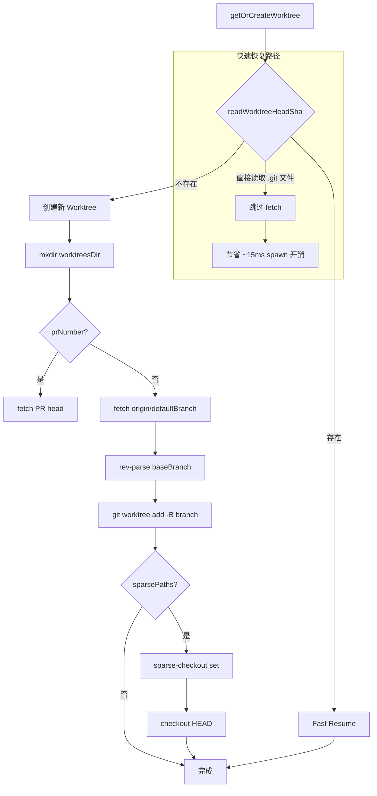
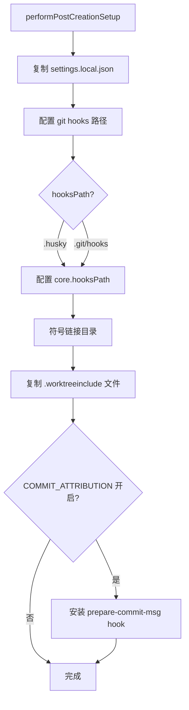
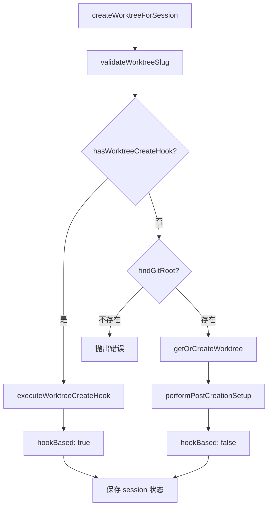
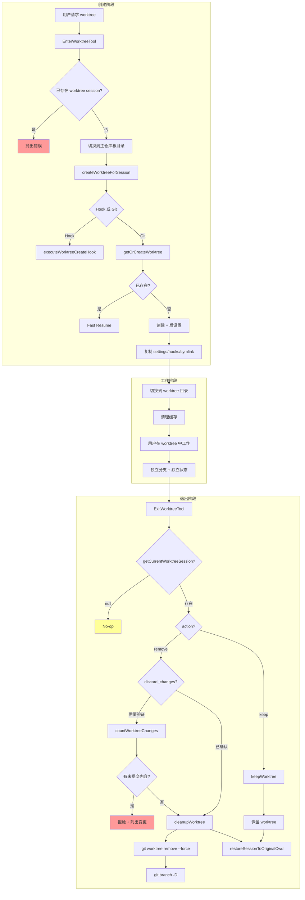

# 第十六章：Worktree 工具

## 16.1 引言

Worktree 工具是 Claude Code 提供的隔离工作环境机制。通过 Git Worktree 功能，Claude Code 实现了：

1. **隔离工作目录**：在同一仓库中创建独立的工作目录
2. **并行任务处理**：不同任务在独立分支上并行进行
3. **安全的实验环境**：工作可保留或丢弃，不影响主分支
4. **会话状态隔离**：缓存、系统提示和内存文件独立管理

本章深入分析 EnterWorktreeTool 和 ExitWorktreeTool 的实现机制，揭示 Claude Code 隔离工作流的设计哲学。

---

## 16.2 Git Worktree 基础

### 16.2.1 Git Worktree 机制

Git Worktree 是 Git 2.5+ 引入的功能，允许将同一仓库的不同分支检出到不同目录。其核心概念：

```
主仓库 (main branch)     Worktree (feature branch)
├── .git/                ├── .git (文件，指向主仓库)
├── src/                 ├── src/
├── package.json         ├── package.json
                         └── (独立的工作目录)
```

**Worktree 的优势**：

| 特性 | 说明 |
|------|------|
| 共享 .git 目录 | 多个工作目录共享同一 Git 历史，节省空间 |
| 独立分支 | 每个工作目录可 checkout 不同分支 |
| 无需 clone | 避免完整 clone 的磁盘开销和时间 |
| 快速切换 | 直接切换目录即可切换工作环境 |

### 16.2.2 Claude Code Worktree 架构

Claude Code 将 worktree 存放在 `.claude/worktrees/` 目录下：

```
repo/
├── .claude/
│   ├── worktrees/
│   │   ├── worktree-feature-a/    # 命名格式: worktree-{slug}
│   │   ├── worktree-fix-bug/
│   │   └── agent-a7f3d2e/         # Agent worktree (临时)
│   └── settings.local.json
├── .git/
└── src/
```

命名规则定义在 `src/utils/worktree.ts:48-87`：

```typescript
const VALID_WORKTREE_SLUG_SEGMENT = /^[a-zA-Z0-9._-]+$/
const MAX_WORKTREE_SLUG_LENGTH = 64

export function validateWorktreeSlug(slug: string): void {
  if (slug.length > MAX_WORKTREE_SLUG_LENGTH) {
    throw new Error(
      `Invalid worktree name: must be ${MAX_WORKTREE_SLUG_LENGTH} characters or fewer`
    )
  }
  // 防止路径遍历攻击
  for (const segment of slug.split('/')) {
    if (segment === '.' || segment === '..') {
      throw new Error(
        `Invalid worktree name "${slug}": must not contain "." or ".." path segments`
      )
    }
    if (!VALID_WORKTREE_SLUG_SEGMENT.test(segment)) {
      throw new Error(
        `Invalid worktree name "${slug}": each "/"-separated segment must contain only letters, digits, dots, underscores, and dashes`
      )
    }
  }
}
```

**安全性设计**：
- 限制长度防止过长路径
- 禁止 `.` 和 `..` 防止路径遍历
- 使用白名单正则防止注入

---

## 16.3 EnterWorktreeTool

### 16.3.1 工具定义

EnterWorktreeTool 定义在 `src/tools/EnterWorktreeTool/EnterWorktreeTool.ts:52-127`：

```typescript
export const EnterWorktreeTool: Tool<InputSchema, Output> = buildTool({
  name: ENTER_WORKTREE_TOOL_NAME,
  searchHint: 'create an isolated git worktree and switch into it',
  maxResultSizeChars: 100_000,
  async description() {
    return 'Creates an isolated worktree (via git or configured hooks) and switches the session into it'
  },
  shouldDefer: true,  // 延迟加载
  async call(input) {
    // 验证不在已存在的 worktree session 中
    if (getCurrentWorktreeSession()) {
      throw new Error('Already in a worktree session')
    }

    // 切换到主仓库根目录
    const mainRepoRoot = findCanonicalGitRoot(getCwd())
    if (mainRepoRoot && mainRepoRoot !== getCwd()) {
      process.chdir(mainRepoRoot)
      setCwd(mainRepoRoot)
    }

    // 创建 worktree
    const slug = input.name ?? getPlanSlug()
    const worktreeSession = await createWorktreeForSession(getSessionId(), slug)

    // 切换到 worktree 目录
    process.chdir(worktreeSession.worktreePath)
    setCwd(worktreeSession.worktreePath)
    setOriginalCwd(getCwd())
    saveWorktreeState(worktreeSession)
    
    // 清理缓存
    clearSystemPromptSections()
    clearMemoryFileCaches()
    getPlansDirectory.cache.clear?.()

    return { ... }
  },
})
```

### 16.3.2 输入 Schema

输入定义在 `src/tools/EnterWorktreeTool/EnterWorktreeTool.ts:23-39`：

```typescript
const inputSchema = lazySchema(() =>
  z.strictObject({
    name: z
      .string()
      .superRefine((s, ctx) => {
        try {
          validateWorktreeSlug(s)
        } catch (e) {
          ctx.addIssue({ code: 'custom', message: (e as Error).message })
        }
      })
      .optional()
      .describe(
        'Optional name for the worktree. Each "/"-separated segment may contain only letters, digits, dots, underscores, and dashes; max 64 chars total. A random name is generated if not provided.',
      ),
  }),
)
```

**参数说明**：

| 参数 | 类型 | 必填 | 说明 |
|------|------|------|------|
| `name` | string | 否 | Worktree 名称，未提供则自动生成 |

### 16.3.3 Prompt 设计

Prompt 定义在 `src/tools/EnterWorktreeTool/prompt.ts:1-30`：

```typescript
export function getEnterWorktreeToolPrompt(): string {
  return `Use this tool ONLY when the user explicitly asks to work in a worktree.

## When to Use
- The user explicitly says "worktree" (e.g., "start a worktree", "work in a worktree")

## When NOT to Use
- The user asks to create a branch, switch branches — use git commands instead
- The user asks to fix a bug or work on a feature — use normal git workflow unless they specifically mention worktrees

## Requirements
- Must be in a git repository, OR have WorktreeCreate/WorktreeRemove hooks configured
- Must not already be in a worktree

## Behavior
- In a git repository: creates a new git worktree inside .claude/worktrees/
- Outside a git repository: delegates to WorktreeCreate/WorktreeRemove hooks
- Use ExitWorktree to leave mid-session (keep or remove)
`
}
```

**关键设计点**：
- **显式触发**：仅在用户明确提到 "worktree" 时使用
- **Hook 扩展**：支持非 Git 环境通过 hooks 实现 VCS 隔离
- **明确边界**：区分普通分支操作和 worktree 操作

### 16.3.4 Worktree 创建流程

核心创建逻辑定义在 `src/utils/worktree.ts:235-375`：



**Fast Resume 优化**（行 247-255）：

```typescript
// 直接读取 .git 指针文件，避免 spawn git subprocess
const existingHead = await readWorktreeHeadSha(worktreePath)
if (existingHead) {
  return {
    worktreePath,
    worktreeBranch,
    headCommit: existingHead,
    existed: true,
  }
}
```

**Sparse Checkout 支持**（行 321-366）：

```typescript
const sparsePaths = getInitialSettings().worktree?.sparsePaths
const addArgs = ['worktree', 'add']
if (sparsePaths?.length) {
  addArgs.push('--no-checkout')
}
addArgs.push('-B', worktreeBranch, worktreePath, baseBranch)

// 配置 sparse-checkout
if (sparsePaths?.length) {
  await execFileNoThrowWithCwd(
    gitExe(),
    ['sparse-checkout', 'set', '--cone', '--', ...sparsePaths],
    { cwd: worktreePath },
  )
  await execFileNoThrowWithCwd(gitExe(), ['checkout', 'HEAD'], { cwd: worktreePath })
}
```

### 16.3.5 后创建设置

创建后的设置定义在 `src/utils/worktree.ts:510-624`：



**关键设置**：

1. **Settings 复制**（行 514-534）：
   ```typescript
   const sourceSettingsLocal = join(repoRoot, localSettingsRelativePath)
   const destSettingsLocal = join(worktreePath, localSettingsRelativePath)
   await copyFile(sourceSettingsLocal, destSettingsLocal)
   ```

2. **Hooks 路径配置**（行 536-578）：
   ```typescript
   // 配置 worktree 使用主仓库的 hooks
   // 解决 husky 等使用相对路径的 hooks 问题
   await execFileNoThrowWithCwd(
     gitExe(),
     ['config', 'core.hooksPath', hooksPath],
     { cwd: worktreePath },
   )
   ```

3. **目录符号链接**（行 102-138）：
   ```typescript
   async function symlinkDirectories(
     repoRootPath: string,
     worktreePath: string,
     dirsToSymlink: string[],
   ): Promise<void> {
     for (const dir of dirsToSymlink) {
       const sourcePath = join(repoRootPath, dir)
       const destPath = join(worktreePath, dir)
       await symlink(sourcePath, destPath, 'dir')
     }
   }
   ```
   **优化目的**：避免 node_modules 等大目录重复，节省磁盘空间

4. **.worktreeinclude 复制**（行 391-504）：
   ```typescript
   // 复制 gitignored 文件（如 .env、config/secrets/）
   // 使用 --directory 参数优化性能，避免遍历完整 gitignored 目录树
   const gitignored = await execFileNoThrowWithCwd(
     gitExe(),
     ['ls-files', '--others', '--ignored', '--exclude-standard', '--directory'],
     { cwd: repoRoot },
   )
   ```

---

## 16.4 ExitWorktreeTool

### 16.4.1 工具定义

ExitWorktreeTool 定义在 `src/tools/ExitWorktreeTool/ExitWorktreeTool.ts:148-329`：

```typescript
export const ExitWorktreeTool: Tool<InputSchema, Output> = buildTool({
  name: EXIT_WORKTREE_TOOL_NAME,
  searchHint: 'exit a worktree session and return to the original directory',
  shouldDefer: true,
  isDestructive(input) {
    return input.action === 'remove'  // 声明破坏性操作
  },
  async validateInput(input) {
    const session = getCurrentWorktreeSession()
    if (!session) {
      return {
        result: false,
        message: 'No-op: there is no active EnterWorktree session to exit.',
        errorCode: 1,
      }
    }
    // 安全检查：remove 时验证未提交内容
    if (input.action === 'remove' && !input.discard_changes) {
      const summary = await countWorktreeChanges(...)
      if (summary.changedFiles > 0 || summary.commits > 0) {
        return {
          result: false,
          message: `Worktree has ${summary.changedFiles} files and ${summary.commits} commits. Removing will discard this work.`,
          errorCode: 2,
        }
      }
    }
    return { result: true }
  },
  async call(input) {
    if (input.action === 'keep') {
      await keepWorktree()
      restoreSessionToOriginalCwd(...)
    } else {
      if (tmuxSessionName) await killTmuxSession(tmuxSessionName)
      await cleanupWorktree()
      restoreSessionToOriginalCwd(...)
    }
    return { ... }
  },
})
```

### 16.4.2 输入 Schema

输入定义在 `src/tools/ExitWorktreeTool/ExitWorktreeTool.ts:30-44`：

```typescript
const inputSchema = lazySchema(() =>
  z.strictObject({
    action: z
      .enum(['keep', 'remove'])
      .describe('"keep" leaves the worktree and branch on disk; "remove" deletes both.'),
    discard_changes: z
      .boolean()
      .optional()
      .describe('Required true when action is "remove" and worktree has uncommitted files.'),
  }),
)
```

**参数说明**：

| 参数 | 类型 | 必填 | 说明 |
|------|------|------|------|
| `action` | 'keep' \| 'remove' | 是 | 保留或删除 worktree |
| `discard_changes` | boolean | 条件必填 | 删除时确认丢弃未提交内容 |

### 16.4.3 安全验证机制

变更计数定义在 `src/tools/ExitWorktreeTool/ExitWorktreeTool.ts:79-113`：

```typescript
async function countWorktreeChanges(
  worktreePath: string,
  originalHeadCommit: string | undefined,
): Promise<ChangeSummary | null> {
  // 获取未提交文件数
  const status = await execFileNoThrow('git', [
    '-C', worktreePath, 'status', '--porcelain'
  ])
  const changedFiles = count(status.stdout.split('\n'), l => l.trim() !== '')

  // 获取新提交数（相对于原始 HEAD）
  if (!originalHeadCommit) return null  // 无法确定基准，fail-closed
  const revList = await execFileNoThrow('git', [
    '-C', worktreePath,
    'rev-list', '--count', `${originalHeadCommit}..HEAD`
  ])
  const commits = parseInt(revList.stdout.trim(), 10) || 0

  return { changedFiles, commits }
}
```

**安全设计原则**：
- **Fail-closed**：无法确定状态时拒绝操作（返回 null）
- **显式确认**：有未提交内容时必须设置 `discard_changes: true`
- **变更列出**：错误消息详细列出文件数和提交数

### 16.4.4 Prompt 设计

Prompt 定义在 `src/tools/ExitWorktreeTool/prompt.ts:1-32`：

```typescript
export function getExitWorktreeToolPrompt(): string {
  return `Exit a worktree session created by EnterWorktree.

## Scope
This tool ONLY operates on worktrees created by EnterWorktree in THIS session.
It will NOT touch:
- Worktrees created manually with `git worktree add`
- Worktrees from a previous session
- The directory you're in if EnterWorktree was never called

## When to Use
- The user explicitly asks to "exit the worktree", "leave the worktree", "go back"

## Parameters
- `action`: "keep" or "remove"
  - "keep" — leave worktree intact, useful for preserving work
  - "remove" — delete worktree directory and branch, clean exit
- `discard_changes`: Required for "remove" when uncommitted files exist
`
}
```

**Scope Guard 设计**（行 174-188）：
- 仅操作当前 session 创建的 worktree
- 不影响手动创建或历史 session 的 worktree
- 防止意外删除用户重要工作

### 16.4.5 Session 状态恢复

恢复逻辑定义在 `src/tools/ExitWorktreeTool/ExitWorktreeTool.ts:122-146`：

```typescript
function restoreSessionToOriginalCwd(
  originalCwd: string,
  projectRootIsWorktree: boolean,
): void {
  setCwd(originalCwd)
  setOriginalCwd(originalCwd)
  // 仅在 --worktree 启动时恢复 projectRoot
  if (projectRootIsWorktree) {
    setProjectRoot(originalCwd)
    updateHooksConfigSnapshot()  // 重新读取 hooks 配置
  }
  saveWorktreeState(null)
  clearSystemPromptSections()
  clearMemoryFileCaches()
  getPlansDirectory.cache.clear?.()
}
```

**缓存清理必要性**：
- 系统提示中的 `env_info_simple` 包含 CWD 信息
- CLAUDE.md 和 memory 文件按目录加载
- plans 目录路径依赖 CWD

---

## 16.5 WorktreeSession 状态管理

### 16.5.1 Session 类型定义

WorktreeSession 定义在 `src/utils/worktree.ts:140-154`：

```typescript
export type WorktreeSession = {
  originalCwd: string         // 原始工作目录
  worktreePath: string        // Worktree 路径
  worktreeName: string        // Worktree 名称 (slug)
  worktreeBranch?: string     // 分支名 (git-based)
  originalBranch?: string     // 原始分支名
  originalHeadCommit?: string // 创建时的 HEAD commit
  sessionId: string           // 会话 ID
  tmuxSessionName?: string    // Tmux session 名
  hookBased?: boolean         // 是否 hook-based
  creationDurationMs?: number // 创建耗时
  usedSparsePaths?: boolean   // 是否使用 sparse-checkout
}
```

### 16.5.2 Session 存储

全局 session 状态定义在 `src/utils/worktree.ts:156-169`：

```typescript
let currentWorktreeSession: WorktreeSession | null = null

export function getCurrentWorktreeSession(): WorktreeSession | null {
  return currentWorktreeSession
}

export function restoreWorktreeSession(session: WorktreeSession | null): void {
  currentWorktreeSession = session
}
```

**持久化**：通过 `saveCurrentProjectConfig` 保存到项目配置，支持 session 恢复。

---

## 16.6 Hook 扩展机制

### 16.6.1 Worktree Hooks

对于非 Git 环境，Claude Code 支持通过 hooks 实现 VCS 隔离：

```typescript
// src/utils/hooks.ts:4910-4952
export function hasWorktreeCreateHook(): boolean {
  const snapshotHooks = getHooksConfigFromSnapshot()?.['WorktreeCreate']
  const registeredHooks = getRegisteredHooks()?.['WorktreeCreate']
  return Boolean(snapshotHooks?.length || registeredHooks?.length)
}

export async function executeWorktreeCreateHook(slug: string) {
  const result = await executeHooks({
    hook_event_name: 'WorktreeCreate',
    slug,
  }, ...)
  return {
    worktreePath: result.hookSpecificOutput?.worktreePath,
  }
}
```

**Hook Schema**（`src/types/hooks.ts:160-163`）：

```typescript
z.object({
  hookEventName: z.literal('WorktreeCreate'),
  worktreePath: z.string(),  // Hook 必须返回 worktree 路径
})
```

### 16.6.2 创建流程分支

定义在 `src/utils/worktree.ts:702-778`：



---

## 16.7 Worktree 生命周期

### 16.7.1 完整生命周期流程



**图 16-1：Worktree 完整生命周期流程图**

### 16.7.2 Agent Worktree

除用户手动触发外，Agent 和 Workflow 也使用 worktree：

定义在 `src/utils/worktree.ts:902-952`：

```typescript
export async function createAgentWorktree(slug: string): Promise<{
  worktreePath: string
  worktreeBranch?: string
  headCommit?: string
}> {
  validateWorktreeSlug(slug)

  // 使用 findCanonicalGitRoot 确保总是在主仓库创建
  const gitRoot = findCanonicalGitRoot(getCwd())
  
  const { worktreePath, worktreeBranch, headCommit, existed } =
    await getOrCreateWorktree(gitRoot, slug)

  if (!existed) {
    await performPostCreationSetup(gitRoot, worktreePath)
  } else {
    // 更新 mtime 防止被清理
    await utimes(worktreePath, now, now)
  }

  return { worktreePath, worktreeBranch, headCommit, gitRoot }
}
```

**Ephemeral Worktree Patterns**（行 1030-1041）：

```typescript
const EPHEMERAL_WORKTREE_PATTERNS = [
  /^agent-a[0-9a-f]{7}$/,           // Agent tool
  /^wf_[0-9a-f]{8}-[0-9a-f]{3}-\d+$/,  // Workflow tool
  /^wf-\d+$/,                       // Legacy workflow
  /^bridge-[A-Za-z0-9_]+/,          // Bridge
  /^job-[a-zA-Z0-9._-]{1,55}-[0-9a-f]{8}$/,  // Template job
]
```

这些临时 worktree 会在进程异常退出时泄漏，通过定期清理机制处理。

---

## 16.8 UI 渲染

### 16.8.1 EnterWorktree UI

定义在 `src/tools/EnterWorktreeTool/UI.tsx:7-19`：

```typescript
export function renderToolUseMessage(): React.ReactNode {
  return 'Creating worktree…'
}

export function renderToolResultMessage(output: Output, ...): React.ReactNode {
  return (
    <Box flexDirection="column">
      <Text>
        Switched to worktree on branch <Text bold>{output.worktreeBranch}</Text>
      </Text>
      <Text dimColor>{output.worktreePath}</Text>
    </Box>
  )
}
```

### 16.8.2 ExitWorktree UI

定义在 `src/tools/ExitWorktreeTool/UI.tsx:7-24`：

```typescript
export function renderToolUseMessage(): React.ReactNode {
  return 'Exiting worktree…'
}

export function renderToolResultMessage(output: Output, ...): React.ReactNode {
  const actionLabel = output.action === 'keep' ? 'Kept worktree' : 'Removed worktree'
  return (
    <Box flexDirection="column">
      <Text>
        {actionLabel}
        {output.worktreeBranch ? (
          <> (branch <Text bold>{output.worktreeBranch}</Text>)</>
        ) : null}
      </Text>
      <Text dimColor>Returned to {output.originalCwd}</Text>
    </Box>
  )
}
```

---

## 16.9 使用场景与最佳实践

### 16.9.1 适用场景

| 场景 | 说明 |
|------|------|
| 并行开发 | 同时在多个分支上开发不同功能 |
| 安全实验 | 尝试可能失败的大型重构，不影响主分支 |
| PR 预览 | Checkout PR 到独立目录进行测试 |
| Agent 任务 | 子 Agent 在隔离环境中执行任务 |

### 16.9.2 不适用场景

| 场景 | 建议 |
|------|------|
| 简单分支切换 | 使用 `git checkout` 或 `git switch` |
| 小型修改 | 直接在当前分支工作 |
| 快速 hotfix | 使用 stash 或直接修改 |

### 16.9.3 最佳实践

1. **命名规范**：使用描述性名称，如 `feature-auth`、`fix-login-bug`
2. **及时清理**：任务完成后及时 `remove`，避免积累过多 worktree
3. **Sparse Checkout**：大型仓库使用 `worktree.sparsePaths` 优化
4. **Symlink 配置**：设置 `worktree.symlinkDirectories` 共享 node_modules

---

## 16.10 小结

本章分析了 Claude Code Worktree 工具的设计与实现：

1. **隔离机制**：基于 Git Worktree 实现工作目录隔离
2. **安全性设计**：路径验证、变更保护、scope guard
3. **性能优化**：Fast Resume、Sparse Checkout、目录符号链接
4. **扩展性**：Hook 机制支持非 Git VCS
5. **状态管理**：Session 状态独立、缓存清理

Worktree 工具是 Claude Code 多任务并行和隔离实验的核心支撑，与 AgentTool、WorkflowTool 配合使用，构建了完整的隔离工作流体系。