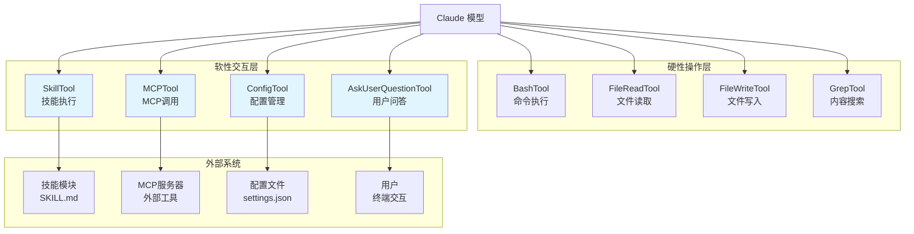

# 第十七章：其他工具精选

## 17.1 引言

本章深入分析 Claude Code 中几个重要的辅助工具，它们虽不处理文件或命令执行，但在系统交互、配置管理和用户沟通方面发挥关键作用：

1. **SkillTool**：技能执行工具，负责调用 `/slash` 命令和技能模块
2. **MCPTool**：MCP 调用工具，连接外部 MCP 服务器的桥梁
3. **ConfigTool**：配置管理工具，动态修改 Claude Code 设置
4. **AskUserQuestionTool**：用户问答工具，实现多选项交互

这些工具共同构成了 Claude Code 的"软性交互层"，区别于文件操作、代码执行等"硬性操作层"。

---



**图 17-1：工具分层架构图**

---

## 17.2 SkillTool 技能执行

### 17.2.1 工具定义

SkillTool 是 Claude Code 中用于调用技能（Skills）的核心工具。定义在 `src/tools/SkillTool/SkillTool.ts`：

```typescript
export const SkillTool: Tool<InputSchema, Output, Progress> = buildTool({
  name: SKILL_TOOL_NAME,
  searchHint: 'invoke a slash-command skill',
  maxResultSizeChars: 100_000,
  // ...
})
```

**输入 Schema**：

```typescript
export const inputSchema = lazySchema(() =>
  z.object({
    skill: z
      .string()
      .describe('The skill name. E.g., "commit", "review-pr", or "pdf"'),
    args: z.string().optional().describe('Optional arguments for the skill'),
  }),
)
```

**输出 Schema** 支持两种模式：

| 模式 | 字段 | 说明 |
|------|------|------|
| inline | `success`, `commandName`, `allowedTools`, `model`, `status: 'inline'` | 内联执行，返回技能元数据 |
| forked | `success`, `commandName`, `status: 'forked'`, `agentId`, `result` | Fork 执行，返回子 Agent 结果 |

### 17.2.2 技能发现与验证

SkillTool 通过 `getAllCommands()` 函数获取所有可用技能：

```typescript
async function getAllCommands(context: ToolUseContext): Promise<Command[]> {
  // Only include MCP skills (loadedFrom === 'mcp'), not plain MCP prompts.
  const mcpSkills = context
    .getAppState()
    .mcp.commands.filter(
      cmd => cmd.type === 'prompt' && cmd.loadedFrom === 'mcp',
    )
  if (mcpSkills.length === 0) return getCommands(getProjectRoot())
  const localCommands = await getCommands(getProjectRoot())
  return uniqBy([...localCommands, ...mcpSkills], 'name')
}
```

**技能来源**：

| 来源 | 说明 | 存储位置 |
|------|------|----------|
| bundled | 内置技能，随 Claude Code 发布 | `src/skills/bundled/` |
| local | 项目级技能 | `.claude/skills/` 或 `skills/` |
| plugin | 插件提供的技能 | 插件仓库 |
| mcp | MCP 服务器提供的技能 | MCP 配置 |

**输入验证** 包含多级检查：

```typescript
async validateInput({ skill }, context): Promise<ValidationResult> {
  // 1. 格式检查：非空字符串
  const trimmed = skill.trim()
  if (!trimmed) {
    return { result: false, message: `Invalid skill format: ${skill}`, errorCode: 1 }
  }
  
  // 2. 规范化：移除前导斜杠
  const normalizedCommandName = trimmed.startsWith('/') 
    ? trimmed.substring(1) : trimmed
  
  // 3. 命令存在检查
  const commands = await getAllCommands(context)
  const foundCommand = findCommand(normalizedCommandName, commands)
  if (!foundCommand) {
    return { result: false, message: `Unknown skill: ${normalizedCommandName}`, errorCode: 2 }
  }
  
  // 4. 类型检查：必须是 prompt 类型
  if (foundCommand.type !== 'prompt') {
    return { result: false, message: `Skill ${normalizedCommandName} is not a prompt-based skill`, errorCode: 5 }
  }
  
  return { result: true }
}
```

### 17.2.3 权限控制机制

SkillTool 实现了细粒度的权限控制，采用三层策略：

**第一层：拒绝规则检查**

```typescript
const denyRules = getRuleByContentsForTool(permissionContext, SkillTool as Tool, 'deny')
for (const [ruleContent, rule] of denyRules.entries()) {
  if (ruleMatches(ruleContent)) {
    return {
      behavior: 'deny',
      message: `Skill execution blocked by permission rules`,
      decisionReason: { type: 'rule', rule },
    }
  }
}
```

**第二层：允许规则检查**

```typescript
const allowRules = getRuleByContentsForTool(permissionContext, SkillTool as Tool, 'allow')
for (const [ruleContent, rule] of allowRules.entries()) {
  if (ruleMatches(ruleContent)) {
    return {
      behavior: 'allow',
      updatedInput: { skill, args },
      decisionReason: { type: 'rule', rule },
    }
  }
}
```

**第三层：安全属性白名单**

定义在 `src/tools/SkillTool/SkillTool.ts`：

```typescript
const SAFE_SKILL_PROPERTIES = new Set([
  'type', 'progressMessage', 'contentLength', 'argNames', 'model', 'effort',
  'source', 'pluginInfo', 'disableNonInteractive', 'skillRoot', 'context',
  'agent', 'getPromptForCommand', 'frontmatterKeys',
  // CommandBase properties
  'name', 'description', 'hasUserSpecifiedDescription', 'isEnabled', 'isHidden',
  'aliases', 'isMcp', 'argumentHint', 'whenToUse', 'paths', 'version',
  'disableModelInvocation', 'userInvocable', 'loadedFrom', 'immediate',
  'userFacingName',
])
```

如果技能只包含安全属性，则自动允许执行。这确保新添加的技能属性默认需要权限，直到明确审核后加入白名单。

### 17.2.4 执行模式

SkillTool 支持两种执行模式：

**Inline 模式**

技能内容直接注入当前对话：

```typescript
const processedCommand = await processPromptSlashCommand(
  commandName,
  args || '',
  commands,
  context,
)

// 返回技能元数据和新消息
return {
  data: {
    success: true,
    commandName,
    allowedTools: allowedTools.length > 0 ? allowedTools : undefined,
    model,
  },
  newMessages: tagMessagesWithToolUseID(
    processedCommand.messages.filter(/* ... */),
    toolUseID,
  ),
  contextModifier(ctx) {
    // 修改工具权限上下文，允许技能指定的工具
    if (allowedTools.length > 0) {
      modifiedContext = {
        ...modifiedContext,
        getAppState() {
          const appState = previousGetAppState()
          return {
            ...appState,
            toolPermissionContext: {
              ...appState.toolPermissionContext,
              alwaysAllowRules: {
                ...appState.toolPermissionContext.alwaysAllowRules,
                command: [...new Set([
                  ...(appState.toolPermissionContext.alwaysAllowRules.command || []),
                  ...allowedTools,
                ])],
              },
            },
          }
        },
      }
    }
    return modifiedContext
  },
}
```

**Forked 模式**

技能在独立子 Agent 中执行：

```typescript
async function executeForkedSkill(
  command: Command & { type: 'prompt' },
  commandName: string,
  args: string | undefined,
  context: ToolUseContext,
  canUseTool: CanUseToolFn,
  parentMessage: AssistantMessage,
  onProgress?: ToolCallProgress<Progress>,
): Promise<ToolResult<Output>> {
  const agentId = createAgentId()
  
  // 准备 Forked Agent 上下文
  const { modifiedGetAppState, baseAgent, promptMessages, skillContent } =
    await prepareForkedCommandContext(command, args || '', context)
  
  // 运行子 Agent
  for await (const message of runAgent({
    agentDefinition,
    promptMessages,
    toolUseContext: { ...context, getAppState: modifiedGetAppState },
    canUseTool,
    isAsync: false,
    querySource: 'agent:custom',
    model: command.model as ModelAlias | undefined,
    override: { agentId },
  })) {
    agentMessages.push(message)
    // 报告进度
  }
  
  return {
    data: {
      success: true,
      commandName,
      status: 'forked',
      agentId,
      result: extractResultText(agentMessages, 'Skill execution completed'),
    },
  }
}
```

### 17.2.5 Prompt 生成

SkillTool 的 Prompt 动态生成技能列表，定义在 `src/tools/SkillTool/prompt.ts`：

```typescript
export const getPrompt = memoize(async (_cwd: string): Promise<string> => {
  return `Execute a skill within the main conversation

When users ask you to perform tasks, check if any of the available skills match. Skills provide specialized capabilities and domain knowledge.

When users reference a "slash command" or "/<something>" (e.g., "/commit", "/review-pr"), they are referring to a skill. Use this tool to invoke it.

How to invoke:
- Use this tool with the skill name and optional arguments
- Examples:
  - \`skill: "pdf"\` - invoke the pdf skill
  - \`skill: "commit", args: "-m 'Fix bug'"\` - invoke with arguments
  - \`skill: "review-pr", args: "123"\` - invoke with arguments
  - \`skill: "ms-office-suite:pdf"\` - invoke using fully qualified name

Important:
- Available skills are listed in system-reminder messages in the conversation
- When a skill matches the user's request, this is a BLOCKING REQUIREMENT: invoke the relevant Skill tool BEFORE generating any other response
- NEVER mention a skill without actually calling this tool
- Do not invoke a skill that is already running
- Do not use this tool for built-in CLI commands (like /help, /clear, etc.)
`
})
```

技能列表通过 `formatCommandsWithinBudget()` 函数生成，受字符预算限制（1%上下文窗口）：

```typescript
export const SKILL_BUDGET_CONTEXT_PERCENT = 0.01
export const CHARS_PER_TOKEN = 4
export const DEFAULT_CHAR_BUDGET = 8_000 // Fallback: 1% of 200k × 4
```

---

## 17.3 MCPTool MCP 调用

### 17.3.1 工具定义

MCPTool 是 Claude Code 与 MCP（Model Context Protocol）服务器交互的桥梁。定义在 `src/tools/MCPTool/MCPTool.ts`：

```typescript
export const MCPTool = buildTool({
  isMcp: true,
  name: 'mcp',
  maxResultSizeChars: 100_000,
  // 实际的名称、描述和 Prompt 在 mcpClient.ts 中动态覆盖
  async description() {
    return DESCRIPTION
  },
  async prompt() {
    return PROMPT
  },
  // 输入 Schema 允许任意对象（MCP 工具自定义 Schema）
  get inputSchema(): InputSchema {
    return inputSchema()
  },
  async call() {
    return { data: '' }  // 实际调用在 mcpClient.ts 中实现
  },
  async checkPermissions(): Promise<PermissionResult> {
    return {
      behavior: 'passthrough',
      message: 'MCPTool requires permission.',
    }
  },
})
```

**关键特性**：

| 特性 | 说明 |
|------|------|
| `isMcp: true` | 标记为 MCP 工具，区别于内置工具 |
| `passthrough` Schema | 允许任意输入对象，实际 Schema 由 MCP 服务器定义 |
| 动态覆盖 | 名称、描述、Prompt 在 `mcpClient.ts` 中根据具体 MCP 工具覆盖 |

### 17.3.2 Schema 设计

MCPTool 使用 `passthrough()` Schema：

```typescript
export const inputSchema = lazySchema(() => z.object({}).passthrough())
```

`passthrough()` 允许对象包含任意额外字段，这使 MCPTool 能够适配不同 MCP 服务器定义的各种工具 Schema。

### 17.3.3 权限与渲染

MCPTool 的权限检查返回 `passthrough` 行为，表示需要进一步权限确认：

```typescript
async checkPermissions(): Promise<PermissionResult> {
  return {
    behavior: 'passthrough',
    message: 'MCPTool requires permission.',
  }
}
```

**渲染方法**（UI.tsx）：

- `renderToolUseMessage()`：渲染工具调用消息
- `renderToolUseProgressMessage()`：渲染进度消息
- `renderToolResultMessage()`：渲染结果消息

这些渲染函数由 MCP 工具的具体实现动态调用。

### 17.3.4 与 MCP 客户端集成

MCPTool 的实际调用逻辑在 `src/services/mcp/client.ts` 中实现。当 MCP 服务器注册工具时：

1. MCP 客户端读取工具定义（名称、描述、输入 Schema）
2. 动态创建 MCPTool 实例，覆盖默认属性
3. 注册到工具集合中，供 Claude 调用

调用流程：

```
Claude 调用 MCPTool
    ↓
mcpClient.ts 接收调用
    ↓
通过 MCP 协议发送请求到 MCP 服务器
    ↓
MCP 服务器执行工具
    ↓
返回结果给 Claude
```

---

## 17.4 ConfigTool 配置管理

### 17.4.1 工具定义

ConfigTool 提供动态配置管理能力。定义在 `src/tools/ConfigTool/ConfigTool.ts`：

```typescript
export const ConfigTool = buildTool({
  name: CONFIG_TOOL_NAME,
  searchHint: 'get or set Claude Code settings (theme, model)',
  maxResultSizeChars: 100_000,
  shouldDefer: true,
  isConcurrencySafe() {
    return true
  },
  isReadOnly(input: Input) {
    return input.value === undefined
  },
  // ...
})
```

**关键属性**：

| 属性 | 说明 |
|------|------|
| `shouldDefer: true` | 延迟加载，避免启动时阻塞 |
| `isConcurrencySafe: true` | 配置操作可安全并发执行 |
| `isReadOnly()` | 当 `value` 未定义时为只读操作 |

### 17.4.2 输入输出 Schema

**输入 Schema**：

```typescript
const inputSchema = lazySchema(() =>
  z.strictObject({
    setting: z
      .string()
      .describe('The setting key (e.g., "theme", "model", "permissions.defaultMode")'),
    value: z
      .union([z.string(), z.boolean(), z.number()])
      .optional()
      .describe('The new value. Omit to get current value.'),
  }),
)
```

**输出 Schema**：

```typescript
const outputSchema = lazySchema(() =>
  z.object({
    success: z.boolean(),
    operation: z.enum(['get', 'set']).optional(),
    setting: z.string().optional(),
    value: z.unknown().optional(),
    previousValue: z.unknown().optional(),
    newValue: z.unknown().optional(),
    error: z.string().optional(),
  }),
)
```

### 17.4.3 支持的设置项

定义在 `src/tools/ConfigTool/supportedSettings.ts`：

**全局设置**（存储在 `~/.claude.json`）：

| 设置项 | 类型 | 说明 |
|--------|------|------|
| `theme` | string | UI 颜色主题 |
| `editorMode` | string | 键绑定模式（vim/default） |
| `verbose` | boolean | 详细调试输出 |
| `preferredNotifChannel` | string | 通知渠道 |
| `autoCompactEnabled` | boolean | 自动压缩上下文 |
| `fileCheckpointingEnabled` | boolean | 文件检查点 |
| `showTurnDuration` | boolean | 显示响应耗时 |
| `todoFeatureEnabled` | boolean | Todo 功能开关 |

**项目设置**（存储在 `settings.json`）：

| 设置项 | 类型 | 说明 |
|--------|------|------|
| `model` | string | 模型覆盖 |
| `autoMemoryEnabled` | boolean | 自动记忆 |
| `autoDreamEnabled` | boolean | 后台记忆整合 |
| `alwaysThinkingEnabled` | boolean | 扩展思考 |
| `permissions.defaultMode` | string | 默认权限模式 |
| `language` | string | 响应语言 |

### 17.4.4 执行逻辑

ConfigTool 的 `call()` 方法实现 GET/SET 操作：

**GET 操作**：

```typescript
if (value === undefined) {
  const currentValue = getValue(config.source, path)
  const displayValue = config.formatOnRead
    ? config.formatOnRead(currentValue)
    : currentValue
  return {
    data: { success: true, operation: 'get', setting, value: displayValue },
  }
}
```

**SET 操作**流程：

```typescript
// 1. 类型强制转换（布尔值）
if (config.type === 'boolean') {
  if (typeof value === 'string') {
    const lower = value.toLowerCase().trim()
    if (lower === 'true') finalValue = true
    else if (lower === 'false') finalValue = false
  }
}

// 2. 选项验证
const options = getOptionsForSetting(setting)
if (options && !options.includes(String(finalValue))) {
  return {
    data: {
      success: false,
      operation: 'set',
      setting,
      error: `Invalid value "${value}". Options: ${options.join(', ')}`,
    },
  }
}

// 3. 异步验证（如模型 API 检查）
if (config.validateOnWrite) {
  const result = await config.validateOnWrite(finalValue)
  if (!result.valid) {
    return { data: { success: false, operation: 'set', setting, error: result.error } }
  }
}

// 4. 写入存储
if (config.source === 'global') {
  saveGlobalConfig(prev => ({ ...prev, [key]: finalValue }))
} else {
  updateSettingsForSource('userSettings', buildNestedObject(path, finalValue))
}

// 5. 同步 AppState（立即 UI 效果）
if (config.appStateKey) {
  context.setAppState(prev => ({ ...prev, [appKey]: finalValue }))
}
```

### 17.4.5 权限控制

ConfigTool 的权限检查：

```typescript
async checkPermissions(input: Input) {
  // 自动允许读取配置
  if (input.value === undefined) {
    return { behavior: 'allow' as const, updatedInput: input }
  }
  // 写入需要确认
  return {
    behavior: 'ask' as const,
    message: `Set ${input.setting} to ${jsonStringify(input.value)}`,
  }
}
```

读取操作自动允许，写入操作需要用户确认。

### 17.4.6 Prompt 生成

Prompt 从设置注册表动态生成（`src/tools/ConfigTool/prompt.ts`）：

```typescript
export function generatePrompt(): string {
  const globalSettings: string[] = []
  const projectSettings: string[] = []

  for (const [key, config] of Object.entries(SUPPORTED_SETTINGS)) {
    if (key === 'model') continue  // 模型单独处理
    
    const options = getOptionsForSetting(key)
    let line = `- ${key}`
    
    if (options) {
      line += `: ${options.map(o => `"${o}"`).join(', ')}`
    } else if (config.type === 'boolean') {
      line += `: true/false`
    }
    
    line += ` - ${config.description}`
    
    if (config.source === 'global') {
      globalSettings.push(line)
    } else {
      projectSettings.push(line)
    }
  }

  return `Get or set Claude Code configuration settings.
  
  View or change Claude Code settings. Use when the user requests configuration changes, asks about current settings, or when adjusting a setting would benefit them.

## Usage
- **Get current value:** Omit the "value" parameter
- **Set new value:** Include the "value" parameter

## Configurable settings list
### Global Settings (stored in ~/.claude.json)
${globalSettings.join('\n')}

### Project Settings (stored in settings.json)
${projectSettings.join('\n')}

## Examples
- Get theme: { "setting": "theme" }
- Set dark theme: { "setting": "theme", "value": "dark" }
- Enable vim mode: { "setting": "editorMode", "value": "vim" }
`
}
```

---

## 17.5 AskUserQuestionTool 用户问答

### 17.5.1 工具定义

AskUserQuestionTool 实现多选项用户问答交互。定义在 `src/tools/AskUserQuestionTool/AskUserQuestionTool.tsx`：

```typescript
export const AskUserQuestionTool: Tool<InputSchema, Output> = buildTool({
  name: ASK_USER_QUESTION_TOOL_NAME,
  searchHint: 'prompt the user with a multiple-choice question',
  maxResultSizeChars: 100_000,
  shouldDefer: true,
  isEnabled() {
    // 当 --channels 激活时禁用（用户可能不在终端）
    if ((feature('KAIROS') || feature('KAIROS_CHANNELS')) && getAllowedChannels().length > 0) {
      return false
    }
    return true
  },
  isConcurrencySafe() {
    return true
  },
  isReadOnly() {
    return true
  },
  requiresUserInteraction() {
    return true
  },
  // ...
})
```

**关键属性**：

| 属性 | 说明 |
|------|------|
| `shouldDefer: true` | 延迟加载 |
| `isEnabled()` | 在 Channels 模式下禁用 |
| `isReadOnly: true` | 只读操作，不修改状态 |
| `requiresUserInteraction: true` | 需要用户交互，不能自动执行 |

### 17.5.2 输入 Schema 设计

AskUserQuestionTool 的 Schema 设计精细：

**问题选项 Schema**：

```typescript
const questionOptionSchema = lazySchema(() => z.object({
  label: z.string().describe('The display text for this option (1-5 words)'),
  description: z.string().describe('Explanation of what this option means'),
  preview: z.string().optional().describe('Optional preview content (mockups, code snippets)'),
}))
```

**问题 Schema**：

```typescript
const questionSchema = lazySchema(() => z.object({
  question: z.string().describe('The complete question to ask the user'),
  header: z.string().describe('Very short label displayed as a chip (max 12 chars)'),
  options: z.array(questionOptionSchema()).min(2).max(4).describe('2-4 options'),
  multiSelect: z.boolean().default(false).describe('Allow multiple selections'),
}))
```

**唯一性验证**：

```typescript
const UNIQUENESS_REFINE = {
  check: (data: { questions: { question: string; options: { label: string }[] }[] }) => {
    // 问题文本必须唯一
    const questions = data.questions.map(q => q.question)
    if (questions.length !== new Set(questions).size) {
      return false
    }
    // 每个问题内选项标签必须唯一
    for (const question of data.questions) {
      const labels = question.options.map(opt => opt.label)
      if (labels.length !== new Set(labels).size) {
        return false
      }
    }
    return true
  },
  message: 'Question texts must be unique, option labels must be unique within each question'
}
```

### 17.5.3 Preview 功能

AskUserQuestionTool 支持 Preview 功能，用于展示可视化内容：

定义在 `src/tools/AskUserQuestionTool/prompt.ts`：

```typescript
export const PREVIEW_FEATURE_PROMPT = {
  markdown: `
Preview feature:
Use the optional \`preview\` field on options when presenting concrete artifacts:
- ASCII mockups of UI layouts or components
- Code snippets showing different implementations
- Diagram variations
- Configuration examples

Preview content is rendered as markdown in a monospace box.
`,
  html: `
Preview feature:
Preview content must be a self-contained HTML fragment (no <html>/<body> wrapper, no <script> or <style> tags — use inline style attributes instead).
`,
}
```

**HTML 验证**：

```typescript
function validateHtmlPreview(preview: string | undefined): string | null {
  if (preview === undefined) return null
  
  // 禁止完整 HTML 文档
  if (/<\s*(html|body|!doctype)\b/i.test(preview)) {
    return 'preview must be an HTML fragment, not a full document'
  }
  
  // 禁止 script/style 标签（安全考虑）
  if (/<\s*(script|style)\b/i.test(preview)) {
    return 'preview must not contain <script> or <style> tags'
  }
  
  // 必须包含 HTML 标签
  if (!/<[a-z][^>]*>/i.test(preview)) {
    return 'preview must contain HTML'
  }
  
  return null
}
```

### 17.5.4 执行逻辑

AskUserQuestionTool 的执行流程简单：

```typescript
async call({ questions, answers = {}, annotations }, _context) {
  return {
    data: {
      questions,
      answers,
      ...(annotations && { annotations }),
    },
  }
}
```

实际的用户交互在权限组件中完成：

- Claude 发出工具调用请求
- 权限系统拦截，显示多选项对话框
- 用户选择后，答案回填到 `answers` 字段
- 工具返回包含答案的结果

### 17.5.5 结果格式化

`mapToolResultToToolResultBlockParam()` 格式化返回：

```typescript
mapToolResultToToolResultBlockParam({ answers, annotations }, toolUseID) {
  const answersText = Object.entries(answers).map(([questionText, answer]) => {
    const annotation = annotations?.[questionText]
    const parts = [`"${questionText}"="${answer}"`]
    
    if (annotation?.preview) {
      parts.push(`selected preview:\n${annotation.preview}`)
    }
    if (annotation?.notes) {
      parts.push(`user notes: ${annotation.notes}`)
    }
    
    return parts.join(' ')
  }).join(', ')
  
  return {
    type: 'tool_result',
    content: `User has answered your questions: ${answersText}. You can now continue.`,
    tool_use_id: toolUseID,
  }
}
```

### 17.5.6 Prompt 定义

Prompt 定义在 `src/tools/AskUserQuestionTool/prompt.ts`：

```typescript
export const ASK_USER_QUESTION_TOOL_PROMPT = `Use this tool when you need to ask the user questions during execution. This allows you to:
1. Gather user preferences or requirements
2. Clarify ambiguous instructions
3. Get decisions on implementation choices as you work
4. Offer choices to the user about what direction to take.

Usage notes:
- Users will always be able to select "Other" to provide custom text input
- Use multiSelect: true to allow multiple answers to be selected for a question
- If you recommend a specific option, make that the first option and add "(Recommended)"

Plan mode note: In plan mode, use this tool to clarify requirements BEFORE finalizing your plan. Do NOT use this tool to ask "Is my plan ready?" - use ExitPlanModeTool for plan approval.
`
```

---

## 17.6 工具协调与限制

### 17.6.1 Agent 工具可用性

定义在 `src/constants/tools.ts`：

**所有 Agent 禁用的工具**：

```typescript
export const ALL_AGENT_DISALLOWED_TOOLS = new Set([
  TASK_OUTPUT_TOOL_NAME,
  EXIT_PLAN_MODE_V2_TOOL_NAME,
  ENTER_PLAN_MODE_TOOL_NAME,
  AGENT_TOOL_NAME,  // 防止递归（ant 用户除外）
  ASK_USER_QUESTION_TOOL_NAME,
  TASK_STOP_TOOL_NAME,
])
```

**异步 Agent 允许的工具**：

```typescript
export const ASYNC_AGENT_ALLOWED_TOOLS = new Set([
  FILE_READ_TOOL_NAME,
  WEB_SEARCH_TOOL_NAME,
  TODO_WRITE_TOOL_NAME,
  GREP_TOOL_NAME,
  WEB_FETCH_TOOL_NAME,
  GLOB_TOOL_NAME,
  ...SHELL_TOOL_NAMES,
  FILE_EDIT_TOOL_NAME,
  FILE_WRITE_TOOL_NAME,
  NOTEBOOK_EDIT_TOOL_NAME,
  SKILL_TOOL_NAME,  // SkillTool 允许异步 Agent 使用
  SYNTHETIC_OUTPUT_TOOL_NAME,
  TOOL_SEARCH_TOOL_NAME,
  ENTER_WORKTREE_TOOL_NAME,
  EXIT_WORKTREE_TOOL_NAME,
])
```

### 17.6.2 设计原则总结

| 工具 | 核心职责 | 执行模式 | 权限策略 |
|------|----------|----------|----------|
| SkillTool | 技能调用 | Inline/Fork | 三层规则检查 |
| MCPTool | MCP 交互 | 远程调用 | Passthrough |
| ConfigTool | 配置管理 | GET/SET | 读允许，写确认 |
| AskUserQuestionTool | 用户问答 | 权限组件交互 | Ask |

**设计共性**：

1. **延迟加载**：所有工具使用 `shouldDefer: true`
2. **Schema 惰性**：使用 `lazySchema()` 避免启动时加载
3. **结果限制**：统一使用 `maxResultSizeChars: 100_000`
4. **UI 渲染**：每个工具自定义渲染函数

---

## 17.7 小结

本章分析了 Claude Code 的四个重要辅助工具：

1. **SkillTool** 作为技能系统的入口，实现了技能发现、权限控制和两种执行模式。其三层权限策略（拒绝规则、允许规则、安全属性白名单）确保了技能调用的安全性。

2. **MCPTool** 是 MCP 协议的客户端实现，通过动态覆盖 Schema 和 Prompt，实现了对任意 MCP 工具的适配。

3. **ConfigTool** 提供配置的读写能力，分离全局设置和项目设置，通过 `appStateKey` 机制实现配置变更的即时 UI 效果。

4. **AskUserQuestionTool** 实现了结构化的用户问答，支持多选项、Preview 功能和唯一性验证，为 Claude 提供了主动收集用户偏好的能力。

这些工具与文件操作、代码执行工具共同构成了 Claude Code 完整的工具生态，实现了从硬性操作到软性交互的全面覆盖。

---

**源文件参考**：

- `src/tools/SkillTool/SkillTool.ts`
- `src/tools/SkillTool/prompt.ts`
- `src/tools/MCPTool/MCPTool.ts`
- `src/tools/ConfigTool/ConfigTool.ts`
- `src/tools/ConfigTool/supportedSettings.ts`
- `src/tools/AskUserQuestionTool/AskUserQuestionTool.tsx`
- `src/tools/AskUserQuestionTool/prompt.ts`
- `src/constants/tools.ts`