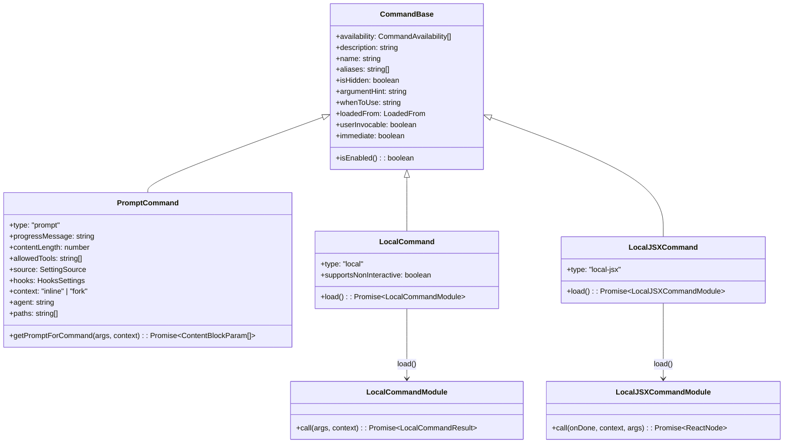

# 第十八章 命令系统架构

## 18.1 引言

命令系统是 Claude Code 与用户交互的核心入口点。用户通过斜杠命令（如 `/help`、`/config`、`/commit`）触发各种功能，从简单的信息显示到复杂的 AI 辅助操作。本章将深入分析命令系统的类型定义、注册机制和执行流程。

Claude Code 的命令系统采用分层设计：
- **类型层**：定义三种命令类型，适应不同执行需求
- **注册层**：统一管理命令发现与加载
- **路由层**：根据命令名称匹配并执行对应处理器

## 18.2 命令类型分类

Claude Code 定义了三种核心命令类型，每种类型服务于不同的执行场景：

### 18.2.1 类型定义概览

命令类型定义位于 `/src/types/command.ts`（第 205-206 行）：

```typescript
export type Command = CommandBase &
  (PromptCommand | LocalCommand | LocalJSXCommand)
```

`Command` 是一个联合类型，由基础属性 `CommandBase` 与三种具体类型之一组合而成。这种设计既保证了通用属性的一致性，又允许各类型定义特有字段。

### 18.2.2 CommandBase 通用属性

所有命令共享的基础属性定义（第 175-203 行）：

```typescript
export type CommandBase = {
  availability?: CommandAvailability[]   // 可用性限制
  description: string                     // 命令描述
  hasUserSpecifiedDescription?: boolean   // 是否用户自定义描述
  isEnabled?: () => boolean               // 动态启用判断
  isHidden?: boolean                      // 是否隐藏
  name: string                            // 命令名称
  aliases?: string[]                      // 别名列表
  isMcp?: boolean                         // MCP 来源标记
  argumentHint?: string                   // 参数提示
  whenToUse?: string                      // 使用场景说明
  version?: string                        // 版本号
  disableModelInvocation?: boolean        // 禁止模型调用
  userInvocable?: boolean                 // 用户可调用
  loadedFrom?: LoadedFrom                 // 加载来源
  kind?: 'workflow'                       // 工作流类型标记
  immediate?: boolean                     // 立即执行标记
  isSensitive?: boolean                   // 敏感命令标记
  userFacingName?: () => string           // 显示名称
}
```

关键属性说明：
- **availability**：限制命令可用范围（如仅限 claude.ai 订阅用户）
- **isEnabled**：动态函数，支持基于环境变量的条件启用
- **loadedFrom**：标记命令来源，影响权限和显示

### 18.2.3 命令类型类图



*图 18-1：命令类型继承关系图*

## 18.3 PromptCommand 设计

`PromptCommand` 是最特殊的命令类型——它不直接执行逻辑，而是生成发送给 AI 模型的提示内容。模型根据这些提示执行相应操作。

### 18.3.1 类型定义

`PromptCommand` 定义位于 `/src/types/command.ts`（第 25-57 行）：

```typescript
export type PromptCommand = {
  type: 'prompt'
  progressMessage: string          // 进度提示消息
  contentLength: number            // 内容长度（用于 token 估算）
  argNames?: string[]              // 参数名称列表
  allowedTools?: string[]          // 允许的工具列表
  model?: string                   // 指定模型
  source: SettingSource | 'builtin' | 'mcp' | 'plugin' | 'bundled'
  pluginInfo?: PluginManifest      // 插件信息
  disableNonInteractive?: boolean  // 禁用非交互模式
  hooks?: HooksSettings            // 钩子配置
  skillRoot?: string               // Skill 根目录
  context?: 'inline' | 'fork'      // 执行上下文
  agent?: string                   // Agent 类型
  effort?: EffortValue             // 努力程度
  paths?: string[]                 // 文件路径匹配模式
  getPromptForCommand(args, context): Promise<ContentBlockParam[]>
}
```

核心方法 `getPromptForCommand` 负责生成实际提示内容。该方法接收用户输入的参数和执行上下文，返回 Anthropic SDK 的 `ContentBlockParam` 数组。

### 18.3.2 典型实现：/commit 命令

`/commit` 命令是一个典型的 `PromptCommand` 实现，位于 `/src/commands/commit.ts`：

```typescript
// 第 57-92 行
const command = {
  type: 'prompt',
  name: 'commit',
  description: 'Create a git commit',
  allowedTools: ALLOWED_TOOLS,
  contentLength: 0,
  progressMessage: 'creating commit',
  source: 'builtin',
  async getPromptForCommand(_args, context) {
    const promptContent = getPromptContent()
    const finalContent = await executeShellCommandsInPrompt(
      promptContent,
      { ...context, ...permissionContext },
      '/commit',
    )
    return [{ type: 'text', text: finalContent }]
  },
} satisfies Command
```

`getPromptContent()` 函数（第 12-55 行）返回完整的提示文本，包含：

1. **上下文信息**：通过 shell 命令注入获取 git 状态
   ```
   - Current git status: !`git status`
   - Current git diff: !`git diff HEAD`
   - Current branch: !`git branch --show-current`
   ```

2. **安全协议**：约束 AI 行为的规则
   ```
   - NEVER update the git config
   - NEVER skip hooks (--no-verify)
   - ALWAYS create NEW commits
   ```

3. **任务指令**：具体的执行步骤
   ```
   Based on the above changes, create a single git commit...
   ```

### 18.3.3 工具权限控制

`PromptCommand` 通过 `allowedTools` 字段限制模型可使用的工具。`/commit` 命令定义了：

```typescript
// 第 6-10 行
const ALLOWED_TOOLS = [
  'Bash(git add:*)',
  'Bash(git status:*)',
  'Bash(git commit:*)',
]
```

这确保模型只能执行 git 相关命令，防止误操作其他系统。

### 18.3.4 Skill 加载机制

Skills 是用户自定义的 `PromptCommand`，通过 Markdown 文件定义。加载逻辑位于 `/src/skills/loadSkillsDir.ts`。

`createSkillCommand` 函数（第 270-401 行）将 Markdown 文件转换为 `PromptCommand` 对象：

```typescript
export function createSkillCommand({
  skillName,
  markdownContent,
  allowedTools,
  source,
  loadedFrom,
  ...
}): Command {
  return {
    type: 'prompt',
    name: skillName,
    description,
    contentLength: markdownContent.length,
    progressMessage: 'running',
    source,
    loadedFrom,
    async getPromptForCommand(args, toolUseContext) {
      let finalContent = substituteArguments(markdownContent, args, ...)
      if (loadedFrom !== 'mcp') {
        finalContent = await executeShellCommandsInPrompt(finalContent, ...)
      }
      return [{ type: 'text', text: finalContent }]
    },
  }
}
```

Skill 文件解析流程：
1. 读取 `SKILL.md` 文件内容
2. 解析 YAML frontmatter 获取元数据
3. 替换参数占位符 `${arg}`
4. 执行内嵌 shell 命令 `!`command``
5. 返回处理后的文本作为模型提示

## 18.4 LocalCommand 本地执行

`LocalCommand` 直接在本地执行 TypeScript 代码，不涉及 AI 模型。适用于简单、确定性的操作。

### 18.4.1 类型定义

`LocalCommand` 定义（第 74-78 行）：

```typescript
type LocalCommand = {
  type: 'local'
  supportsNonInteractive: boolean   // 支持非交互模式
  load: () => Promise<LocalCommandModule>
}
```

`LocalCommandModule` 定义（第 70-72 行）：

```typescript
export type LocalCommandModule = {
  call: LocalCommandCall
}
```

`LocalCommandCall` 调用签名（第 62-65 行）：

```typescript
export type LocalCommandCall = (
  args: string,
  context: LocalJSXCommandContext,
) => Promise<LocalCommandResult>
```

返回结果类型（第 16-23 行）：

```typescript
export type LocalCommandResult =
  | { type: 'text'; value: string }
  | { type: 'compact'; compactionResult: CompactionResult }
  | { type: 'skip' }
```

### 18.4.2 典型实现：/cost 命令

`/cost` 命令展示会话成本信息。命令声明位于 `/src/commands/cost/index.ts`：

```typescript
const cost = {
  type: 'local',
  name: 'cost',
  description: 'Show the total cost and duration of the current session',
  get isHidden() {
    if (process.env.USER_TYPE === 'ant') return false
    return isClaudeAISubscriber()
  },
  supportsNonInteractive: true,
  load: () => import('./cost.js'),
} satisfies Command
```

实现代码位于 `/src/commands/cost/cost.ts`：

```typescript
export const call: LocalCommandCall = async () => {
  if (isClaudeAISubscriber()) {
    if (currentLimits.isUsingOverage) {
      return {
        type: 'text',
        value: 'You are currently using your overages...'
      }
    }
    return { type: 'text', value: 'You are using your subscription...' }
  }
  return { type: 'text', value: formatTotalCost() }
}
```

### 18.4.3 典型实现：/version 命令

`/version` 命令（位于 `/src/commands/version.ts`）展示了最小化实现：

```typescript
const call: LocalCommandCall = async () => {
  return {
    type: 'text',
    value: MACRO.BUILD_TIME
      ? `${MACRO.VERSION} (built ${MACRO.BUILD_TIME})`
      : MACRO.VERSION,
  }
}

const version = {
  type: 'local',
  name: 'version',
  description: 'Print the version...',
  isEnabled: () => process.env.USER_TYPE === 'ant',
  supportsNonInteractive: true,
  load: () => Promise.resolve({ call }),
} satisfies Command
```

特点：
- 使用 `Promise.resolve` 直接返回模块（无需动态导入）
- 通过 `isEnabled` 函数限制为内部用户

### 18.4.4 延迟加载设计

所有 `LocalCommand` 都采用延迟加载模式：

```typescript
load: () => import('./clear.js')
```

这种设计的好处：
- **减少启动时间**：命令注册时不加载实现代码
- **降低内存占用**：未使用的命令不占用内存
- **支持条件编译**：配合 feature flag 动态启用

## 18.5 LocalJSXCommand UI 命令

`LocalJSXCommand` 返回 React 组件，在终端中渲染交互式 UI。这是 Claude Code 终端界面丰富体验的关键。

### 18.5.1 类型定义

`LocalJSXCommand` 定义（第 144-152 行）：

```typescript
type LocalJSXCommand = {
  type: 'local-jsx'
  load: () => Promise<LocalJSXCommandModule>
}
```

`LocalJSXCommandModule` 定义（第 140-142 行）：

```typescript
export type LocalJSXCommandModule = {
  call: LocalJSXCommandCall
}
```

`LocalJSXCommandCall` 调用签名（第 131-135 行）：

```typescript
export type LocalJSXCommandCall = (
  onDone: LocalJSXCommandOnDone,
  context: ToolUseContext & LocalJSXCommandContext,
  args: string,
) => Promise<React.ReactNode>
```

关键参数说明：
- **onDone**：完成回调，用于关闭 UI 并返回结果
- **context**：扩展的执行上下文，包含 React 状态管理能力
- **args**：用户输入的命令参数

### 18.5.2 典型实现：/help 命令

命令声明位于 `/src/commands/help/index.ts`：

```typescript
const help = {
  type: 'local-jsx',
  name: 'help',
  description: 'Show help and available commands',
  load: () => import('./help.js'),
} satisfies Command
```

实现位于 `/src/commands/help/help.tsx`：

```typescript
export const call: LocalJSXCommandCall = async (onDone, {
  options: { commands }
}) => {
  return <HelpV2 commands={commands} onClose={onDone} />;
};
```

简洁的实现展示了 JSX 命令的核心模式：
- 接收 `onDone` 回调传递给组件
- 返回 React 组件由 Ink 框架渲染
- 组件内部通过 `onClose` 触发关闭

### 18.5.3 典型实现：/config 命令

`/config` 命令展示更复杂的 UI 实现：

命令声明（`/src/commands/config/index.ts`）：

```typescript
const config = {
  aliases: ['settings'],
  type: 'local-jsx',
  name: 'config',
  description: 'Open config panel',
  load: () => import('./config.js'),
} satisfies Command
```

实现（`/src/commands/config/config.tsx`）：

```typescript
export const call: LocalJSXCommandCall = async (onDone, context) => {
  return <Settings onClose={onDone} context={context} defaultTab="Config" />;
};
```

`Settings` 组件是一个多标签页配置面板，`defaultTab="Config"` 指定默认显示的标签。

### 18.5.4 典型实现：/model 命令

`/model` 命令展示了动态属性的使用：

```typescript
export default {
  type: 'local-jsx',
  name: 'model',
  get description() {
    return `Set the AI model (currently ${renderModelName(getMainLoopModel())})`
  },
  argumentHint: '[model]',
  get immediate() {
    return shouldInferenceConfigCommandBeImmediate()
  },
  load: () => import('./model.js'),
} satisfies Command
```

动态属性特点：
- **description getter**：实时显示当前模型
- **immediate getter**：根据配置决定是否立即执行

### 18.5.5 完成回调机制

`LocalJSXCommandOnDone` 类型定义（第 117-126 行）：

```typescript
export type LocalJSXCommandOnDone = (
  result?: string,
  options?: {
    display?: CommandResultDisplay    // 'skip' | 'system' | 'user'
    shouldQuery?: boolean             // 是否发送给模型
    metaMessages?: string[]           // 额外消息
    nextInput?: string                // 下一个输入
    submitNextInput?: boolean         // 自动提交
  },
) => void
```

`display` 参数控制结果显示方式：
- **'user'**：作为用户消息显示（默认）
- **'system'**：作为系统消息显示
- **'skip'**：不显示结果

`shouldQuery` 为 true 时，命令完成后立即向模型发送请求。

## 18.6 命令注册与路由

### 18.6.1 命令注册中心

命令注册位于 `/src/commands.ts`。`COMMANDS` 函数返回所有内置命令（第 258-346 行）：

```typescript
const COMMANDS = memoize((): Command[] => [
  addDir,
  advisor,
  agents,
  branch,
  btw,
  chrome,
  clear,
  color,
  compact,
  config,
  ...
  vim,
  ...(webCmd ? [webCmd] : []),
  ...(forkCmd ? [forkCmd] : []),
  ...(proactive ? [proactive] : []),
  ...(process.env.USER_TYPE === 'ant' ? INTERNAL_ONLY_COMMANDS : []),
])
```

使用 `memoize` 缓存结果，避免重复构建。条件编译通过数组展开动态加入：
- Feature flag 控制的命令（如 `webCmd`、`forkCmd`）
- 内部专用命令（通过 `USER_TYPE === 'ant'` 判断）

### 18.6.2 命令发现流程

`getCommands` 函数是获取可用命令的统一入口（第 476-517 行）：

```typescript
export async function getCommands(cwd: string): Promise<Command[]> {
  const allCommands = await loadAllCommands(cwd)
  const dynamicSkills = getDynamicSkills()

  const baseCommands = allCommands.filter(
    _ => meetsAvailabilityRequirement(_) && isCommandEnabled(_),
  )

  // 合并动态 skills
  const uniqueDynamicSkills = dynamicSkills.filter(...)
  return [...baseCommands, ...uniqueDynamicSkills]
}
```

`loadAllCommands` 函数（第 449-469 行）加载所有命令来源：

```typescript
const loadAllCommands = memoize(async (cwd: string): Promise<Command[]> => {
  const [
    { skillDirCommands, pluginSkills, bundledSkills, builtinPluginSkills },
    pluginCommands,
    workflowCommands,
  ] = await Promise.all([
    getSkills(cwd),
    getPluginCommands(),
    getWorkflowCommands ? getWorkflowCommands(cwd) : [],
  ])

  return [
    ...bundledSkills,
    ...builtinPluginSkills,
    ...skillDirCommands,
    ...workflowCommands,
    ...pluginCommands,
    ...pluginSkills,
    ...COMMANDS(),
  ]
})
```

命令来源优先级（从低到高）：
1. Bundled skills（打包内置）
2. Builtin plugin skills（内置插件）
3. Skill directory commands（项目/用户 Skills）
4. Workflow commands（工作流）
5. Plugin commands（插件命令）
6. Plugin skills（插件 Skills）
7. Built-in commands（内置命令）

### 18.6.3 可用性过滤

`meetsAvailabilityRequirement` 函数（第 417-443 行）根据用户身份过滤命令：

```typescript
export function meetsAvailabilityRequirement(cmd: Command): boolean {
  if (!cmd.availability) return true
  for (const a of cmd.availability) {
    switch (a) {
      case 'claude-ai':
        if (isClaudeAISubscriber()) return true
        break
      case 'console':
        if (!isClaudeAISubscriber() && !isUsing3PServices() && isFirstPartyAnthropicBaseUrl())
          return true
        break
    }
  }
  return false
}
```

可用性类型：
- **claude-ai**：仅限 claude.ai OAuth 订阅用户
- **console**：仅限直接 API 用户（排除 Bedrock/Vertex）

### 18.6.4 命令查找

`findCommand` 和 `getCommand` 函数（第 688-719 行）提供命令查找：

```typescript
export function findCommand(
  commandName: string,
  commands: Command[],
): Command | undefined {
  return commands.find(
    _ =>
      _.name === commandName ||
      getCommandName(_) === commandName ||
      _.aliases?.includes(commandName),
  )
}

export function getCommand(commandName: string, commands: Command[]): Command {
  const command = findCommand(commandName, commands)
  if (!command) {
    throw ReferenceError(`Command ${commandName} not found...`)
  }
  return command
}
```

查找匹配顺序：
1. 命令名称（`name`）
2. 显示名称（`userFacingName()`）
3. 别名列表（`aliases`）

### 18.6.5 远程模式安全

`REMOTE_SAFE_COMMANDS` 定义远程模式可用命令（第 619-637 行）：

```typescript
export const REMOTE_SAFE_COMMANDS: Set<Command> = new Set([
  session,    // 显示远程会话二维码
  exit,       // 退出 TUI
  clear,      // 清屏
  help,       // 帮助
  theme,      // 主题
  color,      // 颜色
  vim,        // Vim 模式
  cost,       // 成本
  usage,      // 使用情况
  copy,       // 复制
  btw,        // 快速笔记
  feedback,   // 反馈
  plan,       // 计划模式
  keybindings,// 键绑定
  statusline, // 状态栏
  stickers,   // 贴纸
  mobile,     // 移动二维码
])
```

这些命令仅影响本地 TUI 状态，不依赖本地文件系统或 git 环境。

`BRIDGE_SAFE_COMMANDS` 定义移动端可用命令（第 651-660 行）：

```typescript
export const BRIDGE_SAFE_COMMANDS: Set<Command> = new Set([
  compact,      // 上下文压缩
  clear,        // 清屏
  cost,         // 成本
  summary,      // 会话摘要
  releaseNotes, // 更新日志
  files,        // 文件列表
])
```

### 18.6.6 命令来源标注

`formatDescriptionWithSource` 函数（第 728-754 行）为命令描述添加来源标注：

```typescript
export function formatDescriptionWithSource(cmd: Command): string {
  if (cmd.type !== 'prompt') return cmd.description

  if (cmd.kind === 'workflow') {
    return `${cmd.description} (workflow)`
  }

  if (cmd.source === 'plugin') {
    const pluginName = cmd.pluginInfo?.pluginManifest.name
    if (pluginName) {
      return `(${pluginName}) ${cmd.description}`
    }
    return `${cmd.description} (plugin)`
  }

  if (cmd.source === 'bundled') {
    return `${cmd.description} (bundled)`
  }

  return `${cmd.description} (${getSettingSourceName(cmd.source)})`
}
```

标注类型：
- **(workflow)**：工作流命令
- **(plugin)**：插件命令
- **(bundled)**：打包内置
- **(userSettings/projectSettings)**：用户/项目配置

## 18.7 设计总结

Claude Code 命令系统体现了以下设计原则：

**类型分离**
- PromptCommand：AI 驱动，生成提示而非执行
- LocalCommand：本地执行，确定性操作
- LocalJSXCommand：UI 渲染，交互式体验

**延迟加载**
- 所有命令实现通过 `load()` 函数动态导入
- 减少启动开销，按需加载代码

**来源管理**
- 统一的 `loadedFrom` 字段追踪来源
- 支持 Skills、Plugins、MCP 等多来源
- 自动去重和优先级处理

**安全控制**
- `availability` 限制用户范围
- `allowedTools` 限制 AI 工具集
- 远程模式白名单过滤

这种分层设计使命令系统既灵活又可控，能够支持从简单信息查询到复杂 AI 辅助操作的广泛需求。