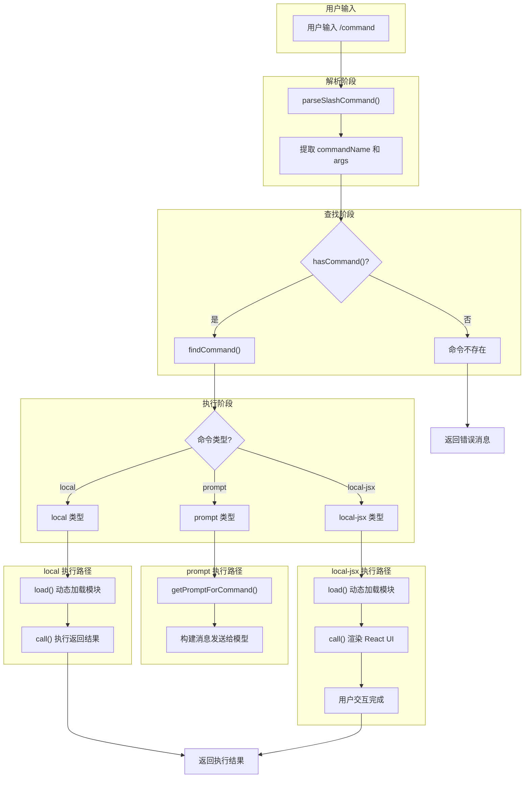

# 第十九章：内置命令详解

## 19.1 引言

内置命令系统是 Claude Code 用户交互的核心入口。用户通过斜杠命令（如 `/init`、`/commit`、`/compact`）触发各种自动化工作流。Claude Code 的命令系统设计具有以下特点：

1. **统一抽象**：所有命令共享 `Command` 类型接口
2. **三种执行模式**：`prompt`（提示展开）、`local`（本地执行）、`local-jsx`（UI 渲染）
3. **动态加载**：命令实现延迟加载，减少启动开销
4. **技能扩展**：支持从 `.claude/skills/` 目录加载自定义技能

本章深入分析 `/init`、`/commit`、`/review`、`/compact`、`/config`、`/mcp`、`/memory` 等核心内置命令的实现机制。

---

## 19.2 命令系统架构

### 19.2.1 命令类型定义

命令类型定义在 `src/types/command.ts:205-206`：

```typescript
export type Command = CommandBase &
  (PromptCommand | LocalCommand | LocalJSXCommand)
```

**三种命令类型对比**：

| 类型 | 执行方式 | 适用场景 | 文件示例 |
|------|----------|----------|----------|
| `prompt` | 展开为提示文本发送给模型 | 需要模型智能处理的任务 | `init.ts`, `commit/` |
| `local` | 本地同步执行返回结果 | 纯本地操作、无需 UI | `compact/compact.ts` |
| `local-jsx` | 渲染 React/Ink UI 界面 | 需要用户交互的选择界面 | `config.tsx`, `mcp.tsx` |

**CommandBase 基础字段**（`src/types/command.ts:175-203`）：

| 字段 | 类型 | 说明 |
|------|------|------|
| `name` | `string` | 命令唯一标识名 |
| `description` | `string` | 命令描述（显示在帮助和自动补全） |
| `aliases` | `string[]?` | 命令别名 |
| `isEnabled` | `() => boolean` | 动态启用条件 |
| `argumentHint` | `string?` | 参数提示文本 |
| `immediate` | `boolean?` | 是否立即执行（绕过队列） |
| `source` | `SettingSource` | 命令来源（builtin/plugin/mcp 等） |

### 19.2.2 命令选择流程



*图 19-1：命令选择与执行流程*

### 19.2.3 命令注册机制

命令在 `src/commands.ts` 中集中注册。核心注册函数 `COMMANDS()`（行 258-346）返回所有内置命令数组：

```typescript
const COMMANDS = memoize((): Command[] => [
  addDir,
  advisor,
  agents,
  branch,
  compact,
  config,
  mcp,
  memory,
  init,
  review,
  // ... 更多命令
])
```

**命令加载层次**（`src/commands.ts:449-469`）：

```typescript
const loadAllCommands = memoize(async (cwd: string): Promise<Command[]> => {
  const [
    { skillDirCommands, pluginSkills, bundledSkills, builtinPluginSkills },
    pluginCommands,
    workflowCommands,
  ] = await Promise.all([
    getSkills(cwd),          // 用户技能目录
    getPluginCommands(),     // 插件命令
    getWorkflowCommands?.(cwd), // 工作流命令
  ])

  return [
    ...bundledSkills,
    ...builtinPluginSkills,
    ...skillDirCommands,
    ...workflowCommands,
    ...pluginCommands,
    ...pluginSkills,
    ...COMMANDS(),           // 内置命令（优先级最低）
  ]
})
```

---

## 19.3 `/init` 项目初始化命令

### 19.3.1 命令定义

`/init` 命令定义在 `src/commands/init.ts:226-256`：

```typescript
const command = {
  type: 'prompt',
  name: 'init',
  get description() {
    return feature('NEW_INIT') &&
      (process.env.USER_TYPE === 'ant' ||
        isEnvTruthy(process.env.CLAUDE_CODE_NEW_INIT))
      ? 'Initialize new CLAUDE.md file(s) and optional skills/hooks...'
      : 'Initialize a new CLAUDE.md file with codebase documentation'
  },
  contentLength: 0,          // 动态内容，长度不固定
  progressMessage: 'analyzing your codebase',
  source: 'builtin',
  async getPromptForCommand() {
    maybeMarkProjectOnboardingComplete()
    return [{
      type: 'text',
      text: feature('NEW_INIT') ? NEW_INIT_PROMPT : OLD_INIT_PROMPT
    }]
  },
} satisfies Command
```

**关键设计点**：

1. **`type: 'prompt'`**：命令展开为提示文本，由模型智能执行
2. **动态描述**：根据 feature flag 返回不同描述文本
3. **延迟执行**：`getPromptForCommand()` 在命令被调用时才构建提示

### 19.3.2 NEW_INIT_PROMPT 分析

新版初始化提示（`src/commands/init.ts:28-224`）采用**八阶段工作流**：

| 阶段 | 功能 | 关键操作 |
|------|------|----------|
| Phase 1 | 确定配置范围 | 询问用户创建项目/个人 CLAUDE.md |
| Phase 2 | 探索代码库 | 子代理分析 manifest、README、CI 配置 |
| Phase 3 | 补充信息 | 通过 AskUserQuestion 获取无法从代码推断的信息 |
| Phase 4 | 写入 CLAUDE.md | 创建最小化的项目配置文件 |
| Phase 5 | 写入 CLAUDE.local.md | 创建个人配置文件（自动 gitignore） |
| Phase 6 | 创建技能 | 在 `.claude/skills/` 目录创建 SKILL.md |
| Phase 7 | 建议优化 | 检查 GitHub CLI、lint 配置、format-on-edit hook |
| Phase 8 | 总结 | 汇报完成的配置并提供后续建议 |

**核心提示片段**（Phase 4 内容要求）：

```
Write a minimal CLAUDE.md at the project root. Every line must pass this test:
"Would removing this cause Claude to make mistakes?" If no, cut it.

Include:
- Build/test/lint commands Claude can't guess
- Code style rules that DIFFER from language defaults
- Testing instructions and quirks
- Repo etiquette (branch naming, PR conventions)
- Required env vars or setup steps

Exclude:
- File-by-file structure or component lists
- Standard language conventions Claude already knows
- Generic advice ("write clean code", "handle errors")
```

### 19.3.3 OLD_INIT_PROMPT 分析

旧版初始化提示（`src/commands/init.ts:6-26`）更简洁，直接要求模型：

1. 分析代码库结构
2. 创建 CLAUDE.md 文件
3. 包含常用命令、架构概述
4. 避免重复和显而易见的指令

---

## 19.4 `/commit` 提交命令

### 19.4.1 命令定义

`/commit` 命令定义在 `src/commands/commit/index.ts`：

```typescript
const command = {
  type: 'prompt',
  name: 'commit',
  description: 'Create a git commit',
  allowedTools: ALLOWED_TOOLS,  // 限制可用工具
  contentLength: 0,
  progressMessage: 'creating commit',
  source: 'builtin',
  async getPromptForCommand(_args, context) {
    const promptContent = getPromptContent()
    const finalContent = await executeShellCommandsInPrompt(
      promptContent,
      { ...context, ...modifiedPermissionContext },
      '/commit',
    )
    return [{ type: 'text', text: finalContent }]
  },
} satisfies Command
```

**关键设计点**：

1. **工具限制**：`allowedTools` 仅允许 `git add`、`git status`、`git commit`
2. **Shell 命令预执行**：`executeShellCommandsInPrompt()` 在发送前执行提示中的 `!\`git status\`` 等命令

### 19.4.2 工具白名单

定义在 `src/commands/commit/index.ts`：

```typescript
const ALLOWED_TOOLS = [
  'Bash(git add:*)',
  'Bash(git status:*)',
  'Bash(git commit:*)',
]
```

这确保模型只能执行 git 相关命令，防止意外破坏性操作。

### 19.4.3 提示内容分析

`getPromptContent()` 函数（行 12-55）构建包含实时 git 状态的提示：

```typescript
function getPromptContent(): string {
  return `
## Context
- Current git status: !\`git status\`
- Current git diff: !\`git diff HEAD\`
- Current branch: !\`git branch --show-current\`
- Recent commits: !\`git log --oneline -10\`

## Git Safety Protocol
- NEVER update the git config
- NEVER skip hooks (--no-verify)
- CRITICAL: ALWAYS create NEW commits. NEVER use --amend
- Do not commit files that likely contain secrets

## Your task
Based on the above changes, create a single git commit:
1. Analyze all staged changes and draft a commit message
2. Stage relevant files and create the commit using HEREDOC syntax
  `
}
```

**!\`command\` 语法**：Claude Code 会预执行这些 shell 命令并将输出嵌入提示，使模型获得实时上下文。

---

## 19.5 `/review` PR 审查命令

### 19.5.1 命令定义

`/review` 命令定义在 `src/commands/review.ts:33-43`：

```typescript
const review: Command = {
  type: 'prompt',
  name: 'review',
  description: 'Review a pull request',
  progressMessage: 'reviewing pull request',
  contentLength: 0,
  source: 'builtin',
  async getPromptForCommand(args): Promise<ContentBlockParam[]> {
    return [{ type: 'text', text: LOCAL_REVIEW_PROMPT(args) }]
  },
}
```

### 19.5.2 本地审查提示

定义在 `src/commands/review.ts:9-31`：

```typescript
const LOCAL_REVIEW_PROMPT = (args: string) => `
You are an expert code reviewer. Follow these steps:

1. If no PR number is provided, run \`gh pr list\` to show open PRs
2. If a PR number is provided, run \`gh pr view <number>\` to get PR details
3. Run \`gh pr diff <number>\` to get the diff
4. Analyze the changes and provide a thorough code review

Keep your review concise but thorough. Focus on:
- Code correctness
- Following project conventions
- Performance implications
- Test coverage
- Security considerations

PR number: ${args}
`
```

模型通过 `gh` CLI 获取 PR 信息并执行代码审查。

### 19.5.3 Ultrareview 变体

`/ultrareview` 是远程审查变体（行 48-54）：

```typescript
const ultrareview: Command = {
  type: 'local-jsx',
  name: 'ultrareview',
  description: '~10–20 min · Finds and verifies bugs in your branch...',
  isEnabled: () => isUltrareviewEnabled(),
  load: () => import('./review/ultrareviewCommand.js'),
}
```

此命令在 Claude Code on the Web 上运行，提供更深入的 bug 检测能力。

---

## 19.6 `/compact` 上下文压缩命令

### 19.6.1 命令定义

`/compact` 命令定义在 `src/commands/compact/index.ts:4-15`：

```typescript
const compact = {
  type: 'local',
  name: 'compact',
  description:
    'Clear conversation history but keep a summary in context...',
  isEnabled: () => !isEnvTruthy(process.env.DISABLE_COMPACT),
  supportsNonInteractive: true,
  argumentHint: '<optional custom summarization instructions>',
  load: () => import('./compact.js'),
} satisfies Command
```

**关键设计点**：

1. **`type: 'local'`**：本地同步执行，不渲染 UI
2. **环境变量控制**：`DISABLE_COMPACT` 可禁用此命令
3. **支持非交互模式**：可在脚本中使用

### 19.6.2 执行流程分析

核心实现在 `src/commands/compact/compact.ts:40-137`：

```typescript
export const call: LocalCommandCall = async (args, context) => {
  let { messages } = context
  
  // 过滤掉已压缩的消息边界
  messages = getMessagesAfterCompactBoundary(messages)
  
  if (messages.length === 0) {
    throw new Error('No messages to compact')
  }
  
  const customInstructions = args.trim()
  
  try {
    // 优先尝试 session memory compaction
    if (!customInstructions) {
      const sessionMemoryResult = await trySessionMemoryCompaction(...)
      if (sessionMemoryResult) {
        // 清理缓存，标记压缩完成
        getUserContext.cache.clear?.()
        runPostCompactCleanup()
        return { type: 'compact', compactionResult: sessionMemoryResult }
      }
    }
    
    // 回退到传统压缩
    const microcompactResult = await microcompactMessages(messages, context)
    const result = await compactConversation(messagesForCompact, context, ...)
    
    return { type: 'compact', compactionResult: result }
  } catch (error) {
    // 处理各种错误情况
    if (abortController.signal.aborted) {
      throw new Error('Compaction canceled.')
    }
    // ...
  }
}
```

**压缩策略层次**：

| 策略 | 优先级 | 适用条件 | 效果 |
|------|--------|----------|------|
| session memory compaction | 最高 | 无自定义指令 | 快速、保留关键信息 |
| reactive compact | 中等 | 启用 REACTIVE_COMPACT feature | 流式处理 |
| traditional compact | 最低 | 其他情况 | 完整摘要生成 |

### 19.6.3 微压缩机制

`microcompactMessages()` 函数（行 98）在摘要前预处理消息：

```typescript
const microcompactResult = await microcompactMessages(messages, context)
const messagesForCompact = microcompactResult.messages
```

微压缩会：
1. 移除冗余的工具调用日志
2. 简化长输出
3. 合并相似消息

---

## 19.7 `/config` 配置管理命令

### 19.7.1 命令定义

`/config` 命令定义在 `src/commands/config/index.ts:3-9`：

```typescript
const config = {
  aliases: ['settings'],
  type: 'local-jsx',
  name: 'config',
  description: 'Open config panel',
  load: () => import('./config.js'),
} satisfies Command
```

**关键设计点**：

1. **别名支持**：`/settings` 和 `/config` 等效
2. **`type: 'local-jsx'`**：渲染 React/Ink UI 界面

### 19.7.2 UI 渲染实现

核心实现在 `src/commands/config/config.tsx:4-6`：

```typescript
export const call: LocalJSXCommandCall = async (onDone, context) => {
  return <Settings
    onClose={onDone}
    context={context}
    defaultTab="Config"
  />;
};
```

命令直接渲染 `<Settings>` 组件，默认打开 "Config" 标签页。用户完成配置后调用 `onDone()` 退出。

---

## 19.8 `/mcp` MCP 管理命令

### 19.8.1 命令定义

`/mcp` 命令定义在 `src/commands/mcp/index.ts:3-12`：

```typescript
const mcp = {
  type: 'local-jsx',
  name: 'mcp',
  description: 'Manage MCP servers',
  immediate: true,        // 立即执行，不等待 stop point
  argumentHint: '[enable|disable [server-name]]',
  load: () => import('./mcp.js'),
} satisfies Command
```

**关键设计点**：

1. **`immediate: true`**：命令立即执行，不进入命令队列
2. **参数提示**：显示 enable/disable 子命令

### 19.8.2 子命令处理

实现在 `src/commands/mcp/mcp.tsx:63-84`：

```typescript
export async function call(onDone, _context, args?: string): Promise<React.ReactNode> {
  if (args) {
    const parts = args.trim().split(/\s+/)
    
    if (parts[0] === 'no-redirect') {
      return <MCPSettings onComplete={onDone} />
    }
    if (parts[0] === 'reconnect' && parts[1]) {
      return <MCPReconnect serverName={parts.slice(1).join(' ')} onComplete={onDone} />
    }
    if (parts[0] === 'enable' || parts[0] === 'disable') {
      return <MCPToggle action={parts[0]} target={...} onComplete={onDone} />
    }
  }
  
  return <MCPSettings onComplete={onDone} />
}
```

**子命令映射**：

| 子命令 | 功能 | UI 组件 |
|--------|------|----------|
| `no-redirect` | 直接打开 MCP 设置 | `<MCPSettings>` |
| `reconnect <name>` | 重连指定服务器 | `<MCPReconnect>` |
| `enable [name]` | 启用服务器 | `<MCPToggle>` |
| `disable [name]` | 禁用服务器 | `<MCPToggle>` |
| 无参数 | 打开 MCP 设置 | `<MCPSettings>` |

### 19.8.3 MCPToggle 组件

定义在 `src/commands/mcp/mcp.tsx:12-56`：

```typescript
function MCPToggle({ action, target, onComplete }) {
  const mcpClients = useAppState(s => s.mcp.clients)
  const toggleMcpServer = useMcpToggleEnabled()
  const didRun = useRef(false)
  
  useEffect(() => {
    if (didRun.current) return
    didRun.current = true
    
    const isEnabling = action === "enable"
    const clients = mcpClients.filter(c => c.name !== "ide")
    const toToggle = target === "all" ? 
      clients.filter(c => isEnabling ? c.type === "disabled" : c.type !== "disabled") :
      clients.filter(c => c.name === target)
    
    for (const s of toToggle) {
      toggleMcpServer(s.name)
    }
    
    onComplete(`${isEnabling ? "Enabled" : "Disabled"} ${toToggle.length} server(s)`)
  }, [action, target, mcpClients, toggleMcpServer, onComplete])
  
  return null
}
```

组件使用 React `useEffect` 执行批量启用/禁用操作。

---

## 19.9 `/memory` 记忆系统命令

### 19.9.1 命令定义

`/memory` 命令定义在 `src/commands/memory/index.ts:3-10`：

```typescript
const memory: Command = {
  type: 'local-jsx',
  name: 'memory',
  description: 'Edit Claude memory files',
  load: () => import('./memory.js'),
}
```

### 19.9.2 记忆文件编辑流程

实现在 `src/commands/memory/memory.tsx:14-82`：

```typescript
function MemoryCommand({ onDone }): React.ReactNode {
  const handleSelectMemoryFile = async (memoryPath: string) => {
    // 创建目录（如不存在）
    if (memoryPath.includes(getClaudeConfigHomeDir())) {
      await mkdir(getClaudeConfigHomeDir(), { recursive: true })
    }
    
    // 创建文件（如不存在）
    try {
      await writeFile(memoryPath, '', { encoding: 'utf8', flag: 'wx' })
    } catch (e) {
      if (getErrnoCode(e) !== 'EEXIST') throw e
    }
    
    // 在编辑器中打开
    await editFileInEditor(memoryPath)
    
    // 显示编辑器信息提示
    const editorHint = buildEditorHint()
    onDone(`Opened memory file at ${getRelativeMemoryPath(memoryPath)}\n\n${editorHint}`, {
      display: 'system'
    })
  }
  
  return (
    <Dialog title="Memory" onCancel={handleCancel} color="remember">
      <MemoryFileSelector onSelect={handleSelectMemoryFile} onCancel={handleCancel} />
      <Link url="https://code.claude.com/docs/en/memory" />
    </Dialog>
  )
}
```

**执行流程**：

1. 渲染 `<MemoryFileSelector>` 让用户选择记忆文件
2. 确保目录和文件存在
3. 使用 `$EDITOR` 或 `$VISUAL` 打开文件
4. 完成后显示文件路径和编辑器提示

### 19.9.3 记忆文件路径

记忆文件存储在两个位置：

| 类型 | 路径 | 作用域 |
|------|------|--------|
| 项目级 | `./CLAUDE.md` 或 `./.claude/rules/` | 当前项目 |
| 用户级 | `~/.claude/CLAUDE.md` | 全局（所有项目） |

---

## 19.10 命令处理核心函数

### 19.10.1 processSlashCommand()

命令处理入口定义在 `src/utils/processUserInput/processSlashCommand.tsx:309-500`：

```typescript
export async function processSlashCommand(
  inputString: string,
  precedingInputBlocks: ContentBlockParam[],
  // ... 其他参数
  context: ProcessUserInputContext,
): Promise<ProcessUserInputBaseResult> {
  // 1. 解析命令
  const parsed = parseSlashCommand(inputString)
  if (!parsed) {
    return { messages: [errorMessage], shouldQuery: false }
  }
  
  const { commandName, args, isMcp } = parsed
  
  // 2. 检查命令是否存在
  if (!hasCommand(commandName, context.options.commands)) {
    // 处理未知命令
    return handleUnknownCommand(commandName, args)
  }
  
  // 3. 获取命令消息
  const result = await getMessagesForSlashCommand(
    commandName, args, context
  )
  
  // 4. 根据命令类型处理结果
  return {
    messages: result.messages,
    shouldQuery: result.shouldQuery,
    model: result.model,
    allowedTools: result.allowedTools,
  }
}
```

### 19.10.2 命令查找机制

`findCommand()` 函数（`src/commands.ts:688-698`）：

```typescript
export function findCommand(
  commandName: string,
  commands: Command[],
): Command | undefined {
  return commands.find(
    _ => _.name === commandName ||
         getCommandName(_) === commandName ||
         _.aliases?.includes(commandName)
  )
}
```

查找逻辑支持：
1. 命令主名称匹配
2. 用户显示名称匹配
3. 别名匹配

---

## 19.11 总结

Claude Code 的内置命令系统展示了精巧的设计：

1. **三种执行模式**满足不同需求：
   - `prompt` 类型让模型智能处理复杂任务
   - `local` 类型快速执行本地操作
   - `local-jsx` 类型提供交互式 UI

2. **动态加载机制**减少启动开销，只在命令被调用时才加载实现模块

3. **统一的类型系统**确保所有命令（内置、技能、插件、MCP）共享相同的接口

4. **丰富的扩展点**支持用户自定义技能、插件命令和工作流命令

关键文件：

| 文件 | 说明 |
|------|------|
| `src/types/command.ts` | 命令类型定义 |
| `src/commands.ts` | 命令注册和查找 |
| `src/commands/init.ts` | `/init` 项目初始化 |
| `src/commands/commit/index.ts` | `/commit` 提交自动化 |
| `src/commands/review.ts` | `/review` PR 审查 |
| `src/commands/compact/compact.ts` | `/compact` 上下文压缩 |
| `src/commands/config/config.tsx` | `/config` 配置管理 |
| `src/commands/mcp/mcp.tsx` | `/mcp` MCP 管理 |
| `src/commands/memory/memory.tsx` | `/memory` 记忆系统 |
| `src/utils/processUserInput/processSlashCommand.tsx` | 命令处理入口 |