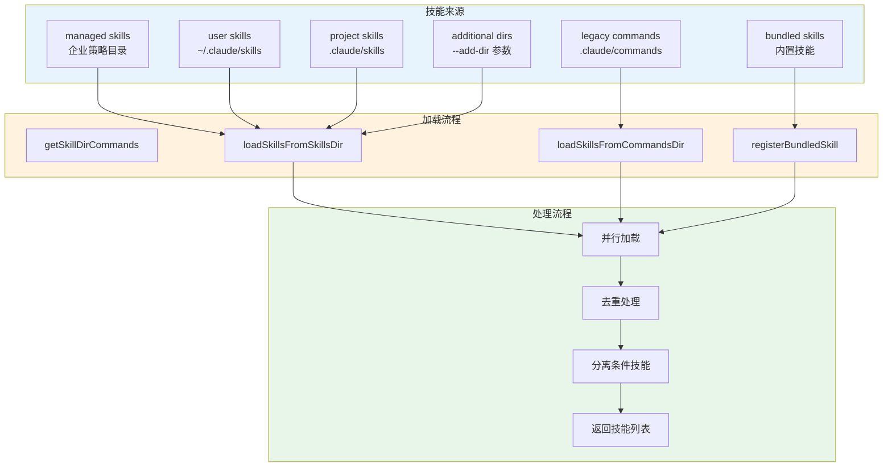
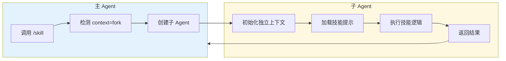

# 第二十章：技能系统架构

## 20.1 引言

技能系统是 Claude Code 提供专业化能力的核心机制。通过技能，用户可以：

1. **扩展 AI 能力边界**：将领域特定知识注入 Claude 的上下文
2. **定义自动化流程**：通过 Hooks 在工具执行前后自动触发逻辑
3. **定制模型行为**：为特定技能指定专属的模型配置
4. **隔离执行上下文**：通过 Fork 机制在独立子 Agent 中运行复杂任务

本章深入分析技能的定义、加载、解析与执行机制，揭示 Claude Code 如何实现灵活且安全的技能扩展架构。

---

## 20.2 技能定义与 Frontmatter

### 20.2.1 技能文件结构

技能以 Markdown 文件形式定义，核心约定如下：

**目录格式（推荐）**：
```
.claude/skills/my-skill/SKILL.md
```

**单文件格式（legacy）**：
```
.claude/commands/my-command.md
```

目录格式将技能内容与关联资源（脚本、模板等）放在一起，便于管理复杂技能。

### 20.2.2 Frontmatter 字段详解

技能的元数据通过 YAML Frontmatter 定义。完整的 Frontmatter 示例：

```yaml
---
name: code-review
description: 执行代码审查，检查安全漏洞、性能问题和代码质量
when_to_use: 当需要审查 PR、审查代码变更或进行安全审计时使用
allowed-tools: [Read, Grep, Bash(git diff*), WebFetch]
argument-hint: "[PR号|分支名|文件路径]"
arguments:
  - pr_number
  - target_branch
model: claude-sonnet-4-6
context: fork
agent: general-purpose
effort: high
user-invocable: true
disable-model-invocation: false
paths:
  - "src/**/*.ts"
  - "tests/**/*.ts"
hooks:
  PreToolUse:
    - matcher: "Bash"
      hooks:
        - type: command
          command: "echo '即将执行 Bash 命令'"
  PostToolUse:
    - matcher: "Write"
      hooks:
        - type: command
          command: "${CLAUDE_SKILL_DIR}/hooks/post-write.sh"
---
```

**字段解析表**：

| 字段名 | 类型 | 必填 | 说明 | 代码行号 |
|--------|------|------|------|----------|
| `name` | `string` | 否 | 显示名称（默认取目录名） | loadSkillsDir.ts:238-239 |
| `description` | `string` | 否 | 技能描述（可从正文提取） | loadSkillsDir.ts:210-214 |
| `when_to_use` | `string` | 否 | 使用场景说明 | loadSkillsDir.ts:252 |
| `allowed-tools` | `string[]` | 否 | 允许使用的工具列表 | loadSkillsDir.ts:242-244 |
| `argument-hint` | `string` | 否 | 参数提示文本 | loadSkillsDir.ts:245-248 |
| `arguments` | `string[]` | 否 | 命名参数列表 | loadSkillsDir.ts:249-251 |
| `model` | `string` | 否 | 专属模型（"inherit" 表示继承默认） | loadSkillsDir.ts:221-226 |
| `context` | `'inline' \| 'fork'` | 否 | 执行上下文类型 | loadSkillsDir.ts:260 |
| `agent` | `string` | 否 | Fork 时使用的 Agent 类型 | loadSkillsDir.ts:261 |
| `effort` | `string \| number` | 否 | 努力级别（low/medium/high 或整数） | loadSkillsDir.ts:228-235 |
| `user-invocable` | `boolean` | 否 | 是否用户可调用（默认 true） | loadSkillsDir.ts:216-219 |
| `disable-model-invocation` | `boolean` | 否 | 禁止模型自动调用 | loadSkillsDir.ts:255-257 |
| `paths` | `string[]` | 否 | 路径匹配模式（条件技能） | loadSkillsDir.ts:159-178 |
| `hooks` | `HooksSettings` | 否 | 注册的钩子配置 | loadSkillsDir.ts:259 |
| `shell` | `string \| object` | 否 | Shell 执行配置 | loadSkillsDir.ts:263 |

### 20.2.3 Frontmatter 解析流程

Frontmatter 解析由 `parseSkillFrontmatterFields()` 函数处理，位于 `loadSkillsDir.ts:185-265`：

```typescript
export function parseSkillFrontmatterFields(
  frontmatter: FrontmatterData,
  markdownContent: string,
  resolvedName: string,
  descriptionFallbackLabel: 'Skill' | 'Custom command' = 'Skill',
): {
  displayName: string | undefined
  description: string
  hasUserSpecifiedDescription: boolean
  allowedTools: string[]
  argumentHint: string | undefined
  argumentNames: string[]
  whenToUse: string | undefined
  version: string | undefined
  model: ReturnType<typeof parseUserSpecifiedModel> | undefined
  disableModelInvocation: boolean
  userInvocable: boolean
  hooks: HooksSettings | undefined
  executionContext: 'fork' | undefined
  agent: string | undefined
  effort: EffortValue | undefined
  shell: FrontmatterShell | undefined
} {
  // ... 实现细节
}
```

该函数负责：
1. 验证并转换各字段类型
2. 处理默认值逻辑
3. 解析复杂字段（如 `model`、`hooks`）
4. 验证 `effort` 值的有效性

---

## 20.3 技能加载机制

### 20.3.1 加载流程概览

技能加载由 `getSkillDirCommands()` 函数主导，支持多源加载：



**图 20-1：技能加载流程图**

### 20.3.2 多源加载策略

`getSkillDirCommands()` 位于 `loadSkillsDir.ts:638-804`，实现分层加载策略：

**加载优先级（从高到低）**：
1. **Managed Skills**：企业策略目录（`managed-settings.json` 控制）
2. **User Skills**：用户全局配置目录（`~/.claude/skills`）
3. **Project Skills**：项目目录（`.claude/skills`，向上遍历至 HOME）
4. **Additional Dirs**：通过 `--add-dir` 指定的额外目录
5. **Legacy Commands**：旧版 `.claude/commands` 目录
6. **Bundled Skills**：CLI 内置技能

```typescript
// loadSkillsDir.ts:679-714 - 并行加载各来源
const [
  managedSkills,
  userSkills,
  projectSkillsNested,
  additionalSkillsNested,
  legacyCommands,
] = await Promise.all([
  loadSkillsFromSkillsDir(managedSkillsDir, 'policySettings'),
  loadSkillsFromSkillsDir(userSkillsDir, 'userSettings'),
  Promise.all(projectSkillsDirs.map(dir =>
    loadSkillsFromSkillsDir(dir, 'projectSettings'),
  )),
  Promise.all(additionalDirs.map(dir =>
    loadSkillsFromSkillsDir(join(dir, '.claude', 'skills'), 'projectSettings'),
  )),
  loadSkillsFromCommandsDir(cwd),
])
```

### 20.3.3 技能目录扫描

`loadSkillsFromSkillsDir()` 函数扫描技能目录，位于 `loadSkillsDir.ts:407-480`：

```typescript
async function loadSkillsFromSkillsDir(
  basePath: string,
  source: SettingSource,
): Promise<SkillWithPath[]> {
  const fs = getFsImplementation()

  let entries
  try {
    entries = await fs.readdir(basePath)
  } catch (e: unknown) {
    if (!isFsInaccessible(e)) logError(e)
    return []
  }

  const results = await Promise.all(
    entries.map(async (entry): Promise<SkillWithPath | null> => {
      // 只支持目录格式: skill-name/SKILL.md
      if (!entry.isDirectory() && !entry.isSymbolicLink()) {
        return null
      }

      const skillDirPath = join(basePath, entry.name)
      const skillFilePath = join(skillDirPath, 'SKILL.md')

      let content: string
      try {
        content = await fs.readFile(skillFilePath, { encoding: 'utf-8' })
      } catch (e: unknown) {
        if (!isENOENT(e)) {
          logForDebugging(`[skills] failed to read ${skillFilePath}: ${e}`)
        }
        return null
      }

      const { frontmatter, content: markdownContent } = parseFrontmatter(
        content,
        skillFilePath,
      )

      const skillName = entry.name
      const parsed = parseSkillFrontmatterFields(frontmatter, markdownContent, skillName)
      const paths = parseSkillPaths(frontmatter)

      return {
        skill: createSkillCommand({ ...parsed, skillName, markdownContent, source, baseDir: skillDirPath, loadedFrom: 'skills', paths }),
        filePath: skillFilePath,
      }
    }),
  )

  return results.filter((r): r is SkillWithPath => r !== null)
}
```

关键点：
- **目录格式强制**：只处理子目录中的 `SKILL.md` 文件（行 424-428）
- **错误隔离**：单个技能加载失败不影响其他技能（行 437-444）
- **路径关联**：返回 `SkillWithPath` 用于后续去重

### 20.3.4 技能去重机制

加载完成后，通过文件身份进行去重，位于 `loadSkillsDir.ts:726-769`：

```typescript
// 使用 realpath 解决符号链接问题
const fileIds = await Promise.all(
  allSkillsWithPaths.map(({ skill, filePath }) =>
    skill.type === 'prompt'
      ? getFileIdentity(filePath)  // realpath 解析
      : Promise.resolve(null),
  ),
)

const seenFileIds = new Map<string, SettingSource | 'builtin' | 'mcp' | 'plugin' | 'bundled'>()
const deduplicatedSkills: Command[] = []

for (let i = 0; i < allSkillsWithPaths.length; i++) {
  const entry = allSkillsWithPaths[i]
  if (entry === undefined || entry.skill.type !== 'prompt') continue

  const fileId = fileIds[i]
  if (fileId === null || fileId === undefined) {
    deduplicatedSkills.push(skill)
    continue
  }

  const existingSource = seenFileIds.get(fileId)
  if (existingSource !== undefined) {
    logForDebugging(`Skipping duplicate skill '${skill.name}' from ${skill.source}`)
    continue
  }

  seenFileIds.set(fileId, skill.source)
  deduplicatedSkills.push(skill)
}
```

去重策略使用 `realpath()` 而非 inode，避免虚拟文件系统的 inode 不一致问题（详见行 112-124 注释）。

---

## 20.4 Skill Hooks 配置

### 20.4.1 Hooks 类型定义

技能可定义 Hooks，在工具执行前后触发自定义逻辑。Hooks 定义在 `schemas/hooks.ts`：

**四种 Hook 类型**：

| 类型 | Schema | 用途 |
|------|--------|------|
| `command` | `BashCommandHookSchema` | 执行 Shell 命令 |
| `prompt` | `PromptHookSchema` | 发送 LLM 提示 |
| `http` | `HttpHookSchema` | 发送 HTTP 请求 |
| `agent` | `AgentHookSchema` | 启动验证 Agent |

```typescript
// schemas/hooks.ts:31-65 - BashCommandHookSchema
const BashCommandHookSchema = z.object({
  type: z.literal('command').describe('Shell command hook type'),
  command: z.string().describe('Shell command to execute'),
  if: IfConditionSchema(),
  shell: z.enum(SHELL_TYPES).optional(),
  timeout: z.number().positive().optional(),
  statusMessage: z.string().optional(),
  once: z.boolean().optional(),
  async: z.boolean().optional(),
  asyncRewake: z.boolean().optional(),
})
```

### 20.4.2 Hook 事件与匹配器

Hooks 通过 `HooksSchema` 组织，支持事件过滤：

```typescript
// schemas/hooks.ts:194-213
export const HookMatcherSchema = lazySchema(() =>
  z.object({
    matcher: z.string().optional()  // 匹配工具名如 "Bash"
    hooks: z.array(HookCommandSchema())
  }),
)

export const HooksSchema = lazySchema(() =>
  z.partialRecord(z.enum(HOOK_EVENTS), z.array(HookMatcherSchema())),
)
```

**支持的 Hook 事件**（`HOOK_EVENTS` 常量）：
- `PreToolUse`：工具执行前
- `PostToolUse`：工具执行后
- `Notification`：通知事件
- `Stop`：会话停止时
- `PreCommit`：Git 提交前

### 20.4.3 条件过滤机制

`if` 字段使用权限规则语法过滤 Hook 触发：

```typescript
// schemas/hooks.ts:16-27
const IfConditionSchema = lazySchema(() =>
  z.string().optional()
    .describe(
      'Permission rule syntax to filter when this hook runs (e.g., "Bash(git *)"). ' +
      'Only runs if the tool call matches the pattern.',
    ),
)
```

示例：
- `"Bash"`：匹配所有 Bash 命令
- `"Bash(git *)"`：匹配 git 相关命令
- `"Write(*.ts)"`：匹配写入 .ts 文件

### 20.4.4 技能 Hook 解析

技能 Frontmatter 中的 Hooks 通过 `parseHooksFromFrontmatter()` 解析，位于 `loadSkillsDir.ts:136-153`：

```typescript
function parseHooksFromFrontmatter(
  frontmatter: FrontmatterData,
  skillName: string,
): HooksSettings | undefined {
  if (!frontmatter.hooks) {
    return undefined
  }

  const result = HooksSchema().safeParse(frontmatter.hooks)
  if (!result.success) {
    logForDebugging(`Invalid hooks in skill '${skillName}': ${result.error.message}`)
    return undefined
  }

  return result.data
}
```

解析失败时仅记录日志，不阻塞技能加载。

---

## 20.5 Model Override 机制

### 20.5.1 模型配置优先级

技能可通过 `model` 字段覆盖默认模型。解析逻辑位于 `loadSkillsDir.ts:221-226`：

```typescript
const model =
  frontmatter.model === 'inherit'
    ? undefined  // 继承默认模型
    : frontmatter.model
      ? parseUserSpecifiedModel(frontmatter.model as string)
      : undefined
```

**模型值解析**：
- `"inherit"`：显式继承默认模型（返回 `undefined`）
- `"claude-sonnet-4-6"`：指定具体模型
- 未设置：使用默认模型

### 20.5.2 模型验证与转换

`parseUserSpecifiedModel()` 函数（位于 `utils/model/model.ts`）负责：

1. 验证模型 ID 格式
2. 转换旧版模型名到新版
3. 处理模型别名

### 20.5.3 内置技能的模型配置

内置技能通过 `BundledSkillDefinition` 定义模型，位于 `bundledSkills.ts:15-41`：

```typescript
export type BundledSkillDefinition = {
  name: string
  description: string
  // ... 其他字段
  model?: string
  disableModelInvocation?: boolean
  // ...
}
```

注册时传递到 Command 对象（行 75-98）：

```typescript
const command: Command = {
  type: 'prompt',
  name: definition.name,
  // ...
  model: definition.model,
  disableModelInvocation: definition.disableModelInvocation ?? false,
  // ...
}
```

---

## 20.6 Fork Context 执行机制

### 20.6.1 执行上下文类型

技能可指定两种执行上下文：

| 类型 | 说明 | 适用场景 |
|------|------|----------|
| `inline` | 默认，技能内容注入当前对话 | 简单提示、快速任务 |
| `fork` | 在独立子 Agent 中执行 | 复杂任务、隔离上下文 |

定义在 `types/command.ts:42-48`：

```typescript
// Execution context: 'inline' (default) or 'fork' (run as sub-agent)
// 'inline' = skill content expands into the current conversation
// 'fork' = skill runs in a sub-agent with separate context and token budget
context?: 'inline' | 'fork'
// Agent type to use when forked (e.g., 'Bash', 'general-purpose')
// Only applicable when context is 'fork'
agent?: string
```

### 20.6.2 Fork 执行流程

当 `context: 'fork'` 时，技能在子 Agent 中执行：



**图 20-2：Fork 执行流程图**

### 20.6.3 Agent 类型选择

`agent` 字段指定子 Agent 类型：

- `"general-purpose"`：通用 Agent
- `"Bash"`：命令执行 Agent
- 自定义 Agent 类型

Frontmatter 解析时处理（`loadSkillsDir.ts:260-261`）：

```typescript
executionContext: frontmatter.context === 'fork' ? 'fork' : undefined,
agent: frontmatter.agent as string | undefined,
```

---

## 20.7 内置技能注册机制

### 20.7.1 BundledSkillDefinition 类型

内置技能通过程序化注册，定义在 `bundledSkills.ts:15-41`：

```typescript
export type BundledSkillDefinition = {
  name: string
  description: string
  aliases?: string[]
  whenToUse?: string
  argumentHint?: string
  allowedTools?: string[]
  model?: string
  disableModelInvocation?: boolean
  userInvocable?: boolean
  isEnabled?: () => boolean
  hooks?: HooksSettings
  context?: 'inline' | 'fork'
  agent?: string
  files?: Record<string, string>  // 内嵌资源文件
  getPromptForCommand: (
    args: string,
    context: ToolUseContext,
  ) => Promise<ContentBlockParam[]>
}
```

### 20.7.2 注册流程

`registerBundledSkill()` 函数将定义转换为 Command 对象（`bundledSkills.ts:53-100`）：

```typescript
export function registerBundledSkill(definition: BundledSkillDefinition): void {
  const { files } = definition

  let skillRoot: string | undefined
  let getPromptForCommand = definition.getPromptForCommand

  // 处理内嵌文件：首次调用时提取到磁盘
  if (files && Object.keys(files).length > 0) {
    skillRoot = getBundledSkillExtractDir(definition.name)
    let extractionPromise: Promise<string | null> | undefined
    const inner = definition.getPromptForCommand
    getPromptForCommand = async (args, ctx) => {
      extractionPromise ??= extractBundledSkillFiles(definition.name, files)
      const extractedDir = await extractionPromise
      const blocks = await inner(args, ctx)
      if (extractedDir === null) return blocks
      return prependBaseDir(blocks, extractedDir)
    }
  }

  const command: Command = {
    type: 'prompt',
    name: definition.name,
    description: definition.description,
    // ... 其他字段映射
    source: 'bundled',
    loadedFrom: 'bundled',
    skillRoot,
    context: definition.context,
    agent: definition.agent,
    getPromptForCommand,
  }
  bundledSkills.push(command)
}
```

### 20.7.3 内嵌文件安全提取

内置技能可携带参考文件，首次调用时安全提取到磁盘（`bundledSkills.ts:131-167`）：

```typescript
async function extractBundledSkillFiles(
  skillName: string,
  files: Record<string, string>,
): Promise<string | null> {
  const dir = getBundledSkillExtractDir(skillName)
  try {
    await writeSkillFiles(dir, files)
    return dir
  } catch (e) {
    logForDebugging(`Failed to extract bundled skill '${skillName}' to ${dir}: ${e}`)
    return null
  }
}
```

**安全措施**（`bundledSkills.ts:169-206`）：
1. **进程级 nonce 目录**：防止预创建符号链接攻击
2. **O_EXCL | O_NOFOLLOW**：禁止覆盖已存在文件
3. **0o700/0o600 模式**：仅限所有者访问
4. **路径遍历检测**：拒绝 `..` 和绝对路径

```typescript
// 安全写入标志
const SAFE_WRITE_FLAGS =
  process.platform === 'win32'
    ? 'wx'
    : fsConstants.O_WRONLY | fsConstants.O_CREAT | fsConstants.O_EXCL | O_NOFOLLOW

async function safeWriteFile(p: string, content: string): Promise<void> {
  const fh = await open(p, SAFE_WRITE_FLAGS, 0o600)
  try {
    await fh.writeFile(content, 'utf8')
  } finally {
    await fh.close()
  }
}
```

---

## 20.8 条件技能与动态发现

### 20.8.1 条件技能机制

技能可通过 `paths` 字段定义为条件技能，仅在匹配文件被操作时激活：

```yaml
paths:
  - "src/**/*.ts"
  - "tests/**/*.ts"
```

解析逻辑位于 `loadSkillsDir.ts:159-178`：

```typescript
function parseSkillPaths(frontmatter: FrontmatterData): string[] | undefined {
  if (!frontmatter.paths) {
    return undefined
  }

  const patterns = splitPathInFrontmatter(frontmatter.paths)
    .map(pattern => {
      // 移除 /** 后缀 - ignore 库自动匹配目录内容
      return pattern.endsWith('/**') ? pattern.slice(0, -3) : pattern
    })
    .filter((p: string) => p.length > 0)

  // 全匹配模式视为无条件
  if (patterns.length === 0 || patterns.every((p: string) => p === '**')) {
    return undefined
  }

  return patterns
}
```

### 20.8.2 动态技能发现

当操作文件时，系统自动发现沿途的技能目录（`loadSkillsDir.ts:861-915`）：

```typescript
export async function discoverSkillDirsForPaths(
  filePaths: string[],
  cwd: string,
): Promise<string[]> {
  const fs = getFsImplementation()
  const resolvedCwd = cwd.endsWith(pathSep) ? cwd.slice(0, -1) : cwd
  const newDirs: string[] = []

  for (const filePath of filePaths) {
    let currentDir = dirname(filePath)

    // 向上遍历至 cwd（不含 cwd 本身）
    while (currentDir.startsWith(resolvedCwd + pathSep)) {
      const skillDir = join(currentDir, '.claude', 'skills')

      if (!dynamicSkillDirs.has(skillDir)) {
        dynamicSkillDirs.add(skillDir)
        try {
          await fs.stat(skillDir)
          // 检查是否被 gitignore
          if (await isPathGitignored(currentDir, resolvedCwd)) {
            logForDebugging(`[skills] Skipped gitignored skills dir: ${skillDir}`)
            continue
          }
          newDirs.push(skillDir)
        } catch {
          // 目录不存在
        }
      }

      const parent = dirname(currentDir)
      if (parent === currentDir) break
      currentDir = parent
    }
  }

  // 深度优先排序：靠近文件的技能优先级更高
  return newDirs.sort((a, b) => b.split(pathSep).length - a.split(pathSep).length)
}
```

### 20.8.3 条件技能激活

匹配路径时激活条件技能（`loadSkillsDir.ts:997-1058`）：

```typescript
export function activateConditionalSkillsForPaths(
  filePaths: string[],
  cwd: string,
): string[] {
  if (conditionalSkills.size === 0) {
    return []
  }

  const activated: string[] = []

  for (const [name, skill] of conditionalSkills) {
    if (skill.type !== 'prompt' || !skill.paths || skill.paths.length === 0) {
      continue
    }

    const skillIgnore = ignore().add(skill.paths)
    for (const filePath of filePaths) {
      const relativePath = isAbsolute(filePath)
        ? relative(cwd, filePath)
        : filePath

      if (skillIgnore.ignores(relativePath)) {
        // 激活技能：移入动态技能列表
        dynamicSkills.set(name, skill)
        conditionalSkills.delete(name)
        activatedConditionalSkillNames.add(name)
        activated.push(name)
        logForDebugging(`[skills] Activated conditional skill '${name}'`)
        break
      }
    }
  }

  return activated
}
```

使用 `ignore` 库进行 gitignore 风格的路径匹配。

---

## 20.9 Command 对象构建

### 20.9.1 createSkillCommand 函数

技能解析完成后，通过 `createSkillCommand()` 构建 Command 对象（`loadSkillsDir.ts:270-401`）：

```typescript
export function createSkillCommand({
  skillName,
  displayName,
  description,
  hasUserSpecifiedDescription,
  markdownContent,
  allowedTools,
  argumentHint,
  argumentNames,
  whenToUse,
  version,
  model,
  disableModelInvocation,
  userInvocable,
  source,
  baseDir,
  loadedFrom,
  hooks,
  executionContext,
  agent,
  paths,
  effort,
  shell,
}: { ... }): Command {
  return {
    type: 'prompt',
    name: skillName,
    description,
    hasUserSpecifiedDescription,
    allowedTools,
    argumentHint,
    argNames: argumentNames.length > 0 ? argumentNames : undefined,
    whenToUse,
    version,
    model,
    disableModelInvocation,
    userInvocable,
    context: executionContext,
    agent,
    effort,
    paths,
    contentLength: markdownContent.length,
    isHidden: !userInvocable,
    progressMessage: 'running',
    userFacingName(): string {
      return displayName || skillName
    },
    source,
    loadedFrom,
    hooks,
    skillRoot: baseDir,
    async getPromptForCommand(args, toolUseContext) {
      // ... 提示生成逻辑
    },
  } satisfies Command
}
```

### 20.9.2 提示内容生成

`getPromptForCommand()` 方法生成最终提示内容（行 344-399）：

```typescript
async getPromptForCommand(args, toolUseContext) {
  let finalContent = baseDir
    ? `Base directory for this skill: ${baseDir}\n\n${markdownContent}`
    : markdownContent

  // 参数替换
  finalContent = substituteArguments(finalContent, args, true, argumentNames)

  // 环境变量替换
  if (baseDir) {
    const skillDir = process.platform === 'win32' ? baseDir.replace(/\\/g, '/') : baseDir
    finalContent = finalContent.replace(/\$\{CLAUDE_SKILL_DIR\}/g, skillDir)
  }

  finalContent = finalContent.replace(/\$\{CLAUDE_SESSION_ID\}/g, getSessionId())

  // Shell 命令执行（MCP 技能不执行，安全考虑）
  if (loadedFrom !== 'mcp') {
    finalContent = await executeShellCommandsInPrompt(
      finalContent,
      { ...toolUseContext, ... },
      `/${skillName}`,
      shell,
    )
  }

  return [{ type: 'text', text: finalContent }]
}
```

**支持的替换占位符**：
- `${CLAUDE_SKILL_DIR}`：技能目录路径
- `${CLAUDE_SESSION_ID}`：当前会话 ID
- `${argName}`：参数值替换
- `!`command``：Shell 命令注入（行内）
- ```! ... ```：Shell 命令注入（块级）

---

## 20.10 小结

本章深入分析了 Claude Code 技能系统的完整架构：

1. **技能定义**：通过 Markdown Frontmatter 定义元数据，支持丰富的配置选项
2. **加载机制**：多源并行加载、智能去重、条件技能分离
3. **Hooks 配置**：四种 Hook 类型、事件过滤、安全执行
4. **Model Override**：技能专属模型、继承机制、验证转换
5. **Fork Context**：子 Agent 执行、独立上下文、Agent 类型选择
6. **内置技能**：程序化注册、内嵌文件安全提取、缓存优化
7. **动态发现**：路径遍历发现、gitignore 过滤、深度优先排序

技能系统是 Claude Code 扩展性的核心，通过灵活的配置和安全的执行机制，实现了领域知识的注入和自动化流程的定义，为专业场景提供了强大的定制能力。