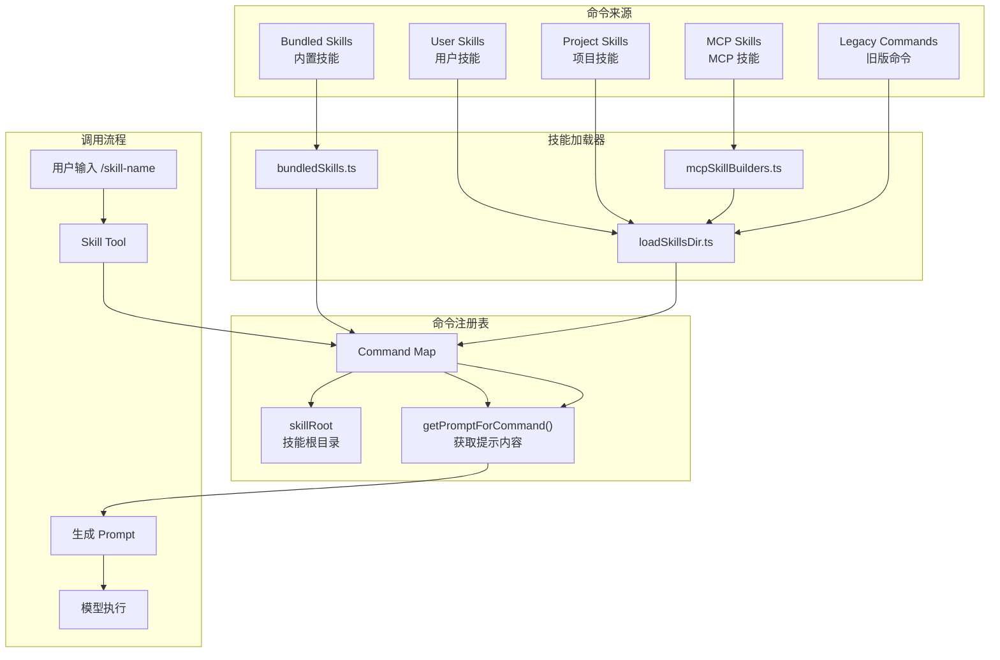

# 第二十一章：技能实战解析

技能（Skills）是 Claude Code 中最重要的扩展机制之一。通过技能，用户可以定义可复用的工作流程、自定义命令和行为模式。本章将深入分析技能系统的实现，包括内置技能、技能与命令的协作机制、MCP 技能转换器，以及用户自定义技能的创建方式。

## 21.1 技能系统概述

技能系统允许用户将复杂的、重复性的工作流程封装成可调用的命令。技能本质上是一段 Markdown 文档，包含执行指令和相关配置，通过特定的 frontmatter 元数据定义其行为。

### 技能类型分类

Claude Code 支持以下几种技能来源：

| 来源类型 | 说明 | 加载位置 |
|---------|------|---------|
| Bundled | 内置技能，编译进 CLI 二进制文件 | `src/skills/bundled/` |
| User | 用户全局技能，适用于所有项目 | `~/.claude/skills/` |
| Project | 项目级技能，仅在当前项目生效 | `.claude/skills/` |
| Managed | 企业策略管理的技能 | 策略配置目录 |
| MCP | MCP 服务器提供的技能 | MCP 连接 |

### 技能与命令的关系

技能在系统中以 `Command` 类型表示，是命令系统的扩展。下图展示了技能与命令系统的协作关系：



*图 21-1：技能与命令系统协作关系图*

## 21.2 内置技能分析

内置技能（Bundled Skills）是 Claude Code 预置的技能，编译进 CLI 二进制文件中，对所有用户可用。这些技能覆盖了配置管理、调试、代码审查等核心功能。

### 21.2.1 BundledSkillDefinition 结构

内置技能通过 `BundledSkillDefinition` 类型定义：

```typescript
// src/skills/bundledSkills.ts
export type BundledSkillDefinition = {
  name: string                    // 技能名称
  description: string             // 技能描述
  aliases?: string[]              // 可选别名
  whenToUse?: string              // 自动触发条件说明
  argumentHint?: string           // 参数提示
  allowedTools?: string[]         // 允许的工具列表
  model?: string                  // 可选模型指定
  disableModelInvocation?: boolean // 禁止自动调用
  userInvocable?: boolean         // 是否用户可调用
  isEnabled?: () => boolean       // 动态启用条件
  hooks?: HooksSettings           // 钩子配置
  context?: 'inline' | 'fork'     // 执行上下文
  agent?: string                  // 代理类型
  files?: Record<string, string>  // 附加文件
  getPromptForCommand: (args, context) => Promise<ContentBlockParam[]>
}
```

### 21.2.2 update-config 技能：配置管理

`update-config` 技能用于管理 Claude Code 的 settings.json 配置文件，包括权限、钩子、环境变量等设置。

**核心功能**：
- 权限配置（allow/deny 规则）
- 钩子配置（PreToolUse、PostToolUse 等）
- 环境变量设置
- MCP 服务器配置

**关键实现逻辑**：

```typescript
// src/skills/bundled/updateConfig.ts
export function registerUpdateConfigSkill(): void {
  registerBundledSkill({
    name: 'update-config',
    description:
      'Use this skill to configure the Claude Code harness via settings.json...',
    allowedTools: ['Read'],
    userInvocable: true,
    async getPromptForCommand(args) {
      // 动态生成 JSON Schema
      const jsonSchema = generateSettingsSchema()
      let prompt = UPDATE_CONFIG_PROMPT
      prompt += `\n\n## Full Settings JSON Schema\n\n\`\`\`json\n${jsonSchema}\n\`\`\``
      if (args) {
        prompt += `\n\n## User Request\n\n${args}`
      }
      return [{ type: 'text', text: prompt }]
    },
  })
}
```

技能提示文档中包含详细的配置示例和验证流程，确保用户能够正确配置钩子等复杂设置。

### 21.2.3 debug 技能：调试支持

`debug` 技能帮助用户诊断当前会话的问题，通过读取调试日志进行分析。

**特点**：
- 自动启用调试日志
- 读取最近的调试日志条目
- 支持 Grep 搜索错误和警告

```typescript
// src/skills/bundled/debug.ts
export function registerDebugSkill(): void {
  registerBundledSkill({
    name: 'debug',
    description: 'Enable debug logging for this session...',
    allowedTools: ['Read', 'Grep', 'Glob'],
    argumentHint: '[issue description]',
    disableModelInvocation: true,  // 需用户显式请求
    userInvocable: true,
    async getPromptForCommand(args, context) {
      const wasAlreadyLogging = enableDebugLogging()
      const debugLogPath = getDebugLogPath()
      // ... 读取日志尾部
      return [{ type: 'text', text: prompt }]
    },
  })
}
```

### 21.2.4 simplify 技能：代码审查

`simplify` 技能对修改的代码进行多维审查，包括代码复用、代码质量和效率三个方面。

**审查维度**：
1. **Code Reuse Review** - 检查是否有可复用的现有工具
2. **Code Quality Review** - 检查冗余状态、参数膨胀、复制粘贴等问题
3. **Efficiency Review** - 检查不必要的计算、缺失并发、内存问题等

技能使用 Agent Tool 并行启动三个审查代理：

```typescript
// src/skills/bundled/simplify.ts
const SIMPLIFY_PROMPT = `# Simplify: Code Review and Cleanup

Review all changed files for reuse, quality, and efficiency...

## Phase 2: Launch Three Review Agents in Parallel

Use the ${AGENT_TOOL_NAME} tool to launch all three agents concurrently...
`
```

### 21.2.5 skillify 技能：会话转技能

`skillify` 技能将当前会话的工作流程转化为可复用的技能文件。

**工作流程**：
1. 分析会话记忆和用户消息
2. 通过 AskUserQuestion 采访用户
3. 确定技能名称、描述、步骤
4. 创建 SKILL.md 文件

```typescript
// src/skills/bundled/skillify.ts
export function registerSkillifySkill(): void {
  registerBundledSkill({
    name: 'skillify',
    description: "Capture this session's repeatable process into a skill...",
    allowedTools: ['Read', 'Write', 'Edit', 'Glob', 'Grep', 'AskUserQuestion', 'Bash(mkdir:*)'],
    disableModelInvocation: true,
    async getPromptForCommand(args, context) {
      const sessionMemory = await getSessionMemoryContent()
      const userMessages = extractUserMessages(context.messages)
      // ... 构建采访提示
      return [{ type: 'text', text: prompt }]
    },
  })
}
```

### 21.2.6 内置技能注册流程

内置技能在启动时通过 `initBundledSkills` 函数注册：

```typescript
// src/skills/bundled/index.ts
export function initBundledSkills(): void {
  registerUpdateConfigSkill()
  registerKeybindingsSkill()
  registerVerifySkill()
  registerDebugSkill()
  registerLoremIpsumSkill()
  registerSkillifySkill()
  registerRememberSkill()
  registerSimplifySkill()
  registerBatchSkill()
  registerStuckSkill()
  // ... 功能标志控制的技能
  if (feature('AGENT_TRIGGERS')) {
    registerLoopSkill()
  }
  if (feature('BUILDING_CLAUDE_APPS')) {
    registerClaudeApiSkill()
  }
}
```

## 21.3 技能 Frontmatter 规范

技能文件使用 YAML frontmatter 定义元数据。`parseSkillFrontmatterFields` 函数解析这些字段：

### Frontmatter 示例

```markdown
---
name: my-workflow
description: 执行自定义工作流程
allowed-tools:
  - Read
  - Bash(git:*)
  - Edit
when_to_use: 当用户要求执行自定义流程时自动调用。示例: "运行 my-workflow", "执行自定义流程"
argument-hint: "[项目名称]"
arguments:
  - project_name
context: fork
effort: high
---

# My Workflow

## Inputs
- `$project_name`: 项目名称

## Goal
完成指定项目的特定工作流程。

## Steps
### 1. 准备阶段
检查项目状态...

**Success criteria**: 项目状态检查完成
```

### 字段解析实现

```typescript
// src/skills/loadSkillsDir.ts
export function parseSkillFrontmatterFields(
  frontmatter: FrontmatterData,
  markdownContent: string,
  resolvedName: string,
): {
  displayName: string | undefined
  description: string
  hasUserSpecifiedDescription: boolean
  allowedTools: string[]
  argumentHint: string | undefined
  argumentNames: string[]
  whenToUse: string | undefined
  model: string | undefined
  disableModelInvocation: boolean
  userInvocable: boolean
  hooks: HooksSettings | undefined
  executionContext: 'fork' | undefined
  agent: string | undefined
  effort: EffortValue | undefined
} {
  // ... 解析各字段
  return {
    displayName: frontmatter.name,
    description: validatedDescription ?? extractDescriptionFromMarkdown(markdownContent),
    allowedTools: parseSlashCommandToolsFromFrontmatter(frontmatter['allowed-tools']),
    argumentNames: parseArgumentNames(frontmatter.arguments),
    whenToUse: frontmatter.when_to_use,
    // ...
  }
}
```

### 关键字段说明

| 字段 | 类型 | 说明 |
|-----|------|------|
| `name` | string | 技能显示名称 |
| `description` | string | 一行描述 |
| `allowed-tools` | string[] | 允许的工具权限模式 |
| `when_to_use` | string | 自动触发条件，对自动调用至关重要 |
| `argument-hint` | string | 参数提示显示 |
| `arguments` | string[] | 参数名称列表 |
| `context` | 'fork' | 设置为 fork 时作为独立代理执行 |
| `effort` | string | 工作强度级别 |

## 21.4 技能加载机制

### 21.4.1 目录加载流程

`loadSkillsDir.ts` 实现了从各目录加载技能的核心逻辑：

```typescript
// src/skills/loadSkillsDir.ts
export const getSkillDirCommands = memoize(
  async (cwd: string): Promise<Command[]> => {
    const userSkillsDir = join(getClaudeConfigHomeDir(), 'skills')
    const managedSkillsDir = join(getManagedFilePath(), '.claude', 'skills')
    const projectSkillsDirs = getProjectDirsUpToHome('skills', cwd)

    // 并行加载所有技能目录
    const [managedSkills, userSkills, projectSkills, additionalSkills, legacyCommands] =
      await Promise.all([
        loadSkillsFromSkillsDir(managedSkillsDir, 'policySettings'),
        loadSkillsFromSkillsDir(userSkillsDir, 'userSettings'),
        // ...
      ])

    // 去重并返回
    return deduplicatedSkills
  }
)
```

### 21.4.2 技能目录结构

技能必须使用目录格式：

```
.claude/skills/
├── my-skill/
│   └── SKILL.md        # 必须命名为 SKILL.md
│   └── examples/
│       └── demo.md     # 附加文件（可选）
├── another-skill/
│   └── SKILL.md
```

加载逻辑只识别 `SKILL.md` 文件：

```typescript
async function loadSkillsFromSkillsDir(basePath: string, source: SettingSource) {
  const entries = await fs.readdir(basePath)
  for (const entry of entries) {
    if (!entry.isDirectory() && !entry.isSymbolicLink()) {
      return null  // 单个 .md 文件不支持
    }
    const skillFilePath = join(skillDirPath, 'SKILL.md')
    const content = await fs.readFile(skillFilePath)
    // ... 解析并创建 Command
  }
}
```

### 21.4.3 动态技能发现

当用户操作深层目录中的文件时，系统动态发现并加载相关技能：

```typescript
export async function discoverSkillDirsForPaths(filePaths: string[], cwd: string) {
  for (const filePath of filePaths) {
    let currentDir = dirname(filePath)
    while (currentDir.startsWith(resolvedCwd + pathSep)) {
      const skillDir = join(currentDir, '.claude', 'skills')
      if (!dynamicSkillDirs.has(skillDir)) {
        dynamicSkillDirs.add(skillDir)
        // 检查目录是否存在
        await fs.stat(skillDir)
        newDirs.push(skillDir)
      }
      currentDir = dirname(currentDir)
    }
  }
  return newDirs.sort((a, b) => b.split(pathSep).length - a.split(pathSep).length)
}
```

### 21.4.4 条件技能激活

具有 `paths` frontmatter 的技能在匹配路径时才激活：

```typescript
export function activateConditionalSkillsForPaths(filePaths: string[], cwd: string) {
  for (const [name, skill] of conditionalSkills) {
    if (skill.paths && skill.paths.length > 0) {
      const skillIgnore = ignore().add(skill.paths)
      for (const filePath of filePaths) {
        if (skillIgnore.ignores(relativePath)) {
          dynamicSkills.set(name, skill)
          conditionalSkills.delete(name)
          activated.push(name)
          break
        }
      }
    }
  }
  return activated
}
```

## 21.5 MCP Skill Builder

MCP Skill Builder 将 MCP 服务器提供的工具转换为 Claude Code 技能。

### 21.5.1 注册机制

为避免循环依赖，系统使用写入一次的注册模式：

```typescript
// src/skills/mcpSkillBuilders.ts
export type MCPSkillBuilders = {
  createSkillCommand: typeof createSkillCommand
  parseSkillFrontmatterFields: typeof parseSkillFrontmatterFields
}

let builders: MCPSkillBuilders | null = null

export function registerMCPSkillBuilders(b: MCPSkillBuilders): void {
  builders = b
}

export function getMCPSkillBuilders(): MCPSkillBuilders {
  if (!builders) {
    throw new Error('MCP skill builders not registered')
  }
  return builders
}
```

### 21.5.2 注册时机

注册在 `loadSkillsDir.ts` 模块初始化时完成：

```typescript
// src/skills/loadSkillsDir.ts (末尾)
registerMCPSkillBuilders({
  createSkillCommand,
  parseSkillFrontmatterFields,
})
```

这种设计确保：
- `mcpSkillBuilders.ts` 是依赖图的叶子节点
- `mcpSkills.ts` 可以依赖它而不形成循环
- 在 Bun 打包的二进制文件中正确运行

### 21.5.3 安全考虑

MCP 技能来自远程服务器，被视为不可信。系统禁止执行其 Markdown 中的 shell 命令：

```typescript
// createSkillCommand 中的安全处理
if (loadedFrom !== 'mcp') {
  finalContent = await executeShellCommandsInPrompt(finalContent, ...)
}
// MCP 技能跳过 shell 命令执行
```

## 21.6 用户自定义技能

### 21.6.1 创建技能文件

用户可在以下位置创建技能：

1. **用户全局技能**：`~/.claude/skills/<skill-name>/SKILL.md`
2. **项目技能**：`.claude/skills/<skill-name>/SKILL.md`

### 21.6.2 技能模板示例

以下是一个实用的技能模板：

```markdown
---
name: code-review
description: 执行代码审查流程
allowed-tools:
  - Read
  - Grep
  - Glob
  - Bash(git:*)
when_to_use: 当用户要求审查代码或 PR 时调用。示例: "review this code", "审查代码", "检查 PR"
argument-hint: "[target branch or file]"
arguments:
  - target
effort: medium
---

# Code Review

## Inputs
- `$target`: 要审查的目标（分支、文件或目录）

## Goal
完成全面的代码审查，识别问题并提出改进建议。

## Steps

### 1. 收集变更
使用 git diff 或文件读取获取变更内容。

**Success criteria**: 变更内容已收集完成

### 2. 分析代码质量
检查以下方面：
- 代码风格一致性
- 潜在的安全问题
- 性能考虑
- 测试覆盖

**Success criteria**: 问题清单已生成

### 3. 输出审查报告
整理发现并提供改进建议。

**Success criteria**: 审查报告已完成
```

### 21.6.3 使用 skillify 创建技能

用户可通过 `/skillify` 命令将当前会话的工作流程转化为技能：

1. 在完成一个可复用流程后调用 `/skillify`
2. 系统分析会话历史
3. 通过问答确认技能细节
4. 自动生成 SKILL.md 文件

### 21.6.4 技能最佳实践

1. **明确的 `when_to_use`**：确保 Claude 能正确识别调用时机
2. **具体的 Success Criteria**：帮助模型判断步骤完成
3. **合理的 `allowed-tools`**：使用精确模式如 `Bash(git:*)` 而非 `Bash`
4. **fork 上下文**：用于不需要用户中途干预的自包含任务
5. **附加文件**：将大型参考文档放入 `files` 目录

## 21.7 小结

本章深入分析了 Claude Code 的技能系统：

1. **内置技能**提供了配置管理、调试、代码审查等核心功能
2. **技能 Frontmatter** 定义了技能的元数据和行为特征
3. **加载机制**支持多级目录、动态发现和条件激活
4. **MCP Skill Builder** 安全地将 MCP 工具转换为技能
5. **用户自定义技能**通过 SKILL.md 文件创建可复用工作流程

技能系统是 Claude Code 扩展性的关键，理解其实现有助于创建高效的自定义工作流程。