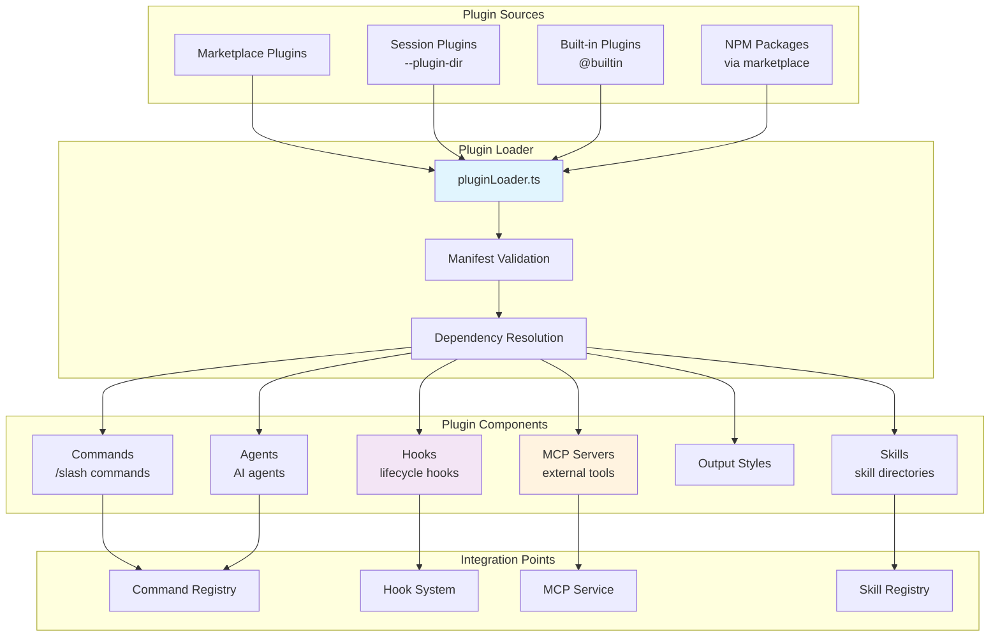

# 第 22 章：插件系统

## 22.1 引言

Claude Code 的插件系统是一个强大的扩展机制，允许用户通过安装插件来增强 CLI 的功能。插件可以提供多种组件，包括自定义命令（commands）、AI 代理（agents）、技能（skills）、钩子（hooks）、输出样式（output-styles）以及 MCP 服务器集成。

插件系统与内置技能系统（bundled skills）有着明确的区分：

- **内置插件（Built-in Plugins）**：随 CLI 发布，用户可通过 `/plugin` UI 启用/禁用，设置持久化到用户配置
- **内置技能（Bundled Skills）**：编译进 CLI 二进制文件，对所有用户可用，用于复杂设置或自动启用逻辑的功能

### 插件架构图



**图 22-1：插件系统架构图**

## 22.2 插件设计模式

### 22.2.1 插件标识符格式

插件使用 `{name}@{marketplace}` 格式作为唯一标识符，这种设计确保了：

- 来自不同市场的同名插件不会冲突
- 内置插件使用 `{name}@builtin` 格式区分
- 标识符可直接用于设置存储和缓存路径

```typescript
// src/plugins/builtinPlugins.ts:37-39
export function isBuiltinPluginId(pluginId: string): boolean {
  return pluginId.endsWith(`@${BUILTIN_MARKETPLACE_NAME}`)
}
```

### 22.2.2 插件目录结构

插件遵循标准化的目录结构：

```
my-plugin/
├── plugin.json          # 清单文件（可选）
├── commands/            # 自定义斜杠命令
│   ├── build.md
│   └── deploy.md
├── agents/              # 自定义 AI 代理
│   └── test-runner.md
├── skills/              # 技能目录
│   └── my-skill/
│       └── SKILL.md
├── hooks/               # 钩子配置
│   └── hooks.json
└── .mcp.json            # MCP 服务器配置（可选）
```

### 22.2.3 插件清单 Schema

插件清单通过 Zod schema 进行严格验证，确保配置的正确性：

```typescript
// src/utils/plugins/schemas.ts:274-320
const PluginManifestMetadataSchema = lazySchema(() =>
  z.object({
    name: z.string().min(1, 'Plugin name cannot be empty')
      .refine(name => !name.includes(' '), {
        message: 'Plugin name cannot contain spaces. Use kebab-case'
      }),
    version: z.string().optional()
      .describe('Semantic version (e.g., 1.2.3)'),
    description: z.string().optional()
      .describe('Brief, user-facing explanation'),
    author: PluginAuthorSchema().optional(),
    homepage: z.string().url().optional(),
    repository: z.string().optional(),
    license: z.string().optional(),
    keywords: z.array(z.string()).optional(),
    dependencies: z.array(DependencyRefSchema()).optional()
      .describe('Plugins that must be enabled for this plugin'),
  })
)
```

### 22.2.4 插件组件类型

插件可以提供以下组件类型：

```typescript
// src/types/plugin.ts:72-77
export type PluginComponent =
  | 'commands'
  | 'agents'
  | 'skills'
  | 'hooks'
  | 'output-styles'
```

## 22.3 内置插件（builtinPlugins.ts）

### 22.3.1 核心设计

内置插件系统为 CLI 提供了随发布附带的可切换功能。与硬编码的斜杠命令不同，内置插件：

- 在 `/plugin` UI 的 "Built-in" 区域显示
- 用户可启用/禁用，设置持久化到 `settings.json`
- 可提供多个组件（技能、钩子、MCP 服务器）

```typescript
// src/plugins/builtinPlugins.ts:1-14
/**
 * Built-in Plugin Registry
 *
 * Built-in plugins differ from bundled skills (src/skills/bundled/) in that:
 * - They appear in the /plugin UI under a "Built-in" section
 * - Users can enable/disable them (persisted to user settings)
 * - They can provide multiple components (skills, hooks, MCP servers)
 *
 * Plugin IDs use the format `{name}@builtin` to distinguish them from
 * marketplace plugins (`{name}@{marketplace}`).
 */
```

### 22.3.2 插件注册机制

内置插件通过注册表管理：

```typescript
// src/plugins/builtinPlugins.ts:21-32
const BUILTIN_PLUGINS: Map<string, BuiltinPluginDefinition> = new Map()

export const BUILTIN_MARKETPLACE_NAME = 'builtin'

export function registerBuiltinPlugin(
  definition: BuiltinPluginDefinition,
): void {
  BUILTIN_PLUGINS.set(definition.name, definition)
}
```

### 22.3.3 插件定义结构

每个内置插件通过 `BuiltinPluginDefinition` 类型定义：

```typescript
// src/types/plugin.ts:18-35
export type BuiltinPluginDefinition = {
  /** Plugin name (used in `{name}@builtin` identifier) */
  name: string
  /** Description shown in the /plugin UI */
  description: string
  /** Optional version string */
  version?: string
  /** Skills provided by this plugin */
  skills?: BundledSkillDefinition[]
  /** Hooks provided by this plugin */
  hooks?: HooksSettings
  /** MCP servers provided by this plugin */
  mcpServers?: Record<string, McpServerConfig>
  /** Whether this plugin is available */
  isAvailable?: () => boolean
  /** Default enabled state before user preference */
  defaultEnabled?: boolean
}
```

### 22.3.4 启用/禁用状态管理

插件状态根据用户设置和默认值确定：

```typescript
// src/plugins/builtinPlugins.ts:57-102
export function getBuiltinPlugins(): {
  enabled: LoadedPlugin[]
  disabled: LoadedPlugin[]
} {
  const settings = getSettings_DEPRECATED()
  const enabled: LoadedPlugin[] = []
  const disabled: LoadedPlugin[] = []

  for (const [name, definition] of BUILTIN_PLUGINS) {
    if (definition.isAvailable && !definition.isAvailable()) {
      continue  // 不可用插件完全隐藏
    }

    const pluginId = `${name}@${BUILTIN_MARKETPLACE_NAME}`
    const userSetting = settings?.enabledPlugins?.[pluginId]
    // 启用状态：用户偏好 > 插件默认 > true
    const isEnabled =
      userSetting !== undefined
        ? userSetting === true
        : (definition.defaultEnabled ?? true)

    const plugin: LoadedPlugin = {
      name,
      manifest: {
        name,
        description: definition.description,
        version: definition.version,
      },
      path: BUILTIN_MARKETPLACE_NAME,
      source: pluginId,
      repository: pluginId,
      enabled: isEnabled,
      isBuiltin: true,
      hooksConfig: definition.hooks,
      mcpServers: definition.mcpServers,
    }

    if (isEnabled) {
      enabled.push(plugin)
    } else {
      disabled.push(plugin)
    }
  }

  return { enabled, disabled }
}
```

### 22.3.5 当前内置插件状态

目前内置插件系统已搭建框架，但尚未注册具体插件：

```typescript
// src/plugins/bundled/index.ts:1-23
/**
 * Built-in Plugin Initialization
 *
 * Not all bundled features should be built-in plugins — use this for
 * features that users should be able to explicitly enable/disable.
 *
 * To add a new built-in plugin:
 * 1. Import registerBuiltinPlugin from '../builtinPlugins.js'
 * 2. Call registerBuiltinPlugin() with the plugin definition here
 */
export function initBuiltinPlugins(): void {
  // No built-in plugins registered yet — this is the scaffolding for
  // migrating bundled skills that should be user-toggleable.
}
```

## 22.4 插件与技能集成

### 22.4.1 技能定义转换

内置插件提供的技能转换为命令对象：

```typescript
// src/plugins/builtinPlugins.ts:108-121
export function getBuiltinPluginSkillCommands(): Command[] {
  const { enabled } = getBuiltinPlugins()
  const commands: Command[] = []

  for (const plugin of enabled) {
    const definition = BUILTIN_PLUGINS.get(plugin.name)
    if (!definition?.skills) continue
    for (const skill of definition.skills) {
      commands.push(skillDefinitionToCommand(skill))
    }
  }

  return commands
}
```

### 22.4.2 技能到命令的转换逻辑

```typescript
// src/plugins/builtinPlugins.ts:132-159
function skillDefinitionToCommand(definition: BundledSkillDefinition): Command {
  return {
    type: 'prompt',
    name: definition.name,
    description: definition.description,
    hasUserSpecifiedDescription: true,
    allowedTools: definition.allowedTools ?? [],
    argumentHint: definition.argumentHint,
    whenToUse: definition.whenToUse,
    model: definition.model,
    disableModelInvocation: definition.disableModelInvocation ?? false,
    userInvocable: definition.userInvocable ?? true,
    contentLength: 0,
    // 'bundled' not 'builtin' — keeps skills in Skill tool's listing
    source: 'bundled',
    loadedFrom: 'bundled',
    hooks: definition.hooks,
    context: definition.context,
    agent: definition.agent,
    isEnabled: definition.isEnabled ?? (() => true),
    isHidden: !(definition.userInvocable ?? true),
    progressMessage: 'running',
    getPromptForCommand: definition.getPromptForCommand,
  }
}
```

### 22.4.3 Bundled Skill 注册模式

内置技能通过程序化注册实现：

```typescript
// src/skills/bundledSkills.ts:52-100
export function registerBundledSkill(definition: BundledSkillDefinition): void {
  const { files } = definition

  let skillRoot: string | undefined
  let getPromptForCommand = definition.getPromptForCommand

  if (files && Object.keys(files).length > 0) {
    skillRoot = getBundledSkillExtractDir(definition.name)
    // Closure-local memoization: extract once per process
    let extractionPromise: Promise<string | null> | undefined
    const inner = definition.getPromptForCommand
    getPromptForCommand = async (args, ctx) => {
      extractionPromise ??= extractBundledSkillFiles(definition.name, files)
      const extractedDir = await extractionPromise
      const blocks = await inner(args, ctx)
      if (extractedDir === null) return blocks
      return prependBaseDir(blocks, extractedDir)
    }
  }

  const command: Command = {
    type: 'prompt',
    name: definition.name,
    // ... 其他属性
    source: 'bundled',
    loadedFrom: 'bundled',
    // ...
  }
  bundledSkills.push(command)
}
```

### 22.4.4 技能初始化流程

```typescript
// src/skills/bundled/index.ts:24-79
export function initBundledSkills(): void {
  registerUpdateConfigSkill()
  registerKeybindingsSkill()
  registerVerifySkill()
  registerDebugSkill()
  registerLoremIpsumSkill()
  registerSkillifySkill()
  registerRememberSkill()
  registerSimplifySkill()
  registerBatchSkill()
  registerStuckSkill()
  
  // 条件性注册的技能
  if (feature('KAIROS') || feature('KAIROS_DREAM')) {
    const { registerDreamSkill } = require('./dream.js')
    registerDreamSkill()
  }
  if (feature('AGENT_TRIGGERS')) {
    const { registerLoopSkill } = require('./loop.js')
    registerLoopSkill()
  }
  if (feature('BUILDING_CLAUDE_APPS')) {
    const { registerClaudeApiSkill } = require('./claudeApi.js')
    registerClaudeApiSkill()
  }
  if (shouldAutoEnableClaudeInChrome()) {
    registerClaudeInChromeSkill()
  }
}
```

### 22.4.5 技能示例：remember 技能

```typescript
// src/skills/bundled/remember.ts:4-82
export function registerRememberSkill(): void {
  if (process.env.USER_TYPE !== 'ant') {
    return  // 仅对特定用户类型可用
  }

  const SKILL_PROMPT = `# Memory Review
## Goal
Review the user's memory landscape and produce a clear report...
`

  registerBundledSkill({
    name: 'remember',
    description: 'Review auto-memory entries and propose promotions...',
    whenToUse: 'Use when the user wants to review, organize, or promote...',
    userInvocable: true,
    isEnabled: () => isAutoMemoryEnabled(),
    async getPromptForCommand(args) {
      let prompt = SKILL_PROMPT
      if (args) {
        prompt += `\n## Additional context from user\n\n${args}`
      }
      return [{ type: 'text', text: prompt }]
    },
  })
}
```

## 22.5 插件与 MCP 集成

### 22.5.1 MCP 服务器加载机制

插件可通过多种方式提供 MCP 服务器：

```typescript
// src/utils/plugins/mcpPluginIntegration.ts:131-212
export async function loadPluginMcpServers(
  plugin: LoadedPlugin,
  errors: PluginError[] = [],
): Promise<Record<string, McpServerConfig> | undefined> {
  let servers: Record<string, McpServerConfig> = {}

  // 1. 检查插件目录中的 .mcp.json（最低优先级）
  const defaultMcpServers = await loadMcpServersFromFile(
    plugin.path,
    '.mcp.json',
  )
  if (defaultMcpServers) {
    servers = { ...servers, ...defaultMcpServers }
  }

  // 2. 处理清单中的 mcpServers（更高优先级）
  if (plugin.manifest.mcpServers) {
    const mcpServersSpec = plugin.manifest.mcpServers

    if (typeof mcpServersSpec === 'string') {
      // MCPB 文件或 JSON 文件路径
      if (isMcpbSource(mcpServersSpec)) {
        const mcpbServers = await loadMcpServersFromMcpb(
          plugin,
          mcpServersSpec,
          errors,
        )
        if (mcpbServers) {
          servers = { ...servers, ...mcpbServers }
        }
      } else {
        const mcpServers = await loadMcpServersFromFile(
          plugin.path,
          mcpServersSpec,
        )
        if (mcpServers) {
          servers = { ...servers, ...mcpServers }
        }
      }
    } else if (Array.isArray(mcpServersSpec)) {
      // 多个 MCP 配置源
      const results = await Promise.all(
        mcpServersSpec.map(async spec => {
          // ... 处理每个配置源
        }),
      )
      for (const result of results) {
        if (result) {
          servers = { ...servers, ...result }
        }
      }
    } else {
      // 直接内联 MCP 服务器配置
      servers = { ...servers, ...mcpServersSpec }
    }
  }

  return Object.keys(servers).length > 0 ? servers : undefined
}
```

### 22.5.2 MCPB 文件处理

MCPB（MCP Bundle）文件是一种打包格式，支持远程 URL 和本地路径：

```typescript
// src/utils/plugins/mcpPluginIntegration.ts:34-124
async function loadMcpServersFromMcpb(
  plugin: LoadedPlugin,
  mcpbPath: string,
  errors: PluginError[],
): Promise<Record<string, McpServerConfig> | null> {
  try {
    const result = await loadMcpbFile(
      mcpbPath,
      plugin.path,
      pluginId,
      status => {
        logForDebugging(`MCPB [${plugin.name}]: ${status}`)
      },
    )

    // 检查是否需要用户配置
    if ('status' in result && result.status === 'needs-config') {
      logForDebugging(
        `MCPB ${mcpbPath} requires user configuration. ` +
          `User can configure via: /plugin → Manage plugins → ${plugin.name}`
      )
      return null  // 暂不加载，等待用户配置
    }

    const serverName = successResult.manifest.name
    return { [serverName]: successResult.mcpConfig }
  } catch (error) {
    // 错误处理...
    return null
  }
}
```

### 22.5.3 环境变量解析

插件 MCP 服务器支持特殊的环境变量替换：

```typescript
// src/utils/plugins/mcpPluginIntegration.ts:465-582
export function resolvePluginMcpEnvironment(
  config: McpServerConfig,
  plugin: { path: string; source: string },
  userConfig?: UserConfigValues,
  errors?: PluginError[],
  pluginName?: string,
  serverName?: string,
): McpServerConfig {
  const resolveValue = (value: string): string => {
    // 1. 替换插件特定变量
    let resolved = substitutePluginVariables(value, plugin)

    // 2. 替换用户配置变量
    if (userConfig) {
      resolved = substituteUserConfigVariables(resolved, userConfig)
    }

    // 3. 扩展通用环境变量
    const { expanded, missingVars } = expandEnvVarsInString(resolved)
    allMissingVars.push(...missingVars)

    return expanded
  }

  // 处理不同服务器类型
  switch (config.type) {
    case undefined:
    case 'stdio': {
      const stdioConfig = { ...config }
      // 解析命令和参数
      if (stdioConfig.command) {
        stdioConfig.command = resolveValue(stdioConfig.command)
      }
      if (stdioConfig.args) {
        stdioConfig.args = stdioConfig.args.map(arg => resolveValue(arg))
      }
      // 添加插件环境变量
      const resolvedEnv: Record<string, string> = {
        CLAUDE_PLUGIN_ROOT: plugin.path,
        CLAUDE_PLUGIN_DATA: getPluginDataDir(plugin.source),
        ...(stdioConfig.env || {}),
      }
      // ...
    }
    // 处理 HTTP/SSE/WebSocket 类型...
  }
}
```

### 22.5.4 插件作用域添加

为避免不同插件间的服务器名称冲突，系统为插件 MCP 服务器添加作用域前缀：

```typescript
// src/utils/plugins/mcpPluginIntegration.ts:341-360
export function addPluginScopeToServers(
  servers: Record<string, McpServerConfig>,
  pluginName: string,
  pluginSource: string,
): Record<string, ScopedMcpServerConfig> {
  const scopedServers: Record<string, ScopedMcpServerConfig> = {}

  for (const [name, config] of Object.entries(servers)) {
    // 添加插件前缀避免冲突
    const scopedName = `plugin:${pluginName}:${name}`
    const scoped: ScopedMcpServerConfig = {
      ...config,
      scope: 'dynamic',  // 使用动态作用域
      pluginSource,
    }
    scopedServers[scopedName] = scoped
  }

  return scopedServers
}
```

### 22.5.5 MCP 服务器提取

```typescript
// src/utils/plugins/mcpPluginIntegration.ts:366-429
export async function extractMcpServersFromPlugins(
  plugins: LoadedPlugin[],
  errors: PluginError[] = [],
): Promise<Record<string, ScopedMcpServerConfig>> {
  const allServers: Record<string, ScopedMcpServerConfig> = {}

  const scopedResults = await Promise.all(
    plugins.map(async plugin => {
      if (!plugin.enabled) return null

      const servers = await loadPluginMcpServers(plugin, errors)
      if (!servers) return null

      // 解析环境变量
      const resolvedServers: Record<string, McpServerConfig> = {}
      for (const [name, config] of Object.entries(servers)) {
        const userConfig = buildMcpUserConfig(plugin, name)
        try {
          resolvedServers[name] = resolvePluginMcpEnvironment(
            config, plugin, userConfig, errors,
            plugin.name, name,
          )
        } catch (err) {
          errors?.push({
            type: 'generic-error',
            source: name,
            plugin: plugin.name,
            error: errorMessage(err),
          })
        }
      }

      // 缓存未解析的服务器
      plugin.mcpServers = servers

      return addPluginScopeToServers(
        resolvedServers, plugin.name, plugin.source,
      )
    }),
  )

  for (const scopedServers of scopedResults) {
    if (scopedServers) {
      Object.assign(allServers, scopedServers)
    }
  }

  return allServers
}
```

## 22.6 插件钩子系统

### 22.6.1 钩子加载机制

插件钩子通过 `loadPluginHooks.ts` 模块加载和注册：

```typescript
// src/utils/plugins/loadPluginHooks.ts:91-157
export const loadPluginHooks = memoize(async (): Promise<void> => {
  const { enabled } = await loadAllPluginsCacheOnly()
  const allPluginHooks: Record<HookEvent, PluginHookMatcher[]> = {
    PreToolUse: [],
    PostToolUse: [],
    PostToolUseFailure: [],
    // ... 所有钩子事件
  }

  for (const plugin of enabled) {
    if (!plugin.hooksConfig) continue

    logForDebugging(`Loading hooks from plugin: ${plugin.name}`)
    const pluginMatchers = convertPluginHooksToMatchers(plugin)

    // 合并插件钩子到主集合
    for (const event of Object.keys(pluginMatchers) as HookEvent[]) {
      allPluginHooks[event].push(...pluginMatchers[event])
    }
  }

  // 清除并注册（原子操作）
  clearRegisteredPluginHooks()
  registerHookCallbacks(allPluginHooks)

  const totalHooks = Object.values(allPluginHooks).reduce(
    (sum, matchers) => sum + matchers.reduce((s, m) => s + m.hooks.length, 0),
    0,
  )
  logForDebugging(
    `Registered ${totalHooks} hooks from ${enabled.length} plugins`,
  )
})
```

### 22.6.2 钩子事件类型

插件支持完整的生命周期钩子事件：

```typescript
// src/utils/plugins/loadPluginHooks.ts:31-59
function convertPluginHooksToMatchers(
  plugin: LoadedPlugin,
): Record<HookEvent, PluginHookMatcher[]> {
  const pluginMatchers: Record<HookEvent, PluginHookMatcher[]> = {
    PreToolUse: [],
    PostToolUse: [],
    PostToolUseFailure: [],
    PermissionDenied: [],
    Notification: [],
    UserPromptSubmit: [],
    SessionStart: [],
    SessionEnd: [],
    Stop: [],
    StopFailure: [],
    SubagentStart: [],
    SubagentStop: [],
    PreCompact: [],
    PostCompact: [],
    PermissionRequest: [],
    Setup: [],
    TeammateIdle: [],
    TaskCreated: [],
    TaskCompleted: [],
    Elicitation: [],
    ElicitationResult: [],
    ConfigChange: [],
    WorktreeCreate: [],
    WorktreeRemove: [],
    InstructionsLoaded: [],
    CwdChanged: [],
    FileChanged: [],
  }
  // ...
}
```

### 22.6.3 钩子转换逻辑

```typescript
// src/utils/plugins/loadPluginHooks.ts:28-86
function convertPluginHooksToMatchers(
  plugin: LoadedPlugin,
): Record<HookEvent, PluginHookMatcher[]> {
  // ... 初始化 pluginMatchers

  if (!plugin.hooksConfig) {
    return pluginMatchers
  }

  for (const [event, matchers] of Object.entries(plugin.hooksConfig)) {
    const hookEvent = event as HookEvent
    if (!pluginMatchers[hookEvent]) continue

    for (const matcher of matchers) {
      if (matcher.hooks.length > 0) {
        pluginMatchers[hookEvent].push({
          matcher: matcher.matcher,
          hooks: matcher.hooks,
          pluginRoot: plugin.path,
          pluginName: plugin.name,
          pluginId: plugin.source,
        })
      }
    }
  }

  return pluginMatchers
}
```

### 22.6.4 热重载支持

插件钩子支持设置变更时的热重载：

```typescript
// src/utils/plugins/loadPluginHooks.ts:255-287
export function setupPluginHookHotReload(): void {
  if (hotReloadSubscribed) return
  hotReloadSubscribed = true

  lastPluginSettingsSnapshot = getPluginAffectingSettingsSnapshot()

  settingsChangeDetector.subscribe(source => {
    if (source === 'policySettings') {
      const newSnapshot = getPluginAffectingSettingsSnapshot()
      if (newSnapshot === lastPluginSettingsSnapshot) {
        logForDebugging(
          'Plugin hooks: skipping reload, settings unchanged',
        )
        return
      }

      lastPluginSettingsSnapshot = newSnapshot
      logForDebugging(
        'Plugin hooks: reloading due to settings change',
      )

      // 清除所有插件相关缓存
      clearPluginCache('loadPluginHooks: settings changed')
      clearPluginHookCache()

      // 重新加载钩子
      void loadPluginHooks()
    }
  })
}
```

## 22.7 插件错误处理

### 22.7.1 错误类型定义

插件系统使用类型化的错误处理，便于诊断和 UI 展示：

```typescript
// src/types/plugin.ts:101-284
export type PluginError =
  | { type: 'path-not-found'; source: string; plugin?: string; path: string; component: PluginComponent }
  | { type: 'git-auth-failed'; source: string; plugin?: string; gitUrl: string; authType: 'ssh' | 'https' }
  | { type: 'git-timeout'; source: string; plugin?: string; gitUrl: string; operation: 'clone' | 'pull' }
  | { type: 'network-error'; source: string; plugin?: string; url: string; details?: string }
  | { type: 'manifest-parse-error'; source: string; plugin?: string; manifestPath: string; parseError: string }
  | { type: 'manifest-validation-error'; source: string; plugin?: string; manifestPath: string; validationErrors: string[] }
  | { type: 'plugin-not-found'; source: string; pluginId: string; marketplace: string }
  | { type: 'marketplace-not-found'; source: string; marketplace: string; availableMarketplaces: string[] }
  | { type: 'mcp-config-invalid'; source: string; plugin: string; serverName: string; validationError: string }
  | { type: 'hook-load-failed'; source: string; plugin: string; hookPath: string; reason: string }
  | { type: 'component-load-failed'; source: string; plugin: string; component: PluginComponent; path: string; reason: string }
  | { type: 'dependency-unsatisfied'; source: string; plugin: string; dependency: string; reason: 'not-enabled' | 'not-found' }
  | { type: 'generic-error'; source: string; plugin?: string; error: string }
  // ... 更多错误类型
```

### 22.7.2 错误消息生成

```typescript
// src/types/plugin.ts:295-363
export function getPluginErrorMessage(error: PluginError): string {
  switch (error.type) {
    case 'generic-error':
      return error.error
    case 'path-not-found':
      return `Path not found: ${error.path} (${error.component})`
    case 'git-auth-failed':
      return `Git authentication failed (${error.authType}): ${error.gitUrl}`
    case 'plugin-not-found':
      return `Plugin ${error.pluginId} not found in marketplace ${error.marketplace}`
    case 'mcp-config-invalid':
      return `MCP server ${error.serverName} invalid: ${error.validationError}`
    case 'dependency-unsatisfied': {
      const hint =
        error.reason === 'not-enabled'
          ? 'disabled — enable it or remove the dependency'
          : 'not found in any configured marketplace'
      return `Dependency "${error.dependency}" is ${hint}`
    }
    // ... 处理所有错误类型
  }
}
```

## 22.8 总结

Claude Code 的插件系统采用了模块化、可扩展的设计：

1. **清晰的标识符系统**：`{name}@{marketplace}` 格式确保唯一性和来源追踪
2. **丰富的组件支持**：命令、代理、技能、钩子、MCP 服务器等多种扩展点
3. **类型安全**：Zod schema 验证确保配置正确性
4. **灵活的状态管理**：用户偏好优先，默认值作为备选
5. **完整的错误处理**：类型化错误便于诊断和用户反馈
6. **热重载能力**：设置变更时自动更新插件钩子

内置插件系统目前处于框架阶段，为未来将内置技能迁移为用户可切换的插件提供了基础设施。通过与 MCP 服务的深度集成，插件能够无缝扩展 Claude Code 的工具能力。

---

**相关章节**：
- 第 23 章：插件加载器详解
- 第 24 章：Marketplace 系统
- 第 25 章：钩子系统