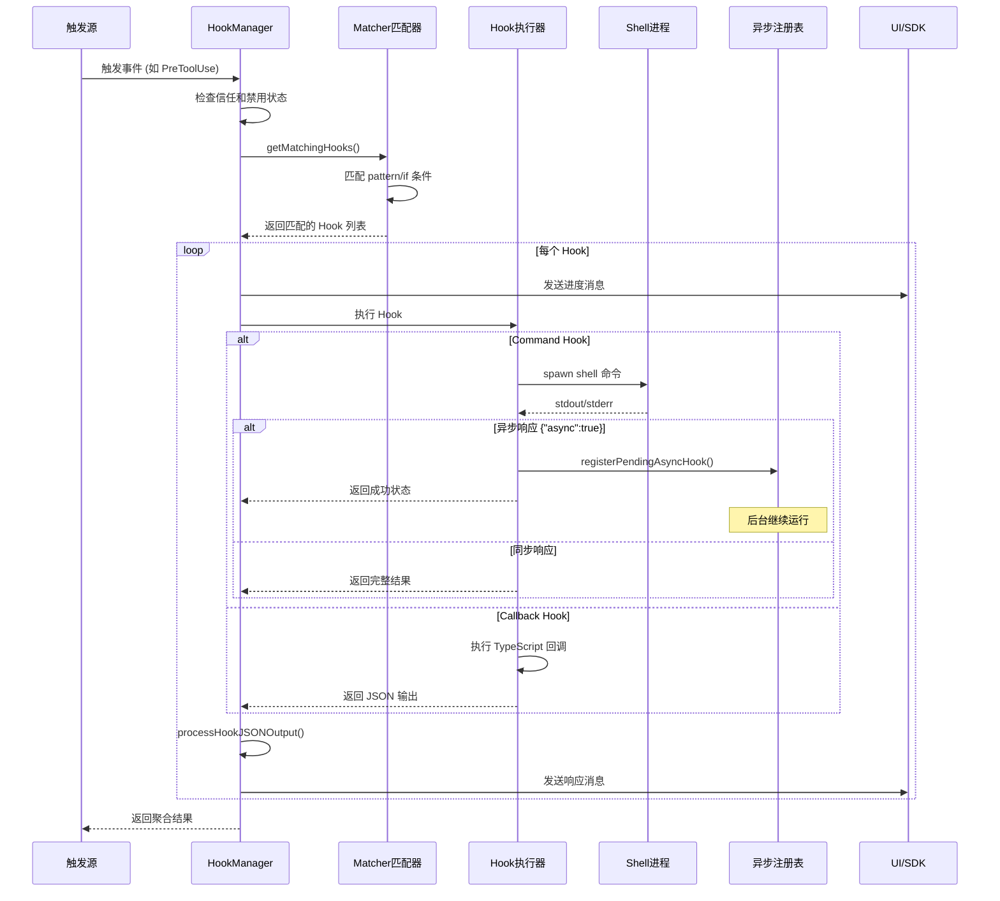

# 第 23 章: Hook 系统

## 23.1 引言

Hook（钩子）系统是 Claude Code 的生命周期定制化机制，允许用户在特定事件触发时执行自定义的 shell 命令或 TypeScript 回调。通过 Hook 系统，用户可以：

- **拦截工具调用**：在工具执行前后注入自定义逻辑
- **管理会话生命周期**：响应会话启动、结束、压缩等事件
- **处理权限请求**：自动批准或拒绝特定权限请求
- **监控配置变更**：审计配置文件的变化

Hook 系统的设计遵循以下核心原则：

1. **安全性优先**：所有 Hook 在交互模式下都需要工作区信任验证
2. **异步执行**：Hook 可以异步运行，不阻塞主流程
3. **可扩展性**：支持多种 Hook 类型（command、prompt、agent、http、callback、function）

源代码位置：
- `/Users/hw/workspaces/projects/claude-wiki/src/utils/hooks.ts` - Hook 执行核心逻辑
- `/Users/hw/workspaces/projects/claude-wiki/src/types/hooks.ts` - Hook 类型定义

---

## 23.2 Hook 事件类型概览

Claude Code 定义了丰富的 Hook 事件类型，覆盖了从会话生命周期到工具执行的各个环节。

### 事件类型列表

| 事件类型 | 触发时机 | 主要用途 |
|---------|---------|---------|
| `PreToolUse` | 工具执行前 | 输入验证、权限拦截 |
| `PostToolUse` | 工具执行成功后 | 结果处理、日志记录 |
| `PostToolUseFailure` | 工具执行失败后 | 错误处理、重试逻辑 |
| `SessionStart` | 会话启动时 | 初始化环境、设置变量 |
| `SessionEnd` | 会话结束时 | 清理资源、保存状态 |
| `Stop` | 主线程停止时 | 最终输出处理 |
| `StopFailure` | 主线程错误停止时 | 错误报告 |
| `SubagentStart` | 子代理启动时 | 子代理初始化 |
| `SubagentStop` | 子代理停止时 | 子代理结果处理 |
| `Setup` | 初始化或维护触发时 | 环境设置 |
| `PreCompact` | 会话压缩前 | 自定义压缩指令 |
| `PostCompact` | 会话压缩后 | 压缩后处理 |
| `UserPromptSubmit` | 用户提交提示时 | 提示预处理 |
| `Notification` | 通知发送时 | 通知拦截/转发 |
| `PermissionRequest` | 权限请求时 | 自动批准/拒绝 |
| `PermissionDenied` | 权限被拒绝时 | 记录拒绝原因 |
| `TeammateIdle` | Teammate 空闲时 | 防止空闲 |
| `TaskCreated` | 任务创建时 | 任务验证 |
| `TaskCompleted` | 任务完成时 | 完成后处理 |
| `Elicitation` | MCP Elicitation 请求时 | 自动响应 |
| `ElicitationResult` | Elicitation 结果时 | 结果处理 |
| `ConfigChange` | 配置变更时 | 变更审计 |
| `InstructionsLoaded` | 指令文件加载时 | 加载监控 |
| `CwdChanged` | 工作目录变更时 | 目录切换处理 |
| `FileChanged` | 文件变更时 | 文件监控 |
| `WorktreeCreate` | Worktree 创建时 | Worktree 定位 |

事件类型定义位于 `src/entrypoints/sdk/coreTypes.ts`（第 25-53 行）：

```typescript
export const HOOK_EVENTS = [
  'PreToolUse',
  'PostToolUse',
  'PostToolUseFailure',
  'Notification',
  'UserPromptSubmit',
  'SessionStart',
  'SessionEnd',
  'Stop',
  'StopFailure',
  'SubagentStart',
  'SubagentStop',
  'PreCompact',
  'PostCompact',
  'PermissionRequest',
  'PermissionDenied',
  'Setup',
  'TeammateIdle',
  'TaskCreated',
  'TaskCompleted',
  'Elicitation',
  'ElicitationResult',
  'ConfigChange',
  'WorktreeCreate',
  'WorktreeRemove',
  'InstructionsLoaded',
  'CwdChanged',
  'FileChanged',
] as const
```

---

## 23.3 会话 Hook（Session Hooks）

会话 Hook 用于管理会话的生命周期，包括启动、结束和压缩等关键节点。

### 23.3.1 SessionStart Hook

`SessionStart` Hook 在会话启动时触发，支持 `startup`、`resume`、`clear`、`compact` 四种来源。

执行函数 `executeSessionStartHooks` 位于 `hooks.ts` 第 3867-3892 行：

```typescript
export async function* executeSessionStartHooks(
  source: 'startup' | 'resume' | 'clear' | 'compact',
  sessionId?: string,
  agentType?: string,
  model?: string,
  signal?: AbortSignal,
  timeoutMs: number = TOOL_HOOK_EXECUTION_TIMEOUT_MS,
  forceSyncExecution?: boolean,
): AsyncGenerator<AggregatedHookResult> {
  const hookInput: SessionStartHookInput = {
    ...createBaseHookInput(undefined, sessionId),
    hook_event_name: 'SessionStart',
    source,
    agent_type: agentType,
    model,
  }

  yield* executeHooks({
    hookInput,
    toolUseID: randomUUID(),
    matchQuery: source,
    signal,
    timeoutMs,
    forceSyncExecution,
  })
}
```

SessionStart Hook 的特殊能力：

- **环境变量注入**：通过 `CLAUDE_ENV_FILE` 环境变量，Hook 可以写入 `.sh` 文件定义环境变量，这些变量会被注入到后续的 bash 命令中
- **文件监控路径**：Hook 可以返回 `watchPaths`，用于设置 `FileChanged` Hook 的监控路径
- **初始用户消息**：Hook 可以返回 `initialUserMessage`，作为会话的初始用户输入

### 23.3.2 SessionEnd Hook

`SessionEnd` Hook 在会话结束时触发，支持多种退出原因（`exit`、`interrupt`、`error` 等）。

执行函数 `executeSessionEndHooks` 位于 `hooks.ts` 第 4097-4141 行：

```typescript
export async function executeSessionEndHooks(
  reason: ExitReason,
  options?: {
    getAppState?: () => AppState
    setAppState?: (updater: (prev: AppState) => AppState) => void
    signal?: AbortSignal
    timeoutMs?: number
  },
): Promise<void> {
  const hookInput: SessionEndHookInput = {
    ...createBaseHookInput(undefined),
    hook_event_name: 'SessionEnd',
    reason,
  }

  const results = await executeHooksOutsideREPL({
    getAppState,
    hookInput,
    matchQuery: reason,
    signal,
    timeoutMs,
  })

  // During shutdown, Ink is unmounted so we can write directly to stderr
  for (const result of results) {
    if (!result.succeeded && result.output) {
      process.stderr.write(
        `SessionEnd hook [${result.command}] failed: ${result.output}\n`,
      )
    }
  }

  // Clear session hooks after execution
  if (setAppState) {
    const sessionId = getSessionId()
    clearSessionHooks(setAppState, sessionId)
  }
}
```

SessionEnd Hook 的特点：

- 在 REPL 外执行（`executeHooksOutsideREPL`），不产生面向模型的消息
- 失败信息直接写入 stderr，因为 Ink UI 已卸载
- 执行后清理所有会话级 Hook

### 23.3.3 PreCompact / PostCompact Hook

压缩 Hook 用于处理会话记忆压缩过程：

- `PreCompact`：压缩前触发，可以返回新的自定义指令替换原有指令
- `PostCompact`：压缩后触发，接收压缩摘要

执行函数位于 `hooks.ts` 第 3961-4089 行。

---

## 23.4 工具 Hook（Tool Hooks）

工具 Hook 在工具执行的关键节点触发，是最常用的 Hook 类型。

### 23.4.1 PreToolUse Hook

`PreToolUse` Hook 在工具执行前触发，具有以下能力：

- **权限决策**：返回 `permissionDecision`（`allow`、`deny`、`ask`）自动处理权限
- **输入修改**：返回 `updatedInput` 修改工具输入参数
- **阻断执行**：返回阻断错误阻止工具执行

执行函数 `executePreToolHooks` 位于 `hooks.ts` 第 3394-3436 行：

```typescript
export async function* executePreToolHooks<ToolInput>(
  toolName: string,
  toolUseID: string,
  toolInput: ToolInput,
  toolUseContext: ToolUseContext,
  permissionMode?: string,
  signal?: AbortSignal,
  timeoutMs: number = TOOL_HOOK_EXECUTION_TIMEOUT_MS,
  requestPrompt?: (
    sourceName: string,
    toolInputSummary?: string | null,
  ) => (request: PromptRequest) => Promise<PromptResponse>,
  toolInputSummary?: string | null,
): AsyncGenerator<AggregatedHookResult> {
  const appState = toolUseContext.getAppState()
  const sessionId = toolUseContext.agentId ?? getSessionId()
  if (!hasHookForEvent('PreToolUse', appState, sessionId)) {
    return
  }

  const hookInput: PreToolUseHookInput = {
    ...createBaseHookInput(permissionMode, undefined, toolUseContext),
    hook_event_name: 'PreToolUse',
    tool_name: toolName,
    tool_input: toolInput,
    tool_use_id: toolUseID,
  }

  yield* executeHooks({
    hookInput,
    toolUseID,
    matchQuery: toolName,
    signal,
    timeoutMs,
    toolUseContext,
    requestPrompt,
    toolInputSummary,
  })
}
```

### 23.4.2 PostToolUse Hook

`PostToolUse` Hook 在工具成功执行后触发，可以：

- **输出替换**：对于 MCP 工具，返回 `updatedMCPToolOutput` 替换原始输出
- **附加上下文**：返回 `additionalContext` 添加上下文信息

执行函数 `executePostToolHooks` 位于 `hooks.ts` 第 3450-3477 行。

### 23.4.3 PostToolUseFailure Hook

`PostToolUseFailure` Hook 在工具执行失败后触发，接收错误信息和中断状态：

```typescript
const hookInput: PostToolUseFailureHookInput = {
  ...createBaseHookInput(permissionMode, undefined, toolUseContext),
  hook_event_name: 'PostToolUseFailure',
  tool_name: toolName,
  tool_input: toolInput,
  tool_use_id: toolUseID,
  error,
  is_interrupt: isInterrupt,
}
```

---

## 23.5 权限 Hook（Permission Hooks）

权限 Hook 用于自动化权限请求处理，减少用户交互干预。

### 23.5.1 PermissionRequest Hook

`PermissionRequest` Hook 在权限对话框即将显示时触发，Hook 可以直接做出决策：

```typescript
export async function* executePermissionRequestHooks<ToolInput>(
  toolName: string,
  toolUseID: string,
  toolInput: ToolInput,
  toolUseContext: ToolUseContext,
  permissionMode?: string,
  permissionSuggestions?: PermissionUpdate[],
  signal?: AbortSignal,
  timeoutMs: number = TOOL_HOOK_EXECUTION_TIMEOUT_MS,
  requestPrompt?: (
    sourceName: string,
    toolInputSummary?: string | null,
  ) => (request: PromptRequest) => Promise<PromptResponse>,
  toolInputSummary?: string | null,
): AsyncGenerator<AggregatedHookResult>
```

Hook 输出格式（`types/hooks.ts` 第 122-134 行）：

```typescript
z.object({
  hookEventName: z.literal('PermissionRequest'),
  decision: z.union([
    z.object({
      behavior: z.literal('allow'),
      updatedInput: z.record(z.string(), z.unknown()).optional(),
      updatedPermissions: z.array(permissionUpdateSchema()).optional(),
    }),
    z.object({
      behavior: z.literal('deny'),
      message: z.string().optional(),
      interrupt: z.boolean().optional(),
    }),
  ]),
}),
```

### 23.5.2 PermissionDenied Hook

`PermissionDenied` Hook 在权限被拒绝后触发，可以返回 `retry: true` 请求重试。

---

## 23.6 异步 Hook 执行机制

Hook 系统支持异步执行模式，允许长时间运行的 Hook 在后台执行而不阻塞主流程。

### 23.6.1 异步响应协议

Hook 通过输出首行的 JSON 响应声明异步模式：

```json
{"async": true, "asyncTimeout": 15000}
```

当 Hook 输出首行包含 `{"async": true}` 时，进程会被移入后台继续执行（`hooks.ts` 第 1127-1151 行）：

```typescript
if (isAsyncHookJSONOutput(parsed) && !forceSyncExecution) {
  const processId = `async_hook_${child.pid}`
  logForDebugging(
    `Hooks: Detected async hook, backgrounding process ${processId}`,
  )

  const backgrounded = executeInBackground({
    processId,
    hookId,
    shellCommand,
    asyncResponse: parsed,
    hookEvent,
    hookName,
    command: hook.command,
    pluginId,
  })
  if (backgrounded) {
    shellCommandTransferred = true
    asyncResolve?.({
      stdout,
      stderr,
      output,
      status: 0,
    })
  }
}
```

### 23.6.2 异步 Hook 注册表

异步 Hook 通过 `AsyncHookRegistry` 管理（`hooks/AsyncHookRegistry.ts`）：

```typescript
export type PendingAsyncHook = {
  processId: string
  hookId: string
  hookName: string
  hookEvent: HookEvent | 'StatusLine' | 'FileSuggestion'
  toolName?: string
  pluginId?: string
  startTime: number
  timeout: number
  command: string
  responseAttachmentSent: boolean
  shellCommand?: ShellCommand
  stopProgressInterval: () => void
}

const pendingHooks = new Map<string, PendingAsyncHook>()
```

注册函数 `registerPendingAsyncHook` 将 Hook 加入全局注册表：

```typescript
export function registerPendingAsyncHook({
  processId,
  hookId,
  asyncResponse,
  hookName,
  hookEvent,
  command,
  shellCommand,
  toolName,
  pluginId,
}): void {
  const timeout = asyncResponse.asyncTimeout || 15000
  const stopProgressInterval = startHookProgressInterval({
    hookId,
    hookName,
    hookEvent,
    getOutput: async () => {
      const taskOutput = pendingHooks.get(processId)?.shellCommand?.taskOutput
      if (!taskOutput) {
        return { stdout: '', stderr: '', output: '' }
      }
      const stdout = await taskOutput.getStdout()
      const stderr = taskOutput.getStderr()
      return { stdout, stderr, output: stdout + stderr }
    },
  })
  pendingHooks.set(processId, {
    processId,
    hookId,
    hookName,
    hookEvent,
    toolName,
    pluginId,
    command,
    startTime: Date.now(),
    timeout,
    responseAttachmentSent: false,
    shellCommand,
    stopProgressInterval,
  })
}
```

### 23.6.3 异步 Hook 结果检查

`checkForAsyncHookResponses` 函数定期检查已完成的异步 Hook：

```typescript
export async function checkForAsyncHookResponses(): Promise<
  Array<{
    processId: string
    response: SyncHookJSONOutput
    hookName: string
    hookEvent: HookEvent | 'StatusLine' | 'FileSuggestion'
    toolName?: string
    pluginId?: string
    stdout: string
    stderr: string
    exitCode?: number
  }>
>
```

该函数检查每个待处理 Hook 的状态：
- 如果进程已完成，解析 stdout 中的同步响应
- 移除已完成或被终止的 Hook
- 返回所有已完成的响应供主流程处理

---

## 23.7 Hook 执行进度追踪

Hook 执行过程中会持续发送进度事件，用于 UI 显示和 SDK 监控。

### 23.7.1 Hook 进度消息

进度消息定义（`types/hooks.ts` 第 234-241 行）：

```typescript
export type HookProgress = {
  type: 'hook_progress'
  hookEvent: HookEvent
  hookName: string
  command: string
  promptText?: string
  statusMessage?: string
}
```

### 23.7.2 Hook 事件系统

`hookEvents.ts` 模块提供了事件广播机制：

```typescript
export type HookExecutionEvent =
  | HookStartedEvent
  | HookProgressEvent
  | HookResponseEvent

export type HookStartedEvent = {
  type: 'started'
  hookId: string
  hookName: string
  hookEvent: string
}

export type HookProgressEvent = {
  type: 'progress'
  hookId: string
  hookName: string
  hookEvent: string
  stdout: string
  stderr: string
  output: string
}

export type HookResponseEvent = {
  type: 'response'
  hookId: string
  hookName: string
  hookEvent: string
  output: string
  stdout: string
  stderr: string
  exitCode?: number
  outcome: 'success' | 'error' | 'cancelled'
}
```

### 23.7.3 进度间隔更新

`startHookProgressInterval` 函数设置定期进度更新（`hookEvents.ts` 第 124-151 行）：

```typescript
export function startHookProgressInterval(params: {
  hookId: string
  hookName: string
  hookEvent: string
  getOutput: () => Promise<{ stdout: string; stderr: string; output: string }>
  intervalMs?: number
}): () => void {
  if (!shouldEmit(params.hookEvent)) return () => {}

  let lastEmittedOutput = ''
  const interval = setInterval(() => {
    void params.getOutput().then(({ stdout, stderr, output }) => {
      if (output === lastEmittedOutput) return
      lastEmittedOutput = output
      emitHookProgress({
        hookId: params.hookId,
        hookName: params.hookName,
        hookEvent: params.hookEvent,
        stdout,
        stderr,
        output,
      })
    })
  }, params.intervalMs ?? 1000)
  interval.unref()

  return () => clearInterval(interval)
}
```

---

## 23.8 Hook 执行流程图

下图展示了 Hook 的完整执行流程：



---

## 23.9 Hook 类型详解

### 23.9.1 Command Hook

最基础的 Hook 类型，执行 shell 命令：

```json
{
  "type": "command",
  "command": "echo 'Hello from hook'",
  "timeout": 60
}
```

### 23.9.2 Prompt Hook

使用 AI 模型执行提示：

```json
{
  "type": "prompt",
  "prompt": "检查这个输出是否有安全问题",
  "timeout": 30
}
```

### 23.9.3 Agent Hook

启动子代理执行任务：

```json
{
  "type": "agent",
  "prompt": "分析这个文件的代码质量"
}
```

### 23.9.4 HTTP Hook

发送 HTTP 请求：

```json
{
  "type": "http",
  "url": "https://api.example.com/hook",
  "timeout": 10
}
```

### 23.9.5 Callback Hook

内部 TypeScript 回调（用于 SDK 注册）：

```typescript
export type HookCallback = {
  type: 'callback'
  callback: (
    input: HookInput,
    toolUseID: string | null,
    abort: AbortSignal | undefined,
    hookIndex?: number,
    context?: HookCallbackContext,
  ) => Promise<HookJSONOutput>
  timeout?: number
  internal?: boolean
}
```

### 23.9.6 Function Hook

会话级 TypeScript 函数 Hook（用于结构化输出验证等）：

```typescript
export type FunctionHook = {
  type: 'function'
  id?: string
  timeout?: number
  callback: FunctionHookCallback
  errorMessage: string
  statusMessage?: string
}
```

---

## 23.10 小结

Hook 系统是 Claude Code 的核心扩展机制，提供了完整的生命周期定制能力：

1. **丰富的触发点**：25+ 种事件类型覆盖所有关键节点
2. **多种执行方式**：command、prompt、agent、http、callback、function
3. **异步执行支持**：长时间运行的 Hook 可以在后台执行
4. **完善的进度追踪**：实时进度更新和结果报告
5. **安全控制**：信任验证和策略管理确保安全性

通过合理配置 Hook，用户可以实现自动化权限审批、输入验证、结果审计等高级功能，极大地扩展了 Claude Code 的应用场景。