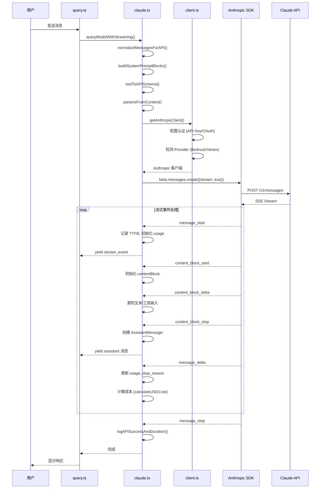

# 第二十四章：API 客户端服务

## 24.1 引言

API 客户端服务是 Claude Code 与 Claude API 通信的核心层。它负责：

1. **请求构建**：组装消息、工具定义、系统提示等参数
2. **身份认证**：支持多种认证方式（API Key、OAuth、Bedrock、Vertex）
3. **流式响应处理**：处理 SSE 流事件，累积响应状态
4. **错误处理与重试**：智能重试策略，支持模型降级
5. **Token 追踪**：记录输入输出 token，计算成本

本章深入分析 `src/services/api/` 目录下的核心文件，揭示 Claude Code 如何与 Claude API 高效通信。

### 24.1.1 目录结构

```
src/services/api/
├── claude.ts          # 核心 API 请求逻辑 (126KB)
├── client.ts          # Anthropic SDK 客户端创建
├── errors.ts          # 错误类型定义与处理
├── errorUtils.ts      # 错误解析工具
├── withRetry.ts       # 重试策略实现
├── logging.ts         # API 请求日志记录
├── usage.ts           # 配额使用追踪
├── filesApi.ts        # Files API 操作
├── bootstrap.ts       # 启动时 API 验证
├── sessionIngress.ts  # 会话入口管理
├── promptCacheBreakDetection.ts  # 缓存失效检测
└── grove.ts           # Grove 相关配置
```

---

## 24.2 架构总览

### 24.2.1 claude.ts 模块结构

`claude.ts` 是 API 客户端的核心文件，包含以下主要组件：

| 组件 | 功能 |
|------|----------|------|
| 类型导入 | 1-258 | 导入 SDK 类型、工具类型、消息类型 |
| 配置函数 | 272-500 | `getExtraBodyParams`、`getPromptCachingEnabled`、`configureEffortParams` |
| 消息转换 | 588-674 | `userMessageToMessageParam`、`assistantMessageToMessageParam` |
| 查询入口 | 709-780 | `queryModelWithoutStreaming`、`queryModelWithStreaming` |
| 核心查询 | 1017-2892 | `queryModel` - 主查询生成器 |
| 工具函数 | 2894-2999 | `cleanupStream`、`updateUsage`、`accumulateUsage` |

### 24.2.2 核心类型定义

**Options 类型**（行 676-707）定义了 API 请求的全部配置选项：

```typescript
export type Options = {
  getToolPermissionContext: () => Promise<ToolPermissionContext>
  model: string
  toolChoice?: BetaToolChoiceTool | BetaToolChoiceAuto
  isNonInteractiveSession: boolean
  extraToolSchemas?: BetaToolUnion[]
  maxOutputTokensOverride?: number
  fallbackModel?: string
  onStreamingFallback?: () => void
  querySource: QuerySource
  agents: AgentDefinition[]
  allowedAgentTypes?: string[]
  hasAppendSystemPrompt: boolean
  fetchOverride?: ClientOptions['fetch']
  enablePromptCaching?: boolean
  temperatureOverride?: number
  effortValue?: EffortValue
  mcpTools: Tools
  hasPendingMcpServers?: boolean
  queryTracking?: QueryChainTracking
  agentId?: AgentId
  outputFormat?: BetaJSONOutputFormat
  fastMode?: boolean
  advisorModel?: string
  taskBudget?: { total: number; remaining?: number }
}
```

---

## 24.3 API 请求流程

### 24.3.1 请求流程图

下图展示了从工具调用到 API 响应的完整流程：



### 24.3.2 请求构建流程

**queryModel() 函数**（行 1017-2892）是核心请求处理生成器：

1. **预检查阶段**（行 1031-1055）：
   - 检查 off-switch 状态
   - 获取 previousRequestId 用于请求链追踪

2. **工具准备阶段**（行 1064-1257）：
   - 获取 beta headers
   - 配置 advisor 工具
   - 处理 tool search 和 deferred tools
   - 构建 tool schemas

3. **消息处理阶段**（行 1259-1345）：
   - `normalizeMessagesForAPI()` 标准化消息
   - `ensureToolResultPairing()` 修复工具配对
   - `stripExcessMediaItems()` 移除超量媒体
   - 计算消息指纹

4. **参数构建阶段**（行 1538-1729）：
   - `paramsFromContext()` 组装请求参数
   - 配置 thinking、effort、output_config
   - 设置 cache_control

5. **请求执行阶段**（行 1776-1857）：
   - `withRetry()` 包装重试逻辑
   - `getAnthropicClient()` 创建客户端
   - `anthropic.beta.messages.create()` 发送请求

---

## 24.4 客户端创建与认证

### 24.4.1 getAnthropicClient() 函数

定义在 `src/services/api/client.ts`，负责创建 Anthropic SDK 客户端：

```typescript
export async function getAnthropicClient({
  apiKey,
  maxRetries,
  model,
  fetchOverride,
  source,
}: {
  apiKey?: string
  maxRetries: number
  model?: string
  fetchOverride?: ClientOptions['fetch']
  source?: string
}): Promise<Anthropic> {
  // 构建默认 headers
  const defaultHeaders = {
    'x-app': 'cli',
    'User-Agent': getUserAgent(),
    'X-Claude-Code-Session-Id': getSessionId(),
    // ...
  }
  
  // OAuth token 刷新
  await checkAndRefreshOAuthTokenIfNeeded()
  
  // 根据 Provider 创建不同客户端
  if (isEnvTruthy(process.env.CLAUDE_CODE_USE_BEDROCK)) {
    return new AnthropicBedrock({ ...ARGS, awsRegion })
  }
  if (isEnvTruthy(process.env.CLAUDE_CODE_USE_VERTEX)) {
    return new AnthropicVertex({ ...ARGS, googleAuth })
  }
  // 默认 Anthropic 客户端
  return new Anthropic({ apiKey, authToken, ...ARGS })
}
```

### 24.4.2 Provider 支持

| Provider | 环境变量 | SDK | 认证方式 |
|----------|----------|-----|----------|
| First Party | 默认 | `Anthropic` | API Key / OAuth |
| Bedrock | `CLAUDE_CODE_USE_BEDROCK` | `AnthropicBedrock` | AWS Credentials |
| Vertex | `CLAUDE_CODE_USE_VERTEX` | `AnthropicVertex` | GCP Credentials |
| Foundry | `CLAUDE_CODE_USE_FOUNDRY` | `AnthropicFoundry` | Azure AD |

### 24.4.3 认证配置

**OAuth 认证流程**（行 131-137）：

```typescript
await checkAndRefreshOAuthTokenIfNeeded()
if (!isClaudeAISubscriber()) {
  await configureApiKeyHeaders(defaultHeaders, getIsNonInteractiveSession())
}
```

OAuth 用户使用 `authToken`（访问令牌），API Key 用户使用 `Authorization: Bearer` header。

---

## 24.5 错误处理与重试逻辑

### 24.5.1 withRetry() 函数

定义在 `src/services/api/withRetry.ts`，实现智能重试策略：

```typescript
export async function* withRetry<T>(
  getClient: () => Promise<Anthropic>,
  operation: (client, attempt, context) => Promise<T>,
  options: RetryOptions,
): AsyncGenerator<SystemAPIErrorMessage, T> {
  const maxRetries = getMaxRetries(options)
  let consecutive529Errors = 0
  
  for (let attempt = 1; attempt <= maxRetries + 1; attempt++) {
    try {
      return await operation(client, attempt, retryContext)
    } catch (error) {
      // 处理不同错误类型
      if (shouldRetry529(error)) {
        consecutive529Errors++
        await sleep(getRetryDelay(error))
        continue
      }
      if (isAuthError(error)) {
        client = await getClient()  // 刷新客户端
        continue
      }
      throw new CannotRetryError(error, retryContext)
    }
  }
}
```

### 24.5.2 错误类型分类

定义在 `errors.ts`：

| 错误类型 | 错误消息 | 处理策略 |
|----------|----------|----------|
| `authentication_error` | `invalid x-api-key` | 重新认证 |
| `permission_denied` | `OAuth token revoked` | 返回登录提示 |
| `rate_limit_error` | 429 状态码 | 等待 retry-after |
| `overloaded_error` | 529 状态码 | 指数退避重试 |
| `prompt_too_long` | 上下文超限 | 触发 compact |
| `timeout_error` | 请求超时 | 非流式降级 |

**classifyAPIError()** 函数（errors.ts）将 API 错误分类：

```typescript
// 错误分类逻辑
const errorType = classifyAPIError(error)
// 可能值: 'auth', 'rate_limit', 'overloaded', 'context_length', 'timeout', 'server_error', 'unknown'
```

### 24.5.3 529 重试策略

**FOREGROUND_529_RETRY_SOURCES**（行 62-82）定义了会重试 529 的查询源：

```typescript
const FOREGROUND_529_RETRY_SOURCES = new Set<QuerySource>([
  'repl_main_thread',
  'sdk',
  'agent:custom',
  'agent:default',
  'compact',
  'hook_agent',
  // ...
])
```

后台查询（标题生成、摘要等）遇到 529 直接失败，避免在容量高峰时放大请求。

### 24.5.4 Fast Mode 降级

Fast Mode 遇到 429/529 时（行 267-300）：

```typescript
if (wasFastModeActive && (error.status === 429 || is529Error(error))) {
  const retryAfterMs = getRetryAfterMs(error)
  if (retryAfterMs < SHORT_RETRY_THRESHOLD_MS) {
    // 短延迟：保持 fast mode 重试
    await sleep(retryAfterMs)
    continue
  }
  // 长延迟：进入 cooldown，切换标准速度
  triggerFastModeCooldown(Date.now() + cooldownMs, cooldownReason)
}
```

---

## 24.6 流式响应处理

### 24.6.1 流事件处理流程

`queryModel()` 函数的流处理部分（行 1940-2304）：

```typescript
for await (const part of stream) {
  resetStreamIdleTimer()  // 重置空闲超时计时器
  
  switch (part.type) {
    case 'message_start':
      partialMessage = part.message
      ttftMs = Date.now() - start  // 记录 TTFB
      usage = updateUsage(usage, part.message?.usage)
      break
    
    case 'content_block_start':
      contentBlocks[part.index] = { ...part.content_block }
      break
    
    case 'content_block_delta':
      // 累积 delta 到 contentBlock
      if (delta.type === 'text_delta') {
        contentBlock.text += delta.text
      } else if (delta.type === 'input_json_delta') {
        contentBlock.input += delta.partial_json
      }
      break
    
    case 'content_block_stop':
      // 创建 AssistantMessage 并 yield
      const m: AssistantMessage = {
        message: { ...partialMessage, content: [contentBlock] },
        requestId: streamRequestId,
        type: 'assistant',
      }
      yield m
      break
    
    case 'message_delta':
      usage = updateUsage(usage, part.usage)
      stopReason = part.delta.stop_reason
      // 计算成本
      costUSD += addToTotalSessionCost(calculateUSDCost(model, usage))
      break
  }
}
```

### 24.6.2 流空闲超时检测

**Stream Watchdog**（行 1874-1929）防止流无限挂起：

```typescript
const STREAM_IDLE_TIMEOUT_MS = parseInt(process.env.CLAUDE_STREAM_IDLE_TIMEOUT_MS) || 90_000

function resetStreamIdleTimer(): void {
  clearStreamIdleTimers()
  streamIdleTimer = setTimeout(() => {
    streamIdleAborted = true
    logEvent('tengu_streaming_idle_timeout', { model, request_id, timeout_ms })
    releaseStreamResources()
  }, STREAM_IDLE_TIMEOUT_MS)
}
```

超过 90 秒无数据则中断流，触发非流式降级。

### 24.6.3 流 Stall 检测

检测并记录流中断（行 1945-1967）：

```typescript
const STALL_THRESHOLD_MS = 30_000  // 30 秒阈值
if (lastEventTime !== null) {
  const timeSinceLastEvent = now - lastEventTime
  if (timeSinceLastEvent > STALL_THRESHOLD_MS) {
    stallCount++
    totalStallTime += timeSinceLastEvent
    logEvent('tengu_streaming_stall', {
      stall_duration_ms: timeSinceLastEvent,
      stall_count: stallCount,
    })
  }
}
```

### 24.6.4 非流式降级

流失败时自动降级到非流式请求（行 2504-2594）：

```typescript
if (streamingError) {
  logEvent('tengu_streaming_fallback_to_non_streaming', {
    model, error: streamingError.name,
    fallback_cause: streamIdleAborted ? 'watchdog' : 'other',
  })
  
  const result = yield* executeNonStreamingRequest(
    { model: options.model, source: options.querySource },
    { model, fallbackModel, thinkingConfig, signal },
    paramsFromContext,
    // ...
  )
  
  const m: AssistantMessage = { message: result, type: 'assistant' }
  yield m
}
```

---

## 24.7 Token 追踪

### 24.7.1 Usage 类型

定义在 `src/services/api/logging.ts`：

```typescript
export type NonNullableUsage = {
  input_tokens: number
  output_tokens: number
  cache_creation_input_tokens: number
  cache_read_input_tokens: number
  cache_creation: {
    ephemeral_1h_input_tokens: number
    ephemeral_5m_input_tokens: number
  }
  server_tool_use: {
    web_search_requests: number
    web_fetch_requests: number
  }
  service_tier: string
  inference_geo: string
  iterations: number
  speed: string
}
```

### 24.7.2 updateUsage() 函数

定义在 `src/services/api/claude.ts`，累积流式事件中的 usage：

```typescript
export function updateUsage(
  usage: Readonly<NonNullableUsage>,
  partUsage: BetaMessageDeltaUsage | undefined,
): NonNullableUsage {
  // 注意：流式 API 提供累积值而非增量
  // message_start 设置输入 token，message_delta 设置输出 token
  return {
    input_tokens:
      partUsage.input_tokens !== null && partUsage.input_tokens > 0
        ? partUsage.input_tokens
        : usage.input_tokens,  // 防止 message_delta 用 0 覆盖
    // ...
    output_tokens: partUsage.output_tokens ?? usage.output_tokens,
  }
}
```

**关键设计**：流式 API 的 `message_delta` 可能发送显式 0 值，需要保护已设置的值不被覆盖。

### 24.7.3 成本计算

`calculateUSDCost()` 函数（来自 `src/utils/modelCost.ts`）计算请求成本：

```typescript
const costUSD = calculateUSDCost(resolvedModel, usage)
costUSD += addToTotalSessionCost(costUSD, usage, options.model)
```

成本在 `message_delta` 事件处理时计算（行 2251-2256）。

### 24.7.4 Token 记录与分析

**logAPISuccess()** 函数（`src/services/api/logging.ts`）记录完整的 token 信息：

```typescript
logEvent('tengu_api_success', {
  model,
  inputTokens: usage.input_tokens,
  outputTokens: usage.output_tokens,
  cachedInputTokens: usage.cache_read_input_tokens ?? 0,
  uncachedInputTokens: usage.cache_creation_input_tokens ?? 0,
  messageTokens,  // 消息数组估算 token
  durationMs,
  ttftMs,
  costUSD,
  requestId,
  // ...
})
```

### 24.7.5 缓存 Token 细分

Prompt Caching 相关 token：

| 字段 | 说明 |
|------|------|
| `cache_read_input_tokens` | 从缓存读取的 token（缓存命中） |
| `cache_creation_input_tokens` | 创建缓存的 token（首次写入） |
| `ephemeral_1h_input_tokens` | 1 小时 TTL 缓存 token |
| `ephemeral_5m_input_tokens` | 5 分钟 TTL 缓存 token |

---

## 24.8 关键辅助模块

### 24.8.1 errors.ts - 错误消息生成

定义标准错误消息：

```typescript
export const API_ERROR_MESSAGE_PREFIX = 'API Error'
export const PROMPT_TOO_LONG_ERROR_MESSAGE = 'Prompt is too long'
export const INVALID_API_KEY_ERROR_MESSAGE = 'Not logged in · Please run /login'
export const REPEATED_529_ERROR_MESSAGE = 'Repeated 529 Overloaded errors'

export function getAssistantMessageFromError(error, model, context): AssistantMessage {
  // 根据错误类型生成用户友好的错误消息
}
```

### 24.8.2 logging.ts - API 日志记录

记录请求全过程：

| 函数 | 说明 |
|------|------|
| `logAPIQuery()` | 请求开始时记录参数 |
| `logAPIError()` | 请求失败时记录错误详情 |
| `logAPISuccessAndDuration()` | 请求成功时记录结果和耗时 |

### 24.8.3 promptCacheBreakDetection.ts

检测 Prompt Cache 失效（行 2483-2492）：

```typescript
void checkResponseForCacheBreak(
  options.querySource,
  usage.cache_read_input_tokens,
  usage.cache_creation_input_tokens,
  messages,
  options.agentId,
  streamRequestId,
)
```

通过对比请求参数 hash 与响应 token，检测缓存是否失效。

---

## 24.9 总结

Claude Code 的 API 客户端服务是一个设计精良的通信层：

1. **多 Provider 支持**：统一接口支持 Anthropic API、Bedrock、Vertex、Foundry
2. **智能重试策略**：区分前台/后台请求，处理 529/429 错误
3. **流式处理优化**：空闲超时检测、Stall 监控、非流式降级
4. **精确 Token 追踪**：累积流式事件，计算成本，记录缓存命中
5. **完善的错误处理**：分类错误类型，生成用户友好消息

这套架构确保了 Claude Code 与 Claude API 的可靠高效通信，是整个系统稳定运行的基石。

---

## 参考文献

- `src/services/api/claude.ts`: 核心 API 请求逻辑
- `src/services/api/client.ts`: Anthropic SDK 客户端创建
- `src/services/api/withRetry.ts`: 重试策略实现
- `src/services/api/errors.ts`: 错误类型定义
- `src/services/api/logging.ts`: API 日志记录
- `src/utils/modelCost.ts`: 成本计算函数