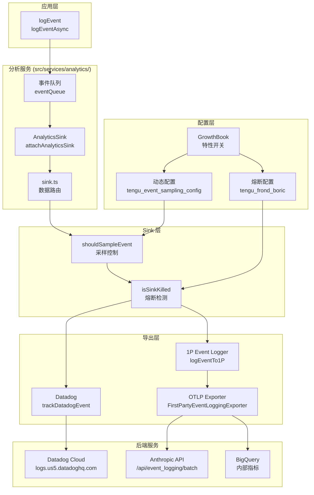

# 第28章 分析与服务

> **版本说明**：本文基于 Claude Code 源代码分析，请以最新版本为准。

## 28.1 引言

Claude Code 的分析系统是一个多层次的数据收集和监控基础设施,负责事件日志记录、特性开关管理、遥测数据导出以及企业策略限制等功能。该系统采用 OpenTelemetry 作为核心技术框架,通过 GrowthBook 实现动态特性配置,确保产品迭代的数据驱动决策能力。

分析服务目录 `src/services/analytics/` 包含以下核心模块:

| 文件 | 功能 |
|------|------|
| `index.ts` | 公共 API 入口,事件队列管理 |
| `growthbook.ts` | GrowthBook 特性开关集成 |
| `sink.ts` | 分析数据路由逻辑 |
| `firstPartyEventLogger.ts` | 第一方事件日志系统 |
| `firstPartyEventLoggingExporter.ts` | OTLP 导出器实现 |
| `datadog.ts` | Datadog 日志集成 |
| `config.ts` | 分析系统配置开关 |
| `sinkKillswitch.ts` | 单 sink 熔断机制 |
| `metadata.ts` | 事件元数据丰富化 |

## 28.2 分析系统架构概览

### figure-28-1 分析数据流架构图



### 核心设计原则

分析系统的设计遵循以下原则:

1. **无循环依赖**: `index.ts` 模块没有任何依赖,避免导入循环
2. **延迟初始化**: 事件在 sink 附着前会被队列缓存,避免启动路径阻塞
3. **隐私保护**: 元数据类型强制验证,防止敏感信息泄露
4. **熔断机制**: 单 sink 熔断允许独立控制各导出通道

## 28.3 GrowthBook 特性开关系统

GrowthBook 是 Claude Code 的特性开关管理平台,通过远程评估实现动态配置下发。

### 28.3.1 客户端初始化

GrowthBook 客户端通过 `getGrowthBookClient` 函数创建 (第 490-617 行):

```typescript
const thisClient = new GrowthBook({
  apiHost: baseUrl,
  clientKey,
  attributes,           // 用户属性用于特性定位
  remoteEval: true,     // 启用远程评估模式
  cacheKeyAttributes: ['id', 'organizationUUID'],  // 缓存键属性
  ...(authHeaders.error
    ? {}
    : { apiHostRequestHeaders: authHeaders.headers }),
})
```

**关键配置说明**:

- `remoteEval: true`: 服务端预计算特性值,避免客户端重复评估
- `cacheKeyAttributes`: 当用户 ID 或组织变更时触发重新拉取
- `apiHostRequestHeaders`: 认证头用于私有特性开关访问

### 28.3.2 用户属性映射

用户属性用于特性开关的定向投放,定义在 `GrowthBookUserAttributes` 类型 (第 32-47 行):

```typescript
export type GrowthBookUserAttributes = {
  id: string              // 设备 ID
  sessionId: string       // 会话 ID
  deviceID: string        // 设备 ID (别名)
  platform: 'win32' | 'darwin' | 'linux'
  apiBaseUrlHost?: string // 企业代理主机名
  organizationUUID?: string
  accountUUID?: string
  userType?: string
  subscriptionType?: string
  rateLimitTier?: string
  firstTokenTime?: number
  email?: string
  appVersion?: string
  github?: GitHubActionsMetadata
}
```

### 28.3.3 特性值获取策略

系统提供三种特性值获取方法:

| 方法 | 特点 | 适用场景 |
|------|------|----------|
| `getFeatureValue_CACHED_MAY_BE_STALE` | 立即返回磁盘缓存值 | 启动关键路径、同步上下文 |
| `getFeatureValue_DEPRECATED` | 阻塞等待初始化 | 已弃用 |
| `checkSecurityRestrictionGate` | 等待重初始化完成 | 安全关键检查 |

**缓存读取优先级** (第 734-775 行):

1. 环境变量覆盖 (`CLAUDE_INTERNAL_FC_OVERRIDES`)
2. 配置覆盖 (`growthBookOverrides`)
3. 内存 payload 缓存 (`remoteEvalFeatureValues`)
4. 磁盘缓存 (`cachedGrowthBookFeatures`)

### 28.3.4 定期刷新机制

GrowthBook 支持定期刷新特性值,确保长时间运行的会话能获取最新配置:

```typescript
// 第 659-661 行
// Set up periodic refresh after successful initialization
setupPeriodicGrowthBookRefresh()
```

刷新完成后触发 `onGrowthBookRefresh` 信号,通知订阅者重新构建依赖特性值的对象。

## 28.4 第一方事件日志系统

第一方事件日志系统使用 OpenTelemetry Logs API 将事件导出到 Anthropic 内部分析平台。

### 28.4.1 初始化流程

初始化在 `initialize1PEventLogging` 函数 (第 312-389 行) 中完成:

```typescript
// 创建 LoggerProvider
firstPartyEventLoggerProvider = new LoggerProvider({
  resource,
  processors: [
    new BatchLogRecordProcessor(eventLoggingExporter, {
      scheduledDelayMillis,    // 批处理延迟
      maxExportBatchSize,      // 最大批次大小
      maxQueueSize,            // 队列容量
    }),
  ],
})

// 获取事件 logger
firstPartyEventLogger = firstPartyEventLoggerProvider.getLogger(
  'com.anthropic.claude_code.events',
  MACRO.VERSION,
)
```

### 28.4.2 事件采样控制

通过 GrowthBook 动态配置 `tengu_event_sampling_config` 控制事件采样率:

```typescript
// 第 57-85 行
export function shouldSampleEvent(eventName: string): number | null {
  const config = getEventSamplingConfig()
  const eventConfig = config[eventName]

  if (!eventConfig) return null  // 未配置则 100% 记录

  const sampleRate = eventConfig.sample_rate
  if (sampleRate <= 0) return 0   // 采样率为 0 则丢弃
  if (sampleRate >= 1) return null  // 采样率为 1 则全部记录

  return Math.random() < sampleRate ? sampleRate : 0
}
```

### 28.4.3 事件元数据丰富化

事件在记录时会自动丰富化核心元数据,包括:

- **核心元数据** (`core_metadata`): 模型、会话、用户类型、beta 特性等
- **用户元数据** (`user_metadata`): 账户 UUID、组织 UUID、邮箱等
- **环境元数据** (`envContext`): 平台、架构、终端类型、CI 状态等

元数据构建在 `metadata.ts` 的 `getEventMetadata` 函数 (第 693-743 行) 中实现:

```typescript
const metadata: EventMetadata = {
  model,
  sessionId: getSessionId(),
  userType: process.env.USER_TYPE || '',
  envContext,
  isInteractive: String(getIsInteractive()),
  clientType: getClientType(),
  processMetrics,
  // ... 其他字段
}
```

### 28.4.4 OTLP 导出器实现

`FirstPartyEventLoggingExporter` 类 (第 73-779 行) 实现 OpenTelemetry 的 `LogRecordExporter` 接口:

**关键特性**:

1. **失败事件持久化**: 网络失败时将事件写入磁盘 JSONL 文件
2. **二次方退避重试**: 失败后按 `baseDelay * attempts^2` 计算退避时间
3. **认证回退**: 401 错误时尝试无认证请求
4. **批次分块**: 大事件集自动拆分为小批次

```typescript
// 第 452-455 行 - 二次方退避
const delay = Math.min(
  this.baseBackoffDelayMs * this.attempts * this.attempts,
  this.maxBackoffDelayMs,
)
```

## 28.5 Datadog 日志集成

Datadog 是面向外部用户的日志分析平台,用于监控错误和性能指标。

### 28.5.1 允许的事件列表

Datadog 只记录预定义的事件类型 (第 19-64 行):

```typescript
const DATADOG_ALLOWED_EVENTS = new Set([
  'chrome_bridge_connection_succeeded',
  'chrome_bridge_connection_failed',
  'tengu_api_error',
  'tengu_api_success',
  'tengu_init',
  'tengu_exit',
  'tengu_uncaught_exception',
  'tengu_unhandled_rejection',
  // ... 其他事件
])
```

### 28.5.2 基数控制策略

为降低 Datadog 存储成本,系统实施基数控制:

1. **MCP 工具名归一化**: 所有 MCP 工具名映射为 `mcp`
2. **模型名缩短**: 外部用户的模型名映射为短名或 `other`
3. **版本号截断**: 开发版本只保留基础版本和日期部分

```typescript
// 第 197-202 行 - MCP 工具名归一化
if (typeof allData.toolName === 'string' && allData.toolName.startsWith('mcp__')) {
  allData.toolName = 'mcp'
}

// 第 205-209 行 - 模型名缩短
if (process.env.USER_TYPE !== 'ant' && typeof allData.model === 'string') {
  const shortName = getCanonicalName(allData.model.replace(/\[1m]$/i, ''))
  allData.model = shortName in MODEL_COSTS ? shortName : 'other'
}
```

### 28.5.3 用户分桶估算

通过 SHA256 哈希将用户 ID 分配到固定数量的桶中 (第 295-299 行):

```typescript
const NUM_USER_BUCKETS = 30

const getUserBucket = memoize((): number => {
  const userId = getOrCreateUserID()
  const hash = createHash('sha256').update(userId).digest('hex')
  return parseInt(hash.slice(0, 8), 16) % NUM_USER_BUCKETS
})
```

分桶机制用于估算受影响用户数量,同时保护用户隐私。

## 28.6 OpenTelemetry 遥测初始化

OpenTelemetry 遥测系统在 `src/utils/telemetry/instrumentation.ts` 中初始化。

### 28.6.1 三种信号支持

系统支持三种遥测信号:

| 信号 | 环境变量 | 导出器 |
|------|----------|--------|
| Metrics | `OTEL_METRICS_EXPORTER` | OTLP, Prometheus, Console |
| Logs | `OTEL_LOGS_EXPORTER` | OTLP, Console |
| Traces | `OTEL_TRACES_EXPORTER` | OTLP, Console |

### 28.6.2 协议选择

OTLP 协议支持三种传输方式:

```typescript
// 第 159-193 行
switch (protocol) {
  case 'grpc':
    // 使用 gRPC 协议
  case 'http/json':
    // 使用 HTTP JSON 协议
  case 'http/protobuf':
    // 使用 HTTP Protobuf 协议 (默认)
}
```

### 28.6.3 BigQuery 指标导出

内部用户和 API 客户自动启用 BigQuery 指标导出:

```typescript
// 第 336-347 行
function isBigQueryMetricsEnabled() {
  const subscriptionType = getSubscriptionType()
  const isC4EOrTeamUser =
    isClaudeAISubscriber() &&
    (subscriptionType === 'enterprise' || subscriptionType === 'team')

  return is1PApiCustomer() || isC4EOrTeamUser
}
```

### 28.6.4 Beta 调试追踪

Beta 追踪使用独立的端点配置:

```typescript
// 第 353-419 行
async function initializeBetaTracing(resource): Promise<void> {
  const endpoint = process.env.BETA_TRACING_ENDPOINT
  if (!endpoint) return

  // 初始化独立的 Trace 和 Log 导出器
  // 使用 BETA_TRACING_ENDPOINT 而非 OTEL_EXPORTER_OTLP_ENDPOINT
}
```

## 28.7 企业策略与配额限制

Claude AI 配额系统在 `src/services/claudeAiLimits.ts` 中实现,用于管理订阅用户的使用限制。

### 28.7.1 配额状态类型

```typescript
// 第 27-35 行
type QuotaStatus = 'allowed' | 'allowed_warning' | 'rejected'

type RateLimitType =
  | 'five_hour'       // 5 小时会话限制
  | 'seven_day'       // 7 天周限制
  | 'seven_day_opus'  // Opus 模型限制
  | 'seven_day_sonnet' // Sonnet 模型限制
  | 'overage'         // 额外用量限制
```

### 28.7.2 配额限制结构

```typescript
// 第 122-136 行
export type ClaudeAILimits = {
  status: QuotaStatus
  unifiedRateLimitFallbackAvailable: boolean
  resetsAt?: number              // 重置时间戳
  rateLimitType?: RateLimitType
  utilization?: number           // 使用率 0-1
  overageStatus?: QuotaStatus
  overageResetsAt?: number
  overageDisabledReason?: OverageDisabledReason
  isUsingOverage?: boolean
  surpassedThreshold?: number
}
```

### 28.7.3 额外用量禁用原因

系统定义了多种额外用量禁用原因 (第 106-121 行):

```typescript
export type OverageDisabledReason =
  | 'overage_not_provisioned'
  | 'org_level_disabled'
  | 'org_level_disabled_until'
  | 'out_of_credits'
  | 'seat_tier_level_disabled'
  | 'member_level_disabled'
  | 'seat_tier_zero_credit_limit'
  | 'group_zero_credit_limit'
  | 'member_zero_credit_limit'
  // ... 其他原因
```

### 28.7.4 早期预警机制

系统通过阈值检测提前预警用户配额耗尽:

```typescript
// 第 53-70 行
const EARLY_WARNING_CONFIGS: EarlyWarningConfig[] = [
  {
    rateLimitType: 'five_hour',
    claimAbbrev: '5h',
    windowSeconds: 5 * 60 * 60,
    thresholds: [{ utilization: 0.9, timePct: 0.72 }],
  },
  {
    rateLimitType: 'seven_day',
    claimAbbrev: '7d',
    windowSeconds: 7 * 24 * 60 * 60,
    thresholds: [
      { utilization: 0.75, timePct: 0.6 },
      { utilization: 0.5, timePct: 0.35 },
      { utilization: 0.25, timePct: 0.15 },
    ],
  },
]
```

预警逻辑: 当使用率超过阈值且时间进度低于阈值时触发警告。

### 28.7.5 HTTP 头提取

配额状态从 API 响应头中提取:

```typescript
// 第 376-435 行
function computeNewLimitsFromHeaders(headers: Headers): ClaudeAILimits {
  const status = headers.get('anthropic-ratelimit-unified-status')
  const resetsAt = headers.get('anthropic-ratelimit-unified-reset')
  const rateLimitType = headers.get('anthropic-ratelimit-unified-representative-claim')
  const overageStatus = headers.get('anthropic-ratelimit-unified-overage-status')
  const overageDisabledReason = headers.get('anthropic-ratelimit-unified-overage-disabled-reason')
  // ...
}
```

## 28.8 Sink 熔断机制

`sinkKillswitch.ts` 提供单 sink 级别的熔断控制,允许独立禁用 Datadog 或第一方事件导出。

### 28.8.1 熔断配置

熔断配置来自 GrowthBook 动态配置 `tengu_frond_boric`:

```typescript
// 第 18-25 行
export function isSinkKilled(sink: SinkName): boolean {
  const config = getDynamicConfig_CACHED_MAY_BE_STALE<
    Partial<Record<SinkName, boolean>>
  >(SINK_KILLSWITCH_CONFIG_NAME, {})

  return config?.[sink] === true
}
```

### 28.8.2 熔断应用场景

熔断机制应用于多个场景:

1. **Datadog 导出**: 在 `shouldTrackDatadog` 中检查 (sink.ts 第 30 行)
2. **第一方事件**: 在 `logEventTo1P` 中检查 (firstPartyEventLogger.ts 第 224 行)
3. **OTLP 批量发送**: 在导出器中检查,熔断时抛出异常触发磁盘持久化

```typescript
// firstPartyEventLoggingExporter.ts 第 530-535 行
if (this.isKilled()) {
  throw new Error('firstParty sink killswitch active')
}
```

## 28.9 事件类型汇总

Claude Code 记录的主要事件类型:

### 工具使用事件

| 事件名 | 说明 |
|--------|------|
| `tengu_tool_use_success` | 工具执行成功 |
| `tengu_tool_use_error` | 工具执行失败 |
| `tengu_tool_use_granted_in_prompt_permanent` | 工具权限永久授予 |
| `tengu_tool_use_granted_in_prompt_temporary` | 工具权限临时授予 |
| `tengu_tool_use_rejected_in_prompt` | 工具权限拒绝 |

### API 事件

| 事件名 | 说明 |
|--------|------|
| `tengu_api_success` | API 请求成功 |
| `tengu_api_error` | API 请求失败 |
| `tengu_query_error` | 查询错误 |

### 会话事件

| 事件名 | 说明 |
|--------|------|
| `tengu_init` | 会话初始化 |
| `tengu_started` | 会话开始 |
| `tengu_exit` | 会话退出 |
| `tengu_cancel` | 会话取消 |

### OAuth 事件

| 事件名 | 说明 |
|--------|------|
| `tengu_oauth_success` | OAuth 认证成功 |
| `tengu_oauth_error` | OAuth 认证失败 |
| `tengu_oauth_token_refresh_success` | 令牌刷新成功 |
| `tengu_oauth_token_refresh_failure` | 令牌刷新失败 |

### 异常事件

| 事件名 | 说明 |
|--------|------|
| `tengu_uncaught_exception` | 未捕获异常 |
| `tengu_unhandled_rejection` | 未处理 Promise 拒绝 |
| `tengu_compact_failed` | 压缩失败 |

## 28.10 总结

Claude Code 的分析系统是一个完整的数据收集和分析基础设施:

1. **GrowthBook 特性开关**: 支持远程评估、磁盘缓存、定期刷新,确保动态配置实时生效
2. **事件日志系统**: 基于 OpenTelemetry 的分层导出,支持 Datadog 和内部平台双通道
3. **采样与熔断**: 通过动态配置控制事件采样率和单 sink 熔断,实现精细化流量管理
4. **隐私保护**: 类型强制验证、基数控制、PII 字段剥离等多重隐私保护机制
5. **配额管理**: 完整的企业策略执行,包括早期预警、额外用量限制、多种禁用原因
6. **OpenTelemetry 遆测**: 支持 Metrics、Logs、Traces 三种信号,可选协议和端点配置

分析系统的设计充分考虑了性能、隐私、可靠性和可扩展性,为产品迭代和企业策略执行提供了坚实的数据基础设施。

---

**源文件参考**:
- `/Users/hw/workspaces/projects/claude-wiki/src/services/analytics/index.ts`
- `/Users/hw/workspaces/projects/claude-wiki/src/services/analytics/growthbook.ts`
- `/Users/hw/workspaces/projects/claude-wiki/src/services/analytics/sink.ts`
- `/Users/hw/workspaces/projects/claude-wiki/src/services/analytics/firstPartyEventLogger.ts`
- `/Users/hw/workspaces/projects/claude-wiki/src/services/analytics/firstPartyEventLoggingExporter.ts`
- `/Users/hw/workspaces/projects/claude-wiki/src/services/analytics/datadog.ts`
- `/Users/hw/workspaces/projects/claude-wiki/src/services/analytics/sinkKillswitch.ts`
- `/Users/hw/workspaces/projects/claude-wiki/src/services/analytics/metadata.ts`
- `/Users/hw/workspaces/projects/claude-wiki/src/utils/telemetry/instrumentation.ts`
- `/Users/hw/workspaces/projects/claude-wiki/src/services/claudeAiLimits.ts`