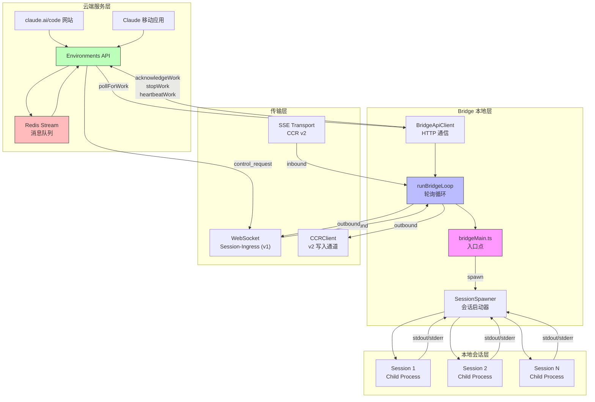

# 第二十九章：Bridge 系统架构

> **版本说明**：本文基于 Claude Code 源代码分析，请以最新版本为准。

## 29.1 引言：远程控制的架构设计

Bridge 系统是 Claude Code 远程控制功能的核心实现，它允许用户通过 claude.ai/code 网站或 Claude 移动应用来控制本地运行的 Claude Code 会话。这种架构打破了本地 CLI 与远程界面之间的物理边界，实现了"本地执行、远程控制"的创新模式。

Bridge 的核心设计理念是建立一个持久化的服务端点，作为本地环境与云端服务的桥梁。用户在本地启动 Bridge 后，可以通过任意设备访问和控制运行中的会话，这为跨设备协作和移动办公提供了技术基础。

## 29.2 远程控制的设计哲学

### 29.2.1 为什么需要 Bridge

传统的 CLI 工具运行在本地终端中，用户必须物理接触设备才能进行交互。Claude Code 的远程控制功能解决了以下场景的痛点：

1. **跨设备连续性**：用户在办公室启动的任务可以在回家后通过手机继续查看和控制
2. **协作共享**：团队成员可以查看他人正在运行的 Claude Code 会话进度
3. **移动办公**：远程审批权限请求、查看执行结果无需 SSH 连接到工作站

Bridge 的存在意义在于将本地的会话能力"暴露"到云端，同时保持敏感操作（文件读写、命令执行）在本地执行的安全边界。

### 29.2.2 架构原则

Bridge 系统遵循以下核心设计原则：

- **本地优先执行**：所有敏感操作（文件系统访问、Shell 命令执行）在本地执行，避免远程服务器处理用户数据
- **云端控制面**：用户交互界面托管在云端，提供统一的用户体验和跨设备同步
- **会话隔离**：通过 git worktree 或目录隔离机制，确保多会话并发不会互相干扰
- **优雅降级**：网络中断时本地会话继续运行，恢复后自动同步状态



**图 29-1：Bridge 系统架构图**

## 29.3 bridgeMain.ts 主入口分析

`bridgeMain.ts` 是 Bridge 系统的入口点，负责初始化、配置解析和环境注册。整个文件约 2500 行代码，包含两个核心函数：`bridgeMain` 和 `runBridgeLoop`。

### 29.3.1 入口函数结构

`bridgeMain` 函数（第 1980-2500+ 行）是命令行入口，处理以下职责：

```typescript
// 第 1980-1998 行：参数解析和早期验证
export async function bridgeMain(args: string[]): Promise<void> {
  const parsed = parseArgs(args)

  if (parsed.help) {
    await printHelp()
    return
  }
  if (parsed.error) {
    console.error(`Error: ${parsed.error}`)
    process.exit(1)
  }
```

参数解析由 `parseArgs` 函数（第 1737-1887 行）处理，支持以下命令行选项：

- `--verbose/-v`：详细日志输出
- `--spawn <mode>`：会话启动模式（session/same-dir/worktree）
- `--capacity <N>`：最大并发会话数
- `--session-id <id>`：恢复特定会话
- `--continue/-c`：恢复最近会话
- `--permission-mode <mode>`：权限模式

### 29.3.2 会话启动模式

Bridge 支持三种会话启动模式（`SpawnMode` 类型，定义于 `types.ts` 第 68-69 行）：

```typescript
// types.ts 第 68-69 行
export type SpawnMode = 'single-session' | 'worktree' | 'same-dir'
```

各模式的含义：

| 模式 | 说明 | 适用场景 |
|------|------|----------|
| `single-session` | 单会话模式，会话结束时 Bridge 退出 | 传统远程控制行为 |
| `same-dir` | 多会话共享同一工作目录 | 并发任务执行 |
| `worktree` | 每个会话在独立 git worktree 中运行 | 需要隔离的并行开发 |

启动模式的决策逻辑位于 `bridgeMain.ts` 第 2286-2302 行：

```typescript
// 第 2286-2302 行：启动模式决策
type SpawnModeSource = 'resume' | 'flag' | 'saved' | 'gate_default'
let spawnModeSource: SpawnModeSource
let spawnMode: SpawnMode
if (resumeSessionId) {
  spawnMode = 'single-session'
  spawnModeSource = 'resume'
} else if (parsedSpawnMode !== undefined) {
  spawnMode = parsedSpawnMode
  spawnModeSource = 'flag'
} else if (savedSpawnMode !== undefined) {
  spawnMode = savedSpawnMode
  spawnModeSource = 'saved'
} else {
  spawnMode = multiSessionEnabled ? 'same-dir' : 'single-session'
  spawnModeSource = 'gate_default'
}
```

决策优先级为：恢复会话 > 命令行标志 > 项目配置 > 功能开关默认值。

### 29.3.3 环境注册

Bridge 向云端注册环境的逻辑位于第 2447-2467 行：

```typescript
// 第 2447-2467 行：环境注册
let environmentId: string
let environmentSecret: string
try {
  const reg = await api.registerBridgeEnvironment(config)
  environmentId = reg.environment_id
  environmentSecret = reg.environment_secret
} catch (err) {
  logEvent('tengu_bridge_registration_failed', {
    status: err instanceof BridgeFatalError ? err.status : undefined,
  })
  console.error(
    err instanceof BridgeFatalError && err.status === 404
      ? 'Remote Control environments are not available for your account.'
      : `Error: ${errorMessage(err)}`,
  )
  process.exit(1)
}
```

环境注册通过 `BridgeApiClient.registerBridgeEnvironment` 方法完成，发送包含机器名称、目录、分支、最大会话数等信息的注册请求。

## 29.4 WebSocket 传输层

### 29.4.1 传输层抽象

Bridge 系统定义了统一的传输层抽象接口 `ReplBridgeTransport`（`replBridgeTransport.ts` 第 23-70 行）：

```typescript
// replBridgeTransport.ts 第 23-70 行
export type ReplBridgeTransport = {
  write(message: StdoutMessage): Promise<void>
  writeBatch(messages: StdoutMessage[]): Promise<void>
  close(): void
  isConnectedStatus(): boolean
  getStateLabel(): string
  setOnData(callback: (data: string) => void): void
  setOnClose(callback: (closeCode?: number) => void): void
  setOnConnect(callback: () => void): void
  connect(): void
  getLastSequenceNum(): number
  readonly droppedBatchCount: number
  reportState(state: SessionState): void
  reportMetadata(metadata: Record<string, unknown>): void
  reportDelivery(eventId: string, status: 'processing' | 'processed'): void
  flush(): Promise<void>
}
```

该抽象接口统一了两种传输实现：v1 的 WebSocket 方案和 v2 的 SSE 方案。

### 29.4.2 v1 WebSocket 方案

v1 方案使用 `HybridTransport`，结合 WebSocket 读取和 HTTP POST 写入：

```typescript
// replBridgeTransport.ts 第 78-103 行
export function createV1ReplTransport(
  hybrid: HybridTransport,
): ReplBridgeTransport {
  return {
    write: msg => hybrid.write(msg),
    writeBatch: msgs => hybrid.writeBatch(msgs),
    close: () => hybrid.close(),
    isConnectedStatus: () => hybrid.isConnectedStatus(),
    getStateLabel: () => hybrid.getStateLabel(),
    setOnData: cb => hybrid.setOnData(cb),
    setOnClose: cb => hybrid.setOnClose(cb),
    setOnConnect: cb => hybrid.setOnConnect(cb),
    connect: () => void hybrid.connect(),
    getLastSequenceNum: () => 0,  // v1 不使用 SSE 序列号
    get droppedBatchCount() {
      return hybrid.droppedBatchCount
    },
    reportState: () => {},  // v1 无状态上报
    reportMetadata: () => {},
    reportDelivery: () => {},
    flush: () => Promise.resolve(),
  }
}
```

WebSocket URL 的构建逻辑位于 `workSecret.ts` 第 41-48 行：

```typescript
// workSecret.ts 第 41-48 行
export function buildSdkUrl(apiBaseUrl: string, sessionId: string): string {
  const isLocalhost =
    apiBaseUrl.includes('localhost') || apiBaseUrl.includes('127.0.0.1')
  const protocol = isLocalhost ? 'ws' : 'wss'
  const version = isLocalhost ? 'v2' : 'v1'
  const host = apiBaseUrl.replace(/^https?:\/\//, '').replace(/\/+$/, '')
  return `${protocol}://${host}/${version}/session_ingress/ws/${sessionId}`
}
```

v1 方案的特点：
- 本地开发环境使用 `ws://` 协议直连 session-ingress 服务
- 生产环境使用 `wss://` 协议通过 Envoy 代理
- 写入操作通过 HTTP POST 发送，避免 WebSocket 的单向限制

### 29.4.3 v2 SSE 方案

v2 方案使用 SSE（Server-Sent Events）读取和 CCRClient 写入，这是更现代的架构：

```typescript
// replBridgeTransport.ts 第 119-156 行
export async function createV2ReplTransport(opts: {
  sessionUrl: string
  ingressToken: string
  sessionId: string
  initialSequenceNum?: number
  epoch?: number
  heartbeatIntervalMs?: number
  heartbeatJitterFraction?: number
  outboundOnly?: boolean
  getAuthToken?: () => string | undefined
}): Promise<ReplBridgeTransport> {
  // ...
  const epoch = opts.epoch ?? (await registerWorker(sessionUrl, ingressToken))

  // SSE 流 URL
  const sseUrl = new URL(sessionUrl)
  sseUrl.pathname = sseUrl.pathname.replace(/\/$/, '') + '/worker/events/stream'

  const sse = new SSETransport(
    sseUrl,
    {},
    sessionId,
    undefined,
    initialSequenceNum,
    getAuthHeaders,
  )
```

v2 方案的核心优势：
- **序列号支持**：SSE 传输携带序列号，支持断点续传
- **心跳机制**：CCRClient 提供内置心跳，保持连接活跃
- **状态上报**：支持向云端报告会话状态（如等待用户输入）

### 29.4.4 Worker 注册

v2 方案需要先注册为 session worker（`workSecret.ts` 第 97-100 行）：

```typescript
// workSecret.ts 第 97-100 行
export async function registerWorker(
  sessionUrl: string,
  accessToken: string,
): Promise<number> {
  // POST /v1/code/sessions/{id}/worker/register
  // 返回 worker_epoch 用于后续心跳和状态上报
```

Worker 注册获取 epoch 值，该值必须包含在所有后续的 worker 请求中，用于服务端验证 worker 身份。

## 29.5 双向通信协议

### 29.5.1 Work 消息类型

Bridge 通过轮询 `/v1/environments/{id}/work` 获取任务，Work 数据结构定义于 `types.ts`：

```typescript
// types.ts 第 18-31 行
export type WorkData = {
  type: 'session' | 'healthcheck'
  id: string
}

export type WorkResponse = {
  id: string
  type: 'work'
  environment_id: string
  state: string
  data: WorkData
  secret: string  // base64url-encoded JSON
  created_at: string
}
```

两种 Work 类型：

| 类型 | 处理逻辑 |
|------|----------|
| `session` | 启动新的本地会话进程 |
| `healthcheck` | 健康检查，确认 Bridge 活跃 |

### 29.5.2 Work Secret 解析

Work 响应包含加密的 secret 字段，需要解码获取会话凭证：

```typescript
// workSecret.ts 第 6-32 行
export function decodeWorkSecret(secret: string): WorkSecret {
  const json = Buffer.from(secret, 'base64url').toString('utf-8')
  const parsed: unknown = jsonParse(json)
  if (
    !parsed ||
    typeof parsed !== 'object' ||
    !('version' in parsed) ||
    parsed.version !== 1
  ) {
    throw new Error(`Unsupported work secret version: ...`)
  }
  // ...
  return parsed as WorkSecret
}
```

`WorkSecret` 结构包含：
- `session_ingress_token`：会话 JWT，用于 WebSocket 认证
- `api_base_url`：API 基础 URL
- `use_code_sessions`：是否使用 CCR v2

### 29.5.3 轮询循环核心逻辑

`runBridgeLoop` 函数（第 141-1580 行）是 Bridge 的核心轮询循环：

```typescript
// 第 600-746 行：轮询主循环
while (!loopSignal.aborted) {
  const pollConfig = getPollIntervalConfig()

  try {
    const work = await api.pollForWork(
      environmentId,
      environmentSecret,
      loopSignal,
      pollConfig.reclaim_older_than_ms,
    )

    // 空响应处理
    if (!work) {
      const atCap = activeSessions.size >= config.maxSessions
      // 容量检查和心跳逻辑...
      continue
    }

    // Work 处理...
```

轮询循环的关键处理流程：

1. **空响应处理**（第 637-746 行）：无任务时根据容量状态决定休眠策略
2. **Work 类型分发**（第 852-1214 行）：根据 `work.data.type` 分发处理
3. **错误处理与退避**（第 1236-1400 行）：网络错误使用指数退避重试

### 29.5.4 会话启动流程

Session 类型 Work 的处理逻辑（第 859-1204 行）：

```typescript
// 第 859-898 行：Session Work 处理入口
case 'session': {
  const sessionId = work.data.id
  // ID 验证
  try {
    validateBridgeId(sessionId, 'session_id')
  } catch {
    await ackWork()
    logger.logError(`Invalid session_id received: ${sessionId}`)
    break
  }

  // 已存在会话：更新 token
  const existingHandle = activeSessions.get(sessionId)
  if (existingHandle) {
    existingHandle.updateAccessToken(secret.session_ingress_token)
    // ...
    await ackWork()
    break
  }

  // 容量检查
  if (activeSessions.size >= config.maxSessions) {
    logForDebugging(`[bridge:work] At capacity, cannot spawn...`)
    break
  }
```

会话启动的关键步骤：

1. **ID 验证**：确保 sessionId 不包含危险字符
2. **重复检测**：已运行的会话直接更新 token
3. **容量检查**：超过最大会话数时拒绝新会话
4. **Worktree 创建**：worktree 模式下创建隔离工作目录
5. **子进程启动**：通过 `SessionSpawner.spawn` 启动子进程

### 29.5.5 控制消息类型

Bridge 支持的控制消息类型定义于 `types.ts` 第 124-131 行：

```typescript
// types.ts 第 124-131 行
export type PermissionResponseEvent = {
  type: 'control_response'
  response: {
    subtype: 'success'
    request_id: string
    response: Record<string, unknown>
  }
}
```

主要消息类型：

| 消息类型 | 方向 | 说明 |
|----------|------|------|
| `control_request` | 云端 → Bridge | 权限请求、用户消息等 |
| `control_response` | Bridge → 云端 | 权限响应、执行结果 |
| `assistant` | Bridge → 云端 | Claude 响应消息 |
| `result` | Bridge → 云端 | 会话结束状态 |

### 29.5.6 心跳机制

为保持活跃连接，Bridge 实现了心跳机制（第 202-270 行）：

```typescript
// 第 202-270 行：心跳函数
async function heartbeatActiveWorkItems(): Promise<
  'ok' | 'auth_failed' | 'fatal' | 'failed'
> {
  let anySuccess = false
  let anyFatal = false
  const authFailedSessions: string[] = []
  for (const [sessionId] of activeSessions) {
    const workId = sessionWorkIds.get(sessionId)
    const ingressToken = sessionIngressTokens.get(sessionId)
    if (!workId || !ingressToken) {
      continue
    }
    try {
      await api.heartbeatWork(environmentId, workId, ingressToken)
      anySuccess = true
    } catch (err) {
      // 错误处理...
    }
  }
  // ...
}
```

心跳机制的关键作用：
- **延长租约**：防止服务端因超时回收 Work
- **认证检测**：JWT 过期时触发重新获取
- **健康监控**：持续验证会话可用性

### 29.5.7 优雅关闭流程

Bridge 的关闭流程（第 1403-1580 行）确保资源正确清理：

```typescript
// 第 1417-1493 行：关闭流程
// 收集所有需要归档的会话
const sessionsToArchive = new Set(activeSessions.keys())
if (initialSessionId) {
  sessionsToArchive.add(initialSessionId)
}

if (activeSessions.size > 0) {
  // 发送 SIGTERM 终止子进程
  for (const [sessionId, handle] of activeSessions.entries()) {
    handle.kill()
  }

  // 等待进程退出或超时后 SIGKILL
  await Promise.race([
    Promise.allSettled([...activeSessions.values()].map(h => h.done)),
    sleep(backoffConfig.shutdownGraceMs ?? 30_000, timeout.signal),
  ])
  timeout.abort()

  // 强制终止残留进程
  for (const [sid, handle] of activeSessions.entries()) {
    handle.forceKill()
  }
```

关闭流程的步骤：
1. **终止子进程**：先 SIGTERM，超时后 SIGKILL
2. **清理 Worktree**：移除临时创建的 git worktree
3. **停止 Work**：通知服务端所有 Work 已结束
4. **归档会话**：标记会话为已归档状态
5. **注销环境**：删除 Environment 注册，服务端显示离线

## 29.6 总结

Bridge 系统通过精心的架构设计，实现了本地 CLI 与云端控制面的无缝连接。其核心设计要点包括：

1. **双传输层架构**：v1 WebSocket 和 v2 SSE 方案并存，逐步迁移到更现代的 SSE 方案
2. **容量管理模式**：支持单会话、多会话共享目录和多会话隔离三种模式
3. **心跳与租约机制**：确保连接活跃，防止资源被意外回收
4. **优雅关闭流程**：多层清理确保资源不泄漏，状态正确同步

Bridge 的存在使 Claude Code 真正成为"随时随地可用"的工具，打破了传统 CLI 的物理边界，为用户提供了跨设备、跨场景的连续工作体验。