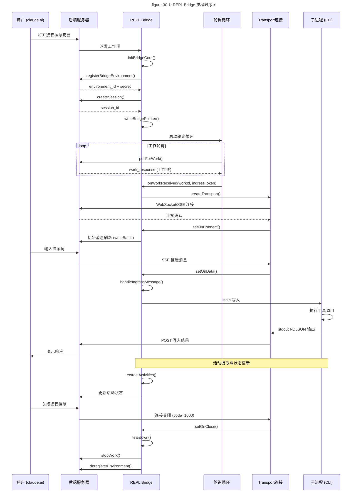

# 第30章：REPL Bridge - 远程控制集成

> **版本说明**：本文基于 Claude Code 源代码分析，请以最新版本为准。

## 30.1 引言

REPL Bridge 是 Claude Code 实现远程控制功能的核心组件。它允许用户通过 `claude.ai` 网站远程控制本地运行的 Claude Code CLI 会话，实现跨设备协作和远程访问。

本章将深入分析 REPL Bridge 的实现架构，包括 `replBridge.ts` 的核心逻辑、`sessionRunner.ts` 的会话管理，以及整体的集成模式。

## 30.2 replBridge.ts 核心实现

`replBridge.ts` 是 REPL Bridge 的核心模块，负责完整的远程控制生命周期管理：从环境注册、会话创建、轮询循环、WebSocket 连接到最终的清理销毁。

### 30.2.1 核心类型定义

文件首先定义了几个关键的类型接口：

```typescript
// 第70-81行
export type ReplBridgeHandle = {
  bridgeSessionId: string
  environmentId: string
  sessionIngressUrl: string
  writeMessages(messages: Message[]): void
  writeSdkMessages(messages: SDKMessage[]): void
  sendControlRequest(request: SDKControlRequest): void
  sendControlResponse(response: SDKControlResponse): void
  sendControlCancelRequest(requestId: string): void
  sendResult(): void
  teardown(): Promise<void>
}

// 第83行
export type BridgeState = 'ready' | 'connected' | 'reconnecting' | 'failed'
```

`ReplBridgeHandle` 是对外暴露的接口，提供了消息写入、控制请求发送和清理等功能。`BridgeState` 定义了连接的状态机，支持四种状态流转。

### 30.2.2 BridgeCoreParams 配置参数

```typescript
// 第91-221行
export type BridgeCoreParams = {
  dir: string                    // 工作目录
  machineName: string            // 机器名称
  branch: string                 // Git 分支
  gitRepoUrl: string | null      // Git 仓库 URL
  title: string                  // 会话标题
  baseUrl: string                // API 基础 URL
  sessionIngressUrl: string      // Session Ingress URL
  workerType: string             // 工作类型标识
  getAccessToken: () => string | undefined  // OAuth token 获取器
  createSession: (...) => Promise<string | null>  // 会话创建函数
  archiveSession: (sessionId: string) => Promise<void>  // 会话归档函数
  getCurrentTitle?: () => string  // 当前标题获取器
  toSDKMessages?: (messages: Message[]) => SDKMessage[]  // 消息转换器
  onAuth401?: (staleAccessToken: string) => Promise<boolean>  // OAuth 401 处理
  getPollIntervalConfig?: () => PollIntervalConfig  // 轮询配置
  initialHistoryCap?: number      // 初始历史消息上限
  initialMessages?: Message[]     // 初始消息
  previouslyFlushedUUIDs?: Set<string>  // 已刷新的 UUID
  onInboundMessage?: (msg: SDKMessage) => void  // 入站消息回调
  onPermissionResponse?: (response: SDKControlResponse) => void  // 权限响应回调
  onInterrupt?: () => void        // 中断回调
  onSetModel?: (model: string | undefined) => void  // 模型设置回调
  onSetMaxThinkingTokens?: (maxTokens: number | null) => void  // 思考令牌回调
  onSetPermissionMode?: (mode: PermissionMode) => ...  // 权限模式回调
  onStateChange?: (state: BridgeState, detail?: string) => void  // 状态变更回调
  onUserMessage?: (text: string, sessionId: string) => boolean  // 用户消息回调
  perpetual?: boolean            // 永久模式标志
  initialSSESequenceNum?: number // SSE 序列号
}
```

这个参数结构采用了依赖注入模式，所有上下文信息都通过参数传入，不读取任何 bootstrap state，确保模块的可测试性和独立性。

### 30.2.3 initBridgeCore 核心函数

`initBridgeCore` 是整个 REPL Bridge 的入口点：

```typescript
// 第260-262行
export async function initBridgeCore(
  params: BridgeCoreParams,
): Promise<BridgeCoreHandle | null>
```

函数执行以下核心流程：

1. **环境注册** (第351-367行)：
```typescript
const reg = await api.registerBridgeEnvironment(bridgeConfig)
environmentId = reg.environment_id
environmentSecret = reg.environment_secret
```

2. **会话创建** (第457-477行)：
```typescript
const createdSessionId = await createSession({
  environmentId,
  title,
  gitRepoUrl,
  branch,
  signal: AbortSignal.timeout(15_000),
})
currentSessionId = createdSessionId
```

3. **崩溃恢复指针写入** (第484-488行)：
```typescript
await writeBridgePointer(dir, {
  sessionId: currentSessionId,
  environmentId,
  source: 'repl',
})
```

4. **UUID 去重缓冲区初始化** (第518-527行)：
```typescript
const recentPostedUUIDs = new BoundedUUIDSet(2000)
const recentInboundUUIDs = new BoundedUUIDSet(2000)
```

### 30.2.4 重连机制

REPL Bridge 实现了复杂的重连机制，处理环境丢失后的恢复：

```typescript
// 第605-615行
async function reconnectEnvironmentWithSession(): Promise<boolean> {
  if (reconnectPromise) {
    return reconnectPromise  // 重入保护
  }
  reconnectPromise = doReconnect()
  try {
    return await reconnectPromise
  } finally {
    reconnectPromise = null
  }
}
```

`doReconnect` 函数采用两阶段策略：

**策略 1：原地重连** (第732-736行)：
```typescript
if (await tryReconnectInPlace(requestedEnvId, currentSessionId)) {
  logEvent('tengu_bridge_repl_reconnected_in_place', {})
  environmentRecreations = 0
  return true
}
```

**策略 2：新建会话** (第747-777行)：
```typescript
await archiveSession(currentSessionId)
const newSessionId = await createSession({
  environmentId,
  title: currentTitle,
  ...
})
currentSessionId = newSessionId
```

### 30.2.5 Transport 连接管理

`onWorkReceived` 回调处理工作项接收后的 Transport 连接：

```typescript
// 第1077-1082行
onWorkReceived: (
  workSessionId: string,
  ingressToken: string,
  workId: string,
  serverUseCcrV2: boolean,
) => {
  // ...
}
```

系统支持两种传输模式：

- **v1 (Session-Ingress)**：使用 HybridTransport，接受 OAuth 或 JWT 认证
- **v2 (CCR)**：使用 SSETransport + CCRClient，强制 JWT 认证

```typescript
// 第1139-1165行
const useCcrV2 = serverUseCcrV2 || isEnvTruthy(process.env.CLAUDE_BRIDGE_USE_CCR_V2)

let v1OauthToken: string | undefined
if (!useCcrV2) {
  v1OauthToken = getOAuthToken()
  if (!v1OauthToken) {
    // 跳过工作
    return
  }
  updateSessionIngressAuthToken(v1OauthToken)
}
```

### 30.2.6 wireTransport 连接绑定

`wireTransport` 函数负责绑定新创建的 Transport：

```typescript
// 第1208-1371行
const wireTransport = (newTransport: ReplBridgeTransport): void => {
  transport = newTransport

  newTransport.setOnConnect(() => {
    // 连接建立后的处理
    // 初始消息刷新、状态更新
  })

  newTransport.setOnData(data => {
    handleIngressMessage(data, ...)
  })

  newTransport.setOnClose(closeCode => {
    handleTransportPermanentClose(closeCode)
  })

  newTransport.connect()
}
```

## 30.3 sessionRunner.ts 会话运行器

`sessionRunner.ts` 负责实际的会话进程管理，创建子进程并处理其输入输出。

### 30.3.1 SessionSpawner 工厂函数

```typescript
// 第248-548行
export function createSessionSpawner(deps: SessionSpawnerDeps): SessionSpawner {
  return {
    spawn(opts: SessionSpawnOpts, dir: string): SessionHandle {
      // ...
    },
  }
}
```

### 30.3.2 子进程创建

```typescript
// 第335-340行
const child: ChildProcess = spawn(deps.execPath, args, {
  cwd: dir,
  stdio: ['pipe', 'pipe', 'pipe'],
  env,
  windowsHide: true,
})
```

关键命令行参数构造：

```typescript
// 第287-304行
const args = [
  ...deps.scriptArgs,
  '--print',
  '--sdk-url',
  opts.sdkUrl,
  '--session-id',
  opts.sessionId,
  '--input-format',
  'stream-json',
  '--output-format',
  'stream-json',
  '--replay-user-messages',
  ...(deps.verbose ? ['--verbose'] : []),
  ...(debugFile ? ['--debug-file', debugFile] : []),
  ...(deps.permissionMode ? ['--permission-mode', deps.permissionMode] : []),
]
```

### 30.3.3 环境变量配置

```typescript
// 第306-323行
const env: NodeJS.ProcessEnv = {
  ...deps.env,
  CLAUDE_CODE_OAUTH_TOKEN: undefined,  // 清除父进程 OAuth token
  CLAUDE_CODE_ENVIRONMENT_KIND: 'bridge',
  ...(deps.sandbox && { CLAUDE_CODE_FORCE_SANDBOX: '1' }),
  CLAUDE_CODE_SESSION_ACCESS_TOKEN: opts.accessToken,
  CLAUDE_CODE_POST_FOR_SESSION_INGRESS_V2: '1',
  ...(opts.useCcrV2 && {
    CLAUDE_CODE_USE_CCR_V2: '1',
    CLAUDE_CODE_WORKER_EPOCH: String(opts.workerEpoch),
  }),
}
```

### 30.3.4 NDJSON 输出解析

`extractActivities` 函数解析子进程的 NDJSON 输出：

```typescript
// 第107-200行
function extractActivities(
  line: string,
  sessionId: string,
  onDebug: (msg: string) => void,
): SessionActivity[] {
  let parsed: unknown
  try {
    parsed = jsonParse(line)
  } catch {
    return []
  }

  const msg = parsed as Record<string, unknown>
  const activities: SessionActivity[] = []

  switch (msg.type) {
    case 'assistant': {
      // 处理 assistant 消息
      for (const block of content) {
        if (b.type === 'tool_use') {
          activities.push({
            type: 'tool_start',
            summary: toolSummary(name, input),
            timestamp: now,
          })
        } else if (b.type === 'text') {
          activities.push({
            type: 'text',
            summary: text.slice(0, 80),
            timestamp: now,
          })
        }
      }
      break
    }
    case 'result': {
      // 处理结果消息
      if (subtype === 'success') {
        activities.push({
          type: 'result',
          summary: 'Session completed',
          timestamp: now,
        })
      }
      break
    }
  }

  return activities
}
```

### 30.3.5 工具动词映射

`TOOL_VERBS` 将工具名称映射为可读的活动描述：

```typescript
// 第69-89行
const TOOL_VERBS: Record<string, string> = {
  Read: 'Reading',
  Write: 'Writing',
  Edit: 'Editing',
  MultiEdit: 'Editing',
  Bash: 'Running',
  Glob: 'Searching',
  Grep: 'Searching',
  WebFetch: 'Fetching',
  WebSearch: 'Searching',
  Task: 'Running task',
  FileReadTool: 'Reading',
  FileWriteTool: 'Writing',
  FileEditTool: 'Editing',
  GlobTool: 'Searching',
  GrepTool: 'Searching',
  BashTool: 'Running',
  NotebookEditTool: 'Editing notebook',
  LSP: 'LSP',
}
```

### 30.3.6 SessionHandle 生命周期管理

```typescript
// 第482-543行
const handle: SessionHandle = {
  sessionId: opts.sessionId,
  done,
  activities,
  accessToken: opts.accessToken,
  lastStderr,
  get currentActivity(): SessionActivity | null {
    return currentActivity
  },
  kill(): void {
    // 发送 SIGTERM
  },
  forceKill(): void {
    // 发送 SIGKILL
  },
  writeStdin(data: string): void {
    // 写入 stdin
  },
  updateAccessToken(token: string): void {
    // 更新访问令牌
  },
}
```

## 30.4 REPL 集成模式

REPL Bridge 采用多层架构实现远程控制功能。

### 30.4.1 整体架构流程



### 30.4.2 消息流转机制

REPL Bridge 实现双向消息流转：

**入站消息** (从服务器到 CLI)：
1. 用户在 claude.ai 输入消息
2. 服务器通过 SSE 推送消息
3. Transport 的 `setOnData` 接收消息
4. `handleIngressMessage` 处理消息
5. 通过 `writeMessages` 或回调传递给 CLI

**出站消息** (从 CLI 到服务器)：
1. CLI 生成响应或工具结果
2. 通过 stdout 输出 NDJSON
3. `extractActivities` 解析活动
4. Transport 通过 POST 写入服务器
5. 服务器推送给用户

### 30.4.3 初始消息刷新机制

连接建立后，REPL Bridge 会刷新初始消息历史：

```typescript
// 第1241-1313行
if (!initialFlushDone && initialMessages && initialMessages.length > 0) {
  initialFlushDone = true

  const eligibleMessages = initialMessages.filter(
    m => isEligibleBridgeMessage(m) && !previouslyFlushedUUIDs?.has(m.uuid)
  )

  const cappedMessages = historyCap > 0 && eligibleMessages.length > historyCap
    ? eligibleMessages.slice(-historyCap)
    : eligibleMessages

  const sdkMessages = toSDKMessages(cappedMessages)
  void newTransport.writeBatch(events)
    .then(() => {
      // 标记 UUID 为已刷新
      if (previouslyFlushedUUIDs) {
        for (const sdkMsg of sdkMessages) {
          if (sdkMsg.uuid) {
            previouslyFlushedUUIDs.add(sdkMsg.uuid)
          }
        }
      }
    })
    .finally(() => {
      drainFlushGate()
      onStateChange?.('connected')
    })
}
```

### 30.4.4 FlushGate 机制

`FlushGate` 用于防止消息顺序错乱：

```typescript
// 第574行
const flushGate = new FlushGate<Message>()
```

在初始刷新期间，新消息被排队，等刷新完成后统一发送：

```typescript
// 第848-869行
function drainFlushGate(): void {
  const msgs = flushGate.end()
  if (msgs.length === 0) return
  if (!transport) {
    // 无法发送，记录警告
    return
  }
  for (const msg of msgs) {
    recentPostedUUIDs.add(msg.uuid)
  }
  const sdkMessages = toSDKMessages(msgs)
  void transport.writeBatch(events)
}
```

## 30.5 Session Runner 会话执行

### 30.5.1 进程生命周期

Session Runner 通过子进程管理会话执行：

```typescript
// 第448-480行
const done = new Promise<SessionDoneStatus>(resolve => {
  child.on('close', (code, signal) => {
    if (transcriptStream) {
      transcriptStream.end()
    }

    if (signal === 'SIGTERM' || signal === 'SIGINT') {
      resolve('interrupted')
    } else if (code === 0) {
      resolve('completed')
    } else {
      resolve('failed')
    }
  })

  child.on('error', err => {
    resolve('failed')
  })
})
```

### 30.5.2 stderr 捕获

stderr 输出被缓冲用于错误诊断：

```typescript
// 第352-366行
const lastStderr: string[] = []

if (child.stderr) {
  const stderrRl = createInterface({ input: child.stderr })
  stderrRl.on('line', line => {
    if (deps.verbose) {
      process.stderr.write(line + '\n')
    }
    if (lastStderr.length >= MAX_STDERR_LINES) {
      lastStderr.shift()  // Ring buffer
    }
    lastStderr.push(line)
  })
}
```

### 30.5.3 权限请求处理

子进程发出的权限请求被转发到服务器：

```typescript
// 第417-430行
if (msg.type === 'control_request') {
  const request = msg.request as Record<string, unknown> | undefined
  if (request?.subtype === 'can_use_tool' && deps.onPermissionRequest) {
    deps.onPermissionRequest(
      opts.sessionId,
      parsed as PermissionRequest,
      opts.accessToken,
    )
  }
}
```

### 30.5.4 访问令牌更新

通过 stdin 发送令牌更新：

```typescript
// 第527-542行
updateAccessToken(token: string): void {
  handle.accessToken = token
  handle.writeStdin(
    jsonStringify({
      type: 'update_environment_variables',
      variables: { CLAUDE_CODE_SESSION_ACCESS_TOKEN: token },
    }) + '\n',
  )
  deps.onDebug(
    `[bridge:session] Sent token refresh via stdin for sessionId=${opts.sessionId}`,
  )
}
```

## 30.6 关键特性总结

### 30.6.1 状态管理

REPL Bridge 实现完整的状态机：

- `ready`：初始化完成，等待连接
- `connected`：Transport 连接成功，可进行双向通信
- `reconnecting`：连接中断，正在尝试重连
- `failed`：连接失败，需要用户干预

### 30.6.2 错误恢复

系统提供多层错误恢复机制：

1. **Transport 自动重连**：WebSocket/SSE 内置重连逻辑
2. **环境重连**：`reconnectEnvironmentWithSession` 处理环境丢失
3. **会话重建**：在无法原地重连时创建新会话
4. **崩溃恢复指针**：`bridgePointer` 支持进程崩溃后的恢复

### 30.6.3 性能优化

- **UUID 去重**：防止消息重复发送
- **历史消息上限**：限制初始刷新的消息数量
- **活动环形缓冲**：仅保留最近10条活动
- **stderr 环形缓冲**：仅保留最近10行错误输出

### 30.6.4 安全考虑

- **OAuth token 清除**：子进程不继承父进程的 OAuth token
- **Session Access Token**：使用专用的会话令牌
- **权限请求转发**：敏感操作需要用户在 claude.ai 确认

## 30.7 小结

REPL Bridge 是 Claude Code 远程控制功能的核心实现。它通过 `replBridge.ts` 提供完整的生命周期管理，包括环境注册、会话创建、消息流转和错误恢复。`sessionRunner.ts` 则负责具体的子进程管理，处理 NDJSON 输出解析和活动提取。

整体架构采用依赖注入模式，确保模块的独立性和可测试性。多层错误恢复机制保证了远程控制会话的稳定性，即使在网络中断或进程崩溃的情况下也能恢复连接。

下一章将分析 Bridge 的传输层实现，深入了解 WebSocket 和 SSE 的具体细节。