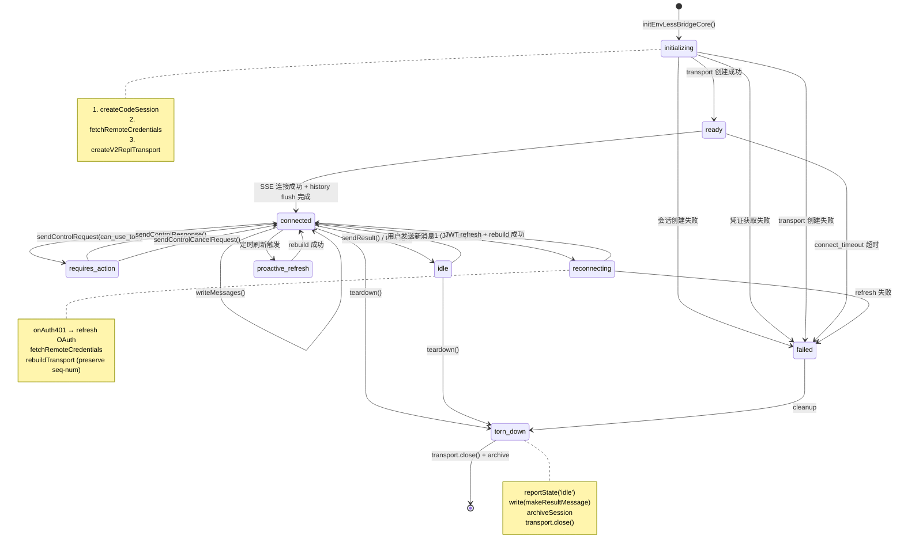

# 第三十一章：远程会话管理

> **版本说明**：本文基于 Claude Code 源代码分析，请以最新版本为准。

## 31.1 引言

远程会话管理是 Claude Code 实现 Remote Control 功能的核心组件。它允许用户通过 Web 界面（如 claude.ai）远程控制本地 CLI 会话，实现跨设备的协作体验。

主要职责包括：

1. **会话生命周期管理**：创建、维护、销毁远程会话
2. **认证与凭证刷新**：OAuth 认证、JWT 凭证管理、自动刷新
3. **双向通信通道**：SSE 读取流 + CCRClient 写入通道
4. **状态同步**：实时推送会话状态到远程服务器
5. **错误恢复**：401 认证失效恢复、传输重建

本章深入分析 `src/bridge/remoteBridgeCore.ts` 和相关模块，揭示 Claude Code 如何实现稳定的远程会话连接。

### 31.1.1 目录结构

```
src/bridge/
├── remoteBridgeCore.ts    # 远程会话核心逻辑 (主文件)
├── codeSessionApi.ts      # Session API HTTP 封装
├── replBridgeTransport.ts # 传输层抽象 (v1/v2)
├── envLessBridgeConfig.ts # 配置参数
├── bridgeMessaging.ts     # 消息处理与去重
├── jwtUtils.ts            # JWT 刷新调度器
├── flushGate.ts           # 写入队列门控
└── sessionIdCompat.ts     # Session ID 格式兼容
```

---

## 31.2 架构总览

### 31.2.1 Env-less 架构设计

`remoteBridgeCore.ts` 采用 "Env-less" 架构，直接连接 session-ingress 层，无需 Environments API 的 poll/dispatch 中间层：

| 特性 | Env-based (v1) | Env-less (v2) |
|------|---------------|---------------|
| 会话创建 | POST /environments/{id}/sessions | POST /v1/code/sessions |
| 凭证获取 | poll → dispatch → register | POST /v1/code/sessions/{id}/bridge |
| 生命周期 | register/poll/ack/stop/heartbeat/deregister | 无显式生命周期 |
| 认证方式 | OAuth + session_id+role=worker JWT | OAuth → worker_jwt 直接交换 |
| 复杂度 | ~2400 行 (initBridgeCore) | ~1000 行 |

**核心 API 流程**（见注释行 14-25）：

1. `POST /v1/code/sessions` → 创建会话，获取 `session.id`
2. `POST /v1/code/sessions/{id}/bridge` → 获取 `{worker_jwt, expires_in, api_base_url, worker_epoch}`
3. `createV2ReplTransport()` → 建立 SSE + CCRClient 传输通道
4. `createTokenRefreshScheduler()` → 定期刷新 JWT
5. 401 时自动重建传输（携带旧的 seq-num）

### 31.2.2 核心类型定义

**EnvLessBridgeParams**（行 89-131）定义了初始化参数：

```typescript
export type EnvLessBridgeParams = {
  baseUrl: string                // API 基础 URL
  orgUUID: string                // 组织 UUID
  title: string                  // 会话标题
  getAccessToken: () => string | undefined  // OAuth token getter
  onAuth401?: (staleAccessToken: string) => Promise<boolean>  // 401 处理回调
  toSDKMessages: (messages: Message[]) => SDKMessage[]  // 消息转换器
  initialHistoryCap: number      // 初始历史消息上限
  initialMessages?: Message[]    // 初始历史消息
  onInboundMessage?: (msg: SDKMessage) => void | Promise<void>  // 入站消息回调
  onUserMessage?: (text: string, sessionId: string) => boolean  // 用户消息回调（用于标题生成）
  onPermissionResponse?: (response: SDKControlResponse) => void  // 权限响应回调
  onInterrupt?: () => void       // 中断回调
  onSetModel?: (model: string | undefined) => void  // 模型设置回调
  onStateChange?: (state: BridgeState, detail?: string) => void  // 状态变更回调
  outboundOnly?: boolean         // 仅出站模式（用于 mirror 模式）
  tags?: string[]                // 会话标签
}
```

**RemoteCredentials**（行 86-91，codeSessionApi.ts）定义了 bridge 凭证：

```typescript
export type RemoteCredentials = {
  worker_jwt: string      // Worker JWT（opaque，不解码）
  api_base_url: string    // CCR API 基础 URL
  expires_in: number      // JWT 有效期（秒）
  worker_epoch: number    // Worker epoch（每次 /bridge 调用递增）
}
```

---

## 31.3 会话生命周期

### 31.3.1 会话状态图

下图展示了远程会话的完整状态流转：



**图 31-1: 远程会话状态流转图**

### 31.3.2 初始化流程

**initEnvLessBridgeCore()**（行 140-887）是会话初始化的核心函数：

**第一步：创建会话**（行 166-186）

```typescript
// 行 173-178: 带重试的会话创建
const createdSessionId = await withRetry(
  () =>
    createCodeSession(baseUrl, accessToken, title, cfg.http_timeout_ms, tags),
  'createCodeSession',
  cfg,
)
```

会话创建通过 `POST /v1/code/sessions` 完成，返回格式为 `cse_*` 的 session ID。

**第二步：获取 Bridge 凭证**（行 188-211）

```typescript
// 行 189-199: 带重试的凭证获取
const credentials = await withRetry(
  () =>
    fetchRemoteCredentials(
      sessionId,
      baseUrl,
      accessToken,
      cfg.http_timeout_ms,
    ),
  'fetchRemoteCredentials',
  cfg,
)
```

每次 `/bridge` 调用都会递增 `worker_epoch`，这是服务端用于检测 epoch mismatch 的关键机制。

**第三步：创建传输层**（行 216-256）

```typescript
// 行 222-236: 创建 v2 传输层
transport = await createV2ReplTransport({
  sessionUrl: buildCCRv2SdkUrl(credentials.api_base_url, sessionId),
  ingressToken: credentials.worker_jwt,
  sessionId,
  epoch: credentials.worker_epoch,
  heartbeatIntervalMs: cfg.heartbeat_interval_ms,
  heartbeatJitterFraction: cfg.heartbeat_jitter_fraction,
  getAuthToken: () => credentials.worker_jwt,
  outboundOnly,
})
```

### 31.3.3 状态追踪机制

会话使用多个状态变量追踪运行状态（行 258-294）：

| 变量 | 类型 | 作用 |
|------|------|------|
| `recentPostedUUIDs` | BoundedUUIDSet | 已发送消息 UUID（防止 echo 重复） |
| `initialMessageUUIDs` | Set<string> | 初始消息 UUID（兜底去重） |
| `recentInboundUUIDs` | BoundedUUIDSet | 入站消息 UUID（防止重投递） |
| `flushGate` | FlushGate<Message> | 写入队列门控（flush期间排队） |
| `initialFlushDone` | boolean | 初始历史是否已发送 |
| `tornDown` | boolean | 是否已销毁 |
| `authRecoveryInFlight` | boolean | 401 恢复是否进行中 |
| `connectCause` | ConnectCause | 连接触发原因（用于遥测） |

**ConnectCause 类型**（行 79）定义了连接触发来源：

```typescript
type ConnectCause = 'initial' | 'proactive_refresh' | 'auth_401_recovery'
```

---

## 31.4 远程控制 API

### 31.4.1 Session API 端点

`codeSessionApi.ts` 封装了两个核心 HTTP 端点：

**createCodeSession()**（行 26-80）

```typescript
// 行 36-47: POST /v1/code/sessions
response = await axios.post(
  `${baseUrl}/v1/code/sessions`,
  { title, bridge: {}, ...(tags?.length ? { tags } : {}) },
  {
    headers: oauthHeaders(accessToken),
    timeout: timeoutMs,
    validateStatus: s => s < 500,
  },
)
```

请求体中的 `bridge: {}` 是服务端识别 BridgeRunner 的关键信号。

**fetchRemoteCredentials()**（行 93-168）

```typescript
// 行 106-115: POST /v1/code/sessions/{sessionId}/bridge
response = await axios.post(
  `${baseUrl}/v1/code/sessions/${sessionId}/bridge`,
  {},
  {
    headers: {
      ...oauthHeaders(accessToken),
      ...(trustedDeviceToken ? { 'X-Trusted-Device-Token': trustedDeviceToken } : {}),
    },
    timeout: timeoutMs,
    validateStatus: s => s < 500,
  },
)
```

响应验证严格检查所有必需字段（行 131-161），并处理 protojson 的 int64 字符串序列化。

### 31.4.2 控制消息处理

**ReplBridgeHandle**（行 763-886）定义了对外暴露的控制接口：

```typescript
return {
  bridgeSessionId: sessionId,
  environmentId: '',
  sessionIngressUrl: credentials.api_base_url,
  
  // 消息写入
  writeMessages(messages) { ... },
  writeSdkMessages(messages) { ... },
  
  // 控制请求
  sendControlRequest(request) { ... },
  sendControlResponse(response) { ... },
  sendControlCancelRequest(requestId) { ... },
  
  // 结果发送
  sendResult() { ... },
  
  // 销毁
  async teardown() { ... },
}
```

**writeMessages()**（行 767-811）处理消息写入：

```typescript
// 行 768-773: 去重过滤
const filtered = messages.filter(
  m =>
    isEligibleBridgeMessage(m) &&
    !initialMessageUUIDs.has(m.uuid) &&
    !recentPostedUUIDs.has(m.uuid),
)

// 行 790-795: flushGate 排队检查
if (flushGate.enqueue(...filtered)) {
  logForDebugging(`[remote-bridge] Queued ${filtered.length} message(s) during flush`)
  return
}

// 行 807-809: 用户消息触发 running 状态
if (filtered.some(m => m.type === 'user')) {
  transport.reportState('running')
}
```

**sendControlRequest()**（行 824-838）发送权限请求：

```typescript
// 行 832-833: can_use_tool 触发 requires_action 状态
if (request.request.subtype === 'can_use_tool') {
  transport.reportState('requires_action')
}
void transport.write(event)
```

---

## 31.5 Headless 模式

### 31.5.1 Outbound-only 模式

`outboundOnly` 参数启用 Headless 模式，用于 CCR mirror 场景（行 127-128）：

```typescript
/**
 * When true, skip opening the SSE read stream — only the CCRClient write
 * path is activated. Threaded to createV2ReplTransport and
 * handleServerControlRequest.
 */
outboundOnly?: boolean
```

在此模式下：

1. **跳过 SSE 读取流**：不接收入站消息
2. **仅激活写入通道**：CCRClient POST /worker/events
3. **无 delivery ACK**：不需要处理入站事件的确认

**replBridgeTransport.ts 的实现**（行 340-344）：

```typescript
// connect() 方法中的 outbound-only 处理
if (!opts.outboundOnly) {
  void sse.connect()  // 正常模式：打开 SSE 流
}
void ccr.initialize(epoch).then(...)  // 两种模式都初始化 CCRClient
```

### 31.5.2 Mirror 模式遥测

Headless 模式使用独立的遥测事件（行 748-760）：

```typescript
// 行 748-752: CCR mirror 启动遥测
if (feature('CCR_MIRROR') && outboundOnly) {
  logEvent('tengu_ccr_mirror_started', {
    v2: true,
    expires_in_s: credentials.expires_in,
  })
} else {
  // 行 754-759: 正常 REPL 启动遥测
  logEvent('tengu_bridge_repl_started', {
    has_initial_messages: !!(initialMessages && initialMessages.length > 0),
    v2: true,
    expires_in_s: credentials.expires_in,
    inProtectedNamespace: isInProtectedNamespace(),
  })
}
```

---

## 31.6 SDK 模式支持

### 31.6.1 SDK 集成设计

`codeSessionApi.ts` 被独立提取，专门为 SDK 集成提供轻量级导出（见注释行 915-920）：

```typescript
// 行 915-920: SDK 可用的轻量级导出
export {
  createCodeSession,
  type RemoteCredentials,
} from './codeSessionApi.js'
```

**设计原因**（见 codeSessionApi.ts 注释行 1-8）：

> "Separate file from remoteBridgeCore.ts so the SDK /bridge subpath can export createCodeSession + fetchRemoteCredentials without bundling the heavy CLI tree (analytics, transport, etc.)."

SDK 使用者可以：

1. 直接调用 `createCodeSession()` 创建会话
2. 调用 `fetchRemoteCredentials()` 获取凭证
3. 无需引入 analytics、transport 等重量级依赖

### 31.6.2 CLI 侧封装

CLI 使用额外的封装层，注入 CLI 特有的配置（行 931-948）：

```typescript
// CLI 侧 wrapper，注入 trusted-device token 和 dev override
export async function fetchRemoteCredentials(
  sessionId: string,
  baseUrl: string,
  accessToken: string,
  timeoutMs: number,
): Promise<RemoteCredentials | null> {
  const creds = await fetchRemoteCredentialsRaw(
    sessionId,
    baseUrl,
    accessToken,
    timeoutMs,
    getTrustedDeviceToken(),  // CLI 侧注入
  )
  if (!creds) return null
  return getBridgeBaseUrlOverride()  // CLI 侧 dev override
    ? { ...creds, api_base_url: baseUrl }
    : creds
}
```

这两个注入项是 CLI 专属的：

- `getTrustedDeviceToken()`：可信设备 token
- `getBridgeBaseUrlOverride()`：开发环境的 URL 覆盖

SDK 集成时直接使用原始函数，无需这些 CLI 特性。

---

## 31.7 传输层重建与认证恢复

### 31.7.1 JWT 刷新调度

**createTokenRefreshScheduler()**（行 317-377）配置定期 JWT 刷新：

```typescript
// 行 317-327: 刷新配置
const refresh = createTokenRefreshScheduler({
  refreshBufferMs: cfg.token_refresh_buffer_ms,  // 默认 5 分钟
  getAccessToken: async () => {
    const stale = getAccessToken()
    if (onAuth401) await onAuth401(stale ?? '')  // 先刷新 OAuth
    return getAccessToken() ?? stale
  },
  onRefresh: (sid, oauthToken) => { ... },
  label: 'remote',
})
```

刷新策略：

1. 在 JWT 过期前 `refreshBufferMs` 秒触发
2. 先刷新 OAuth token（通过 `onAuth401`）
3. 再调用 `/bridge` 获取新 worker JWT
4. 重建传输层，携带新的 epoch

### 31.7.2 传输重建机制

**rebuildTransport()**（行 477-527）处理传输重建：

```typescript
// 行 486-498: 重建流程
flushGate.start()  // 开始排队写入
const seq = transport.getLastSequenceNum()  // 保存 seq-num
transport.close()  // 关闭旧传输

transport = await createV2ReplTransport({
  sessionUrl: buildCCRv2SdkUrl(fresh.api_base_url, sessionId),
  ingressToken: fresh.worker_jwt,
  sessionId,
  epoch: fresh.worker_epoch,  // 新 epoch
  initialSequenceNum: seq,    // 恢复 seq-num
  ...
})

wireTransportCallbacks()  // 重连回调
transport.connect()
```

**关键设计**：

- `getLastSequenceNum()`：保存 SSE 序列号高水位，避免服务端重放全部历史
- `flushGate`：排队重建期间的写入，防止消息丢失
- `authRecoveryInFlight`：防止 laptop wake 时 proactive refresh 和 401 recovery 同时触发

### 31.7.3 401 认证恢复

**recoverFromAuthFailure()**（行 530-590）处理 SSE 401 事件：

```typescript
// 行 534-536: 防止并行恢复
if (authRecoveryInFlight) return
authRecoveryInFlight = true
onStateChange?.('reconnecting', 'JWT expired — refreshing')

// 行 543-551: OAuth refresh
const stale = getAccessToken()
if (onAuth401) await onAuth401(stale ?? '')
const oauthToken = getAccessToken() ?? stale

// 行 552-563: 重新获取凭证
const fresh = await withRetry(
  () => fetchRemoteCredentials(sessionId, baseUrl, oauthToken, cfg.http_timeout_ms),
  'fetchRemoteCredentials (recovery)',
  cfg,
)

// 行 575: 重置 flush 状态（如果 401 打断了初始 flush）
initialFlushDone = false
await rebuildTransport(fresh, 'auth_401_recovery')
```

---

## 31.8 会话销毁

### 31.8.1 teardown 流程

**teardown()**（行 664-745）处理会话销毁：

```typescript
// 行 664-669: 状态清理
tornDown = true
refresh.cancelAll()  // 取消所有刷新定时器
clearTimeout(connectDeadline)
flushGate.drop()     // 丢弃排队消息

// 行 677-678: 发送结果消息
transport.reportState('idle')
void transport.write(makeResultMessage(sessionId))

// 行 680-687: 归档会话
let status = await archiveSession(
  sessionId,
  baseUrl,
  token,
  orgUUID,
  cfg.teardown_archive_timeout_ms,  // 默认 1500ms
)

// 行 697-714: 401 retry（token 过期时的重试）
if (status === 401 && onAuth401) {
  await onAuth401(token ?? '')
  token = getAccessToken()
  status = await archiveSession(...)
}

// 行 716: 关闭传输
transport.close()
```

### 31.8.2 归档状态遥测

归档结果被分类为遥测状态（行 718-727）：

```typescript
type ArchiveTelemetryStatus =
  | 'ok'               // 归档成功
  | 'skipped_no_token' // 无 token
  | 'network_error'    // 网络错误/超时
  | 'server_4xx'       // 服务端 4xx
  | 'server_5xx'       // 服务端 5xx
```

### 31.8.3 cleanup 注册

销毁函数通过 cleanup registry 注册（行 746）：

```typescript
const unregister = registerCleanup(teardown)
```

确保 SIGINT/SIGTERM/exit 时执行清理，与 gracefulShutdown 的 2s 超时窗口协调。

---

## 31.9 重试与容错机制

### 31.9.1 withRetry 机制

**withRetry()**（行 892-913）提供指数退避重试：

```typescript
async function withRetry<T>(
  fn: () => Promise<T | null>,
  label: string,
  cfg: EnvLessBridgeConfig,
): Promise<T | null> {
  const max = cfg.init_retry_max_attempts
  for (let attempt = 1; attempt <= max; attempt++) {
    const result = await fn()
    if (result !== null) return result
    if (attempt < max) {
      // 行 902-905: 指数退避 + jitter
      const base = cfg.init_retry_base_delay_ms * 2 ** (attempt - 1)
      const jitter = base * cfg.init_retry_jitter_fraction * (2 * Math.random() - 1)
      const delay = Math.min(base + jitter, cfg.init_retry_max_delay_ms)
      await sleep(delay)
    }
  }
  return null
}
```

### 31.9.2 配置参数

`EnvLessBridgeConfig` 定义关键超时和重试参数：

| 参数 | 默认值 | 作用 |
|------|--------|------|
| `http_timeout_ms` | - | HTTP 请求超时 |
| `connect_timeout_ms` | - | SSE 连接超时 |
| `heartbeat_interval_ms` | 20s | CCRClient 心跳间隔 |
| `heartbeat_jitter_fraction` | 0 | 心跳抖动比例 |
| `token_refresh_buffer_ms` | 5min | JWT 刷新提前量 |
| `init_retry_max_attempts` | - | 初始化重试次数 |
| `init_retry_base_delay_ms` | - | 重试基础延迟 |
| `init_retry_jitter_fraction` | - | 重试抖动比例 |
| `uuid_dedup_buffer_size` | 2000 | UUID 去重缓冲区大小 |
| `teardown_archive_timeout_ms` | 1500ms | 销毁归档超时 |

---

## 31.10 总结

本章深入分析了 Claude Code 的远程会话管理架构：

1. **Env-less 设计**：简化了 Environments API 中间层，直接通过 `/bridge` 端点获取 worker JWT
2. **状态机管理**：清晰的状态流转，从初始化到销毁的完整生命周期
3. **认证恢复**：proactive refresh 和 401 recovery 双重机制确保连接稳定
4. **传输重建**：保留 seq-num 避免历史重放，flushGate 防止消息丢失
5. **SDK 支持**：独立的轻量级导出，支持外部 SDK 集成

远程会话管理是 Claude Code Remote Control 功能的技术基础，其稳定的连接机制和完善的错误恢复策略，确保了跨设备协作体验的可靠性。

---

## 参考文件

- `/Users/hw/workspaces/projects/claude-wiki/src/bridge/remoteBridgeCore.ts`（主文件，1009 行）
- `/Users/hw/workspaces/projects/claude-wiki/src/bridge/codeSessionApi.ts`（Session API，169 行）
- `/Users/hw/workspaces/projects/claude-wiki/src/bridge/replBridgeTransport.ts`（传输层，371 行）