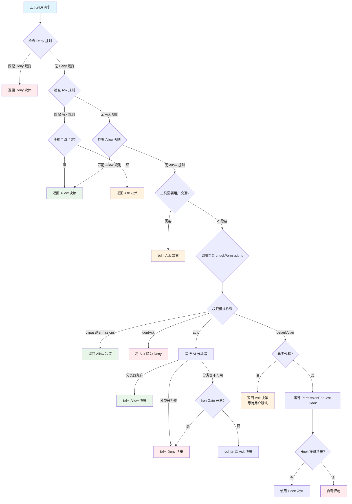

# 第33章：权限系统

## 33.1 引言

权限系统是 Claude Code 的安全基石，负责控制 AI 对系统资源的访问权限。通过权限系统，Claude Code 确保：

- **工具访问控制**：限制 AI 可使用的工具范围
- **文件操作保护**：防止对敏感文件的意外修改
- **命令执行约束**：控制 Bash/PowerShell 命令的执行
- **用户交互决策**：在关键操作前请求用户确认

权限系统的设计遵循以下核心原则：

1. **多层次防护**：从规则匹配到安全检查，层层把关
2. **灵活配置**：支持多种权限模式和规则来源
3. **智能分类**：Auto 模式使用 AI 分类器自动判断
4. **安全回退**：当分类器不可用时自动回退到用户提示

源代码位置：
- `/Users/hw/workspaces/projects/claude-wiki/src/utils/permissions/` - 权限系统核心模块
- `/Users/hw/workspaces/projects/claude-wiki/src/types/permissions.ts` - 权限类型定义

## 33.2 权限模式

Claude Code 提供多种权限模式，适应不同安全需求和使用场景。

### 33.2.1 模式类型定义

权限模式定义位于 `src/types/permissions.ts`（第 16-38 行）：

```typescript
// 外部可用的权限模式
export const EXTERNAL_PERMISSION_MODES = [
  'acceptEdits',
  'bypassPermissions',
  'default',
  'dontAsk',
  'plan',
] as const

export type ExternalPermissionMode = (typeof EXTERNAL_PERMISSION_MODES)[number]

// 内部完整模式集合（包含 ant-only 的 auto 模式）
export type PermissionMode = ExternalPermissionMode | 'auto' | 'bubble'
```

### 33.2.2 模式配置表

权限模式配置定义于 `src/utils/permissions/PermissionMode.ts`（第 42-91 行）：

| 模式 | 标题 | 符号 | 颜色 | 说明 |
|-----|------|-----|-----|------|
| `default` | Default | 无 | text | 默认模式，需要用户确认敏感操作 |
| `plan` | Plan Mode | ⏸ | planMode | 计划模式，仅读取和规划 |
| `acceptEdits` | Accept edits | ⏵⏵ | autoAccept | 自动接受工作目录内的编辑 |
| `bypassPermissions` | Bypass Permissions | ⏵⏵ | error | 绕过所有权限检查（危险） |
| `dontAsk` | Don't Ask | ⏵⏵ | error | 将所有询问转为拒绝 |
| `auto` | Auto mode | ⏵⏵ | warning | 使用 AI 分类器自动决策 |

模式配置源码：

```typescript
// 源码位置: PermissionMode.ts:42-91
const PERMISSION_MODE_CONFIG: Partial<Record<PermissionMode, PermissionModeConfig>> = {
  default: {
    title: 'Default',
    shortTitle: 'Default',
    symbol: '',
    color: 'text',
    external: 'default',
  },
  plan: {
    title: 'Plan Mode',
    shortTitle: 'Plan',
    symbol: PAUSE_ICON,
    color: 'planMode',
    external: 'plan',
  },
  acceptEdits: {
    title: 'Accept edits',
    shortTitle: 'Accept',
    symbol: '⏵⏵',
    color: 'autoAccept',
    external: 'acceptEdits',
  },
  bypassPermissions: {
    title: 'Bypass Permissions',
    shortTitle: 'Bypass',
    symbol: '⏵⏵',
    color: 'error',
    external: 'bypassPermissions',
  },
  dontAsk: {
    title: "Don't Ask",
    shortTitle: 'DontAsk',
    symbol: '⏵⏵',
    color: 'error',
    external: 'dontAsk',
  },
  // auto 模式仅限 ant 内部用户
  ...(feature('TRANSCRIPT_CLASSIFIER')
    ? {
        auto: {
          title: 'Auto mode',
          shortTitle: 'Auto',
          symbol: '⏵⏵',
          color: 'warning',
          external: 'default',
        },
      }
    : {}),
}
```

### 33.2.3 模式切换逻辑

用户可通过 Shift+Tab 快捷键循环切换权限模式。切换逻辑位于 `src/utils/permissions/getNextPermissionMode.ts`（第 34-79 行）：

```typescript
export function getNextPermissionMode(
  toolPermissionContext: ToolPermissionContext,
): PermissionMode {
  switch (toolPermissionContext.mode) {
    case 'default':
      // Ant 用户跳过 acceptEdits 和 plan，auto 模式替代它们
      if (process.env.USER_TYPE === 'ant') {
        if (toolPermissionContext.isBypassPermissionsModeAvailable) {
          return 'bypassPermissions'
        }
        if (canCycleToAuto(toolPermissionContext)) {
          return 'auto'
        }
        return 'default'
      }
      return 'acceptEdits'

    case 'acceptEdits':
      return 'plan'

    case 'plan':
      // plan -> bypassPermissions -> auto -> default
      if (toolPermissionContext.isBypassPermissionsModeAvailable) {
        return 'bypassPermissions'
      }
      return 'default'

    case 'bypassPermissions':
      if (canCycleToAuto(toolPermissionContext)) {
        return 'auto'
      }
      return 'default'

    case 'dontAsk':
      return 'default'

    default:
      return 'default'
  }
}
```

## 33.3 规则匹配机制

规则匹配是权限系统的核心，负责将用户配置的权限规则与当前工具调用进行匹配。

### 33.3.1 规则结构定义

权限规则由三部分组成，定义于 `src/types/permissions.ts`（第 44-79 行）：

```typescript
// 权限行为类型
export type PermissionBehavior = 'allow' | 'deny' | 'ask'

// 规则来源
export type PermissionRuleSource =
  | 'userSettings'    // 用户全局设置
  | 'projectSettings' // 项目设置
  | 'localSettings'   // 本地设置
  | 'flagSettings'    // 命令行标志
  | 'policySettings'  // 管理策略
  | 'cliArg'          // CLI 参数
  | 'command'         // 命令来源
  | 'session'         // 会话来源

// 规则值：指定工具和可选内容
export type PermissionRuleValue = {
  toolName: string      // 工具名称，如 'Bash', 'Read'
  ruleContent?: string  // 规则内容，如 'npm:*', '/path/**'
}

// 完整规则
export type PermissionRule = {
  source: PermissionRuleSource     // 规则来源
  ruleBehavior: PermissionBehavior // 规则行为
  ruleValue: PermissionRuleValue   // 规则值
}
```

### 33.3.2 规则解析器

规则字符串解析位于 `src/utils/permissions/permissionRuleParser.ts`（第 93-133 行）：

```typescript
/**
 * 解析权限规则字符串为结构化对象
 * 格式: "ToolName" 或 "ToolName(content)"
 *
 * @example
 * permissionRuleValueFromString('Bash')
 *   // => { toolName: 'Bash' }
 * permissionRuleValueFromString('Bash(npm install)')
 *   // => { toolName: 'Bash', ruleContent: 'npm install' }
 * permissionRuleValueFromString('Bash(npm:*)')
 *   // => { toolName: 'Bash', ruleContent: 'npm:*' }
 */
export function permissionRuleValueFromString(
  ruleString: string,
): PermissionRuleValue {
  // 查找第一个未转义的左括号
  const openParenIndex = findFirstUnescapedChar(ruleString, '(')
  if (openParenIndex === -1) {
    // 无括号：仅工具名称
    return { toolName: normalizeLegacyToolName(ruleString) }
  }

  // 查找最后一个未转义的右括号
  const closeParenIndex = findLastUnescapedChar(ruleString, ')')
  if (closeParenIndex === -1 || closeParenIndex <= openParenIndex) {
    return { toolName: normalizeLegacyToolName(ruleString) }
  }

  // 确保右括号在末尾
  if (closeParenIndex !== ruleString.length - 1) {
    return { toolName: normalizeLegacyToolName(ruleString) }
  }

  const toolName = ruleString.substring(0, openParenIndex)
  const rawContent = ruleString.substring(openParenIndex + 1, closeParenIndex)

  // 空内容或单独通配符视为工具级规则
  if (rawContent === '' || rawContent === '*') {
    return { toolName: normalizeLegacyToolName(toolName) }
  }

  // 解码转义字符
  const ruleContent = unescapeRuleContent(rawContent)
  return { toolName: normalizeLegacyToolName(toolName), ruleContent }
}
```

### 33.3.3 Shell 规则匹配模式

Shell 命令规则匹配支持三种模式，位于 `src/utils/permissions/shellRuleMatching.ts`（第 25-184 行）：

```typescript
/**
 * Shell 权限规则类型
 */
export type ShellPermissionRule =
  | { type: 'exact'; command: string }    // 精确匹配
  | { type: 'prefix'; prefix: string }    // 前缀匹配（旧语法 :*）
  | { type: 'wildcard'; pattern: string } // 通配符匹配

/**
 * 解析权限规则字符串
 */
export function parsePermissionRule(permissionRule: string): ShellPermissionRule {
  // 首先检查传统 :* 前缀语法（向后兼容）
  const prefix = permissionRuleExtractPrefix(permissionRule)
  if (prefix !== null) {
    return { type: 'prefix', prefix }
  }

  // 检查新通配符语法
  if (hasWildcards(permissionRule)) {
    return { type: 'wildcard', pattern: permissionRule }
  }

  // 否则为精确匹配
  return { type: 'exact', command: permissionRule }
}
```

通配符匹配逻辑：

```typescript
/**
 * 通配符模式匹配
 * 支持 * 匹配任意字符序列，\* 匹配字面星号
 */
export function matchWildcardPattern(
  pattern: string,
  command: string,
  caseInsensitive = false,
): boolean {
  // 处理转义序列：\* 和 \\
  let processed = ''
  // ... 转义处理逻辑

  // 转义正则特殊字符（除 * 外）
  const escaped = processed.replace(/[.+?^${}()|[\]\\'"]/g, '\\$&')

  // 将未转义的 * 转换为 .* 正则通配符
  const withWildcards = escaped.replace(/\*/g, '.*')

  // 特殊处理：单尾随通配符时可选匹配
  // 如 'git *' 可匹配 'git' 和 'git add'
  if (regexPattern.endsWith(' .*') && unescapedStarCount === 1) {
    regexPattern = regexPattern.slice(0, -3) + '( .*)?'
  }

  const flags = 's' + (caseInsensitive ? 'i' : '')
  const regex = new RegExp(`^${withWildcards}$`, flags)
  return regex.test(command)
}
```

### 33.3.4 规则匹配优先级

规则匹配遵循以下优先级顺序（`src/utils/permissions/pathValidation.ts`）：

1. **Deny 规则优先** - 任何匹配的 Deny 规则立即拒绝
2. **内部路径检查** - 计划文件、会话内存等内部可编辑路径
3. **安全检查** - 危险文件、危险目录检查
4. **工作目录检查** - acceptEdits 模式下的自动允许
5. **Allow 规则** - 匹配的 Allow 规则允许执行
6. **默认行为** - 未匹配任何规则时根据模式决定

```typescript
// 源码位置: permissions.ts:122-132
export function getAllowRules(context: ToolPermissionContext): PermissionRule[] {
  return PERMISSION_RULE_SOURCES.flatMap(source =>
    (context.alwaysAllowRules[source] || []).map(ruleString => ({
      source,
      ruleBehavior: 'allow',
      ruleValue: permissionRuleValueFromString(ruleString),
    })),
  )
}

export function getDenyRules(context: ToolPermissionContext): PermissionRule[] {
  return PERMISSION_RULE_SOURCES.flatMap(source =>
    (context.alwaysDenyRules[source] || []).map(ruleString => ({
      source,
      ruleBehavior: 'deny',
      ruleValue: permissionRuleValueFromString(ruleString),
    })),
  )
}
```

### 33.3.5 规则加载

权限规则从多个来源加载（`src/utils/permissions/permissionsLoader.ts` 第 120-146 行）：

```typescript
/**
 * 从磁盘加载所有权限规则
 */
export function loadAllPermissionRulesFromDisk(): PermissionRule[] {
  // 如果启用管理规则限制，仅使用管理规则
  if (shouldAllowManagedPermissionRulesOnly()) {
    return getPermissionRulesForSource('policySettings')
  }

  // 否则从所有启用的来源加载
  const rules: PermissionRule[] = []
  for (const source of getEnabledSettingSources()) {
    rules.push(...getPermissionRulesForSource(source))
  }
  return rules
}
```

## 33.4 Allow/Deny/Ask 行为模式

### 33.4.1 行为类型定义

权限决策有四种可能的行为（`src/types/permissions.ts`）：

```typescript
export type PermissionBehavior = 'allow' | 'deny' | 'ask'

// 扩展的权限结果类型
export type PermissionResult<Input = { [key: string]: unknown }> =
  | PermissionAllowDecision<Input>   // 允许执行
  | PermissionAskDecision<Input>     // 请求用户确认
  | PermissionDenyDecision           // 拒绝执行
  | { behavior: 'passthrough', ... } // 传递给子组件决策
```

### 33.4.2 决策类型详细定义

决策类型定义于 `src/types/permissions.ts`（第 171-246 行）：

```typescript
/**
 * 允许决策
 */
export type PermissionAllowDecision<Input> = {
  behavior: 'allow'
  updatedInput?: Input       // 可能被修改的输入
  userModified?: boolean     // 用户是否修改了输入
  decisionReason?: PermissionDecisionReason
  toolUseID?: string
  acceptFeedback?: string    // 用户反馈
  contentBlocks?: ContentBlockParam[]
}

/**
 * 询问决策
 */
export type PermissionAskDecision<Input> = {
  behavior: 'ask'
  message: string            // 提示消息
  updatedInput?: Input
  decisionReason?: PermissionDecisionReason
  suggestions?: PermissionUpdate[]  // 权限更新建议
  blockedPath?: string       // 被阻止的路径
  metadata?: PermissionMetadata
  pendingClassifierCheck?: PendingClassifierCheck  // 异步分类器检查
  contentBlocks?: ContentBlockParam[]
}

/**
 * 拒绝决策
 */
export type PermissionDenyDecision = {
  behavior: 'deny'
  message: string
  decisionReason: PermissionDecisionReason
  toolUseID?: string
}
```

### 33.4.3 决策原因类型

系统记录详细的决策原因，用于日志分析和用户提示：

```typescript
// 源码位置: src/types/permissions.ts:270-324
export type PermissionDecisionReason =
  | { type: 'rule'; rule: PermissionRule }            // 规则匹配触发
  | { type: 'mode'; mode: PermissionMode }            // 权限模式触发
  | { type: 'subcommandResults'; reasons: Map<string, PermissionResult> }  // 子命令结果
  | { type: 'permissionPromptTool'; permissionPromptToolName: string; toolResult: unknown }
  | { type: 'hook'; hookName: string; hookSource?: string; reason?: string }  // Hook 触发
  | { type: 'asyncAgent'; reason: string }            // 异步代理环境
  | { type: 'sandboxOverride'; reason: 'excludedCommand' | 'dangerouslyDisableSandbox' }
  | { type: 'classifier'; classifier: string; reason: string }  // AI 分类器决策
  | { type: 'workingDir'; reason: string }            // 工作目录限制
  | { type: 'safetyCheck'; reason: string; classifierApprovable: boolean }  // 安全检查
  | { type: 'other'; reason: string }                 // 其他原因
```

### 33.4.4 权限检查流程图

**图 33-1: 权限检查流程图**



### 33.4.5 核心权限检查函数

主权限检查入口位于 `src/utils/permissions/permissions.ts`（第 473-700 行）：

```typescript
export const hasPermissionsToUseTool: CanUseToolFn = async (
  tool,
  input,
  context,
  assistantMessage,
  toolUseID,
): Promise<PermissionDecision> => {
  const result = await hasPermissionsToUseToolInner(tool, input, context)

  // Allow 结果处理：重置连续拒绝计数
  if (result.behavior === 'allow') {
    const appState = context.getAppState()
    if (feature('TRANSCRIPT_CLASSIFIER')) {
      const currentDenialState = context.localDenialTracking ?? appState.denialTracking
      if (appState.toolPermissionContext.mode === 'auto' &&
          currentDenialState && currentDenialState.consecutiveDenials > 0) {
        const newDenialState = recordSuccess(currentDenialState)
        persistDenialState(context, newDenialState)
      }
    }
    return result
  }

  // Ask 结果处理
  if (result.behavior === 'ask') {
    const appState = context.getAppState()

    // dontAsk 模式转换 Ask -> Deny
    if (appState.toolPermissionContext.mode === 'dontAsk') {
      return {
        behavior: 'deny',
        decisionReason: { type: 'mode', mode: 'dontAsk' },
        message: DONT_ASK_REJECT_MESSAGE(tool.name),
      }
    }

    // auto 模式：使用 AI 分类器
    if (appState.toolPermissionContext.mode === 'auto') {
      // 安全检查豁免处理
      if (result.decisionReason?.type === 'safetyCheck' &&
          !result.decisionReason.classifierApprovable) {
        return result  // 强制询问
      }

      // acceptEdits 快速路径检查
      if (tool.name !== AGENT_TOOL_NAME && tool.name !== REPL_TOOL_NAME) {
        const acceptEditsResult = await tool.checkPermissions(parsedInput, {
          ...context,
          getAppState: () => ({
            ...state,
            toolPermissionContext: { ...state.toolPermissionContext, mode: 'acceptEdits' }
          })
        })
        if (acceptEditsResult.behavior === 'allow') {
          return { behavior: 'allow', decisionReason: { type: 'mode', mode: 'auto' } }
        }
      }

      // 安全工具白名单检查
      if (isAutoModeAllowlistedTool(tool.name)) {
        return { behavior: 'allow', decisionReason: { type: 'mode', mode: 'auto' } }
      }

      // 运行 AI 分类器
      const classifierResult = await classifyYoloAction(...)
      // 处理分类器结果...
    }

    return result
  }

  // Deny 结果处理
  return result
}
```

### 33.4.6 拒绝跟踪机制

系统跟踪连续拒绝次数，达到阈值后回退到交互模式（`src/utils/permissions/denialTracking.ts`）：

```typescript
export type DenialTrackingState = {
  consecutiveDenials: number  // 连续拒绝次数
  totalDenials: number        // 总拒绝次数
}

export const DENIAL_LIMITS = {
  maxConsecutive: 3,  // 最大连续拒绝次数
  maxTotal: 20,       // 最大总拒绝次数
} as const

/**
 * 记录拒绝
 */
export function recordDenial(state: DenialTrackingState): DenialTrackingState {
  return {
    ...state,
    consecutiveDenials: state.consecutiveDenials + 1,
    totalDenials: state.totalDenials + 1,
  }
}

/**
 * 记录成功（重置连续拒绝计数）
 */
export function recordSuccess(state: DenialTrackingState): DenialTrackingState {
  if (state.consecutiveDenials === 0) return state
  return { ...state, consecutiveDenials: 0 }
}

/**
 * 判断是否应该回退到提示用户
 */
export function shouldFallbackToPrompting(state: DenialTrackingState): boolean {
  return (
    state.consecutiveDenials >= DENIAL_LIMITS.maxConsecutive ||
    state.totalDenials >= DENIAL_LIMITS.maxTotal
  )
}
```

## 33.5 安全检查与危险模式

### 33.5.1 危险文件保护

系统定义了需要特殊保护的文件和目录（`src/utils/permissions/filesystem.ts` 第 57-79 行）：

```typescript
/**
 * 危险文件列表 - 应保护免受自动编辑
 */
export const DANGEROUS_FILES = [
  '.gitconfig',
  '.gitmodules',
  '.bashrc',
  '.bash_profile',
  '.zshrc',
  '.zprofile',
  '.profile',
  '.ripgreprc',
  '.mcp.json',
  '.claude.json',
] as const

/**
 * 危险目录列表 - 包含敏感配置或可执行文件
 */
export const DANGEROUS_DIRECTORIES = [
  '.git',
  '.vscode',
  '.idea',
  '.claude',
] as const

/**
 * 大小写规范化 - 防止大小写绕过
 */
export function normalizeCaseForComparison(path: string): string {
  return path.toLowerCase()
}
```

### 33.5.2 危险 Bash 模式

进入 auto 模式时，危险的 Bash 权限规则会被剥离（`src/utils/permissions/dangerousPatterns.ts`）：

```typescript
/**
 * 跨平台代码执行入口点
 */
export const CROSS_PLATFORM_CODE_EXEC = [
  // 解释器
  'python', 'python3', 'python2',
  'node', 'deno', 'tsx',
  'ruby', 'perl', 'php', 'lua',
  // 包运行器
  'npx', 'bunx',
  'npm run', 'yarn run', 'pnpm run', 'bun run',
  // Shell
  'bash', 'sh',
  // 远程执行
  'ssh',
] as const

export const DANGEROUS_BASH_PATTERNS: readonly string[] = [
  ...CROSS_PLATFORM_CODE_EXEC,
  'zsh', 'fish',
  'eval', 'exec', 'env', 'xargs', 'sudo',
  // ... 其他危险模式
]
```

危险规则检测：

```typescript
// 源码位置: permissionSetup.ts:94-147
export function isDangerousBashPermission(
  toolName: string,
  ruleContent: string | undefined,
): boolean {
  if (toolName !== BASH_TOOL_NAME) return false

  // 工具级允许（Bash 无内容或 Bash(*)）- 允许所有命令
  if (ruleContent === undefined || ruleContent === '') return true

  const content = ruleContent.trim().toLowerCase()

  // 独立通配符匹配所有
  if (content === '*') return true

  // 检查危险模式的各种形式
  for (const pattern of DANGEROUS_BASH_PATTERNS) {
    const lowerPattern = pattern.toLowerCase()
    // 精确匹配、前缀语法、通配符语法
    if (content === lowerPattern) return true
    if (content === `${lowerPattern}:*`) return true
    if (content === `${lowerPattern}*`) return true
  }

  return false
}
```

### 33.5.3 路径安全验证

路径验证确保文件操作的安全性（`src/utils/permissions/pathValidation.ts`）：

```typescript
/**
 * 验证路径安全性
 */
export function validatePath(
  path: string,
  cwd: string,
  toolPermissionContext: ToolPermissionContext,
  operationType: FileOperationType,
): ResolvedPathCheckResult {
  // 展开 ~ 符号
  const cleanPath = expandTilde(path.replace(/^['"]|['"]$/g, ''))

  // 安全检查: 阻止 UNC 路径泄露凭据
  if (containsVulnerableUncPath(cleanPath)) {
    return {
      allowed: false,
      resolvedPath: cleanPath,
      decisionReason: { type: 'other', reason: 'UNC network paths require manual approval' },
    }
  }

  // 安全检查: 阻止 tilde 变体 (~user, ~+, ~-)
  if (cleanPath.startsWith('~')) {
    return {
      allowed: false,
      resolvedPath: cleanPath,
      decisionReason: { type: 'other', reason: 'Tilde expansion variants require manual approval' },
    }
  }

  // 安全检查: 阻止 Shell 扩展语法 ($VAR, %VAR%, =cmd)
  if (cleanPath.includes('$') || cleanPath.includes('%') || cleanPath.startsWith('=')) {
    return {
      allowed: false,
      resolvedPath: cleanPath,
      decisionReason: { type: 'other', reason: 'Shell expansion syntax requires manual approval' },
    }
  }

  // 写操作阻止 glob 模式
  if (GLOB_PATTERN_REGEX.test(cleanPath)) {
    if (operationType === 'write' || operationType === 'create') {
      return {
        allowed: false,
        resolvedPath: cleanPath,
        decisionReason: { type: 'other', reason: 'Glob patterns not allowed in write operations' },
      }
    }
  }

  // 解析并检查路径
  const absolutePath = isAbsolute(cleanPath) ? cleanPath : resolve(cwd, cleanPath)
  const { resolvedPath, isCanonical } = safeResolvePath(getFsImplementation(), absolutePath)
  const result = isPathAllowed(resolvedPath, toolPermissionContext, operationType)

  return { allowed: result.allowed, resolvedPath, decisionReason: result.decisionReason }
}
```

## 33.6 权限更新与持久化

### 33.6.1 更新操作类型

权限更新支持多种操作（`src/types/permissions.ts` 第 98-131 行）：

```typescript
export type PermissionUpdate =
  | { type: 'addRules', destination: PermissionUpdateDestination, rules: PermissionRuleValue[], behavior: PermissionBehavior }
  | { type: 'replaceRules', destination: PermissionUpdateDestination, rules: PermissionRuleValue[], behavior: PermissionBehavior }
  | { type: 'removeRules', destination: PermissionUpdateDestination, rules: PermissionRuleValue[], behavior: PermissionBehavior }
  | { type: 'setMode', destination: PermissionUpdateDestination, mode: ExternalPermissionMode }
  | { type: 'addDirectories', destination: PermissionUpdateDestination, directories: string[] }
  | { type: 'removeDirectories', destination: PermissionUpdateDestination, directories: string[] }
```

### 33.6.2 权限应用函数

权限更新应用到上下文（`src/utils/permissions/PermissionUpdate.ts` 第 55-188 行）：

```typescript
export function applyPermissionUpdate(
  context: ToolPermissionContext,
  update: PermissionUpdate,
): ToolPermissionContext {
  switch (update.type) {
    case 'setMode':
      return { ...context, mode: update.mode }

    case 'addRules': {
      const ruleKind = update.behavior === 'allow' ? 'alwaysAllowRules'
                     : update.behavior === 'deny'  ? 'alwaysDenyRules'
                     : 'alwaysAskRules'
      return {
        ...context,
        [ruleKind]: {
          ...context[ruleKind],
          [update.destination]: [
            ...(context[ruleKind][update.destination] || []),
            ...ruleStrings,
          ],
        },
      }
    }

    case 'replaceRules': {
      // 替换指定来源的所有规则
      return {
        ...context,
        [ruleKind]: { ...context[ruleKind], [update.destination]: ruleStrings },
      }
    }

    case 'addDirectories': {
      const newAdditionalDirs = new Map(context.additionalWorkingDirectories)
      for (const directory of update.directories) {
        newAdditionalDirs.set(directory, { path: directory, source: update.destination })
      }
      return { ...context, additionalWorkingDirectories: newAdditionalDirs }
    }

    // ... 其他操作
  }
}
```

### 33.6.3 持久化机制

权限更新可以持久化到设置文件：

```typescript
// 源码位置: PermissionUpdate.ts:222-341
export function persistPermissionUpdate(update: PermissionUpdate): void {
  if (!supportsPersistence(update.destination)) return

  switch (update.type) {
    case 'addRules':
      addPermissionRulesToSettings(
        { ruleValues: update.rules, ruleBehavior: update.behavior },
        update.destination,
      )
      break

    case 'addDirectories':
      // 添加工作目录到设置
      updateSettingsForSource(update.destination, {
        permissions: { additionalDirectories: updatedDirs }
      })
      break

    case 'setMode':
      // 持久化默认模式
      updateSettingsForSource(update.destination, {
        permissions: { defaultMode: update.mode }
      })
      break

    // ... 其他操作
  }
}
```

## 33.7 安全工具白名单

某些工具被认为是安全的，不需要分类器检查（`src/utils/permissions/permissions.ts` 第 56-98 行）：

```typescript
/**
 * 安全工具白名单 - 不需要分类器检查
 */
const SAFE_YOLO_ALLOWLISTED_TOOLS = new Set([
  // 只读文件操作
  FILE_READ_TOOL_NAME,
  // 搜索/只读
  GREP_TOOL_NAME,
  GLOB_TOOL_NAME,
  LSP_TOOL_NAME,
  TOOL_SEARCH_TOOL_NAME,
  LIST_MCP_RESOURCES_TOOL_NAME,
  // 任务管理（仅元数据）
  TODO_WRITE_TOOL_NAME,
  TASK_CREATE_TOOL_NAME,
  TASK_GET_TOOL_NAME,
  TASK_UPDATE_TOOL_NAME,
  TASK_LIST_TOOL_NAME,
  TASK_STOP_TOOL_NAME,
  TASK_OUTPUT_TOOL_NAME,
  // 计划模式/UI
  ASK_USER_QUESTION_TOOL_NAME,
  ENTER_PLAN_MODE_TOOL_NAME,
  EXIT_PLAN_MODE_TOOL_NAME,
  // Swarm 协调
  TEAM_CREATE_TOOL_NAME,
  TEAM_DELETE_TOOL_NAME,
  SEND_MESSAGE_TOOL_NAME,
  // 其他安全工具
  SLEEP_TOOL_NAME,
  // 内部分类器工具
  YOLO_CLASSIFIER_TOOL_NAME,
])

export function isAutoModeAllowlistedTool(toolName: string): boolean {
  return SAFE_YOLO_ALLOWLISTED_TOOLS.has(toolName)
}
```

## 33.8 总结

Claude Code 的权限系统是一个多层次防御框架：

1. **权限模式层**：从 default 到 auto，定义整体行为策略
2. **规则匹配层**：支持精确、前缀、通配符三种匹配模式
3. **安全检查层**：保护敏感文件和危险操作
4. **分类器层**：AI 评估未知操作的风险
5. **拒绝跟踪层**：防止连续拒绝导致代理停滞
6. **持久化层**：保存用户偏好和规则变更

这种分层设计确保了在自动化执行和用户控制之间找到平衡，既提高了效率又保持了安全性。

## 参考资料

- `src/utils/permissions/PermissionMode.ts` - 权限模式定义与配置
- `src/utils/permissions/PermissionRule.ts` - 规则类型定义
- `src/utils/permissions/PermissionResult.ts` - 结果类型定义
- `src/utils/permissions/permissions.ts` - 核心权限检查函数
- `src/utils/permissions/permissionRuleParser.ts` - 规则字符串解析器
- `src/utils/permissions/shellRuleMatching.ts` - Shell 规则匹配
- `src/utils/permissions/pathValidation.ts` - 文件路径验证
- `src/utils/permissions/filesystem.ts` - 文件系统权限与安全
- `src/utils/permissions/PermissionUpdate.ts` - 权限更新与应用
- `src/utils/permissions/permissionsLoader.ts` - 规则加载
- `src/utils/permissions/denialTracking.ts` - 拒绝计数跟踪
- `src/utils/permissions/dangerousPatterns.ts` - 危险命令模式
- `src/utils/permissions/yoloClassifier.ts` - Auto 模式分类器
- `src/types/permissions.ts` - 权限类型定义