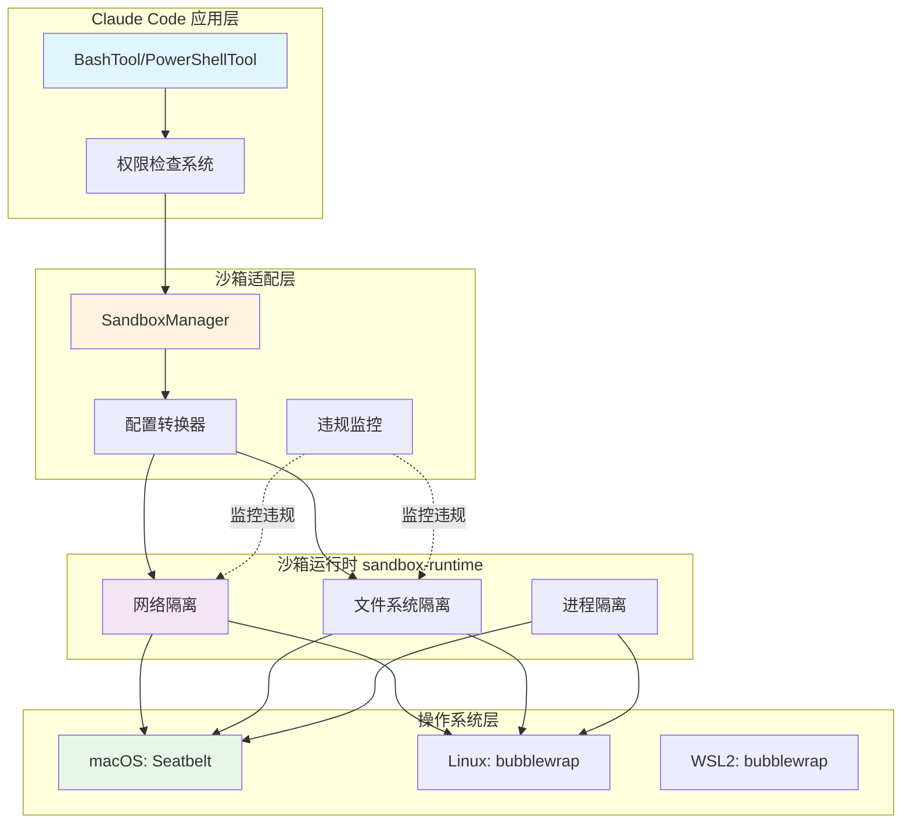
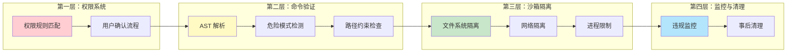

# 第三十四章：沙箱安全

> 沙箱（Sandbox）是 Claude Code 安全架构的核心防线，为命令执行提供系统级隔离。本章将深入分析沙箱的工作原理、文件系统安全机制、危险命令限制以及安全边界设计原则。

---

## 34.1 引言：为什么需要沙箱

在 AI 助手执行 Shell 命令的场景中，安全性是首要考量。Claude 作为 AI 模型，虽然经过安全训练，但仍可能在特定场景下生成有害命令。沙箱机制提供了系统级的防护层，确保即使 Claude 生成危险命令，其影响也能被限制在可控范围内。

### 34.1.1 沙箱的核心价值

沙箱机制解决了以下关键安全问题：

| 安全风险 | 沙箱防护方式 |
|---------|-------------|
| 文件篡改 | 只允许访问指定目录，阻止对敏感文件的写入 |
| 数据泄露 | 网络隔离，限制可访问的域名和端口 |
| 命令注入 | 命令解析验证，阻止危险语法 |
| 权限提升 | 阻止 sudo、doas 等特权命令 |
| 远程执行 | 限制 SSH 等远程命令的执行范围 |

### 34.1.2 沙箱架构概览

Claude Code 的沙箱系统采用多层防护设计，通过操作系统级隔离技术实现安全边界：



**图 34-1：Claude Code 沙箱安全边界架构图**

---

## 34.2 沙箱集成机制

### 34.2.1 SandboxManager 架构

`SandboxManager` 是沙箱系统的核心接口，定义在 `src/utils/sandbox/sandbox-adapter.ts:927-967`，它封装了底层 sandbox-runtime 包的功能，并添加了 Claude Code 特有的配置转换和状态管理：

```typescript
export interface ISandboxManager {
  initialize(sandboxAskCallback?: SandboxAskCallback): Promise<void>
  isSupportedPlatform(): boolean
  isSandboxingEnabled(): boolean
  areUnsandboxedCommandsAllowed(): boolean
  wrapWithSandbox(command: string, binShell?: string, ...): Promise<string>
  cleanupAfterCommand(): void
  getFsReadConfig(): FsReadRestrictionConfig
  getFsWriteConfig(): FsWriteRestrictionConfig
  getNetworkRestrictionConfig(): NetworkRestrictionConfig
  // ...
}

export const SandboxManager: ISandboxManager = {
  initialize,
  isSandboxingEnabled,
  wrapWithSandbox,
  cleanupAfterCommand: (): void => {
    BaseSandboxManager.cleanupAfterCommand()
    scrubBareGitRepoFiles()  // 清理可能的恶意 git 文件
  },
  // ...
}
```

### 34.2.2 初始化流程

沙箱初始化发生在应用启动阶段，位于 `src/utils/sandbox/sandbox-adapter.ts:730-792`：

```typescript
async function initialize(sandboxAskCallback?: SandboxAskCallback): Promise<void> {
  if (initializationPromise) {
    return initializationPromise  // 防止重复初始化
  }

  if (!isSandboxingEnabled()) {
    return  // 未启用则跳过
  }

  // 包装回调以强制执行 allowManagedDomainsOnly 策略
  const wrappedCallback: SandboxAskCallback | undefined = sandboxAskCallback
    ? async (hostPattern: NetworkHostPattern) => {
        if (shouldAllowManagedSandboxDomainsOnly()) {
          return false  // 阻止非托管域名的请求
        }
        return sandboxAskCallback(hostPattern)
      }
    : undefined

  initializationPromise = (async () => {
    try {
      // 检测 git worktree 主仓库路径（一次性缓存）
      if (worktreeMainRepoPath === undefined) {
        worktreeMainRepoPath = await detectWorktreeMainRepoPath(getCwdState())
      }

      const settings = getSettings_DEPRECATED()
      const runtimeConfig = convertToSandboxRuntimeConfig(settings)

      // 初始化底层沙箱运行时
      await BaseSandboxManager.initialize(runtimeConfig, wrappedCallback)

      // 监听设置变更，动态更新沙箱配置
      settingsSubscriptionCleanup = settingsChangeDetector.subscribe(() => {
        const newConfig = convertToSandboxRuntimeConfig(settings)
        BaseSandboxManager.updateConfig(newConfig)
      })
    } catch (error) {
      initializationPromise = undefined  // 允许失败后重试
    }
  })()

  return initializationPromise
}
```

关键设计要点：

1. **Promise 防重入**：使用 `initializationPromise` 防止并发初始化（第738行）

2. **Worktree 检测**：Git worktree 需要访问主仓库目录，必须预先解析（第765行）

3. **动态配置更新**：订阅设置变更事件，实时更新沙箱策略（第776行）

### 34.2.3 沙箱启用判断

`shouldUseSandbox` 函数决定了特定命令是否需要沙箱包装，定义在 `src/tools/BashTool/shouldUseSandbox.ts:130-153`：

```typescript
export function shouldUseSandbox(input: Partial<SandboxInput>): boolean {
  if (!SandboxManager.isSandboxingEnabled()) {
    return false  // 沙箱功能未启用
  }

  // 允许显式禁用沙箱（需策略允许）
  if (
    input.dangerouslyDisableSandbox &&
    SandboxManager.areUnsandboxedCommandsAllowed()
  ) {
    return false
  }

  if (!input.command) {
    return false
  }

  // 检查是否包含排除的命令模式
  if (containsExcludedCommand(input.command)) {
    return false
  }

  return true
}
```

### 34.2.4 平台支持检测

沙箱依赖操作系统特定的隔离机制，平台检测逻辑位于 `src/utils/sandbox/sandbox-adapter.ts:491-546`：

```typescript
// 支持的平台：macOS、Linux、WSL2（WSL1 不支持）
const isSupportedPlatform = memoize((): boolean => {
  return BaseSandboxManager.isSupportedPlatform()
})

// 企业设置：限制特定平台启用
function isPlatformInEnabledList(): boolean {
  const enabledPlatforms = settings?.sandbox?.enabledPlatforms
  if (enabledPlatforms === undefined) return true
  if (enabledPlatforms.length === 0) return false
  return enabledPlatforms.includes(getPlatform())
}

function isSandboxingEnabled(): boolean {
  if (!isSupportedPlatform()) return false
  if (checkDependencies().errors.length > 0) return false
  if (!isPlatformInEnabledList()) return false
  return getSandboxEnabledSetting()
}
```

---

## 34.3 文件系统操作安全

### 34.3.1 文件访问控制配置

沙箱对文件系统的访问控制分为读取和写入两个维度，配置定义在 `src/entrypoints/sandboxTypes.ts:47-86`：

```typescript
export const SandboxFilesystemConfigSchema = lazySchema(() =>
  z.object({
    allowWrite: z.array(z.string()).optional()
      .describe('允许写入的额外路径'),
    denyWrite: z.array(z.string()).optional()
      .describe('禁止写入的额外路径'),
    denyRead: z.array(z.string()).optional()
      .describe('禁止读取的额外路径'),
    allowRead: z.array(z.string()).optional()
      .describe('在 denyRead 区域内重新允许读取的路径'),
    allowManagedReadPathsOnly: z.boolean().optional()
      .describe('仅使用托管策略中的读取路径'),
  }).optional()
)
```

### 34.3.2 路径解析安全

路径解析是文件系统安全的关键环节，需要正确处理各种路径格式，定义在 `src/utils/sandbox/sandbox-adapter.ts:99-146`：

```typescript
/**
 * Claude Code 使用特殊的路径前缀约定：
 * - `//path` → 从文件系统根目录开始的绝对路径
 * - `/path`  → 相对于设置文件目录的路径
 * - `~/path` → 用户主目录（由 sandbox-runtime 处理）
 * - `./path` → 相对路径（由 sandbox-runtime 处理）
 */
export function resolvePathPatternForSandbox(
  pattern: string,
  source: SettingSource,
): string {
  // 处理 // 前缀 - 绝对路径
  if (pattern.startsWith('//')) {
    return pattern.slice(1)  // "//.aws/**" → "/.aws/**"
  }

  // 处理 / 前缀 - 相对于设置文件目录
  if (pattern.startsWith('/') && !pattern.startsWith('//')) {
    const root = getSettingsRootPathForSource(source)
    return resolve(root, pattern.slice(1))
  }

  return pattern  // 其他格式传递给 sandbox-runtime
}
```

### 34.3.3 关键文件保护

沙箱配置构建时，会自动添加对敏感文件的保护，位于 `src/utils/sandbox/sandbox-adapter.ts:229-281`：

```typescript
// 构建文件系统访问配置
const allowWrite: string[] = ['.', getClaudeTempDir()]
const denyWrite: string[] = []
const denyRead: string[] = []

// 阻止对设置文件的写入，防止沙箱逃逸
const settingsPaths = SETTING_SOURCES.map(source =>
  getSettingsFilePathForSource(source)
).filter((p): p is string => p !== undefined)
denyWrite.push(...settingsPaths)
denyWrite.push(getManagedSettingsDropInDir())

// 处理工作目录变更的情况
const cwd = getCwdState()
const originalCwd = getOriginalCwd()
if (cwd !== originalCwd) {
  denyWrite.push(resolve(cwd, '.claude', 'settings.json'))
  denyWrite.push(resolve(cwd, '.claude', 'settings.local.json'))
}

// 阻止对 .claude/skills 目录的写入
denyWrite.push(resolve(originalCwd, '.claude', 'skills'))
if (cwd !== originalCwd) {
  denyWrite.push(resolve(cwd, '.claude', 'skills'))
}

// Git 仓库伪造攻击防护
// 攻击者可能在 cwd 创建 HEAD、objects、refs 等文件
// 伪造 bare repo，利用 git hooks 逃逸沙箱
bareGitRepoScrubPaths.length = 0
const bareGitRepoFiles = ['HEAD', 'objects', 'refs', 'hooks', 'config']
for (const dir of cwd === originalCwd ? [originalCwd] : [originalCwd, cwd]) {
  for (const gitFile of bareGitRepoFiles) {
    const p = resolve(dir, gitFile)
    try {
      statSync(p)
      denyWrite.push(p)  // 存在的文件添加写入限制
    } catch {
      bareGitRepoScrubPaths.push(p)  // 不存在的文件记录清理路径
    }
  }
}
```

### 34.3.4 裸 Git 仓库攻击清理

`scrubBareGitRepoFiles` 函数负责清理可能被恶意植入的 Git 仓库文件，定义在 `src/utils/sandbox/sandbox-adapter.ts:404-414`：

```typescript
/**
 * Git 的 is_git_directory() 会将包含 HEAD + objects/ + refs/ 的目录识别为 bare repo。
 * 攻击者可以在沙箱命令执行期间植入这些文件，配合 git config core.fsmonitor
 * 在后续非沙箱 git 执行时逃逸沙箱。
 * 
 * 此函数在每次沙箱命令完成后清理这些潜在的危险文件。
 */
function scrubBareGitRepoFiles(): void {
  for (const p of bareGitRepoScrubPaths) {
    try {
      rmSync(p, { recursive: true })
      logForDebugging(`[Sandbox] scrubbed planted bare-repo file: ${p}`)
    } catch {
      // ENOENT 是正常情况 - 文件未被植入
    }
  }
}
```

### 34.3.5 危险文件列表

应用层还定义了需要特殊保护的文件和目录列表，位于 `src/utils/permissions/filesystem.ts:57-79`：

```typescript
/**
 * 危险文件列表 - 阻止自动编辑
 * 这些文件可用于代码执行或数据泄露
 */
export const DANGEROUS_FILES = [
  '.gitconfig',
  '.gitmodules',
  '.bashrc',
  '.bash_profile',
  '.zshrc',
  '.zprofile',
  '.profile',
  '.ripgreprc',
  '.mcp.json',
  '.claude.json',
] as const

/**
 * 危险目录列表 - 阻止自动编辑
 * 这些目录包含敏感配置或可执行文件
 */
export const DANGEROUS_DIRECTORIES = [
  '.git',
  '.vscode',
  '.idea',
  '.claude',
] as const
```

---

## 34.4 命令执行限制

### 34.4.1 危险命令模式检测

危险命令模式列表定义在 `src/utils/permissions/dangerousPatterns.ts:44-80`：

```typescript
export const DANGEROUS_BASH_PATTERNS: readonly string[] = [
  ...CROSS_PLATFORM_CODE_EXEC,  // 跨平台代码执行入口
  'zsh',
  'fish',
  'eval',
  'exec',
  'env',
  'xargs',
  'sudo',
  // Anthropic 内部使用的额外危险模式
  ...(process.env.USER_TYPE === 'ant'
    ? [
        'fa run',      // 集群代码启动器
        'coo',         // 任意集群代码执行
        'gh',          // GitHub CLI - 可创建公开 gist
        'gh api',      // 任意 HTTP 请求
        'curl',        // 数据泄露
        'wget',        // 数据泄露
        'git',         // git config/hooks = 任意代码执行
        'kubectl',     // 云资源写入
        'aws',         // S3 公开桶等
        'gcloud',
        'gsutil',
      ]
    : []),
]

// 跨平台代码执行入口点
export const CROSS_PLATFORM_CODE_EXEC = [
  'python', 'python3', 'python2',
  'node', 'deno', 'tsx',
  'ruby', 'perl', 'php', 'lua',
  'npx', 'bunx', 'npm run', 'yarn run', 'pnpm run', 'bun run',
  'bash', 'sh',
  'ssh',
] as const
```

### 34.4.2 命令排除机制

用户可以通过设置排除特定命令，使其不经过沙箱执行，定义在 `src/tools/BashTool/shouldUseSandbox.ts:21-128`：

```typescript
function containsExcludedCommand(command: string): boolean {
  // 检查动态配置中的禁用命令（仅限内部用户）
  if (process.env.USER_TYPE === 'ant') {
    const disabledCommands = getFeatureValue_CACHED_MAY_BE_STALE<{
      commands: string[]
      substrings: string[]
    }>('tengu_sandbox_disabled_commands', { commands: [], substrings: [] })

    // 检查子字符串匹配
    for (const substring of disabledCommands.substrings) {
      if (command.includes(substring)) return true
    }

    // 检查命令前缀匹配
    const commandParts = splitCommand_DEPRECATED(command)
    for (const part of commandParts) {
      const baseCommand = part.trim().split(' ')[0]
      if (baseCommand && disabledCommands.commands.includes(baseCommand)) {
        return true
      }
    }
  }

  // 检查用户配置的排除命令
  const userExcludedCommands = settings.sandbox?.excludedCommands ?? []
  if (userExcludedCommands.length === 0) return false

  // 分割复合命令（如 "docker ps && curl evil.com"）
  let subcommands: string[]
  try {
    subcommands = splitCommand_DEPRECATED(command)
  } catch {
    subcommands = [command]
  }

  // 对每个子命令检查排除模式
  for (const subcommand of subcommands) {
    const trimmed = subcommand.trim()
    
    // 生成所有可能的候选形式
    // 包括剥离环境变量和安全包装器后的形式
    const candidates = [trimmed]
    const seen = new Set(candidates)
    let startIdx = 0
    while (startIdx < candidates.length) {
      const endIdx = candidates.length
      for (let i = startIdx; i < endIdx; i++) {
        const cmd = candidates[i]!
        // 剥离环境变量
        const envStripped = stripAllLeadingEnvVars(cmd, BINARY_HIJACK_VARS)
        if (!seen.has(envStripped)) {
          candidates.push(envStripped)
          seen.add(envStripped)
        }
        // 剥离安全包装器
        const wrapperStripped = stripSafeWrappers(cmd)
        if (!seen.has(wrapperStripped)) {
          candidates.push(wrapperStripped)
          seen.add(wrapperStripped)
        }
      }
      startIdx = endIdx
    }

    // 检查每种候选是否匹配排除模式
    for (const pattern of userExcludedCommands) {
      const rule = bashPermissionRule(pattern)
      for (const cand of candidates) {
        switch (rule.type) {
          case 'prefix':
            if (cand === rule.prefix || cand.startsWith(rule.prefix + ' ')) {
              return true
            }
            break
          case 'exact':
            if (cand === rule.command) return true
            break
          case 'wildcard':
            if (matchWildcardPattern(rule.pattern, cand)) return true
            break
        }
      }
    }
  }

  return false
}
```

### 34.4.3 命令安全解析

Bash 命令的 AST 解析提供了更深层次的安全检查，定义在 `src/utils/bash/ast.ts:1-200`：

```typescript
/**
 * 使用 tree-sitter 进行 AST 级别的 Bash 命令分析
 * 
 * 关键设计原则：FAIL-CLOSED（失败即拒绝）
 * - 只处理明确允许的节点类型
 * - 无法理解的语法结构一律拒绝
 * - 拒绝时要求用户确认
 */

// 结构性节点类型 - 可以递归遍历
const STRUCTURAL_TYPES = new Set([
  'program',
  'list',           // a && b || c
  'pipeline',        // a | b
  'redirected_statement',
])

// 危险节点类型 - 拒绝静态分析
const DANGEROUS_TYPES = new Set([
  'command_substitution',  // $(cmd) - 运行时确定
  'process_substitution',  // <(cmd) - 进程替换
  'expansion',
  'simple_expansion',
  'brace_expression',      // {a,b} - brace 扩展
  'subshell',
  'compound_statement',
  'for_statement',
  'while_statement',
  'until_statement',
  'if_statement',
  'case_statement',
  'function_definition',
  'test_command',
  'ansi_c_string',
  'translated_string',
  'herestring_redirect',
  'heredoc_redirect',
])

// 安全环境变量 - 可以在静态分析中展开
const SAFE_ENV_VARS = new Set([
  'HOME', 'PWD', 'OLDPWD', 'USER', 'LOGNAME',
  'SHELL', 'PATH', 'HOSTNAME', 'UID', 'EUID',
  'PPID', 'RANDOM', 'SECONDS', 'LINENO', 'TMPDIR',
  'BASH_VERSION', 'BASHPID', 'SHLVL', 'HISTFILE', 'IFS',
])
```

### 34.4.4 沙箱命令包装

最终执行命令前，需要通过 `wrapWithSandbox` 包装，定义在 `src/utils/sandbox/sandbox-adapter.ts:704-725`：

```typescript
async function wrapWithSandbox(
  command: string,
  binShell?: string,
  customConfig?: Partial<SandboxRuntimeConfig>,
  abortSignal?: AbortSignal,
): Promise<string> {
  // 确保初始化完成
  if (isSandboxingEnabled()) {
    if (initializationPromise) {
      await initializationPromise
    } else {
      throw new Error('Sandbox failed to initialize.')
    }
  }

  // 调用底层 sandbox-runtime 进行包装
  return BaseSandboxManager.wrapWithSandbox(
    command,
    binShell,
    customConfig,
    abortSignal,
  )
}
```

---

## 34.5 安全边界设计原则

### 34.5.1 多层防护策略

Claude Code 的安全架构采用"纵深防御"策略，多个安全层相互补充：



**图 34-2：Claude Code 多层安全防护架构**

### 34.5.2 FAIL-CLOSED 原则

安全系统的核心设计原则是"失败即拒绝"（FAIL-CLOSED）。当遇到无法确定的情况时，系统总是选择更安全的路径：

```typescript
// 来自 ast.ts 的设计理念
/**
 * 此模块的核心设计属性是 FAIL-CLOSED：
 * - 我们从不解释不理解的语法结构
 * - 如果 tree-sitter 产生未明确允许的节点类型
 * - 我们拒绝提取 argv，要求用户确认
 * 
 * 这不是沙箱。它不阻止危险命令执行。
 * 它只回答一个问题："能否为此命令生成可信的 argv[]？"
 * 如果不能，询问用户。
 */
```

### 34.5.3 配置优先级与策略锁定

沙箱设置支持多来源配置，但策略设置具有最高优先级，定义在 `src/utils/sandbox/sandbox-adapter.ts:647-664`：

```typescript
function areSandboxSettingsLockedByPolicy(): boolean {
  // 检查高优先级设置源是否设置了沙箱配置
  const overridingSources = ['flagSettings', 'policySettings'] as const

  for (const source of overridingSources) {
    const settings = getSettingsForSource(source)
    if (
      settings?.sandbox?.enabled !== undefined ||
      settings?.sandbox?.autoAllowBashIfSandboxed !== undefined ||
      settings?.sandbox?.allowUnsandboxedCommands !== undefined
    ) {
      return true  // 本地设置无法覆盖
    }
  }

  return false
}
```

### 34.5.4 网络隔离策略

网络访问控制是防止数据泄露的关键防线，配置定义在 `src/entrypoints/sandboxTypes.ts:14-42`：

```typescript
export const SandboxNetworkConfigSchema = lazySchema(() =>
  z.object({
    allowedDomains: z.array(z.string()).optional(),
    allowManagedDomainsOnly: z.boolean().optional()
      .describe('仅使用托管策略中的域名'),
    allowUnixSockets: z.array(z.string()).optional()
      .describe('macOS: 允许的 Unix socket 路径'),
    allowAllUnixSockets: z.boolean().optional()
      .describe('允许所有 Unix socket'),
    allowLocalBinding: z.boolean().optional(),
    httpProxyPort: z.number().optional(),
    socksProxyPort: z.number().optional(),
  }).optional()
)
```

托管域名限制确保企业环境中的网络策略得到严格执行：

```typescript
export function shouldAllowManagedSandboxDomainsOnly(): boolean {
  return (
    getSettingsForSource('policySettings')?.sandbox?.network
      ?.allowManagedDomainsOnly === true
  )
}
```

### 34.5.5 安全设置接口

用户可通过 `/sandbox` 命令管理沙箱设置，实现位于 `src/commands/sandbox-toggle/sandbox-toggle.tsx:10-82`：

```typescript
export async function call(onDone, _context, args?: string): Promise<React.ReactNode | null> {
  // 检查平台支持
  if (!SandboxManager.isSupportedPlatform()) {
    const errorMessage = platform === 'wsl'
      ? 'Error: Sandboxing requires WSL2. WSL1 is not supported.'
      : 'Error: Sandboxing is currently only supported on macOS, Linux, and WSL2.'
    onDone(color('error', themeName)(errorMessage))
    return null
  }

  // 检查依赖是否安装
  const depCheck = SandboxManager.checkDependencies()

  // 检查平台是否在允许列表中
  if (!SandboxManager.isPlatformInEnabledList()) {
    onDone(color('error', themeName)(`Error: Sandboxing is disabled for ${platform}`))
    return null
  }

  // 检查策略锁定
  if (SandboxManager.areSandboxSettingsLockedByPolicy()) {
    onDone(color('error', themeName)(
      'Error: Sandbox settings are overridden by higher-priority configuration.'
    ))
    return null
  }

  // 无参数时显示设置界面
  if (!trimmedArgs) {
    return <SandboxSettings onComplete={onDone} depCheck={depCheck} />
  }

  // 处理 exclude 子命令
  if (subcommand === 'exclude') {
    addToExcludedCommands(cleanPattern)
    onDone(color('success', themeName)(`Added "${cleanPattern}" to excluded commands`))
    return null
  }
}
```

---

## 34.6 总结

Claude Code 的沙箱安全系统体现了现代 AI 应用安全设计的最佳实践：

### 核心设计理念

1. **纵深防御**：权限检查、命令验证、沙箱隔离、违规监控四层防护
2. **FAIL-CLOSED**：无法确定时选择拒绝，而非放行
3. **最小权限**：默认只允许必要操作，其他需要显式授权
4. **动态更新**：配置变更实时生效，无需重启

### 关键安全措施

| 层级 | 安全措施 | 实现位置 |
|-----|---------|---------|
| 权限层 | 规则匹配 + 用户确认 | `src/utils/permissions/permissions.ts` |
| 验证层 | AST 解析 + 危险模式 | `src/utils/bash/ast.ts`, `dangerousPatterns.ts` |
| 隔离层 | 文件/网络/进程隔离 | `src/utils/sandbox/sandbox-adapter.ts` |
| 监控层 | 违规检测 + 清理 | `cleanupAfterCommand`, `scrubBareGitRepoFiles` |

### 使用建议

1. **生产环境**：启用 `sandbox.enabled: true` 和 `failIfUnavailable: true`
2. **企业部署**：使用 `policySettings` 锁定关键配置
3. **开发调试**：通过 `excludedCommands` 排除需要原生性能的命令
4. **审计追踪**：关注 `SandboxViolationStore` 中的违规记录

沙箱安全是 Claude Code 可信执行的基础，理解其工作原理对于安全部署和问题排查至关重要。

---

**相关章节**：
- 第九章：BashTool 深度解析（命令执行流程）
- 第四章：配置系统（沙箱设置详解）
- 第二十三章：Hook 系统（安全钩子集成）