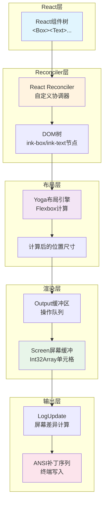

# 第35章 Ink UI框架

## 35.1 引言：终端UI渲染的挑战与解决方案

终端应用程序的UI渲染面临独特的挑战：不像浏览器有完整的DOM树和CSS布局引擎，终端只有字符网格和ANSI转义序列。传统终端应用需要手动处理光标定位、颜色设置和文本换行，开发效率低下且代码难以维护。

Ink框架通过引入React组件化开发模式和Flexbox布局系统，彻底改变了终端UI的开发方式。开发者可以像编写Web应用一样使用`<Box>`、`<Text>`等组件，通过`flexDirection`、`alignItems`等属性控制布局，框架自动处理终端渲染细节。

本章深入分析Claude Code中使用的Ink框架实现，揭示其如何将React树转换为终端屏幕输出的完整流程。

### 整体架构

Ink框架的渲染流程可以分为五个核心阶段：



**图35-1：Ink渲染流程架构图**

流程说明：
1. **React层**：用户编写的React组件构成虚拟树
2. **Reconciler层**：自定义React协调器将虚拟树转换为DOM树
3. **布局层**：Yoga引擎计算每个节点的位置和尺寸
4. **渲染层**：将DOM树渲染到屏幕缓冲区
5. **输出层**：计算前后帧差异，生成最优ANSI补丁

---

## 35.2 React终端渲染原理

### 自定义Reconciler核心

React Reconciler是React的核心调度系统，负责将虚拟DOM树同步到宿主环境。浏览器环境中使用ReactDOM，Ink则通过`react-reconciler`包创建自定义协调器。

**reconciler.ts**（第224-506行）定义了完整的协调器配置：

```typescript
const reconciler = createReconciler<
  ElementNames,
  Props,
  DOMElement,
  DOMElement,
  TextNode,
  DOMElement,
  unknown,
  unknown,
  DOMElement,
  HostContext,
  null,
  NodeJS.Timeout,
  -1,
  null
>({
  getRootHostContext: () => ({ isInsideText: false }),
  // ... 配置选项
})
```

关键配置方法：

| 方法 | 作用 | 行号 |
|------|------|------|
| `createInstance` | 创建DOM元素节点 | 331-359 |
| `createTextInstance` | 创建文本节点 | 360-372 |
| `appendChild` | 添加子节点 | 392 |
| `commitUpdate` | 更新节点属性 | 426-459 |
| `resetAfterCommit` | 提交后触发布局计算 | 247-315 |

### DOM节点类型

**dom.ts**（第19-28行）定义了终端DOM的节点类型：

```typescript
export type ElementNames =
  | 'ink-root'    // 根容器
  | 'ink-box'     // 容器组件
  | 'ink-text'    // 文本组件
  | 'ink-virtual-text' // 文本内嵌文本
  | 'ink-link'    // 链接组件
  | 'ink-progress' // 进度条
  | 'ink-raw-ansi' // 原ANSI文本
```

每个DOM节点包含Yoga布局节点引用：

```typescript
export type DOMElement = {
  nodeName: ElementNames
  attributes: Record<string, DOMNodeAttribute>
  childNodes: DOMNode[]
  yogaNode?: LayoutNode   // Yoga布局节点
  dirty: boolean          // 需要重渲染
  style: Styles           // Flexbox样式
  // ...
}
```

### 节点创建流程

**dom.ts**（第110-132行）`createNode`函数：

```typescript
export const createNode = (nodeName: ElementNames): DOMElement => {
  const needsYogaNode =
    nodeName !== 'ink-virtual-text' &&
    nodeName !== 'ink-link' &&
    nodeName !== 'ink-progress'
  
  const node: DOMElement = {
    nodeName,
    style: {},
    attributes: {},
    childNodes: [],
    parentNode: undefined,
    yogaNode: needsYogaNode ? createLayoutNode() : undefined,
    dirty: false,
  }

  if (nodeName === 'ink-text') {
    node.yogaNode?.setMeasureFunc(measureTextNode.bind(null, node))
  }
  
  return node
}
```

设计要点：
- `ink-virtual-text`等节点不需要独立布局，共享父节点的Yoga节点
- `ink-text`节点设置测量函数，用于计算文本尺寸

---

## 35.3 Yoga布局引擎集成

### Yoga引擎概述

Yoga是Facebook开发的跨平台Flexbox布局引擎，使用C++实现并通过WebAssembly或原生绑定提供JavaScript接口。Ink通过Yoga在终端中实现完整的CSS Flexbox布局。

### LayoutNode接口抽象

**layout/node.ts**（第93-152行）定义了布局节点的抽象接口：

```typescript
export type LayoutNode = {
  // 树结构操作
  insertChild(child: LayoutNode, index: number): void
  removeChild(child: LayoutNode): void
  getChildCount(): number
  getParent(): LayoutNode | null

  // 布局计算
  calculateLayout(width?: number, height?: number): void
  setMeasureFunc(fn: LayoutMeasureFunc): void
  markDirty(): void

  // 获取计算结果
  getComputedLeft(): number
  getComputedTop(): number
  getComputedWidth(): number
  getComputedHeight(): number
  
  // 样式设置（对应CSS属性）
  setFlexDirection(dir: LayoutFlexDirection): void
  setAlignItems(align: LayoutAlign): void
  setJustifyContent(justify: LayoutJustify): void
  // ...
}
```

### Yoga适配器实现

**layout/yoga.ts**（第54-297行）实现`YogaLayoutNode`适配器：

```typescript
export class YogaLayoutNode implements LayoutNode {
  readonly yoga: YogaNode

  constructor(yoga: YogaNode) {
    this.yoga = yoga
  }

  // 布局计算入口
  calculateLayout(width?: number, _height?: number): void {
    this.yoga.calculateLayout(width, undefined, Direction.LTR)
  }

  // Flexbox属性映射
  setFlexDirection(dir: LayoutFlexDirection): void {
    const map: Record<LayoutFlexDirection, FlexDirection> = {
      row: FlexDirection.Row,
      'row-reverse': FlexDirection.RowReverse,
      column: FlexDirection.Column,
      'column-reverse': FlexDirection.ColumnReverse,
    }
    this.yoga.setFlexDirection(map[dir]!)
  }

  setAlignItems(align: LayoutAlign): void {
    const map: Record<LayoutAlign, Align> = {
      auto: Align.Auto,
      stretch: Align.Stretch,
      'flex-start': Align.FlexStart,
      center: Align.Center,
      'flex-end': Align.FlexEnd,
    }
    this.yoga.setAlignItems(map[align]!)
  }
  // ...
}
```

### 布局触发时机

**ink.tsx**（第238-258行）在React提交阶段触发布局计算：

```typescript
this.rootNode.onComputeLayout = () => {
  if (this.isUnmounted) return
  
  if (this.rootNode.yogaNode) {
    const t0 = performance.now()
    this.rootNode.yogaNode.setWidth(this.terminalColumns)
    this.rootNode.yogaNode.calculateLayout(this.terminalColumns)
    const ms = performance.now() - t0
    recordYogaMs(ms)  // 性能追踪
    // ...
  }
}
```

布局计算流程：
1. 设置根节点宽度（终端列数）
2. 调用`calculateLayout`递归计算所有子节点
3. 节点的`getComputedLeft/Top/Width/Height`返回计算结果

### 样式系统

**styles.ts**（第55-200行）定义了完整的Flexbox样式属性：

```typescript
export type Styles = {
  // Flexbox核心属性
  readonly flexDirection?: 'row' | 'column' | 'row-reverse' | 'column-reverse'
  readonly flexWrap?: 'nowrap' | 'wrap' | 'wrap-reverse'
  readonly flexGrow?: number
  readonly flexShrink?: number
  readonly flexBasis?: number | string
  
  // 对齐属性
  readonly alignItems?: 'flex-start' | 'center' | 'flex-end' | 'stretch'
  readonly alignSelf?: 'flex-start' | 'center' | 'flex-end' | 'auto'
  readonly justifyContent?: 'flex-start' | 'center' | 'flex-end' | 'space-between' | 'space-around' | 'space-evenly'
  
  // 尺寸属性
  readonly width?: number | `${number}%`
  readonly height?: number | `${number}%`
  readonly minWidth?: number
  readonly maxWidth?: number
  
  // 边距与内边距
  readonly margin?: number
  readonly marginX?: number
  readonly marginY?: number
  readonly padding?: number
  readonly paddingX?: number
  readonly paddingY?: number
  
  // 间距
  readonly gap?: number
  readonly columnGap?: number
  readonly rowGap?: number
  
  // 定位
  readonly position?: 'absolute' | 'relative'
  readonly top?: number | `${number}%`
  readonly left?: number | `${number}%`
  // ...
}
```

---

## 35.4 React Reconciler定制详解

### 协调器生命周期

React Reconciler通过一系列回调函数管理组件树的生命周期。Ink的协调器实现了以下关键阶段：

#### 创建阶段

```typescript
createInstance(
  originalType: ElementNames,
  newProps: Props,
  _root: DOMElement,
  hostContext: HostContext,
  internalHandle?: unknown,
): DOMElement {
  // 禁止Box嵌套在Text内
  if (hostContext.isInsideText && originalType === 'ink-box') {
    throw new Error(`<Box> can't be nested inside <Text> component`)
  }

  // Text内嵌文本转换为virtual-text
  const type =
    originalType === 'ink-text' && hostContext.isInsideText
      ? 'ink-virtual-text'
      : originalType

  const node = createNode(type)
  
  // 应用所有属性
  for (const [key, value] of Object.entries(newProps)) {
    applyProp(node, key, value)
  }

  return node
}
```

#### 提交阶段

`resetAfterCommit`是渲染触发点：

```typescript
resetAfterCommit(rootNode) {
  // 性能追踪
  _lastCommitMs = _commitStart > 0 ? performance.now() - _commitStart : 0
  
  // 触发布局计算
  if (typeof rootNode.onComputeLayout === 'function') {
    rootNode.onComputeLayout()
  }

  // 测试环境直接渲染
  if (process.env.NODE_ENV === 'test') {
    rootNode.onImmediateRender?.()
    return
  }

  // 生产环境延迟渲染（微任务队列）
  rootNode.onRender?.()
}
```

### 属性更新机制

**reconciler.ts**（第426-459行）`commitUpdate`方法：

```typescript
commitUpdate(
  node: DOMElement,
  _type: ElementNames,
  oldProps: Props,
  newProps: Props,
): void {
  const props = diff(oldProps, newProps)
  const style = diff(oldProps['style'] as Styles, newProps['style'] as Styles)

  if (props) {
    for (const [key, value] of Object.entries(props)) {
      if (key === 'style') {
        setStyle(node, value as Styles)
        continue
      }
      if (key === 'textStyles') {
        setTextStyles(node, value as TextStyles)
        continue
      }
      if (EVENT_HANDLER_PROPS.has(key)) {
        setEventHandler(node, key, value)
        continue
      }
      setAttribute(node, key, value as DOMNodeAttribute)
    }
  }

  // 样式变化需要应用到Yoga节点
  if (style && node.yogaNode) {
    applyStyles(node.yogaNode, style, newProps['style'] as Styles)
  }
}
```

### Dirty标记传播

**dom.ts**（第134-153行）子节点操作自动标记dirty：

```typescript
export const appendChildNode = (
  node: DOMElement,
  childNode: DOMElement,
): void => {
  if (childNode.parentNode) {
    removeChildNode(childNode.parentNode, childNode)
  }

  childNode.parentNode = node
  node.childNodes.push(childNode)

  // 同步Yoga树结构
  if (childNode.yogaNode) {
    node.yogaNode?.insertChild(
      childNode.yogaNode,
      node.yogaNode.getChildCount(),
    )
  }

  markDirty(node)  // 标记需要重渲染
}
```

---

## 35.5 屏幕差异优化渲染

### Screen缓冲区设计

**screen.ts**的核心创新是使用紧凑的TypedArray存储屏幕数据：

```typescript
export type Screen = Size & {
  // 每个单元格2个Int32：
  // word0: charId（字符池索引）
  // word1: styleId | hyperlinkId | width（打包数据）
  cells: Int32Array
  cells64: BigInt64Array  // 用于批量填充
  
  // 共享池，避免重复字符串分配
  charPool: CharPool
  hyperlinkPool: HyperlinkPool
  emptyStyleId: number
  
  // 渲染时写入的区域，用于优化diff范围
  damage: Rectangle | undefined
  
  // 其他元数据
  noSelect: Uint8Array   // 不可选择标记
  softWrap: Int32Array   // 软换行标记
}
```

### Cell打包格式

**screen.ts**（第332-348行）单元格数据布局：

```typescript
// 每个单元格2个Int32：
//   word0 (cells[ci]):     charId (完整32位)
//   word1 (cells[ci + 1]): styleId[31:17] | hyperlinkId[16:2] | width[1:0]
const STYLE_SHIFT = 17
const HYPERLINK_SHIFT = 2
const HYPERLINK_MASK = 0x7fff  // 15位
const WIDTH_MASK = 3           // 2位

function packWord1(
  styleId: number,
  hyperlinkId: number,
  width: number,
): number {
  return (styleId << STYLE_SHIFT) | (hyperlinkId << HYPERLINK_SHIFT) | width
}
```

这种设计使得：
- 200x120屏幕只需48000个Int32（约190KB）
- 避免为每个单元格创建对象（GC压力）
- 支持SIMD级别的快速比较

### 双缓冲机制

**ink.tsx**（第96-97行）维护前后帧缓冲：

```typescript
private frontFrame: Frame   // 当前显示帧
private backFrame: Frame    // 下一帧正在构建
```

**renderer.ts**（第38-48行）渲染入口：

```typescript
return options => {
  const { frontFrame, backFrame, isTTY, terminalWidth, terminalRows } = options
  const prevScreen = frontFrame.screen  // 用于blit优化
  const backScreen = backFrame.screen   // 新帧写入目标
  
  // ... 布局计算、渲染 ...
  
  return {
    screen: renderedScreen,
    viewport: { width: terminalWidth, height: terminalRows },
    cursor: { x: 0, y: screen.height, visible: !isTTY }
  }
}
```

### Output操作队列

**output.ts**（第62-169行）定义了渲染操作类型：

```typescript
export type Operation =
  | WriteOperation      // 写入文本
  | ClipOperation       // 设置裁剪区域
  | UnclipOperation     // 移除裁剪区域
  | BlitOperation       // 块传输复制
  | ClearOperation      // 清除区域
  | NoSelectOperation   // 标记不可选择
  | ShiftOperation      // 行滚动

type WriteOperation = {
  type: 'write'
  x: number
  y: number
  text: string
  softWrap?: boolean[]  // 软换行标记
}

type BlitOperation = {
  type: 'blit'
  src: Screen           // 源屏幕缓冲
  x: number
  y: number
  width: number
  height: number
}

type ShiftOperation = {
  type: 'shift'
  top: number           // 滚动区域顶部
  bottom: number        // 滚动区域底部
  n: number             // 滚动行数（正数向上）
}
```

**Output类**（第170-206行）核心方法：

```typescript
export default class Output {
  private readonly operations: Operation[] = []
  private charCache: Map<string, ClusteredChar[]> = new Map()

  // 重置缓冲区，保留字符缓存
  reset(width: number, height: number, screen: Screen): void {
    this.operations.length = 0
    resetScreen(screen, width, height)
    if (this.charCache.size > 16384) this.charCache.clear()
  }

  // 添加各种操作
  write(x: number, y: number, text: string, softWrap?: boolean[]): void
  blit(src: Screen, x: number, y: number, width: number, height: number): void
  shift(top: number, bottom: number, n: number): void
  clear(region: Rectangle, fromAbsolute?: boolean): void
  clip(clip: Clip): void
  unclip(): void

  // 执行所有操作，生成Screen
  get(): Screen {
    // Pass 1: 处理clear操作，标记damage区域
    // Pass 2: 按顺序执行blit/shift/write操作
    // Pass 3: 应用noSelect标记
    return screen
  }
}
```

字符缓存的设计使得：
- tokenize + grapheme聚类只在首次执行
- 后续帧的相同文本直接复用缓存结果
- 避免每帧重复计算文本宽度

### Blit优化（块传输）

**screen.ts**（第858-901行）`blitRegion`实现：

```typescript
export function blitRegion(
  dst: Screen,
  src: Screen,
  regionX: number,
  regionY: number,
  maxX: number,
  maxY: number,
): void {
  // 快速路径：整行复制
  if (regionX === 0 && maxX === src.width && src.width === dst.width) {
    const srcStart = regionY * srcStride
    const totalBytes = (maxY - regionY) * srcStride
    dstCells.set(
      srcCells.subarray(srcStart, srcStart + totalBytes),
      srcStart,
    )
  } else {
    // 逐行复制（部分宽度）
    // ...
  }
}
```

Blit优化的原理：
- 如果某节点内容未变化，直接从prevScreen复制
- 避免重新遍历子树和计算布局
- 只处理实际发生变化的区域

### Diff算法

**screen.ts**中的`diffEach`函数遍历damage区域：

```typescript
// 只检查damage标记的区域，而非全屏
export function diffEach(
  prev: Screen,
  next: Screen,
  callback: (x: number, y: number) => boolean | void,
): void {
  const damage = next.damage
  if (!damage) {
    // 无damage时全屏比较
    for (let y = 0; y < next.height; y++) {
      for (let x = 0; x < next.width; x++) {
        // ...
      }
    }
  } else {
    // 只检查damage矩形
    for (let y = damage.y; y < damage.y + damage.height; y++) {
      for (let x = damage.x; x < damage.x + damage.width; x++) {
        // ...
      }
    }
  }
}
```

### ANSI补丁生成

**log-update.ts**（第123-300行）核心渲染方法：

```typescript
render(
  prev: Frame,
  next: Frame,
  altScreen = false,
  decstbmSafe = true,
): Diff {
  // 尺寸变化时需要全屏清除
  if (
    next.viewport.height < prev.viewport.height ||
    next.viewport.width !== prev.viewport.width
  ) {
    return fullResetSequence_CAUSES_FLICKER(next, 'resize', stylePool)
  }

  // DECSTBM滚动优化
  if (altScreen && next.scrollHint && decstbmSafe) {
    const { top, bottom, delta } = next.scrollHint
    shiftRows(prev.screen, top, bottom, delta)
    scrollPatch = [
      { type: 'stdout', content: setScrollRegion(top + 1, bottom + 1) + ... }
    ]
  }

  // 逐单元格差异计算
  diffEach(prev.screen, next.screen, (x, y) => {
    // 比较前后帧单元格，生成ANSI补丁
  })
  
  return patches
}
```

### 补丁优化器

**optimizer.ts**（第16-93行）应用多种优化规则减少终端写入：

```typescript
export function optimize(diff: Diff): Diff {
  if (diff.length <= 1) return diff

  const result: Diff = []
  
  for (const patch of diff) {
    // 跳过空操作
    if (patch.type === 'stdout' && patch.content === '') continue
    if (patch.type === 'cursorMove' && patch.x === 0 && patch.y === 0) continue
    if (patch.type === 'clear' && patch.count === 0) continue

    // 尝试与前一个补丁合并
    const last = result[result.length - 1]
    
    // 合并连续cursorMove
    if (patch.type === 'cursorMove' && last?.type === 'cursorMove') {
      result[result.length - 1] = {
        type: 'cursorMove',
        x: last.x + patch.x,
        y: last.y + patch.y,
      }
      continue
    }

    // collapse连续cursorTo（只有最后一个有效）
    if (patch.type === 'cursorTo' && last?.type === 'cursorTo') {
      result[result.length - 1] = patch
      continue
    }

    // 连接相邻styleStr（ANSI过渡码）
    if (patch.type === 'styleStr' && last?.type === 'styleStr') {
      result[result.length - 1] = { type: 'styleStr', str: last.str + patch.str }
      continue
    }

    // 去重连续相同URI的hyperlink
    if (patch.type === 'hyperlink' && last?.type === 'hyperlink' && patch.uri === last.uri) {
      continue
    }

    // 取消cursorHide/Show配对
    if ((patch.type === 'cursorShow' && last?.type === 'cursorHide') ||
        (patch.type === 'cursorHide' && last?.type === 'cursorShow')) {
      result.pop()
      continue
    }

    result.push(patch)
  }

  return result
}
```

优化规则汇总：

| 规则 | 效果 | 示例 |
|------|------|------|
| 空stdout过滤 | 跳过无内容补丁 | `{type:'stdout', content:''}` → 删除 |
| cursorMove合并 | 合并连续移动 | `(x:2,y:0)` + `(x:1,y:3)` → `(x:3,y:3)` |
| cursorTo折叠 | 只保留最后位置 | 连续3个`cursorTo` → 1个 |
| styleStr连接 | ANSI码拼接 | `\e[31m` + `\e[1m` → `\e[31m\e[1m` |
| hyperlink去重 | 相同URI跳过 | 连续相同链接 → 1次设置 |
| Hide/Show取消 | 抵消配对 | hide → show → 无操作 |

### 性能优化总结

| 优化技术 | 效果 | 实现位置 |
|----------|------|----------|
| TypedArray存储 | 避免GC，支持SIMD | screen.ts |
| 字符池 | 避免重复字符串分配 | CharPool |
| 样式池 | 缓存ANSI转换 | StylePool |
| 双缓冲 | 无闪烁更新 | ink.tsx |
| Blit块传输 | 跳过未变化子树 | blitRegion |
| Damage跟踪 | 限制diff范围 | damage矩形 |
| DECSTBM滚动 | 硬件滚动而非重绘 | log-update.ts |

---

## 35.6 组件系统

### Box容器组件

**Box.tsx**是最基础的布局容器：

```typescript
export type Props = Except<Styles, 'textWrap'> & {
  ref?: Ref<DOMElement>
  tabIndex?: number        // Tab焦点顺序
  autoFocus?: boolean      // 自动聚焦
  onClick?: (event: ClickEvent) => void
  onFocus?: (event: FocusEvent) => void
  onBlur?: (event: FocusEvent) => void
  onKeyDown?: (event: KeyboardEvent) => void
  onMouseEnter?: () => void
  onMouseLeave?: () => void
}
```

Box渲染为`ink-box`DOM节点，应用所有Flexbox样式。

### Text文本组件

**Text.tsx**处理文本渲染：

```typescript
export type Props = BaseProps & WeightProps

type BaseProps = {
  color?: Color            // 文本颜色
  backgroundColor?: Color  // 背景颜色
  italic?: boolean         // 斜体
  underline?: boolean      // 下划线
  strikethrough?: boolean  // 删除线
  inverse?: boolean        // 反色
  wrap?: Styles['textWrap'] // 换行/截断模式
  children?: ReactNode
}

// bold和dim互斥（终端限制）
type WeightProps = 
  | { bold?: never; dim?: never }
  | { bold: boolean; dim?: never }
  | { dim: boolean; bold?: never }
```

Text自动设置文本测量函数：

```typescript
if (nodeName === 'ink-text') {
  node.yogaNode?.setMeasureFunc(measureTextNode.bind(null, node))
}
```

### ScrollBox滚动容器

**ScrollBox.tsx**实现终端滚动：

关键特性：
- `scrollTop`：当前滚动位置
- `overflow: 'scroll'`：启用Yoga滚动
- `stickyScroll`：自动跟踪底部新内容
- 硬件滚动优化（DECSTBM + SU/SD）

---

## 35.7 事件系统

### 事件调度器

**events/dispatcher.ts**实现事件分发：

```typescript
export class Dispatcher {
  currentUpdatePriority: number = 0
  currentEvent: Event | null = null
  
  discreteUpdates: typeof reconciler.discreteUpdates
  
  dispatchDiscrete(target: DOMElement, event: Event): void {
    // 捕获阶段 → 目标 → 冒泡阶段
  }
}
```

### 支持的事件类型

| 事件类 | 文件 | 触发条件 |
|--------|------|----------|
| KeyboardEvent | keyboard-event.ts | 键盘输入 |
| ClickEvent | click-event.ts | 鼠标点击（AltScreen） |
| FocusEvent | focus-event.ts | 焦点变化 |
| TerminalFocusEvent | terminal-focus-event.ts | 终端窗口焦点 |

### 输入处理

**parse-keypress.ts**解析键盘输入：

```typescript
export type ParsedKey = {
  name: string       // 按键名称
  ctrl: boolean      // Ctrl修饰
  meta: boolean      // Meta/Alt修饰
  shift: boolean     // Shift修饰
  sequence: string   // 原始序列
}
```

---

## 35.8 实际应用示例

### Claude Code中的Ink使用

Claude Code大量使用Ink构建终端UI：

**主界面结构**：
```
<AlternateScreen>
  <Box flexDirection="column">
    <Messages />           // 消息列表
    <ScrollBox>            // 可滚动内容
      <ConversationHistory />
    </ScrollBox>
    <Box>                   // 底部提示区
      <PromptInput />
    </Box>
  </Box>
</AlternateScreen>
```

### AltScreen模式

**AlternateScreen.tsx**启用终端备用屏幕：

特性：
- 独立缓冲区，不影响主屏幕滚动历史
- 鼠标跟踪支持（mode-1003）
- 窗口焦点事件（focus-reporting）
- 退出时恢复主屏幕

---

## 35.9 性能考量

### 布局计算性能

Yoga布局是主要性能开销。优化策略：

1. **延迟布局**：只在提交阶段计算
2. **Dirty传播**：只重新计算变化的子树
3. **测量缓存**：文本尺寸缓存避免重复计算

**ink.tsx**中的性能追踪：

```typescript
const t0 = performance.now()
this.rootNode.yogaNode.calculateLayout(this.terminalColumns)
const ms = performance.now() - t0
recordYogaMs(ms)
```

### 渲染性能

差异渲染优化：

1. **Damage矩形**：只diff变化区域
2. **Blit跳过**：未变化子树直接复制
3. **硬件滚动**：DECSTBM序列而非重绘

### 内存效率

TypedArray设计避免GC压力：

```typescript
// 200x120屏幕：
// 传统对象：24000个Cell对象 × ~50字节 = ~1.2MB
// TypedArray：48000个Int32 × 4字节 = ~190KB
```

---

## 35.10 小结

Ink框架通过以下核心创新实现了React风格的终端UI开发：

1. **自定义Reconciler**：将React组件树转换为终端DOM
2. **Yoga布局引擎**：在终端中实现完整Flexbox布局
3. **紧凑Screen缓冲**：TypedArray存储，避免GC压力
4. **差异渲染优化**：双缓冲、Blit、Damage跟踪
5. **ANSI补丁生成**：最小化终端写入序列

这套架构使得Claude Code能够以React组件方式构建复杂的终端界面，同时保持高性能和流畅的用户体验。理解Ink的实现原理，有助于开发高效、可维护的终端应用程序。

---

**本章源文件**：
- `/src/ink/ink.tsx`
- `/src/ink/reconciler.ts`
- `/src/ink/dom.ts`
- `/src/ink/renderer.ts`
- `/src/ink/output.ts`
- `/src/ink/screen.ts`
- `/src/ink/log-update.ts`
- `/src/ink/optimizer.ts`
- `/src/ink/styles.ts`
- `/src/ink/layout/engine.ts`
- `/src/ink/layout/node.ts`
- `/src/ink/layout/yoga.ts`
- `/src/ink/render-node-to-output.ts`
- `/src/ink/frame.ts`
- `/src/ink/components/Box.tsx`
- `/src/ink/components/Text.tsx`
- `/src/ink/components/ScrollBox.tsx`
- `/src/ink/components/AlternateScreen.tsx`
- `/src/ink/events/dispatcher.ts`
- `/src/ink/parse-keypress.ts`