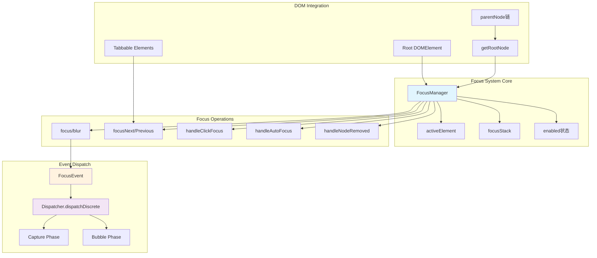

# 第三十六章：焦点与交互

终端 UI 应用中的焦点管理和交互处理是构建可访问、可操作界面的重要组成部分。本章将深入分析 Ink 终端 UI 框架中的焦点系统、选择处理、键盘交互和输入组件设计。

## 36.1 焦点管理架构

Ink 实现了类似浏览器 DOM 的焦点管理机制，支持 Tab 键导航、点击聚焦、自动焦点等功能。图 36-1 展示了焦点系统的核心架构。



**图 36-1：Ink 焦点管理系统架构图**

焦点管理器 (`FocusManager`) 是整个系统的核心，它存储在根 DOM 元素上，任何节点都可以通过 `parentNode` 链向上追溯到根节点获取焦点管理器，类似于浏览器中的 `node.ownerDocument` 机制。

## 36.2 FocusManager 核心实现

`focus.ts` 文件实现了完整的焦点管理器。

### 36.2.1 类结构与属性

```typescript
// focus.ts
export class FocusManager {
  activeElement: DOMElement | null = null
  private dispatchFocusEvent: (target: DOMElement, event: FocusEvent) => boolean
  private enabled = true
  private focusStack: DOMElement[] = []

  constructor(
    dispatchFocusEvent: (target: DOMElement, event: FocusEvent) => boolean,
  ) {
    this.dispatchFocusEvent = dispatchFocusEvent
  }
}
```

关键属性：
- **activeElement**：当前获得焦点的元素，类似于 `document.activeElement`
- **focusStack**：焦点历史栈，最多存储 32 个元素，用于元素移除时恢复焦点
- **enabled**：焦点管理是否启用，禁用时焦点操作不生效

### 36.2.2 焦点切换流程

`focus()` 方法实现了完整的焦点切换逻辑：

```typescript
focus(node: DOMElement): void {
  if (node === this.activeElement) return  // 已聚焦则跳过
  if (!this.enabled) return                 // 禁用状态跳过

  const previous = this.activeElement
  if (previous) {
    // 去重：从栈中移除旧位置，防止 Tab 循环导致无限增长
    const idx = this.focusStack.indexOf(previous)
    if (idx !== -1) this.focusStack.splice(idx, 1)
    this.focusStack.push(previous)
    if (this.focusStack.length > MAX_FOCUS_STACK) this.focusStack.shift()
    // 向旧元素发送 blur 事件
    this.dispatchFocusEvent(previous, new FocusEvent('blur', node))
  }
  this.activeElement = node
  // 向新元素发送 focus 事件
  this.dispatchFocusEvent(node, new FocusEvent('focus', previous))
}
```

焦点切换时：
1. 先检查重复和启用状态
2. 将旧焦点元素推入栈（去重防止循环增长）
3. 向旧元素派发 `blur` 事件
4. 更新 `activeElement`
5. 向新元素派发 `focus` 事件

### 36.2.3 Tab 键导航

`focusNext()` 和 `focusPrevious()` 实现 Tab 键导航：

```typescript
focusNext(root: DOMElement): void {
  this.moveFocus(1, root)
}

focusPrevious(root: DOMElement): void {
  this.moveFocus(-1, root)
}

private moveFocus(direction: 1 | -1, root: DOMElement): void {
  if (!this.enabled) return

  const tabbable = collectTabbable(root)  // 收集所有可聚焦元素
  if (tabbable.length === 0) return

  const currentIndex = this.activeElement
    ? tabbable.indexOf(this.activeElement)
    : -1

  // 计算下一个索引，支持循环
  const nextIndex =
    currentIndex === -1
      ? direction === 1 ? 0 : tabbable.length - 1
      : (currentIndex + direction + tabbable.length) % tabbable.length

  const next = tabbable[nextIndex]
  if (next) {
    this.focus(next)
  }
}
```

`collectTabbable()` 函数遍历 DOM 树，收集所有 `tabIndex >= 0` 的元素：

```typescript
function collectTabbable(root: DOMElement): DOMElement[] {
  const result: DOMElement[] = []
  walkTree(root, result)
  return result
}

function walkTree(node: DOMElement, result: DOMElement[]): void {
  const tabIndex = node.attributes['tabIndex']
  if (typeof tabIndex === 'number' && tabIndex >= 0) {
    result.push(node)
  }

  for (const child of node.childNodes) {
    if (child.nodeName !== '#text') {
      walkTree(child, result)
    }
  }
}
```

### 36.2.4 元素移除时的焦点恢复

当聚焦元素被移除时，系统从栈中恢复焦点：

```typescript
handleNodeRemoved(node: DOMElement, root: DOMElement): void {
  // 清理栈中被移除节点及其后代
  this.focusStack = this.focusStack.filter(
    n => n !== node && isInTree(n, root),
  )

  // 检查 activeElement 是否被移除
  if (!this.activeElement) return
  if (this.activeElement !== node && isInTree(this.activeElement, root)) {
    return
  }

  const removed = this.activeElement
  this.activeElement = null
  this.dispatchFocusEvent(removed, new FocusEvent('blur', null))

  // 从栈中恢复最近的仍存在的元素
  while (this.focusStack.length > 0) {
    const candidate = this.focusStack.pop()!
    if (isInTree(candidate, root)) {
      this.activeElement = candidate
      this.dispatchFocusEvent(candidate, new FocusEvent('focus', removed))
      return
    }
  }
}
```

### 36.2.5 根节点查找辅助函数

`getRootNode()` 和 `getFocusManager()` 提供从任意节点获取焦点管理器的途径：

```typescript
export function getRootNode(node: DOMElement): DOMElement {
  let current: DOMElement | undefined = node
  while (current) {
    if (current.focusManager) return current
    current = current.parentNode
  }
  throw new Error('Node is not in a tree with a FocusManager')
}

export function getFocusManager(node: DOMElement): FocusManager {
  return getRootNode(node).focusManager!
}
```

## 36.3 焦点事件系统

焦点事件遵循 DOM 事件模型，支持捕获和冒泡阶段。

### 36.3.1 FocusEvent 类定义

`events/focus-event.ts` 定义了焦点事件类：

```typescript
import { type EventTarget, TerminalEvent } from './terminal-event.js'

export class FocusEvent extends TerminalEvent {
  readonly relatedTarget: EventTarget | null

  constructor(
    type: 'focus' | 'blur',
    relatedTarget: EventTarget | null = null,
  ) {
    super(type, { bubbles: true, cancelable: false })
    this.relatedTarget = relatedTarget
  }
}
```

关键特性：
- **relatedTarget**：关联目标，对于 `focus` 事件是失去焦点的元素，对于 `blur` 事件是获得焦点的元素
- **bubbles: true**：事件冒泡，父组件可观察子元素的焦点变化
- **cancelable: false**：焦点事件不可取消，符合 DOM 规范

### 36.3.2 事件派发机制

焦点事件通过 `Dispatcher` 的 `dispatchDiscrete()` 方法派发：

```typescript
// ink.tsx
this.focusManager = new FocusManager((target, event) =>
  dispatcher.dispatchDiscrete(target, event)
)
this.rootNode.focusManager = this.focusManager
```

事件处理器映射定义在 `event-handlers.ts`：

```typescript
export const HANDLER_FOR_EVENT: Record<
  string,
  { bubble?: keyof EventHandlerProps; capture?: keyof EventHandlerProps }
> = {
  keydown: { bubble: 'onKeyDown', capture: 'onKeyDownCapture' },
  focus: { bubble: 'onFocus', capture: 'onFocusCapture' },
  blur: { bubble: 'onBlur', capture: 'onBlurCapture' },
  paste: { bubble: 'onPaste', capture: 'onPasteCapture' },
  resize: { bubble: 'onResize' },
  click: { bubble: 'onClick' },
}
```

## 36.4 文本选择系统

全屏模式下的文本选择是终端 UI 的核心交互功能，支持鼠标拖拽选择、双击选词、三击选行等多种模式。

### 36.4.1 SelectionState 数据结构

`selection.ts` 定义了选择状态：

```typescript
export type SelectionState = {
  /** 选择起点（鼠标按下位置） */
  anchor: Point | null
  /** 当前拖拽位置 */
  focus: Point | null
  /** 是否处于拖拽状态 */
  isDragging: boolean
  /** 双击/三击时的初始范围，用于扩展选择 */
  anchorSpan: { lo: Point; hi: Point; kind: 'word' | 'line' } | null
  /** 向上滚动出视图的文本行缓存 */
  scrolledOffAbove: string[]
  /** 向下滚动出视图的文本行缓存 */
  scrolledOffBelow: string[]
  /** 软换行标记（区分自动换行和真实换行） */
  scrolledOffAboveSW: boolean[]
  scrolledOffBelowSW: boolean[]
  /** 预裁剪锚点行（用于反向滚动恢复） */
  virtualAnchorRow?: number
  virtualFocusRow?: number
  /** 鼠标按下时是否按住 Alt */
  lastPressHadAlt: boolean
}
```

选择采用 **anchor + focus** 模型：
- **anchor**：选择的固定端点（鼠标按下位置）
- **focus**：选择的活动端点（鼠标当前位置）

渲染时通过 `selectionBounds()` 函数将 anchor/focus 转换为 start/end。

### 36.4.2 选择操作流程

**开始选择**：

```typescript
export function startSelection(
  s: SelectionState,
  col: number,
  row: number,
): void {
  s.anchor = { col, row }
  s.focus = null  // 首次拖拽后才设置
  s.isDragging = true
  s.anchorSpan = null
  // 清空滚动缓存
  s.scrolledOffAbove = []
  s.scrolledOffBelow = []
  s.scrolledOffAboveSW = []
  s.scrolledOffBelowSW = []
  s.virtualAnchorRow = undefined
  s.virtualFocusRow = undefined
  s.lastPressHadAlt = false
}
```

**更新选择**：

```typescript
export function updateSelection(
  s: SelectionState,
  col: number,
  row: number,
): void {
  if (!s.isDragging) return
  // 首次移动在锚点位置时跳过，防止单击变成 1 格选择
  if (!s.focus && s.anchor && s.anchor.col === col && s.anchor.row === row)
    return
  s.focus = { col, row }
}
```

**完成选择**：

```typescript
export function finishSelection(s: SelectionState): void {
  s.isDragging = false
  // 保留 anchor/focus，高亮可见，可复制
}
```

### 36.4.3 智能选择模式

**双击选词**：

```typescript
export function selectWordAt(
  s: SelectionState,
  screen: Screen,
  col: number,
  row: number,
): void {
  const b = wordBoundsAt(screen, col, row)
  if (!b) return
  const lo = { col: b.lo, row }
  const hi = { col: b.hi, row }
  s.anchor = lo
  s.focus = hi
  s.isDragging = true
  s.anchorSpan = { lo, hi, kind: 'word' }  // 设置词模式，用于扩展
}
```

字符分类函数定义了单词边界：

```typescript
function charClass(c: string): 0 | 1 | 2 {
  if (c === ' ' || c === '') return 0        // 空白类
  if (WORD_CHAR.test(c)) return 1            // 单词字符类
  return 2                                    // 其他标点类
}
```

`WORD_CHAR` 正则匹配 iTerm2 默认的单词字符集：

```typescript
const WORD_CHAR = /[\p{L}\p{N}_/.\-+~\\]/u
```

这意味着路径如 `/usr/bin/bash` 或 `~/.claude/config.json` 双击时会完整选中。

**三击选行**：

```typescript
export function selectLineAt(
  s: SelectionState,
  screen: Screen,
  row: number,
): void {
  if (row < 0 || row >= screen.height) return
  const lo = { col: 0, row }
  const hi = { col: screen.width - 1, row }
  s.anchor = lo
  s.focus = hi
  s.isDragging = true
  s.anchorSpan = { lo, hi, kind: 'line' }
}
```

### 36.4.4 滚动时的选择追踪

当内容滚动时，选择需要跟随文本而非屏幕位置。

**拖拽滚动时锚点移动**：

```typescript
export function shiftAnchor(
  s: SelectionState,
  dRow: number,
  minRow: number,
  maxRow: number,
): void {
  if (!s.anchor) return
  // 虚拟行追踪，防止裁剪后丢失真实位置
  const raw = (s.virtualAnchorRow ?? s.anchor.row) + dRow
  s.anchor = { col: s.anchor.col, row: clamp(raw, minRow, maxRow) }
  s.virtualAnchorRow = raw < minRow || raw > maxRow ? raw : undefined
}
```

**键盘滚动时整体移动**：

```typescript
export function shiftSelection(
  s: SelectionState,
  dRow: number,
  minRow: number,
  maxRow: number,
  width: number,
): void {
  if (!s.anchor || !s.focus) return
  // 虚拟行追踪
  const vAnchor = (s.virtualAnchorRow ?? s.anchor.row) + dRow
  const vFocus = (s.virtualFocusRow ?? s.focus.row) + dRow

  // 两端都超出同一边界时清除选择
  if (
    (vAnchor < minRow && vFocus < minRow) ||
    (vAnchor > maxRow && vFocus > maxRow)
  ) {
    clearSelection(s)
    return
  }

  // 更新滚动缓存债务
  // ... 缓存管理逻辑 ...

  // 裁剪并更新位置
  s.anchor = shift(s.anchor, vAnchor)
  s.focus = shift(s.focus, vFocus)
}
```

### 36.4.5 选择文本提取

`getSelectedText()` 从屏幕缓冲区提取选中文本：

```typescript
export function getSelectedText(s: SelectionState, screen: Screen): string {
  const b = selectionBounds(s)
  if (!b) return ''
  const { start, end } = b
  const sw = screen.softWrap
  const lines: string[] = []

  // 添加向上滚动出的行
  for (let i = 0; i < s.scrolledOffAbove.length; i++) {
    joinRows(lines, s.scrolledOffAbove[i], s.scrolledOffAboveSW[i])
  }

  // 提取屏幕上的选中行
  for (let row = start.row; row <= end.row; row++) {
    const rowStart = row === start.row ? start.col : 0
    const rowEnd = row === end.row ? end.col : screen.width - 1
    joinRows(lines, extractRowText(screen, row, rowStart, rowEnd), sw[row] > 0)
  }

  // 添加向下滚动出的行
  for (let i = 0; i < s.scrolledOffBelow.length; i++) {
    joinRows(lines, s.scrolledOffBelow[i], s.scrolledOffBelowSW[i])
  }

  return lines.join('\n')
}
```

`joinRows()` 函数处理软换行：

```typescript
function joinRows(
  lines: string[],
  text: string,
  sw: boolean | undefined,
): void {
  if (sw && lines.length > 0) {
    // 软换行：连接到上一行
    lines[lines.length - 1] += text
  } else {
    // 硬换行：新增一行
    lines.push(text)
  }
}
```

### 36.4.6 选择高亮渲染

`applySelectionOverlay()` 直接修改屏幕缓冲区的样式：

```typescript
export function applySelectionOverlay(
  screen: Screen,
  selection: SelectionState,
  stylePool: StylePool,
): void {
  const b = selectionBounds(selection)
  if (!b) return
  const { start, end } = b
  const width = screen.width
  const noSelect = screen.noSelect

  for (let row = start.row; row <= end.row && row < screen.height; row++) {
    const colStart = row === start.row ? start.col : 0
    const colEnd = row === end.row ? Math.min(end.col, width - 1) : width - 1
    const rowOff = row * width

    for (let col = colStart; col <= colEnd; col++) {
      const idx = rowOff + col
      // 跳过 noSelect 区域（行号、diff标记等）
      if (noSelect[idx] === 1) continue
      const cell = cellAtIndex(screen, idx)
      // 使用实色背景替换，保留前景色
      setCellStyleId(screen, col, row, stylePool.withSelectionBg(cell.styleId))
    }
  }
}
```

使用实色背景而非 SGR-7 反色（交换前景/背景），避免语法高亮文本上出现彩色条纹。

## 36.5 键盘事件处理

键盘输入是终端 UI 的主要交互方式，Ink 实现了完整的键盘事件解析和派发系统。

### 36.5.1 KeyboardEvent 类

`events/keyboard-event.ts` 定义键盘事件：

```typescript
export class KeyboardEvent extends TerminalEvent {
  readonly key: string
  readonly ctrl: boolean
  readonly shift: boolean
  readonly meta: boolean
  readonly superKey: boolean
  readonly fn: boolean

  constructor(parsedKey: ParsedKey) {
    super('keydown', { bubbles: true, cancelable: true })

    this.key = keyFromParsed(parsedKey)
    this.ctrl = parsedKey.ctrl
    this.shift = parsedKey.shift
    this.meta = parsedKey.meta || parsedKey.option
    this.superKey = parsedKey.super
    this.fn = parsedKey.fn
  }
}
```

`key` 属性遵循浏览器规范：
- 可打印字符：返回字面值（`'a'`, `'3'`, `' '`）
- 特殊键：返回名称（`'down'`, `'return'`, `'escape'`, `'f1'`）

判断可打印字符的惯用方式：`e.key.length === 1`。

### 36.5.2 按键解析流程

`parse-keypress.ts` 是键盘输入的核心解析器，支持多种终端协议。

**支持的协议**：
- **CSI u（Kitty Keyboard Protocol）**：`ESC[codepoint[;modifier]u`
- **modifyOtherKeys**：`ESC[27;modifier;keycode~`
- **X10/SGR Mouse**：鼠标事件解析
- **应用键盘模式**：`ESC O letter`（小键盘）

**CSI u 解析**：

```typescript
if ((match = CSI_U_RE.exec(s))) {
  const codepoint = parseInt(match[1], 10)
  const modifier = match[2] ? parseInt(match[2], 10) : 1  // 默认 1
  const mods = decodeModifier(modifier)
  const name = keycodeToName(codepoint)
  return {
    kind: 'key',
    name,
    ctrl: mods.ctrl,
    meta: mods.meta,
    shift: mods.shift,
    super: mods.super,
    sequence: s,
    raw: s,
    isPasted: false,
  }
}
```

**修饰键解码**：

```typescript
function decodeModifier(modifier: number): {
  shift: boolean
  meta: boolean
  ctrl: boolean
  super: boolean
} {
  const m = modifier - 1  // 编码偏移 1
  return {
    shift: !!(m & 1),   // 位 0
    meta: !!(m & 2),    // 位 1 (Alt/Option)
    ctrl: !!(m & 4),    // 位 2
    super: !!(m & 8),   // 位 3 (Cmd/Win)
  }
}
```

### 36.5.3 InputEvent 与 useInput Hook

`InputEvent` 封装了更丰富的输入信息（`input-event.ts`）：

```typescript
export class InputEvent extends Event {
  readonly keypress: ParsedKey
  readonly key: Key
  readonly input: string

  constructor(keypress: ParsedKey) {
    super()
    const [key, input] = parseKey(keypress)

    this.keypress = keypress
    this.key = key  // 结构化按键信息
    this.input = input  // 文本输入
  }
}
```

`Key` 类型提供语义化的按键检测：

```typescript
export type Key = {
  upArrow: boolean
  downArrow: boolean
  leftArrow: boolean
  rightArrow: boolean
  pageDown: boolean
  pageUp: boolean
  wheelUp: boolean
  wheelDown: boolean
  home: boolean
  end: boolean
  return: boolean
  escape: boolean
  ctrl: boolean
  shift: boolean
  fn: boolean
  tab: boolean
  backspace: boolean
  delete: boolean
  meta: boolean
  super: boolean
}
```

`useInput` Hook 提供简洁的输入处理接口（`hooks/use-input.ts`）：

```typescript
const useInput = (inputHandler: Handler, options: Options = {}) => {
  const { setRawMode, internal_exitOnCtrlC, internal_eventEmitter } = useStdin()

  // useLayoutEffect 确保同步启用 raw mode
  useLayoutEffect(() => {
    if (options.isActive === false) return
    setRawMode(true)
    return () => setRawMode(false)
  }, [options.isActive, setRawMode])

  // 使用 useEventCallback 保持监听器位置稳定
  const handleData = useEventCallback((event: InputEvent) => {
    if (options.isActive === false) return
    const { input, key } = event

    // Ctrl+C 特殊处理
    if (!(input === 'c' && key.ctrl) || !internal_exitOnCtrlC) {
      inputHandler(input, key, event)
    }
  })

  useEffect(() => {
    internal_eventEmitter?.on('input', handleData)
    return () => internal_eventEmitter?.removeListener('input', handleData)
  }, [internal_eventEmitter, handleData])
}
```

## 36.6 点击事件与命中测试

鼠标点击事件需要先命中测试确定目标元素，然后派发事件。

### 36.6.1 hitTest 命中测试

`hit-test.ts` 实现了基于渲染位置的命中测试：

```typescript
export function hitTest(
  node: DOMElement,
  col: number,
  row: number,
): DOMElement | null {
  const rect = nodeCache.get(node)
  if (!rect) return null

  // 检查坐标是否在元素矩形内
  if (
    col < rect.x ||
    col >= rect.x + rect.width ||
    row < rect.y ||
    row >= rect.y + rect.height
  ) {
    return null
  }

  // 后绘制的兄弟在上层，反向遍历
  for (let i = node.childNodes.length - 1; i >= 0; i--) {
    const child = node.childNodes[i]
    if (child.nodeName === '#text') continue
    const hit = hitTest(child, col, row)
    if (hit) return hit
  }

  return node
}
```

命中测试使用 `nodeCache` 中存储的渲染矩形，该缓存由 `renderNodeToOutput` 在每帧填充。

### 36.6.2 dispatchClick 事件派发

点击事件从最深层命中元素向上冒泡：

```typescript
export function dispatchClick(
  root: DOMElement,
  col: number,
  row: number,
  cellIsBlank = false,
): boolean {
  let target: DOMElement | undefined = hitTest(root, col, row) ?? undefined
  if (!target) return false

  // 点击聚焦：找到最近的可聚焦祖先
  if (root.focusManager) {
    let focusTarget: DOMElement | undefined = target
    while (focusTarget) {
      if (typeof focusTarget.attributes['tabIndex'] === 'number') {
        root.focusManager.handleClickFocus(focusTarget)
        break
      }
      focusTarget = focusTarget.parentNode
    }
  }

  const event = new ClickEvent(col, row, cellIsBlank)
  let handled = false

  // 冒泡派发
  while (target) {
    const handler = target._eventHandlers?.onClick
    if (handler) {
      handled = true
      const rect = nodeCache.get(target)
      if (rect) {
        event.localCol = col - rect.x  // 相对坐标
        event.localRow = row - rect.y
      }
      handler(event)
      if (event.didStopImmediatePropagation()) return true
    }
    target = target.parentNode
  }

  return handled
}
```

### 36.6.3 ClickEvent 类

`click-event.ts` 定义点击事件：

```typescript
export class ClickEvent extends Event {
  /** 屏幕列（0-indexed） */
  readonly col: number
  /** 屏幕行（0-indexed） */
  readonly row: number
  /** 相对当前处理器的列 */
  localCol = 0
  /** 相对当前处理器的行 */
  localRow = 0
  /** 点击单元格是否空白 */
  readonly cellIsBlank: boolean

  constructor(col: number, row: number, cellIsBlank: boolean) {
    super()
    this.col = col
    this.row = row
    this.cellIsBlank = cellIsBlank
  }
}
```

`localCol/localRow` 在每个处理器执行前重新计算，使得容器组件能获取相对自身的坐标。

### 36.6.4 Hover 事件处理

`dispatchHover()` 处理鼠标悬停状态：

```typescript
export function dispatchHover(
  root: DOMElement,
  col: number,
  row: number,
  hovered: Set<DOMElement>,
): void {
  const next = new Set<DOMElement>()
  let node: DOMElement | undefined = hitTest(root, col, row) ?? undefined

  // 收集所有有 hover 处理器的祖先
  while (node) {
    const h = node._eventHandlers
    if (h?.onMouseEnter || h?.onMouseLeave) next.add(node)
    node = node.parentNode
  }

  // 离开的节点：发送 leave
  for (const old of hovered) {
    if (!next.has(old)) {
      hovered.delete(old)
      if (old.parentNode) {  // 跳过已卸载节点
        old._eventHandlers?.onMouseLeave?.()
      }
    }
  }

  // 新进入的节点：发送 enter
  for (const n of next) {
    if (!hovered.has(n)) {
      hovered.add(n)
      n._eventHandlers?.onMouseEnter?.()
    }
  }
}
```

`mouseenter/mouseleave` 不冒泡——在子元素间移动不会重新触发父元素的处理器。

## 36.7 事件分发器

`Dispatcher` 是事件系统的核心，管理捕获/冒泡流程和 React 调度优先级。

### 36.7.1 Dispatcher 类结构

`events/dispatcher.ts` 定义分发器：

```typescript
export class Dispatcher {
  currentEvent: TerminalEvent | null = null
  currentUpdatePriority: number = DefaultEventPriority as number
  discreteUpdates: DiscreteUpdates | null = null
}
```

`currentEvent` 和 `currentUpdatePriority` 供 React reconciler 读取，实现事件上下文。

### 36.7.2 监听器收集

`collectListeners()` 按 DOM 顺序收集处理器：

```typescript
function collectListeners(
  target: EventTarget,
  event: TerminalEvent,
): DispatchListener[] {
  const listeners: DispatchListener[] = []

  let node: EventTarget | undefined = target
  while (node) {
    const isTarget = node === target

    const captureHandler = getHandler(node, event.type, true)
    const bubbleHandler = getHandler(node, event.type, false)

    // 捕获处理器：prepend（根优先）
    if (captureHandler) {
      listeners.unshift({
        node,
        handler: captureHandler,
        phase: isTarget ? 'at_target' : 'capturing',
      })
    }

    // 冒泡处理器：append（目标优先）
    if (bubbleHandler && (event.bubbles || isTarget)) {
      listeners.push({
        node,
        handler: bubbleHandler,
        phase: isTarget ? 'at_target' : 'bubbling',
      })
    }

    node = node.parentNode
  }

  return listeners
}
```

结果顺序：`[root-cap, ..., parent-cap, target-cap, target-bub, parent-bub, ..., root-bub]`

### 36.7.3 优先级映射

事件类型映射到 React 调度优先级：

```typescript
function getEventPriority(eventType: string): number {
  switch (eventType) {
    case 'keydown':
    case 'keyup':
    case 'click':
    case 'focus':
    case 'blur':
    case 'paste':
      return DiscreteEventPriority as number  // 同步执行
    case 'resize':
    case 'scroll':
    case 'mousemove':
      return ContinuousEventPriority as number  // 批量处理
    default:
      return DefaultEventPriority as number
  }
}
```

离散事件（键盘、点击）立即同步处理，连续事件（滚动、鼠标移动）批量处理以提高性能。

### 36.7.4 事件派发执行

`dispatch()` 方法执行完整派发流程：

```typescript
dispatch(target: EventTarget, event: TerminalEvent): boolean {
  const previousEvent = this.currentEvent
  this.currentEvent = event
  try {
    event._setTarget(target)

    const listeners = collectListeners(target, event)
    processDispatchQueue(listeners, event)

    event._setEventPhase('none')
    event._setCurrentTarget(null)

    return !event.defaultPrevented  // 返回是否被阻止
  } finally {
    this.currentEvent = previousEvent  // 恢复事件上下文
  }
}
```

`processDispatchQueue()` 执行监听器队列，处理传播停止：

```typescript
function processDispatchQueue(
  listeners: DispatchListener[],
  event: TerminalEvent,
): void {
  let previousNode: EventTarget | undefined

  for (const { node, handler, phase } of listeners) {
    if (event._isImmediatePropagationStopped()) break
    if (event._isPropagationStopped() && node !== previousNode) break

    event._setEventPhase(phase)
    event._setCurrentTarget(node)
    event._prepareForTarget(node)  // 子类特定准备

    try {
      handler(event)
    } catch (error) {
      logError(error)  // 错误不中断派发
    }

    previousNode = node
  }
}
```

## 36.8 Button 组件设计

`Button` 组件是 Ink 中交互组件的典型代表，展示焦点、hover、active 状态管理。

### 36.8.1 组件结构

`components/Button.tsx` 定义按钮组件：

```typescript
function Button({
  onAction,
  tabIndex = 0,
  autoFocus,
  children,
  ref,
  ...style
}: Props): React.ReactNode {
  // 三种交互状态
  const [isFocused, setIsFocused] = useState(false)
  const [isHovered, setIsHovered] = useState(false)
  const [isActive, setIsActive] = useState(false)

  const activeTimer = useRef<ReturnType<typeof setTimeout> | null>(null)

  // 清理定时器
  useEffect(() => {
    return () => {
      if (activeTimer.current) clearTimeout(activeTimer.current)
    }
  }, [])

  // 键盘响应：Enter 或 Space
  const handleKeyDown = useCallback(
    (e: KeyboardEvent) => {
      if (e.key === 'return' || e.key === ' ') {
        e.preventDefault()
        setIsActive(true)
        onAction()
        if (activeTimer.current) clearTimeout(activeTimer.current)
        activeTimer.current = setTimeout(() => setIsActive(false), 100)
      }
    },
    [onAction]
  )

  // 点击响应
  const handleClick = useCallback(() => onAction(), [onAction])

  // 焦点事件
  const handleFocus = useCallback(() => setIsFocused(true), [])
  const handleBlur = useCallback(() => setIsFocused(false), [])

  // Hover 事件
  const handleMouseEnter = useCallback(() => setIsHovered(true), [])
  const handleMouseLeave = useCallback(() => setIsHovered(false), [])

  // 渲染内容：支持 children 作为渲染函数
  const state: ButtonState = { focused: isFocused, hovered: isHovered, active: isActive }
  const content = typeof children === 'function' ? children(state) : children

  return (
    <Box
      ref={ref}
      tabIndex={tabIndex}
      autoFocus={autoFocus}
      onKeyDown={handleKeyDown}
      onClick={handleClick}
      onFocus={handleFocus}
      onBlur={handleBlur}
      onMouseEnter={handleMouseEnter}
      onMouseLeave={handleMouseLeave}
      {...style}
    >
      {content}
    </Box>
  )
}
```

### 36.8.2 状态类型定义

```typescript
type ButtonState = {
  focused: boolean
  hovered: boolean
  active: boolean
}

export type Props = Except<Styles, 'textWrap'> & {
  ref?: Ref<DOMElement>
  onAction: () => void
  tabIndex?: number
  autoFocus?: boolean
  children: ((state: ButtonState) => React.ReactNode) | React.ReactNode
}
```

### 36.8.3 设计特点

**无默认样式**：Button 本身不带样式，由 children 渲染函数根据状态决定外观。

**渲染函数模式**：

```tsx
<Button onAction={handleClick}>
  {(state) => (
    <Text
      color={state.focused ? 'cyan' : 'white'}
      bold={state.active}
    >
      Click Me
    </Text>
  )}
</Button>
```

**多触发方式**：
- Enter 键
- Space 键
- 鼠标点击

**Active 状态短暂**：active 状态持续 100ms 后自动清除，提供视觉反馈。

## 36.9 终端焦点状态

终端窗口本身的焦点状态通过 DECSET 1004 协议追踪。

### 36.9.1 TerminalFocusState 类型

`terminal-focus-state.ts` 定义状态：

```typescript
export type TerminalFocusState = 'focused' | 'blurred' | 'unknown'

let focusState: TerminalFocusState = 'unknown'
const resolvers: Set<() => void> = new Set()
const subscribers: Set<() => void> = new Set()
```

`unknown` 是默认值，用于不支持焦点报告的终端，消费者应将其视为 `focused`。

### 36.9.2 状态更新与订阅

```typescript
export function setTerminalFocused(v: boolean): void {
  focusState = v ? 'focused' : 'blurred'
  // 通知 useSyncExternalStore 订阅者
  for (const cb of subscribers) cb()
  // 解析等待的 Promise
  if (!v) {
    for (const resolve of resolvers) resolve()
    resolvers.clear()
  }
}

export function getTerminalFocused(): boolean {
  return focusState !== 'blurred'
}

export function subscribeTerminalFocus(cb: () => void): () => void {
  subscribers.add(cb)
  return () => subscribers.delete(cb)
}
```

### 36.9.3 TerminalFocusProvider

`TerminalFocusContext.tsx` 提供 React Context：

```typescript
export function TerminalFocusProvider({
  children,
}: {
  children: React.ReactNode
}): React.ReactNode {
  const isTerminalFocused = useSyncExternalStore(
    subscribeTerminalFocus,
    getTerminalFocused
  )
  const terminalFocusState = useSyncExternalStore(
    subscribeTerminalFocus,
    getTerminalFocusState
  )

  const value = useMemo(
    () => ({ isTerminalFocused, terminalFocusState }),
    [isTerminalFocused, terminalFocusState]
  )

  return (
    <TerminalFocusContext.Provider value={value}>
      {children}
    </TerminalFocusContext.Provider>
  )
}
```

设计注释指出，单独组件确保 `App.tsx` 不在焦点变化时重渲染，只有消费 Context 的组件才重渲染。

### 36.9.4 useTerminalFocus Hook

```typescript
export function useTerminalFocus(): boolean {
  const { isTerminalFocused } = useContext(TerminalFocusContext)
  return isTerminalFocused
}
```

用于节流操作：终端失焦时暂停高频更新，节省资源。

## 36.10 useSelection Hook

`hooks/use-selection.ts` 提供选择操作的 React 接口。

### 36.10.1 返回接口

```typescript
export function useSelection(): {
  copySelection: () => string
  copySelectionNoClear: () => string
  clearSelection: () => void
  hasSelection: () => boolean
  getState: () => SelectionState | null
  subscribe: (cb: () => void) => () => void
  shiftAnchor: (dRow: number, minRow: number, maxRow: number) => void
  shiftSelection: (dRow: number, minRow: number, maxRow: number) => void
  moveFocus: (move: FocusMove) => void
  captureScrolledRows: (firstRow: number, lastRow: number, side: 'above' | 'below') => void
  setSelectionBgColor: (color: string) => void
}
```

### 36.10.2 实现细节

```typescript
export function useSelection() {
  useContext(StdinContext)  //锚定到 App 子树
  const ink = instances.get(process.stdout)

  return useMemo(() => {
    if (!ink) {
      // 非全屏模式：返回空操作
      return {
        copySelection: () => '',
        clearSelection: () => {},
        // ...
      }
    }
    return {
      copySelection: () => ink.copySelection(),
      clearSelection: () => ink.clearTextSelection(),
      hasSelection: () => ink.hasTextSelection(),
      getState: () => ink.selection,
      subscribe: (cb) => ink.subscribeToSelectionChange(cb),
      // ...
    }
  }, [ink])
}
```

### 36.10.3 useHasSelection 响应式状态

```typescript
export function useHasSelection(): boolean {
  useContext(StdinContext)
  const ink = instances.get(process.stdout)
  return useSyncExternalStore(
    ink ? ink.subscribeToSelectionChange : NO_SUBSCRIBE,
    ink ? ink.hasTextSelection : ALWAYS_FALSE,
  )
}
```

选择存在时组件自动重渲染，用于显示/隐藏复制提示。

## 36.11 总结

Ink 的焦点与交互系统展现了终端 UI 的专业设计：

**焦点管理**：
- 类 DOM 的 `FocusManager` 实现，支持 Tab 导航和焦点栈恢复
- 事件冒泡机制允许父组件观察焦点变化
- 与 reconciler 集成，支持自动焦点和元素移除恢复

**选择系统**：
- anchor/focus 模型匹配原生终端行为
- 智能选词（双击）和选行（三击）
- 滚动追踪保持选择与文本绑定
- 软换行处理确保复制结果符合逻辑行

**键盘事件**：
- 多协议支持（Kitty CSI u、modifyOtherKeys、应用键盘模式）
- 结构化 Key 类型简化按键检测
- 与 React 调度优先级集成

**事件派发**：
- 完整捕获/冒泡流程
- 离散/连续事件优先级分离
- 命中测试基于渲染缓存

**组件设计**：
- Button 的渲染函数模式展示状态驱动
- TerminalFocusProvider 的分离组件防止过度重渲染
- useSelection 的响应式状态订阅

---

**本章源文件**：
- `/src/ink/focus.ts`
- `/src/ink/selection.ts`
- `/src/ink/events/focus-event.ts`
- `/src/ink/events/keyboard-event.ts`
- `/src/ink/events/input-event.ts`
- `/src/ink/events/click-event.ts`
- `/src/ink/events/dispatcher.ts`
- `/src/ink/events/event-handlers.ts`
- `/src/ink/events/terminal-event.ts`
- `/src/ink/parse-keypress.ts`
- `/src/ink/hit-test.ts`
- `/src/ink/hooks/use-input.ts`
- `/src/ink/hooks/use-selection.ts`
- `/src/ink/hooks/use-terminal-focus.ts`
- `/src/ink/components/Button.tsx`
- `/src/ink/components/TerminalFocusContext.tsx`
- `/src/ink/terminal-focus-state.ts`