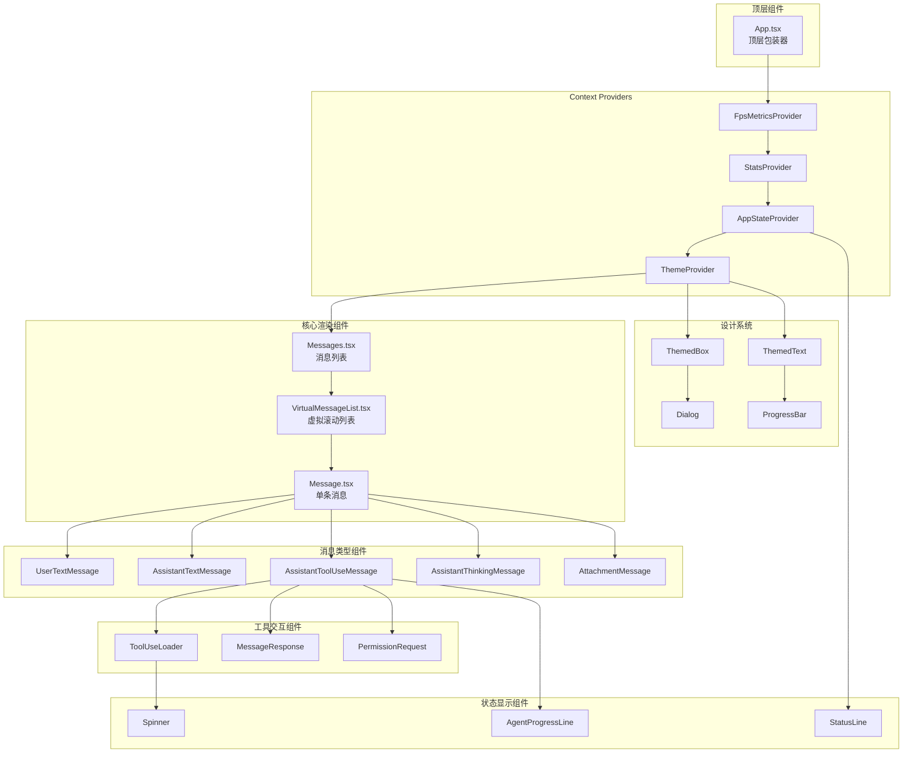
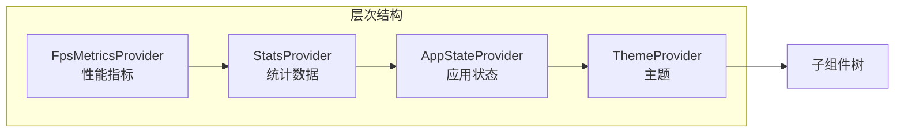

# 第37章：组件架构

本章深入分析 Claude Code 的前端组件架构，包括目录结构、消息渲染、工具使用 UI 和状态显示等核心组件的实现。

## 37.1 组件架构概述

Claude Code 使用 React 组件构建终端用户界面，采用 Ink 框架实现命令行应用的渲染。组件架构遵循分层设计原则，将 UI 元素划分为消息渲染、工具交互、状态显示和设计系统等多个层次。

### 图 37-1：组件架构层次图



## 37.2 目录结构

组件目录位于 `src/components/`，包含约 146 个组件文件，按功能分组到多个子目录中。

```
src/components/
├── App.tsx                    # 顶层应用组件
├── Message.tsx                # 核心消息渲染组件
├── Messages.tsx               # 消息列表容器
├── StatusLine.tsx             # 状态栏组件
├── AgentProgressLine.tsx      # Agent 进度显示
├── ToolUseLoader.tsx          # 工具加载指示器
├── Markdown.tsx               # Markdown 渲染
├── Spinner.tsx                # 加载动画
│
├── messages/                  # 消息类型组件
│   ├── AssistantTextMessage.tsx
│   ├── AssistantToolUseMessage.tsx
│   ├── AssistantThinkingMessage.tsx
│   ├── UserTextMessage.tsx
│   ├── UserToolResultMessage/
│   ├── AttachmentMessage.tsx
│   └── SystemTextMessage.tsx
│
├── design-system/             # 设计系统基础组件
│   ├── ThemeProvider.tsx
│   ├── ThemedBox.tsx
│   ├── ThemedText.tsx
│   ├── Dialog.tsx
│   ├── ProgressBar.tsx
│   └── Tabs.tsx
│
├── permissions/               # 权限请求组件
│   ├── PermissionRequest.tsx
│   ├── PermissionPrompt.tsx
│   ├── FallbackPermissionRequest.tsx
│   ├── BashPermissionRequest/
│   ├── FileEditPermissionRequest/
│   └── rules/
│
├── PromptInput/               # 输入组件
├── CustomSelect/              # 选择器组件
├── tasks/                     # 任务管理组件
├── shell/                     # Shell 输出组件
├── ui/                        # UI 工具组件
└── hooks/                     # 自定义 Hooks
```

## 37.3 消息渲染组件

### 37.3.1 Message.tsx 核心组件

`Message.tsx` 是消息渲染的核心组件，根据消息类型分发到相应的子组件进行渲染。

**文件位置**: `src/components/Message.tsx`

```typescript
// 消息类型定义
type Props = {
  message: NormalizedUserMessage | AssistantMessage | 
           AttachmentMessage | SystemMessage | 
           GroupedToolUseMessage | CollapsedReadSearchGroup;
  lookups: ReturnType<typeof buildMessageLookups>;
  containerWidth?: number;
  addMargin: boolean;
  tools: Tools;
  commands: Command[];
  verbose: boolean;
  inProgressToolUseIDs: Set<string>;
  progressMessagesForMessage: ProgressMessage[];
  shouldAnimate: boolean;
  shouldShowDot: boolean;
  style?: 'condensed';
  width?: number | string;
  isTranscriptMode: boolean;
  isStatic: boolean;
  // ...
};

function MessageImpl({ message, ... }: Props) {
  switch (message.type) {
    case "attachment":
      return <AttachmentMessage ... />;
    case "assistant":
      return message.message.content.map((block, index) => 
        <AssistantMessageBlock key={index} param={block} ... />
      );
    case "user":
      return message.message.content.map((param, index) => 
        <UserMessage key={index} ... />
      );
    case "system":
      // 处理系统消息...
  }
}
```

### 37.3.2 消息类型分发

消息组件根据 `message.type` 属性进行类型分发：

| 消息类型 | 渲染组件 | 说明 |
|---------|---------|------|
| `attachment` | `AttachmentMessage` | 文件附件显示 |
| `assistant` | `AssistantMessageBlock` | AI 助手回复 |
| `user` | `UserMessage` | 用户输入消息 |
| `system` | `SystemTextMessage` | 系统通知 |

### 37.3.3 Assistant 消息块类型

Assistant 消息的内容块根据类型进一步细分：

**文件位置**: `src/components/Message.tsx:82-156`

```typescript
// Assistant 消息内容块渲染
function AssistantMessageBlock({ param, ... }) {
  switch (param.type) {
    case "text":
      return <AssistantTextMessage param={param} ... />;
    case "tool_use":
      return <AssistantToolUseMessage param={param} ... />;
    case "thinking":
      return <AssistantThinkingMessage param={param} ... />;
    case "redacted_thinking":
      return <AssistantRedactedThinkingMessage ... />;
  }
}
```

### 37.3.4 UserTextMessage 消息处理

`UserTextMessage` 组件处理用户文本消息，根据消息内容特征分发到专用组件。

**文件位置**: `src/components/messages/UserTextMessage.tsx`

```typescript
export function UserTextMessage({ param, ... }: Props) {
  // 空内容检查
  if (param.text.trim() === NO_CONTENT_MESSAGE) {
    return null;
  }
  
  // Plan 内容
  if (planContent) {
    return <UserPlanMessage addMargin={addMargin} planContent={planContent} />;
  }
  
  // Bash 输出消息
  if (param.text.startsWith("<bash-stdout") || param.text.startsWith("<bash-stderr")) {
    return <UserBashOutputMessage content={param.text} verbose={verbose} />;
  }
  
  // 本地命令输出
  if (param.text.startsWith("<local-command-stdout") || ...) {
    return <UserLocalCommandOutputMessage content={param.text} />;
  }
  
  // 中断消息
  if (param.text === INTERRUPT_MESSAGE || param.text === INTERRUPT_MESSAGE_FOR_TOOL_USE) {
    return <MessageResponse height={1}><InterruptedByUser /></MessageResponse>;
  }
  
  // 默认用户提示消息
  return <UserPromptMessage ... />;
}
```

## 37.4 工具使用 UI

### 37.4.1 AssistantToolUseMessage 组件

`AssistantToolUseMessage` 负责渲染工具调用消息，包括工具名称、参数、进度和结果。

**文件位置**: `src/components/messages/AssistantToolUseMessage.tsx`

```typescript
type Props = {
  param: ToolUseBlockParam;
  addMargin: boolean;
  tools: Tools;
  commands: Command[];
  verbose: boolean;
  inProgressToolUseIDs: Set<string>;
  progressMessagesForMessage: ProgressMessage[];
  shouldAnimate: boolean;
  shouldShowDot: boolean;
  inProgressToolCallCount?: number;
  lookups: ReturnType<typeof buildMessageLookups>;
  isTranscriptMode?: boolean;
};

export function AssistantToolUseMessage({ param, ... }: Props) {
  // 解析工具定义
  const tool = findToolByName(tools, param.name);
  const input = tool.inputSchema.safeParse(param.input);
  
  // 检查工具状态
  const isResolved = lookups.resolvedToolUseIDs.has(param.id);
  const isQueued = !inProgressToolUseIDs.has(param.id) && !isResolved;
  const isWaitingForPermission = pendingWorkerRequest?.toolUseId === param.id;
  
  // 透明包装器工具不显示
  if (tool.isTransparentWrapper?.()) {
    if (isQueued || isResolved) return null;
  }
  
  // 渲染工具进度或结果
  return (
    <Box flexDirection="column" width="100%" backgroundColor={bg}>
      {/* 工具头部 */}
      <ToolUseHeader 
        tool={tool} 
        userFacingToolName={userFacingToolName}
        isResolved={isResolved}
        isQueued={isQueued}
      />
      
      {/* 工具参数 */}
      {!isResolved && <ToolInputDisplay input={input.data} />}
      
      {/* 进度消息 */}
      {renderToolUseProgressMessage(tool, ...)}
      
      {/* 工具结果 */}
      {isResolved && <MessageResponse ... />}
    </Box>
  );
}
```

### 37.4.2 ToolUseLoader 组件

`ToolUseLoader` 是工具执行时的加载指示器，使用闪烁动画表示活动状态。

**文件位置**: `src/components/ToolUseLoader.tsx`

```typescript
type Props = {
  isError: boolean;
  isUnresolved: boolean;
  shouldAnimate: boolean;
};

export function ToolUseLoader({ isError, isUnresolved, shouldAnimate }: Props) {
  const [ref, isBlinking] = useBlink(shouldAnimate);
  
  // 状态颜色
  const color = isUnresolved 
    ? undefined 
    : isError ? "error" : "success";
  
  // 黑色圆点或空格（闪烁效果）
  const symbol = !shouldAnimate || isBlinking || isError || !isUnresolved
    ? BLACK_CIRCLE   // "●"
    : " ";
  
  return (
    <Box ref={ref} minWidth={2}>
      <Text color={color} dimColor={isUnresolved}>
        {symbol}
      </Text>
    </Box>
  );
}
```

### 37.4.3 权限请求组件

权限请求组件位于 `permissions/` 目录，处理工具执行前的用户授权。

**目录结构**: `src/components/permissions/`

```
permissions/
├── PermissionRequest.tsx      # 权限请求入口
├── PermissionPrompt.tsx       # 权限提示对话框
├── PermissionDialog.tsx       # 对话框组件
├── PermissionExplanation.tsx  # 权限说明
├── FallbackPermissionRequest.tsx  # 通用权限请求
├── BashPermissionRequest/     # Bash 命令权限
├── FileEditPermissionRequest/ # 文件编辑权限
├── FileWritePermissionRequest/ # 文件写入权限
├── WebFetchPermissionRequest/ # Web 请求权限
└── rules/                     # 权限规则组件
```

**权限请求流程**:

```mermaid
sequenceDiagram
    Tool as 工具调用
    PR as PermissionRequest
    PP as PermissionPrompt
    User as 用户
    
    Tool->>PR: 发起权限请求
    PR->>PR: 检查规则匹配
    PR->>PP: 显示权限对话框
    PP->>User: 展示操作详情
    User->>PP: 允许/拒绝/修改
    PP->>PR: 返回决策
    PR->>Tool: 执行或取消
```

## 37.5 状态显示组件

### 37.5.1 StatusLine 组件

`StatusLine` 是终端底部状态栏组件，显示会话状态、模型信息、成本统计等。

**文件位置**: `src/components/StatusLine.tsx`

```typescript
type Props = {
  messagesRef: React.RefObject<Message[]>;
  lastAssistantMessageId: string | null;
  vimMode?: VimMode;
};

function StatusLineInner({ messagesRef, lastAssistantMessageId, vimMode }: Props) {
  // 状态数据
  const permissionMode = useAppState(s => s.toolPermissionContext.mode);
  const statusLineText = useAppState(s => s.statusLineText);
  const mainLoopModel = useMainLoopModel();
  
  // 防抖更新
  const scheduleUpdate = useCallback(() => {
    clearTimeout(debounceTimerRef.current);
    debounceTimerRef.current = setTimeout(() => {
      void doUpdate();
    }, 300);
  }, [doUpdate]);
  
  // 构建状态命令输入
  const statusInput = buildStatusLineCommandInput(
    permissionMode,
    exceeds200kTokens,
    settings,
    messages,
    addedDirs,
    mainLoopModel,
    vimMode
  );
  
  // 执行状态命令获取显示文本
  const text = await executeStatusLineCommand(statusInput, ...);
  
  // 更新状态文本
  setAppState(prev => ({ ...prev, statusLineText: text }));
}
```

**状态栏信息构成**:

| 字段 | 说明 | 来源 |
|-----|------|------|
| model | 当前模型 | `mainLoopModel` |
| permissionMode | 权限模式 | `AppState.toolPermissionContext.mode` |
| cwd | 当前目录 | `getCwd()` |
| cost | 成本统计 | `getTotalCost()` |
| context_window | 上下文使用 | `calculateContextPercentages()` |
| rate_limits | API 限制 | `getRawUtilization()` |

### 37.5.2 AgentProgressLine 组件

`AgentProgressLine` 显示 Agent 执行进度，包括工具调用计数和 token 使用。

**文件位置**: `src/components/AgentProgressLine.tsx`

```typescript
type Props = {
  agentType: string;
  description?: string;
  name?: string;
  toolUseCount: number;
  tokens: number | null;
  color?: keyof Theme;
  isLast: boolean;
  isResolved: boolean;
  isError: boolean;
  isAsync?: boolean;
  shouldAnimate: boolean;
  lastToolInfo?: string | null;
};

export function AgentProgressLine({ 
  agentType, description, toolUseCount, tokens, 
  isResolved, isAsync, isLast, ...
}: Props) {
  // 树形结构字符
  const treeChar = isLast ? "└─" : "├─";
  const isBackgrounded = isAsync && isResolved;
  
  // 状态文本
  const getStatusText = () => {
    if (!isResolved) return lastToolInfo || "Initializing…";
    if (isBackgrounded) return taskDescription ?? "Running in background";
    return "Done";
  };
  
  return (
    <Box flexDirection="column">
      {/* Agent 行 */}
      <Box paddingLeft={3}>
        <Text dimColor>{treeChar} </Text>
        <Text dimColor={!isResolved}>
          {/* Agent 类型标签 */}
          <Text bold backgroundColor={color}>
            {agentType}
          </Text>
          {description && <Text> ({description})</Text>}
          {/* 工具统计 */}
          {!isBackgrounded && (
            <> · {toolUseCount} tool {toolUseCount === 1 ? "use" : "uses"}
              {tokens !== null && <> · {formatNumber(tokens)} tokens</>}
            </>
          )}
        </Text>
      </Box>
      
      {/* 状态行 */}
      {!isBackgrounded && (
        <Box paddingLeft={3}>
          <Text dimColor>{isLast ? "   ⚯  " : "│  ⚯  "}</Text>
          <Text dimColor>{getStatusText()}</Text>
        </Box>
      )}
    </Box>
  );
}
```

### 37.5.3 Spinner 组件

`Spinner` 提供加载动画，支持多种主题风格。

**文件位置**: `src/components/Spinner.tsx`

Spinner 支持以下动画类型：
- 默认点动画
- Dots 动画
- Line 动画
- 自定义主题动画

## 37.6 设计系统

### 37.6.1 ThemeProvider 组件

`ThemeProvider` 提供主题上下文，支持 dark/light/auto 三种主题模式。

**文件位置**: `src/components/design-system/ThemeProvider.tsx`

```typescript
type ThemeContextValue = {
  themeSetting: ThemeSetting;     // 用户偏好 ('auto' | 'dark' | 'light')
  setThemeSetting: (setting: ThemeSetting) => void;
  setPreviewTheme: (setting: ThemeSetting) => void;
  savePreview: () => void;
  cancelPreview: () => void;
  currentTheme: ThemeName;        // 解析后的主题 (never 'auto')
};

export function ThemeProvider({ children, initialState, onThemeSave }: Props) {
  const [themeSetting, setThemeSetting] = useState(initialState ?? defaultInitialTheme);
  const [previewTheme, setPreviewTheme] = useState<ThemeSetting | null>(null);
  
  // 系统主题跟踪（用于 'auto' 模式）
  const [systemTheme, setSystemTheme] = useState<SystemTheme>(() => 
    (initialState ?? themeSetting) === 'auto' ? getSystemThemeName() : 'dark'
  );
  
  // 终端主题变化监听
  useEffect(() => {
    if (activeSetting !== 'auto' || !internal_querier) return;
    const cleanup = watchSystemTheme(internal_querier, setSystemTheme);
    return cleanup;
  }, [activeSetting, internal_querier]);
  
  // 解析当前主题
  const currentTheme: ThemeName = activeSetting === 'auto' ? systemTheme : activeSetting;
  
  return (
    <ThemeContext.Provider value={{ ... }}>
      {children}
    </ThemeContext.Provider>
  );
}

// 使用主题的 Hook
export function useTheme(): [ThemeName, (setting: ThemeSetting) => void] {
  const { currentTheme, setThemeSetting } = useContext(ThemeContext);
  return [currentTheme, setThemeSetting];
}
```

### 37.6.2 设计系统组件

设计系统目录提供基础 UI 组件：

| 组件 | 说明 |
|-----|------|
| `ThemedBox.tsx` | 主题化容器组件 |
| `ThemedText.tsx` | 主题化文本组件 |
| `Dialog.tsx` | 对话框组件 |
| `Divider.tsx` | 分隔线组件 |
| `ProgressBar.tsx` | 进度条组件 |
| `Tabs.tsx` | 标签页组件 |
| `ListItem.tsx` | 列表项组件 |
| `KeyboardShortcutHint.tsx` | 键盘快捷键提示 |
| `Byline.tsx` | 签名行组件 |

### 37.6.3 主题颜色定义

**文件位置**: `src/components/design-system/color.ts`

主题颜色映射到 `Theme` 类型定义的颜色键，包括：
- `text` - 主文本颜色
- `textDim` - 次级文本颜色
- `background` - 背景颜色
- `border` - 边框颜色
- `success` / `warning` / `error` - 状态颜色
- `accent` - 强调颜色

## 37.7 顶层组件架构

### 37.7.1 App.tsx 组件

`App.tsx` 是顶层包装组件，提供全局 Context Provider。

**文件位置**: `src/components/App.tsx`

```typescript
type Props = {
  getFpsMetrics: () => FpsMetrics | undefined;
  stats?: StatsStore;
  initialState: AppState;
  children: React.ReactNode;
};

/**
 * Top-level wrapper for interactive sessions.
 * Provides FPS metrics, stats context, and app state to the component tree.
 */
export function App({ getFpsMetrics, stats, initialState, children }: Props) {
  return (
    <FpsMetricsProvider getFpsMetrics={getFpsMetrics}>
      <StatsProvider store={stats}>
        <AppStateProvider 
          initialState={initialState} 
          onChangeAppState={onChangeAppState}
        >
          {children}
        </AppStateProvider>
      </StatsProvider>
    </FpsMetricsProvider>
  );
}
```

### 37.7.2 Context Provider 层次

Provider 层次从外到内：



## 37.8 组件间通信

### 37.8.1 状态传递机制

组件间通信主要通过以下机制：

1. **React Context**: 全局状态通过 Provider/Consumer 模式传递
2. **Props drilling**: 层级传递消息和工具数据
3. **Ref forwarding**: 性能优化场景使用 Ref 传递数据
4. **Callback functions**: 子组件通过回调更新父组件状态

### 37.8.2 关键 Hook 使用

**文件位置**: `src/components/hooks/`

| Hook | 说明 |
|-----|------|
| `useAppState` | 获取应用状态 |
| `useTheme` | 获取主题设置 |
| `useTerminalSize` | 终端尺寸 |
| `useBlink` | 闪烁动画 |
| `useSettings` | 配置设置 |
| `useMainLoopModel` | 主循环模型 |

### 37.8.3 性能优化策略

组件架构采用以下性能优化策略：

1. **React Compiler**: 使用 `_c()` 编译缓存减少重渲染
2. **虚拟列表**: `VirtualMessageList` 处理大量消息
3. **Memo 缓存**: 组件结果缓存避免重复计算
4. **Ref 持久化**: 状态数据通过 Ref 保持稳定引用

**编译缓存示例** (来自 `Message.tsx:59-80`):

```typescript
function MessageImpl(t0) {
  const $ = _c(94);  // 编译缓存槽
  
  // 缓存检查和更新
  if ($[0] !== addMargin || $[1] !== message.attachment) {
    $[4] = <AttachmentMessage addMargin={addMargin} attachment={message.attachment} />;
    $[0] = addMargin;
    $[1] = message.attachment;
  }
  
  return $[4];  // 返回缓存结果
}
```

## 37.9 小结

本章分析了 Claude Code 的前端组件架构：

1. **分层设计**: 从顶层 App 组件到具体消息类型组件形成清晰的层次结构
2. **类型分发**: Message 组件根据类型属性动态选择渲染子组件
3. **工具交互**: 完整的工具调用 UI 流程，包括加载、权限、进度和结果显示
4. **状态管理**: StatusLine 和 AgentProgressLine 提供实时状态反馈
5. **设计系统**: ThemeProvider 和基础组件构建统一的视觉风格
6. **性能优化**: React Compiler 和虚拟列表处理大量消息渲染

组件架构的设计体现了终端 UI 的特殊性：简洁的视觉元素、高效的文本渲染和灵活的状态管理，为 Claude Code 的交互体验提供了坚实基础。