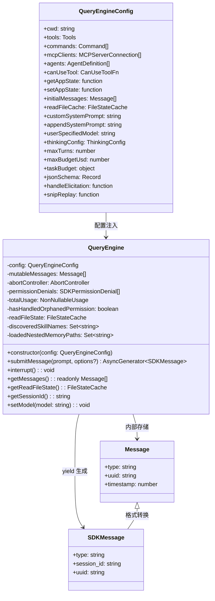

# 第38章 Query Engine - 对话编排器

## 38.1 引言

Query Engine 是 Claude Code 对话系统的核心编排器。它将对话生命周期管理、消息状态跟踪、工具执行协调和 Compaction 触发等功能封装成一个独立的类，为 SDK 模式和 REPL 模式提供统一的对话处理接口。

QueryEngine 的设计目标是：
- **生命周期管理** - 每个 QueryEngine 实例对应一个完整的对话会话
- **状态持久化** - 跨多个 turn 保存消息、使用量和权限状态
- **协议适配** - 将内部消息格式转换为 SDK 消息格式

源码位置：`src/QueryEngine.ts`

## 38.2 核心架构

### 38.2.1 配置类型定义

QueryEngineConfig 定义了引擎的全部配置选项（第130-173行）：

```typescript
export type QueryEngineConfig = {
  cwd: string                                    // 工作目录
  tools: Tools                                   // 工具集合
  commands: Command[]                            // 斜杠命令列表
  mcpClients: MCPServerConnection[]              // MCP 客户端连接
  agents: AgentDefinition[]                      // Agent 定义
  canUseTool: CanUseToolFn                       // 工具权限检查函数
  getAppState: () => AppState                    // App 状态获取器
  setAppState: (f: (prev: AppState) => AppState) => void  // App 状态设置器
  initialMessages?: Message[]                    // 初始消息列表
  readFileCache: FileStateCache                  // 文件读取缓存
  customSystemPrompt?: string                    // 自定义系统提示
  appendSystemPrompt?: string                    // 附加系统提示
  userSpecifiedModel?: string                    // 用户指定模型
  thinkingConfig?: ThinkingConfig                // 思考配置
  maxTurns?: number                              // 最大轮数限制
  maxBudgetUsd?: number                          // 最大预算限制
  jsonSchema?: Record<string, unknown>           // JSON Schema（结构化输出）
  handleElicitation?: ToolUseContext['handleElicitation']  // URL 请求处理
  snipReplay?: (yieldedSystemMsg: Message, store: Message[]) =>
    { messages: Message[]; executed: boolean } | undefined  // 历史剪裁回调
}
```

### 38.2.2 类结构设计



*图 38-1: Query Engine 类结构图*

### 38.2.3 核心成员变量

QueryEngine 类定义了以下关键状态变量（第185-198行）：

```typescript
export class QueryEngine {
  private config: QueryEngineConfig              // 引擎配置
  private mutableMessages: Message[]             // 可变消息存储
  private abortController: AbortController       // 中断控制器
  private permissionDenials: SDKPermissionDenial[]  // 权限拒绝记录
  private totalUsage: NonNullableUsage           // 累计使用量
  private hasHandledOrphanedPermission = false   // 孤儿权限处理标记
  private readFileState: FileStateCache          // 文件读取状态缓存
  private discoveredSkillNames = new Set~string~()   // Turn 内发现的技能
  private loadedNestedMemoryPaths = new Set~string~()  // 已加载的嵌套内存路径
}
```

成员变量职责：

| 成员变量 | 用途 | 生命周期 |
|---------|------|----------|
| `mutableMessages` | 存储对话中所有消息 | 会话级，跨 turn 持久 |
| `permissionDenials` | 记录被拒绝的工具调用 | 会话级，用于 SDK 报告 |
| `totalUsage` | 累计 API 使用量 | 会话级，用于成本追踪 |
| `discoveredSkillNames` | 追踪已发现的技能名 | Turn 级，每轮清空 |
| `readFileState` | 文件内容缓存 | 会话级，避免重复读取 |
| `abortController` | 支持中断执行 | 会话级 |

## 38.3 消息状态管理

### 38.3.1 submitMessage 方法签名

`submitMessage()` 是 QueryEngine 的核心方法，它是一个异步生成器，逐步 yield 处理后的 SDK 消息（第209-212行）：

```typescript
async *submitMessage(
  prompt: string | ContentBlockParam[],
  options?: { uuid?: string; isMeta?: boolean },
): AsyncGenerator<SDKMessage, void, unknown>
```

### 38.3.2 消息处理主循环

消息处理的核心是遍历 `query()` 函数返回的消息流（第675-1049行）：

```typescript
for await (const message of query({
  messages,
  systemPrompt,
  userContext,
  systemContext,
  canUseTool: wrappedCanUseTool,
  toolUseContext: processUserInputContext,
  fallbackModel,
  querySource: 'sdk',
  maxTurns,
  taskBudget,
})) {
  switch (message.type) {
    case 'tombstone':        // 墓碑消息：控制信号，跳过
    case 'assistant':       // 助手消息：记录 stop_reason，推送到 mutableMessages
    case 'progress':        // 进度消息：内联记录以支持去重
    case 'user':            // 用户消息：处理工具结果，turnCount++
    case 'stream_event':    // 流事件：更新使用量统计
    case 'attachment':      // 附件：处理结构化输出、最大轮数信号
    case 'system':          // 系统消息：处理 compaction 边界
    case 'tool_use_summary': // 工具使用摘要
  }
}
```

### 38.3.3 使用量追踪机制

QueryEngine 实现了精细的使用量追踪（第658-669行初始化，第789-816行更新）：

```typescript
// 初始化
let currentMessageUsage: NonNullableUsage = EMPTY_USAGE

// message_start 事件时重置
if (message.event.type === 'message_start') {
  currentMessageUsage = EMPTY_USAGE
  currentMessageUsage = updateUsage(currentMessageUsage, message.event.message.usage)
}

// message_delta 事件时累加
if (message.event.type === 'message_delta') {
  currentMessageUsage = updateUsage(currentMessageUsage, message.event.usage)
  // 捕获 stop_reason
  if (message.event.delta.stop_reason != null) {
    lastStopReason = message.event.delta.stop_reason
  }
}

// message_stop 事件时累积到总量
if (message.event.type === 'message_stop') {
  this.totalUsage = accumulateUsage(this.totalUsage, currentMessageUsage)
}
```

这种分层次追踪确保每条消息使用量独立计算，总使用量准确累加，支持流式增量更新。

### 38.3.4 权限拒绝追踪

QueryEngine 包装 `canUseTool` 函数以追踪权限拒绝（第244-271行）：

```typescript
const wrappedCanUseTool: CanUseToolFn = async (
  tool, input, toolUseContext, assistantMessage, toolUseID, forceDecision
) => {
  const result = await canUseTool(tool, input, toolUseContext, ...)

  if (result.behavior !== 'allow') {
    this.permissionDenials.push({
      tool_name: sdkCompatToolName(tool.name),
      tool_use_id: toolUseID,
      tool_input: input,
    })
  }
  return result
}
```

### 38.3.5 消息持久化策略

QueryEngine 实现分层级的消息持久化（第436-463行）：

```typescript
if (persistSession && messagesFromUserInput.length > 0) {
  const transcriptPromise = recordTranscript(messages)
  if (isBareMode()) {
    void transcriptPromise  // bare 模式：fire-and-forget
  } else {
    await transcriptPromise  // 正常模式：阻塞等待
    if (isEnvTruthy(process.env.CLAUDE_CODE_EAGER_FLUSH) ||
        isEnvTruthy(process.env.CLAUDE_CODE_IS_COWORK)) {
      await flushSessionStorage()
    }
  }
}
```

用户消息在进入 query 循环前立即持久化，确保 `--resume` 可以从用户消息点恢复。

## 38.4 工具执行编排

### 38.4.1 ProcessUserInputContext 构建

QueryEngine 构建完整的工具执行上下文（第335-395行）：

```typescript
let processUserInputContext: ProcessUserInputContext = {
  messages: this.mutableMessages,
  setMessages: fn => {
    this.mutableMessages = fn(this.mutableMessages)
  },
  onChangeAPIKey: () => {},
  handleElicitation: this.config.handleElicitation,
  options: {
    commands,
    debug: false,
    tools,
    verbose,
    mainLoopModel: initialMainLoopModel,
    thinkingConfig: initialThinkingConfig,
    mcpClients,
    mcpResources: {},
    ideInstallationStatus: null,
    isNonInteractiveSession: true,
    customSystemPrompt,
    appendSystemPrompt,
    theme: resolveThemeSetting(getGlobalConfig().theme),
    maxBudgetUsd,
  },
  getAppState,
  setAppState,
  abortController: this.abortController,
  readFileState: this.readFileState,
  nestedMemoryAttachmentTriggers: new Set~string~(),
  loadedNestedMemoryPaths: this.loadedNestedMemoryPaths,
  dynamicSkillDirTriggers: new Set~string~(),
  discoveredSkillNames: this.discoveredSkillNames,
  updateFileHistoryState: (updater) => {
    setAppState(prev => ({ ...prev, fileHistory: updater(prev.fileHistory) }))
  },
  updateAttributionState: (updater) => {
    setAppState(prev => ({ ...prev, attribution: updater(prev.attribution) }))
  },
  setSDKStatus,
}
```

这个上下文对象是工具执行的核心枢纽：
- 绑定消息存储和更新函数
- 提供 App 状态访问器
- 配置工具权限检查
- 支持 MCP 客户端连接

### 38.4.2 系统提示构建

系统提示由 `fetchSystemPromptParts()` 构建（第288-300行）：

```typescript
const {
  defaultSystemPrompt,
  userContext: baseUserContext,
  systemContext,
} = await fetchSystemPromptParts({
  tools,
  mainLoopModel: initialMainLoopModel,
  additionalWorkingDirectories: Array.from(
    initialAppState.toolPermissionContext.additionalWorkingDirectories.keys()
  ),
  mcpClients,
  customSystemPrompt: customPrompt,
})

const systemPrompt = asSystemPrompt([
  ...(customPrompt !== undefined ? [customPrompt] : defaultSystemPrompt),
  ...(memoryMechanicsPrompt ? [memoryMechanicsPrompt] : []),
  ...(appendSystemPrompt ? [appendSystemPrompt] : []),
])
```

### 38.4.3 技能与插件加载

工具执行前加载技能和插件（第529-538行）：

```typescript
const [skills, { enabled: enabledPlugins }] = await Promise.all([
  getSlashCommandToolSkills(getCwd()),
  loadAllPluginsCacheOnly(),  // headless/SDK 使用缓存，不阻塞网络
])

yield buildSystemInitMessage({
  tools,
  mcpClients,
  model: mainLoopModel,
  permissionMode: initialAppState.toolPermissionContext.mode as PermissionMode,
  commands,
  agents,
  skills,
  plugins: enabledPlugins,
  fastMode: initialAppState.fastMode,
})
```

### 38.4.4 流式消息输出

QueryEngine 支持流式输出（第818-826行）：

```typescript
if (includePartialMessages) {
  yield {
    type: 'stream_event' as const,
    event: message.event,
    session_id: getSessionId(),
    parent_tool_use_id: null,
    uuid: randomUUID(),
  }
}
```

允许 SDK 客户端实时接收流式事件，实现打字效果和实时反馈。

### 38.4.5 Compaction 协调

Compact Boundary 处理（第697-715行）：

```typescript
if (
  persistSession &&
  message.type === 'system' &&
  message.subtype === 'compact_boundary'
) {
  const tailUuid = message.compactMetadata?.preservedSegment?.tailUuid
  if (tailUuid) {
    const tailIdx = this.mutableMessages.findLastIndex(m => m.uuid === tailUuid)
    if (tailIdx !== -1) {
      await recordTranscript(this.mutableMessages.slice(0, tailIdx + 1))
    }
  }
}
```

Compact 后释放旧消息（第926-933行）：

```typescript
const mutableBoundaryIdx = this.mutableMessages.length - 1
if (mutableBoundaryIdx > 0) {
  this.mutableMessages.splice(0, mutableBoundaryIdx)  // GC 支持
}
```

### 38.4.6 Snip Replay 机制

通过 feature flag `HISTORY_SNIP` 控制的历史剪裁（第905-915行）：

```typescript
const snipResult = this.config.snipReplay?.(message, this.mutableMessages)
if (snipResult !== undefined) {
  if (snipResult.executed) {
    this.mutableMessages.length = 0
    this.mutableMessages.push(...snipResult.messages)
  }
  break
}
```

防止长 SDK 会话中的内存泄漏。

## 38.5 公共 API 方法

QueryEngine 提供以下公共方法（第1158-1177行）：

| 方法 | 返回类型 | 用途 |
|------|---------|------|
| `submitMessage()` | `AsyncGenerator<SDKMessage>` | 提交消息并流式返回结果 |
| `interrupt()` | `void` | 中断当前执行 |
| `getMessages()` | `readonly Message[]` | 获取当前消息列表（只读） |
| `getReadFileState()` | `FileStateCache` | 获取文件读取缓存 |
| `getSessionId()` | `string` | 获取会话 ID |
| `setModel()` | `void` | 动态设置模型 |

```typescript
interrupt(): void {
  this.abortController.abort()
}

getMessages(): readonly Message[] {
  return this.mutableMessages
}
```

## 38.6 便捷函数：ask()

`ask()` 是 QueryEngine 的便捷封装，用于一次性查询（第1186-1295行）：

```typescript
export async function* ask({
  commands, prompt, cwd, tools, mcpClients, ...
}): AsyncGenerator<SDKMessage, void, unknown> {
  const engine = new QueryEngine({
    cwd, tools, commands, mcpClients, agents, canUseTool, ...
    ...(feature('HISTORY_SNIP') ? {
      snipReplay: (yielded: Message, store: Message[]) => {
        if (!snipProjection!.isSnipBoundaryMessage(yielded)) return undefined
        return snipModule!.snipCompactIfNeeded(store, { force: true })
      },
    } : {}),
  })

  try {
    yield* engine.submitMessage(prompt, { uuid: promptUuid, isMeta })
  } finally {
    setReadFileCache(engine.getReadFileState())  // 保存文件缓存
  }
}
```

## 38.7 小结

QueryEngine 是 Claude Code 对话系统的核心编排器：

1. **状态封装** - 将对话状态（消息、使用量、权限）封装在类实例中
2. **流式处理** - 通过 AsyncGenerator 实现增量消息输出
3. **工具协调** - 构建完整的工具执行上下文，支持 MCP 和插件
4. **Compaction 集成** - 深度集成消息压缩和历史剪裁机制
5. **错误恢复** - 实现多层级的终止条件和错误处理

QueryEngine 使 SDK 模式和 REPL 模式共享相同的对话处理逻辑，同时保持状态隔离和可测试性。它是 Claude Code 架构中承上启下的关键组件。