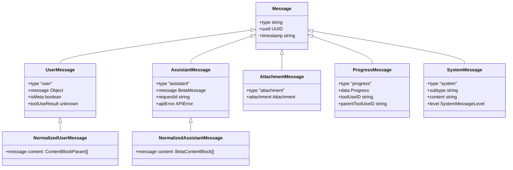

# 第39章：消息处理系统

## 39.1 引言

消息处理系统是 Claude Code 的核心组件，负责管理用户与 AI 之间的对话交互。该系统定义了一套完整的消息类型体系，用于表示对话中的各种信息形式，包括用户输入、助手响应、工具调用、附件消息和系统消息等。

消息处理系统的主要职责包括：

1. **消息创建**：提供工厂函数创建各类消息对象
2. **消息规范化**：将消息转换为适合 API 调用的格式
3. **消息重排序**：调整消息顺序以满足 API 约束
4. **消息合并**：处理连续的同类型消息
5. **消息过滤**：移除无效或不需要的消息

## 39.2 消息类型系统

### 39.2.1 消息类型概览

Claude Code 定义了多种消息类型，每种类型都有特定的用途和数据结构。



*图 39-1：消息类型类图*

### 39.2.2 用户消息 (UserMessage)

用户消息表示来自用户输入的内容。其核心结构定义如下：

```typescript
// src/utils/messages.ts（注：消息处理模块源码为 TypeScript）
const m: UserMessage = {
  type: 'user',
  message: {
    role: 'user',
    content: content || NO_CONTENT_MESSAGE,
  },
  isMeta,
  isVisibleInTranscriptOnly,
  isVirtual,
  isCompactSummary,
  summarizeMetadata,
  uuid: (uuid as UUID | undefined) || randomUUID(),
  timestamp: timestamp ?? new Date().toISOString(),
  toolUseResult,
  mcpMeta,
  imagePasteIds,
  sourceToolAssistantUUID,
  permissionMode,
  origin,
}
```

用户消息的关键字段说明：

| 字段 | 类型 | 说明 |
|------|------|------|
| `type` | string | 固定为 `'user'` |
| `message` | object | 包含 `role` 和 `content` |
| `isMeta` | boolean | 是否为系统生成的元消息 |
| `toolUseResult` | unknown | 工具调用结果（用于 tool_result） |
| `origin` | MessageOrigin | 消息来源（键盘输入、任务通知等） |

### 39.2.3 助手消息 (AssistantMessage)

助手消息表示 AI 的响应内容，包含模型返回的各种内容块：

```typescript
// src/utils/messages.ts
function baseCreateAssistantMessage({
  content,
  isApiErrorMessage = false,
  apiError,
  error,
  errorDetails,
  isVirtual,
  usage,
}): AssistantMessage {
  return {
    type: 'assistant',
    uuid: randomUUID(),
    timestamp: new Date().toISOString(),
    message: {
      id: randomUUID(),
      container: null,
      model: SYNTHETIC_MODEL,
      role: 'assistant',
      stop_reason: 'stop_sequence',
      stop_sequence: '',
      type: 'message',
      usage,
      content,
      context_management: null,
    },
    requestId: undefined,
    apiError,
    error,
    errorDetails,
    isApiErrorMessage,
    isVirtual,
  }
}
```

助手消息包含多个重要字段：

- `content`：内容块数组，可包含文本、工具调用、思考块等
- `usage`：token 使用统计
- `stop_reason`：停止原因（如 `tool_use` 表示需要调用工具）
- `apiError`：API 错误信息（用于错误消息）

### 39.2.4 附件消息 (AttachmentMessage)

附件消息用于承载各种类型的附加信息，如文件内容、记忆、hook 结果等：

```typescript
// src/utils/attachments.ts（注：附件类型定义源码为 TypeScript）
export type Attachment =
  | FileAttachment              // 用户 @-mention 的文件
  | CompactFileReferenceAttachment  // 压缩后的文件引用
  | PDFReferenceAttachment      // PDF 文件引用
  | AlreadyReadFileAttachment   // 已读取的文件
  | { type: 'edited_text_file' ... }  // 编辑过的文件
  | { type: 'directory' ... }   // 目录列表
  | { type: 'todo_reminder' ... }  // Todo 提醒
  | { type: 'task_reminder' ... }   // 任务提醒
  | { type: 'relevant_memories' ... }  // 相关记忆
  | HookAttachment              // Hook 相关附件
  // ... 更多类型
```

附件消息通过 `AttachmentMessage` 类型包装：

```typescript
type AttachmentMessage<T extends Attachment = Attachment> = {
  type: 'attachment'
  attachment: T
  uuid: UUID
  timestamp: string
}
```

### 39.2.5 进度消息 (ProgressMessage)

进度消息用于跟踪工具执行的进度状态：

```typescript
// src/utils/messages.ts
export function createProgressMessage<P extends Progress>({
  toolUseID,
  parentToolUseID,
  data,
}): ProgressMessage<P> {
  return {
    type: 'progress',
    data,
    toolUseID,
    parentToolUseID,
    uuid: randomUUID(),
    timestamp: new Date().toISOString(),
  }
}
```

进度消息主要用于：

- Bash 命令执行进度
- Hook 执行进度
- 子 Agent 进度跟踪

### 39.2.6 系统消息 (SystemMessage)

系统消息用于显示各种系统级别的信息，包含多种子类型：

```typescript
// src/utils/messages.ts
export function createSystemMessage(
  content: string,
  level: SystemMessageLevel,
  toolUseID?: string,
): SystemInformationalMessage {
  return {
    type: 'system',
    subtype: 'informational',
    content,
    isMeta: false,
    timestamp: new Date().toISOString(),
    uuid: randomUUID(),
    toolUseID,
    level,
  }
}
```

系统消息的子类型包括：

| 子类型 | 说明 |
|--------|------|
| `informational` | 一般信息提示 |
| `api_error` | API 错误 |
| `compact_boundary` | 压缩边界标记 |
| `api_metrics` | API 性能指标 |
| `turn_duration` | 转次时长统计 |
| `stop_hook_summary` | Stop Hook 摘要 |
| `permission_retry` | 权限重试提示 |

## 39.3 内容块处理

### 39.3.1 内容块类型

消息的内容字段使用内容块数组来表示复杂的多类型内容：

```typescript
// 来自 @anthropic-ai/sdk
type ContentBlock =
  | TextBlock           // 文本内容
  | ToolUseBlock        // 工具调用
  | ThinkingBlock       // 思考内容
  | RedactedThinkingBlock  // 被遮蔽的思考
  | ServerToolUseBlock  // 服务端工具调用
  | MCPToolUseBlock     // MCP 工具调用
  // ... 其他类型
```

### 39.3.2 文本块处理

文本块是最基本的内容类型：

```typescript
// src/utils/messages.ts
export function extractTextContent(
  blocks: readonly { readonly type: string }[],
  separator = '',
): string {
  return blocks
    .filter((b): b is { type: 'text'; text: string } => b.type === 'text')
    .map(b => b.text)
    .join(separator)
}
```

### 39.3.3 工具调用块处理

工具调用块表示 AI 请求执行工具：

```typescript
// src/utils/messages.ts
type ToolUseRequestMessage = NormalizedAssistantMessage & {
  message: { content: [ToolUseBlock] }
}

export function isToolUseRequestMessage(
  message: Message,
): message is ToolUseRequestMessage {
  return (
    message.type === 'assistant' &&
    message.message.content.some(_ => _.type === 'tool_use')
  )
}
```

### 39.3.4 工具结果块处理

工具结果块是用户消息中承载工具执行结果的特殊内容：

```typescript
// src/utils/messages.ts
type ToolUseResultMessage = NormalizedUserMessage & {
  message: { content: [ToolResultBlockParam] }
}

export function isToolUseResultMessage(
  message: Message,
): message is ToolUseResultMessage {
  return (
    message.type === 'user' &&
    ((Array.isArray(message.message.content) &&
      message.message.content[0]?.type === 'tool_result') ||
      Boolean(message.toolUseResult))
  )
}
```

区分人类输入和工具结果的判断逻辑：

```typescript
// src/utils/messagePredicates.ts
export function isHumanTurn(m: Message): m is UserMessage {
  return m.type === 'user' && !m.isMeta && m.toolUseResult === undefined
}
```

## 39.4 附件消息处理

### 39.4.1 附件消息创建

附件消息通过 `AttachmentMessage` 类型包装各种附件数据。附件类型定义在 `src/utils/attachments.ts` 文件中（注：源码为 TypeScript）。

常见的附件类型包括：

**文件附件**：
```typescript
// src/utils/attachments.ts
export type FileAttachment = {
  type: 'file'
  filename: string
  content: FileReadToolOutput
  truncated?: boolean
  displayPath: string
}
```

**Hook 附件**：
```typescript
// src/utils/attachments.ts
export type HookAttachment =
  | HookCancelledAttachment
  | { type: 'hook_blocking_error' ... }
  | HookNonBlockingErrorAttachment
  | HookSuccessAttachment
  | { type: 'hook_additional_context' ... }
  | HookPermissionDecisionAttachment
```

### 39.4.2 附件消息规范化

附件消息在发送到 API 前需要转换为用户消息：

```typescript
// src/utils/messages.ts
case 'attachment': {
  const rawAttachmentMessage = normalizeAttachmentForAPI(
    message.attachment,
  )
  // 如果最后一条消息也是用户消息，合并它们
  const lastMessage = last(result)
  if (lastMessage?.type === 'user') {
    result[result.length - 1] = attachmentMessage.reduce(
      (p, c) => mergeUserMessagesAndToolResults(p, c),
      lastMessage,
    )
    return
  }
  result.push(...attachmentMessage)
  return
}
```

### 39.4.3 Hook 附件处理

Hook 附件是特殊的附件类型，用于承载 Hook 执行的结果：

```typescript
// src/utils/messages.ts
function isHookAttachmentMessage(
  message: Message,
): message is AttachmentMessage<HookAttachment> {
  return (
    message.type === 'attachment' &&
    (message.attachment.type === 'hook_blocking_error' ||
      message.attachment.type === 'hook_cancelled' ||
      message.attachment.type === 'hook_error_during_execution' ||
      message.attachment.type === 'hook_non_blocking_error' ||
      message.attachment.type === 'hook_success' ||
      message.attachment.type === 'hook_system_message' ||
      message.attachment.type === 'hook_additional_context' ||
      message.attachment.type === 'hook_stopped_continuation')
  )
}
```

## 39.5 进度消息处理

### 39.5.1 进度消息创建

进度消息用于实时显示工具执行状态：

```typescript
// src/utils/messages.ts
export function createProgressMessage<P extends Progress>({
  toolUseID,
  parentToolUseID,
  data,
}): ProgressMessage<P> {
  return {
    type: 'progress',
    data,
    toolUseID,
    parentToolUseID,
    uuid: randomUUID(),
    timestamp: new Date().toISOString(),
  }
}
```

### 39.5.2 进度消息查找

系统提供了预构建的查找表来高效访问进度消息：

```typescript
// src/utils/messages.ts
export type MessageLookups = {
  siblingToolUseIDs: Map<string, Set<string>>
  progressMessagesByToolUseID: Map<string, ProgressMessage[]>
  inProgressHookCounts: Map<string, Map<HookEvent, number>>
  resolvedHookCounts: Map<string, Map<HookEvent, number>>
  toolResultByToolUseID: Map<string, NormalizedMessage>
  toolUseByToolUseID: Map<string, ToolUseBlockParam>
  normalizedMessageCount: number
  resolvedToolUseIDs: Set<string>
  erroredToolUseIDs: Set<string>
}
```

### 39.5.3 Hook 进度跟踪

Hook 进度消息用于跟踪 Hook 的执行状态：

```typescript
// src/utils/messages.ts
function getInProgressHookCount(
  messages: NormalizedMessage[],
  toolUseID: string,
  hookEvent: HookEvent,
): number {
  return count(
    messages,
    _ =>
      _.type === 'progress' &&
      _.data.type === 'hook_progress' &&
      _.data.hookEvent === hookEvent &&
      _.parentToolUseID === toolUseID,
  )
}
```

## 39.6 消息规范化

### 39.6.1 消息拆分

`normalizeMessages` 函数将多内容块的消息拆分为单内容块的消息：

```typescript
// src/utils/messages.ts
export function normalizeMessages(messages: Message[]): NormalizedMessage[] {
  let isNewChain = false
  return messages.flatMap(message => {
    switch (message.type) {
      case 'assistant': {
        isNewChain = isNewChain || message.message.content.length > 1
        return message.message.content.map((_, index) => {
          const uuid = isNewChain
            ? deriveUUID(message.uuid, index)
            : message.uuid
          return {
            type: 'assistant' as const,
            timestamp: message.timestamp,
            message: {
              ...message.message,
              content: [_],
            },
            // ... 其他字段
          } as NormalizedAssistantMessage
        })
      }
      case 'user': {
        // 处理用户消息的拆分
        // ...
      }
    }
  })
}
```

### 39.6.2 API 消息规范化

`normalizeMessagesForAPI` 函数处理消息以符合 API 约束：

```typescript
// src/utils/messages.ts
export function normalizeMessagesForAPI(
  messages: Message[],
  tools: Tools = [],
): (UserMessage | AssistantMessage)[] {
  // 1. 重排序附件消息
  const reorderedMessages = reorderAttachmentsForAPI(messages)
  
  // 2. 处理各类型消息
  //    - 用户消息：合并、过滤 tool_reference
  //    - 助手消息：规范化工具输入
  //    - 附件消息：转换为用户消息
  
  // 3. 后处理步骤
  //    - relocateToolReferenceSiblings
  //    - filterOrphanedThinkingOnlyMessages
  //    - filterTrailingThinkingFromLastAssistant
  //    - filterWhitespaceOnlyAssistantMessages
  
  // 4. 验证图片大小
  validateImagesForAPI(sanitized)
  
  return sanitized
}
```

### 39.6.3 消息合并

连续的用户消息需要合并以符合 API 约束：

```typescript
// src/utils/messages.ts
export function mergeUserMessages(a: UserMessage, b: UserMessage): UserMessage {
  const lastContent = normalizeUserTextContent(a.message.content)
  const currentContent = normalizeUserTextContent(b.message.content)
  return {
    ...a,
    uuid: a.isMeta ? b.uuid : a.uuid,
    message: {
      ...a.message,
      content: hoistToolResults(joinTextAtSeam(lastContent, currentContent)),
    },
  }
}
```

### 39.6.4 tool_result 提升

`hoistToolResults` 函数确保 tool_result 块位于内容数组开头：

```typescript
// src/utils/messages.ts
function hoistToolResults(content: ContentBlockParam[]): ContentBlockParam[] {
  const toolResults: ContentBlockParam[] = []
  const otherBlocks: ContentBlockParam[] = []

  for (const block of content) {
    if (block.type === 'tool_result') {
      toolResults.push(block)
    } else {
      otherBlocks.push(block)
    }
  }

  return [...toolResults, ...otherBlocks]
}
```

## 39.7 消息查找系统

### 39.7.1 查找表构建

`buildMessageLookups` 函数构建高效的查找表：

```typescript
// src/utils/messages.ts
export function buildMessageLookups(
  normalizedMessages: NormalizedMessage[],
  messages: Message[],
): MessageLookups {
  // 第一遍：构建助手消息分组和工具调用 ID 映射
  const toolUseIDsByMessageID = new Map<string, Set<string>>()
  const toolUseIDToMessageID = new Map<string, string>()
  // ...

  // 第二遍：构建进度、hook、工具结果查找
  const progressMessagesByToolUseID = new Map<string, ProgressMessage[]>()
  // ...

  return {
    siblingToolUseIDs,
    progressMessagesByToolUseID,
    inProgressHookCounts,
    resolvedHookCounts,
    toolResultByToolUseID,
    toolUseByToolUseID,
    normalizedMessageCount,
    resolvedToolUseIDs,
    erroredToolUseIDs,
  }
}
```

### 39.7.2 高效查询函数

基于预构建的查找表，系统提供了 O(1) 复杂度的查询函数：

```typescript
// src/utils/messages.ts
export function getSiblingToolUseIDsFromLookup(
  message: NormalizedMessage,
  lookups: MessageLookups,
): ReadonlySet<string> {
  const toolUseID = getToolUseID(message)
  if (!toolUseID) return EMPTY_STRING_SET
  return lookups.siblingToolUseIDs.get(toolUseID) ?? EMPTY_STRING_SET
}

export function getProgressMessagesFromLookup(
  message: NormalizedMessage,
  lookups: MessageLookups,
): ProgressMessage[] {
  const toolUseID = getToolUseID(message)
  if (!toolUseID) return []
  return lookups.progressMessagesByToolUseID.get(toolUseID) ?? []
}
```

## 39.8 系统消息处理

### 39.8.1 系统消息创建

系统消息有多种创建函数对应不同子类型：

**信息性消息**：
```typescript
// src/utils/messages.ts
export function createSystemMessage(
  content: string,
  level: SystemMessageLevel,
  toolUseID?: string,
): SystemInformationalMessage
```

**压缩边界消息**：
```typescript
// src/utils/messages.ts
export function createCompactBoundaryMessage(
  trigger: 'manual' | 'auto',
  preTokens: number,
  lastPreCompactMessageUuid?: UUID,
): SystemCompactBoundaryMessage
```

**API 指标消息**：
```typescript
// src/utils/messages.ts
export function createApiMetricsMessage(metrics: {
  ttftMs: number
  otps: number
  // ...
}): SystemApiMetricsMessage
```

### 39.8.2 压缩边界处理

压缩边界消息标记对话压缩的位置：

```typescript
// src/utils/messages.ts
export function isCompactBoundaryMessage(
  message: Message | NormalizedMessage,
): message is SystemCompactBoundaryMessage {
  return message?.type === 'system' && message.subtype === 'compact_boundary'
}

export function findLastCompactBoundaryIndex<T extends Message | NormalizedMessage>(
  messages: T[],
): number {
  for (let i = messages.length - 1; i >= 0; i--) {
    const message = messages[i]
    if (message && isCompactBoundaryMessage(message)) {
      return i
    }
  }
  return -1
}
```

获取压缩边界后的消息：

```typescript
// src/utils/messages.ts
export function getMessagesAfterCompactBoundary<T extends Message | NormalizedMessage>(
  messages: T[],
  options?: { includeSnipped?: boolean },
): T[] {
  const boundaryIndex = findLastCompactBoundaryIndex(messages)
  const sliced = boundaryIndex === -1 ? messages : messages.slice(boundaryIndex)
  // 可选过滤 snipped 消息
  if (!options?.includeSnipped && feature('HISTORY_SNIP')) {
    return projectSnippedView(sliced as Message[]) as T[]
  }
  return sliced
}
```

## 39.9 流式消息处理

### 39.9.1 流式消息处理函数

`handleMessageFromStream` 函数处理流式响应中的各种事件：

```typescript
// src/utils/messages.ts
export function handleMessageFromStream(
  message: Message | TombstoneMessage | StreamEvent | RequestStartEvent,
  onMessage: (message: Message) => void,
  onUpdateLength: (newContent: string) => void,
  onSetStreamMode: (mode: SpinnerMode) => void,
  onStreamingToolUses: (f: ...) => void,
  onTombstone?: (message: Message) => void,
  onStreamingThinking?: (f: ...) => void,
): void {
  // 处理不同类型的流式事件
  switch (message.event.type) {
    case 'content_block_start':
      // 根据内容块类型设置流模式
      // - thinking/redacted_thinking -> 'thinking'
      // - text -> 'responding'
      // - tool_use -> 'tool-input'
      break
    case 'content_block_delta':
      // 处理增量内容
      // - text_delta -> 更新文本
      // - input_json_delta -> 更新工具输入
      // - thinking_delta -> 更新思考内容
      break
    // ...
  }
}
```

### 39.9.2 流式工具调用跟踪

流式响应中的工具调用需要特殊处理：

```typescript
// src/utils/messages.ts
export type StreamingToolUse = {
  index: number
  contentBlock: BetaToolUseBlock
  unparsedToolInput: string
}
```

## 39.10 合成消息处理

### 39.10.1 合成消息识别

系统定义了一些特殊用途的合成消息：

```typescript
// src/utils/messages.ts
export const INTERRUPT_MESSAGE = '[Request interrupted by user]'
export const INTERRUPT_MESSAGE_FOR_TOOL_USE = '[Request interrupted by user for tool use]'
export const CANCEL_MESSAGE = "The user doesn't want to take this action right now..."
export const REJECT_MESSAGE = "The user doesn't want to proceed with this tool use..."
export const SYNTHETIC_MODEL = '<synthetic>'

export const SYNTHETIC_MESSAGES = new Set([
  INTERRUPT_MESSAGE,
  INTERRUPT_MESSAGE_FOR_TOOL_USE,
  CANCEL_MESSAGE,
  REJECT_MESSAGE,
  NO_RESPONSE_REQUESTED,
])

export function isSyntheticMessage(message: Message): boolean {
  return (
    message.type !== 'progress' &&
    message.type !== 'attachment' &&
    message.type !== 'system' &&
    Array.isArray(message.message.content) &&
    message.message.content[0]?.type === 'text' &&
    SYNTHETIC_MESSAGES.has(message.message.content[0].text)
  )
}
```

### 39.10.2 用户中断消息

创建用户中断消息：

```typescript
// src/utils/messages.ts
export function createUserInterruptionMessage({
  toolUse = false,
}): UserMessage {
  const content = toolUse ? INTERRUPT_MESSAGE_FOR_TOOL_USE : INTERRUPT_MESSAGE

  return createUserMessage({
    content: [{ type: 'text', text: content }],
  })
}
```

## 39.11 消息辅助函数

### 39.11.1 文本提取

从消息中提取文本内容：

```typescript
// src/utils/messages.ts
export function getUserMessageText(
  message: Message | NormalizedMessage,
): string | null {
  if (message.type !== 'user') return null
  const content = message.message.content
  return getContentText(content)
}

export function getContentText(
  content: string | DeepImmutable<Array<ContentBlockParam>>,
): string | null {
  if (typeof content === 'string') return content
  if (Array.isArray(content)) {
    return extractTextContent(content, '\n').trim() || null
  }
  return null
}
```

### 39.11.2 工具调用统计

统计工具调用次数：

```typescript
// src/utils/messages.ts
export function countToolCalls(
  messages: Message[],
  toolName: string,
  maxCount?: number,
): number {
  let count = 0
  for (const msg of messages) {
    if (!msg) continue
    if (msg.type === 'assistant' && Array.isArray(msg.message.content)) {
      const hasToolUse = msg.message.content.some(
        (block): block is ToolUseBlock =>
          block.type === 'tool_use' && block.name === toolName,
      )
      if (hasToolUse) {
        count++
        if (maxCount && count >= maxCount) return count
      }
    }
  }
  return count
}
```

### 39.11.3 UUID 派生

为拆分后的消息生成确定性 UUID：

```typescript
// src/utils/messages.ts
export function deriveUUID(parentUUID: UUID, index: number): UUID {
  const hex = index.toString(16).padStart(12, '0')
  return `${parentUUID.slice(0, 24)}${hex}` as UUID
}
```

## 39.12 总结

消息处理系统是 Claude Code 的核心基础设施，提供了完整的消息生命周期管理：

1. **类型系统**：定义了用户消息、助手消息、附件消息、进度消息和系统消息等多种类型
2. **工厂函数**：提供统一的创建接口，确保消息结构一致性
3. **规范化流程**：处理消息以符合 API 约束，包括拆分、合并、重排序等
4. **查找系统**：构建高效的查找表，支持 O(1) 复杂度的消息关系查询
5. **流式处理**：支持实时处理流式响应中的各类事件
6. **辅助函数**：提供文本提取、工具统计等常用操作

消息处理系统的设计体现了良好的分层架构：底层提供类型定义和基本操作，中间层实现规范化流程，上层提供便捷的查询和辅助函数。这种设计使得系统既保持了灵活性，又确保了 API 兼容性。

---

*本章分析了 Claude Code 消息处理系统的核心实现，涵盖了消息类型定义、内容块处理、附件消息、进度消息和系统消息等方面。相关源文件包括 `src/utils/messages.ts`、`src/utils/attachments.ts` 和 `src/utils/messagePredicates.ts`（注：所有源码均为 TypeScript）。*