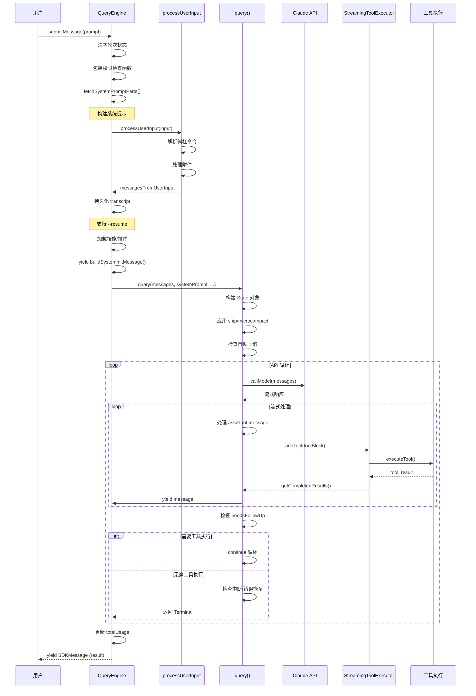

# 第四十章：对话流程

## 40.1 引言：对话生命周期

对话流程是 Claude Code 与用户交互的核心机制。从用户输入消息到 Claude 响应完成，整个过程涉及多个复杂的阶段：

1. **消息接收**：处理用户输入，解析斜杠命令，生成附件消息
2. **上下文管理**：自动压缩历史、管理 token 预算、应用微压缩
3. **API 请求**：构建请求参数，流式处理响应
4. **工具执行**：并发执行工具，收集结果，处理中断
5. **错误恢复**：处理 API 错误、token 限制、模型降级
6. **状态更新**：记录会话历史、更新使用统计、触发钩子

本章深入分析 `QueryEngine.ts` 和 `query.ts` 两个核心文件，揭示对话流程的完整实现机制。

### 40.1.1 核心文件

| 文件 | 路径 | 作用 |
|------|------|------|
| QueryEngine.ts | src/QueryEngine.ts | 对话引擎类，管理会话状态和生命周期 |
| query.ts | src/query.ts | 核心查询循环，处理消息轮次和流式响应 |
| StreamingToolExecutor.ts | src/services/tools/StreamingToolExecutor.ts | 流式工具执行器 |
| processUserInput.ts | src/utils/processUserInput/processUserInput.ts | 用户输入处理 |

---

## 40.2 对话生命周期：从开始到结束

### 40.2.1 QueryEngine 类设计

`QueryEngine` 是对话流程的核心类，负责管理整个对话的生命周期。其设计理念是：**一个 QueryEngine 实例对应一个对话会话，每次 `submitMessage()` 调用开启一个新的轮次**。

```typescript
// QueryEngine.ts:184-207
export class QueryEngine {
  private config: QueryEngineConfig
  private mutableMessages: Message[]
  private abortController: AbortController
  private permissionDenials: SDKPermissionDenial[]
  private totalUsage: NonNullableUsage
  private hasHandledOrphanedPermission = false
  private readFileState: FileStateCache
  private discoveredSkillNames = new Set<string>()
  private loadedNestedMemoryPaths = new Set<string>()

  constructor(config: QueryEngineConfig) {
    this.config = config
    this.mutableMessages = config.initialMessages ?? []
    this.abortController = config.abortController ?? createAbortController()
    this.permissionDenials = []
    this.readFileState = config.readFileCache
    this.totalUsage = EMPTY_USAGE
  }
}
```

核心状态字段说明：

| 字段 | 类型 | 作用 |
|------|------|------|
| mutableMessages | Message[] | 可变消息数组，记录对话历史 |
| abortController | AbortController | 中断控制器，用于取消请求 |
| permissionDenials | SDKPermissionDenial[] | 权限拒绝记录，用于 SDK 报告 |
| totalUsage | NonNullableUsage | 累计 token 使用量 |
| discoveredSkillNames | Set<string> | 当前轮次发现的技能名称 |

### 40.2.2 submitMessage 方法流程

`submitMessage` 是开启新轮次的入口方法，返回一个异步生成器：

```typescript
// QueryEngine.ts:209-238
async *submitMessage(
  prompt: string | ContentBlockParam[],
  options?: { uuid?: string; isMeta?: boolean },
): AsyncGenerator<SDKMessage, void, unknown> {
  const { cwd, commands, tools, mcpClients, ... } = this.config

  this.discoveredSkillNames.clear()  // 清空轮次状态
  setCwd(cwd)
  const persistSession = !isSessionPersistenceDisabled()
  const startTime = Date.now()

  // ... 处理用户输入、构建系统提示、调用 query()
}
```

完整流程包括以下阶段：

1. **权限包装**：包装 `canUseTool` 函数，追踪权限拒绝
2. **系统提示构建**：调用 `fetchSystemPromptParts` 获取系统提示
3. **用户输入处理**：调用 `processUserInput` 解析命令和生成消息
4. **会话持久化**：写入 transcript 以支持恢复
5. **技能/插件加载**：获取斜杠命令技能和已启用插件
6. **query 循环**：进入核心查询循环
7. **消息输出**：通过生成器 yield SDK 消息

### 40.2.3 对话流程序列图

下图展示了完整的对话流程，从用户输入到响应结束：



---

## 40.3 消息轮次管理

### 40.3.1 State 对象设计

`query.ts` 中的 `State` 类型定义了跨轮次的可变状态：

```typescript
// query.ts:204-217
type State = {
  messages: Message[]
  toolUseContext: ToolUseContext
  autoCompactTracking: AutoCompactTrackingState | undefined
  maxOutputTokensRecoveryCount: number
  hasAttemptedReactiveCompact: boolean
  maxOutputTokensOverride: number | undefined
  pendingToolUseSummary: Promise<ToolUseSummaryMessage | null> | undefined
  stopHookActive: boolean | undefined
  turnCount: number
  transition: Continue | undefined
}
```

状态字段说明：

| 字段 | 作用 |
|------|------|
| messages | 当前轮次的消息数组 |
| autoCompactTracking | 自动压缩追踪状态 |
| maxOutputTokensRecoveryCount | 输出 token 限制恢复计数 |
| hasAttemptedReactiveCompact | 是否已尝试响应式压缩 |
| turnCount | 当前轮次计数 |
| transition | 上一次循环的继续原因 |

### 40.3.2 轮次循环结构

核心的 `while(true)` 循环处理每一轮的 API 请求和工具执行：

```typescript
// query.ts:306-321
while (true) {
  let { toolUseContext } = state
  const { messages, autoCompactTracking, turnCount, ... } = state

  // 技能预取
  const pendingSkillPrefetch = skillPrefetch?.startSkillDiscoveryPrefetch(...)

  yield { type: 'stream_request_start' }

  // 初始化 query chain tracking
  const queryTracking = toolUseContext.queryTracking
    ? { chainId: toolUseContext.queryTracking.chainId, depth: toolUseContext.queryTracking.depth + 1 }
    : { chainId: deps.uuid(), depth: 0 }

  // ... 处理压缩、API 请求、工具执行
}
```

循环的退出条件包括：

1. **完成**：`needsFollowUp` 为 false，无工具需要执行
2. **中断**：`abortController.signal.aborted` 为 true
3. **错误**：API 错误无法恢复
4. **限制**：达到 maxTurns 或 maxBudgetUsd

### 40.3.3 Continue 转换机制

当循环需要继续时，通过更新 `state` 对象实现状态传递：

```typescript
// query.ts:1099-1116 (collapse_drain_retry 示例)
if (drained.committed > 0) {
  const next: State = {
    messages: drained.messages,
    toolUseContext,
    autoCompactTracking: tracking,
    maxOutputTokensRecoveryCount,
    hasAttemptedReactiveCompact,
    maxOutputTokensOverride: undefined,
    pendingToolUseSummary: undefined,
    stopHookActive: undefined,
    turnCount,
    transition: {
      reason: 'collapse_drain_retry',
      committed: drained.committed,
    },
  }
  state = next
  continue  // 继续循环
}
```

转换类型定义：

```typescript
// query/transitions.ts (推断)
type Continue =
  | { reason: 'collapse_drain_retry'; committed: number }
  | { reason: 'reactive_compact_retry' }
  | { reason: 'max_output_tokens_recovery'; attempt: number }
  | { reason: 'max_output_tokens_escalate' }
  | { reason: 'stop_hook_blocking'; errors: Message[] }
```

---

## 40.4 流式响应处理

### 40.4.1 StreamingToolExecutor 设计

`StreamingToolExecutor` 实现了工具的并发执行控制：

```typescript
// StreamingToolExecutor.ts:40-62
export class StreamingToolExecutor {
  private tools: TrackedTool[] = []
  private toolUseContext: ToolUseContext
  private hasErrored = false
  private erroredToolDescription = ''
  private siblingAbortController: AbortController
  private discarded = false
  private progressAvailableResolve?: () => void

  constructor(
    private readonly toolDefinitions: Tools,
    private readonly canUseTool: CanUseToolFn,
    toolUseContext: ToolUseContext,
  ) {
    this.toolUseContext = toolUseContext
    this.siblingAbortController = createChildAbortController(toolUseContext.abortController)
  }
}
```

工具状态追踪：

```typescript
// StreamingToolExecutor.ts:19-32
type ToolStatus = 'queued' | 'executing' | 'completed' | 'yielded'

type TrackedTool = {
  id: string
  block: ToolUseBlock
  assistantMessage: AssistantMessage
  status: ToolStatus
  isConcurrencySafe: boolean
  promise?: Promise<void>
  results?: Message[]
  pendingProgress: Message[]
  contextModifiers?: Array<(context: ToolUseContext) => ToolUseContext>
}
```

### 40.4.2 并发控制策略

并发控制的核心规则：

```typescript
// StreamingToolExecutor.ts:129-135
private canExecuteTool(isConcurrencySafe: boolean): boolean {
  const executingTools = this.tools.filter(t => t.status === 'executing')
  return (
    executingTools.length === 0 ||
    (isConcurrencySafe && executingTools.every(t => t.isConcurrencySafe))
  )
}
```

规则解释：

1. **无正在执行的工具**：可以立即执行
2. **并发安全工具**：可以与其他并发安全工具同时执行
3. **非并发安全工具**：必须独占执行，阻塞后续工具

### 40.4.3 流式处理流程

流式处理的核心循环：

```typescript
// query.ts:659-863
for await (const message of deps.callModel({...})) {
  // 处理 fallback 情况
  if (streamingFallbackOccured) {
    for (const msg of assistantMessages) {
      yield { type: 'tombstone', message: msg }  // 移除孤立消息
    }
    // 重置状态
    assistantMessages.length = 0
    toolResults.length = 0
    ...
  }

  // withhold 可恢复错误
  let withheld = false
  if (isWithheldPromptTooLong(message)) { withheld = true }
  if (isWithheldMaxOutputTokens(message)) { withheld = true }
  if (!withheld) { yield yieldMessage }

  // 添加工具到执行队列
  if (message.type === 'assistant') {
    assistantMessages.push(message)
    const msgToolUseBlocks = message.message.content.filter(c => c.type === 'tool_use')
    if (msgToolUseBlocks.length > 0) {
      toolUseBlocks.push(...msgToolUseBlocks)
      needsFollowUp = true
      for (const toolBlock of msgToolUseBlocks) {
        streamingToolExecutor.addTool(toolBlock, message)
      }
    }
  }

  // 获取已完成的工具结果
  for (const result of streamingToolExecutor.getCompletedResults()) {
    if (result.message) {
      yield result.message
      toolResults.push(...)
    }
  }
}
```

### 40.4.4 进度消息处理

进度消息在工具执行过程中实时 yield：

```typescript
// StreamingToolExecutor.ts:366-375
if (update.message) {
  if (update.message.type === 'progress') {
    tool.pendingProgress.push(update.message)
    // 通知等待者有进度可用
    if (this.progressAvailableResolve) {
      this.progressAvailableResolve()
      this.progressAvailableResolve = undefined
    }
  } else {
    messages.push(update.message)
  }
}
```

---

## 40.5 错误恢复机制

### 40.5.1 错误类型分类

Claude Code 处理多种类型的错误：

| 错误类型 | 处理策略 | 恢复机制 |
|---------|---------|---------|
| prompt-too-long (413) | 响应式压缩 | collapse drain -> reactive compact |
| max_output_tokens | 输出限制恢复 | escalate -> multi-turn resume |
| rate_limit | 模型降级 | fallback to alternate model |
| image_size_error | 响应式压缩 | strip oversized media |
| API 连接错误 | 重试策略 | withRetry 自动重试 |

### 40.5.2 Prompt-Too-Long 恢复

当收到 413 错误时，系统会尝试两级恢复：

```typescript
// query.ts:1085-1183
const isWithheld413 =
  lastMessage?.type === 'assistant' &&
  lastMessage.isApiErrorMessage &&
  isPromptTooLongMessage(lastMessage)

if (isWithheld413) {
  // 第一级：collapse drain (低成本，保留粒度上下文)
  if (contextCollapse && state.transition?.reason !== 'collapse_drain_retry') {
    const drained = contextCollapse.recoverFromOverflow(messagesForQuery, querySource)
    if (drained.committed > 0) {
      state = { messages: drained.messages, transition: { reason: 'collapse_drain_retry', ... } }
      continue
    }
  }
}

// 第二级：reactive compact (完整摘要)
if (reactiveCompact) {
  const compacted = await reactiveCompact.tryReactiveCompact({...})
  if (compacted) {
    const postCompactMessages = buildPostCompactMessages(compacted)
    for (const msg of postCompactMessages) { yield msg }
    state = { messages: postCompactMessages, transition: { reason: 'reactive_compact_retry' } }
    continue
  }
}

// 无法恢复，输出错误
yield lastMessage
return { reason: 'prompt_too_long' }
```

### 40.5.3 Max_Output_Tokens 恢复

输出 token 限制恢复使用两级策略：

```typescript
// query.ts:1188-1256
if (isWithheldMaxOutputTokens(lastMessage)) {
  // 第一级：escalate (从 8k 提升到 64k)
  const capEnabled = getFeatureValue_CACHED_MAY_BE_STALE('tengu_otk_slot_v1', false)
  if (capEnabled && maxOutputTokensOverride === undefined) {
    logEvent('tengu_max_tokens_escalate', { escalatedTo: ESCALATED_MAX_TOKENS })
    state = { maxOutputTokensOverride: ESCALATED_MAX_TOKENS, ... }
    continue
  }

  // 第二级：multi-turn recovery (最多 3 次)
  if (maxOutputTokensRecoveryCount < MAX_OUTPUT_TOKENS_RECOVERY_LIMIT) {
    const recoveryMessage = createUserMessage({
      content: 'Output token limit hit. Resume directly...',
      isMeta: true,
    })
    state = {
      messages: [...messagesForQuery, ...assistantMessages, recoveryMessage],
      maxOutputTokensRecoveryCount: maxOutputTokensRecoveryCount + 1,
      transition: { reason: 'max_output_tokens_recovery', attempt: ... },
    }
    continue
  }

  // 恢复失败，输出错误
  yield lastMessage
}
```

### 40.5.4 模型降级处理

当遇到高负载或不可用情况时，系统会自动降级到备用模型：

```typescript
// query.ts:893-950
try {
  // ... API 循环
} catch (innerError) {
  if (innerError instanceof FallbackTriggeredError && fallbackModel) {
    // 切换到备用模型
    currentModel = fallbackModel
    attemptWithFallback = true

    // 清理孤立消息
    yield* yieldMissingToolResultBlocks(assistantMessages, 'Model fallback triggered')
    assistantMessages.length = 0
    toolResults.length = 0

    // 重建工具执行器
    streamingToolExecutor.discard()
    streamingToolExecutor = new StreamingToolExecutor(...)

    // 更新模型配置
    toolUseContext.options.mainLoopModel = fallbackModel

    // 剥离签名块（thinking 签名是模型绑定的）
    if (process.env.USER_TYPE === 'ant') {
      messagesForQuery = stripSignatureBlocks(messagesForQuery)
    }

    // 记录事件
    logEvent('tengu_model_fallback_triggered', {...})

    // 输出警告消息
    yield createSystemMessage(`Switched to ${renderModelName(fallbackModel)} due to high demand...`, 'warning')

    continue
  }
  throw innerError
}
```

### 40.5.5 中断处理

用户中断请求时的处理流程：

```typescript
// query.ts:1011-1052
if (toolUseContext.abortController.signal.aborted) {
  if (streamingToolExecutor) {
    // 消耗剩余结果（生成合成 tool_result）
    for await (const update of streamingToolExecutor.getRemainingResults()) {
      if (update.message) { yield update.message }
    }
  } else {
    // 为所有工具生成中断错误消息
    yield* yieldMissingToolResultBlocks(assistantMessages, 'Interrupted by user')
  }

  // Chicago MCP 清理
  if (feature('CHICAGO_MCP') && !toolUseContext.agentId) {
    await cleanupComputerUseAfterTurn(toolUseContext)
  }

  // 跳过 submit-interrupt 的中断消息
  if (toolUseContext.abortController.signal.reason !== 'interrupt') {
    yield createUserInterruptionMessage({ toolUse: false })
  }

  return { reason: 'aborted_streaming' }
}
```

---

## 40.6 总结

Claude Code 的对话流程是一个精心设计的多层架构：

1. **QueryEngine** 作为会话管理器，负责状态持久化和生命周期控制
2. **query()** 函数作为核心循环，处理消息轮次和状态转换
3. **StreamingToolExecutor** 实现并发工具执行，平衡性能和安全性
4. **错误恢复机制** 提供多层保障，确保对话在各种异常情况下能优雅恢复

关键设计原则：

- **状态分离**：将不可变参数和可变状态分开，便于状态管理
- **流式处理**：使用生成器实现流式响应，支持实时进度显示
- **并发控制**：根据工具特性决定并发策略，避免资源冲突
- **优雅降级**：从低成本恢复到完整恢复的多层策略

这套对话流程架构确保了 Claude Code 在复杂任务场景下的稳定性和可靠性。