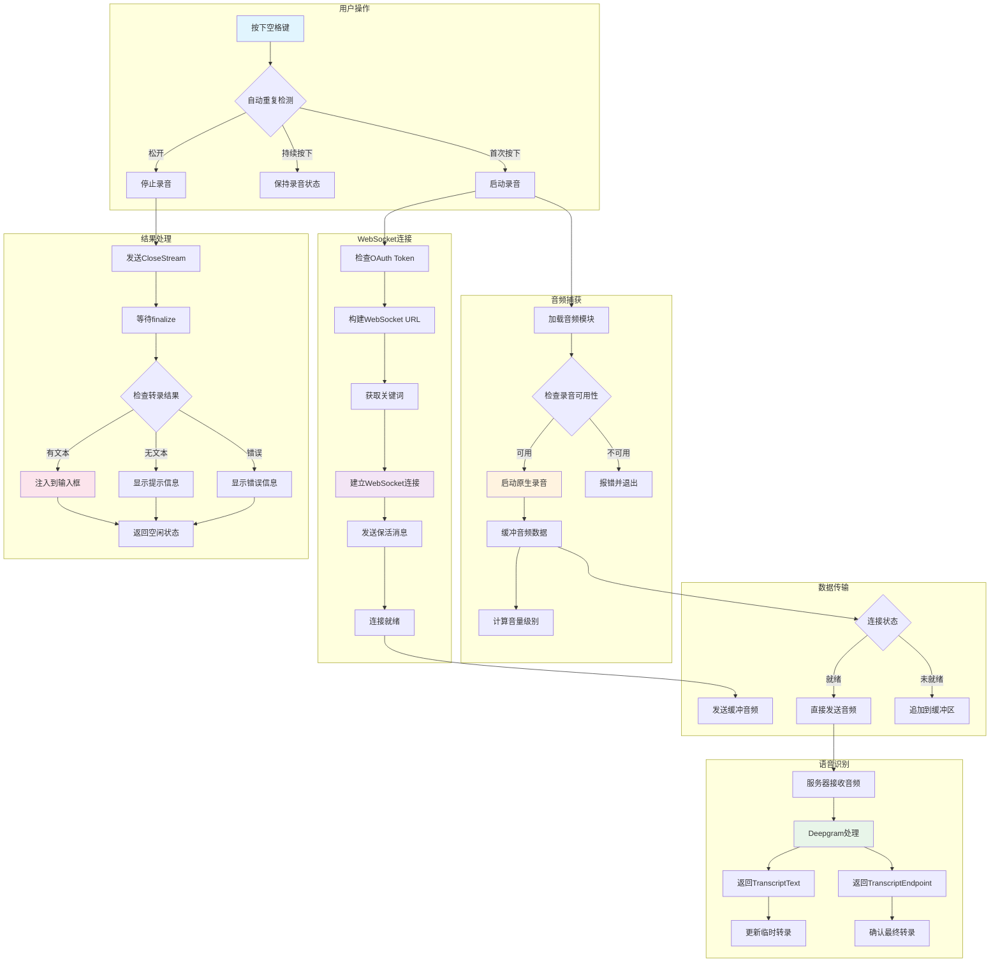

# 第 41 章：语音模式

## 41.1 引言

语音模式是 Claude Code 提供的一项免手交互功能，允许用户通过语音输入来与 Claude 进行对话。这一功能特别适用于以下场景：

- **多任务场景**：用户在浏览代码、查阅文档的同时进行语音输入
- **快速输入**：比打字更快的文本输入方式
- **无障碍支持**：为有行动障碍的用户提供替代输入方式

Claude Code 的语音模式采用"按住说话"（Push-to-Talk）模式：用户按住特定键（默认为空格键）开始录音，松开后停止录音并提交。同时还支持"焦点模式"，当终端获得焦点时自动开始录音，失去焦点时停止。

本章将深入分析语音模式的实现，包括状态管理、语音识别集成、音频捕获机制以及完整的语音交互流程。

## 41.2 语音上下文设计

语音状态管理采用 React Context 与自定义 Store 的组合模式，确保状态变更的高效传递和组件的精确响应。

### 41.2.1 VoiceState 类型定义

**文件：`src/context/voice.tsx`**

```typescript
export type VoiceState = {
  voiceState: 'idle' | 'recording' | 'processing';
  voiceError: string | null;
  voiceInterimTranscript: string;
  voiceAudioLevels: number[];
  voiceWarmingUp: boolean;
};
```

语音状态包含五个核心字段：

| 字段 | 类型 | 说明 |
|------|------|------|
| `voiceState` | 三态枚举 | `idle`（空闲）、`recording`（录音中）、`processing`（处理中） |
| `voiceError` | string/null | 错误信息，无错误时为 null |
| `voiceInterimTranscript` | string | 实时转录的临时文本 |
| `voiceAudioLevels` | number[] | 音频波形可视化数据（16个柱状条） |
| `voiceWarmingUp` | boolean | 预热状态标志（快速按键反馈） |

### 41.2.2 VoiceProvider 实现

**文件：`src/context/voice.tsx`（第 23-42 行）**

```typescript
export function VoiceProvider({ children }: Props): React.ReactNode {
  const [store] = useState(() => createStore(DEFAULT_STATE));
  return (
    <VoiceContext.Provider value={store}>
      {children}
    </VoiceContext.Provider>
  );
}
```

VoiceProvider 采用单例 Store 模式：

1. **Store 创建时机**：通过 `useState` 的惰性初始化函数确保 Store 只创建一次
2. **稳定引用**：Store 作为 Context 值传递，其引用永不改变，避免 Provider 重渲染
3. **订阅式消费**：消费者通过 `useVoiceState` 选择性地订阅状态切片

### 41.2.3 状态访问 Hooks

语音上下文提供三个访问 Hook，满足不同使用场景：

**useVoiceState（第 55-69 行）**：订阅式状态读取

```typescript
export function useVoiceState<T>(selector: (state: VoiceState) => T): T {
  const store = useVoiceStore();
  const get = () => selector(store.getState());
  return useSyncExternalStore(store.subscribe, get, get);
}
```

特点：
- 使用 `useSyncExternalStore` 实现外部 Store 的 React 集成
- 通过 selector 函数实现精确订阅，只在选中值变化时重渲染
- 支持 Object.is 比较，避免无效渲染

**useSetVoiceState（第 76-78 行）**：获取状态更新器

```typescript
export function useSetVoiceState() {
  return useVoiceStore().setState;
}
```

返回 Store 的 `setState` 方法，用于事件处理器中更新状态。

**useGetVoiceState（第 85-87 行）**：同步状态读取

```typescript
export function useGetVoiceState() {
  return useVoiceStore().getState;
}
```

返回 Store 的 `getState` 方法，用于回调中读取当前状态而不触发订阅。

## 41.3 语音转文本集成

语音转文本（STT）功能通过 Anthropic 的 `voice_stream` WebSocket 端点实现，采用 Deepgram 语音识别引擎。

### 41.3.1 WebSocket 连接建立

**文件：`src/services/voiceStreamSTT.ts`（第 111-175 行）**

```typescript
export async function connectVoiceStream(
  callbacks: VoiceStreamCallbacks,
  options?: { language?: string; keyterms?: string[] },
): Promise<VoiceStreamConnection | null> {
  // 确保 OAuth token 有效
  await checkAndRefreshOAuthTokenIfNeeded();

  const tokens = getClaudeAIOAuthTokens();
  if (!tokens?.accessToken) {
    return null;
  }

  // 构建 WebSocket URL
  const wsBaseUrl = process.env.VOICE_STREAM_BASE_URL ||
    getOauthConfig().BASE_API_URL.replace('https://', 'wss://');

  const params = new URLSearchParams({
    encoding: 'linear16',
    sample_rate: '16000',
    channels: '1',
    endpointing_ms: '300',
    utterance_end_ms: '1000',
    language: options?.language ?? 'en',
  });

  // 添加关键词提示
  if (options?.keyterms?.length) {
    for (const term of options.keyterms) {
      params.append('keyterms', term);
    }
  }

  const url = `${wsBaseUrl}${VOICE_STREAM_PATH}?${params.toString()}`;
  // ...
}
```

连接参数说明：

| 参数 | 值 | 说明 |
|------|-----|------|
| `encoding` | `linear16` | 16位线性 PCM 编码 |
| `sample_rate` | `16000` | 16kHz 采样率（语音识别标准） |
| `channels` | `1` | 单声道 |
| `endpointing_ms` | `300` | 语句结束检测阈值（300ms静音） |
| `utterance_end_ms` | `1000` | 话语结束阈值（1000ms） |
| `language` | BCP-47 | 识别语言代码 |

### 41.3.2 语音关键词优化

**文件：`src/services/voiceKeyterms.ts`**

关键词系统用于提升 STT 对编程术语的识别准确率：

```typescript
const GLOBAL_KEYTERMS: readonly string[] = [
  'MCP',
  'symlink',
  'grep',
  'regex',
  'localhost',
  'codebase',
  'TypeScript',
  'JSON',
  'OAuth',
  'webhook',
  'gRPC',
  'dotfiles',
  'subagent',
  'worktree',
];
```

关键词来源（第 63-106 行）：

1. **全局术语**：预定义的编程常用词汇
2. **项目名称**：从项目根目录名提取
3. **Git 分支名**：从当前分支名拆分词汇
4. **最近文件名**：从最近编辑的文件名提取词汇

```typescript
export async function getVoiceKeyterms(
  recentFiles?: ReadonlySet<string>,
): Promise<string[]> {
  const terms = new Set<string>(GLOBAL_KEYTERMS);

  // 项目根目录名
  const projectRoot = getProjectRoot();
  if (projectRoot) {
    const name = basename(projectRoot);
    if (name.length > 2 && name.length <= 50) {
      terms.add(name);
    }
  }

  // Git 分支词汇
  const branch = await getBranch();
  if (branch) {
    for (const word of splitIdentifier(branch)) {
      terms.add(word);
    }
  }

  // 最近文件名词汇
  if (recentFiles) {
    for (const filePath of recentFiles) {
      if (terms.size >= MAX_KEYTERMS) break;
      for (const word of fileNameWords(filePath)) {
        terms.add(word);
      }
    }
  }

  return [...terms].slice(0, MAX_KEYTERMS);
}
```

### 41.3.3 WebSocket 消息协议

**文件：`src/services/voiceStreamSTT.ts`（第 74-95 行）**

服务器消息类型定义：

```typescript
type VoiceStreamTranscriptText = {
  type: 'TranscriptText'
  data: string
}

type VoiceStreamTranscriptEndpoint = {
  type: 'TranscriptEndpoint'
}

type VoiceStreamTranscriptError = {
  type: 'TranscriptError'
  error_code?: string
  description?: string
}
```

客户端发送的控制消息：

```typescript
const KEEPALIVE_MSG = '{"type":"KeepAlive"}'
const CLOSE_STREAM_MSG = '{"type":"CloseStream"}'
```

消息处理流程（第 357-461 行）：

```typescript
ws.on('message', (raw: Buffer | string) => {
  const msg = jsonParse(text) as VoiceStreamMessage;

  switch (msg.type) {
    case 'TranscriptText': {
      // 接收转录文本
      const transcript = msg.data;
      callbacks.onTranscript(transcript, false);
      break;
    }
    case 'TranscriptEndpoint': {
      // 语句结束标记
      callbacks.onTranscript(lastTranscriptText, true);
      if (finalized) {
        resolveFinalize?.('post_closestream_endpoint');
      }
      break;
    }
    case 'TranscriptError': {
      callbacks.onError(msg.description ?? 'unknown transcription error');
      break;
    }
  }
});
```

### 41.3.4 连接保活机制

**文件：`src/services/voiceStreamSTT.ts`（第 322-348 行）**

```typescript
ws.on('open', () => {
  connected = true;

  // 立即发送保活消息
  ws.send(KEEPALIVE_MSG);

  // 定期发送保活（每8秒）
  keepaliveTimer = setInterval(
    ws => {
      if (ws.readyState === WebSocket.OPEN) {
        ws.send(KEEPALIVE_MSG);
      }
    },
    KEEPALIVE_INTERVAL_MS,
    ws,
  );

  callbacks.onReady(connection);
});
```

保活机制确保：
- 连接建立后立即发送保活，防止服务器在音频捕获启动前关闭连接
- 每 8 秒发送一次保活消息，防止空闲超时

## 41.4 语音命令处理

### 41.4.1 /voice 命令实现

**文件：`src/commands/voice/voice.ts`**

`/voice` 命令用于启用或禁用语音模式：

```typescript
export const call: LocalCommandCall = async () => {
  // 权限检查
  if (!isVoiceModeEnabled()) {
    if (!isAnthropicAuthEnabled()) {
      return {
        type: 'text',
        value: 'Voice mode requires a Claude.ai account. Please run /login to sign in.',
      };
    }
    return { type: 'text', value: 'Voice mode is not available.' };
  }

  const currentSettings = getInitialSettings();
  const isCurrentlyEnabled = currentSettings.voiceEnabled === true;

  // 关闭语音模式
  if (isCurrentlyEnabled) {
    updateSettingsForSource('userSettings', { voiceEnabled: false });
    settingsChangeDetector.notifyChange('userSettings');
    logEvent('tengu_voice_toggled', { enabled: false });
    return { type: 'text', value: 'Voice mode disabled.' };
  }

  // 启用前的预检
  const recording = await checkRecordingAvailability();
  if (!recording.available) {
    return { type: 'text', value: recording.reason ?? 'Voice mode is not available.' };
  }

  // 检查录音工具依赖
  const deps = await checkVoiceDependencies();
  if (!deps.available) {
    return { type: 'text', value: `No audio recording tool found.\nInstall: ${deps.installCommand}` };
  }

  // 请求麦克风权限
  if (!(await requestMicrophonePermission())) {
    return { type: 'text', value: 'Microphone access is denied. Enable it in system settings.' };
  }

  // 启用语音模式
  updateSettingsForSource('userSettings', { voiceEnabled: true });
  settingsChangeDetector.notifyChange('userSettings');
  logEvent('tengu_voice_toggled', { enabled: true });

  return { type: 'text', value: `Voice mode enabled. Hold ${key} to record.` };
};
```

### 41.4.2 语音模式启用检查

**文件：`src/voice/voiceModeEnabled.ts`**

语音模式的启用涉及三个层面的检查：

```typescript
// GrowthBook 开关检查
export function isVoiceGrowthBookEnabled(): boolean {
  return feature('VOICE_MODE')
    ? !getFeatureValue_CACHED_MAY_BE_STALE('tengu_amber_quartz_disabled', false)
    : false;
}

// 认证检查
export function hasVoiceAuth(): boolean {
  if (!isAnthropicAuthEnabled()) {
    return false;
  }
  const tokens = getClaudeAIOAuthTokens();
  return Boolean(tokens?.accessToken);
}

// 综合检查
export function isVoiceModeEnabled(): boolean {
  return hasVoiceAuth() && isVoiceGrowthBookEnabled();
}
```

层级说明：
1. **功能标志**：编译时开关，控制代码是否包含语音功能
2. **GrowthBook 开关**：运行时紧急关闭开关
3. **认证检查**：验证用户是否拥有有效的 OAuth token

### 41.4.3 useVoiceEnabled Hook

**文件：`src/hooks/useVoiceEnabled.ts`**

```typescript
export function useVoiceEnabled(): boolean {
  const userIntent = useAppState(s => s.settings.voiceEnabled === true);
  const authVersion = useAppState(s => s.authVersion);

  // 认证状态记忆化
  const authed = useMemo(hasVoiceAuth, [authVersion]);

  return userIntent && authed && isVoiceGrowthBookEnabled();
}
```

这个 Hook 在 React 渲染路径中使用，将认证检查记忆化以避免重复调用。

## 41.5 语音交互流程

### 41.5.1 完整流程图



**图 41-1：语音交互完整流程**

### 41.5.2 按键处理机制

**文件：`src/hooks/useVoice.ts`（第 1022-1127 行）**

按键处理采用"按键间隙检测"策略：

```typescript
const handleKeyEvent = useCallback((fallbackMs = REPEAT_FALLBACK_MS): void => {
  if (!enabled || !isVoiceStreamAvailable()) return;

  // 焦点模式下忽略按键
  if (focusTriggeredRef.current) return;

  const currentState = stateRef.current;

  // 处理中状态忽略按键
  if (currentState === 'processing') return;

  if (currentState === 'idle') {
    // 启动录音
    void startRecordingSession();

    // 设置后备定时器（用户快速按下释放）
    repeatFallbackTimerRef.current = setTimeout(() => {
      if (stateRef.current === 'recording' && !seenRepeatRef.current) {
        seenRepeatRef.current = true;
        // 释放定时器
        releaseTimerRef.current = setTimeout(() => {
          if (stateRef.current === 'recording') {
            finishRecording();
          }
        }, RELEASE_TIMEOUT_MS);
      }
    }, fallbackMs);
  } else if (currentState === 'recording') {
    // 检测到自动重复
    seenRepeatRef.current = true;
    // 重置释放定时器
    if (releaseTimerRef.current) {
      clearTimeout(releaseTimerRef.current);
    }
  }

  // 设置释放定时器（200ms间隙判定释放）
  if (stateRef.current === 'recording' && seenRepeatRef.current) {
    releaseTimerRef.current = setTimeout(() => {
      if (stateRef.current === 'recording') {
        finishRecording();
      }
    }, RELEASE_TIMEOUT_MS);
  }
}, [enabled, focusMode, cleanup]);
```

时间参数说明：

| 常量 | 值 | 说明 |
|------|-----|------|
| `RELEASE_TIMEOUT_MS` | 200ms | 释放检测间隙阈值 |
| `REPEAT_FALLBACK_MS` | 600ms | 自动重复后备超时 |
| `FIRST_PRESS_FALLBACK_MS` | 2000ms | 修饰键组合首次按下后备超时 |

### 41.5.3 音频捕获实现

**文件：`src/services/voice.ts`（第 335-396 行）**

音频捕获支持多种后端：

```typescript
export async function startRecording(
  onData: (chunk: Buffer) => void,
  onEnd: () => void,
  options?: { silenceDetection?: boolean },
): Promise<boolean> {
  // 首选：原生音频模块（cpal）
  const napi = await loadAudioNapi();
  const nativeAvailable =
    napi.isNativeAudioAvailable() &&
    (process.platform !== 'linux' || (await linuxHasAlsaCards()));

  if (nativeAvailable) {
    const started = napi.startNativeRecording(
      (data: Buffer) => { onData(data); },
      () => { if (useSilenceDetection) { onEnd(); } },
    );
    if (started) {
      nativeRecordingActive = true;
      return true;
    }
  }

  // Linux 后备：arecord（ALSA 工具）
  if (process.platform === 'linux' && hasCommand('arecord')) {
    return startArecordRecording(onData, onEnd);
  }

  // 通用后备：SoX rec
  return startSoxRecording(onData, onEnd, options);
}
```

平台支持矩阵：

| 平台 | 原生模块 | 后备方案 |
|------|---------|----------|
| macOS | cpal (CoreAudio) | SoX |
| Linux | cpal (ALSA) | arecord / SoX |
| Windows | cpal (WASAPI) | 无后备 |
| WSL | 无原生 | PulseAudio via arecord |

### 41.5.4 录音会话启动

**文件：`src/hooks/useVoice.ts`（第 633-1011 行）**

录音会话启动流程：

```typescript
async function startRecordingSession(): Promise<void> {
  // 同步状态转换
  updateState('recording');
  recordingStartRef.current = Date.now();

  // 初始化会话引用
  accumulatedRef.current = '';
  seenRepeatRef.current = false;
  hasAudioSignalRef.current = false;
  fullAudioRef.current = [];

  // 预检：录音可用性
  const availability = await voiceModule.checkRecordingAvailability();
  if (!availability.available) {
    onErrorRef.current?.(availability.reason ?? 'Audio recording is not available.');
    cleanup();
    updateState('idle');
    return;
  }

  // 音频缓冲区
  const audioBuffer: Buffer[] = [];

  // 启动录音（立即开始，WebSocket连接并行）
  const started = await voiceModule.startRecording(
    (chunk: Buffer) => {
      // 保存完整音频用于静默重试
      if (!focusTriggeredRef.current) {
        fullAudioRef.current.push(Buffer.from(chunk));
      }

      // 发送音频数据
      if (connectionRef.current) {
        connectionRef.current.send(Buffer.from(chunk));
      } else {
        audioBuffer.push(Buffer.from(chunk));
      }

      // 计算音量级别
      const level = computeLevel(chunk);
      if (!hasAudioSignalRef.current && level > 0.01) {
        hasAudioSignalRef.current = true;
      }
      // 更新波形可视化数据...
    },
    () => { if (stateRef.current === 'recording') finishRecording(); },
    { silenceDetection: false },
  );

  // 获取关键词并连接 WebSocket
  void getVoiceKeyterms().then(keyterms => attemptConnect(keyterms));
}
```

关键设计点：
1. **同步状态转换**：状态更新在 await 之前执行，确保后续同步读取正确
2. **音频缓冲策略**：录音立即开始，WebSocket 连接期间音频被缓冲
3. **并行处理**：音频捕获与 WebSocket 连接并行进行，减少延迟

### 41.5.5 转录结果处理

**文件：`src/hooks/useVoice.ts`（第 783-839 行）**

转录回调处理：

```typescript
onTranscript: (text: string, isFinal: boolean) => {
  if (isStale()) return;
  sawTranscript = true;

  if (isFinal && text.trim()) {
    if (focusTriggeredRef.current) {
      // 焦点模式：立即注入并继续录音
      onTranscriptRef.current(text.trim());
      focusFlushedCharsRef.current += text.trim().length;
      accumulatedRef.current = '';
      armFocusSilenceTimer(); // 重置静默定时器
    } else {
      // 按住说话：累积最终转录
      if (accumulatedRef.current) {
        accumulatedRef.current += ' ';
      }
      accumulatedRef.current += text.trim();
    }
  } else if (!isFinal) {
    // 临时转录：更新实时预览
    const interim = text.trim();
    const preview = accumulatedRef.current
      ? accumulatedRef.current + (interim ? ' ' + interim : '')
      : interim;
    setVoiceState(prev => ({ ...prev, voiceInterimTranscript: preview }));
  }
}
```

### 41.5.6 录音结束处理

**文件：`src/hooks/useVoice.ts`（第 322-521 行）**

```typescript
function finishRecording(): void {
  // 状态转换到处理中
  updateState('processing');

  // 停止录音
  voiceModule?.stopRecording();

  // 捕获会话统计数据
  const recordingDurationMs = Date.now() - recordingStartRef.current;
  const hadAudioSignal = hasAudioSignalRef.current;
  const wsConnected = everConnectedRef.current;

  // 发送 finalize 并等待 WebSocket 关闭
  const finalizePromise = connectionRef.current
    ? connectionRef.current.finalize()
    : Promise.resolve(undefined);

  void finalizePromise
    .then(async finalizeSource => {
      // 静默重试机制（服务器接收音频但返回空转录）
      if (finalizeSource === 'no_data_timeout' && hadAudioSignal && wsConnected && ...) {
        // 在新连接上重试...
      }

      const text = accumulatedRef.current.trim();

      // 记录分析事件
      logEvent('tengu_voice_recording_completed', {
        transcriptChars: text.length + focusFlushedChars,
        recordingDurationMs,
        hadAudioSignal,
        wsConnected,
      });

      // 关闭连接
      if (connectionRef.current) {
        connectionRef.current.close();
        connectionRef.current = null;
      }

      // 处理结果
      if (text) {
        onTranscriptRef.current(text);
      } else if (recordingDurationMs > 2000) {
        // 长录音无转录时显示提示
        if (!wsConnected) {
          onErrorRef.current?.('Voice connection failed. Check your network.');
        } else if (!hadAudioSignal) {
          onErrorRef.current?.('No audio detected from microphone.');
        } else {
          onErrorRef.current?.('No speech detected.');
        }
      }

      updateState('idle');
    });
}
```

### 41.5.7 集成到输入框

**文件：`src/hooks/useVoiceIntegration.tsx`**

语音转录集成到文本输入的核心逻辑：

```typescript
// 实时更新临时转录
useEffect(() => {
  if (voicePrefixRef.current === null) return;

  const prefix = voicePrefixRef.current;
  const suffix = voiceSuffixRef.current;

  // 构建新输入值
  const needsSpace = prefix.length > 0 && !/\s$/.test(prefix) && voiceInterimTranscript.length > 0;
  const needsTrailingSpace = suffix.length > 0 && !/^\s/.test(suffix);
  const leadingSpace = needsSpace ? ' ' : '';
  const trailingSpace = needsTrailingSpace ? ' ' : '';

  const newValue = prefix + leadingSpace + voiceInterimTranscript + trailingSpace + suffix;
  const cursorPos = prefix.length + leadingSpace.length + voiceInterimTranscript.length;

  insertTextRef.current?.setInputWithCursor(newValue, cursorPos);
}, [voiceInterimTranscript]);

// 最终转录注入
const handleVoiceTranscript = useCallback((text: string) => {
  const prefix = voicePrefixRef.current;
  if (prefix === null) return;
  const suffix = voiceSuffixRef.current;

  const needsSpace = prefix.length > 0 && !/\s$/.test(prefix) && text.length > 0;
  const needsTrailingSpace = suffix.length > 0 && !/^\s/.test(suffix) && text.length > 0;

  const newInput = prefix + (needsSpace ? ' ' : '') + text + (needsTrailingSpace ? ' ' : '') + suffix;
  const cursorPos = prefix.length + (needsSpace ? 1 : 0) + text.length;

  insertTextRef.current?.setInputWithCursor(newInput, cursorPos);
}, []);
```

输入结构：`[prefix] [leadingSpace] [transcript] [trailingSpace] [suffix]`

- **prefix**：语音激活时光标前的用户文本
- **suffix**：语音激活时光标后的用户文本
- **leadingSpace/trailingSpace**：自动添加的分隔空格

## 41.6 语言支持

### 41.6.1 语言代码映射

**文件：`src/hooks/useVoice.ts`（第 42-114 行）**

```typescript
const LANGUAGE_NAME_TO_CODE: Record<string, string> = {
  english: 'en',
  spanish: 'es',
  español: 'es',
  french: 'fr',
  français: 'fr',
  japanese: 'ja',
  日本語: 'ja',
  german: 'de',
  deutsch: 'de',
  portuguese: 'pt',
  português: 'pt',
  italian: 'it',
  italiano: 'it',
  korean: 'ko',
  한국어: 'ko',
  hindi: 'hi',
  हिन्दी: 'hi',
  // ... 更多语言
};

const SUPPORTED_LANGUAGE_CODES = new Set([
  'en', 'es', 'fr', 'ja', 'de', 'pt', 'it', 'ko',
  'hi', 'id', 'ru', 'pl', 'tr', 'nl', 'uk', 'el',
  'cs', 'da', 'sv', 'no',
]);
```

### 41.6.2 语言规范化函数

```typescript
export function normalizeLanguageForSTT(language: string | undefined): {
  code: string
  fellBackFrom?: string
} {
  if (!language) return { code: DEFAULT_STT_LANGUAGE };

  const lower = language.toLowerCase().trim();
  if (SUPPORTED_LANGUAGE_CODES.has(lower)) return { code: lower };

  const fromName = LANGUAGE_NAME_TO_CODE[lower];
  if (fromName) return { code: fromName };

  const base = lower.split('-')[0];
  if (base && SUPPORTED_LANGUAGE_CODES.has(base)) return { code: base };

  return { code: DEFAULT_STT_LANGUAGE, fellBackFrom: language };
}
```

规范化逻辑：
1. 空值返回默认语言（英语）
2. 直接匹配支持的语言代码
3. 匹配语言名称（英文或本地名称）
4. 提取 BCP-47 基础标签（如 `zh-CN` → `zh`）
5. 不支持的语言回退到英语并标记

## 41.7 错误处理与重试机制

### 41.7.1 连接错误重试

**文件：`src/hooks/useVoice.ts`（第 841-903 行）**

```typescript
onError: (error: string, opts?: { fatal?: boolean }) => {
  // 早期失败重试（连接建立后无转录时）
  if (!opts?.fatal && !sawTranscript && stateRef.current === 'recording') {
    if (!retryUsedRef.current) {
      retryUsedRef.current = true;
      connectionRef.current = null;
      attemptGenRef.current++;
      setTimeout(() => {
        if (stateRef.current === 'recording') {
          attemptConnect(keyterms);
        }
      }, 250);
      return;
    }
  }

  // 显示错误
  onErrorRef.current?.(`Voice stream error: ${error}`);
  cleanup();
  updateState('idle');
}
```

重试条件：
- 非致命错误（非 4xx HTTP 状态）
- 未收到任何转录
- 当前仍在录音状态
- 未已使用重试机会

### 41.7.2 静默丢弃重试

当服务器接收音频但返回空转录时（约 1% 的会话），系统会自动重试：

```typescript
if (
  finalizeSource === 'no_data_timeout' &&
  hadAudioSignal &&
  wsConnected &&
  !focusTriggered &&
  accumulatedRef.current.trim() === '' &&
  !silentDropRetriedRef.current &&
  fullAudioRef.current.length > 0
) {
  silentDropRetriedRef.current = true;

  // 在新连接上重放音频
  await sleep(250);
  await connectVoiceStream({ ... }, { language: stt.code, keyterms });
  // 发送完整音频缓冲...
}
```

## 41.8 小结

Claude Code 的语音模式实现展现了一个完整、健壮的实时语音交互系统：

**架构设计**：
- 采用 React Context + External Store 模式管理状态
- WebSocket 实现双向通信，支持实时转录
- 多后端音频捕获确保跨平台兼容性

**用户体验**：
- 按住说话模式提供直观的交互方式
- 实时波形可视化和临时转录预览
- 智能的按键释放检测算法

**健壮性设计**：
- 多层次的可用性检查和权限验证
- 连接失败和静默丢弃的重试机制
- 完善的错误分类和用户提示

**性能优化**：
- 音频捕获与 WebSocket 连接并行
- 音频数据切片发送减少帧开销
- 认证状态记忆化避免重复调用

这一实现为命令行工具的语音交互提供了一个优秀的参考范例。