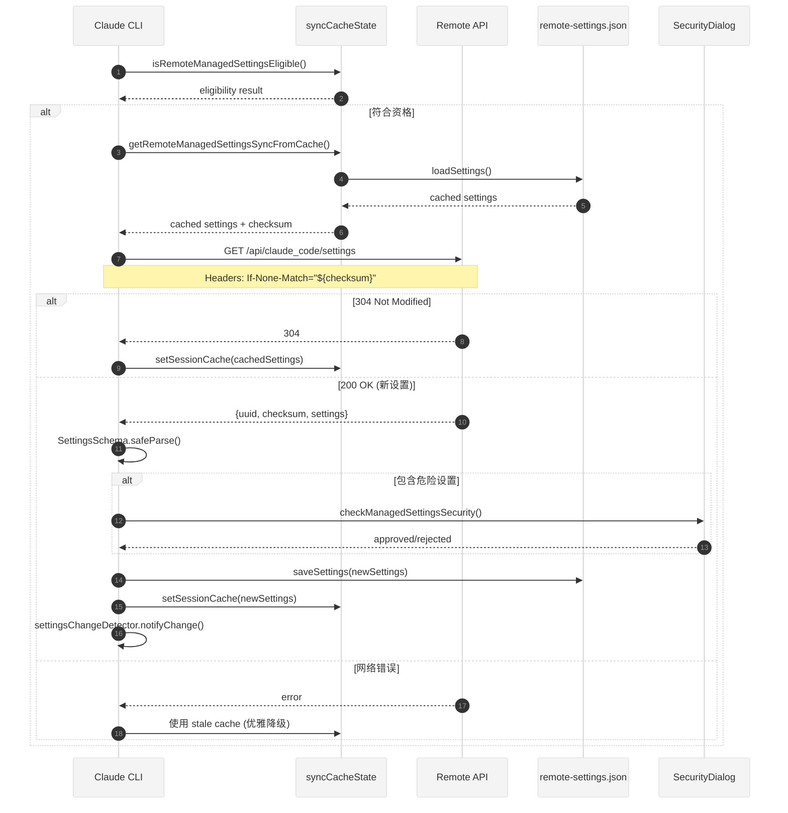

# Chapter 43: 远程设置同步

## 43.1 概述

远程设置同步（Remote Managed Settings）是 Claude Code 为企业用户提供的一项核心功能，允许企业管理员通过远程 API 统一管理和分发配置。该系统实现了设置的中心化管理，支持企业级部署场景下的配置同步和安全管控。

### 核心特性

- **中心化管理**：企业可通过 API 统一推送配置，无需逐台设备手动配置
- **Checksum 校验**：基于 SHA256 的 ETag 缓存机制，减少不必要的网络请求
- **优雅降级**：网络故障时自动使用本地缓存，确保系统可用性
- **安全审计**：危险配置变更时弹出确认对话框，防止恶意配置注入
- **后台轮询**：每小时自动检查更新，支持会话期间的实时同步

### 文件结构

```
src/services/remoteManagedSettings/
├── index.ts           # 主入口，核心同步逻辑
├── syncCache.ts       # 资格检查（依赖 auth）
├── syncCacheState.ts  # 缓存状态管理（无循环依赖）
├── securityCheck.tsx  # 安全检查对话框
├── types.ts           # 类型定义和 Schema
```

## 43.2 远程设置架构

### 43.2.1 类型定义

`types.ts` 定义了远程设置响应的数据结构：

```typescript
// types.ts:10-20
export const RemoteManagedSettingsResponseSchema = lazySchema(() =>
  z.object({
    uuid: z.string(),         // 设置 UUID
    checksum: z.string(),     // SHA256 校验值
    settings: z.record(z.string(), z.unknown()) as z.ZodType<SettingsJson>,
  }),
)

export type RemoteManagedSettingsFetchResult = {
  success: boolean
  settings?: SettingsJson | null   // null 表示 304 未修改
  checksum?: string
  error?: string
  skipRetry?: boolean              // 认证错误时不重试
}
```

**设计要点**：
- 使用 `lazySchema` 延迟加载避免循环依赖
- `settings` 使用宽松的 `z.record()` 而非完整 `SettingsSchema`，完整验证在 `index.ts` 中进行
- `FetchResult` 包含 `skipRetry` 标志，用于区分可重试错误（网络超时）和不可重试错误（认证失败）

### 43.2.2 缓存状态分离

系统将缓存状态拆分为两个模块以打破循环依赖：

**syncCacheState.ts**（叶子模块，无 auth 导入）：
```typescript
// syncCacheState.ts:34-35
let sessionCache: SettingsJson | null = null
let eligible: boolean | undefined   // 三态：undefined/false/true

// syncCacheState.ts:70-96
export function getRemoteManagedSettingsSyncFromCache(): SettingsJson | null {
  if (eligible !== true) return null        // 未确定或不符合资格
  if (sessionCache) return sessionCache     // 已缓存
  const cachedSettings = loadSettings()     // 从文件加载
  if (cachedSettings) {
    sessionCache = cachedSettings
    resetSettingsCache()                    // 刷新合并缓存
    return cachedSettings
  }
  return null
}
```

**syncCache.ts**（资格检查模块，依赖 auth）：
```typescript
// syncCache.ts:49-111
export function isRemoteManagedSettingsEligible(): boolean {
  if (cached !== undefined) return cached

  // 第三方 Provider 用户不适用
  if (getAPIProvider() !== 'firstParty') {
    return (cached = setEligibility(false))
  }

  // 自定义 Base URL 用户不适用
  if (!isFirstPartyAnthropicBaseUrl()) {
    return (cached = setEligibility(false))
  }

  // Cowork 环境不适用
  if (process.env.CLAUDE_CODE_ENTRYPOINT === 'local-agent') {
    return (cached = setEligibility(false))
  }

  // OAuth 用户检查订阅类型
  const tokens = getClaudeAIOAuthTokens()
  if (tokens?.accessToken && tokens.subscriptionType === null) {
    // 外部注入的 Token（无 metadata），允许 API 决定
    return (cached = setEligibility(true))
  }
  if (tokens?.accessToken &&
      (tokens.subscriptionType === 'enterprise' || tokens.subscriptionType === 'team')) {
    return (cached = setEligibility(true))
  }

  // Console 用户（API Key）
  const { key: apiKey } = getAnthropicApiKeyWithSource({
    skipRetrievingKeyFromApiKeyHelper: true,  // 避免循环依赖
  })
  if (apiKey) {
    return (cached = setEligibility(true))
  }

  return (cached = setEligibility(false))
}
```

**资格判定规则**：
| 用户类型 | 订阅类型 | 资格 |
|---------|---------|-----|
| Console（API Key） | 任意 | 符合 |
| OAuth | Enterprise/Team | 符合 |
| OAuth | subscriptionType=null | 符合（API 决定） |
| OAuth | 其他订阅 | 不符合 |
| 第三方 Provider | 任意 | 不符合 |
| 自定义 Base URL | 任意 | 不符合 |

## 43.3 远程同步机制

### 43.3.1 同步流程



**Figure 43-1: 远程设置同步流程时序图**

### 43.3.2 Checksum 计算

Checksum 用于 HTTP ETag 缓存，必须与服务端 Python 实现兼容：

```typescript
// index.ts:112-137
function sortKeysDeep(obj: unknown): unknown {
  if (Array.isArray(obj)) {
    return obj.map(sortKeysDeep)
  }
  if (obj !== null && typeof obj === 'object') {
    const sorted: Record<string, unknown> = {}
    for (const key of Object.keys(obj).sort()) {
      sorted[key] = sortKeysDeep((obj as Record<string, unknown>)[key])
    }
    return sorted
  }
  return obj
}

export function computeChecksumFromSettings(settings: SettingsJson): string {
  const sorted = sortKeysDeep(settings)
  // Python: json.dumps(..., separators=(",", ":")) — 无空格
  const normalized = jsonStringify(sorted)
  const hash = createHash('sha256').update(normalized).digest('hex')
  return `sha256:${hash}`
}
```

**关键点**：
- 递归排序所有键，匹配 Python 的 `sort_keys=True`
- 使用紧凑 JSON 格式（无空格），匹配 Python 的 `separators=(",", ":")`
- SHA256 哈希前缀 `sha256:` 用于标识算法版本

### 43.3.3 网络请求与重试

```typescript
// index.ts:209-242
async function fetchWithRetry(cachedChecksum?: string): Promise<RemoteManagedSettingsFetchResult> {
  let lastResult: RemoteManagedSettingsFetchResult | null = null

  for (let attempt = 1; attempt <= DEFAULT_MAX_RETRIES + 1; attempt++) {
    lastResult = await fetchRemoteManagedSettings(cachedChecksum)

    if (lastResult.success) return lastResult
    if (lastResult.skipRetry) return lastResult  // 认证错误不重试
    if (attempt > DEFAULT_MAX_RETRIES) return lastResult

    const delayMs = getRetryDelay(attempt)  // 指数退避
    await sleep(delayMs)
  }

  return lastResult!
}
```

**重试策略**：
- 最大重试次数：5 次
- 使用指数退避算法计算延迟
- 认证错误（401/403）立即返回，不重试
- 超时和网络错误触发重试

### 43.3.4 响应处理

```typescript
// index.ts:248-361
async function fetchRemoteManagedSettings(cachedChecksum?: string): Promise<RemoteManagedSettingsFetchResult> {
  // 刷新 OAuth Token 防止 401
  await checkAndRefreshOAuthTokenIfNeeded()

  const headers: Record<string, string> = {
    ...authHeaders.headers,
    'User-Agent': getClaudeCodeUserAgent(),
  }

  // ETag 缓存
  if (cachedChecksum) {
    headers['If-None-Match'] = `"${cachedChecksum}"`
  }

  const response = await axios.get(endpoint, {
    headers,
    timeout: SETTINGS_TIMEOUT_MS,  // 10 秒超时
    validateStatus: status =>
      status === 200 || status === 204 || status === 304 || status === 404,
  })

  // 304: 缓存有效
  if (response.status === 304) {
    return { success: true, settings: null, checksum: cachedChecksum }
  }

  // 204/404: 无远程设置
  if (response.status === 204 || response.status === 404) {
    return { success: true, settings: {}, checksum: undefined }
  }

  // Schema 验证
  const parsed = RemoteManagedSettingsResponseSchema().safeParse(response.data)
  // ...完整 SettingsSchema 验证
}
```

**HTTP 状态码处理**：
| 状态码 | 含义 | 处理 |
|-------|------|-----|
| 200 | 新设置返回 | 解析并应用 |
| 304 | 缓存未修改 | 使用本地缓存 |
| 204 | 无内容 | 返回空设置 `{}` |
| 404 | 未配置 | 返回空设置 `{}` |
| 401/403 | 认证失败 | 不重试 |
| 超时/网络错误 | 临时故障 | 重试 |

### 43.3.5 文件缓存

```typescript
// index.ts:367-386
async function saveSettings(settings: SettingsJson): Promise<void> {
  const path = getSettingsPath()  // ~/.claude/remote-settings.json
  const handle = await open(path, 'w', 0o600)  // 仅用户可读写
  try {
    await handle.writeFile(jsonStringify(settings, null, 2), { encoding: 'utf-8' })
    await handle.datasync()  // 强制写入磁盘
  } finally {
    await handle.close()
  }
}
```

**安全措施**：
- 文件权限 `0o600`：仅当前用户可读写
- 使用 `datasync()` 确保数据写入磁盘后才返回

### 43.3.6 后台轮询

```typescript
// index.ts:612-628
export function startBackgroundPolling(): void {
  if (pollingIntervalId !== null) return
  if (!isRemoteManagedSettingsEligible()) return

  pollingIntervalId = setInterval(() => {
    void pollRemoteSettings()
  }, POLLING_INTERVAL_MS)  // 1 小时
  pollingIntervalId.unref()  // 不阻止进程退出

  registerCleanup(async () => stopBackgroundPolling())
}

// index.ts:584-606
async function pollRemoteSettings(): Promise<void> {
  const prevCache = getRemoteManagedSettingsSyncFromCache()
  const previousSettings = prevCache ? jsonStringify(prevCache) : null

  await fetchAndLoadRemoteManagedSettings()

  const newCache = getRemoteManagedSettingsSyncFromCache()
  const newSettings = newCache ? jsonStringify(newCache) : null

  // 仅在设置实际变更时触发通知
  if (newSettings !== previousSettings) {
    settingsChangeDetector.notifyChange('policySettings')
  }
}
```

**轮询策略**：
- 间隔：每小时检查一次
- 使用 `unref()` 防止定时器阻止进程退出
- 仅在内容变更时触发通知，避免无效刷新

## 43.4 企业部署支持

### 43.4.1 安全检查机制

当远程设置包含危险配置时，系统会弹出确认对话框：

```typescript
// securityCheck.tsx:22-61
export async function checkManagedSettingsSecurity(
  cachedSettings: SettingsJson | null,
  newSettings: SettingsJson | null
): Promise<SecurityCheckResult> {
  // 无危险设置 → 无需检查
  if (!newSettings || !hasDangerousSettings(extractDangerousSettings(newSettings))) {
    return 'no_check_needed'
  }

  // 危险设置未变更 → 无需检查
  if (!hasDangerousSettingsChanged(cachedSettings, newSettings)) {
    return 'no_check_needed'
  }

  // 非交互模式 → 自动通过
  if (!getIsInteractive()) {
    return 'no_check_needed'
  }

  // 显示阻塞对话框
  return new Promise<SecurityCheckResult>(resolve => {
    render(<ManagedSettingsSecurityDialog
      settings={newSettings}
      onAccept={() => resolve('approved')}
      onReject={() => resolve('rejected')}
    />, ...)
  })
}
```

### 43.4.2 危险设置定义

```typescript
// utils.ts:24-70
export function extractDangerousSettings(settings: SettingsJson | null): DangerousSettings {
  // 危险 Shell 设置
  const shellSettings: Partial<Record<DangerousShellSetting, string>> = {}
  for (const key of DANGEROUS_SHELL_SETTINGS) {
    if (settings[key]) shellSettings[key] = settings[key]
  }

  // 危险环境变量（非 SAFE_ENV_VARS）
  const envVars: Record<string, string> = {}
  if (settings.env) {
    for (const [key, value] of Object.entries(settings.env)) {
      if (!SAFE_ENV_VARS.has(key.toUpperCase())) {
        envVars[key] = value
      }
    }
  }

  // Hooks
  const hasHooks = settings.hooks && Object.keys(settings.hooks).length > 0

  return { shellSettings, envVars, hasHooks, hooks }
}
```

**危险设置类别**：
| 类别 | 说明 | 示例 |
|-----|------|-----|
| Shell 设置 | 可能执行任意命令的配置 | `apiKeyHelper`, `mcpServers` |
| 环境变量 | 非安全列表的变量 | `API_KEY`, `SECRET_TOKEN` |
| Hooks | 可能注入执行逻辑 | `PreToolUse`, `PostToolUse` |

### 43.4.3 变更对比

```typescript
// utils.ts:87-117
export function hasDangerousSettingsChanged(
  oldSettings: SettingsJson | null,
  newSettings: SettingsJson | null
): boolean {
  const oldDangerous = extractDangerousSettings(oldSettings)
  const newDangerous = extractDangerousSettings(newSettings)

  // 新设置无危险 → 无需提示
  if (!hasDangerousSettings(newDangerous)) return false

  // 旧设置无危险但新设置有 → 需要提示
  if (!hasDangerousSettings(oldDangerous)) return true

  // JSON 比对
  const oldJson = jsonStringify({
    shellSettings: oldDangerous.shellSettings,
    envVars: oldDangerous.envVars,
    hooks: oldDangerous.hooks,
  })
  const newJson = jsonStringify({
    shellSettings: newDangerous.shellSettings,
    envVars: newDangerous.envVars,
    hooks: newDangerous.hooks,
  })

  return oldJson !== newJson
}
```

## 43.5 设置变更检测

### 43.5.1 变更检测器架构

`changeDetector.ts` 提供统一的设置变更通知机制：

```typescript
// changeDetector.ts:482-488
export const settingsChangeDetector = {
  initialize,    // 启动文件监听
  dispose,       // 清理资源
  subscribe,     // 订阅变更
  notifyChange,  // 程序化通知
  resetForTesting,
}
```

### 43.5.2 文件监听

```typescript
// changeDetector.ts:103-146
watcher = chokidar.watch(dirs, {
  persistent: true,
  ignoreInitial: true,
  depth: 0,  // 仅监听直接子文件
  awaitWriteFinish: {
    stabilityThreshold: FILE_STABILITY_THRESHOLD_MS,  // 1 秒
    pollInterval: FILE_STABILITY_POLL_INTERVAL_MS,    // 500ms
  },
  ignored: (path, stats) => {
    // 排除特殊文件类型
    if (stats && !stats.isFile() && !stats.isDirectory()) return true
    // 排除 .git 目录
    if (path.split(platformPath.sep).some(dir => dir === '.git')) return true
    // 仅监听已知设置文件
    if (!settingsFiles.has(normalized)) return true
    return false
  },
})

watcher.on('change', handleChange)
watcher.on('unlink', handleDelete)
watcher.on('add', handleAdd)
```

**稳定性保障**：
- `awaitWriteFinish` 等待写入完成后再处理
- 避免处理部分写入或快速连续变更

### 43.5.3 删除处理与优雅期

```typescript
// changeDetector.ts:330-360
function handleDelete(path: string): void {
  const source = getSourceForPath(path)
  if (!source) return

  // 设置优雅期定时器
  const timer = setTimeout((p, src) => {
    pendingDeletions.delete(p)
    // 执行 ConfigChange Hook
    void executeConfigChangeHooks(settingSourceToConfigChangeSource(src), p)
      .then(results => {
        if (hasBlockingResult(results)) return
        fanOut(src)
      })
  }, DELETION_GRACE_MS)  // 1.7 秒

  pendingDeletions.set(path, timer)
}
```

**优雅期机制**：
- 文件删除后等待 1.7 秒再处理
- 如果文件在优雅期内重建（`add`/`change` 事件），取消删除处理
- 处理自动更新和另一会话启动时的删除-重建模式

### 43.5.4 内部写入标记

```typescript
// changeDetector.ts:284-286
if (consumeInternalWrite(path, INTERNAL_WRITE_WINDOW_MS)) {
  return  // Claude Code 自身写入，忽略
}
```

**内部写入窗口**：
- 5 秒窗口期内由 `markInternalWrite()` 标记的写入被视为内部写入
- 避免处理 Claude Code 自身保存设置触发的变更事件

### 43.5.5 MDM 设置轮询

```typescript
// changeDetector.ts:381-418
function startMdmPoll(): void {
  // 捕获初始快照
  const initial = getMdmSettings()
  const initialHkcu = getHkcuSettings()
  lastMdmSnapshot = jsonStringify({ mdm: initial.settings, hkcu: initialHkcu.settings })

  mdmPollTimer = setInterval(async () => {
    const { mdm: current, hkcu: currentHkcu } = await refreshMdmSettings()
    const currentSnapshot = jsonStringify({ mdm: current.settings, hkcu: currentHkcu.settings })

    if (currentSnapshot !== lastMdmSnapshot) {
      lastMdmSnapshot = currentSnapshot
      setMdmSettingsCache(current, currentHkcu)
      fanOut('policySettings')
    }
  }, MDM_POLL_INTERVAL_MS)  // 30 分钟
}
```

**MDM 特殊处理**：
- 注册表/plist 无法通过文件系统事件监听
- 每 30 分钟轮询一次，比对快照检测变更

### 43.5.6 通知分发

```typescript
// changeDetector.ts:437-450
function fanOut(source: SettingSource): void {
  resetSettingsCache()        // 先清除缓存
  settingsChanged.emit(source) // 再通知所有监听者
}

export function notifyChange(source: SettingSource): void {
  logForDebugging(`Programmatic settings change notification for ${source}`)
  fanOut(source)
}
```

**单生产者设计**：
- 缓存清除必须在通知前（单一位置）
- 避免 N 个监听者各自清除导致 N 次磁盘重载

## 43.6 总结

远程设置同步系统通过精心设计的模块化架构实现了企业级配置管理：

1. **循环依赖打破**：`syncCacheState.ts` 作为叶子模块独立存储缓存状态，`syncCache.ts` 专注资格检查
2. **Checksum 校验**：SHA256 ETag 缓存机制减少 80%+ 的网络请求
3. **优雅降级**：网络故障时自动使用本地缓存，保障系统可用性
4. **安全审计**：危险配置变更强制用户确认，防止恶意注入
5. **实时同步**：文件监听 + 后台轮询双轨机制，支持会话期间实时更新

该系统为企业管理员提供了强大的配置分发能力，同时保障了终端用户的安全和体验。