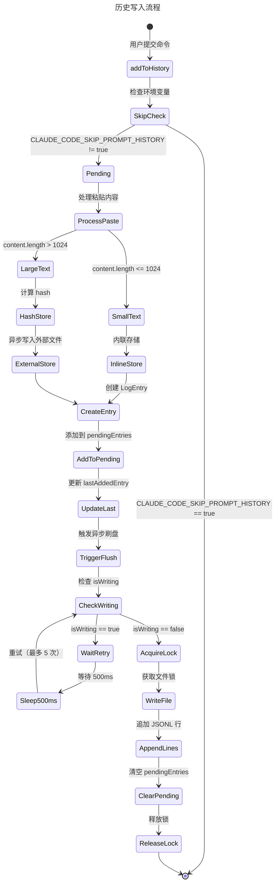

# 第四十四章：历史与回放

> 本章基于 Claude Code 源代码分析，请以最新版本为准。

## 44.1 引言：Session History

命令历史是 CLI 应用的核心用户体验之一。Claude Code 的历史系统不仅支持用户通过上下键快速访问之前的命令，还提供了 Ctrl+R 搜索功能，让用户能够快速定位和复用历史输入。

Claude Code 的历史系统设计具有以下特点：

1. **跨项目共享**：历史记录存储在全局配置目录，所有项目共享同一份历史
2. **项目过滤**：读取历史时按当前项目过滤，避免不同项目的命令混淆
3. **会话优先**：当前会话的命令优先显示，其他会话的命令排在后面
4. **粘贴内容处理**：支持大段粘贴内容的存储和恢复
5. **原子写入**：通过锁文件确保并发写入的安全性

### 44.1.1 核心文件

| 文件 | 路径 | 作用 |
|------|------|------|
| history.ts | src/history.ts | 历史记录管理核心模块 |
| pasteStore.ts | src/utils/pasteStore.ts | 粘贴内容外部存储 |
| fsOperations.ts | src/utils/fsOperations.ts | 文件系统操作工具 |

---

## 44.2 history.ts 核心实现

### 44.2.1 模块状态设计

history.ts 采用模块级状态管理模式：

```typescript
// src/history.ts - 模块状态定义区域
let pendingEntries: LogEntry[] = []
let isWriting = false
let currentFlushPromise: Promise<void> | null = null
let cleanupRegistered = false
let lastAddedEntry: LogEntry | null = null
const skippedTimestamps = new Set<number>()
```

状态字段说明：

| 字段 | 类型 | 作用 |
|------|------|------|
| pendingEntries | LogEntry[] | 待写入磁盘的历史条目缓冲区 |
| isWriting | boolean | 写入锁，防止并发写入 |
| currentFlushPromise | Promise<void> \| null | 当前写入操作的 Promise |
| cleanupRegistered | boolean | 是否已注册清理回调 |
| lastAddedEntry | LogEntry \| null | 最后添加的条目（用于撤销） |
| skippedTimestamps | Set<number> | 需跳过的时间戳集合 |

### 44.2.2 LogEntry 数据结构

历史条目以 JSONL 格式存储，每行一个 LogEntry：

```typescript
// src/history.ts - LogEntry 类型定义区域
type LogEntry = {
  display: string                              // 显示文本
  pastedContents: Record<number, StoredPastedContent>  // 粘贴内容
  timestamp: number                            // 时间戳
  project: string                              // 项目路径
  sessionId?: string                           // 会话 ID
}
```

StoredPastedContent 处理大文本的存储策略：

```typescript
// src/history.ts - StoredPastedContent 类型定义区域
type StoredPastedContent = {
  id: number
  type: 'text' | 'image'
  content?: string        // 小文本内联存储（<= 1024 字符）
  contentHash?: string    // 大文本通过 hash 引用外部存储
  mediaType?: string
  filename?: string
}
```

这种设计使得：
- 小段粘贴文本直接内联在历史记录中，读取快速
- 大段文本通过 hash 引用外部文件，避免历史文件膨胀
- 图片内容不存储在历史中（由 image-cache 单独管理）

### 44.2.3 历史写入流程



### 44.2.4 addToHistory 函数实现

```typescript
// src/history.ts - addToHistory 函数区域
export function addToHistory(command: HistoryEntry | string): void {
  // 跳过 tmux 会话的历史记录
  if (isEnvTruthy(process.env.CLAUDE_CODE_SKIP_PROMPT_HISTORY)) {
    return
  }

  // 注册清理回调（仅首次）
  if (!cleanupRegistered) {
    cleanupRegistered = true
    registerCleanup(async () => {
      if (currentFlushPromise) {
        await currentFlushPromise
      }
      if (pendingEntries.length > 0) {
        await immediateFlushHistory()
      }
    })
  }

  void addToPromptHistory(command)
}
```

关键设计点：

1. **环境变量跳过**：tmux 子会话（如测试验证）不污染用户历史
2. **延迟注册清理**：首次使用时注册，避免不必要的清理开销
3. **Fire-and-Forget**：`void addToPromptHistory()` 不等待写入完成

### 44.2.5 刷盘机制

写入磁盘的核心逻辑：

```typescript
// src/history.ts - immediateFlushHistory 函数区域
async function immediateFlushHistory(): Promise<void> {
  if (pendingEntries.length === 0) {
    return
  }

  let release
  try {
    const historyPath = join(getClaudeConfigHomeDir(), 'history.jsonl')

    // 确保文件存在
    await writeFile(historyPath, '', {
      encoding: 'utf8',
      mode: 0o600,  // 仅用户可读写
      flag: 'a',
    })

    // 获取锁文件（防止并发写入）
    release = await lock(historyPath, {
      stale: 10000,    // 10秒后认为锁过期
      retries: {
        retries: 3,
        minTimeout: 50,
      },
    })

    // 批量写入
    const jsonLines = pendingEntries.map(entry => jsonStringify(entry) + '\n')
    pendingEntries = []

    await appendFile(historyPath, jsonLines.join(''), { mode: 0o600 })
  } catch (error) {
    logForDebugging(`Failed to write prompt history: ${error}`)
  } finally {
    if (release) {
      await release()
    }
  }
}
```

重试机制的实现：

```typescript
// src/history.ts - flushPromptHistory 函数区域
async function flushPromptHistory(retries: number): Promise<void> {
  if (isWriting || pendingEntries.length === 0) {
    return
  }

  // 防止无限重试
  if (retries > 5) {
    return
  }

  isWriting = true

  try {
    await immediateFlushHistory()
  } finally {
    isWriting = false

    // 写入期间有新条目加入，延迟后重试
    if (pendingEntries.length > 0) {
      await sleep(500)
      void flushPromptHistory(retries + 1)
    }
  }
}
```

---

## 44.3 Session 存储

### 44.3.1 存储位置与文件结构

历史记录存储在 Claude 配置目录：

```
~/.claude/
├── history.jsonl           # 全局命令历史
├── paste-store/             # 大文本粘贴内容存储
│   ├── a1b2c3d4...         # 以 hash 命名的文件
│   └── ...
└── ...
```

文件权限设置为 `0o600`，确保只有当前用户可以读写。

### 44.3.2 粘贴内容引用解析

历史记录中的粘贴内容有两种形式：

**引用格式**：
```
[Pasted text #1]           # 单行文本
[Pasted text #2 +10 lines]  # 多行文本（+N 表示换行数）
[Image #3]                  # 图片
[...Truncated text #4.]     # 截断文本
```

**解析函数**：

```typescript
// src/history.ts - parseReferences 函数区域
export function parseReferences(
  input: string,
): Array<{ id: number; match: string; index: number }> {
  const referencePattern =
    /\[(Pasted text|Image|\.\.\.Truncated text) #(\d+)(?: \+\d+ lines)?(\.)*\]/g
  const matches = [...input.matchAll(referencePattern)]
  return matches
    .map(match => ({
      id: parseInt(match[2] || '0'),
      match: match[0],
      index: match.index,
    }))
    .filter(match => match.id > 0)
}
```

**展开粘贴引用**：

```typescript
// src/history.ts - expandPastedTextRefs 函数区域
export function expandPastedTextRefs(
  input: string,
  pastedContents: Record<number, PastedContent>,
): string {
  const refs = parseReferences(input)
  let expanded = input
  // 从后向前替换，保持偏移量有效
  for (let i = refs.length - 1; i >= 0; i--) {
    const ref = refs[i]!
    const content = pastedContents[ref.id]
    if (content?.type !== 'text') continue
    expanded =
      expanded.slice(0, ref.index) +
      content.content +
      expanded.slice(ref.index + ref.match.length)
  }
  return expanded
}
```

从后向前替换的关键原因：替换会改变字符串长度，从后向前处理使得前面的索引保持有效。

### 44.3.3 大文本存储

当粘贴内容超过 `MAX_PASTED_CONTENT_LENGTH`（1024 字符）时，存储到外部文件：

```typescript
// src/history.ts - 大文本存储判断区域
// 小文本：内联存储
if (content.content.length <= MAX_PASTED_CONTENT_LENGTH) {
  storedPastedContents[Number(id)] = {
    id: content.id,
    type: content.type,
    content: content.content,
    mediaType: content.mediaType,
    filename: content.filename,
  }
} else {
  // 大文本：hash 引用
  const hash = hashPastedText(content.content)
  storedPastedContents[Number(id)] = {
    id: content.id,
    type: content.type,
    contentHash: hash,
    mediaType: content.mediaType,
    filename: content.filename,
  }
  // Fire-and-forget 写入
  void storePastedText(hash, content.content)
}
```

读取时的解析逻辑：

```typescript
// src/history.ts - resolveStoredPastedContent 函数区域
async function resolveStoredPastedContent(
  stored: StoredPastedContent,
): Promise<PastedContent | null> {
  // 内联内容直接返回
  if (stored.content) {
    return {
      id: stored.id,
      type: stored.type,
      content: stored.content,
      mediaType: stored.mediaType,
      filename: stored.filename,
    }
  }

  // hash 引用从外部存储读取
  if (stored.contentHash) {
    const content = await retrievePastedText(stored.contentHash)
    if (content) {
      return {
        id: stored.id,
        type: stored.type,
        content,
        mediaType: stored.mediaType,
        filename: stored.filename,
      }
    }
  }

  // 内容不可用（可能已被清理）
  return null
}
```

---

## 44.4 Resume 机制

### 44.4.1 历史读取流程

`getHistory` 函数实现了会话历史读取：

```typescript
// src/history.ts - getHistory 函数区域
export async function* getHistory(): AsyncGenerator<HistoryEntry> {
  const currentProject = getProjectRoot()
  const currentSession = getSessionId()
  const otherSessionEntries: LogEntry[] = []
  let yielded = 0

  for await (const entry of makeLogEntryReader()) {
    // 跳过格式错误的条目
    if (!entry || typeof entry.project !== 'string') continue
    if (entry.project !== currentProject) continue

    // 当前会话优先
    if (entry.sessionId === currentSession) {
      yield await logEntryToHistoryEntry(entry)
      yielded++
    } else {
      otherSessionEntries.push(entry)
    }

    // 限制数量
    if (yielded + otherSessionEntries.length >= MAX_HISTORY_ITEMS) break
  }

  // 输出其他会话的条目
  for (const entry of otherSessionEntries) {
    if (yielded >= MAX_HISTORY_ITEMS) return
    yield await logEntryToHistoryEntry(entry)
    yielded++
  }
}
```

关键设计：

1. **双重缓冲**：先收集当前会话条目，再处理其他会话条目
2. **项目隔离**：只返回当前项目的历史
3. **数量限制**：最多返回 100 条（`MAX_HISTORY_ITEMS`）
4. **异步生成器**：支持流式读取，无需加载全部历史

### 44.4.2 makeLogEntryReader 实现

```typescript
// src/history.ts - makeLogEntryReader 函数区域
async function* makeLogEntryReader(): AsyncGenerator<LogEntry> {
  const currentSession = getSessionId()

  // 先读取内存中的待刷盘条目
  for (let i = pendingEntries.length - 1; i >= 0; i--) {
    yield pendingEntries[i]!
  }

  // 再读取磁盘文件
  const historyPath = join(getClaudeConfigHomeDir(), 'history.jsonl')

  try {
    for await (const line of readLinesReverse(historyPath)) {
      try {
        const entry = deserializeLogEntry(line)
        // 跳过被移除的条目
        if (
          entry.sessionId === currentSession &&
          skippedTimestamps.has(entry.timestamp)
        ) {
          continue
        }
        yield entry
      } catch (error) {
        logForDebugging(`Failed to parse history line: ${error}`)
      }
    }
  } catch (e: unknown) {
    if (getErrnoCode(e) === 'ENOENT') {
      return  // 文件不存在是正常情况
    }
    throw e
  }
}
```

读取顺序：
1. **内存优先**：`pendingEntries` 是最新的，还未刷盘
2. **反向文件读取**：从文件末尾向前读，确保新条目先被返回
3. **跳过已移除**：检查 `skippedTimestamps` 集合

### 44.4.3 Ctrl+R 搜索功能

Ctrl+R 搜索使用 `getTimestampedHistory`：

```typescript
// src/history.ts - TimestampedHistoryEntry 类型定义区域
export type TimestampedHistoryEntry = {
  display: string           // 显示文本
  timestamp: number         // 时间戳（用于排序）
  resolve: () => Promise<HistoryEntry>  // 延迟解析粘贴内容
}

// src/history.ts:162-180
export async function* getTimestampedHistory(): AsyncGenerator<TimestampedHistoryEntry> {
  const currentProject = getProjectRoot()
  const seen = new Set<string>()

  for await (const entry of makeLogEntryReader()) {
    if (!entry || typeof entry.project !== 'string') continue
    if (entry.project !== currentProject) continue

    // 去重：相同显示文本只保留最新
    if (seen.has(entry.display)) continue
    seen.add(entry.display)

    yield {
      display: entry.display,
      timestamp: entry.timestamp,
      resolve: () => logEntryToHistoryEntry(entry),
    }

    if (seen.size >= MAX_HISTORY_ITEMS) return
  }
}
```

关键差异：

| 特性 | getHistory | getTimestampedHistory |
|------|------------|----------------------|
| 去重 | 无 | 按显示文本去重 |
| 会话优先 | 是 | 否（按时间顺序） |
| 返回类型 | HistoryEntry | TimestampedHistoryEntry |
| 粘贴内容 | 已解析 | 延迟解析 |
| 用途 | Up/Down 键 | Ctrl+R 搜索 |

`resolve` 延迟解析设计是为了优化搜索器性能：列表显示只需 `display` 和 `timestamp`，选择后才解析粘贴内容。

---

## 44.5 Teleport 功能

### 44.5.1 撤销最近历史

`removeLastFromHistory` 实现了历史撤销功能：

```typescript
// src/history.ts - removeLastFromHistory 函数区域
export function removeLastFromHistory(): void {
  if (!lastAddedEntry) return
  const entry = lastAddedEntry
  lastAddedEntry = null  // 清空，防止重复调用

  // 快速路径：从待刷盘缓冲区移除
  const idx = pendingEntries.lastIndexOf(entry)
  if (idx !== -1) {
    pendingEntries.splice(idx, 1)
  } else {
    // 慢速路径：已刷盘，添加到跳过集合
    skippedTimestamps.add(entry.timestamp)
  }
}
```

**使用场景**：

当用户按下 Escape 取消提交时，`auto-restore-on-interrupt` 功能会回滚对话。此时需要从历史中移除该条目，否则 Up 键会显示已取消的命令。

**竞态处理**：

```typescript
// 快速路径：条目还在内存中
if (idx !== -1) {
  pendingEntries.splice(idx, 1)  // 直接删除
} else {
  // 慢速路径：条目已写入磁盘
  // 使用时间戳在读取时跳过
  skippedTimestamps.add(entry.timestamp)
}
```

由于 TTFT（Time To First Token）通常远大于磁盘写入延迟，大多数情况会走慢速路径。

### 44.5.2 清空待处理历史

```typescript
// src/history.ts - clearPendingHistoryEntries 函数区域
export function clearPendingHistoryEntries(): void {
  pendingEntries = []
  lastAddedEntry = null
  skippedTimestamps.clear()
}
```

此函数用于：
- 会话重置时清空状态
- 测试环境的清理
- 特殊场景下的历史重置

### 44.5.3 会话与项目隔离

历史系统通过 `sessionId` 和 `project` 字段实现隔离：

```typescript
// src/history.ts - logEntry 对象构建区域
const logEntry: LogEntry = {
  ...entry,
  pastedContents: storedPastedContents,
  timestamp: Date.now(),
  project: getProjectRoot(),    // 项目路径
  sessionId: getSessionId(),    // 会话 ID
}
```

**项目隔离**：
- 读取时按 `project` 过滤
- 不同项目的历史互不干扰
- 用户在每个项目看到的是该项目的历史

**会话优先**：
- 当前会话的条目优先显示
- 避免并发会话的历史混淆
- `sessionId` 用于区分同一项目的多个会话

---

## 44.6 小结

Claude Code 的历史系统是一个精心设计的持久化模块：

1. **双层存储**：内存缓冲 + 磁盘文件，兼顾性能和可靠性
2. **智能存储**：小文本内联、大文本外部引用，平衡文件大小和读取效率
3. **会话感知**：当前会话优先、项目隔离，提供清晰的历史视图
4. **原子操作**：文件锁确保并发安全，清理回调保证数据完整
5. **撤销支持**：通过 `skippedTimestamps` 实现已刷盘条目的软删除

关键设计模式：

- **异步生成器**：流式读取历史，避免一次性加载
- **延迟解析**：Ctrl+R 搜索时仅解析选中条目的粘贴内容
- **从后向前替换**：保持字符串操作时的索引有效性

这套设计使得 Claude Code 的历史功能在保持高性能的同时，提供了完善的用户体验。

---

**关键文件**：
- `/Users/hw/workspaces/projects/claude-wiki/src/history.ts` - 历史记录管理核心
- `/Users/hw/workspaces/projects/claude-wiki/src/utils/pasteStore.ts` - 粘贴内容外部存储
- `/Users/hw/workspaces/projects/claude-wiki/src/utils/lockfile.ts` - 文件锁实现