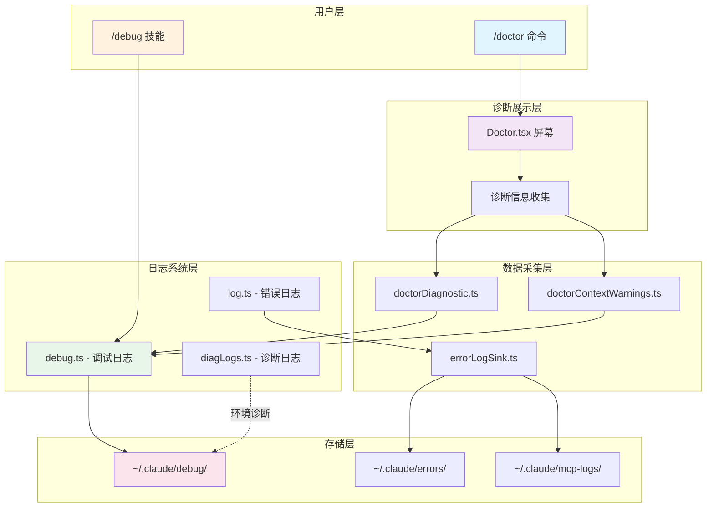
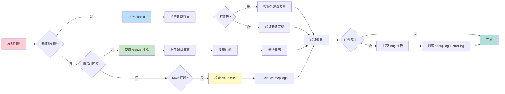

# 第四十五章：调试与诊断

> 调试与诊断工具是开发者的"健康体检系统"。Claude Code 提供了完整的诊断机制，从 `/doctor` 命令到多层次的日志系统，帮助开发者快速定位和解决问题。本章将深入分析调试工具的设计与实现。

---

## 45.1 引言：调试工具的价值

在复杂的 CLI 应用中，问题诊断是日常开发的核心需求。Claude Code 的调试系统提供三大能力：

| 能力维度 | 核心功能 | 使用场景 |
|---------|---------|---------|
| 安装诊断 | `/doctor` 命令 | 安装验证、配置检查、环境问题 |
| 运行调试 | 调试日志系统 | 实时追踪、问题定位、性能分析 |
| 错误追踪 | 错误日志持久化 | Bug 报告、历史回溯、MCP 问题 |

### 45.1.1 调试系统架构概览

Claude Code 的调试系统采用分层设计，从底层日志收集到上层诊断展示形成完整的调试链路：



**图 45-1：Claude Code 调试与诊断系统架构图**

---

## 45.2 `/doctor` 命令详解

### 45.2.1 命令注册与启用

`/doctor` 命令是 Claude Code 的诊断入口，定义在 `src/commands/doctor/index.ts:4-12`：

```typescript
const doctor: Command = {
  name: 'doctor',
  description: 'Diagnose and verify your Claude Code installation and settings',
  isEnabled: () => !isEnvTruthy(process.env.DISABLE_DOCTOR_COMMAND),
  type: 'local-jsx',
  load: () => import('./doctor.js'),
}
```

**设计要点**：
- 通过 `DISABLE_DOCTOR_COMMAND` 环境变量可禁用命令
- 使用 `local-jsx` 类型加载 React 组件屏幕
- 描述信息清晰说明诊断功能范围

### 45.2.2 Doctor 屏幕组件

`Doctor.tsx` 是诊断信息展示的核心组件，位于 `src/screens/Doctor.tsx`。组件收集并展示以下诊断信息：

```typescript
// Doctor.tsx 核心数据结构
const [diagnostic, setDiagnostic] = useState<DiagnosticInfo | null>(null)
const [agentInfo, setAgentInfo] = useState<AgentInfo | null>(null)
const [contextWarnings, setContextWarnings] = useState<ContextWarnings | null>(null)
const [versionLockInfo, setVersionLockInfo] = useState<VersionLockInfo | null>(null)
```

**展示内容分区**：

| 分区 | 内容 | 来源 |
|-----|------|-----|
| Diagnostics | 安装类型、版本、路径、ripgrep 状态 | `getDoctorDiagnostic()` |
| Updates | 自动更新状态、更新权限、更新通道 | 配置 + npm dist-tags |
| Sandbox | 沙箱状态、网络隔离、文件系统限制 | `SandboxDoctorSection` |
| Warnings | 配置警告、多安装警告、Linux glob 问题 | `detectConfigurationIssues()` |
| Context Usage | CLAUDE.md 文件大小、Agent 描述、MCP 工具 | `checkContextWarnings()` |
| Plugin Errors | 插件加载错误列表 | `pluginsErrors` 状态 |

### 45.2.3 诊断信息收集

诊断信息由 `getDoctorDiagnostic()` 函数收集，定义在 `src/utils/doctorDiagnostic.ts:514-625`：

```typescript
export async function getDoctorDiagnostic(): Promise<DiagnosticInfo> {
  const installationType = await getCurrentInstallationType()
  const version = MACRO.VERSION ?? 'unknown'
  const installationPath = await getInstallationPath()
  const invokedBinary = getInvokedBinary()
  const multipleInstallations = await detectMultipleInstallations()
  const warnings = await detectConfigurationIssues(installationType)
  
  // 添加 Linux glob 模式警告
  warnings.push(...detectLinuxGlobPatternWarnings())
  
  // 检测包管理器信息
  const packageManager = installationType === 'package-manager'
    ? await getPackageManager()
    : undefined
    
  return {
    installationType,
    version,
    installationPath,
    invokedBinary,
    configInstallMethod,
    autoUpdates,
    hasUpdatePermissions,
    multipleInstallations,
    warnings,
    packageManager,
    ripgrepStatus,
  }
}
```

**安装类型检测**：

系统支持检测以下安装类型：

```typescript
type InstallationType =
  | 'npm-global'    // npm 全局安装
  | 'npm-local'     // npm 本地安装
  | 'native'        // 原生打包安装
  | 'package-manager' // Homebrew/apt/winget 等
  | 'development'   // 开发模式
  | 'unknown'       // 无法识别
```

检测逻辑位于 `getCurrentInstallationType()` 函数：

```typescript
export async function getCurrentInstallationType(): Promise<InstallationType> {
  // 开发环境优先检测
  if (process.env.NODE_ENV === 'development') {
    return 'development'
  }
  
  // 检测打包模式（bundle）
  if (isInBundledMode()) {
    if (detectHomebrew() || detectWinget() || detectMise() || ...) {
      return 'package-manager'
    }
    return 'native'
  }
  
  // 检测本地 npm 安装
  if (isRunningFromLocalInstallation()) {
    return 'npm-local'
  }
  
  // 检测 npm 全局路径
  const npmGlobalPaths = ['/usr/local/lib/node_modules', ...]
  if (npmGlobalPaths.some(path => invokedPath.includes(path))) {
    return 'npm-global'
  }
  
  return 'unknown'
}
```

---

## 45.3 上下文警告检测

### 45.3.1 上下文警告类型

`checkContextWarnings()` 函数检测可能导致上下文过载的配置问题，定义在 `src/utils/doctorContextWarnings.ts:246-265`：

```typescript
export type ContextWarnings = {
  claudeMdWarning: ContextWarning | null  // CLAUDE.md 文件过大
  agentWarning: ContextWarning | null     // Agent 描述过长
  mcpWarning: ContextWarning | null       // MCP 工具上下文过大
  unreachableRulesWarning: ContextWarning | null // 不可达权限规则
}

export type ContextWarning = {
  type: 'claudemd_files' | 'agent_descriptions' | 'mcp_tools' | 'unreachable_rules'
  severity: 'warning' | 'error'
  message: string
  details: string[]
  currentValue: number
  threshold: number
}
```

### 45.3.2 CLAUDE.md 文件检查

```typescript
async function checkClaudeMdFiles(): Promise<ContextWarning | null> {
  const largeFiles = getLargeMemoryFiles(await getMemoryFiles())
  
  // 已过滤超过 40k 字符的文件
  if (largeFiles.length === 0) {
    return null
  }
  
  const details = largeFiles
    .sort((a, b) => b.content.length - a.content.length)
    .map(file => `${file.path}: ${file.content.length.toLocaleString()} chars`)
  
  return {
    type: 'claudemd_files',
    severity: 'warning',
    message: `${largeFiles.length} large CLAUDE.md files detected`,
    details,
    currentValue: largeFiles.length,
    threshold: MAX_MEMORY_CHARACTER_COUNT,
  }
}
```

### 45.3.3 MCP 工具上下文检查

```typescript
async function checkMcpTools(
  tools: Tool[],
  getToolPermissionContext: () => Promise<ToolPermissionContext>,
  agentInfo: AgentDefinitionsResult | null,
): Promise<ContextWarning | null> {
  const mcpTools = tools.filter(tool => tool.isMcp)
  
  if (mcpTools.length === 0) {
    return null
  }
  
  const { mcpToolTokens, mcpToolDetails } = await countMcpToolTokens(...)
  
  if (mcpToolTokens <= MCP_TOOLS_THRESHOLD) {
    return null
  }
  
  // 按 server 分组统计
  const toolsByServer = new Map<string, { count: number; tokens: number }>()
  for (const tool of mcpToolDetails) {
    const serverName = tool.name.split('__')[1] || 'unknown'
    // ...
  }
  
  return {
    type: 'mcp_tools',
    severity: 'warning',
    message: `Large MCP tools context (~${mcpToolTokens.toLocaleString()} tokens)`,
    details: sortedServers.slice(0, 5).map(...),
    currentValue: mcpToolTokens,
    threshold: MCP_TOOLS_THRESHOLD,
  }
}
```

---

## 45.4 调试日志系统

### 45.4.1 调试模式启用

调试日志系统定义在 `src/utils/debug.ts`，提供多种启用方式：

```typescript
export const isDebugMode = memoize((): boolean => {
  return (
    runtimeDebugEnabled ||
    isEnvTruthy(process.env.DEBUG) ||
    isEnvTruthy(process.env.DEBUG_SDK) ||
    process.argv.includes('--debug') ||
    process.argv.includes('-d') ||
    isDebugToStdErr() ||
    process.argv.some(arg => arg.startsWith('--debug=')) ||
    getDebugFilePath() !== null
  )
})
```

**启用方式矩阵**：

| 方式 | 命令/环境变量 | 输出目标 |
|-----|-------------|---------|
| 命令行标志 | `--debug` 或 `-d` | 日志文件 |
| 环境变量 | `DEBUG=true` | 日志文件 |
| stderr 输出 | `--debug-to-stderr` | stderr |
| 自定义文件 | `--debug-file=/path/to/file.log` | 自定义路径 |
| 过滤模式 | `--debug=api,hooks` | 仅指定类别 |

### 45.4.2 日志级别与过滤

系统支持多种日志级别：

```typescript
export type DebugLogLevel = 'verbose' | 'debug' | 'info' | 'warn' | 'error'

const LEVEL_ORDER: Record<DebugLogLevel, number> = {
  verbose: 0,  // 最详细
  debug: 1,    // 默认调试级别
  info: 2,     // 一般信息
  warn: 3,     // 警告
  error: 4,    // 错误
}
```

通过 `CLAUDE_CODE_DEBUG_LOG_LEVEL` 环境变量可调整最小级别：

```typescript
export const getMinDebugLogLevel = memoize((): DebugLogLevel => {
  const raw = process.env.CLAUDE_CODE_DEBUG_LOG_LEVEL?.toLowerCase().trim()
  if (raw && Object.hasOwn(LEVEL_ORDER, raw)) {
    return raw as DebugLogLevel
  }
  return 'debug'  // 默认过滤 verbose
})
```

### 45.4.3 日志写入机制

日志使用缓冲写入器，支持两种模式：

```typescript
function getDebugWriter(): BufferedWriter {
  debugWriter = createBufferedWriter({
    writeFn: content => {
      const path = getDebugLogPath()
      const dir = dirname(path)
      
      if (isDebugMode()) {
        // 立即模式：同步写入，确保进程退出时不丢失
        getFsImplementation().appendFileSync(path, content)
        void updateLatestDebugLogSymlink()
        return
      }
      
      // 缓冲模式：每秒刷新一次
      pendingWrite = pendingWrite
        .then(appendAsync.bind(null, needMkdir, dir, path, content))
        .catch(noop)
    },
    flushIntervalMs: 1000,
    maxBufferSize: 100,
    immediateMode: isDebugMode(),
  })
}
```

**日志文件路径**：

```typescript
export function getDebugLogPath(): string {
  return (
    getDebugFilePath() ??                    // 自定义路径
    process.env.CLAUDE_CODE_DEBUG_LOGS_DIR ?? // 环境变量指定目录
    join(getClaudeConfigHomeDir(), 'debug', `${getSessionId()}.txt`) // 默认路径
  )
}
```

日志文件存储在 `~/.claude/debug/` 目录下，以会话 ID 命名。系统还会创建 `latest` 符号链接指向最新日志：

```typescript
const updateLatestDebugLogSymlink = memoize(async (): Promise<void> => {
  const debugLogPath = getDebugLogPath()
  const latestSymlinkPath = join(debugLogsDir, 'latest')
  
  await unlink(latestSymlinkPath).catch(() => {})
  await symlink(debugLogPath, latestSymlinkPath)
})
```

### 45.4.4 调试过滤器

`--debug=pattern` 参数支持类别过滤，定义在 `src/utils/debugFilter.ts`：

```typescript
export type DebugFilter = {
  include: string[]   // 包含的类别
  exclude: string[]   // 排除的类别
  isExclusive: boolean // 是否为排除模式
}

// 示例：
// --debug=api,hooks    -> include: ['api', 'hooks'], exclude: []
// --debug=!1p,!file    -> include: [], exclude: ['1p', 'file']
```

类别提取支持多种日志格式：

```typescript
export function extractDebugCategories(message: string): string[] {
  const categories: string[] = []
  
  // 模式1: MCP server "servername"
  const mcpMatch = message.match(/^MCP server ["']([^"']+)["']/)
  if (mcpMatch) {
    categories.push('mcp', mcpMatch[1].toLowerCase())
  }
  
  // 模式2: [CATEGORY] 前缀
  const bracketMatch = message.match(/^\[([^\]]+)]/)
  if (bracketMatch) {
    categories.push(bracketMatch[1].trim().toLowerCase())
  }
  
  // 模式3: category: message 前缀
  const prefixMatch = message.match(/^([^:[]+):/)
  if (prefixMatch) {
    categories.push(prefixMatch[1].trim().toLowerCase())
  }
  
  return Array.from(new Set(categories))
}
```

---

## 45.5 错误日志系统

### 45.5.1 错误日志架构

错误日志系统定义在 `src/utils/log.ts`，提供错误持久化和内存缓存：

```typescript
// 内存错误缓存（最近 100 条）
const MAX_IN_MEMORY_ERRORS = 100
let inMemoryErrorLog: Array<{ error: string; timestamp: string }> = []

// 错误 sink 接口
export type ErrorLogSink = {
  logError: (error: Error) => void
  logMCPError: (serverName: string, error: unknown) => void
  logMCPDebug: (serverName: string, message: string) => void
  getErrorsPath: () => string
  getMCPLogsPath: (serverName: string) => string
}
```

### 45.5.2 错误日志写入

`logError()` 函数处理错误记录：

```typescript
export function logError(error: unknown): void {
  const err = toError(error)
  
  // HARD_FAIL 模式：开发调试时直接崩溃
  if (feature('HARD_FAIL') && isHardFailMode()) {
    console.error('[HARD FAIL] logError called with:', err.stack || err.message)
    process.exit(1)
  }
  
  // 检查是否应禁用错误报告
  if (isEnvTruthy(process.env.CLAUDE_CODE_USE_BEDROCK) ||
      isEnvTruthy(process.env.CLAUDE_CODE_USE_VERTEX) ||
      process.env.DISABLE_ERROR_REPORTING) {
    return
  }
  
  // 添加到内存日志
  addToInMemoryErrorLog({ error: err.stack || err.message, timestamp: ... })
  
  // 如果 sink 未初始化，加入队列
  if (errorLogSink === null) {
    errorQueue.push({ type: 'error', error: err })
    return
  }
  
  errorLogSink.logError(err)
}
```

### 45.5.3 错误日志 Sink 实现

Sink 实现位于 `src/utils/errorLogSink.ts`，处理文件写入：

```typescript
export function initializeErrorLogSink(): void {
  attachErrorLogSink({
    logError: logErrorImpl,
    logMCPError: logMCPErrorImpl,
    logMCPDebug: logMCPDebugImpl,
    getErrorsPath,
    getMCPLogsPath,
  })
  
  logForDebugging('Error log sink initialized')
}

function logErrorImpl(error: Error): void {
  const errorStr = error.stack || error.message
  
  // Axios 错误增强：添加 URL、状态、服务器消息
  if (axios.isAxiosError(error) && error.config?.url) {
    const parts = [`url=${error.config.url}`]
    if (error.response?.status !== undefined) {
      parts.push(`status=${error.response.status}`)
    }
    const serverMessage = extractServerMessage(error.response?.data)
    if (serverMessage) {
      parts.push(`body=${serverMessage}`)
    }
    context = `[${parts.join(',')}] `
  }
  
  logForDebugging(`${error.name}: ${context}${errorStr}`, { level: 'error' })
  appendToLog(getErrorsPath(), { error: `${context}${errorStr}` })
}
```

### 45.5.4 MCP 错误日志

MCP 服务器错误单独记录：

```typescript
function logMCPErrorImpl(serverName: string, error: unknown): void {
  logForDebugging(`MCP server "${serverName}" ${error}`, { level: 'error' })
  
  const logFile = getMCPLogsPath(serverName)
  const errorInfo = {
    error: error instanceof Error ? error.stack : String(error),
    timestamp: new Date().toISOString(),
    sessionId: getSessionId(),
    cwd: getFsImplementation().cwd(),
  }
  
  getLogWriter(logFile).write(errorInfo)
}

export function getMCPLogsPath(serverName: string): string {
  return join(CACHE_PATHS.mcpLogs(serverName), DATE + '.jsonl')
}
```

---

## 45.6 `/debug` 技能

### 45.6.1 技能定义

`/debug` 技能提供交互式调试支持，定义在 `src/skills/bundled/debug.ts`：

```typescript
export function registerDebugSkill(): void {
  registerBundledSkill({
    name: 'debug',
    description: process.env.USER_TYPE === 'ant'
      ? 'Debug your current Claude Code session by reading the session debug log'
      : 'Enable debug logging for this session and help diagnose issues',
    allowedTools: ['Read', 'Grep', 'Glob'],
    argumentHint: '[issue description]',
    disableModelInvocation: true,
    userInvocable: true,
    async getPromptForCommand(args) {
      // 启用调试日志
      const wasAlreadyLogging = enableDebugLogging()
      const debugLogPath = getDebugLogPath()
      
      // 读取日志尾部
      const stats = await stat(debugLogPath)
      const readSize = Math.min(stats.size, TAIL_READ_BYTES)
      // ...读取最后 20 行
      
      return [{ type: 'text', text: prompt }]
    },
  })
}
```

### 45.6.2 调试流程

技能执行流程：

1. **启用日志**：调用 `enableDebugLogging()` 开启当前会话日志
2. **读取日志尾部**：读取最后 64KB/20 行内容
3. **分析问题**：根据用户描述和日志内容诊断
4. **提供建议**：输出诊断结果和修复建议

**关键设计**：
- 非用户默认不写日志，技能调用时才启用
- 读取尾部而非全文，避免内存峰值
- 可启动 `claudeCodeGuideAgent` 子代理获取帮助

---

## 45.7 故障排查流程

### 45.7.1 推荐排查步骤



**图 45-2：Claude Code 故障排查流程图**

### 45.7.2 日志文件位置

| 日志类型 | 存储路径 | 内容说明 |
|---------|---------|---------|
| 调试日志 | `~/.claude/debug/<session-id>.txt` | 运行时调试信息 |
| 最新日志 | `~/.claude/debug/latest` | 符号链接指向最新日志 |
| 错误日志 | `~/.claude/errors/<date>.jsonl` | 错误记录（仅内部用户） |
| MCP 日志 | `~/.claude/mcp-logs/<server>/<date>.jsonl` | MCP 服务器日志 |

### 45.7.3 常见问题诊断

**安装问题**：
- 多安装冲突：检查 `diagnostic.multipleInstallations`
- PATH 未配置：检查 `warnings` 中的 PATH 相关警告
- 权限问题：检查 `hasUpdatePermissions`

**上下文问题**：
- CLAUDE.md 过大：检查 `contextWarnings.claudeMdWarning`
- MCP 工具过多：检查 `contextWarnings.mcpWarning`
- 权限规则冲突：检查 `contextWarnings.unreachableRulesWarning`

**MCP 问题**：
- 连接失败：查看 MCP 日志中的连接错误
- 工具加载失败：检查 `mcpToolDetails` 中的错误信息
- 权限问题：检查工具权限上下文

---

## 45.8 API 调用日志

### 45.8.1 API 日志记录

API 相关日志定义在 `src/services/api/logging.ts`：

```typescript
export function logAPIQuery({
  model,
  messagesLength,
  temperature,
  betas,
  permissionMode,
  querySource,
  queryTracking,
  thinkingType,
  effortValue,
  fastMode,
}: {...}): void {
  logEvent('tengu_api_query', {
    model,
    messagesLength,
    temperature,
    provider: getAPIProviderForStatsig(),
    permissionMode,
    querySource,
    thinkingType,
    effortValue,
    fastMode,
    ...getAnthropicEnvMetadata(),
  })
}
```

### 45.8.2 错误分类与增强

API 错误日志包含详细分类：

```typescript
export function logAPIError({
  error,
  model,
  messageCount,
  durationMs,
  attempt,
  requestId,
  clientRequestId,
  headers,
}: {...}): void {
  const gateway = detectGateway({ headers, baseUrl })
  const errorType = classifyAPIError(error)
  
  // 连接错误详情
  const connectionDetails = extractConnectionErrorDetails(error)
  if (connectionDetails) {
    logForDebugging(
      `Connection error details: code=${connectionDetails.code}${sslLabel}`,
      { level: 'error' }
    )
  }
  
  // Client Request ID 用于定位服务器日志
  if (clientRequestId) {
    logForDebugging(
      `API error x-client-request-id=${clientRequestId}`,
      { level: 'error' }
    )
  }
}
```

---

## 45.9 诊断日志（无 PII）

### 45.9.1 无 PII 诊断日志

为容器环境监控提供的诊断日志，定义在 `src/utils/diagLogs.ts`：

```typescript
export function logForDiagnosticsNoPII(
  level: DiagnosticLogLevel,
  event: string,
  data?: Record<string, unknown>,
): void {
  const logFile = getDiagnosticLogFile()  // CLAUDE_CODE_DIAGNOSTICS_FILE
  if (!logFile) return
  
  const entry: DiagnosticLogEntry = {
    timestamp: new Date().toISOString(),
    level,
    event,
    data: data ?? {},
  }
  
  fs.appendFileSync(logFile, jsonStringify(entry) + '\n')
}
```

**设计约束**：
- 禁止包含任何 PII（文件路径、项目名、提示词等）
- 仅记录事件类型和非敏感数据
- 通过环境变量指定日志文件路径

### 45.9.2 时间包装器

```typescript
export async function withDiagnosticsTiming<T>(
  event: string,
  fn: () => Promise<T>,
  getData?: (result: T) => Record<string, unknown>,
): Promise<T> {
  const startTime = Date.now()
  logForDiagnosticsNoPII('info', `${event}_started`)
  
  try {
    const result = await fn()
    logForDiagnosticsNoPII('info', `${event}_completed`, {
      duration_ms: Date.now() - startTime,
      ...getData?.(result),
    })
    return result
  } catch (error) {
    logForDiagnosticsNoPII('error', `${event}_failed`, {
      duration_ms: Date.now() - startTime,
    })
    throw error
  }
}
```

---

## 45.10 小结

Claude Code 的调试与诊断系统提供了完整的开发者支持：

1. **`/doctor` 命令**：一键诊断安装、配置、环境问题
2. **多层次日志**：调试日志、错误日志、MCP 日志分离存储
3. **灵活启用**：支持命令行、环境变量、技能调用多种方式
4. **智能过滤**：按类别过滤日志，减少噪音
5. **标准排查流程**：从诊断到修复的完整链路

这套系统确保开发者能快速定位问题，是 Claude Code 可维护性的重要保障。

---

## 关键源码引用

| 功能 | 源码位置 |
|-----|---------|
| Doctor 命令注册 | `src/commands/doctor/index.ts:4-12` |
| Doctor 屏幕组件 | `src/screens/Doctor.tsx:100-502` |
| 诊断信息收集 | `src/utils/doctorDiagnostic.ts:514-625` |
| 安装类型检测 | `src/utils/doctorDiagnostic.ts:86-148` |
| 上下文警告检测 | `src/utils/doctorContextWarnings.ts:246-265` |
| 调试日志系统 | `src/utils/debug.ts:18-269` |
| 调试过滤器 | `src/utils/debugFilter.ts:16-157` |
| 错误日志系统 | `src/utils/log.ts:64-363` |
| 错误日志 Sink | `src/utils/errorLogSink.ts:22-236` |
| Debug 技能 | `src/skills/bundled/debug.ts:12-103` |
| API 日志 | `src/services/api/logging.ts:171-789` |
| 无 PII 诊断日志 | `src/utils/diagLogs.ts:26-95` |