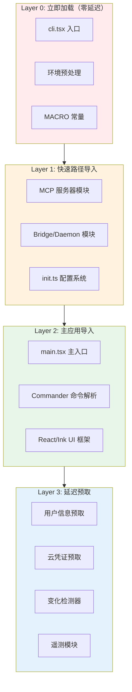
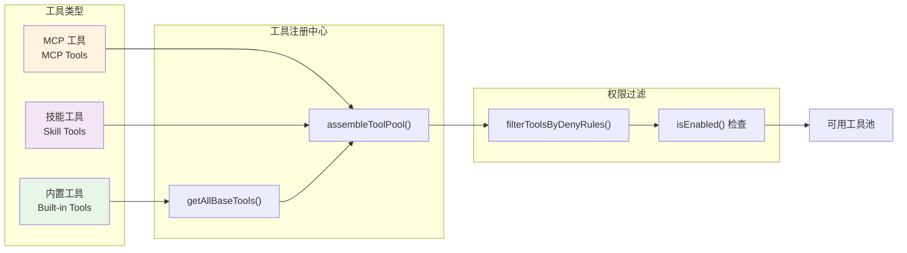
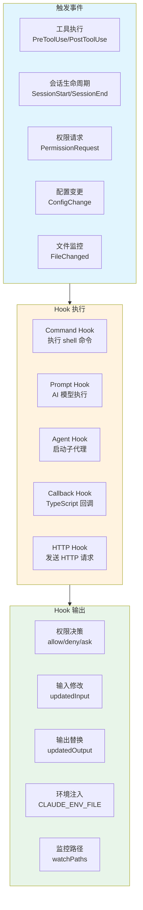
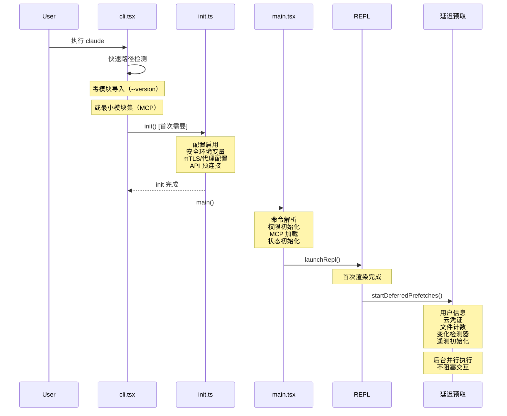
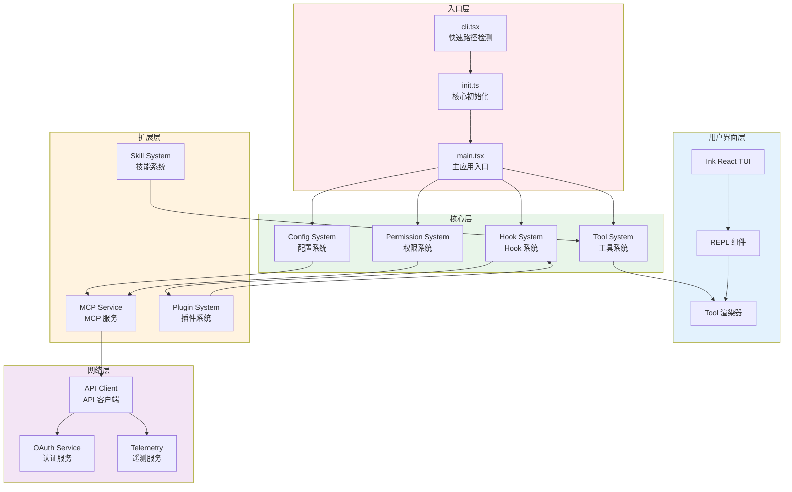

# 第 46 章：架构设计原则总结

## 46.1 引言

Claude Code 作为一款复杂的命令行 AI 编程助手，其架构设计体现了多个精妙的工程决策。通过对源代码的深入分析，我们可以提炼出以下核心设计原则：

1. **性能优先**：启动延迟最小化贯穿整个架构
2. **可扩展性**：统一抽象支持多种扩展方式
3. **安全性**：默认失败关闭（fail-close）的安全策略
4. **模块化**：清晰的职责边界和延迟加载机制

本章将总结 Claude Code 的四大架构设计原则，并通过架构图展示整体系统结构。

---

## 46.2 Monolith + Dynamic Import 平衡策略

### 46.2.1 设计动机

Claude Code 采用单体架构而非微服务架构，这一决策基于以下考量：

| 考量因素 | 单体优势 | 微服务劣势 |
|---------|---------|-----------|
| 启动速度 | 单进程启动，无网络开销 | 多进程协调，启动延迟高 |
| 部署复杂度 | 单二进制文件，零依赖 | 多服务编排，运维负担 |
| 开发体验 | 本地调试便捷 | 需要本地服务网格 |
| 资源占用 | 共享内存，效率高 | 各服务独立内存，开销大 |

然而，纯单体架构存在固有问题：
- 启动时加载所有模块，延迟高
- 内存占用随功能增长膨胀
- 无法灵活控制功能可见性

Claude Code 的解决方案是 **"Monolith + Dynamic Import"** 模式：保持单进程架构，但通过动态导入控制模块加载时机。

### 46.2.2 快速路径机制

快速路径（fast-path）是启动优化的核心机制。在 `cli.tsx` 入口点，系统首先检测是否可以提前退出，避免加载完整模块：

```typescript
// 快速路径优先级排序
async function main(): Promise<void> {
  const args = process.argv.slice(2);
  
  // 最高优先级：--version，零模块加载
  if (args.length === 1 && args[0] === '--version') {
    console.log(`${MACRO.VERSION} (Claude Code)`);  // MACRO 在构建时内联
    return;
  }
  
  // 次优先级：MCP 服务器模式，最小模块集
  if (args[0] === '--claude-in-chrome-mcp') {
    await import('../mcp/chrome-mcp-server.js');
    return;
  }
  
  // ... 其他快速路径
  
  // 最后：完整 CLI 加载
  const { main: cliMain } = await import('../main.js');
  await cliMain();
}
```

快速路径按模块加载量排序：

| 级别 | 快速路径 | 模块加载量 | 启动延迟 |
|------|---------|-----------|---------|
| 0 | `--version` | 零 | <10ms |
| 1 | MCP 服务器模式 | 最小集 | ~50ms |
| 2 | Bridge/Daemon 模式 | 配置+网络 | ~150ms |
| 3 | 后台会话管理 | 配置模块 | ~100ms |
| 4 | 完整 CLI | 全模块 | ~300ms |

### 46.2.3 条件导入与死代码消除

Claude Code 使用 `feature()` 函数配合 Bun 的构建系统实现死代码消除（DCE）：

```typescript
// 静态条件导入（构建时 DCE）
const coordinatorModeModule = feature('COORDINATOR_MODE')
  ? require('./coordinator/coordinatorMode.js')
  : null;

// 动态条件导入（运行时控制）
if (isEnvTruthy(process.env.CLAUDE_CODE_USE_BEDROCK)) {
  void prefetchAwsCredentialsAndBedRockInfoIfSafe();
}
```

`feature()` 函数在构建时被替换为常量，不可达代码被消除，实现：
- 减小二进制体积
- 消除未使用功能的运行时开销
- 支持 A/B 测试和功能门控

### 46.2.4 模块分层策略

Claude Code 的模块按加载时机分为四层：



**图 46-1：模块分层加载策略**

---

## 46.3 Tool-based Extensibility 设计

### 46.3.1 统一工具抽象

Claude Code 的核心设计理念是 **"一切皆工具"**。无论是文件操作、网络请求、MCP 服务还是技能调用，都通过统一的 `Tool` 接口实现：

```typescript
export type Tool<
  Input extends AnyObject = AnyObject,
  Output = unknown,
  P extends ToolProgressData = ToolProgressData,
> = {
  // 身份标识
  name: string;
  aliases?: string[];
  
  // 输入验证
  inputSchema: Input;
  inputJSONSchema?: ToolInputJSONSchema;
  
  // 执行方法
  call(args, context): Promise<ToolResult<Output>>;
  
  // 权限控制
  checkPermissions(input, context): Promise<PermissionResult>;
  isConcurrencySafe(input): boolean;
  isReadOnly(input): boolean;
  isDestructive(input): boolean;
  
  // UI 渲染
  renderToolUseMessage(input): ReactNode;
  renderToolResultMessage(content): ReactNode;
  renderToolUseProgressMessage(progress): ReactNode;
}
```

这种统一抽象带来以下优势：

| 优势 | 说明 |
|------|------|
| **权限一致性** | 所有操作通过相同权限系统检查 |
| **并发安全性** | 工具可声明是否安全并发执行 |
| **UI 统一性** | 工具执行过程有统一的渲染机制 |
| **MCP 集成** | MCP 工具自动适配内置工具接口 |
| **扩展性** | 新功能只需实现 Tool 接口 |

### 46.3.2 工具类型体系

Claude Code 的工具体系包含三类：



**图 46-2：工具类型体系**

**内置工具**：编译进二进制，始终可用（除非被禁用）
- 文件操作：Read、Edit、Write
- 搜索操作：Glob、Grep
- 执行操作：Bash、Agent
- 特殊操作：Skill、NotebookEdit

**MCP 工具**：通过 MCP 服务器动态发现
- 工具定义来自外部服务器
- 输入 schema 转换为 JSON Schema
- 执行通过 MCP 协议代理

**技能工具**：技能目录中的 SKILL.md 定义
- 本地技能目录扫描发现
- 允许工具列表约束
- 技能特定的 hooks

### 46.3.3 buildTool 工厂模式

为简化工具定义，`buildTool()` 工厂函数提供安全默认值：

```typescript
const TOOL_DEFAULTS = {
  isEnabled: () => true,                        // 默认启用
  isConcurrencySafe: () => false,               // 默认不安全（fail-close）
  isReadOnly: () => false,                      // 默认写操作
  isDestructive: () => false,                   // 默认非破坏性
  checkPermissions: (input) => 
    Promise.resolve({ behavior: 'allow' }),     // 默认委托通用系统
}
```

**fail-close 安全策略**：
- `isConcurrencySafe` 默认 `false`：新工具不可并发执行，需显式声明安全
- `isReadOnly` 默认 `false`：新工具被视为写操作，触发权限检查

### 46.3.4 工具聚合流程

工具池组装遵循明确的流程：

```typescript
// 第一层：获取所有内置工具
const baseTools = getAllBaseTools();

// 第二层：权限过滤
const filteredTools = filterToolsByDenyRules(baseTools, permissionContext);

// 第三层：启用状态过滤
const enabledTools = filteredTools.filter(t => t.isEnabled());

// 第四层：合并 MCP 工具
const pool = assembleToolPool(permissionContext, mcpTools);
```

---

## 46.4 Hook-driven Customization 机制

### 46.4.1 设计理念

Hook 系统是 Claude Code 的生命周期定制化机制，允许用户在关键节点注入自定义逻辑：



**图 46-3：Hook 系统架构**

### 46.4.2 事件类型覆盖

Hook 系统定义了 25+ 种事件类型，覆盖所有关键节点：

| 类别 | 事件类型 | 用途 |
|------|---------|------|
| **工具执行** | PreToolUse, PostToolUse, PostToolUseFailure | 输入验证、结果审计 |
| **会话生命周期** | SessionStart, SessionEnd, Stop, StopFailure | 初始化、清理、输出处理 |
| **子代理** | SubagentStart, SubagentStop | 子代理初始化和结果处理 |
| **压缩** | PreCompact, PostCompact | 自定义压缩指令 |
| **权限** | PermissionRequest, PermissionDenied | 自动审批、拒绝处理 |
| **用户交互** | UserPromptSubmit, Notification | 提示预处理、通知转发 |
| **任务管理** | TaskCreated, TaskCompleted | 任务生命周期追踪 |
| **配置** | ConfigChange, InstructionsLoaded, CwdChanged | 变更审计、加载监控 |
| **文件** | FileChanged | 文件变更响应 |
| **Worktree** | WorktreeCreate, WorktreeRemove | Worktree 定位 |

### 46.4.3 Hook 类型实现

五种 Hook 类型满足不同需求：

```typescript
// Command Hook：执行 shell 命令
{
  type: 'command',
  command: 'echo "Hello"',
  timeout: 60
}

// Prompt Hook：AI 模型执行
{
  type: 'prompt',
  prompt: '检查安全性',
  timeout: 30
}

// Agent Hook：启动子代理
{
  type: 'agent',
  prompt: '分析代码质量'
}

// HTTP Hook：发送 HTTP 请求
{
  type: 'http',
  url: 'https://api.example.com/hook'
}

// Callback Hook：TypeScript 回调（SDK 用）
{
  type: 'callback',
  callback: async (input) => { return { behavior: 'allow' } }
}
```

### 46.4.4 异步 Hook 执行

Hook 支持异步执行模式，避免阻塞主流程：

```json
// Hook 输出首行声明异步模式
{"async": true, "asyncTimeout": 15000}
```

异步 Hook 被移入后台执行，通过注册表追踪状态：

```typescript
const pendingHooks = new Map<string, PendingAsyncHook>();

// 定期检查已完成的异步 Hook
export async function checkForAsyncHookResponses() {
  for (const [id, hook] of pendingHooks) {
    if (hook.shellCommand.completed) {
      pendingHooks.delete(id);
      return { processId: id, response: parseResponse(hook.stdout) };
    }
  }
}
```

### 46.4.5 Hook 能力矩阵

Hook 可以返回多种能力：

| 能力 | 适用事件 | 说明 |
|------|---------|------|
| `permissionDecision` | PreToolUse, PermissionRequest | 自动权限决策 |
| `updatedInput` | PreToolUse | 修改工具输入 |
| `updatedMCPToolOutput` | PostToolUse | 替换 MCP 工具输出 |
| `blockExecution` | PreToolUse | 阻断工具执行 |
| `additionalContext` | PostToolUse | 附加上下文信息 |
| `CLAUDE_ENV_FILE` | SessionStart | 环境变量注入 |
| `watchPaths` | SessionStart | 文件监控路径 |
| `initialUserMessage` | SessionStart | 初始用户输入 |
| `retry` | PermissionDenied | 请求权限重试 |

---

## 46.5 Lazy Loading 优化策略

### 46.5.1 多级延迟加载

Claude Code 实现了多级延迟加载，确保启动延迟最小化：



**图 46-4：延迟加载时序图**

### 46.5.2 延迟预取内容

`startDeferredPrefetches()` 在 REPL 渲染后执行，不阻塞首次交互：

```typescript
export function startDeferredPrefetches(): void {
  // --bare 或测试模式：跳过所有预取
  if (isBareMode()) return;
  
  // 用户信息（并行）
  void initUser();
  void getUserContext();
  
  // 云提供商凭证（条件预取）
  if (useBedrock()) void prefetchAwsCredentials();
  if (useVertex()) void prefetchGcpCredentials();
  
  // 文件计数（超时保护）
  void countFilesRounded(getCwd(), AbortSignal.timeout(3000));
  
  // 变化检测器初始化
  void settingsChangeDetector.initialize();
  void skillChangeDetector.initialize();
  
  // 遥测初始化（最重模块）
  void initializeTelemetry();
}
```

预取内容按优先级分类：

| 优先级 | 内容 | 超时 | 失败影响 |
|--------|------|------|---------|
| 高 | 用户信息 | 无 | 影响功能门控 |
| 高 | 系统上下文 | 无 | 影响提示词 |
| 中 | 云凭证 | 无 | 影响 BYOC |
| 低 | 文件计数 | 3s | 仅影响显示 |
| 低 | 变化检测器 | 无 | 影响热重载 |
| 低 | 遥测 | 无 | 仅影响分析 |

### 46.5.3 早期输入捕获

`startCapturingEarlyInput()` 在模块加载期间预先捕获用户输入：

```typescript
// 在加载重型模块时并行捕获输入
startCapturingEarlyInput();

const { main: cliMain } = await import('../main.js');
await cliMain();

// 模块加载完成后，已捕获的输入立即可用
```

这一优化减少首次交互的感知延迟。

### 46.5.4 I/O 并行化启动

MDM 子进程和 macOS keychain 读取是慢操作，在模块导入阶段并行启动：

```typescript
// main.tsx 开头，在模块导入期间执行
startMdmRawRead();     // MDM 配置子进程读取
startKeychainPrefetch(); // macOS keychain 预读取

// 后续模块导入（~135ms）期间，I/O 并行执行
import { ... } from './components/...';
```

### 46.5.5 遥测延迟加载

遥测模块包含 ~400KB 的 OpenTelemetry + protobuf，延迟到需要时加载：

```typescript
async function setMeterState(): Promise<void> {
  // 延迟加载遥测模块
  const { initializeTelemetry } = await import('./telemetry/instrumentation.js');
  const meter = await initializeTelemetry();
  // ...
}

// 遥测初始化在信任对话框之后
export function initializeTelemetryAfterTrust(): void {
  void doInitializeTelemetry();
}
```

---

## 46.6 整体架构图



**图 46-5（figure-46-1）：Claude Code 整体架构图**

---

## 46.7 设计原则总结表

下表总结 Claude Code 的核心架构设计原则：

| 设计原则 | 核心策略 | 实现机制 | 效果 |
|---------|---------|---------|------|
| **性能优先** | 启动延迟最小化 | 快速路径检测、动态导入、延迟预取 | 版本查询 <10ms，完整启动 ~300ms |
| **可扩展性** | 统一抽象 | Tool 接口、MCP 协议、技能系统 | 内置工具、MCP 工具、技能工具统一管理 |
| **安全性** | Fail-close 策略 | 默认不安全、权限检查、信任验证 | 新工具需显式声明安全，敏感操作需批准 |
| **模块化** | 清晰分层 | 模块分层、延迟加载、并行 I/O | 重型模块延迟，I/O 与 CPU 并行 |
| **定制化** | Hook 驱动 | 25+ 事件类型、5 种 Hook 类型 | 用户可注入任意节点的自定义逻辑 |
| **热重载** | 变化检测 | settingsChangeDetector、skillChangeDetector | 配置/技能变更自动生效 |

---

## 46.8 小结

Claude Code 的架构设计体现了现代 CLI 工具的最佳实践：

1. **Monolith + Dynamic Import**：单体架构保证部署便捷性，动态导入实现启动优化
2. **Tool-based Extensibility**：统一工具抽象使内置功能、MCP 扩展、技能调用无缝集成
3. **Hook-driven Customization**：丰富的 Hook 事件让用户可以定制任意生命周期节点
4. **Lazy Loading**：多级延迟加载确保重型模块只在需要时加载，并行 I/O 最大化启动效率

这些原则共同构建了一个：
- **响应迅速**：快速路径机制让常见操作毫秒级响应
- **易于扩展**：MCP 协议和 Tool 接口支持无限功能扩展
- **安全可控**：fail-close 策略和权限系统保护用户数据
- **高度定制**：Hook 系统满足从个人偏好到企业政策的各种需求

通过对 Claude Code 源代码的学习，我们不仅理解了其架构设计，也获得了构建高质量 CLI 工具的宝贵经验。

---

**相关章节回顾**：
- 第 2 章：入口点与启动流程
- 第 8 章：工具架构总览
- 第 22 章：插件系统
- 第 23 章：Hook 系统