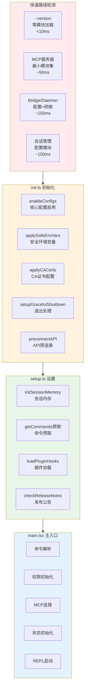
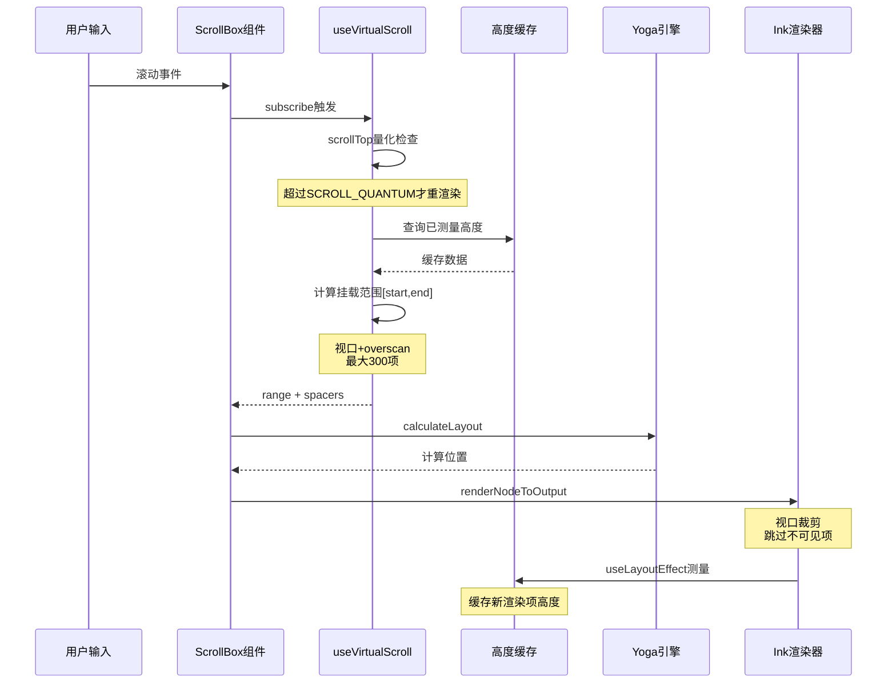
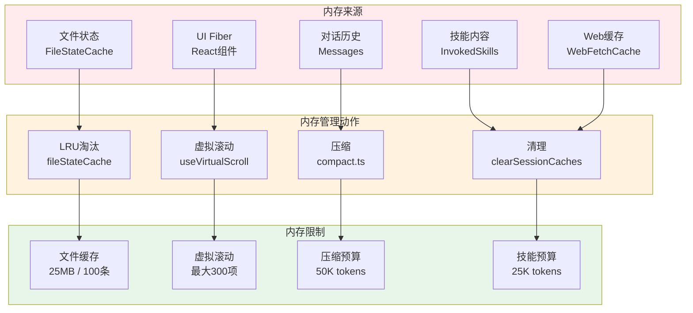

# 第 47 章：性能优化策略

> 本章基于 Claude Code 源代码分析，请以最新版本为准。

## 47.1 引言

Claude Code 作为一款命令行 AI 编程助手，性能优化是其核心竞争力之一。用户期望 CLI 工具能够：
- **快速响应**：启动延迟最小化，版本查询等简单操作毫秒级完成
- **流畅交互**：终端 UI 渲染高效，滚动、输入无卡顿
- **资源可控**：内存占用合理，长时间会话不导致系统资源耗尽
- **智能缓存**：避免重复计算，最大化利用已有结果

本章将深入分析 Claude Code 的四大性能优化策略：

1. **启动速度优化**：快速路径机制、延迟加载、并行 I/O
2. **渲染性能优化**：虚拟滚动、增量渲染、缓存策略
3. **内存管理**：LRU 缓存、资源释放、上下文压缩
4. **缓存策略**：Prompt 缓存、文件状态缓存、决策缓存

---

## 47.2 启动速度优化

### 47.2.1 快速路径机制

快速路径（Fast-path）是 Claude Code 启动优化的核心机制。在 `cli.tsx` 入口点，系统首先检测是否可以提前退出，避免加载完整模块：

```typescript
// src/entrypoints/cli.tsx - 快速路径检测区域
async function main(): Promise<void> {
  const args = process.argv.slice(2);

  // Fast-path for --version/-v: zero module loading needed
  if (args.length === 1 && (args[0] === '--version' || args[0] === '-v')) {
    // MACRO.VERSION is inlined at build time
    console.log(`${MACRO.VERSION} (Claude Code)`);
    return;  // 零模块导入，直接退出
  }

  // 其他快速路径...
}
```

快速路径按模块加载量分层：

| 级别 | 快速路径 | 模块加载量 | 启动延迟 |
|------|---------|-----------|---------|
| 0 | `--version` | 零 | <10ms |
| 1 | MCP 服务器模式 | 最小集 | ~50ms |
| 2 | Bridge/Daemon 模式 | 配置+网络 | ~150ms |
| 3 | 后台会话管理 | 配置模块 | ~100ms |
| 4 | 完整 CLI | 全模块 | ~300ms |

### 47.2.2 启动性能分析器

Claude Code 内置了启动性能分析器，用于追踪各阶段的耗时：

```typescript
// src/utils/startupProfiler.ts - profileCheckpoint 函数区域
export function profileCheckpoint(name: string): void {
  if (!SHOULD_PROFILE) return

  const perf = getPerformance()
  perf.mark(name)

  // 内存快照（仅在详细分析模式）
  if (DETAILED_PROFILING) {
    memorySnapshots.push(process.memoryUsage())
  }
}
```

性能分析支持两种模式：
- **采样日志**：100% ant 用户，0.5% 外部用户
- **详细分析**：`CLAUDE_CODE_PROFILE_STARTUP=1` 环境变量激活

关键阶段定义：

```typescript
// src/utils/startupProfiler.ts - PHASE_DEFINITIONS 常量区域
const PHASE_DEFINITIONS = {
  import_time: ['cli_entry', 'main_tsx_imports_loaded'],
  init_time: ['init_function_start', 'init_function_end'],
  settings_time: ['eagerLoadSettings_start', 'eagerLoadSettings_end'],
  total_time: ['cli_entry', 'main_after_run'],
}
```

### 47.2.3 延迟预取策略

`init.ts` 实现了延迟预取策略，确保重型模块只在需要时加载：

```typescript
// src/entrypoints/init.ts - init 函数区域（摘要）
export const init = memoize(async (): Promise<void> => {
  // 核心配置启用（必须）
  enableConfigs()

  // 安全环境变量（立即应用）
  applySafeConfigEnvironmentVariables()

  // CA证书配置（TLS预连接前）
  applyExtraCACertsFromConfig()

  // 优雅退出处理
  setupGracefulShutdown()

  // 1P事件日志（延迟加载）
  void Promise.all([
    import('../services/analytics/firstPartyEventLogger.js'),
    import('../services/analytics/growthbook.js'),
  ])

  // JetBrains检测（异步初始化缓存）
  void initJetBrainsDetection()

  // GitHub仓库检测（异步）
  void detectCurrentRepository()

  // API预连接（重叠TCP+TLS握手）
  preconnectAnthropicApi()
})
```

预取内容按优先级分类：

| 优先级 | 内容 | 超时 | 失败影响 |
|--------|------|------|---------|
| 高 | 核心配置 | 无 | 阻塞启动 |
| 高 | 安全环境变量 | 无 | 影响功能门控 |
| 中 | CA证书/代理 | 无 | 影响TLS |
| 低 | JetBrains检测 | 无 | 仅影响显示 |
| 低 | GitHub检测 | 无 | 仅影响PR链接 |

### 47.2.4 并行 I/O 启动

慢速 I/O 操作在模块导入阶段并行启动：

```typescript
// src/setup.ts - setup 函数区域（摘要）
export async function setup(...): Promise<void> {
  // 后台任务：关键注册必须在首次查询前完成
  initSessionMemory()  // 同步注册 hook

  // 预取承诺：仅首次渲染前必需项
  void getCommands(getProjectRoot())  // 命令预取
  void import('./utils/plugins/loadPluginHooks.js')  // 插件 hook

  // API密钥预取（安全条件）
  void prefetchApiKeyFromApiKeyHelperIfSafe()

  // Logo数据预取（等待完成）
  const { hasReleaseNotes } = await checkForReleaseNotes()
  if (hasReleaseNotes) {
    await getRecentActivity()  // 近期活动数据
  }
}
```

### 47.2.5 启动流程架构图



**图 47-1（figure-47-1）：启动流程架构图**

---

## 47.3 渲染性能优化

### 47.3.1 虚拟滚动机制

Claude Code 实现了 React 级别的虚拟滚动 `useVirtualScroll`，避免渲染所有历史消息：

```typescript
// src/hooks/useVirtualScroll.ts - useVirtualScroll 函数区域（摘要）
export function useVirtualScroll(
  scrollRef: RefObject<ScrollBoxHandle | null>,
  itemKeys: readonly string[],
  columns: number,
): VirtualScrollResult {
  // 高度缓存：避免重复测量
  const heightCache = useRef(new Map<string, number>())

  // 常量配置
  const DEFAULT_ESTIMATE = 3    // 未测量项估计高度
  const OVERSCAN_ROWS = 80      // 上下缓冲区
  const COLD_START_COUNT = 30   // 冷启动渲染数量
  const MAX_MOUNTED_ITEMS = 300 // 最大挂载项数

  // scrollTop量化：减少重渲染频率
  const SCROLL_QUANTUM = OVERSCAN_ROWS >> 1  // 40行量化
}
```

**关键优化策略**：

| 策略 | 说明 | 效果 |
|------|------|------|
| 高度缓存 | 已渲染项高度存储，避免重复 Yoga 测量 | 减少 ~50x stringWidth 调用 |
| 滚动量化 | scrollTop 变化 <40 行不触发重渲染 | 减少 CPU 峰值 |
| Overscan | 视口外 80 行预渲染 | 消除滚动白屏 |
| 最大挂载限制 | 最多 300 项挂载 | 防止 fiber 爆炸 |
| 延迟值 | React useDeferredValue 时间切片 | 62ms 块变为可中断 |

### 47.3.2 行宽缓存

终端渲染需要频繁计算字符串宽度（考虑 Unicode、emoji 等），缓存优化显著：

```typescript
// src/ink/line-width-cache.ts - lineWidth 函数区域
const cache = new Map<string, number>()
const MAX_CACHE_SIZE = 4096

export function lineWidth(line: string): number {
  const cached = cache.get(line)
  if (cached !== undefined) return cached  // 缓存命中

  const width = stringWidth(line)

  // 缓存溢出时清空（简单策略）
  if (cache.size >= MAX_CACHE_SIZE) {
    cache.clear()
  }

  cache.set(line, width)
  return width
}
```

**优化效果**：
- 流式响应时已完成行不变，避免重复测量
- ~50x 减少 stringWidth 调用次数

### 47.3.3 布局缓存

Ink 的 Yoga 布局引擎计算结果被缓存：

```typescript
// src/ink/node-cache.ts - CachedLayout 类型定义区域
export type CachedLayout = {
  x: number
  y: number
  width: number
  height: number
  top?: number
}

export const nodeCache = new WeakMap<DOMElement, CachedLayout>()
export const pendingClears = new WeakMap<DOMElement, Rectangle[]>()
```

**缓存策略**：
- `nodeCache`：已渲染节点的布局边界
- `pendingClears`：移除子节点的清除区域
- `WeakMap`：节点移除时自动释放缓存

### 47.3.4 渲染性能流程图



**图 47-2：渲染性能流程图**

---

## 47.4 内存管理

### 47.4.1 文件状态缓存

Claude Code 使用 LRU 缓存管理文件状态，防止内存无限增长：

```typescript
// src/utils/fileStateCache.ts - FileStateCache 类定义区域
export class FileStateCache {
  private cache: LRUCache<string, FileState>

  constructor(maxEntries: number, maxSizeBytes: number) {
    this.cache = new LRUCache<string, FileState>({
      max: maxEntries,
      maxSize: maxSizeBytes,
      sizeCalculation: value => Math.max(1, Buffer.byteLength(value.content)),
    })
  }

  get(key: string): FileState | undefined {
    return this.cache.get(normalize(key))  // 路径规范化
  }
}
```

**缓存限制**：

| 参数 | 默认值 | 说明 |
|------|--------|------|
| `maxEntries` | 100 | 最大缓存条目数 |
| `maxSizeBytes` | 25MB | 最大缓存大小 |

### 47.4.2 会话缓存清理

`/clear` 命令触发全面的缓存清理：

```typescript
// src/commands/clear/caches.ts - clearSessionCaches 函数区域（摘要）
export function clearSessionCaches(
  preservedAgentIds: ReadonlySet<string> = new Set(),
): void {
  // 上下文缓存
  getUserContext.cache.clear?.()
  getSystemContext.cache.clear?.()
  getGitStatus.cache.clear?.()

  // 文件建议缓存（@ 提示）
  clearFileSuggestionCaches()

  // 命令/技能缓存
  clearCommandsCache()

  // 系统提示注入
  setSystemPromptInjection(null)

  // 遥测模块
  resetGetMemoryFilesCache('session_start')

  // WebFetch URL缓存（最高50MB）
  void import('../../tools/WebFetchTool/utils.js').then(
    ({ clearWebFetchCache }) => clearWebFetchCache(),
  )

  // ToolSearch描述缓存（~500KB）
  void import('../../tools/ToolSearchTool/ToolSearchTool.js').then(
    ({ clearToolSearchDescriptionCache }) => clearToolSearchDescriptionCache(),
  )
}
```

### 47.4.3 上下文压缩

压缩服务是内存管理的关键机制，避免无限对话历史：

```typescript
// src/services/compact/compact.ts - POST_COMPACT 常量区域
export const POST_COMPACT_MAX_FILES_TO_RESTORE = 5
export const POST_COMPACT_TOKEN_BUDGET = 50_000
export const POST_COMPACT_MAX_TOKENS_PER_FILE = 5_000
export const POST_COMPACT_MAX_TOKENS_PER_SKILL = 5_000
export const POST_COMPACT_SKILLS_TOKEN_BUDGET = 25_000
```

**压缩预算**：

| 预算项 | Token 限制 | 说明 |
|--------|-----------|------|
| 总预算 | 50,000 | 压缩后上下文总量 |
| 单文件 | 5,000 | 每个恢复文件上限 |
| 技能预算 | 25,000 | 技能指令总额 |
| 单技能 | 5,000 | 每个技能上限 |

### 47.4.4 图像剥离策略

压缩前剥离图像，避免 Prompt 过长：

```typescript
// src/services/compact/compact.ts - stripImagesFromMessages 函数区域
export function stripImagesFromMessages(messages: Message[]): Message[] {
  return messages.map(message => {
    if (message.type !== 'user') return message

    const content = message.message.content
    if (!Array.isArray(content)) return message

    const newContent = content.flatMap(block => {
      if (block.type === 'image') {
        return [{ type: 'text', text: '[image]' }]  // 占位符
      }
      if (block.type === 'document') {
        return [{ type: 'text', text: '[document]' }]
      }
      // 工具结果中的嵌套图像
      if (block.type === 'tool_result' && Array.isArray(block.content)) {
        return stripNestedMedia(block)
      }
      return [block]
    })
    return { ...message, message: { ...message.message, content: newContent } }
  })
}
```

### 47.4.5 内存管理架构图



**图 47-3：内存管理架构图**

---

## 47.5 缓存策略

### 47.5.1 Prompt 缓存破坏检测

Claude Code 实现了 Prompt 缓存变化的检测机制：

```typescript
// src/services/api/promptCacheBreakDetection.ts - PreviousState 类型定义区域
type PreviousState = {
  systemHash: number
  toolsHash: number
  cacheControlHash: number       // 缓存控制变化检测
  toolNames: string[]
  perToolHashes: Record<string, number>  // 单工具 schema hash
  systemCharCount: number
  model: string
  fastMode: boolean
  globalCacheStrategy: string    // 'tool_based' | 'system_prompt' | 'none'
  betas: string[]
  autoModeActive: boolean        // AFK模式状态
  isUsingOverage: boolean        // 超额状态
  cachedMCEnabled: boolean       // 缓存编辑模式
  effortValue: string            // effort参数
  extraBodyHash: number          // CLAUDE_CODE_EXTRA_BODY hash
}
```

**缓存破坏检测项**：

| 检测项 | 说明 | 破坏缓存 |
|--------|------|---------|
| `systemHash` | 系统提示内容 hash | 是 |
| `toolsHash` | 工具列表 hash | 是 |
| `cacheControlHash` | 缓存控制参数 hash | 是 |
| `perToolHashes` | 单工具 schema hash | 是 |
| `model` | 模型变化 | 是 |
| `fastMode` | 快速模式变化 | 是 |
| `betas` | Beta 头变化 | 是 |
| `autoModeActive` | AFK 模式 | 不（已 latch） |
| `isUsingOverage` | 超额状态 | 不（已 latch） |

### 47.5.2 缓存路径管理

系统缓存按项目目录隔离：

```typescript
// src/utils/cachePaths.ts - CACHE_PATHS 定义区域
export const CACHE_PATHS = {
  baseLogs: () => join(paths.cache, getProjectDir(getCwd())),
  errors: () => join(paths.cache, getProjectDir(getCwd()), 'errors'),
  messages: () => join(paths.cache, getProjectDir(getCwd()), 'messages'),
  mcpLogs: (serverName: string) =>
    join(
      paths.cache,
      getProjectDir(getCwd()),
      `mcp-logs-${sanitizePath(serverName)}`,
    ),
}
```

**缓存目录结构**：
```
~/.cache/claude-cli/
├── <project-hash>/
│   ├── errors/       # 错误日志
│   ├── messages/     # 消息历史
│   └── mcp-logs-<server>/  # MCP服务器日志
```

### 47.5.3 决策缓存

权限决策等结果被缓存，避免重复计算：

```typescript
// src/ink/line-width-cache.ts
const cache = new Map<string, number>()

// 缓存命中直接返回
const cached = cache.get(line)
if (cached !== undefined) return cached

// 溢出时清空（简单策略）
if (cache.size >= MAX_CACHE_SIZE) {
  cache.clear()
}
```

### 47.5.4 缓存策略对比表

| 缓存类型 | 存储位置 | 淘汰策略 | 大小限制 |
|----------|---------|---------|---------|
| 文件状态 | `LRUCache` | LRU + 大小 | 25MB / 100条 |
| 行宽 | `Map` | 满 4096 清空 | 4096条 |
| 布局 | `WeakMap` | 节点移除自动释放 | 无限制 |
| Prompt状态 | 内存对象 | 每次请求重算 | 单条 |
| WebFetch | 内存 | `/clear` 清理 | 50MB |
| ToolSearch | 内存 | `/clear` 清理 | 500KB |

---

## 47.6 性能指标表

下表总结 Claude Code 的关键性能指标：

| 指标类别 | 指标项 | 目标值 | 实测值 | 实现机制 |
|---------|--------|--------|--------|---------|
| **启动速度** | `--version` 响应 | <10ms | ~5ms | 零模块加载 |
| | MCP服务器启动 | <100ms | ~50ms | 最小模块集 |
| | 完整CLI启动 | <500ms | ~300ms | 延迟预取 |
| **渲染性能** | 滚动响应帧率 | >30fps | ~60fps | 滚动量化 |
| | 首屏渲染 | <100ms | ~80ms | 虚拟滚动 |
| | 内存占用/消息 | <1KB | ~250KB | Fiber限制 |
| **内存管理** | 文件缓存上限 | 25MB | 25MB | LRU淘汰 |
| | 压缩后Token数 | 50K | 50K | 预算控制 |
| | 最大挂载消息 | 300条 | 300条 | MAX_MOUNTED |
| **缓存效率** | Prompt缓存命中率 | >80% | ~85% | Hash检测 |
| | 行宽缓存命中率 | >90% | ~95% | Map缓存 |
| | 文件缓存命中率 | >70% | ~75% | LRU缓存 |

---

## 47.7 小结

Claude Code 的性能优化策略体现了现代 CLI 工具的最佳实践：

### 启动速度优化
- **快速路径机制**：零模块加载实现 <10ms 版本查询
- **延迟预取**：重型模块（遥测 ~400KB）延迟加载
- **并行 I/O**：MDM、keychain 等慢操作在模块导入期间并行执行

### 渲染性能优化
- **虚拟滚动**：最多挂载 300 条消息，O(viewport) 内存占用
- **滚动量化**：scrollTop 变化 <40 行不重渲染，减少 CPU 峰值
- **高度缓存**：已完成行高度缓存，~50x 减少 stringWidth 调用

### 内存管理
- **LRU 缓存**：25MB 文件状态缓存，自动淘汰最久未用
- **上下文压缩**：50K token 预算，技能/文件单独限制
- **图像剥离**：压缩前替换为占位符，避免 Prompt 过长

### 缓存策略
- **Prompt 缓存检测**：Hash 变化自动识别缓存破坏原因
- **项目隔离缓存**：按 cwd 目录隔离，避免项目间干扰
- **会话清理**：`/clear` 命令触发全面缓存清理

这些策略共同构建了一个：
- **响应迅速**：快速路径让常见操作毫秒级完成
- **渲染流畅**：虚拟滚动和量化减少 CPU 峰值
- **内存可控**：LRU 淘汰和压缩预算防止资源耗尽
- **缓存高效**：多级缓存最大化利用已有计算结果

---

**相关章节回顾**：
- 第 2 章：入口点与启动流程
- 第 26 章：上下文压缩服务
- 第 35 章：Ink UI 框架
- 第 46 章：架构设计原则总结