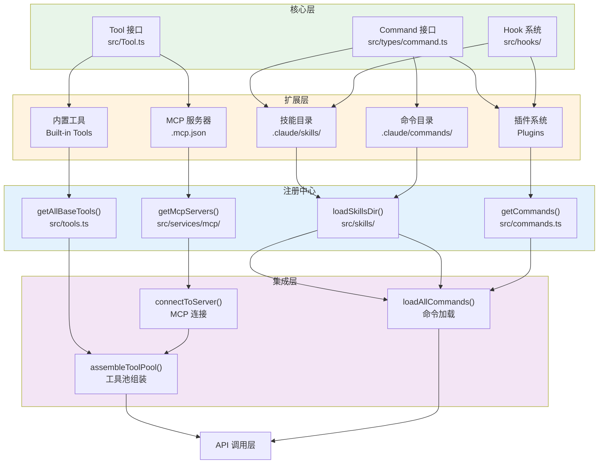
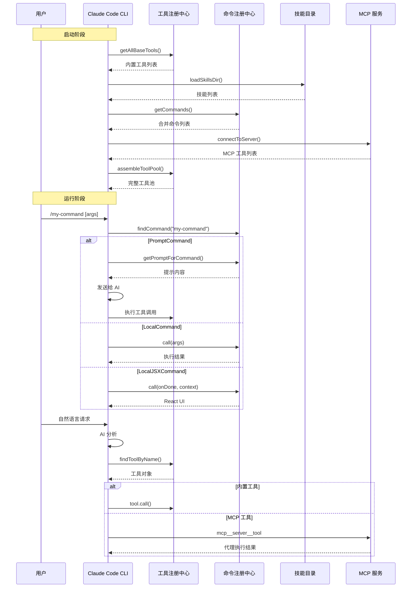

# 第 48 章：可扩展性设计

## 48.1 引言

Claude Code 的可扩展性设计是其作为"agentic coding tool"的核心优势。通过统一的扩展架构，用户可以从多个维度增强 CLI 的能力：

1. **工具扩展**：添加新的操作能力，如文件处理、网络请求、数据分析
2. **命令扩展**：添加新的斜杠命令，如 `/my-custom-command`
3. **技能扩展**：注入领域知识，如代码审查规范、部署流程
4. **MCP 扩展**：连接外部服务，如数据库、API、IDE 工具

这四种扩展方式形成了完整的扩展矩阵，覆盖从轻量配置到重量级服务集成的所有场景。

---

## 48.2 扩展点架构总览

### 48.2.1 扩展点关系图

Claude Code 的扩展点形成清晰的层次结构：



**图 48-1（figure-48-1）：扩展点架构图**

### 48.2.2 扩展方式对比

四种扩展方式的特征对比：

| 扩展方式 | 定义位置 | 复杂度 | 适用场景 | 特权级别 |
|---------|---------|--------|---------|---------|
| **工具扩展** | TypeScript 代码 | 高 | 新操作能力、复杂逻辑 | 编译时 |
| **命令扩展** | TypeScript 代码 | 中 | 用户交互入口、UI 组件 | 编译时 |
| **技能扩展** | Markdown 文件 | 低 | 领域知识注入、提示模板 | 运行时 |
| **MCP 扩展** | JSON 配置 + 外部服务 | 可变 | 外部系统集成、动态发现 | 运行时 |

---

## 48.3 工具扩展

### 48.3.1 工具定义核心要素

添加新工具需要实现 `Tool` 接口，核心要素包括：

```typescript
// src/Tool.ts - Tool 类型核心定义
export type Tool<
  Input extends AnyObject = AnyObject,
  Output = unknown,
  P extends ToolProgressData = ToolProgressData,
> = {
  // === 身份标识 ===
  name: string                    // 工具唯一名称
  aliases?: string[]              // 别名列表（向后兼容）

  // === 输入验证 ===
  inputSchema: Input              // Zod 输入验证 schema
  inputJSONSchema?: ToolInputJSONSchema  // JSON Schema（MCP 工具）

  // === 执行方法 ===
  call(args, context): Promise<ToolResult<Output>>  // 核心执行方法
  description(input): Promise<string>  // 动态描述生成

  // === 权限控制 ===
  isEnabled(): boolean            // 是否启用
  isConcurrencySafe(input): boolean  // 是否可并发执行
  isReadOnly(input): boolean      // 是否只读操作
  isDestructive(input): boolean   // 是否破坏性操作
  checkPermissions(input, context): Promise<PermissionResult>  // 权限检查

  // === UI 渲染 ===
  renderToolUseMessage(input): ReactNode  // 工具使用消息
  renderToolResultMessage(content): ReactNode  // 结果消息
}
```

### 48.3.2 buildTool 工厂模式

使用 `buildTool()` 工厂函数简化工具定义：

```typescript
// src/Tool.ts:783-792
export function buildTool<D extends AnyToolDef>(def: D): BuiltTool<D> {
  return {
    ...TOOL_DEFAULTS,  // 应用安全默认值
    userFacingName: () => def.name,
    ...def,
  } as BuiltTool<D>
}
```

**安全默认值配置**：

```typescript
// src/Tool.ts:757-769
const TOOL_DEFAULTS = {
  isEnabled: () => true,                        // 默认启用
  isConcurrencySafe: (_input) => false,         // 默认不安全（fail-close）
  isReadOnly: (_input) => false,                // 默认假设写操作
  isDestructive: (_input) => false,             // 默认非破坏性
  checkPermissions: (input) =>
    Promise.resolve({ behavior: 'allow', updatedInput: input }),
  userFacingName: () => '',
}
```

### 48.3.3 工具定义示例

以简化的自定义工具为例：

```typescript
// 自定义工具定义示例
import { buildTool, type ToolDef } from '../Tool.js'
import { z } from 'zod'

const MyCustomToolInputSchema = z.object({
  target: z.string().describe('操作目标'),
  action: z.enum(['analyze', 'transform', 'validate']).describe('操作类型'),
})

type MyCustomToolInput = z.infer<typeof MyCustomToolInputSchema>

const MyCustomToolDef: ToolDef<MyCustomToolInput, string> = {
  name: 'MyCustomTool',
  inputSchema: MyCustomToolInputSchema,

  async description() {
    return '执行自定义操作：分析、转换或验证目标对象'
  },

  async call(args, context) {
    // 执行核心逻辑
    const result = await performCustomAction(args.target, args.action)

    return {
      result: result,
      status: 'success',
  },

  // 显式声明安全属性
  isConcurrencySafe: () => true,   // 可并发执行
  isReadOnly: () => true,          // 只读操作
  isDestructive: () => false,      // 非破坏性

  // 自定义权限检查
  async checkPermissions(input, context) {
    if (input.action === 'transform') {
      return { behavior: 'ask', message: '确认执行转换操作？' }
    }
    return { behavior: 'allow' }
  },

  // UI 渲染
  renderToolUseMessage(input) {
    return `执行 ${input.action} 操作于 ${input.target}`
  },
}

export const MyCustomTool = buildTool(MyCustomToolDef)
```

### 48.3.4 工具注册流程

新工具需要在 `src/tools.ts` 中注册：

```typescript
// src/tools.ts:193-251
export function getAllBaseTools(): Tools {
  return [
    AgentTool,
    BashTool,
    FileReadTool,
    FileEditTool,
    FileWriteTool,
    // ... 其他内置工具

    MyCustomTool,  // <-- 添加新工具

    // 条件加载的工具
    ...(hasEmbeddedSearchTools() ? [] : [GlobTool, GrepTool]),
    ...(isEnvTruthy(process.env.ENABLE_LSP_TOOL) ? [LSPTool] : []),
    ...(isWorktreeModeEnabled() ? [EnterWorktreeTool, ExitWorktreeTool] : []),
  ]
}
```

**工具注册要点**：

| 步骤 | 操作 | 文件位置 |
|------|------|---------|
| 1. 创建工具文件 | 定义 `ToolDef` 并导出 | `src/tools/MyCustomTool/MyCustomTool.ts` |
| 2. 导入工具 | 在 `tools.ts` 中添加 import | `src/tools.ts:3-13` |
| 3. 注册到列表 | 在 `getAllBaseTools()` 中添加 | `src/tools.ts:193-251` |
| 4. 测试验证 | 确认工具可用且权限正确 | 测试文件 |

### 48.3.5 条件加载机制

工具可通过多种机制控制加载时机：

```typescript
// Feature Flag 控制
const SleepTool = feature('PROACTIVE') || feature('KAIROS')
  ? require('./tools/SleepTool/SleepTool.js').SleepTool
  : null

// 环境变量控制
const REPLTool = process.env.USER_TYPE === 'ant'
  ? require('./tools/REPLTool/REPLTool.js').REPLTool
  : null

// 运行时条件控制
...(isTodoV2Enabled() ? [TaskCreateTool, TaskUpdateTool] : []),
...(isWorktreeModeEnabled() ? [EnterWorktreeTool, ExitWorktreeTool] : []),
```

---

## 48.4 命令扩展

### 48.4.1 命令类型选择

Claude Code 定义三种命令类型，根据执行需求选择：

| 类型 | 执行方式 | 适用场景 | 示例 |
|------|---------|---------|------|
| `PromptCommand` | AI 模型执行 | 需要 AI 判断的复杂任务 | `/commit`, `/review` |
| `LocalCommand` | TypeScript 直接执行 | 确定性操作、信息查询 | `/cost`, `/version` |
| `LocalJSXCommand` | React 组件渲染 | 交互式 UI、配置面板 | `/config`, `/help` |

### 48.4.2 PromptCommand 定义

`PromptCommand` 生成 AI 提示而非直接执行：

```typescript
// PromptCommand 定义示例
import { type Command, type ContentBlockParam } from '../types/command.js'

const myPromptCommand: Command = {
  type: 'prompt',
  name: 'my-command',
  description: '执行自定义 AI 辅助任务',

  // 限制 AI 可用工具
  allowedTools: ['Read', 'Grep', 'Bash(git *)'],

  // 参数提示
  argumentHint: '[target]',

  // 进度消息
  progressMessage: 'analyzing',

  // 内容长度估算
  contentLength: 500,

  // 来源标记
  source: 'builtin',

  // 核心方法：生成提示
  async getPromptForCommand(args, context): Promise<ContentBlockParam[]> {
    const promptContent = `
# 任务说明
执行以下分析任务：${args || '默认分析'}

## 可用工具
- Read: 读取文件
- Grep: 搜索代码
- Bash(git *): Git 操作

## 执行步骤
1. 分析目标文件结构
2. 提取关键信息
3. 生成报告
`
    return [{ type: 'text', text: promptContent }]
  },
}
```

### 48.4.3 LocalCommand 定义

`LocalCommand` 直接执行 TypeScript 代码：

```typescript
// LocalCommand 定义示例
import { type Command, type LocalCommandCall, type LocalCommandResult } from '../types/command.js'

const call: LocalCommandCall = async (args, context) => {
  // 直接执行逻辑
  const result = await performOperation(args)

  // 返回结果
  return {
    type: 'text',
    value: `操作完成：${result}`,
  }
}

const myLocalCommand: Command = {
  type: 'local',
  name: 'my-local',
  description: '执行本地操作',
  supportsNonInteractive: true,  // 支持非交互模式

  // 延迟加载实现
  load: () => Promise.resolve({ call }),

  // 条件启用
  isEnabled: () => process.env.MY_FEATURE === 'enabled',
}
```

### 48.4.4 LocalJSXCommand 定义

`LocalJSXCommand` 返回 React 组件渲染交互式 UI：

```typescript
// LocalJSXCommand 定义示例
import { type Command, type LocalJSXCommandCall } from '../types/command.js'
import { MyCustomPanel } from './components/MyCustomPanel.js'

const call: LocalJSXCommandCall = async (onDone, context, args) => {
  return <MyCustomPanel
    onClose={onDone}
    context={context}
    initialArgs={args}
  />
}

const myJSXCommand: Command = {
  type: 'local-jsx',
  name: 'my-panel',
  description: '打开自定义配置面板',

  // 延迟加载
  load: () => import('./myPanel.js'),

  // 动态描述
  get description() {
    return `当前状态: ${getCurrentState()}`
  },
}
```

### 48.4.5 命令注册流程

命令在 `src/commands.ts` 中注册：

```typescript
// src/commands.ts:258-346
const COMMANDS = memoize((): Command[] => [
  addDir,
  config,
  help,
  // ... 其他内置命令

  myCommand,  // <-- 添加新命令

  // 条件加载
  ...(process.env.USER_TYPE === 'ant' ? INTERNAL_ONLY_COMMANDS : []),
  ...(feature('WEB_BROWSER') ? [webCmd] : []),
])
```

**命令注册要点**：

| 步骤 | 操作 | 文件位置 |
|------|------|---------|
| 1. 创建命令目录 | 建立 `commands/myCommand/` | `src/commands/` |
| 2. 创建 index.ts | 导出命令定义 | `src/commands/myCommand/index.ts` |
| 3. 创建实现文件 | 实现 `call` 函数 | `src/commands/myCommand/myCommand.ts` |
| 4. 导入并注册 | 在 `commands.ts` 中添加 | `src/commands.ts` |

---

## 48.5 技能扩展

### 48.5.1 技能文件结构

技能以 Markdown 文件定义，支持两种格式：

**目录格式（推荐）**：
```
.claude/skills/my-skill/
├── SKILL.md        # 技能定义
├── templates/      # 模板文件
├── scripts/        # 辅助脚本
└── README.md       # 说明文档
```

**单文件格式（legacy）**：
```
.claude/commands/my-command.md
```

### 48.5.2 Frontmatter 配置

技能通过 YAML Frontmatter 配置元数据：

```yaml
---
# === 基本信息 ===
name: code-review
description: 执行代码审查，检查安全漏洞和代码质量

# === 使用场景 ===
when_to_use: 当需要审查 PR、代码变更或进行安全审计时使用
argument-hint: "[PR号|分支名]"

# === 工具限制 ===
allowed-tools:
  - Read
  - Grep
  - Bash(git diff*)
  - WebFetch

# === 模型配置 ===
model: claude-sonnet-4-6
effort: high

# === 执行上下文 ===
context: fork          # 在子 Agent 中执行
agent: general-purpose

# === 条件激活 ===
paths:
  - "src/**/*.ts"
  - "tests/**/*.ts"

# === Hooks 配置 ===
hooks:
  PreToolUse:
    - matcher: "Bash"
      hooks:
        - type: command
          command: "echo '即将执行 Bash 命令'"
  PostToolUse:
    - matcher: "Write"
      hooks:
        - type: command
          command: "${CLAUDE_SKILL_DIR}/hooks/post-write.sh"

# === 可见性控制 ===
user-invocable: true
disable-model-invocation: false
---
```

### 48.5.3 Frontmatter 字段详解

| 字段 | 类型 | 说明 | 示例 |
|------|------|------|------|
| `name` | string | 技能名称 | `code-review` |
| `description` | string | 技能描述 | `执行代码审查` |
| `when_to_use` | string | 使用场景提示 | `审查 PR 时使用` |
| `allowed-tools` | string[] | 允许工具列表 | `[Read, Grep]` |
| `argument-hint` | string | 参数提示 | `[PR号]` |
| `model` | string | 专属模型 | `claude-sonnet-4-6` |
| `context` | `inline` \| `fork` | 执行上下文 | `fork` |
| `agent` | string | Fork Agent 类型 | `general-purpose` |
| `effort` | string \| number | 努力级别 | `high` |
| `paths` | string[] | 条件激活路径 | `src/**/*.ts` |
| `hooks` | HooksSettings | Hooks 配置 | `{PreToolUse: [...]}` |
| `user-invocable` | boolean | 用户可调用 | `true` |

### 48.5.4 技能内容编写

技能内容是发送给 AI 的提示模板：

```markdown
# Code Review Skill

## 目标
执行全面的代码审查，识别：
- 安全漏洞
- 性能问题
- 代码质量问题
- 最佳实践偏差

## 审查步骤

1. **获取变更内容**
   使用 `Bash(git diff*)` 获取待审查的代码变更

2. **分析变更影响**
   - 识别修改的文件和模块
   - 评估变更的范围和影响

3. **检查安全性**
   - SQL 注入风险
   - 硬编码敏感信息
   - 不安全的依赖

4. **检查代码质量**
   - 代码风格一致性
   - 注释和文档完整性
   - 测试覆盖率

5. **生成审查报告**
   按以下格式输出：

   ```
   ## 审查摘要
   - 文件数量: X
   - 问题数量: Y

   ## 问题详情
   1. [严重程度] 问题描述
      - 位置: file:line
      - 建议: 修复方案

   ## 总体评价
   - 评分: A/B/C/D
   - 建议: 综合建议
   ```

## 环境变量

- `${CLAUDE_SKILL_DIR}`: 技能目录路径
- `${CLAUDE_SESSION_ID}`: 当前会话 ID

## Shell 命令注入

支持在提示中注入动态内容：

!`git status --short`  # 行内命令注入

```bash
!git log --oneline -5
```  # 块级命令注入
```

### 48.5.5 技能加载来源

技能按优先级从多个来源加载：

```typescript
// src/skills/loadSkillsDir.ts:679-714
const [
  managedSkills,      // 企业策略目录
  userSkills,         // ~/.claude/skills
  projectSkills,      // .claude/skills (向上遍历)
  additionalSkills,   // --add-dir 指定目录
  legacyCommands,     // .claude/commands (旧格式)
] = await Promise.all([
  loadSkillsFromSkillsDir(managedSkillsDir, 'policySettings'),
  loadSkillsFromSkillsDir(userSkillsDir, 'userSettings'),
  Promise.all(projectSkillsDirs.map(dir =>
    loadSkillsFromSkillsDir(dir, 'projectSettings'),
  )),
  Promise.all(additionalDirs.map(dir =>
    loadSkillsFromSkillsDir(join(dir, '.claude', 'skills'), 'projectSettings'),
  )),
  loadSkillsFromCommandsDir(cwd),
])
```

**加载优先级**：

| 来源 | 位置 | 优先级 | 说明 |
|------|------|--------|------|
| Managed | 企业策略目录 | 最高 | 企业强制配置 |
| User | `~/.claude/skills` | 高 | 用户全局技能 |
| Project | `.claude/skills` | 中 | 项目技能 |
| Additional | `--add-dir` | 低 | 额外目录 |
| Legacy | `.claude/commands` | 最低 | 旧格式 |

### 48.5.6 条件技能激活

技能可通过 `paths` 字段定义为条件技能：

```yaml
paths:
  - "src/**/*.ts"
  - "tests/**/*.ts"
```

当用户操作匹配路径时，技能自动激活：

```typescript
// src/skills/loadSkillsDir.ts:997-1058
export function activateConditionalSkillsForPaths(
  filePaths: string[],
  cwd: string,
): string[] {
  for (const [name, skill] of conditionalSkills) {
    if (!skill.paths) continue

    const skillIgnore = ignore().add(skill.paths)
    for (const filePath of filePaths) {
      if (skillIgnore.ignores(relativePath)) {
        // 激活技能
        dynamicSkills.set(name, skill)
        conditionalSkills.delete(name)
        activated.push(name)
        break
      }
    }
  }
  return activated
}
```

---

## 48.6 MCP 扩展

### 48.6.1 MCP 配置结构

MCP 服务器通过 JSON 配置文件定义：

**项目级配置** `.mcp.json`：
```json
{
  "mcpServers": {
    "my-server": {
      "type": "stdio",
      "command": "node",
      "args": ["server.js"],
      "env": {
        "API_KEY": "${MY_API_KEY}"
      }
    },
    "remote-server": {
      "type": "http",
      "url": "https://api.example.com/mcp",
      "headers": {
        "Authorization": "Bearer ${TOKEN}"
      }
    }
  }
}
```

**用户级配置** `~/.claude/settings.json`：
```json
{
  "mcpServers": {
    "global-server": {
      "type": "stdio",
      "command": "/usr/local/bin/my-mcp-server"
    }
  }
}
```

### 48.6.2 传输类型配置

MCP 支持多种传输类型：

| 类型 | 配置字段 | 适用场景 | 示例 |
|------|---------|---------|------|
| `stdio` | `command`, `args`, `env` | 本地进程 | `{"type": "stdio", "command": "npx", "args": ["-y", "@modelcontextprotocol/server-filesystem"]}` |
| `sse` | `url`, `headers` | Server-Sent Events | `{"type": "sse", "url": "https://server.example.com/sse"}` |
| `http` | `url`, `headers` | Streamable HTTP | `{"type": "http", "url": "https://server.example.com/mcp"}` |
| `ws` | `url`, `headers` | WebSocket | `{"type": "ws", "url": "wss://server.example.com/ws"}` |

### 48.6.3 环境变量替换

MCP 配置支持环境变量替换：

```json
{
  "mcpServers": {
    "my-server": {
      "type": "stdio",
      "command": "node",
      "args": ["${PROJECT_ROOT}/server.js"],
      "env": {
        "API_KEY": "${MY_API_KEY}",
        "DEBUG": "${DEBUG:-false}"
      }
    }
  }
}
```

**支持的变量**：

| 变量 | 说明 |
|------|------|
| `${ENV_VAR}` | 环境变量替换 |
| `${ENV_VAR:-default}` | 带默认值的环境变量 |
| `${PROJECT_ROOT}` | 项目根目录 |
| `${CLAUDE_CONFIG_DIR}` | Claude 配置目录 |

### 48.6.4 MCP 服务器能力暴露

MCP 服务器可暴露三种能力：

```typescript
// src/services/mcp/client.ts:2172-2192
const [tools, commands, resources] = await Promise.all([
  fetchToolsForClient(client),      // 工具列表
  fetchCommandsForClient(client),    // 提示（命令）
  fetchResourcesForClient(client),   // 资源列表
])
```

**能力类型**：

| 能力 | MCP 方法 | Claude Code 转换 |
|------|---------|-----------------|
| Tools | `tools/list` | `Tool` 对象，名称前缀 `mcp__server__tool` |
| Prompts | `prompts/list` | `Command` 对象，类型为 `PromptCommand` |
| Resources | `resources/list` | `ServerResource` 对象，通过专用工具读取 |

### 48.6.5 MCP 工具命名规范

MCP 工具使用前缀命名规范避免冲突：

```typescript
// src/services/mcp/mcpStringUtils.ts
export function buildMcpToolName(serverName: string, toolName: string): string {
  const normalizedServerName = normalizeNameForMCP(serverName)
  const normalizedToolName = normalizeNameForMCP(toolName)
  return `mcp__${normalizedServerName}__${normalizedToolName}`
}
```

示例：
- 服务器 `filesystem` 的工具 `read_file` -> `mcp__filesystem__read_file`
- 服务器 `github` 的工具 `create_issue` -> `mcp__github__create_issue`

### 48.6.6 MCP 配置优先级

MCP 配置按来源优先级合并：

```typescript
// src/services/mcp/config.ts:223-266
export function dedupPluginMcpServers(
  pluginServers: Record<string, ScopedMcpServerConfig>,
  manualServers: Record<string, ScopedMcpServerConfig>,
): { servers: Record<string, ScopedMcpServerConfig>, suppressed: [...] } {
  // 手动配置优先于插件配置
  const manualSigs = new Map<string, string>()
  for (const [name, config] of Object.entries(manualServers)) {
    const sig = getMcpServerSignature(config)
    if (sig) manualSigs.set(sig, name)
  }

  // 检查插件服务器是否与手动配置冲突
  for (const [name, config] of Object.entries(pluginServers)) {
    const sig = getMcpServerSignature(config)
    if (manualSigs.has(sig)) {
      suppressed.push({ name, duplicateOf: manualSigs.get(sig) })
      continue  // 手动配置优先
    }
    servers[name] = config
  }
}
```

**配置优先级**：

| 来源 | 优先级 | 配置文件 |
|------|--------|---------|
| Enterprise | 最高 | 企业策略配置 |
| Local | 高 | 项目私有配置 |
| Project | 中 | `.mcp.json` |
| User | 低 | `~/.claude/settings.json` |
| Plugin | 最低 | 插件内嵌配置 |

---

## 48.7 扩展指南汇总表

### 48.7.1 扩展方式选择指南

根据需求选择合适的扩展方式：

| 需求场景 | 推荐扩展方式 | 原因 |
|---------|-------------|------|
| 添加新操作类型（如数据库查询） | MCP 扩展 | 外部服务集成，无需修改 CLI |
| 注入领域知识（如代码规范） | 技能扩展 | Markdown 文件，易于维护 |
| 添加用户交互入口 | 命令扩展 | 斜杠命令形式，用户友好 |
| 添加复杂逻辑处理 | 工具扩展 | TypeScript 实现，功能完整 |
| 连接现有工具/服务 | MCP 扩展 | 标准 MCP 服务器生态丰富 |
| 自动化工作流 | 技能扩展 + Hooks | 工具执行前后自动触发 |

### 48.7.2 扩展开发流程表

| 扩展类型 | 开发步骤 | 测试方法 | 发布方式 |
|---------|---------|---------|---------|
| **工具扩展** | 1. 创建 ToolDef<br>2. 实现 call()<br>3. 注册到 getAllBaseTools() | 功能测试 + 权限测试 | 编译发布 |
| **命令扩展** | 1. 选择命令类型<br>2. 实现处理逻辑<br>3. 注册到 COMMANDS | 交互测试 + 输出验证 | 编译发布 |
| **技能扩展** | 1. 创建 SKILL.md<br>2. 编写 Frontmatter<br>3. 编写提示内容 | 运行 `/skill-name` | 文件共享 |
| **MCP 扩展** | 1. 编写 MCP 服务器<br>2. 配置 .mcp.json<br>3. 测试连接 | 工具调用测试 | 配置分享 |

### 48.7.3 扩展能力矩阵

不同扩展方式的能力范围：

| 能力 | 工具扩展 | 命令扩展 | 技能扩展 | MCP 扩展 |
|------|---------|---------|---------|---------|
| 执行操作 | 完整支持 | PromptCommand 间接 | 间接（AI 调用） | 代理执行 |
| UI 渲染 | 工具消息 | JSX 组件 | 无 | 工具消息 |
| 权限控制 | 完整支持 | 基本支持 | allowed-tools | 继承 MCP 配置 |
| Hooks 支持 | 可被 Hook | 无 | 可定义 Hooks | 可被 Hook |
| 条件激活 | isEnabled() | isEnabled() | paths 配置 | 配置 scope |
| 模型配置 | 无 | model 字段 | model 字段 | 继承默认 |
| 并发安全 | 声明式 | 无 | 无 | readOnlyHint |

---

## 48.8 扩展点交互图

四种扩展方式通过统一的注册中心交互：



**图 48-2（figure-48-2）：扩展点交互时序图**

---

## 48.9 小结

Claude Code 的可扩展性设计通过四个维度提供完整的扩展能力：

1. **工具扩展**：通过统一的 `Tool` 接口和 `buildTool()` 工厂，添加新的操作能力。适用于需要完整执行逻辑和权限控制的场景。

2. **命令扩展**：通过三种命令类型（PromptCommand、LocalCommand、LocalJSXCommand），添加用户交互入口。适用于 AI 辅助任务、确定性操作和交互式 UI。

3. **技能扩展**：通过 Markdown 文件和 YAML Frontmatter，注入领域知识和自动化流程。适用于提示模板、条件激活和 Hooks 配置。

4. **MCP 扩展**：通过 MCP 协议连接外部服务，动态发现工具和资源。适用于外部系统集成、现有工具生态利用。

四种扩展方式通过统一的注册中心（工具注册、命令注册）和合并机制（`assembleToolPool()`、`loadAllCommands()`）实现无缝集成，形成完整的扩展矩阵。

Claude Code 的可扩展性设计体现了以下原则：

- **统一抽象**：所有扩展通过统一的接口定义，确保一致性
- **分层加载**：扩展按优先级从多个来源加载，支持灵活配置
- **安全优先**：工具扩展采用 fail-close 策略，新扩展需显式声明安全
- **热重载**：技能和 MCP 配置变更自动生效，无需重启

通过深入理解这些扩展机制，开发者可以根据需求选择合适的扩展方式，最大化 Claude Code 的能力边界。

---

**相关章节**：
- 第 8 章：工具架构总览
- 第 18 章：命令系统架构
- 第 20 章：技能系统架构
- 第 22 章：插件系统
- 第 25 章：MCP 服务集成
- 第 46 章：架构设计原则总结