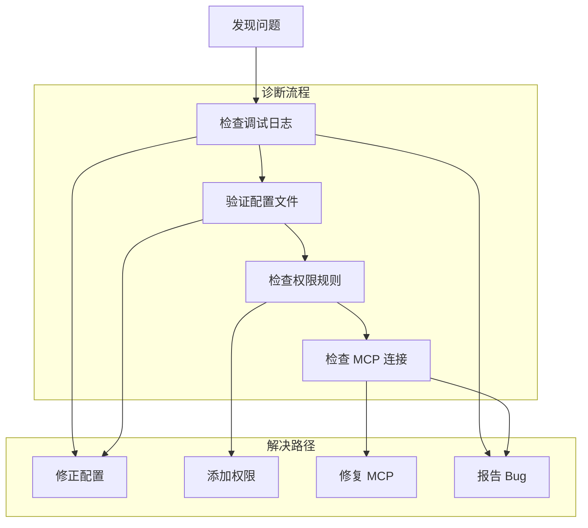
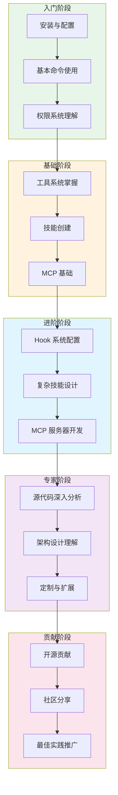

# 第四十九章：学习资源与社区

> 本章汇总 Claude Code 的官方文档、社区资源、最佳实践和进阶学习路径，帮助读者持续深入学习 Claude Code 源代码和相关技术。

---

## 49.1 引言

学习 Claude Code 源代码是一段持续深入的旅程。通过本书前面四十八章的详细分析，读者已经掌握了 Claude Code 的核心架构、关键模块和实现细节。然而，源代码学习并非终点，而是起点——持续跟进官方更新、参与社区讨论、实践最佳实践，才能真正将知识转化为能力。

本章将系统性地整理 Claude Code 的学习生态系统：

1. **官方文档资源**：Anthropic 官方提供的权威文档
2. **社区贡献资源**：GitHub 社区、讨论区、开源项目
3. **最佳实践指南**：高效使用 Claude Code 的建议
4. **进阶学习路径**：从入门到专家的成长路线

---

## 49.2 官方文档资源

### 49.2.1 Anthropic 官方文档

Anthropic 提供了完整的 Claude Code 文档体系，是学习的首要参考来源。

**表 49-1：官方文档资源链接**

| 资源名称 | URL | 说明 |
|---------|-----|------|
| Claude Code 主文档 | `https://docs.anthropic.com/en/docs/claude-code` | Claude Code CLI 的完整使用指南 |
| 快速入门 | `https://docs.anthropic.com/en/docs/claude-code/quickstart` | 快速上手教程 |
| 工具参考 | `https://docs.anthropic.com/en/docs/claude-code/tools` | 内置工具的详细说明 |
| 技能系统 | `https://docs.anthropic.com/en/docs/claude-code/skills` | 技能创建和使用指南 |
| MCP 集成 | `https://docs.anthropic.com/en/docs/claude-code/mcp` | MCP 协议集成文档 |
| Hook 系统 | `https://docs.anthropic.com/en/docs/claude-code/hooks` | 钩子配置和使用 |
| 配置管理 | `https://docs.anthropic.com/en/docs/claude-code/settings` | settings.json 配置详解 |
| 权限系统 | `https://docs.anthropic.com/en/docs/claude-code/permissions` | 权限规则和安全机制 |
| 遥测与分析 | `https://docs.anthropic.com/en/docs/claude-code/telemetry` | 数据收集和隐私说明 |
| 内存管理 | `https://docs.anthropic.com/en/docs/claude-code/memory` | 自动内存和上下文压缩 |

### 49.2.2 Claude API 文档

Claude Code 底层使用 Anthropic Claude API，理解 API 有助于理解源代码中的网络层设计。

**表 49-2：Claude API 相关文档**

| 资源名称 | URL | 说明 |
|---------|-----|------|
| Claude API 主页 | `https://docs.anthropic.com/en/api` | API 总览和入口 |
| Messages API | `https://docs.anthropic.com/en/api/messages` | 核心对话 API |
| Tools 使用 | `https://docs.anthropic.com/en/api/tools-use` | 工具调用机制 |
| 流式响应 | `https://docs.anthropic.com/en/api/streaming` | SSE 流式输出 |
| Prompt Caching | `https://docs.anthropic.com/en/api/prompt-caching` | 提示词缓存机制 |
| Token 计数 | `https://docs.anthropic.com/en/api/tokens` | Token 统计和计费 |
| 模型参考 | `https://docs.anthropic.com/en/api/models` | Claude 模型规格对比 |

### 49.2.3 Anthropic SDK 文档

Claude Code 使用 `@anthropic-ai/sdk` 进行 API 通信。

**表 49-3：SDK 相关资源**

| 资源名称 | URL | 说明 |
|---------|-----|------|
| Node SDK | `https://github.com/anthropics/anthropic-sdk-typescript` | TypeScript/Node.js SDK |
| SDK 文档 | `https://docs.anthropic.com/en/api/client-sdk` | SDK 使用指南 |
| Python SDK | `https://github.com/anthropics/anthropic-sdk-python` | Python SDK 仓库 |

---

## 49.3 社区贡献资源

### 49.3.1 GitHub 官方仓库

Anthropic 在 GitHub 上维护多个与 Claude Code 相关的仓库。

**表 49-4：GitHub 官方仓库**

| 仓库 | URL | 说明 |
|-----|-----|------|
| Anthropic 官方 | `https://github.com/anthropics` | Anthropic 官方 GitHub 组织 |
| Claude Code | `https://github.com/anthropics/claude-code` | Claude Code CLI 仓库（如有） |
| MCP 规范 | `https://github.com/modelcontextprotocol/spec` | MCP 协议规范仓库 |
| MCP SDK | `https://github.com/modelcontextprotocol/typescript-sdk` | TypeScript MCP SDK |
| MCP Python SDK | `https://github.com/modelcontextprotocol/python-sdk` | Python MCP SDK |
| Anthropic SDK | `https://github.com/anthropics/anthropic-sdk-typescript` | Anthropic TypeScript SDK |

### 49.3.2 GitHub Discussions

GitHub Discussions 是社区交流的重要平台，适合提出问题、分享经验和讨论特性。

**参与方式**：
- 在相关仓库的 Discussions 区域发帖
- 使用标签分类问题类型（如 `question`、`feature-request`、`showcase`）
- 关注官方回复和社区最佳实践分享

### 49.3.3 社区开源项目

社区开发者创建了大量 Claude Code 相关的开源项目和工具。

**表 49-5：社区开源项目示例**

| 项目类型 | 示例说明 | 来源 |
|---------|---------|------|
| MCP Servers | 各类 MCP 服务器实现（数据库、API、工具） | GitHub 搜索 "mcp server" |
| Skills 库 | 社区分享的技能模板和工作流程 | GitHub、个人博客 |
| Hook 脚本 | 自定义钩子脚本集合 | GitHub Discussions |
| 插件市场 | 第三方插件市场和管理工具 | 社区项目 |
| 集成工具 | IDE 集成、自动化脚本 | GitHub |

### 49.3.4 技术博客与教程

社区技术博客提供实践经验和深入分析。

**推荐阅读方向**：
- Claude Code 使用技巧分享
- MCP 服务器开发教程
- 技能系统实战案例
- 性能优化实践经验
- 安全配置最佳实践

---

## 49.4 最佳实践指南

### 49.4.1 高效使用 Claude Code

基于源代码分析，以下是高效使用 Claude Code 的核心建议：

**1. 权限配置优化**

精确配置权限而非使用宽松规则，确保安全性和效率：

```json
// settings.json 示例
{
  "permissions": {
    "allow": [
      "Read(**)",
      "Edit(src/**)",
      "Bash(git:*)",
      "Bash(npm:*)"
    ],
    "deny": [
      "Bash(rm -rf:*)",
      "Read(.env)"
    ]
  }
}
```

**2. 上下文管理**

理解上下文压缩机制，主动管理对话上下文：

- 定期使用 `/compact` 压缩对话历史
- 将大型文件拆分为模块化处理
- 使用 `CLAUDE.md` 提供项目级上下文

**3. 技能系统利用**

创建复用技能减少重复工作：

- 使用 `/skillify` 将成功会话转化为技能
- 利用 `when_to_use` 实现自动触发
- 合理设置 `allowed-tools` 限制权限范围

**4. Hook 系统应用**

通过 Hook 实现自动化：

```json
// hooks.json 示例
{
  "hooks": {
    "PostToolUse": [{
      "matcher": "Bash(git commit:*)",
      "hooks": ["./scripts/notify-team.sh"]
    }]
  }
}
```

### 49.4.2 源代码学习建议

**1. 分层阅读策略**

按照本书章节顺序，从宏观到微观：

- 第 1 章：理解整体定位和架构
- 第 2-4 章：掌握启动流程和配置
- 第 8-16 章：深入工具系统
- 第 17-28 章：理解服务层设计

**2. 实践驱动学习**

结合实际项目阅读源代码：

- 遇到问题时定位相关源代码模块
- 尝试修改和调试验证理解
- 记录学习笔记和发现

**3. 关注关键设计模式**

Claude Code 采用多种设计模式：

| 模式 | 应用场景 | 参考章节 |
|-----|---------|---------|
| Factory Pattern | Tool 构建工厂 | 第 8 章 |
| Strategy Pattern | 权限检查策略 | 第 4 章 |
| Observer Pattern | 状态订阅机制 | 第 7 章 |
| Command Pattern | 斜杠命令系统 | 第 19 章 |
| Plugin Pattern | 技能和插件系统 | 第 22 章 |
| Middleware Pattern | Hook 系统 | 第 23 章 |

### 49.4.3 调试与诊断

**1. 调试日志启用**

使用 `/debug` 技能启用详细日志：

```bash
# 或设置环境变量
export CLAUDE_DEBUG=1
```

**2. 问题定位流程**



**图 49-1：问题诊断流程图**

---

## 49.5 进阶学习路径

### 49.5.1 学习路径总览

以下图展示了从入门到专家的学习路径：



**图 49-2：Claude Code 学习路径图（figure-49-1）**

### 49.5.2 各阶段详解

**入门阶段（1-2 周）**

| 里程碑 | 学习目标 | 参考资源 |
|-------|---------|---------|
| 安装与配置 | 完成安装、配置 API Key、理解基本参数 | 官方快速入门 |
| 基本命令使用 | 掌握 `/help`、`/compact`、斜杠命令 | 本书第 19 章 |
| 权限系统理解 | 理解 allow/deny 规则、配置 permissions | 本书第 4 章 |

**基础阶段（2-4 周）**

| 里程碑 | 学习目标 | 参考资源 |
|-------|---------|---------|
| 工具系统掌握 | 理解各工具用途、权限模式语法 | 本书第 8-16 章 |
| 技能创建 | 创建第一个自定义技能、理解 frontmatter | 本书第 21 章 |
| MCP 基础 | 连接 MCP 服务器、理解工具映射 | 本书第 24 章 |

**进阶阶段（4-8 周）**

| 里程碑 | 学习目标 | 参考资源 |
|-------|---------|---------|
| Hook 系统配置 | 配置生命周期钩子、编写脚本 | 本书第 23 章 |
| 复杂技能设计 | 设计多步骤工作流程技能 | 本书第 21 章 |
| MCP 服务器开发 | 开发自定义 MCP 服务器 | MCP SDK 文档 |

**专家阶段（持续）**

| 里程碑 | 学习目标 | 参考资源 |
|-------|---------|---------|
| 源代码深入分析 | 阅读和理解核心模块源代码 | 本书全部章节 |
| 架构设计理解 | 理解设计决策、模式应用 | 本书各章节分析 |
| 定制与扩展 | 创建插件、修改配置、定制行为 | 本书第 22 章 |

**贡献阶段（持续）**

| 里程碑 | 学习目标 | 参考资源 |
|-------|---------|---------|
| 开源贡献 | 提交 PR、修复 Bug、添加特性 | GitHub 贡献指南 |
| 社区分享 | 分享技能、Hook 脚本、教程 | GitHub Discussions |
| 最佳实践推广 | 撰写博客、组织分享 | 社区平台 |

### 49.5.3 推荐阅读顺序

针对不同背景的读者，推荐以下阅读顺序：

**开发者（熟悉 TypeScript/React）**：

```
第 1 章 → 第 2 章 → 第 8 章 → 第 9 章 → 第 21 章 → 第 24 章 → 按需阅读
```

**系统架构师**：

```
第 1 章 → 第 4 章 → 第 6 章 → 第 8 章 → 第 22 章 → 第 23 章 → 第 28 章
```

**产品/运维人员**：

```
第 1 章 → 第 19 章 → 第 21 章 → 第 22 章 → 第 24 章 → 第 28 章
```

**完整学习者**：

```
按章节顺序完整阅读，重点关注设计分析和代码引用
```

---

## 49.6 持续更新跟踪

### 49.6.1 版本更新关注

Claude Code 处于快速迭代阶段，建议持续跟踪更新：

**跟踪渠道**：

| 渠道 | URL | 更新频率 |
|-----|-----|---------|
| 官方博客 | `https://anthropic.com/news` | 重要版本发布 |
| GitHub Releases | 相关仓库 Releases 页面 | 每次发布 |
| CLI 版本检查 | `claude --version` | 本地检查 |
- Discord/Slack 社区（如有）

### 49.6.2 新特性学习

每次版本更新建议关注：

1. **新工具**：新增的 Tool 类型和使用方式
2. **新命令**：新增的斜杠命令
3. **配置变更**：settings.json 新增字段
4. **性能优化**：上下文管理、响应速度改进
5. **安全更新**：权限系统、隐私保护变更

---

## 49.7 总结

本章整理了 Claude Code 学习的完整生态系统：

1. **官方文档**：Anthropic 官方提供的权威文档是首要参考
2. **社区资源**：GitHub、Discussions、开源项目是实践经验来源
3. **最佳实践**：精确权限配置、上下文管理、技能复用提升效率
4. **学习路径**：从入门到专家的五阶段成长路线
5. **持续跟踪**：关注版本更新和新特性学习

源代码学习不是一次性任务，而是持续深入的旅程。通过本书建立的理解基础，结合官方文档和社区资源，读者可以在 Claude Code 生态中持续成长，从使用者成为贡献者和专家。

---

**附录：关键资源汇总**

| 类型 | 名称 | URL |
|-----|-----|-----|
| 官方文档 | Claude Code 主页 | `https://docs.anthropic.com/en/docs/claude-code` |
| 官方仓库 | Anthropic GitHub | `https://github.com/anthropics` |
| MCP 规范 | MCP Spec | `https://github.com/modelcontextprotocol/spec` |
| SDK | TypeScript SDK | `https://github.com/anthropics/anthropic-sdk-typescript` |
| 本书 | 源代码学习 | 本项目仓库 |

---

**相关章节**：
- 第 1 章：项目概述与开发环境
- 第 21 章：技能实战解析
- 第 22 章：插件系统
- 第 23 章：Hook 系统
- 第 24 章：API 客户端服务