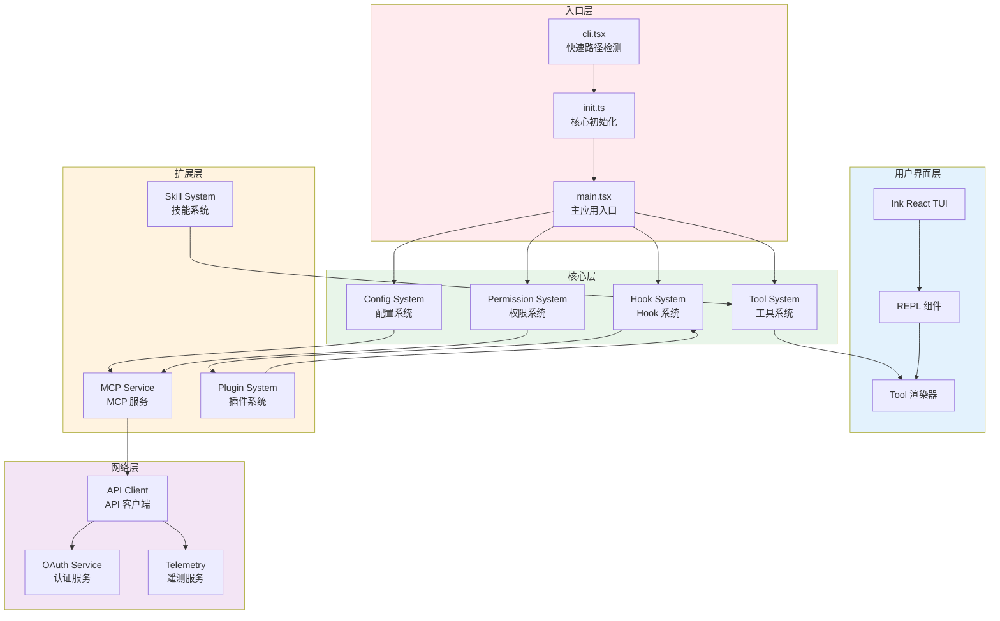
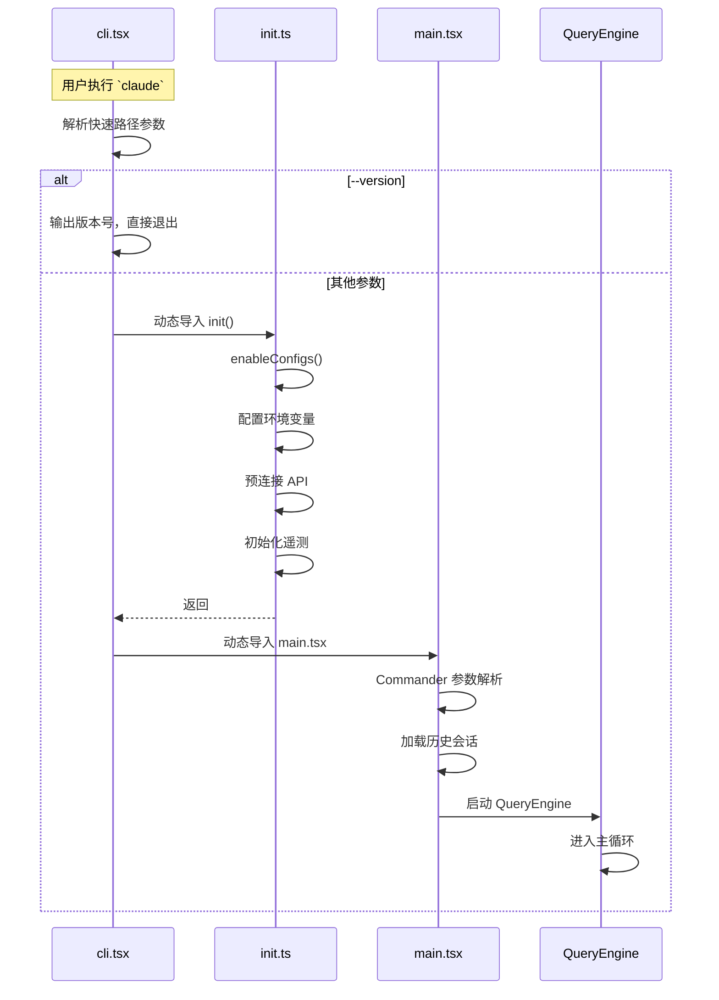
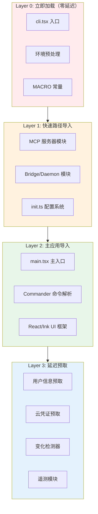
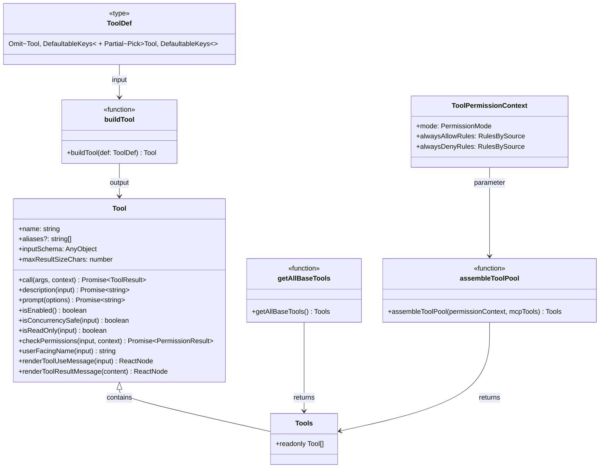
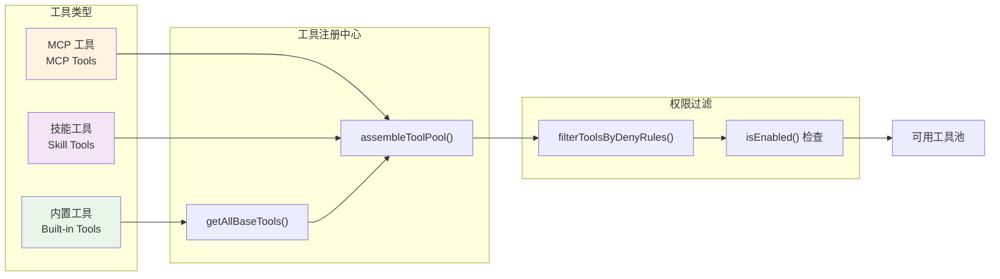
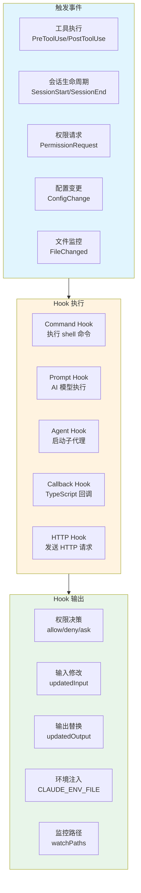
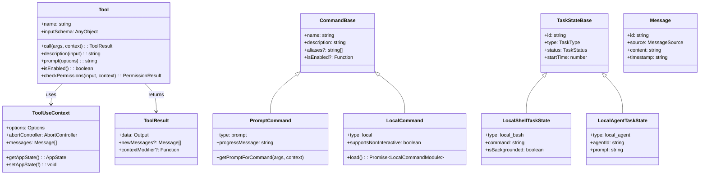
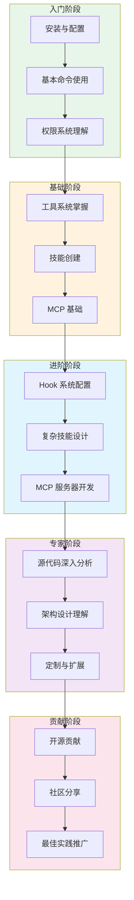
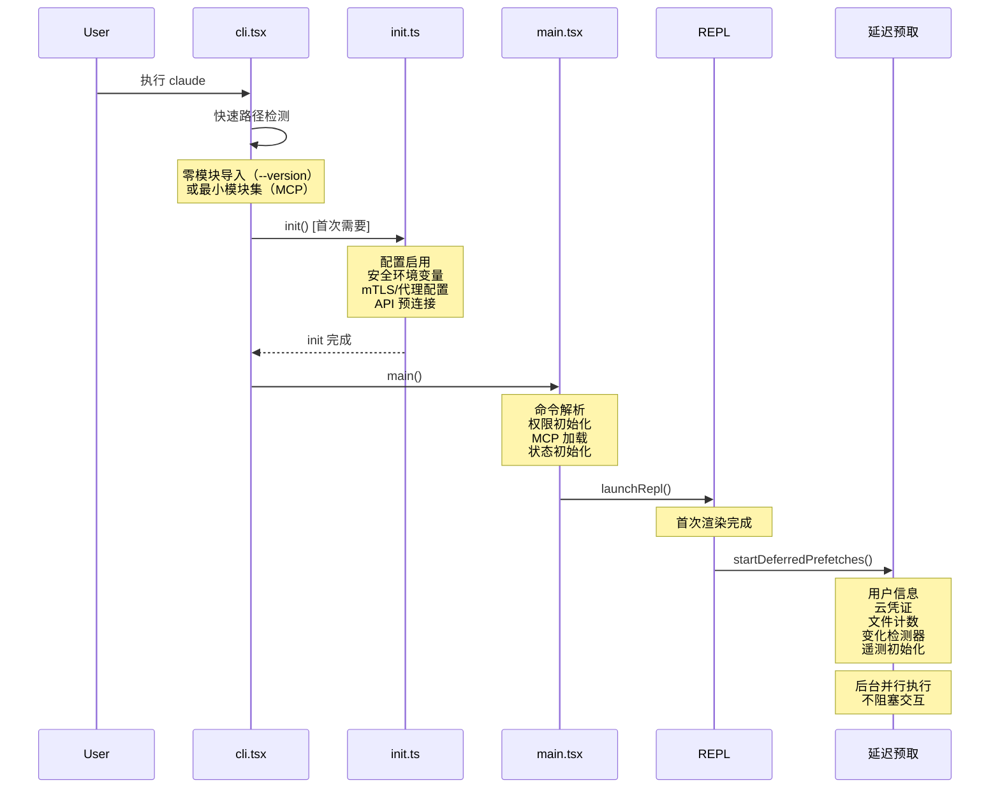
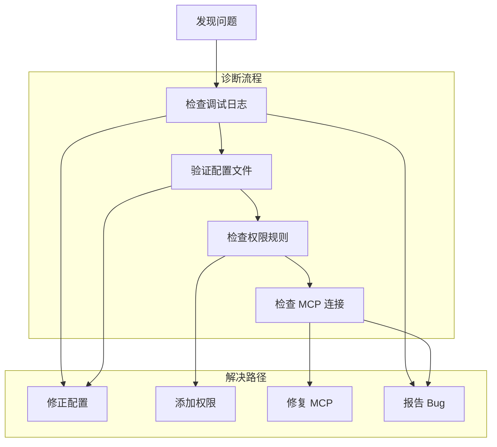

# 第五十章：附录

> 本章汇总 Claude Code 源代码学习过程中涉及的核心术语、关键文件索引、API 参考以及 Mermaid 图表集合，为读者提供快速查询的参考资料。
>
> **版本说明**：本书基于 Claude Code 源代码版本分析编写。由于 Claude Code 处于快速迭代阶段，源代码结构和具体实现可能随时变化。建议读者：
> - 以官方最新发布的版本为准
> - 结合官方文档验证具体实现
> - 使用 `/doctor` 命令检查当前版本信息
> - 关注 GitHub Releases 获取更新通知

---

## 50.1 附录内容概述

附录作为本书的参考资料章节，包含以下内容：

1. **术语表（Glossary）**：20+ 核心术语的定义和说明，帮助读者快速理解关键概念
2. **关键文件索引**：源代码中最重要的文件及其职责说明，方便定位和查阅
3. **API 参考**：核心接口和方法签名汇总，便于快速查询
4. **Mermaid 图表汇总**：全书架构图和流程图的集中展示

---

## 50.2 术语表（Glossary）

以下术语表定义了 Claude Code 源代码学习中的核心概念：

| 术语 | 英文名 | 定义 | 参考章节 |
|------|--------|------|----------|
| **Tool** | Tool | Claude Code 中定义 AI 可执行操作的核心接口，包含输入验证、权限检查、执行方法等 | 第 8 章 |
| **Command** | Command | 斜杠命令（如 `/commit`）的类型定义，分为 PromptCommand、LocalCommand、LocalJSXCommand 三种 | 第 18 章 |
| **Skill** | Skill | 通过 SKILL.md 文件定义的技能，允许封装复用的工作流程和上下文约束 | 第 20 章 |
| **Hook** | Hook | 生命周期钩子，允许在关键节点（如工具执行前后、会话开始结束）注入自定义逻辑 | 第 23 章 |
| **MCP** | Model Context Protocol | Anthropic 推出的模型上下文协议，用于连接外部工具和资源服务 | 第 25 章 |
| **AppState** | AppState | Claude Code 的全局状态管理对象，包含 100+ 状态字段 | 第 6 章 |
| **ToolUseContext** | ToolUseContext | 工具执行时的上下文对象，封装执行环境所需的所有信息 | 第 5 章 |
| **PermissionMode** | PermissionMode | 权限模式枚举，包括 default、plan、auto、bypass 四种模式 | 第 33 章 |
| **Sandbox** | Sandbox | 沙箱安全机制，限制文件系统和命令执行的权限范围 | 第 34 章 |
| **QueryEngine** | QueryEngine | 消息处理和工具执行的核心引擎，协调对话流程 | 第 38 章 |
| **Compaction** | Compaction | 上下文压缩机制，通过摘要和截断管理 Token 预算 | 第 26 章 |
| **Bridge** | Bridge | 远程控制架构，支持 WebSocket 双向通信和会话管理 | 第 29 章 |
| **Worktree** | Git Worktree | Git 工作树隔离机制，允许在同一仓库创建独立的工作目录 | 第 16 章 |
| **Coordinator** | Coordinator Mode | 多 Agent 协调模式，支持 Worker spawning 和 Scratchpad 知识共享 | 第 32 章 |
| **Feature Flag** | Feature Flag | 通过 `bun:bundle` 实现的构建时功能开关，支持死代码消除 | 第 3 章 |
| **Fast Path** | Fast Path | CLI 启动优化机制，通过快速路径检测实现零模块加载的快速响应 | 第 2 章 |
| **Lazy Loading** | Lazy Loading | 延迟加载策略，重型模块在需要时才加载，减少启动延迟 | 第 46 章 |
| **React Context** | React Context | React 的跨组件状态传递机制，用于通知、模态、统计等 | 第 7 章 |
| **Ink** | Ink | React 终端渲染引擎，通过 Yoga 布局引擎实现 Flexbox 布局 | 第 35 章 |
| **Prompt Caching** | Prompt Caching | Anthropic API 的提示词缓存机制，减少重复提示的 Token 消耗 | 第 24 章 |
| **Frontmatter** | Frontmatter | 技能文件顶部的 YAML 元数据块，定义技能属性和配置 | 第 20 章 |
| **TaskState** | TaskState | 后台任务状态类型联合，包含多种具体任务状态类型 | 第 5 章 |
| **Discriminated Union** | Discriminated Union | TypeScript 类型模式，通过 `type` 字段实现类型安全的分支判断 | 第 5 章 |
| **Fail-close** | Fail-close | 安全策略，默认拒绝或限制操作，需显式声明才允许 | 第 46 章 |
| **Plugin** | Plugin | 插件系统，允许通过外部包扩展 Claude Code 功能 | 第 22 章 |

---

## 50.3 关键文件索引

以下表格列出 Claude Code 源代码中最关键的文件及其职责：

### 50.3.1 入口点文件

| 文件路径 | 职责说明 | 参考章节 |
|----------|----------|----------|
| `src/entrypoints/cli.tsx` | CLI 最外层入口，处理 `--version` 等快速路径 | 第 2 章 |
| `src/entrypoints/init.ts` | 初始化序列，配置系统、遥测、OAuth 等 | 第 2 章 |
| `src/main.tsx` | 主应用入口，Commander 参数解析和主循环启动 | 第 2 章 |

### 50.3.2 核心抽象文件

| 文件路径 | 职责说明 | 参考章节 |
|----------|----------|----------|
| `src/Tool.ts` | Tool 类型定义和 buildTool 工厂函数 | 第 8 章 |
| `src/tools.ts` | 工具注册、聚合和过滤函数 | 第 8 章 |
| `src/commands.ts` | 命令类型定义和注册 | 第 18 章 |
| `src/QueryEngine.ts` | 消息处理和工具执行引擎 | 第 38 章 |
| `src/Task.ts` | 任务状态基础类型定义 | 第 5 章 |

### 50.3.3 状态管理文件

| 文件路径 | 职责说明 | 参考章节 |
|----------|----------|----------|
| `src/state/AppState.ts` | AppState 全局状态定义（100+ 字段） | 第 6 章 |
| `src/state/appStateStore.ts` | AppStateStore 实现，状态订阅机制 | 第 6 章 |
| `src/hooks/useAppState.ts` | useAppState 选择器 Hook | 第 6 章 |

### 50.3.4 工具实现文件

| 文件路径 | 职责说明 | 参考章节 |
|----------|----------|----------|
| `src/tools/BashTool/BashTool.ts` | Shell 命令执行工具 | 第 9 章 |
| `src/tools/FileReadTool/FileReadTool.ts` | 文件读取工具 | 第 10 章 |
| `src/tools/FileEditTool/FileEditTool.ts` | 文件编辑工具 | 第 10 章 |
| `src/tools/FileWriteTool/FileWriteTool.ts` | 文件写入工具 | 第 10 章 |
| `src/tools/GlobTool/GlobTool.ts` | 文件模式匹配工具 | 第 11 章 |
| `src/tools/GrepTool/GrepTool.ts` | 内容搜索工具（ripgrep 集成） | 第 11 章 |
| `src/tools/AgentTool/AgentTool.ts` | 子 Agent 启动工具 | 第 12 章 |
| `src/tools/WebFetchTool/WebFetchTool.ts` | 网页获取工具 | 第 13 章 |
| `src/tools/SkillTool/SkillTool.ts` | 技能执行工具 | 第 17 章 |
| `src/tools/EnterWorktreeTool/EnterWorktreeTool.ts` | 进入 Worktree 工具 | 第 16 章 |
| `src/tools/ExitWorktreeTool/ExitWorktreeTool.ts` | 退出 Worktree 工具 | 第 16 章 |

### 50.3.5 服务层文件

| 文件路径 | 职责说明 | 参考章节 |
|----------|----------|----------|
| `src/services/api/claude.ts` | Anthropic API 客户端（126KB） | 第 24 章 |
| `src/services/mcp/mcpClient.ts` | MCP 客户端连接管理 | 第 25 章 |
| `src/services/compaction/compactionService.ts` | 上下文压缩服务 | 第 26 章 |
| `src/services/lsp/lspService.ts` | LSP 语言服务器管理 | 第 27 章 |
| `src/services/telemetry/telemetry.ts` | 遥测和分析服务 | 第 28 章 |

### 50.3.6 配置与权限文件

| 文件路径 | 职责说明 | 参考章节 |
|----------|----------|----------|
| `src/utils/config/settings.ts` | 配置加载和合并逻辑 | 第 4 章 |
| `src/utils/permissions/permissions.ts` | 权限检查和规则匹配 | 第 33 章 |
| `src/utils/sandbox/sandbox.ts` | 沙箱安全实现 | 第 34 章 |

### 50.3.7 Hook 系统文件

| 文件路径 | 职责说明 | 参考章节 |
|----------|----------|----------|
| `src/hooks/hooks.ts` | Hook 类型定义和事件枚举 | 第 23 章 |
| `src/hooks/hookExecutor.ts` | Hook 执行器实现 | 第 23 章 |

### 50.3.8 Bridge 系统文件

| 文件路径 | 职责说明 | 参考章节 |
|----------|----------|----------|
| `src/bridge/bridgeMain.ts` | Bridge 主入口和 WebSocket 传输 | 第 29 章 |
| `src/bridge/replBridge.ts` | REPL Bridge 实现 | 第 30 章 |
| `src/bridge/sessionRunner.ts` | 远程会话执行器 | 第 31 章 |

### 50.3.9 UI 组件文件

| 文件路径 | 职责说明 | 参考章节 |
|----------|----------|----------|
| `src/components/App.tsx` | 主应用组件 | 第 37 章 |
| `src/components/REPL.tsx` | REPL 交互组件 | 第 37 章 |
| `src/components/MessageList.tsx` | 消息列表渲染 | 第 37 章 |
| `src/ink/render.tsx` | Ink 终端渲染定制 | 第 35 章 |

### 50.3.10 类型定义文件

| 文件路径 | 职责说明 | 参考章节 |
|----------|----------|----------|
| `src/types/command.ts` | Command 类型定义 | 第 5 章 |
| `src/types/permissions.ts` | Permission 类型定义 | 第 5 章 |
| `src/types/hooks.ts` | Hook 类型定义 | 第 5 章 |
| `src/tasks/types.ts` | TaskState 联合类型 | 第 5 章 |

---

## 50.4 API 参考

### 50.4.1 Tool 接口核心方法

| 方法签名 | 说明 | 返回类型 |
|----------|------|----------|
| `call(args, context, canUseTool, parentMessage, onProgress)` | 执行工具 | `Promise<ToolResult<Output>>` |
| `description(input, options)` | 生成工具描述 | `Promise<string>` |
| `prompt(options)` | 生成系统提示词 | `Promise<string>` |
| `isEnabled()` | 检查工具是否启用 | `boolean` |
| `isConcurrencySafe(input)` | 检查是否可并发执行 | `boolean` |
| `isReadOnly(input)` | 检查是否只读操作 | `boolean` |
| `isDestructive(input)` | 检查是否破坏性操作 | `boolean` |
| `checkPermissions(input, context)` | 权限检查 | `Promise<PermissionResult>` |
| `validateInput(input, context)` | 输入验证 | `Promise<ValidationResult>` |
| `userFacingName(input)` | 用户可见名称 | `string` |
| `renderToolUseMessage(input, options)` | 渲染工具使用 UI | `React.ReactNode` |
| `renderToolResultMessage(content, progress, options)` | 渲染工具结果 UI | `React.ReactNode` |

### 50.4.2 buildTool 工厂函数

```typescript
function buildTool<D extends AnyToolDef>(def: D): BuiltTool<D>

// 默认值配置
const TOOL_DEFAULTS = {
  isEnabled: () => true,
  isConcurrencySafe: (_input?: unknown) => false,  // fail-close
  isReadOnly: (_input?: unknown) => false,
  isDestructive: (_input?: unknown) => false,
  checkPermissions: (input, _ctx) => 
    Promise.resolve({ behavior: 'allow', updatedInput: input }),
  toAutoClassifierInput: (_input?: unknown) => '',
  userFacingName: (_input?: unknown) => '',
}
```

### 50.4.3 工具聚合函数

| 函数签名 | 说明 | 返回类型 |
|----------|------|----------|
| `getAllBaseTools(): Tools` | 获取所有内置工具 | `readonly Tool[]` |
| `getTools(permissionContext): Tools` | 根据权限获取可用工具 | `readonly Tool[]` |
| `assembleToolPool(permissionContext, mcpTools): Tools` | 组合内置和 MCP 工具 | `readonly Tool[]` |
| `filterToolsByDenyRules(tools, permissionContext): T[]` | 过滤被拒绝的工具 | `T[]` |
| `findToolByName(tools, name): Tool | undefined` | 查找工具 | `Tool | undefined` |
| `toolMatchesName(tool, name): boolean` | 名称匹配（含别名） | `boolean` |

### 50.4.4 Command 类型方法

| 方法签名 | 适用类型 | 说明 |
|----------|----------|------|
| `getPromptForCommand(args, context)` | PromptCommand | 生成提示词内容 |
| `load(): Promise<LocalCommandModule>` | LocalCommand | 懒加载命令模块 |
| `load(): Promise<LocalJSXCommandModule>` | LocalJSXCommand | 懒加载 JSX 命令模块 |

### 50.4.5 AppState 核心方法

| 方法签名 | 说明 | 返回类型 |
|----------|------|----------|
| `getAppState(): AppState` | 获取全局状态 | `AppState` |
| `setAppState(f: (prev) => AppState)` | 更新全局状态 | `void` |
| `useAppState(selector)` | 选择器订阅状态 | `T` |

### 50.4.6 PermissionResult 类型

```typescript
type PermissionResult = {
  behavior: 'allow' | 'deny' | 'ask'
  updatedInput?: unknown
  message?: string
  decisionReasons?: DecisionReason[]
}
```

### 50.4.7 TaskStateBase 类型

```typescript
type TaskStateBase = {
  id: string
  type: TaskType
  status: TaskStatus
  description: string
  toolUseId?: string
  startTime: number
  endTime?: number
  totalPausedMs?: number
  outputFile: string
  outputOffset: number
  notified: boolean
}
```

### 50.4.8 Hook 事件类型

| 事件类型 | 说明 | 可用 Hook 输出 |
|----------|------|----------------|
| `PreToolUse` | 工具执行前 | `permissionDecision`, `updatedInput`, `blockExecution` |
| `PostToolUse` | 工具执行后 | `updatedMCPToolOutput`, `additionalContext` |
| `PostToolUseFailure` | 工具执行失败后 | - |
| `SessionStart` | 会话开始 | `CLAUDE_ENV_FILE`, `watchPaths`, `initialUserMessage` |
| `SessionEnd` | 会话结束 | - |
| `Stop` | 会话停止 | - |
| `StopFailure` | 会话停止失败 | - |
| `PreCompact` | 压缩前 | 自定义压缩指令 |
| `PostCompact` | 压缩后 | - |
| `PermissionRequest` | 权限请求 | `permissionDecision` |
| `PermissionDenied` | 权限拒绝 | `retry` |
| `UserPromptSubmit` | 用户提交提示 | - |
| `Notification` | 通知事件 | - |
| `TaskCreated` | 任务创建 | - |
| `TaskCompleted` | 任务完成 | - |
| `SubagentStart` | 子代理启动 | - |
| `SubagentStop` | 子代理停止 | - |
| `ConfigChange` | 配置变更 | - |
| `InstructionsLoaded` | 指令加载 | - |
| `CwdChanged` | 工作目录变更 | - |
| `FileChanged` | 文件变更 | - |
| `WorktreeCreate` | Worktree 创建 | - |
| `WorktreeRemove` | Worktree 移除 | - |

---

## 50.5 Mermaid 图表汇总

本节汇总全书各章节中的关键 Mermaid 图表。

### 50.5.1 整体架构图（第 46 章）



### 50.5.2 启动流程时序图（第 2 章）



### 50.5.3 模块分层加载策略（第 46 章）



### 50.5.4 Tool 架构类图（第 8 章）



### 50.5.5 工具类型体系（第 46 章）



### 50.5.6 Hook 系统架构（第 46 章）



### 50.5.7 类型系统关系图（第 5 章）



### 50.5.8 学习路径图（第 49 章）



### 50.5.9 延迟加载时序图（第 46 章）



### 50.5.10 问题诊断流程图（第 49 章）



---

## 50.6 快速参考卡片

### 50.6.1 常用命令速查

| 命令 | 说明 | 参考章节 |
|------|------|----------|
| `/init` | 项目初始化，创建 CLAUDE.md | 第 19 章 |
| `/commit` | Git 提交流程 | 第 19 章 |
| `/review` | PR 审查 | 第 19 章 |
| `/compact` | 上下文压缩 | 第 19 章 |
| `/config` | 配置管理 | 第 19 章 |
| `/mcp` | MCP 管理 | 第 19 章 |
| `/memory` | 记忆系统 | 第 19 章 |
| `/doctor` | 问题诊断 | 第 19 章 |
| `/help` | 帮助信息 | 第 19 章 |

### 50.6.2 配置文件位置

| 配置文件 | 位置 | 说明 |
|----------|------|------|
| 用户配置 | `~/.claude/settings.json` | 全局用户设置 |
| 项目配置 | `.claude/settings.local.json` | 项目本地设置 |
| 技能目录 | `.claude/skills/` | 本地技能定义 |
| 内存文件 | `.claude/memory.md` | 项目记忆 |
| CLAUDE.md | 项目根目录 | 项目上下文说明 |

### 50.6.3 环境变量速查

| 环境变量 | 说明 |
|----------|------|
| `ANTHROPIC_API_KEY` | API 密钥 |
| `CLAUDE_CODE_DEBUG` | 启用调试日志 |
| `CLAUDE_CODE_SIMPLE` | 简化模式 |
| `CLAUDE_CODE_USE_BEDROCK` | 使用 AWS Bedrock |
| `CLAUDE_CODE_USE_VERTEX` | 使用 GCP Vertex |
| `CLAUDE_CODE_DISABLE_TELEMETRY` | 禁用遥测 |

---

## 50.7 总结

本章作为附录汇总了 Claude Code 源代码学习的关键参考资料：

1. **术语表**：25 个核心术语的清晰定义，涵盖 Tool、Command、Skill、Hook、MCP 等关键概念
2. **关键文件索引**：按类别组织的重要文件列表，便于快速定位源代码
3. **API 参考**：核心接口方法签名和类型定义，便于快速查询
4. **Mermaid 图表汇总**：10 个关键架构图和流程图的集中展示

附录的目的是为读者提供快速查询的参考手册，在阅读源代码或进行开发时可以随时查阅关键信息。建议结合在线源代码浏览工具，通过文件路径快速定位到具体实现。

---

**全书结语**

通过五十个章节的深入分析，本书系统性地揭示了 Claude Code 的完整架构：

- **基础架构**：入口流程、Feature Flag、配置系统
- **核心抽象**：类型系统、状态管理、Context 体系
- **工具系统**：40+ 工具的实现细节和设计模式
- **命令技能**：命令系统和技能系统的协作机制
- **插件扩展**：插件系统和 Hook 系统的定制能力
- **服务层**：API、MCP、压缩、LSP 等核心服务
- **安全机制**：权限系统和沙箱安全的设计哲学
- **终端 UI**：Ink 框架和 React 组件的终端渲染
- **高级主题**：语音模式、远程同步、调试诊断等

希望本书能帮助读者不仅理解 Claude Code 的源代码，更能获得构建高质量 CLI 工具的宝贵经验和设计灵感。

---

**相关章节**：
- 第 1 章：项目概述与开发环境
- 第 5 章：类型系统基础
- 第 8 章：工具架构总览
- 第 46 章：架构设计原则总结
- 第 49 章：学习资源与社区