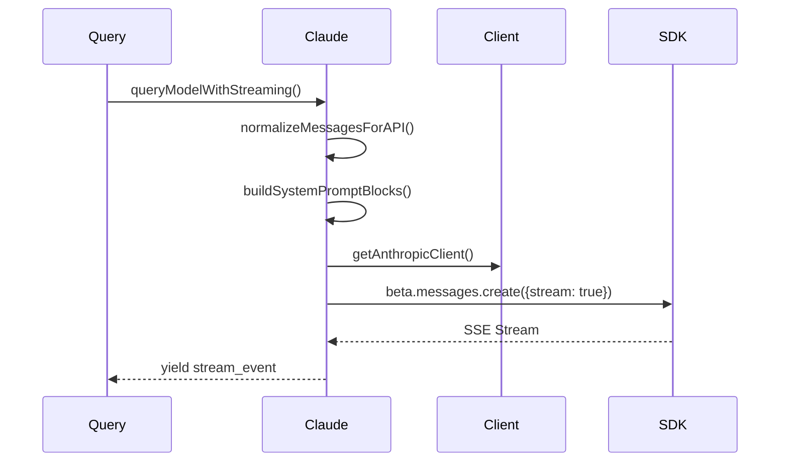

# API Client

## 概要

API 客户端服务是 Claude Code 与 Claude API 通信的核心层，负责请求构建、身份认证、流式响应处理、错误处理与重试、Token 追踪。

## 核心模块

```
src/services/api/
├── claude.ts          # 核心 API 请求逻辑
├── client.ts          # Anthropic SDK 客户端创建
├── errors.ts          # 错误类型定义
├── withRetry.ts       # 重试策略
├── logging.ts         # API 日志记录
├── usage.ts           # 配额使用追踪
```

## Provider 支持

| Provider | SDK | 认证方式 |
|----------|-----|----------|
| First Party | `Anthropic` | API Key / OAuth |
| Bedrock | `AnthropicBedrock` | AWS Credentials |
| Vertex | `AnthropicVertex` | GCP Credentials |
| Foundry | `AnthropicFoundry` | Azure AD |

## 请求流程



## 错误处理

| 错误类型 | 处理策略 |
|----------|----------|
| `authentication_error` | 重新认证 |
| `rate_limit_error` | 等待 retry-after |
| `overloaded_error` | 指数退避重试 |
| `prompt_too_long` | 触发 compact |
| `timeout_error` | 非流式降级 |

## Connections

- [Stream Processing](../concepts/stream-processing.md) - SSE 流处理
- [Token Tracking](../concepts/token-tracking.md) - 使用量追踪

## Sources

- `src/services/api/claude.ts`
- `src/services/api/client.ts`