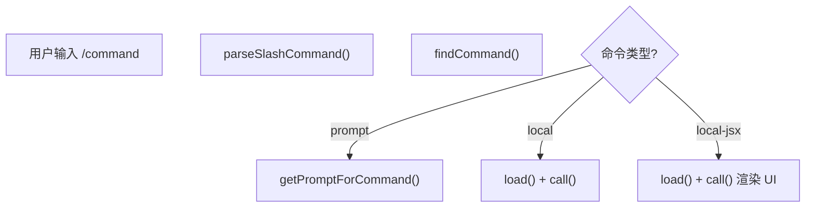

# Command Types

## 概要

Claude Code 的命令系统设计了三种执行模式，满足不同类型的任务需求。每种类型有特定的执行路径和适用场景。

## 三种命令类型

### Prompt 命令

**执行方式**：展开为提示文本发送给模型

**适用场景**：需要模型智能处理的复杂任务

**示例**：`/init`、`/commit`、`/review`

**关键字段**：
- `getPromptForCommand()`：动态构建提示内容
- `allowedTools`：限制可用工具列表
- `contentLength`：提示长度（动态内容为 0）

```typescript
type PromptCommand = {
  type: 'prompt'
  getPromptForCommand: (args, context) => Promise<ContentBlockParam[]>
  allowedTools?: string[]
  contentLength: number
}
```

### Local 命令

**执行方式**：本地同步执行返回结果

**适用场景**：纯本地操作、无需 UI 渲染

**示例**：`/compact`

**关键字段**：
- `load()`：动态加载模块
- `call()`：执行返回结果
- `supportsNonInteractive`：支持非交互模式

```typescript
type LocalCommand = {
  type: 'local'
  load: () => Promise<{ call: LocalCommandCall }>
  supportsNonInteractive?: boolean
}
```

### Local-JSX 命令

**执行方式**：渲染 React/Ink UI 界面

**适用场景**：需要用户交互的选择界面

**示例**：`/config`、`/mcp`、`/memory`

**关键字段**：
- `load()`：动态加载 JSX 模块
- `call()`：渲染 React UI

```typescript
type LocalJSXCommand = {
  type: 'local-jsx'
  load: () => Promise<{ call: LocalJSXCommandCall }>
}
```

## 命令执行流程



## 类型对比

| 特性 | prompt | local | local-jsx |
|------|--------|-------|-----------|
| 执行位置 | 模型侧 | 本地 | 本地 |
| 用户交互 | 通过模型 | 无 | React UI |
| 响应方式 | 模型输出 | 返回结果 | UI 完成回调 |
| 加载时机 | 调用时 | 调用时 | 调用时 |

## Connections

- [Bundled Skill](../entities/bundled-skill.md) - 技能作为命令的一种形式
- [技能系统](../concepts/skill-system.md) - 技能加载机制

## Sources

- `src/types/command.ts`