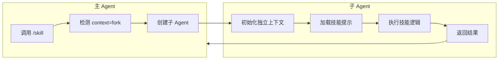

# Fork Context

## 概要

Fork Context 是技能的一种执行上下文类型，通过 `context: 'fork'` 配置使技能在独立子 Agent 中执行，拥有独立的上下文和 token 预算。

## 执行上下文对比

| 类型 | 说明 | 适用场景 |
|------|------|----------|
| `inline`（默认） | 技能内容注入当前对话 | 简单提示、快速任务 |
| `fork` | 在独立子 Agent 中执行 | 复杂任务、隔离上下文 |

## 执行流程



## Agent 类型选择

通过 `agent` 字段指定子 Agent 类型：
- `"general-purpose"`：通用 Agent
- `"Bash"`：命令执行 Agent
- 自定义 Agent 类型

## 配置示例

```yaml
---
name: complex-analysis
description: 执行复杂代码分析
context: fork
agent: general-purpose
effort: high
---
```

## 使用场景

- 不需要用户中途干预的自包含任务
- 需要独立 token 预算的大型任务
- 需要隔离上下文避免干扰主对话的任务
- 需要并行执行的多个任务

## Connections

- [技能系统](../concepts/skill-system.md) - 技能的核心概念
- [Frontmatter](../concepts/frontmatter.md) - 元数据定义

## Sources

- `src/types/command.ts`
- `src/skills/loadSkillsDir.ts`