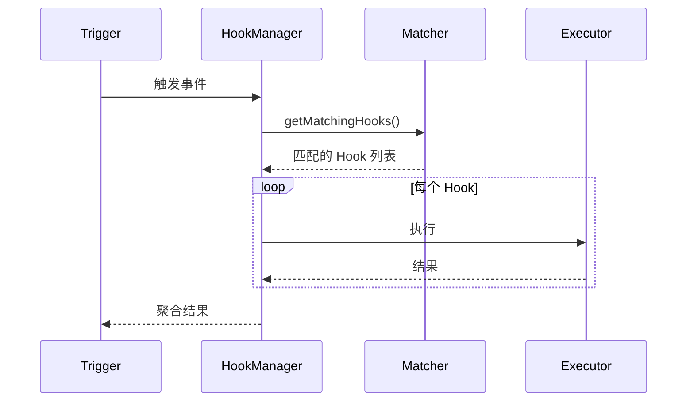

# Hook System

## 概要

Hook（钩子）系统是 Claude Code 的生命周期定制化机制，允许用户在特定事件触发时执行自定义的 shell 命令或 TypeScript 回调。

## 设计原则

1. **安全性优先**：交互模式下需要工作区信任验证
2. **异步执行**：Hook 可以异步运行，不阻塞主流程
3. **可扩展性**：支持多种 Hook 类型

## Hook 类型

| 类型 | 说明 | 执行方式 |
|------|------|----------|
| `command` | 执行 Shell 命令 | spawn shell |
| `prompt` | 使用 AI 模型执行提示 | 模型调用 |
| `agent` | 启动子代理执行任务 | 子 Agent |
| `http` | 发送 HTTP 请求 | HTTP client |
| `callback` | TypeScript 回调 | 直接调用 |
| `function` | 会话级函数 Hook | 直接调用 |

## Hook 事件分类

| 类别 | 事件 |
|------|------|
| 工具执行 | `PreToolUse`, `PostToolUse`, `PostToolUseFailure` |
| 会话 | `SessionStart`, `SessionEnd` |
| 子代理 | `SubagentStart`, `SubagentStop` |
| 压缩 | `PreCompact`, `PostCompact` |
| 权限 | `PermissionRequest`, `PermissionDenied` |
| 配置 | `ConfigChange`, `CwdChanged`, `FileChanged` |

## 执行流程

## 权限 Hook 特殊能力

`PermissionRequest` Hook 可直接决策：
- `behavior: 'allow'`：自动批准
- `behavior: 'deny'`：自动拒绝

## Connections

- [Hook Event](../concepts/hook-event.md) - 事件类型详解
- [Async Hook](../concepts/async-hook.md) - 异步执行机制

## Sources

- `src/utils/hooks.ts`
- `src/types/hooks.ts`