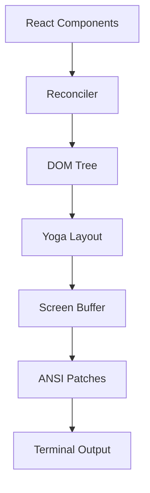

# Ink UI Framework

One-paragraph summary: Ink is a React-style terminal UI framework that brings component-based development and Flexbox layout to terminal applications through custom React reconciler, Yoga layout engine, and optimized screen diff rendering.

## Architecture Overview

Five-stage rendering pipeline:



## React Reconciler Customization

Uses `react-reconciler` package to create custom reconciler for terminal DOM:

```typescript
const reconciler = createReconciler({
  createInstance: (type, props) => createNode(type),
  createTextInstance: (text) => createTextNode(text),
  appendChild: (parent, child) => appendChildNode(parent, child),
  commitUpdate: (node, oldProps, newProps) => applyPropDiffs(node, ...),
  resetAfterCommit: (rootNode) => triggerLayoutAndRender(),
})
```

Key lifecycle:
- `createInstance`: Create DOM element nodes
- `resetAfterCommit`: Trigger layout calculation after React commit

## Yoga Layout Engine

Yoga (Facebook's Flexbox engine) provides CSS layout in terminal:

- `LayoutNode` interface abstracts yoga operations
- `YogaLayoutNode` adapter maps CSS properties to Yoga calls
- `setMeasureFunc` for text nodes to calculate text dimensions
- Layout triggered after each React commit phase

Supported styles: flexDirection, flexWrap, flexGrow, alignItems, justifyContent, gap, padding, margin, width, height, position, etc.

## Screen Buffer Design

Uses compact TypedArray storage:

```typescript
type Screen = {
  cells: Int32Array     // 2 Int32 per cell: charId + styleId|hyperlinkId|width
  cells64: BigInt64Array  // For bulk fill
  charPool: CharPool     // Shared pool, avoid string allocation
  hyperlinkPool: HyperlinkPool
  damage: Rectangle      // Optimization: only diff damaged area
}
```

Memory efficiency: 200x120 screen = ~190KB (vs ~1.2MB for object-based cells).

## Diff Rendering Optimizations

| Technique | Effect |
|-----------|--------|
| TypedArray storage | Avoid GC, SIMD-compatible |
| Character/Style pools | Cache reuse, no repeated allocation |
| Double buffering | No flicker updates |
| Blit block transfer | Skip unchanged subtrees |
| Damage tracking | Limit diff scope |
| DECSTBM scrolling | Hardware scroll vs redraw |
| Patch optimizer | Merge adjacent ANSI codes |

## ANSI Patch Optimization

Rules in `optimizer.ts`:
- Empty stdout filtering
- cursorMove merging (consecutive moves)
- cursorTo collapse (only last valid)
- styleStr concatenation (ANSI codes join)
- hyperlink deduplication
- Hide/Show cancelation (paired operations)

## Components

- **Box**: Flexbox container with tabIndex, autoFocus, event handlers
- **Text**: Text rendering with color, bold, italic, underline
- **ScrollBox**: Terminal scrolling with stickyScroll
- **AlternateScreen**: Alternative buffer mode, mouse tracking

## Connections

- [Terminal UI Rendering](../concepts/terminal-ui-rendering.md)
- [Focus and Interaction](../sources/2026-04-15-focus-and-interaction.md) - Event handling details
- [Flexbox Layout](../concepts/flexbox-layout.md)

## Open Questions

- How does Ink handle Unicode grapheme clusters?
- What are memory implications for long-running sessions?

## Sources

- `chapters/chapter-35-ink-ui框架.md`
- `/src/ink/ink.tsx`
- `/src/ink/reconciler.ts`
- `/src/ink/screen.ts`
- `/src/ink/log-update.ts`
- `/src/ink/layout/yoga.ts`