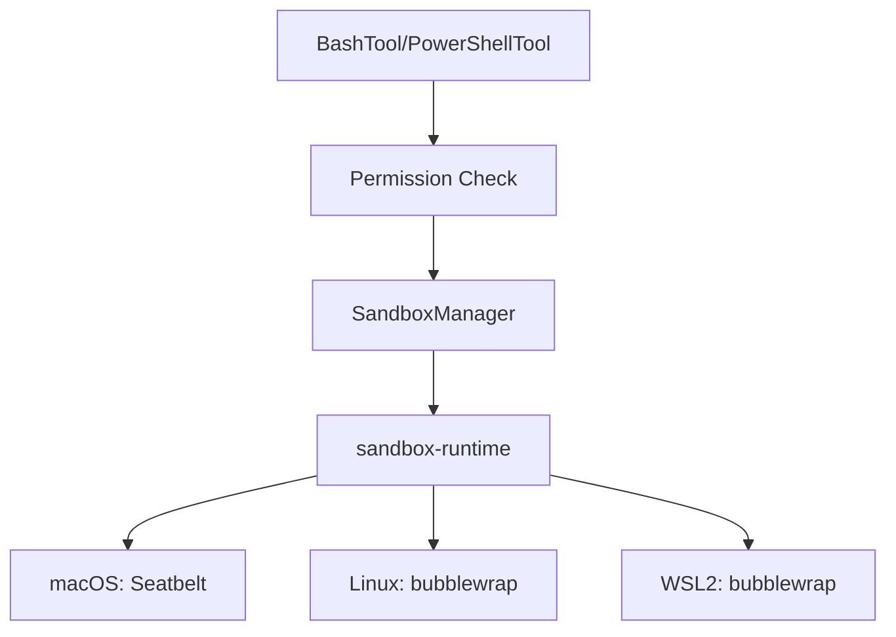

# Sandbox Security

One-paragraph summary: Sandbox is Claude Code's core security defense line, providing system-level isolation for command execution through OS-specific mechanisms (macOS Seatbelt, Linux bubblewrap) with file system access control, network isolation, and command validation.

## Architecture Layers



## SandboxManager Interface

```typescript
interface ISandboxManager {
  initialize(sandboxAskCallback?: SandboxAskCallback): Promise<void>
  isSupportedPlatform(): boolean
  isSandboxingEnabled(): boolean
  wrapWithSandbox(command: string, ...): Promise<string>
  cleanupAfterCommand(): void
  getFsReadConfig(): FsReadRestrictionConfig
  getFsWriteConfig(): FsWriteRestrictionConfig
  getNetworkRestrictionConfig(): NetworkRestrictionConfig
}
```

## File System Security

### Path Resolution

Special path prefixes:
- `//path` → Absolute path from filesystem root
- `/path` → Relative to settings file directory
- `~/path` → User home directory
- `./path` → Relative path

### Critical File Protection

Auto-added deny rules during config construction:
- Settings files (prevent sandbox escape)
- `.claude/skills` directory
- Git bare repo files (HEAD, objects, refs, hooks, config) - prevents git hook escape

### Bare Git Repo Attack Cleanup

Attack scenario: Attacker plants HEAD + objects/ + refs/ files to create fake bare repo, then git config core.fsmonitor escapes sandbox on subsequent non-sandbox git execution.

Defense: `scrubBareGitRepoFiles()` cleans planted files after each sandbox command.

## Command Execution Restrictions

### Dangerous Pattern Detection

Patterns in `DANGEROUS_BASH_PATTERNS` and `CROSS_PLATFORM_CODE_EXEC`:
- Interpreters: python, node, ruby, perl, etc.
- Package runners: npx, bunx, npm run
- Shells: bash, sh, zsh, fish
- Special: eval, exec, env, xargs, sudo, ssh

### AST-level Safety Parsing

Uses tree-sitter for Bash AST parsing with FAIL-CLOSED principle:
- Only process explicitly allowed node types
- Reject un-understood syntax structures
- `DANGEROUS_TYPES`: command_substitution, process_substitution, expansion, subshell, etc.
- `SAFE_ENV_VARS`: HOME, PWD, PATH, USER, etc. (can be expanded in static analysis)

## Security Boundary Principles

### FAIL-CLOSED

Core design: When uncertain, always choose the safer path. Never interpret un-understood syntax. If tree-sitter produces un-allowed node types, reject and ask user.

### Multi-layer Defense

1. **Permission layer**: Rule matching + user confirmation
2. **Validation layer**: AST parsing + dangerous pattern detection + path constraints
3. **Isolation layer**: File/network/process isolation
4. **Monitor layer**: Violation monitoring + post-execution cleanup

### Policy Locking

High-priority sources (`flagSettings`, `policySettings`) can lock sandbox settings, preventing local overrides.

## Network Isolation

Configuration:
- `allowedDomains`: Limit accessible domains
- `allowManagedDomainsOnly`: Enterprise policy enforcement
- `allowUnixSockets`: macOS Unix socket paths
- `allowLocalBinding`: Allow local port binding

## Connections

- [Fail-Closed Principle](../concepts/fail-closed-principle.md)
- [Sandbox Isolation](../concepts/sandbox-isolation.md)
- [Permission System](../sources/2026-04-15-permission-system.md) - First layer defense

## Open Questions

- How does sandbox handle Docker container escapes?
- What are performance implications of AST parsing?

## Sources

- `chapters/chapter-34-沙箱安全.md`
- `/src/utils/sandbox/sandbox-adapter.ts`
- `/src/utils/bash/ast.ts`
- `/src/utils/permissions/dangerousPatterns.ts`